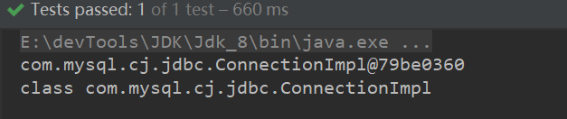
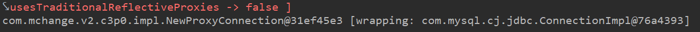
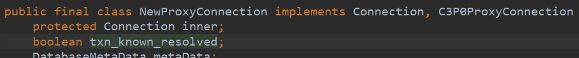
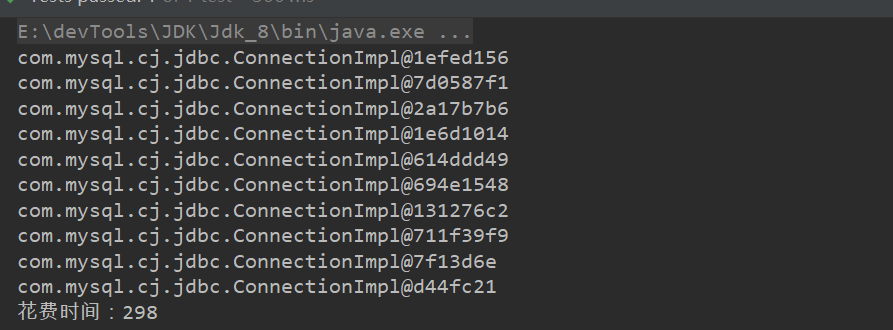
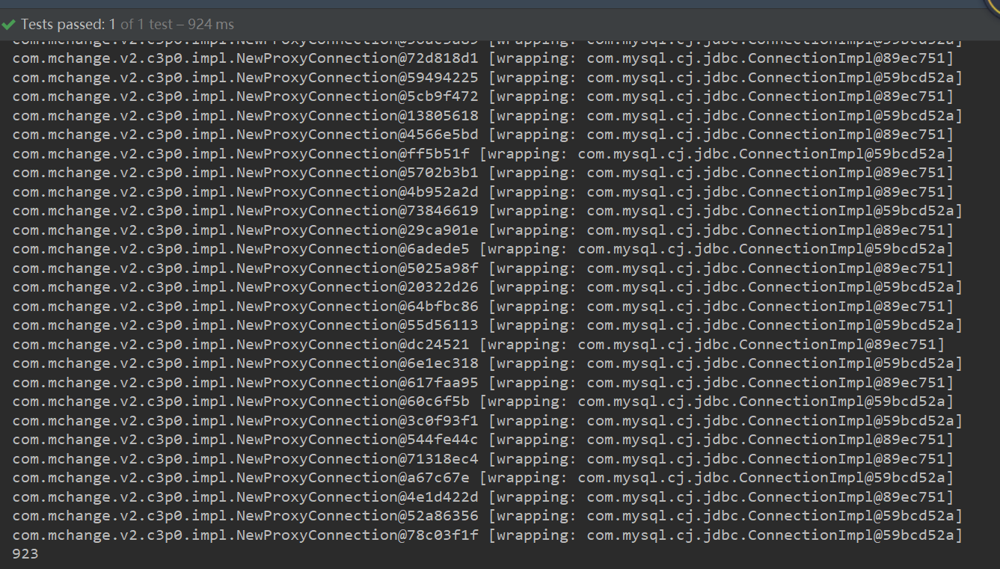
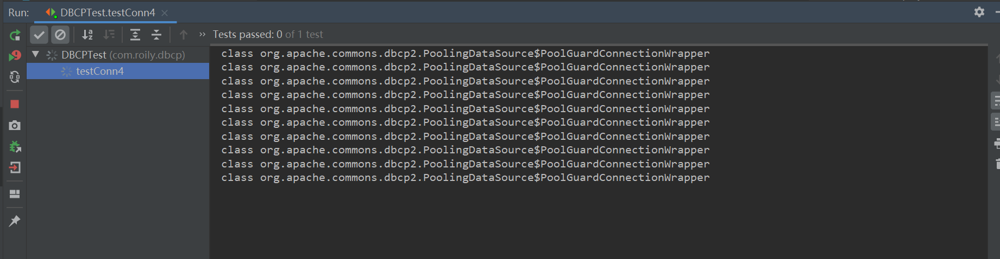
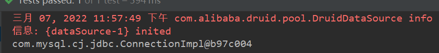
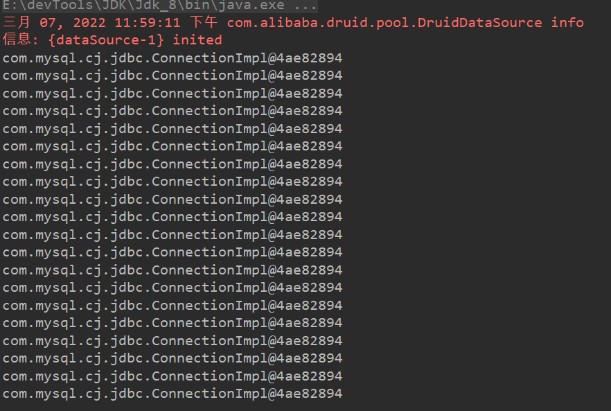
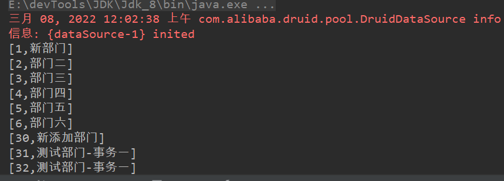

Mysql从0到0.9

此章节总结常用数据源的配置使用，以及数据库连接池。

工具：`idea`  `maven` `mysql`

> [上一篇、Mysql基础]()||[下一篇]()
>
> 代码资源：[源码]()


#### 浅聊原生JDBC工作流程

- 注册驱动
- 获取连接
- 获取`sql`会话对象 `statement`[设置参数]
- 执行`sql`获取结果集
- 关闭资源

> 几个类（或接口）:

- `DriverManger`  
- `Driver`
- `Connection`
- `Statement` & `PreparedStatement`
- `ResultSet`

> 我们是通过`DriverManger`的`getConnection`这个静态方法来获取`Connection`对象的。
>
> 查看源码发现`getConnection`方法依赖于驱动`java.sql.Driver`。
>
> 驱动是如何放入`DriverManger`类中的？

1、反射 

 ```java
Class.forName("com.mysql.cj.jdbc.Driver")
 ```

> 通过反射获取`class`对象会触发类的初始化

2、类的初始化

类的生命周期为：

①`java`文件编译成字节码文件(`class`)②类的加载  类的链接  类的初始化③使用 、 销毁

> 类的加载会将类加载进内存，同时会将被`final`修饰的成员变量，赋值（或者默认值）

> 类的链接再说

> 类的初始化  包括`cinit<>()` 和 `init<>()`。会将非`final`修饰的成员变量初始化（或默认值）。

`cinit<>()`方法会将被`static`修饰的成员变量和代码块合并执行。 

`init<>()`方法会将被非`static`修饰的成员变量和代码块合并执行。 

3、结合代码

回过头来我们看`com.mysql.cj.jdbc.Driver`这个类的初始化，发现有静态代码块,也就是静态代码块被执行了。

```java
static {
    try {
        java.sql.DriverManager.registerDriver(new Driver());
}
```

> 发现调用了`DriverManger`的`registerDriver()`方法
>
> 驱动信息会放入`CopyOnWriteArrayList<DriverInfo> registeredDrivers`这个线程安全的链表中。


#### 数据源

> 实现`DataSource`接口的类都叫数据源。也就是说`java`提供了`DataSource`接口规范，各大厂商去实现即可。

> 工具类的简单实现

>也就是说获取数据库连接`conn`不用再去找`DriverManger`每次设置配置信息来获取连接，而是通过数据源获取。

我们看一个由`mysql`自带的数据源`MysqlDataSource`

```java
public class MysqlDataSourceUtil {
    private static DataSource dataSource;
    static {
        InputStream in = MysqlDataSourceUtil.class.getClassLoader().getResourceAsStream("db.properties");
        Properties prop = new Properties();
        try {
            prop.load(in);
        } catch (IOException e) {
            e.printStackTrace();
        }
        dataSource = new MysqlDataSource();

        ((MysqlDataSource) dataSource).setUrl(prop.getProperty("url"));
        ((MysqlDataSource) dataSource).setUser(prop.getProperty("username"));
        ((MysqlDataSource) dataSource).setPassword(prop.getProperty("password"));

    }

    public static Connection getConn() {
        Connection conn = null;
        try {
            conn = dataSource.getConnection();
        } catch (SQLException e) {
            e.printStackTrace();
        }
        return conn;
    }

    public static void release(Connection conn, Statement state, ResultSet rs){

        if (conn!=null){
            try {
                conn.close();
            } catch (SQLException e) {
                e.printStackTrace();
            }
        }if (state!=null){
            try {
                state.close();
            } catch (SQLException e) {
                e.printStackTrace();
            }
        }if (rs!=null){
            try {
                rs.close();
            } catch (SQLException e) {
                e.printStackTrace();
            }
        }
    }
}
```

测试：

> 没有`junit`的话去添加一下单元测试依赖。

```java
@Test
public void test(){
    Connection conn = MysqlDataSourceUtil.getConn();
    System.out.println(conn);
    System.out.println(conn.getClass());
    MysqlDataSourceUtil.release(conn,null,null);
}
```




#### 数据库连接池

> 池化技术，或者说容器技术 在之后会有很多。线程池、进程池、数据库连接池.....
>
> 其目的都是节约资源、保证资源复用从而提升程序性能。
>
> 当然也有一定缺陷：如果设置的资源不够用就会造成阻塞，使得程序保持等待状态。

​		数据库连接池工作原理：连接(`conn`对象)放入 连接池(`pool`)中，当有业务需要数据库连接时，去连接池中取，用完后先不关闭资源，而是放入连接池中。彻底关闭的话得看具体数据源的回收机制。

#### 常用第三方数据源

- DBCP
- C3P0(不好用，不要用，不好配置，性能也一般，和`hibernate`兼容性好)
- Druid(德鲁伊，阿里巴巴开源数据源，世界上最好的数据源)

##### DBCP

配置文件：

```properties
driverClassName=com.mysql.cj.jdbc.Driver
url=jdbc:mysql://localhost:3306/mybatis_plus?useUnicode=true&charactEncoding=utf8&useSSL=true&serverTimezone=GMT%2B8
username=root
password=123456
maxTotal = 5
```

> 注意：配置文件中的`key`值不能修改,创建数据源读取配置时会去匹配`key`值。

获取连接工具类：

```java
public class DBCPDataSourceUtil {
    private static DataSource dataSource;
    static {
        InputStream in = DBCPDataSourceUtil.class.getClassLoader().getResourceAsStream("db.properties");
        Properties prop = new Properties();
        prop.load(in);
        dataSource = BasicDataSourceFactory.createDataSource(prop);
      
    }
    public static Connection getConn() {
        Connection conn = null;
        conn = dataSource.getConnection();
        return conn;
    }
    public static void release(Connection conn, Statement state, ResultSet rs){
        if (conn!=null){
            conn.close();
        }if (state!=null){           
            state.close();
        }if (rs!=null){
            rs.close();
        }
    }
}
```

> 有异常抛出异常

测试：

```java
@Test
public void testConn() {
    Connection conn = DBCPDataSourceUtil.getConn();
    System.out.println(conn);
    System.out.println(conn.getClass());
    System.out.println(conn);
    DBCPDataSourceUtil.release(conn, null, null);
}
```

> ==也是可以获取连接的==

`DBCP`是使用了数据库池化技术的，也就是连接会由连接池来管理，效率相对较高。

> 我们使用`c3p0`来验证，使用数据源拿到的连接`conn`对象是复用的。`DBCP`的`toString()`方法没有包含`conn`对象。

##### C3P0

> 不太好，配置烦，效率还不高

依赖：

```xml
<dependency>
    <groupId>com.mchange</groupId>
    <artifactId>c3p0</artifactId>
    <version>0.9.5.5</version>
</dependency>
```

配置：

> 文件名：`c3p0-config`及内部标签不可修改，源码会去匹配。

```xml
<c3p0-config>
    <named-config name="mysql">
        <property name="driverClass">com.mysql.cj.jdbc.Driver</property>
        <property name="jdbcUrl">jdbc:mysql://localhost:3306/mybatis_plus?useUnicode=true&amp;charactEncoding=utf8&amp;useSSL=true</property>
        <property name="user">root</property>
        <property name="password">123456</property>
        <property name="initialPoolSize">10</property>
        <property name="maxIdleTime">30</property>
        <property name="maxPoolSize">100</property>
        <property name="minPoolSize">10</property>
        <property name="maxStatements">200</property>
    </named-config>
    <default-config >
        <property name="driverClass">com.mysql.cj.jdbc.Driver</property>
        <property name="jdbcUrl">jdbc:mysql://localhost:3306/mybatis_plus?useUnicode=true&amp;charactEncoding=utf8&amp;useSSL=true</property>
        <property name="user">root</property>
        <property name="password">123456</property>

        <property name="initialPoolSize">10</property>
        <property name="maxIdleTime">30</property>
        <property name="maxPoolSize">100</property>
        <property name="minPoolSize">10</property>
        <property name="maxStatements">200</property>
    </default-config>
</c3p0-config>
```

连接工具类：

```java
public class C3P0Util {

    private static DataSource dataSource;

    static {
        dataSource = new ComboPooledDataSource("mysql");
    }
    public static Connection getConn() {
        Connection conn = null;
        try {
            conn = dataSource.getConnection();
        } catch (SQLException e) {
            e.printStackTrace();
        }
        return conn;
    }
    public static void release(Connection conn, Statement state, ResultSet rs);
}
```

测试：

```java
@Test
public void test2() {
    Connection conn = C3P0Util.getConn();
    System.out.println((NewProxyConnection) conn);
    C3P0Util.release(conn, null, null);
}
```



> 可以获取连接。
>
> `NewProxyConnection`==代理！！！==，这个对象的`toString()`方法还包含了`conn`信息，去看看这个类。

`conn`为这个类的属性。



`toString()`方法：

```java
public String toString() { return super.toString() + " [wrapping: " + inner + "]"; }
```

> 总结来说`NewProxyConnection`对数据库连接池里的连接进行代理，再而进行`jdbc`操作。


验证从连接池获取连接，连接可以复用

- 普通`DataSource`

  - ```java
    @Test
    public void test2(){
        long startTime = new Date().getTime();
        for (int i = 0; i < 10; i++) {
            Connection conn = MysqlDataSourceUtil.getConn();
            System.out.println(conn);
            MysqlDataSourceUtil.release(conn,null,null);
        }
        long endTime = new Date().getTime();
        System.out.println("花费时间："+(endTime-startTime));
    }
    ```

  - 

  > 每次都创建新的`conn`,没有实现复用

- 使用连接池

  - ```java
    @Test
    public void test() {
        long start = new Date().getTime();
        System.out.println(start);
        for (int i = 0; i < 40; i++) {
            Connection conn = C3P0Util.getConn();
            System.out.println(conn);
            C3P0Util.release(conn, null, null);
        }
        System.out.println(new Date().getTime() -start);
    }
    ```

  - 

  > 从结果看来，在连接池容量足够时会创建新的`conn`放入连接池，但随着连接数量的上升，在尾部都是从连接池中回去`conn`，也就实现了`conn`复用。

验证从连接池获取连接，当连接都被占用，且没有释放资源时，程序会阻塞。

配置：

> `dbcp`数据库配置文件设置最大连接数为10

```properties
maxTotal = 10
```

测试：

获取100次连接，且不释放资源

```java
@Test
public void testConn4() throws SQLException {
    for (int i = 0; i < 100; i++) {
        Connection conn = DBCPDataSourceUtil.getConn();
        Class<?>[] interfaces = conn.getClass().getInterfaces();
        System.out.println(conn.getClass());
        //DBCPDataSourceUtil.release(conn, null, null);
    }
}
```

结果：

程序卡死，一直等待释放`conn`连接资源。



##### Druid

> `Druid`是最好的数据源，只有`SpringBoot`默认数据源`HiKariCp`在执行速度上优于`Druid`

配置：

> 这里还有很多附加配置，超时范围等等。

```properties
url=jdbc:mysql://localhost:3306/mybatis_plus?useUnicode=true&charactEncoding=utf8&useSSL=true
username=root
jdbc.max=20
driverClassName=com.mysql.cj.jdbc.Driver
password=123456
```

工具类：

```java
public class DruidUtil {
    private static DataSource dataSource;
    static {
        InputStream in = DruidUtil.class.getClassLoader().getResourceAsStream("druid.properties");
        Properties prop = new Properties();
        try {
            prop.load(in);
            dataSource = DruidDataSourceFactory.createDataSource(prop);
        } catch (Exception e) {
            e.printStackTrace();
        }
    }
    public static Connection getConn() {
        Connection conn = null;
        try {
            conn = dataSource.getConnection();
        } catch (SQLException e) {
            e.printStackTrace();
        }
        return conn;
    }

    public static void release(Connection conn, Statement state, ResultSet rs); 
}
```

测试：

```java
@Test
public void test01(){
    Connection conn = DruidUtil.getConn();
    System.out.println(conn);
    DruidUtil.release(conn,null,null);
}
```



> 可以获取连接


测试连接是否可以复用

```java
@Test
public void test02(){
    for (int i = 0; i < 20; i++) {
        Connection conn = DruidUtil.getConn();
        System.out.println(conn);
        DruidUtil.release(conn,null,null);
    }
}
```



> 复用率很高，也可能和我的配置有关，小伙伴们自行了解。


在以上我们都没有执行`sql`,但我们清楚得到`conn`对象就可以操作数据库了，这里简单测试。

```java
@Test
public void test03() throws SQLException {
    Connection conn = DruidUtil.getConn();
    String sql = "select * from department";
    PreparedStatement prep = conn.prepareStatement(sql);
    ResultSet resultSet = prep.executeQuery();
    while (resultSet.next()) {
        System.out.println("[" + resultSet.getObject(1) +
                           "," +
                           resultSet.getObject(2) + "]");
    }
    DruidUtil.release(conn, prep, resultSet);
}
```



也是ok的

> ​	`Druid`是阿里的开源项目，还是很吊的，不仅仅只用来连接数据库，对于各大`ORM`自动映射框架都有支持。而且提供了`sql`监控功能、`sql`防护墙防止`sql`注入、以及可视化`sql`管理界面。
>
> ​	并且`SpringBoot`关于`Druid`的配置非常简单。
>
> ​	我们这里用来理解原理，真正使用，一定不会这么用的。