# mongodb学习


## 基础

### 安装

### 工具


### 概念

- database：数据库
- collection  集合 ==> sql中的table
- document  文档  ==> sql中的row
- field  属性（域）  ===> sql中的column
- index 索引
- primary  key   主键   mongodb会自动生成一个主键：'_id'


## crud

> 使用`mongosh`连接mongodb实例。

### 数据库

> 查看所有数据库：

```bash
show dbs;
```

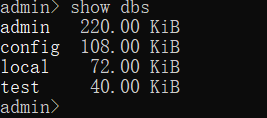


> 创建数据库

```powershell
use testdb;
```


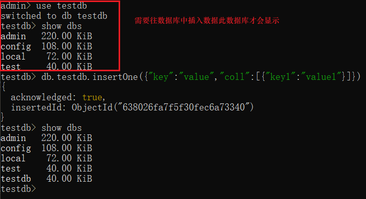

> 删除数据库。
>
> db命令可查看当前数据库名称

```powershell
db;
db.dropDatabase('testdb');
```

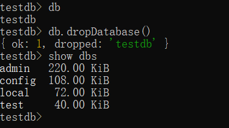

### 集合


#### 创建集合，查看集合

options可选参数：

```powershell
db.createCollection("collectionname",options);

show collections;
show tables;
```

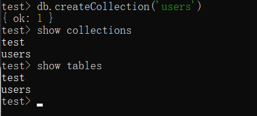


> 无需创建集合，往集合插入数据时自动创建。

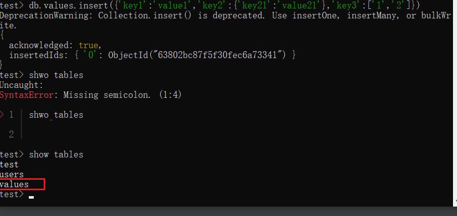

#### 删除集合

```powershell
db.collection.drop();
```

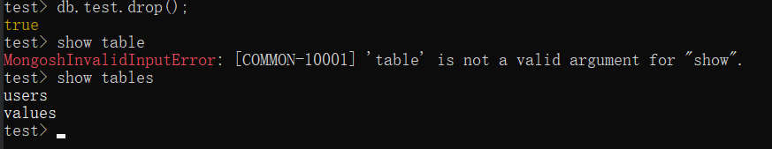


#### 重命名集合

> dropTaget  为true  如果目标名称以及存在则会先删除目标集合

```shell
db.collection.renameCollection(target, dropTarget)
```

```shell
test> test> db.sstu.renameCollection('myCol',true)
{ ok: 1 }
```


### 文档

#### 插入文档

> 插入文档到集合中，文档的数据结构和 JSON 基本一样。所有存储在集合中的数据都是 BSON 格式。
>
> BSON 是一种类似 JSON 的二进制形式的存储格式，是 Binary JSON 的简称。
>
> 如果当下集合不存在，插入动作将会创建该集合。

##### api

```shell
db.collection.insert();
db.collection.insertOne();
db.collection.insertMany();
```

##### insert({})

> 可选择插入单个，也可选择插入多个

```powershell
db.collection.insert(
   <document or array of documents>,
   {
     writeConcern: <document>,
     ordered: <boolean>
   }
)
```

例：

```json
db.valuse.insert(
    [
       {
           user2:{
               username:'rolyfish',
               userage:22
           }
       }
    ],
    {
       writeConcern:1,
       ordered:true
    }
)
```

#####  db.insertOne({})

```powershell
db.collection.insertOne(
   <document>,
   {
      writeConcern: <document>
   }
)
```

例：

```json
db.values.insertOne(
  {
  user2: {
    username: 'rolyfish',
    userage: 22
  }
  },
  {
    writeConcern: 1
  }
)
```

#####  db.insertMany([])

```powershell
db.collection.insertMany(
   [ <document 1> , <document 2>, ... ],
   {
      writeConcern: <document>,
      ordered: <boolean>
   }
)
```

```json
db.values.insertMany(
  [
    {
      user2: {
        username: 'username',
        userage: 22
      }
    }
  ],
  {
  writeConcern: 1,
  ordered: true
  }
)
```

参数说明：

- document：要写入的文档。
- writeConcern：写入策略，默认为 1，即要求确认写操作，0 是不要求。
- ordered：指定是否按顺序写入，默认 true，按顺序写入。

##### 插入预定义元素

> 可以先预定义属性再执行插入

```powershell
test> var users = [{user:{username:'user1',userage:1}},{user:{username:'user1',userage:1}},{user:{username:'user1',userage:1}}]

test> db.users.insert(users)
{
  acknowledged: true,
  insertedIds: {
    '0': ObjectId("638078333b88d4e3465dde03"),
    '1': ObjectId("638078333b88d4e3465dde04"),
    '2': ObjectId("638078333b88d4e3465dde05")
  }
}
```


#### 查询文档(query document)

> 初始化数据

[官网例子]([https://www.mongodb.com/docs/v3.6/tutorial/query-documents/)

##### 查询集合中所有文档

```powershell
db.collection.find({})
```

```sql
select * from table
```

##### 条件查询

- 简单等于匹配

> `{ <field1>: <value1>, ... }`

>以下例子field为  field.field

```powershell
 db.inventory.find({'size.h':8.5})
```

- 查询操作符 in

  > `{ <field1>: { <operator1>: <value1> }, ... }`

```shell
db.inventory.find({'status':{$in:['A','D']}})
```

- 查询操作符lt  lte  gt   gte

```powershell
db.inventory.find({'size.h':{$gt:20}});
db.inventory.find({'size.h':{$lt:20}})
db.inventory.find({'size.h':{$lte:10}})
db.inventory.find({'size.h':{$gte:10}})
```

- and 且条件

```powershell
db.inventory.find({'status':'A','size.h':{$gte:10}})
```

等价于关系型数据库条件查询语句：

```sql
select * from inventory where status = A and size.h >= 10
```

- 条件or

```powershell
 db.inventory.find({$or:[{'status':'A'},{'qty':{$gte:45}}]})
```

```sql
select * from inventory where status = A or qty >= 45
```

```shell
db.inventory.find({$or:[{'status':'A'},{'qty':{$gte:45}}], 'size.h':{$gt:20}})
```

```sql
select * from inventory where (status = A or qty >= 45) and size.h > 20
```

##### 查询集合

初始化数据

```powershell
db.col.insertMany([
   { item: "journal", qty: 25, tags: ["blank", "red"], dim_cm: [ 14, 21 ] },
   { item: "notebook", qty: 50, tags: ["red", "blank"], dim_cm: [ 14, 21 ] },
   { item: "paper", qty: 100, tags: ["red", "blank", "plain"], dim_cm: [ 14, 21 ] },
   { item: "planner", qty: 75, tags: ["blank", "red"], dim_cm: [ 22.85, 30 ] },
   { item: "postcard", qty: 45, tags: ["blue"], dim_cm: [ 10, 15.25 ] }
]);
```

- 集合判等

> 以下例子就是集合完全相等包括元素个数，顺序以及值

```powershell
db.col.find( { tags: ["red", "blank"]})
```

- 查询操作符  `$all`

> 以下例子匹配都包含red和blank元素的集合，但是不关心其顺序的集合

```powershell
db.col.find( { tags: { $all: ["red", "blank"]}})
```

- 集合包含一个元素

> 集合中至少有一个元素匹配

```powershell
db.col.find({tags:'blank'})
db.col.find({dim_cm:{$gt:10,$lt:20}})
```

- `.`操作符指定下标

> 指定集合的指定元素匹配条件。
>
> 指定下标即可

```powershell
db.col.find({'dim_cm.0': { $gt: 19, $lt: 30 }})
```

- 匹配集合个数

```powershell
db.col.find({'tags': { $size: 2 }})
```

##### 查询嵌入文档集合

> 集合中的元素不是字符串，而是对象。

初始化数据

```powershell
db.cole.insertMany( [
{ item: "journal", instock: [ { warehouse: "A", qty: 5 }, { warehouse: "C", qty: 15 } ] },
{ item: "notebook", instock: [ { warehouse: "C", qty: 5 } ] },
{ item: "paper", instock: [ { warehouse: "A", qty: 60 }, { warehouse: "B", qty: 15 } ] },
{ item: "planner", instock: [ { warehouse: "A", qty: 40 }, { warehouse: "B", qty: 5 } ] },
{ item: "postcard", instock: [ { warehouse: "B", qty: 15 }, { warehouse: "C", qty: 35 } ] }
]);
```

- 集合中包含文档

> instock集合中至少有一个文档元素匹配指定条件。
>
> 需要注意的是:{ warehouse: "A", qty: 5 }顺序不可倒

```powershell
db.cole.find({instock:{ warehouse: "A", qty: 5 }})
```

- 集合中文档属性

> instock集合中至少有一个元素对象的qty属性大于15

````shell
db.cole.find({'instock.qty':{$gt:15}});
````

- 忽略第一点顺序过滤

> 第一点注重属性顺序，可以使用$elemMatch忽略顺序

```powershell
db.cole.find( { "instock": {$elemMatch:{qty:15, warehouse: "B"}}})
```


##### 返回指定属性

> find()方法默认返回所有属性，可通过手动设置返回属性。

```powershell
 db.collection.find(
 	{query operator},
 	{<field>:0/1 ......}
 )
```

```powershell
 db.inventory.find({status:'D'},{_id:0,item:1,status:1,size:1});
```

##### 操作符

> $type,属性操作符。
>
> 以下例子为：匹配item属性为字符串的文档

```powershell
 db.cole.find({item:{$type:2}})
```

BSON   type列表：

| Type                    | Number | Alias                 | Notes               |
| :---------------------- | :----- | :-------------------- | :------------------ |
| Double                  | 1      | “double”              |                     |
| String                  | 2      | “string”              |                     |
| Object                  | 3      | “object”              |                     |
| Array                   | 4      | “array”               |                     |
| Binary data             | 5      | “binData”             |                     |
| Undefined               | 6      | “undefined”           | Deprecated.         |
| ObjectId                | 7      | “objectId”            |                     |
| Boolean                 | 8      | “bool”                |                     |
| Date                    | 9      | “date”                |                     |
| Null                    | 10     | “null”                |                     |
| Regular Expression      | 11     | “regex”               |                     |
| DBPointer               | 12     | “dbPointer”           | Deprecated.         |
| JavaScript              | 13     | “javascript”          |                     |
| Symbol                  | 14     | “symbol”              | Deprecated.         |
| JavaScript (with scope) | 15     | “javascriptWithScope” |                     |
| 32-bit integer          | 16     | “int”                 |                     |
| Timestamp               | 17     | “timestamp”           |                     |
| 64-bit integer          | 18     | “long”                |                     |
| Decimal128              | 19     | “decimal”             | New in version 3.4. |
| Min key                 | -1     | “minKey”              |                     |
| Max key                 | 127    | “maxKey”              |                     |

> 查询属性为null 和 属性不存在的文档。 
>
> $exists,    属性是否存在

```powershell
-- item  属性为null
db.cole.find({item:null})
-- iteam 属性不存在
db.cole.find({itemx:{$exists:false}})
```

#### 更新文档

初始化数据

```powershell
var users = 
[
  {name:'rolyfish',age:18,hobby:['game','ball'],status:'A'},
  {name:'xiaoming',age:21,hobby:['game','run'],status:'B'},
  {name:'xiaohong',age:20,hobby:['game','ball'],status:'B'},
  {name:'tangsan',age:23,hobby:['game','ball'],status:'A'}
];
db.users.insertMany(users);
```


updateApi:

```powershell
db.collection.updateOne();
db.collection.updateMany();
db.collection.replaceOne();
db.collection.update();
```

updateForm:

```powershell
{
  <update operator>: { <field1>: <value1>, ... },
  <update operator>: { <field2>: <value2>, ... },
  ...
}
```

一些更新选项比如$set，当属性不存在时会创建属性。

##### 属性

| Name                                                         | Description                                                  |
| :----------------------------------------------------------- | :----------------------------------------------------------- |
| [`$currentDate`](https://www.mongodb.com/docs/manual/reference/operator/update/currentDate/#mongodb-update-up.-currentDate) | Sets the value of a field to current date, either as a Date or a Timestamp. |
| [`$inc`](https://www.mongodb.com/docs/manual/reference/operator/update/inc/#mongodb-update-up.-inc) | Increments the value of the field by the specified amount.   |
| [`$min`](https://www.mongodb.com/docs/manual/reference/operator/update/min/#mongodb-update-up.-min) | Only updates the field if the specified value is less than the existing field value. |
| [`$max`](https://www.mongodb.com/docs/manual/reference/operator/update/max/#mongodb-update-up.-max) | Only updates the field if the specified value is greater than the existing field value. |
| [`$mul`](https://www.mongodb.com/docs/manual/reference/operator/update/mul/#mongodb-update-up.-mul) | Multiplies the value of the field by the specified amount.   |
| [`$rename`](https://www.mongodb.com/docs/manual/reference/operator/update/rename/#mongodb-update-up.-rename) | Renames a field.                                             |
| [`$set`](https://www.mongodb.com/docs/manual/reference/operator/update/set/#mongodb-update-up.-set) | Sets the value of a field in a document.                     |
| [`$setOnInsert`](https://www.mongodb.com/docs/manual/reference/operator/update/setOnInsert/#mongodb-update-up.-setOnInsert) | Sets the value of a field if an update results in an insert of a document. Has no effect on update operations that modify existing documents. |
| [`$unset`](https://www.mongodb.com/docs/manual/reference/operator/update/unset/#mongodb-update-up.-unset) | Removes the specified field from a document.                 |

> 更新操作符$set用法.

filter operator  +    set operator

```powershell
db.users.updateOne({name:'tangsan'},{$set:{age:20}})
```

如果更新的属性不存在则该文档创建属性

```powershell
db.users.updateOne({name:'tangsan'},{$set:{sex:0}})
```

> 跟新操作符 `$max   $min`  

{age:29}  如果29j较大则更新，否则不更新

```powershell
db.users.updateOne({name:'rolyfish'},{$max:{age:29}})
```

`$min`也是同样

```powershell
 db.users.updateOne({name:'rolyfish'},{$min:{age:29}})
```

> `$mul`  指定属性乘以指定数值。
>
> 以下例子age×2

```powershell
db.users.updateOne({name:'rolyfish'},{$mul:{age:2}})
```

> `$remane`重命名属性

```powershell
db.users.updateOne({name:'rolyfish'},{$rename:{age:'ages'}})
```

> $setOnInsert
>
> 如果update的更新参数upsert:true，也就是如果要更新的文档不存在的话会插入一条新的记录，`$setOnInsert`操作符会将指定的值赋值给指定的字段，如果要更新的文档存在那么`$setOnInsert`操作符不做任何处理；

```powershell
-- 不做处理
db.users.updateOne(
  {name:'tangsan'},
  {$setOnInsert:{value:'setOnInsert'}},
  {upsert:true}
)
-- 插入  user{name:'tangsanx',value:'setOnInsert'}
db.users.updateOne(
  {name:'tangsanx'},
  {$setOnInsert:{value:'setOnInsert'}},
  {upsert:true}
)
```

> `$inc`  增量

```powershell
db.users.updateOne({name:'tangsan'},{$inc:{age:10}})
```

> `$unset`  移除某个文档的指定属性

```powershell
db.users.updateOne({name:'tangsan'},{$unset:{age:'',sex:''}})
```

> `$currentDate`更新日期为当前时间.
>
> 如果字段不存在则创建该字段。
>
> 属性操作符`$type`可修改属性

```shell
db.users.updateOne({name:'tangsan'},{$currentDate:{modifilyDate:true}});

db.users.updateOne({name:'tangsan'},{$currentDate:{modifilyTimestamp:{$type:`timestamp`}}})
```

##### 集合

| Name                                                         | Description                                                  |
| :----------------------------------------------------------- | :----------------------------------------------------------- |
| [`$`](https://www.mongodb.com/docs/manual/reference/operator/update/positional/#mongodb-update-up.-) | Acts as a placeholder to update the first element that matches the query condition. |
| [`$[]`](https://www.mongodb.com/docs/manual/reference/operator/update/positional-all/#mongodb-update-up.---) | Acts as a placeholder to update all elements in an array for the documents that match the query condition. |
| [`$[identifier]`](https://www.mongodb.com/docs/manual/reference/operator/update/positional-filtered/#mongodb-update-up.---identifier--) | Acts as a placeholder to update all elements that match the `arrayFilters` condition for the documents that match the query condition. |
| [`$addToSet`](https://www.mongodb.com/docs/manual/reference/operator/update/addToSet/#mongodb-update-up.-addToSet) | Adds elements to an array only if they do not already exist in the set. |
| [`$pop`](https://www.mongodb.com/docs/manual/reference/operator/update/pop/#mongodb-update-up.-pop) | Removes the first or last item of an array.                  |
| [`$pull`](https://www.mongodb.com/docs/manual/reference/operator/update/pull/#mongodb-update-up.-pull) | Removes all array elements that match a specified query.     |
| [`$push`](https://www.mongodb.com/docs/manual/reference/operator/update/push/#mongodb-update-up.-push) | Adds an item to an array.                                    |
| [`$pullAll`](https://www.mongodb.com/docs/manual/reference/operator/update/pullAll/#mongodb-update-up.-pullAll) | Removes all matching values from an array.                   |


初始化数据：

```shell
var stus = [{ "_id" : 1, "grades" : [ 85, 82, 80 ] },
{ "_id" : 2, "grades" : [ 88, 90, 92 ] },
{ "_id" : 3, "grades" : [ 85, 100, 90 ] }];
db.collection.insertMany(stus);
```

> `$`更新匹配到的首个集合内的首个元素

```shell
db.collection.updateOne(
   { <query selector> },
   { <update operator>: { "array.$.field" : value } }
)
```

```shell
 ## query filter中匹配文档条件必须有集合。可以匹配到多个
 db.stus.updateOne(
 		{_id:1,grades:80},
 		{$set:{'grades.$':80}}
 );
```

> `$[]`。更新匹配到的首个集合内的所有元素

```shell
db.collection.updateOne(
   { <query conditions> },
   { <update operator>: { "<array>.$[].field" : value } }
)
```

```shell
db.stus.updateOne(
		{grades:99},
		{$set:{'grades.$[]':999}}
)
```

```json
var stus = [
  {
    'name': 'rolyfiush',
    'grades': [
      {
        'name': 'math',
        'source': 90,
        'sort': 1
      },
      {
        'name': 'english',
        'source': 85,
        'sort': 2
      },
      {
        'name': 'chinese',
        'source': 90,
        'sort': 1
      }
    ]
  },
  {
    'name': 'lizicheng',
    'grades': [
      {
        'name': 'math',
        'source': 90,
        'sort': 1
      },
      {
        'name': 'english',
        'source': 85,
        'sort': 2
      },
      {
        'name': 'chinese',
        'source': 90,
        'sort': 1
      }
    ]
  },
  {
    'name': 'chuangwang',
    'grades': [
      {
        'name': 'math',
        'source': 90,
        'sort': 1
      },
      {
        'name': 'english',
        'source': 85,
        'sort': 2
      },
      {
        'name': 'chinese',
        'source': 90,
        'sort': 1
      }
    ]
  }
];
db.stus.insertMany(stus);
```

```shell
db.stus.updateOne(
		{name:'rolyfish'},
		{$set:{'grades.$[].sort':11}}
)
```

> `$[identifier]`。带有过滤条件,该`arrayFilters`参数允许您指定过滤文档的数组，以确定要修改的数组元素。identifier为符合过滤条件的数组元素

```shell
db.collection.updateOne(
   { <query conditions> },
   { <update operator>: { "<array>.$[<identifier>]" : value } },
   { arrayFilters: [ { <identifier>: <condition> } ] }
)
```

```shell
db.stus.updateOne(
		{name:'lizicheng'},
		{$set:{'grades.$[ele].sort':2}},
		{arrayFilters:[{'ele.name':'math'}]}
)
```

> `$addToSet`,addToSet操作添加一个元素到数组除非该元素已经存在。

```shell
db.sources.insertMany({'a','b','c'});
```

```shell
## 不做操作
db.sources.updateOne({},{$addToSet:{sources:'c'}});
## 添加元素 ‘d’到集合
db.sources.updateOne({},{$addToSet:{sources:'d'}});
## 添加元素['d','e']到集合
db.sources.updateOne({},{$addToSet:{sources:['d','e']}})
## 想要批量添加元素  则使用$each操作符
db.sources.updateOne({},{$addToSet:{sources:{$each:['x','y','z']}}})
```

> `$pop`,弹出一个集合元素，1 从右边弹出， -1 从左边弹出

```shell
{ $pop: { <field>: <-1 | 1>, ... } };
```

```shell
db.sources.updateOne({},{$pop:{sources:1}});
```

> `$pull`  从一个已存在的集合中移出匹配元素。只移出匹配元素，未匹配元素忽略

```shell
db.sources.updateOne({},{$pull:{sources:{$in:['b','c','x']}}});
```

> `$push`  从一个已存在的集合中插入指定元素。可重复

```shell
## 初始化集合
db.students.insertOne( { _id: 1, scores: [ 44, 78, 38, 80 ] } )
## ok  可以插入
db.students.updateOne({},{$push:{scores:80}});
## 使用$each控制符 插入多个元素
db.students.updateOne({},{$push:{scores:{$each:[10,20,30]}}});
## 使用$sort 控制符可进行排序
db.students.updateOne({},{$push:{scores:{$each:[],$sort:1}}});
## 使用$slice 截断数组  保留前三个，如果存在排序控制则阶段发生在排序之后
db.students.updateOne({},{$push:{scores:{$each:[],$slice:3}}});
```

> `$pullAll`

```shell
db.students.updateOne({},{$push:{scores:{$each:[10,20,30,10,20,30],$sort:1}}});
## 和$pull一样，可以一次性移出多个匹配值。只是语法差异
db.students.updateOne({},{$pullAll:{scores:[10,20]}});
```

##### Modifiers

| Name                                                         | Description                                                  |
| :----------------------------------------------------------- | :----------------------------------------------------------- |
| [`$each`](https://www.mongodb.com/docs/v3.6/reference/operator/update/each/#up._S_each) | Modifies the [`$push`](https://www.mongodb.com/docs/v3.6/reference/operator/update/push/#up._S_push) and [`$addToSet`](https://www.mongodb.com/docs/v3.6/reference/operator/update/addToSet/#up._S_addToSet) operators to append multiple items for array updates. |
| [`$position`](https://www.mongodb.com/docs/v3.6/reference/operator/update/position/#up._S_position) | Modifies the [`$push`](https://www.mongodb.com/docs/v3.6/reference/operator/update/push/#up._S_push) operator to specify the position in the array to add elements. |
| [`$slice`](https://www.mongodb.com/docs/v3.6/reference/operator/update/slice/#up._S_slice) | Modifies the [`$push`](https://www.mongodb.com/docs/v3.6/reference/operator/update/push/#up._S_push) operator to limit the size of updated arrays. |
| [`$sort`](https://www.mongodb.com/docs/v3.6/reference/operator/update/sort/#up._S_sort) | Modifies the [`$push`](https://www.mongodb.com/docs/v3.6/reference/operator/update/push/#up._S_push) operator to reorder documents stored in an array. |

控制符，`$each 所有 、$slice 截断数组、$sort 排序（1、-1）`

`$position`可指定元素位置，比如插入位置

```shell
## 从数组下标为1处开始插入元素
db.students.updateOne({},{$push:{scores:{$each:[1,2,3],$position:1}}});

```

#### 删除指定文档

Api:

```shell
db.collection.deleteOne(
   <filter>,
   {
      writeConcern: <document>,## 写入策略，可设置超时响应等
      collation: <document> 
   }
)

db.collection.deleteMany(
   <filter>,
   {
      writeConcern: <document>,
      collation: <document>
   }
)
```


```shell
db.col.insertMany(
  [
    { _id: 1, category: "café", status: "A" }, 
    { _id: 2, category: "cafe", status: "a" }, 
    { _id: 3, category: "cafE", status: "a" }
  ]
)
```

```shell
db.col.deleteOne({status:'a'})
db.col.deleteMany({status:'a'})
```

##### remove

> remove方法也可以移出元素

```shell
db.collection.remove(
   <query>,
   {
     justOne: <boolean>,
     writeConcern: <document>,
     collation: <document>
   }
)
```

```shell
db.col.remove({status:'a'},{justOne:true})
```


#### bulkWrite

> 批量操作

api：

`bulkWrite()`

form:

```shell
db.collection.bulkWrite(
   [ <operation 1>, <operation 2>, ... ],
   {
      writeConcern : <document>,
      ordered : <boolean>
   }
)
```

> `bulkWrite`方法支持如下写操作：

- insertOne
- updateOne
- updateMany
- replaceOne
- deleteOne
- deleteMany


##### insertOne

> 插入单个文档到集合

form:

```powershell
db.collection.bulkWrite( [
   { insertOne : { "document" : <document> } }
] )
```

例子：

```shell
 db.users.bulkWrite([
 	{insertOne:{name:'yuyc',age:'22'}}
 ])
```

> 效果等同于

```shell
 db.users.insertOne(
 	{name:'yuyc',age:22}
 )
```

##### updateOne & updateMany

form:

```shell
db.collection.bulkWrite( [
   { updateOne :
      {
         "filter" : <document>,
         "update" : <document>,
         "upsert" : <boolean>,
         "collation": <document>,
         "arrayFilters": [ <filterdocument1>, ... ]
      }
   }
] )
```

```powershell
db.stus.bulkWrite([
    {
        updateOne:{
            filter:{name:'chuangwangx'},
            update:{$set:{'grades.$[e].sort':2}},
            upsert:true,
            arrayFilters:[{'e.name':'math'}]
        }
    }
])
```

```shell
db.stus.bulkWrite([ 
    { 
        updateMany: {
            filter: {}, 
            update: { $set: { 'grades.$[e].sort': 111 } }, 
            arrayFilters: [{ 'e.name': 'math' ,'e.source':{$gt:88}}] } 
    }
])
```

##### deleteOne & deleteMany

form:

```she
db.collection.bulkWrite([
   { deleteOne :  { "filter" : <document> } }
] )
```

例子：

```shell
 db.stus.bulkWrite([
 	{
 		deleteOne:{
 			filter:{'grades.sort':{$gte:110}}}
     }
])
```

```shell
 db.stus.bulkWrite([
 	{
 		deleteMany:{
 			filter:{'grades.sort':{$gte:111}}}
     }
])
```


##### replcaeOne

form

```shell
db.collection.bulkWrite([
   { replaceOne :
      {
         "filter" : <document>,
         "replacement" : <document>,
         "upsert" : <boolean>,
         "collation": <document>,                    // Available starting in 3.4
         "hint": <document|string>                   // Available starting in 4.2.1
      }
   }
] )
```

例子：

```shell
db.stus.bulkWrite([
	{
		replaceOne:{
			filter:{name:'lizicheng'},
			replacement:{name:'replace'}}
     }
])
```

#### other Api

> collection的其他方法

##### count

> 返回集合文档个数

form:

```shell
db.collection.count(query, options)
```

```shell
test> db.inventory.count()
5
test> db.inventory.countDocuments()
5
test> db.inventory.estimatedDocumentCount()
```

> 可以设置查询条件

```shell
db.inventory.count({item:'paper'})
```

##### distinct

> 去重，输出不重复数组。
>
> 可指定输出字段、查询过滤条件

form：

```shell
db.collection.distinct(field, query, options)
```

- field    String
- query document
- option   document

```shell
db.col.bulkWrite([
        {
            insertOne:{"_id": 1, "dept": "A", "item": { "sku": "111", "color": "red" }, "sizes": [ "S", "M" ]}
        },
        {
            insertOne:{ "_id": 2, "dept": "A", "item": { "sku": "111", "color": "blue" }, "sizes": [ "M", "L" ] }
        },
        {
            insertOne:{ "_id": 3, "dept": "B", "item": { "sku": "222", "color": "blue" }, "sizes": "S" }
        },
        {
            insertOne:{ "_id": 4, "dept": "A", "item": { "sku": "333", "color": "black" }, "sizes": [ "S" ] }
        },
    ]
)
```

######  从属性中返回不重复值


```shell
test> db.col.distinct(<field>)

test> db.col.distinct('dept')
[ 'A', 'B' ]
```


###### 从文档中返回不重复值

> 从一个对象（嵌入文档）返回不重复数据

```shell
test> db.col.distinct( "item.sku" )
[ '111', '222', '333' ]
```


###### 从集合中返回不重复值

```powershell
test> db.col.distinct('sizes')
[ 'L', 'M', 'S' ]
```


###### 可添加查询条件

```shell
test> db.col.distinct('sizes',{dept:'A'})
[ 'L', 'M', 'S' ]
```


##### explain


##### findAndModify

> 更新文档，并默认返回旧文档记录，通过new：true返回更新后的文档记录

  ```shell
db.collection.findAndModify({
    query: <document>,
    sort: <document>,  ## -1 从后往前排序修改第一个 1 反之
    remove: <boolean>,
    update: <document or aggregation pipeline>, // Changed in MongoDB 4.2
    new: <boolean>, ## 默认false 返回被修改前的文档记录  true反之
    fields: <document>,  
    upsert: <boolean>,
    bypassDocumentValidation: <boolean>,
    writeConcern: <document>,
    collation: <document>,
    arrayFilters: [ <filterdocument1>, ... ],
    let: <document> // Added in MongoDB 5.0
});
  ```

```shell
db.myCol.insertMany(
    [
        { _id: 1, category: "café", status: "A" },
        { _id: 2, category: "cafe", status: "a" },
        { _id: 3, category: "cafE", status: "a" }
    ]
)
```

###### 更新

> 更新status为a的首个倒序文档的category属性，且返回更新后的文档

```shell
db.myCol.findAndModify(
    {
        query:{status:'a'},
        update:{$set:{category:'update'}},
        sort:{_id:-1},
        new:true
    }
)

{ _id: 3, category: 'update', status: 'a' }
```


###### 移除

> 移除元素

```shell
db.myCol.findAndModify(
	{
		query:{status:'a'},
		sort:{_id:-1},
		remove:true
	}
)

{ _id: 3, category: 'update', status: 'a' }
```


###### 更新数组


```shell
test> db.students.insertMany( [
...    { "_id" : 1, "grades" : [ 95, 92, 90 ] },
...    { "_id" : 2, "grades" : [ 98, 100, 102 ] },
...    { "_id" : 3, "grades" : [ 95, 110, 100 ] }
... ] )
{ acknowledged: true, insertedIds: { '0': 1, '1': 2, '2': 3 } }
test> db.students.find()
[
  { _id: 1, grades: [ 95, 92, 90 ] },
  { _id: 2, grades: [ 98, 100, 102 ] },
  { _id: 3, grades: [ 95, 110, 100 ] }
]
test> db.students.findAndModify(
	{
		query:{_id:1},
		update:{$set:{'grades.$[e]':999}},
		arrayFilters:[{'e':{$gt:92}}]
	}
)
{ _id: 1, grades: [ 95, 92, 90 ] }
test> db.students.find()
[
  { _id: 1, grades: [ 999, 92, 90 ] },
  { _id: 2, grades: [ 98, 100, 102 ] },
  { _id: 3, grades: [ 95, 110, 100 ] }
]
```


##### findOne

> - query:  查询条件
> - projection    `{<field>:1/0 .....}`    1  返回显示字段  0  返回不显示字段

```she
db.collection.findOne(query, projection, options)
```

例子：

```shell
test> db.students.findOne({},{_id:0,grades:1})
{ grades: [ 999, 92, 90 ] }
```


##### findOneAndDelete

> 找到并删除

```shell
test> db.students.find()
[
  { _id: 1, grades: [ 999, 92, 90 ] },
  { _id: 2, grades: [ 98, 100, 102 ] },
  { _id: 3, grades: [ 95, 110, 100 ] }
]
test> db.students.findOneAndDelete(
	{
		_id:{$gt:1}},
		{sort:{_id:-1},  
		projection:{_id:0,grades:1}   ## 返回结果字段显示
	}
 )
{ grades: [ 95, 110, 100 ] }
test> db.students.find()
[
  { _id: 1, grades: [ 999, 92, 90 ] },
  { _id: 2, grades: [ 98, 100, 102 ] }
]
```


##### findOneAndReplace

form:

```shell
db.collection.findOneAndReplace(
   <filter>,
   <replacement>,
   {
     projection: <document>,
     sort: <document>,
     maxTimeMS: <number>,
     upsert: <boolean>,
     returnDocument: <string>,
     returnNewDocument: <boolean>,
     collation: <document>
   }
)
```

例子：

```shell
test> db.students.findOneAndReplace(
	{_id:1},
    {name:'yuyc',age:22,status:'a'},
    {returnNewDocument:true,projection:{_id:0,grades:1}}
)
{}
test> db.students.find()
[
  { _id: 1, name: 'yuyc', age: 22, status: 'a' },
  { _id: 2, grades: [ 98, 100, 102 ] }
]
```

##### findOneAndUpdate

```shell
test> db.students.find()
[
  { _id: 1, name: 'yuyc', age: 22, status: 'a' },
  { _id: 2, grades: [ 98, 100, 102 ] }
]
test> db.students.findOneAndUpdate(
	{_id:1},
	{$set:{status:'b'},$inc:{age:1}},
	{returnNewDocument:true}
)
{ _id: 1, name: 'yuyc', age: 23, status: 'b' }
```


##### update

initdate：

```shell
db.books.remove({});


db.students.insertMany( [
  {
    _id: 1,
    item: 'TBD',
    stock: 0,
    info: { publisher: '1111', pages: 430 },
    tags: [ 'technology', 'computer' ],
    ratings: [ { by: 'ee', rating: 5 }, { by: 'ee', rating: 5 } ],
    reorder: false
  },
  {
    _id: 2,
    item: 'XYZ123',
    stock: 15,
    info: { publisher: '5555', pages: 150 },
    tags: [],
    ratings: [ { by: '22', rating: 5 } ],
    reorder: false
  }

] )
```


form：

```shell
db.collection.update(
   <query>,
   <update>,
   {
     upsert: <boolean>,
     multi: <boolean>,  ## 是否批量操作
     writeConcern: <document>,
     collation: <document>,
     arrayFilters: [ <filterdocument1>, ... ],
     hint:  <document|string>, // Added in MongoDB 4.2
     let: <document> // Added in MongoDB 5.0
   }
)
```


例子：

```shell
 db.books.update(
 	{},
 	{$set:{'ratings.$[e].by':'newEle'},$inc:{'ratings.$[e].rating':1}},
 	{multi:true,arrayFilters:[{'e.rating':5}]}
)
```


## Java Api

> 使用Java操作Mongodb。

- MongoDb提供的原生JavaApi
- SpringDate对原生Api的封装


### 原生JavaApi

> 使用Mongodb提供的原生JavaApi操作mongodb。

[官网例子](http://mongodb.github.io/mongo-java-driver/3.12/driver/getting-started/quick-start/)

#### 简单例子

##### 引入依赖

```xml
<dependencies>
    <dependency>
        <groupId>org.mongodb</groupId>
        <artifactId>mongo-java-driver</artifactId>
    </dependency>
</dependencies>
```

##### 连接工具类

```java
public class MongoUtil {
    public static MongoClient mongoClient(String host, Integer port) {
        return new MongoClient(host, port);
    }

    public static MongoDatabase mongoDatabase(String host, Integer port, String db) {
        return mongoClient(host,port).getDatabase(db);
    }
}
```

##### 实体

```java
@Data
@Accessors(chain = true)
public class User {
    String name;
    Integer age;
    List<Score> scoreList;
}
@Data
@AllArgsConstructor
public class Score {
    String name;
    Integer score;
    Integer sort;
}
```

##### 连接测试

```java
public static void main(String[] args) {
    MongoDatabase test = MongoUtil.mongoDatabase("127.0.0.1", 27017, "test");
    final MongoCollection<Document> userCol = test.getCollection("users");

    User user = new User()
            .setName("rolyfish")
            .setAge(22)
            .setScoreList(Arrays.asList(
                    new Score("math", 99, 1),
                    new Score("english", 99, 1),
                    new Score("chinese", 99, 1)));
    final List<Document> users = Arrays.asList(Document.parse(JSON.toJSONString(user)), Document.parse(JSON.toJSONString(user)), Document.parse(JSON.toJSONString(user)));
    userCol.insertMany(users);
    final FindIterable<Document> documents = userCol.find();
    final MongoCursor<Document> iterator = documents.iterator();
    while (iterator.hasNext()) {
        System.out.println(iterator.next().toJson());
    }
    iterator.close();
}
```

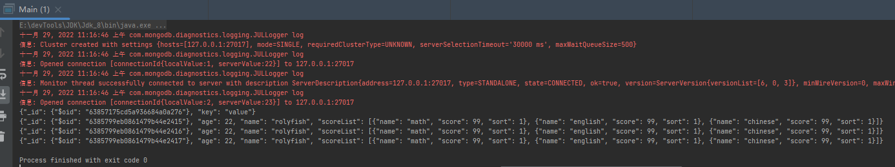


#### 补充

##### 获取连接

> 原生JavaApi获取mongo连接的方式。
>
> MongoClient实现了Closeable接口，使用try-with-resources方式关闭它。

- `com.mongodb.MongoClient`构造函数

  ```java
  // 默认本地 27017
  new MongoClient();
  //可指定
  new MongoClient(host, port);
  //可指定MongoClientURI
  MongoClientURI connectionString = new MongoClientURI("mongodb://localhost:27017,localhost:27017");
  com.mongodb.MongoClient mongoClient = new com.mongodb.MongoClient(connectionString);
  ```

- `com.mongodb.client.MongoClients`的`create`方法

  > `com.mongodb.client.MongoClients`的`create`方法返回`com.mongodb.client.MongoClient;`实例

  ```java
  //默认连接本地 27017的单个mongo实例
  MongoClients.create();
  //可指定 ConnectionString
  MongoClient mongoClient = MongoClients.create(/*"mongodb://localhost:27017"*/);
  
  //除了指定 ConnectionString 有也可以构建 MongoClientSettings。 这里端口默认 27017，可不填
  MongoClient mongoClient = MongoClients.create(
                  MongoClientSettings.builder()
                          .applyToClusterSettings(builder ->
                                  builder.hosts(Collections.singletonList(new ServerAddress("localhost",27017))))
                          .build());
  ```


##### 访问数据库

> `Access a Collection`

```java
 MongoDatabase database = mongoClient.getDatabase("test");
```


##### 访问集合

> 如果集合不存在则在首次设置集合数据时创建该集合。

```java
MongoCollection<Document> collection = database.getCollection("users");
```


##### 创建文档

> 原生mogodb Java api 通过实例化Document的方式创建文档，创建的方式也很多

##### insert Document

> 插入文档到集合。

###### insertOne

```java
String LOCALHOST = "127.0.0.1";
String DEFAULT_DB = "test";
Integer DEFAULT_PORT = 27017;

final MongoDatabase mongoDatabase = MongoUtil.mongoDatabase(LOCALHOST, DEFAULT_PORT, DEFAULT_DB);

@Test
public void testInsertOne() {
    final MongoCollection<Document> users = mongoDatabase.getCollection("users");
    if (users.countDocuments() > 0)
        users.drop();
    final Document user = new Document("name", "yuyc").append("age", 22).append("scores", Arrays.asList(1, 2, 3));
    users.insertOne(user);
    for (Document document : users.find()) {
        System.out.println(document.toJson());
    }
}
```

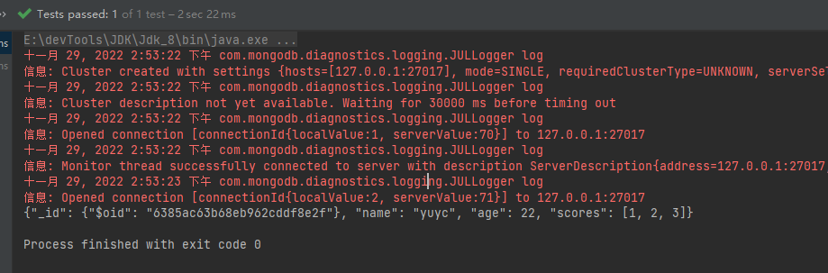


###### insertMany

```java
@Test
public void testInsertMany() {
    final MongoCollection<Document> users = mongoDatabase.getCollection("users");
    if (users.countDocuments() > 0)
        users.drop();
    final Document user1 = new Document("name", "yuyc1").append("age", 22).append("scores", Arrays.asList(1, 2, 3));
    final Document user2 = new Document("name", "yuyc2").append("age", 22).append("scores", Arrays.asList(1, 2, 3));
    final Document user3 = new Document("name", "yuyc3").append("age", 22).append("scores", Arrays.asList(1, 2, 3));
    users.insertMany(Arrays.asList(user1, user2, user3));
    for (Document document : users.find()) {
        System.out.println(document.toJson());
    }
}
```


###### bulkWrite

例子：

```java
@Test
public void testBulk() {
    final MongoCollection<Document> users = mongoDatabase.getCollection("users");
    if (users.countDocuments() > 0)
        users.drop();
    final Document user1 = new Document("name", "yuyc1").append("age", 22).append("scores", Arrays.asList(1, 2, 3));
    final Document user2 = new Document("name", "yuyc2").append("age", 22).append("scores", Arrays.asList(1, 2, 3));

    final InsertOneModel<Document> userInsertOneModel1 = new InsertOneModel<>(Document.parse(JSON.toJSONString(user1)));
    final InsertOneModel<Document> userInsertOneModel2 = new InsertOneModel<>(Document.parse(JSON.toJSONString(user2)));

    final BasicDBObject filter = new BasicDBObject("name", "yuyc1");
    final BasicDBObject update = new BasicDBObject("$set", new BasicDBObject("age", 99));
    final UpdateOneModel<Document> userUpdate = new UpdateOneModel<>(filter, update);

    users.bulkWrite(Arrays.asList(userInsertOneModel1, userInsertOneModel2, userUpdate));
    for (Document document : users.find()) {
        System.out.println(document.toJson());
    }
}
```

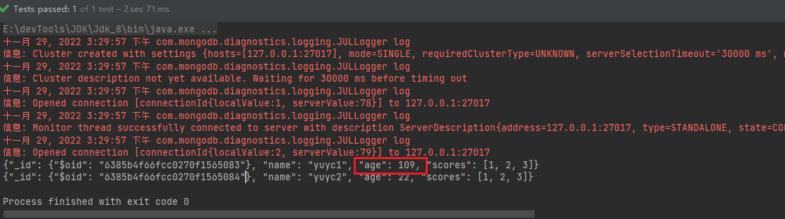


##### updateDocument

> 更新文档

###### UpdateOne

> 更新单个文档或数组元素

```java
@Test
public void testUpdateOne() {

    final MongoCollection<Document> users = mongoDatabase.getCollection("users");
    System.out.println("=======初始数据=======");
    for (Document document : users.find()) {
        System.out.println(document.toJson());
    }
    final Bson filter = new Document("name", "闯王");
    final Bson updateField = new Document("$set", new Document("age", 777));

    final Bson updateArray = Updates.set("scores.$[e]", 10);
    final Bson arrayFilter = Filters.eq("e", 1);
    final UpdateOptions updateOptions = new UpdateOptions().arrayFilters(Collections.singletonList(arrayFilter));
    users.updateOne(filter, updateArray, updateOptions);
    users.updateOne(filter, updateField);

    System.out.println("=======更新后=======");
    for (Document document : users.find()) {
        System.out.println(document.toJson());
    }
}
```

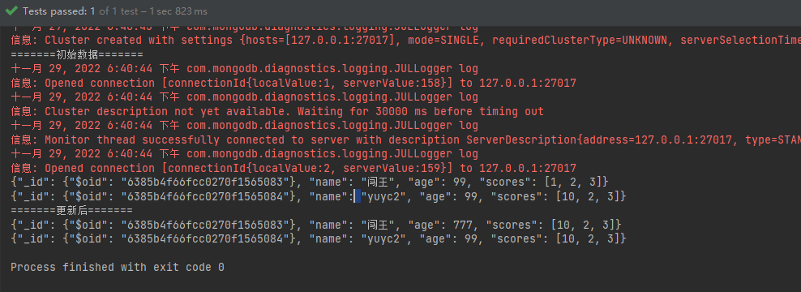

###### updateMany


```java
@Test
public void testUpdateMany() {
    final MongoCollection<Document> users = mongoDatabase.getCollection("users");
    System.out.println("=======初始数据=======");
    for (Document document : users.find()) {
        System.out.println(document.toJson());
    }
    final Bson filter = new Document();
    final Bson updateArray = Updates.set("scores.$[e]", 10);
    final Bson arrayFilter = Filters.eq("e", 2);
    final UpdateOptions updateOptions = new UpdateOptions().arrayFilters(Collections.singletonList(arrayFilter));
    users.updateOne(filter, updateArray, updateOptions);

    users.updateMany(filter, updateArray, updateOptions);

    System.out.println("=======更新后=======");
    for (Document document : users.find()) {
        System.out.println(document.toJson());
    }
}
```


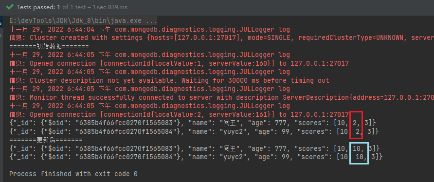


###### bulkWrite

```java
@Test
public void testBulkWrite() {
    final MongoCollection<Document> users = mongoDatabase.getCollection("users");
    users.drop();
    final Document user1 = new Document("name", "yuyc1").append("age", 22).append("scores", Arrays.asList(1, 2, 3));
    final Document user2 = new Document("name", "yuyc2").append("age", 22).append("scores", Arrays.asList(1, 2, 3));
    final Document user3 = new Document("name", "yuyc3").append("age", 22).append("scores", Arrays.asList(1, 2, 3));
    users.insertMany(Arrays.asList(user1, user2, user3));
    System.out.println("=======初始数据=======");
    for (Document document : users.find()) {
        System.out.println(document.toJson());
    }
    /**
     * 更新scores数组元素值为2的元素为10
     */
    final Bson filter = new Document();
    final Bson updateArray = Updates.set("scores.$[e]", 10);
    final Bson arrayFilter = Filters.eq("e", 2);
    final UpdateOptions updateOptions = new UpdateOptions().arrayFilters(Collections.singletonList(arrayFilter));
    final WriteModel<Document> updateManyModel1 = new UpdateManyModel<>(filter, updateArray, updateOptions);

    final Bson in = Filters.in("name", "yuyc1", "yuyc2");
    final Bson age = Updates.set("age", 99);
    final WriteModel<Document> updateManyModel2 = new UpdateManyModel<>(in, age);
    final BulkWriteResult bulkWriteResult = users.bulkWrite(Arrays.asList(updateManyModel1, updateManyModel2));
    // db.users.bulkWrite([
    //      {
    //          updateMany:{
    //              filter:{},
    //              update:{$set:{'scores.$[e]':110}},
    //              arrayFilters:[{'e':3}]
    //          }
    //      },
    //         {updateMany:{
    //             filter:{name:{$in:['yuyc1','yuyc2']}},
    //             update:{$set:{age:333}}
    //         }
    //     }
    // ])
    System.out.println(bulkWriteResult);
    System.out.println("=======更新后=======");
    for (Document document : users.find()) {
        System.out.println(document.toJson());
    }
}
```

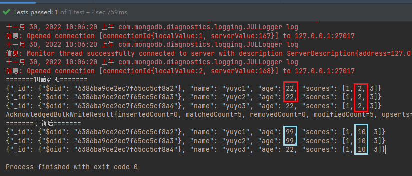

##### countDocuments

- count()
- countDocuments()
- estimatedDocumentCount()

```java
@Test
public void testCountCollections() {

    final MongoCollection<Document> users = mongoDatabase.getCollection("users");

    System.out.println("db.collection.count()" + users.count(new Document()));
    System.out.println("db.collection.countDocuments()" + users.countDocuments(new Document()));
    System.out.println("db.collection.estimatedDocumentCount()" + users.estimatedDocumentCount());

}
```


##### query collection


###### find first doc

```java
@Test
public void testFindFirst() {
    final MongoCollection<Document> users = mongoDatabase.getCollection("users");
    final Document first =
            users.find().first();
    System.out.println(first.toJson());
}
```


###### filters Helper

> 帮助构query filter。

```java
@Test
public void testQueryFilter() {
    final MongoCollection<Document> users = mongoDatabase.getCollection("users");
    final Bson eq2 = Filters.eq("age", 23);
    final Bson eq3 = Filters.eq("name", "bulkWrite.insertOneModel");
    final Bson and = Filters.and(eq2, eq3);
    for (Document document : users.find(and)) {
        System.out.println(document.toJson());
    }
}
```


###### projections

> 指定返回属性。

```shell
db.users.find().projection({name:1});
```

只显示name属性

```java
@Test
public void testProjections() {
    final MongoCollection<Document> users = mongoDatabase.getCollection("users");
    final Bson eq = Filters.eq("age", 23);
    for (Document document : users.find(eq).projection(Projections.include("name"))) {
        System.out.println(document.toJson());
    }
}
```


##### insert pojo

> `code registry`会为未知类自动创建pojo`codec`，`codec`允许我们直接将pojo插入集合。

例子：

```java
@Test
public void insertPojo() {
    CodecRegistry pojoCodecRegistry = CodecRegistries.fromRegistries(MongoClientSettings.getDefaultCodecRegistry(),                                                                		 CodecRegistries.fromProviders(PojoCodecProvider.builder().automatic(true).build()));
    MongoClientSettings settings = MongoClientSettings.builder()
        .codecRegistry(pojoCodecRegistry)
        .build();
    MongoClient mongoClient = MongoClients.create(settings);
    final MongoCollection<User2> users = mongoClient.getDatabase("test")
        .withCodecRegistry(pojoCodecRegistry)
        .getCollection("users", User2.class);
    users.deleteMany(new Document());
    System.out.println("初始数据");
    for (User2 user2 : users.find()) {
        System.out.println(user2);
    }
    System.out.println("insert a pojo into collection");
    User2 userOne = new User2("insertOne", 22);
    users.insertOne(userOne);
    for (User2 user2 : users.find()) {
        System.out.println(user2);
    }
    System.out.println("insert many pojo into collection");
    User2 userMany = new User2("insertMany", 22);
    users.insertMany(Arrays.asList(userMany, userMany, userMany));
    for (User2 user2 : users.find()) {
        System.out.println(user2);
    }
}
```

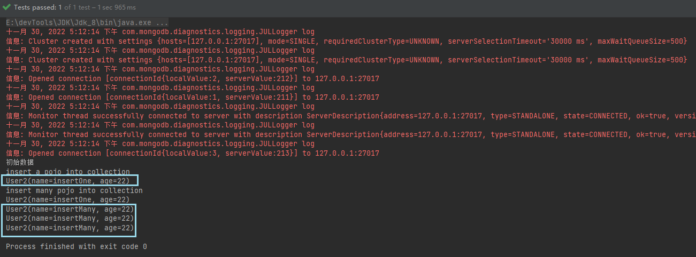


##### replace Pojo

```java
@Test
public void replacePojo() {
    CodecRegistry pojoCodecRegistry = CodecRegistries.fromRegistries(MongoClientSettings.getDefaultCodecRegistry(),
            CodecRegistries.fromProviders(PojoCodecProvider.builder().automatic(true).build()));
    MongoClientSettings settings = MongoClientSettings.builder()
            .codecRegistry(pojoCodecRegistry)
            .build();
    MongoClient mongoClient = MongoClients.create(settings);
    final MongoCollection<User2> users = mongoClient.getDatabase("test")
            .withCodecRegistry(pojoCodecRegistry)
            .getCollection("users", User2.class);
    final UpdateResult updateResult = users.replaceOne(Filters.eq("name", "insertOne"), new User2("replaceOne", 22));
    System.out.println(updateResult);
}
```


#### POJOS

##### 例子

> MongoDB 除了操作BSON外，还提供直接操作POJO的方案。

###### 实体类

```java
@Data
@AllArgsConstructor
@NoArgsConstructor
public final class Person {

    private ObjectId id;
    private String name;
    private int age;
    private Address address;

}

@Data
@AllArgsConstructor
@NoArgsConstructor
public final class Address {

    private String street;
    private String city;
    private String zip;

}
```


###### 获取MongoCollection工具类：

```java
public static <T> MongoCollection<T> mongoCollection(Class<T> pojoClass, String collectionName, String connectionStr, String database) {
    CodecRegistry pojoCodecRegistry = CodecRegistries.fromRegistries(MongoClientSettings.getDefaultCodecRegistry(),
            CodecRegistries.fromProviders(PojoCodecProvider.builder().automatic(true).build()));
    MongoClientSettings settings = MongoClientSettings.builder()
            .codecRegistry(pojoCodecRegistry)
            .applyConnectionString(new ConnectionString(connectionStr))
            .build();
    com.mongodb.client.MongoClient mongoClient = MongoClients.create(settings);
    final MongoCollection<T> collection = mongoClient.getDatabase(database)
            .getCollection(collectionName, pojoClass);
    return collection;
}

private final static String defaultConnectionStr = "mongodb://localhost:27017";

public static <T> MongoCollection<T> mongoCollection(Class<T> pojoClass, String collectionName, String database) {
    return mongoCollection(pojoClass, collectionName, defaultConnectionStr, database);
}
```


###### 测试

```java
@Test
public void testInsertOne(){

    final MongoCollection<Person> personCollection = MongoUtil.mongoCollection(Person.class, "person", "test");

    final Person person = new Person();
    person.setId(new ObjectId());
    person.setAge(22);
    person.setName("person1");
    person.setAddress(new Address("长桥街道","上海","10010"));
    personCollection.insertOne(person);

    for (Person person1 : personCollection.find()) {
        System.out.println(person1);
    }

}
```

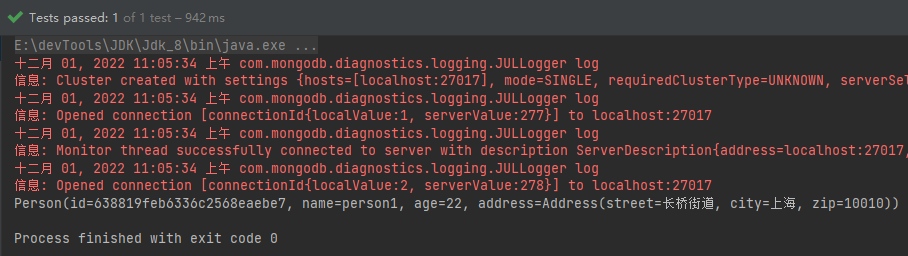

##### CodecRegistry

> MongoDB基于POJO的crud操作依赖于CodecRegistry。

- 创建自定义CodecRegistry

  ```java
  CodecRegistry pojoCodecRegistry = CodecRegistries.fromRegistries(MongoClientSettings.getDefaultCodecRegistry(),
          CodecRegistries.fromProviders(PojoCodecProvider.builder().automatic(true).build()));
  ```

- 使用CodecRegistry

  > 有多种方式使用codecRegistry

  ```java
  // 1
  MongoClientSettings settings = MongoClientSettings.builder()
          .codecRegistry(pojoCodecRegistry)
          .applyConnectionString(new ConnectionString(connectionStr))
          .build();
  com.mongodb.client.MongoClient mongoClient = MongoClients.create(settings);
  
  //2 with database
  final MongoDatabase test = mongoClient.getDatabase("test").withCodecRegistry(pojoCodecRegistry);
  
  //3 with Collection
  final MongoDatabase database = mongoClient.getDatabase("test");
  final MongoCollection<T> collection = database1.getCollection(collectionName,pojoClass).withCodecRegistry(pojoCodecRegistry);
  ```

### Spring


#### helloWorld


