# redis


## 安装

> redis只有linux版本的，平常在windows下使用的是微软转译过的。
>
> 我是使用的linux版本： Ubuntu 22.04 ARM64
>
> 虚拟机选择：Parallels Desktop 18    或租一个服务器

- 下载redis[官网下载](https://redis.io/download/)

- 移动到`/usr/local/src`下，并解压

  `mv  redis-6.2.6.tar.gz /usr/local/src/redis-6.2.6.tar.gz`

  `tar -xzf redis-6.2.6.tar.gz`

- 进入解压后的文件夹执行编译命令

  `make && make install`

### 启动redis方式


#### 默认启动

> redis编译好后会将`redis-server` 加入环境。直接执行redis-server即可。
>
> 这种启动属于`前台启动`，会阻塞整个会话窗口，窗口关闭或者按下`CTRL + C`则Redis停止。

进入`usr/local/bin`查看

```bash
cd /usr/local/bin
```

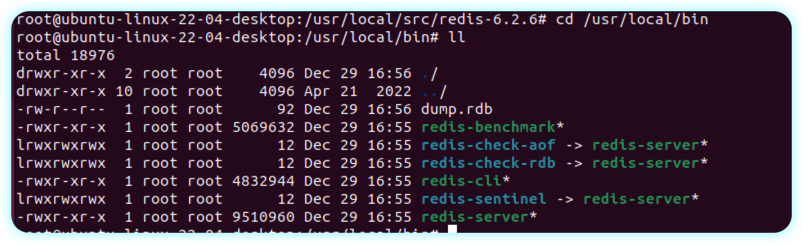 		

#### 自定义配置文件

> 此方式，redis会以守护进程的方式启动。

修改redis配置文件（`/usr/local/src/redis-6.2.6/redis.conf`）：

修改前备份一下（`cp redis.conf  redis.conf.bak`）

```bash
##允许访问的地址，默认是127.0.0.1，会导致只能在本地访问。修改为0.0.0.0则可以在任意IP访问，生产环境不要设置为0.0.0.0
bind 0.0.0.0
# 守护进程，修改为yes后即可后台运行
daemonize yes 
requirepass 123123
```

```bash
port 6379
# 工作目录，默认是当前目录，也就是运行redis-server时的命令，日志.持久化等文件会保存在这个目录
dir .
# 数据库数量，设置为1，代表只使用1个库，默认有16个库，编号0~15
databases 1
# 设置redis能够使用的最大内存
maxmemory 512mb
# 日志文件，默认为空，不记录日志，可以指定日志文件名
logfile "redis.log"
```

启动redis：

```bash
redis-server redis.conf
```


#### 注册redis服务&开机自启

首先，新建一个系统服务文件：

```sh
vi /etc/systemd/system/redis.service
```

```bash
[Unit]
Description=redis-server
After=network.target

[Service]
Type=forking
ExecStart=/usr/local/bin/redis-server /usr/local/src/redis-6.2.6/redis.conf
PrivateTmp=true

[Install]
WantedBy=multi-user.target
```

然后重载系统服务：

```sh
systemctl daemon-reload
```

现在，我们可以用下面这组命令来操作redis了：

```sh
# 启动
systemctl start redis
# 停止
systemctl stop redis
# 重启
systemctl restart redis
# 查看状态
systemctl status redis
```

执行下面的命令，可以让redis开机自启：

```sh
systemctl enable redis
```


### redis客户端

- redis-cli 自带的命令行客户端
- 图形化客户端
- 各种编程客户端

#### redis-cli

Redis安装完成后就自带了命令行客户端：redis-cli，使用方式如下：

```sh
redis-cli [options] [commonds]
```

其中常见的options有：

- `-h 127.0.0.1`：指定要连接的redis节点的IP地址，默认是127.0.0.1
- `-p 6379`：指定要连接的redis节点的端口，默认是6379
- `-a 123321`：指定redis的访问密码 

其中的commonds就是Redis的操作命令，例如：

- `ping`：与redis服务端做心跳测试，服务端正常会返回`pong`

不指定commond时，会进入`redis-cli`的交互控制台：

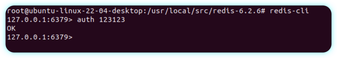


#### 图形化客户端

> `quickredis`能用

[下载地址](https://github.com/quick123official/quick_redis_blog/releases/)

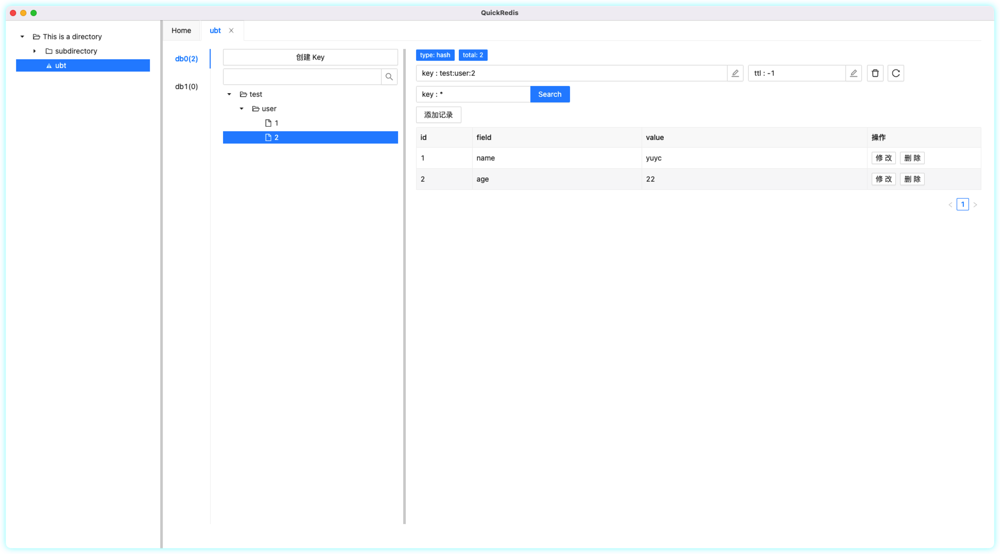


## 常用命令


### redis命令查询

> 如何查询redis命令：

- 官网查询
- 命令查询

[官网](https://redis.io/commands/)

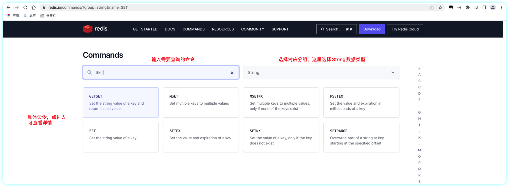

> 官网给出的命令详情非常详细，命令行也可以给出命令简单信息：

`help`命令

```bash
127.0.0.1:6379> help
redis-cli 6.2.6
To get help about Redis commands type:
      "help @<group>" to get a list of commands in <group>
      "help <command>" for help on <command>
      "help <tab>" to get a list of possible help topics
      "quit" to exit
```

`help @group`:查看某一分组的所有命令

```bash
127.0.0.1:6379> help @String
  APPEND key value
  summary: Append a value to a key
  since: 2.0.0
  BITCOUNT key [start end]
  summary: Count set bits in a string
  since: 2.6.0
  BITFIELD key [GET type offset] [SET type offset value] [INCRBY type offset increment] [OVERFLOW WRAP|SAT|FAIL]
  summary: Perform arbitrary bitfield integer operations on strings
  since: 3.2.0
  
.....
```

`help command `：查看某一具体命令

```bash
127.0.0.1:6379> help set
  SET key value [EX seconds|PX milliseconds|EXAT timestamp|PXAT milliseconds-timestamp|KEEPTTL] [NX|XX] [GET]
  summary: Set the string value of a key
  since: 1.0.0
  group: string
```


### 通用命令

常用通用命令一般都是对key进行操作：

- KEYS：查看符合模板的所有key
- DEL：删除一个指定的key
- EXISTS：判断key是否存在
- EXPIRE：给一个key设置有效期，有效期到期时该key会被自动删除
- TTL：查看一个KEY的剩余有效期
- flushdb  删除当前数据库所有key
- flushshall  删除所有数据库所有key

例如：

```bash
127.0.0.1:6379> keys k*
1) "k3"
2) "k2"
3) "k1"
```

```bash
127.0.0.1:6379> del k1 k2
(integer) 2
127.0.0.1:6379> keys * 
1) "k3"
```

```bash
127.0.0.1:6379> EXISTS k1 k2 k3
(integer) 1
# 只有一个k3存在
```

`expire`只会对存在的key生效：

设置过期时间的key过期后ttl值为-2

不设置过期时间的key，也就是永久有效，ttl值为-1

```bash
127.0.0.1:6379> EXPIRE k1 10
(integer) 0
127.0.0.1:6379> ttl k1
(integer) -2
127.0.0.1:6379> EXPIRE k3 10
(integer) 1
127.0.0.1:6379> ttl k3
(integer) 5
127.0.0.1:6379> ttl k3
(integer) 1
127.0.0.1:6379> ttl k3
(integer) -2
127.0.0.1:6379> ttl k3
(integer) -2
```

### 基本数据类型

#### String

String类型，也就是字符串类型，是Redis中最简单的存储类型。

其value是字符串，不过根据字符串的格式不同，又可以分为3类：

* string：普通字符串
* int：整数类型，可以做自增.自减操作
* float：浮点类型，可以做自增.自减操作

String的常见命令有：

* SET：添加或者修改已经存在的一个String类型的键值对
* GET：根据key获取String类型的value
* MSET：批量添加多个String类型的键值对
* MGET：根据多个key获取多个String类型的value
* INCR：让一个整型的key自增1
* INCRBY:让一个整型的key自增并指定步长，例如：incrby num 2 让num值自增2
* INCRBYFLOAT：让一个浮点类型的数字自增并指定步长
* SETNX：添加一个String类型的键值对，前提是这个key不存在，否则不执行
* SETEX：添加一个String类型的键值对，并且指定有效期

example：

> set命令：如果key不存在则设置值，如果key存在则更新值

```bash
127.0.0.1:6379> set name yuyc
OK
127.0.0.1:6379> get name
"yuyc"
127.0.0.1:6379> set name yuycnew
OK
127.0.0.1:6379> get name
"yuycnew"
```

> MSET key value [key value....]
>
> MGET key [key ......]

```bash
127.0.0.1:6379> MSET k1 v1 k2 v2 k3 v3
OK
127.0.0.1:6379> MGET k1 k2 k3
1) "v1"
2) "v2"
3) "v3"
```

> Incr 命令，对存储的整数自增1
>
> incrby key increment ,对存储的整数自增,并指定步长
>
> INCRBYFLOAT key  increment

```bash
127.0.0.1:6379> set age 22
OK
127.0.0.1:6379> INCR age 
(integer) 23
127.0.0.1:6379> INCR age 
(integer) 24
127.0.0.1:6379> INCRBY age 2
(integer) 26
127.0.0.1:6379> INCRBYFLOAT age 0.1
"26.1"
```

> setnx key value 当key不存在添加key，当key存在添加失败
>
> setex 添加key并指定过期时间，等同于set key value ex secends

```bash
127.0.0.1:6379> setnx age 22
(integer) 0
127.0.0.1:6379> setex age 10 22
OK
127.0.0.1:6379> ttl age
(integer) 3
127.0.0.1:6379> ttl age
(integer) -2
127.0.0.1:6379> set age 10 ex 10
OK
```

##### 层次结构

> redis是一个key-value形式的存储结构，不允许存在重复key值，往往会有冲突。
>
> 通过为key添加前缀解决冲突。

```bash
127.0.0.1:6379> set test:user:1 '{"name":lizicheng","age":33}'
OK
127.0.0.1:6379> set test:user:2 '{"name":yuyc","age":22}'
OK
127.0.0.1:6379> set test:dept:1 '{"name":"dept1",num:1}'
OK
127.0.0.1:6379> set test:dept:2 '{"name":"dept2",num:100}'
OK
```

在redis-cli这里key值如下：

```bash
127.0.0.1:6379> keys test*
1) "test:user:1"
2) "test:dept:2"
3) "test:dept:1"
4) "test:user:2"
```

但是在quickredis中可分层次：

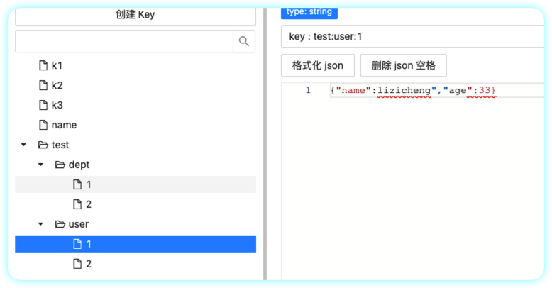

#### hash

> 使用String存储json字符串，不利于修改每一属性的值。使用redis的hash数据结构可对每一个属性单独存储，操作起来简单许多。

**Hash类型的常见命令**

- HSET key field value：添加或者修改hash类型key的field的值

- HGET key field：获取一个hash类型key的field的值

- HMSET：批量添加多个hash类型key的field的值   ( 现等同于HSET命令 )

- HMGET：批量获取多个hash类型key的field的值

- HGETALL：获取一个hash类型的key中的所有的field和value
- HKEYS：获取一个hash类型的key中的所有的field
- HINCRBY:让一个hash类型key的字段值自增并指定步长
- HSETNX：添加一个hash类型的key的field值，前提是这个field不存在，否则不执行


> HSET key field value [field value ....]  等同于  HMSET   （跟版本有关，有些版本hset不可批量设置）
>
> HGET key field
>
> HMGET key field [field ....]

```bash
127.0.0.1:6379> hset test:huser:1 name yuyc age 22
(integer) 2
127.0.0.1:6379> hset test:huser:2 name liziceng age 22
(integer) 2
127.0.0.1:6379> hget test:huser:1 name
"yuyc"
127.0.0.1:6379> HMGET test:huser:1 name age
1) "yuyc"
2) "22"
```


> HGETALL key 。
>
> 类似于HashMap的Entities

```bash
127.0.0.1:6379> HGETALL test:huser:1
1) "name"
2) "yuyc"
3) "age"
4) "22"
```


> HKEYS key     获取所有属性
>
> HVALS key     获取所有值

```bash
127.0.0.1:6379> hkeys test:huser:1
1) "name"
2) "age"
127.0.0.1:6379> HVALS test:huser:1
1) "yuyc"
2) "22"
```

#### list

Redis中的List类型与Java中的LinkedList类似，可以看做是一个双向链表结构。既可以支持正向检索和也可以支持反向检索。

特征也与LinkedList类似：

* 有序
* 元素可以重复
* 插入和删除快
* 查询速度一般

常用来存储一个有序数据，例如：朋友圈点赞列表，评论列表等。

**List的常见命令有：**

- LPUSH key element ... ：向列表左侧插入一个或多个元素
- LPOP key：移除并返回列表左侧的第一个元素，没有则返回nil
- RPUSH key element ... ：向列表右侧插入一个或多个元素
- RPOP key：移除并返回列表右侧的第一个元素
- LRANGE key star end：返回一段角标范围内的所有元素 (end 为 -1 代表返回start之后所有元素) 
- BLPOP和BRPOP：与LPOP和RPOP类似，只不过在没有元素时等待指定时间，而不是直接返回nil

```bash
127.0.0.1:6379> lpush ids 1 2 3
(integer) 3
127.0.0.1:6379> rpush ids -1 -2 -3
(integer) 6
127.0.0.1:6379> lrange ids 0 -1
1) "3"
2) "2"
3) "1"
4) "-1"
5) "-2"
6) "-3"
127.0.0.1:6379> lpop ids 2
1) "3"
2) "2"
127.0.0.1:6379> rpop ids 2
1) "-3"
2) "-2"
127.0.0.1:6379> lrange ids 0 -1
1) "1"
2) "-1"
## 没有元素 等待 30 再返回nil
127.0.0.1:6379> blpop l1 30
(nil)
(30.05s)
```

#### set

Redis的Set结构与Java中的HashSet类似，可以看做是一个value为null的HashMap。因为也是一个hash表，因此具备与HashSet类似的特征：

* 无序
* 元素不可重复
* 查找快
* 支持交集.并集.差集等功能

**Set类型的常见命令**

* SADD key member ... ：向set中添加一个或多个元素
* SREM key member ... : 移除set中的指定元素
* SCARD key： 返回set中元素的个数
* SISMEMBER key member：判断一个元素是否存在于set中
* SMEMBERS：获取set中的所有元素
* SINTER key1 key2 ... ：求key1与key2的交集
* SDIFF key1 key2 ... ：求key1与key2的差集
* SUNION key1 key2 ..：求key1和key2的并集

```bash
127.0.0.1:6379> sadd c1 a b c 
(integer) 3
127.0.0.1:6379> srem c1 c
(integer) 1
# 不可重复添加
127.0.0.1:6379> sadd c1 a
(integer) 0
127.0.0.1:6379> scard c1
(integer) 2
127.0.0.1:6379> SMEMBERS c1
1) "a"
2) "b"
127.0.0.1:6379> SISMEMBER c1 a
(integer) 1
127.0.0.1:6379> sadd c2 b c d
(integer) 3
# 交集
127.0.0.1:6379> SINTER c1 c2
1) "b"
# 并集
127.0.0.1:6379> SUNION c1 c2 
1) "c"
2) "a"
3) "b"
4) "d"
# 差集
127.0.0.1:6379> SDIFF c1 c2
1) "a"
```

#### sortedset

Redis的SortedSet是一个可排序的set集合，与Java中的TreeSet有些类似，但底层数据结构却差别很大。SortedSet中的每一个元素都带有一个score属性，可以基于score属性对元素排序，底层的实现是一个跳表（SkipList）加 hash表。

SortedSet具备下列特性：

- 可排序
- 元素不重复
- 查询速度快

因为SortedSet的可排序特性，经常被用来实现排行榜这样的功能。

SortedSet的常见命令有：

- ZADD key score member：添加一个或多个元素到sorted set ，如果已经存在则更新其score值
- ZREM key member：删除sorted set中的一个指定元素
- ZSCORE key member : 获取sorted set中的指定元素的score值
- ZRANK key member：获取sorted set 中的指定元素的排名
- ZCARD key：获取sorted set中的元素个数
- ZCOUNT key min max：统计score值在给定范围内的所有元素的个数
- ZINCRBY key increment member：让sorted set中的指定元素自增，步长为指定的increment值
- ZRANGE key min max：按照score排序后，获取指定排名范围内的元素
- ZRANGEBYSCORE key min max：按照score排序后，获取指定score范围内的元素
- ZDIFF.ZINTER.ZUNION：求差集.交集.并集

注意：所有的排名默认都是升序，如果要降序则在命令的Z后面添加REV即可，例如：

- **升序**获取sorted set 中的指定元素的排名：ZRANK key member
- **降序**获取sorted set 中的指定元素的排名：ZREVRANK key memeber


```bash
127.0.0.1:6379> zadd zsx 30 yuyc1 20 yuyc2 40 yuyc3 55 yuyc4 5 yuyc5
(integer) 5
127.0.0.1:6379> ZREM zsx yuyc1
(integer) 1
##  zrange key min max 获取指定名次
127.0.0.1:6379> zrange zsx 0 -1
1) "yuyc5"
2) "yuyc2"
3) "yuyc3"
4) "yuyc4"
127.0.0.1:6379> ZSCORE zsx yuyc2
## 返回指定成员排名  从0开始
127.0.0.1:6379> zrank zsx yuyc2
(integer) 1
## 返回成员个数
127.0.0.1:6379> zcard zsx
(integer) 4
## 返回指定分数范围内的成员个数
127.0.0.1:6379> zcount zsx 0 40
(integer) 3
## 给指定成员分数加3
127.0.0.1:6379> ZINCRBY zsx 3 yuyc2
"23"
## 返回指定分数范围内的成员  对比 zrange 
127.0.0.1:6379> ZRANGEBYSCORE zsx 0 40
1) "yuyc5"
2) "yuyc2"
3) "yuyc3"

## 升序 降序获取成员排名
127.0.0.1:6379> zrank zsx yuyc2
(integer) 1
127.0.0.1:6379> ZREVRANK zsx yuyc2
(integer) 2
```


### 特殊类型


## redis客户端

### jedis

> redis  java客户端之一 ----jedis

[redis客户端](https://redis.io/resources/clients/#java)

测试链接：

```java
@Test
public void test() {
   final Jedis jedis = new Jedis("10.211.55.4", 6379);
   jedis.auth("123123");
   jedis.set("key", "value");
   System.out.println(jedis.get("key"));
}
```


### jedis连接池

> jedis连接

```java
public class JedisFactory {
    private static JedisPool pool;

    static {

        final GenericObjectPoolConfig<Jedis> config = new GenericObjectPoolConfig<>();
        // 最大连接数
        config.setMaxTotal(10);
        // 最大空闲连接
        config.setMaxIdle(10);
        // 最小空闲连接
        config.setMinIdle(1);
        // 等待时长
        config.setMaxWait(Duration.ofMillis(2000));
        // 从连接池得到连接前会进行校验，校验不通过则销毁当前连接，并借用一个新的连接
        config.setTestOnBorrow(true);
        // 返回结果前对链接进行校验，校验不通过则销毁当前连接
        config.setTestOnReturn(true);
        pool = new JedisPool(config, "10.211.55.4", 6379, 6000, "123123");
    }
    public static Jedis jedis() {
        return pool.getResource();
    }
    public static void close(Jedis jedis) {
        jedis.close();
    }
}
```

```java
@Test
public void jedisPool(){
    final Jedis jedis = JedisFactory.jedis();
    System.out.println(jedis.get("key"));
  	// 这里close方法不再是关闭资源，而是将连接归还连接池
    JedisFactory.close(jedis);
}
```

### SpringDataRedis-客户端


#### 基础

> SpringData是Spring中数据操作的模块，包含对各种数据库的集成，其中对Redis的集成模块就叫做SpringDataRedis，官网地址：https://spring.io/projects/spring-data-redis

* 提供了对不同Redis客户端的整合（Lettuce和Jedis）
* 提供了RedisTemplate统一API来操作Redis - --标准
* 支持Redis的发布订阅模型
* 支持Redis哨兵和Redis集群
* 支持基于Lettuce的响应式编程
* 支持基于JDK.JSON.字符串.Spring对象的数据序列化及反序列化  -- 自动转化
* 支持基于Redis的JDKCollection实现

#### redisTemplate

SpringDataRedis中提供了RedisTemplate工具类，其中封装了各种对Redis的操作。并且将不同数据类型的操作API封装到了不同的类型中：

| **API**                         | **返回值类型**  | **说明**              |
| ------------------------------- | --------------- | --------------------- |
| **redisTemplate**.opsForValue() | ValueOperations | 操作String类型数据    |
| **redisTemplate**.opsForHash()  | HashOperations  | 操作Hash类型数据      |
| **redisTemplate**.opsForList()  | ListOperations  | 操作List类型数据      |
| **redisTemplate**.opsForSet()   | SetOperations   | 操作Set类型数据       |
| **redisTemplate**.opsForZSet()  | ZSetOperations  | 操作SortedSet类型数据 |
| **redisTemplate**               |                 | 通用的命令            |

#### Spring配置

想要通过IOC注册并使用RedisTemplate，必须先了解以下两个接口 `org.springframework.data.redis.connection` package and its `RedisConnection` and `RedisConnectionFactory` interfaces for working with and retrieving active connections to Redis.

- RedisConnection
- RedisConnectionFactory

> RedisConnectionFactory接口下有两个实现类JedisConnectionFactory和LettuceConnectionFactory。

##### xml配置

```xml
<!--  如果redis设置密码，reids客户端需要auth命令验证，这里也需要配置  -->
<bean id="redisPass" class="org.springframework.data.redis.connection.RedisPassword">
    <constructor-arg value="123123"/>
</bean>
<bean id="redisStandaloneConfiguration"
      class="org.springframework.data.redis.connection.RedisStandaloneConfiguration">
    <!--        <property name="hostName" value="10.211.55.4"/>-->
    <property name="hostName" value="127.0.0.1"/>
    <property name="port" value="6379"/>
    <!--        <property name="password" ref="redisPass"/>-->
</bean>

<!--  不设置则使用默认连接池配置  -->
<bean id="jedisPoolConfig" class="org.apache.commons.pool2.impl.GenericObjectPoolConfig">
       <bean id="jedisPoolConfig" class="org.apache.commons.pool2.impl.GenericObjectPoolConfig">
        <!--    最大连接数    -->
        <property name="maxTotal" value="10"/>
        <!--    最大空闲连接    -->
        <property name="maxIdle" value="10"/>
        <!--    最小空闲连接    -->
        <property name="minIdle" value="1"/>
        <!--    没有连接，等待时长    -->
        <property name="maxWaitMillis" value="1000"/>
        <!--        获取连接前对连接进行校验，校验不通过则销毁当前连接，重新借一个新的连接-->
        <property name="testOnBorrow" value="true"/>
        <property name="testOnReturn" value="true"/>
    </bean>
</bean>

<bean id="jedisClientConfiguration"
      class="org.springframework.data.redis.connection.jedis.JedisConnectionFactory.MutableJedisClientConfiguration">
    <property name="poolConfig" ref="jedisPoolConfig"/>
</bean>

<bean id="jedisConnectionFactory" class="org.springframework.data.redis.connection.jedis.JedisConnectionFactory">
    <constructor-arg ref="redisStandaloneConfiguration"/>
    <constructor-arg ref="jedisClientConfiguration"/>
</bean>

<bean id="redisTemplate" class="org.springframework.data.redis.core.RedisTemplate">
    <property name="connectionFactory" ref="jedisConnectionFactory"/>
</bean>
```

验证：

```java
@Test
public void test1() {
    final ApplicationContext app = new ClassPathXmlApplicationContext("classpath:application.xml");
    final String[] beanDefinitionNames = app.getBeanDefinitionNames();
    for (String beanDefinitionName : beanDefinitionNames) {
        System.out.println(beanDefinitionName);
    }
    final RedisTemplate redisTemplate = app.getBean(RedisTemplate.class);
    final ValueOperations<String,String> valueOperations = redisTemplate.opsForValue();
    valueOperations.set("redistemplate", "value");
    System.out.println(valueOperations.get("redistemplate"));
}
```


##### javaconfig配置

```java
public class RedisConfigration {

    public @Bean RedisPassword redisPassword() {
        return RedisPassword.of("123123");
    }
    public @Bean RedisStandaloneConfiguration redisStandaloneConfiguration(@Autowired RedisPassword redisPassword) {
        final RedisStandaloneConfiguration redisStandaloneConfiguration = new RedisStandaloneConfiguration();
        // redisStandaloneConfiguration.setPassword(redisPassword);
        redisStandaloneConfiguration.setHostName("127.0.0.1");
        // redisStandaloneConfiguration.setHostName("10.211.55.4");
        redisStandaloneConfiguration.setPort(6379);
        return redisStandaloneConfiguration;
    }
    public @Bean JedisConnectionFactory jedisConnectionFactory(@Autowired RedisStandaloneConfiguration redisStandaloneConfiguration) {
        return new JedisConnectionFactory(redisStandaloneConfiguration);
    }

    public @Bean RedisTemplate redisTemplate(@Autowired JedisConnectionFactory jedisConnectionFactory) {
        final RedisTemplate redisTemplate = new RedisTemplate();
        redisTemplate.setConnectionFactory(jedisConnectionFactory);
        return redisTemplate;
    }
}
```

验证：

```java
@Test
public void test2() {
    final ApplicationContext app = new AnnotationConfigApplicationContext(RedisConfigration.class);
    final String[] beanDefinitionNames = app.getBeanDefinitionNames();
    for (String beanDefinitionName : beanDefinitionNames) {
        System.out.println(beanDefinitionName);
    }
    final RedisTemplate redisTemplate = app.getBean(RedisTemplate.class);
    final ValueOperations valueOperations = redisTemplate.opsForValue();
    System.out.println(valueOperations.get("redistemplate"));
}
```


##### redis支持自定义范型

> redisTemplate 可设置范型。
>
> 设置范型需要配合序列化工具使用

```java
/**
 * 对非string的key和value 需要设置序列化工具
 */
@Test
public void test3() {
    final ApplicationContext app = new AnnotationConfigApplicationContext(RedisConfigration.class);

    final RedisTemplate redisTemplate = app.getBean(RedisTemplate.class);
    GenericJackson2JsonRedisSerializer jsonRedisSerializer = new GenericJackson2JsonRedisSerializer();
    redisTemplate.setKeySerializer(RedisSerializer.string());
    redisTemplate.setHashKeySerializer(RedisSerializer.string());
    redisTemplate.setValueSerializer(jsonRedisSerializer);
    redisTemplate.setHashValueSerializer(jsonRedisSerializer);

    final ListOperations<String, User> listOperations = redisTemplate.opsForList();
    final List<User> users = Arrays.asList(new User("李自成", 21), new User("李自成", 21));
    final Long count = listOperations.leftPushAll("users", users);
    System.out.println(count);

    final List<User> users2 = listOperations.range("users",0,listOperations.size("users"));
    users2.forEach(System.out::println);
    
    final User users1 = listOperations.leftPop("users");
    System.out.println(users1);
}
```


#### SpringBoot配置

依赖：

```java
<!--redis依赖-->
<dependency>
    <groupId>org.springframework.boot</groupId>
    <artifactId>spring-boot-starter-data-redis</artifactId>
    <version>2.6.6</version>
</dependency>
```

配置：

```yml
spring:
 redis:
#    host: 10.211.55.4
    host: 127.0.0.1
    port: 6379
#    password: 123123
#    SpringBoot默认使用lettuce实现,必须配置否则连接池不就生效
    lettuce:
      pool:
        max-active: 8  #最大连接
        max-idle: 8   #最大空闲连接
        min-idle: 0   #最小空闲连接
        max-wait: 100ms #连接等待时间
```


验证：

```java
public static void main(String[] args) {
    final ApplicationContext app = SpringApplication.run(RedisDemoApplication.class, args);
    //打印beannames
    final String[] beanNames = app.getBeanDefinitionNames();
    for (String beanName : beanNames) {
        System.out.println(beanName);
    }
    /**
     * 得到redisTemplate并进行插入查询操作
     */
    final RedisTemplate redisTemplate = app.getBean("redisTemplate",RedisTemplate.class);
    final ValueOperations<String,Object> valueOperations = redisTemplate.opsForValue();
    valueOperations.set("name","李自成");
    final Object name = valueOperations.get("name");
    log.info("name:{}",name);
}
```


##### 序列化

###### jdk

> `SpringBootDate`支持自动将key、value以及hash结构，序列化和反序列化。
>
> `SpringBoot`默认使用的是Jdk序列化工具

例子：

```java
@Autowired
RedisTemplate redisTemplate;

@Test
public void testRedisTemplateSerializer() {
    final ValueOperations valueOperations = redisTemplate.opsForValue();
    valueOperations.set("name", "李自成");
    final String name = (String) valueOperations.get("name");
    System.out.println("name=" + name);
}
```

通过redis-cli查看对应值：

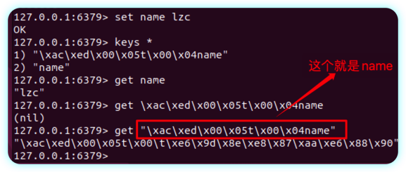

> 通过查看`redisTemplate`的源码发现如果`redisTemplate`的默认序列化工具为空，则默认使用JDK序列化工具。
>
> 使用默认(JDK)序列化工具的缺点：
>
> - 可读性差
> - 占内存

```java
public void afterPropertiesSet() {
   if (defaultSerializer == null) {

      defaultSerializer = new JdkSerializationRedisSerializer(
            classLoader != null ? classLoader : this.getClass().getClassLoader());
   }
}
```

###### json

> 不使用默认的`RedisTemlate`，我们选择手动注入自定义`RedisTemplate`，并设置其key-value的序列化工具。

```java
@Configuration
public class RedisConfig {
/**
    * 注册redisTemplate 并设置序列化工具
    * @param connectionFactory
    * @return
*/
public @Bean RedisTemplate<String, Object> redisTemplate(@Autowired RedisConnectionFactory connectionFactory){
    // 创建RedisTemplate对象
    RedisTemplate<String, Object> template = new RedisTemplate<>();
    // 设置连接工厂
    template.setConnectionFactory(connectionFactory);
    // 创建JSON序列化工具
    GenericJackson2JsonRedisSerializer jsonRedisSerializer = new GenericJackson2JsonRedisSerializer();
    // 设置Key的序列化
    template.setKeySerializer(RedisSerializer.string());
    template.setHashKeySerializer(RedisSerializer.string());
    // 设置Value的序列化
    template.setValueSerializer(jsonRedisSerializer);
    template.setHashValueSerializer(jsonRedisSerializer);
    // 返回
    return template;
}
```

这样对于key和value，就不会使用JDK序列化工具了

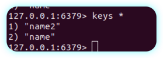

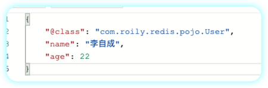

> 优点就是可读性强。缺点就是自动序列化时会夹带类信息，浪费存储空间。


###### stringRedisTemplate

> 无论是key和value都看成字符串进行处理，需要手动序列化和反序列化。

```java
@Test
public void testStringRedisTemplate() {
    final ValueOperations<String, String> valueOperation = stringRedisTemplate.opsForValue();
    // 序列化
    final User user = User.builder().age(22).name("李自成").build();
    final String userStr = JSON.toJSONString(user);
    valueOperation.set("user:1", userStr);
    // 反序列化
    final String s = valueOperation.get("user:1");
    final User user1 = JSON.parseObject(s, User.class);
    log.info("user1:" + user1);
}
```

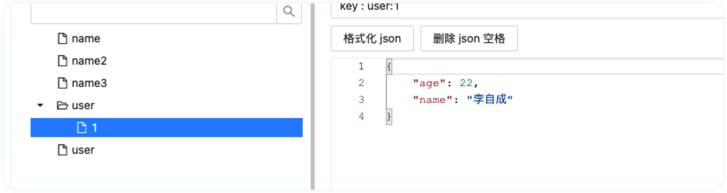

测试opsForHash,HashOptions的api和HashMap的api相似，而不是以命令命名。

```java
@Test
void testHash() {
    stringRedisTemplate.opsForHash().put("user:400", "name", "李自成");
    stringRedisTemplate.opsForHash().put("user:400", "age", "21");

    Map<Object, Object> entries = stringRedisTemplate.opsForHash().entries("user:400");
    System.out.println("entries = " + entries);
}
```

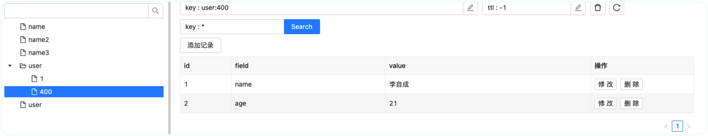


<hr>

## 黑马点评项目


### homebrew安装nginx

> 通过homebrew安装nginx

#### 安装命令

```bash
brew install nginx
```

#### 查看nginx安装信息

```bash
brew info nginx
```

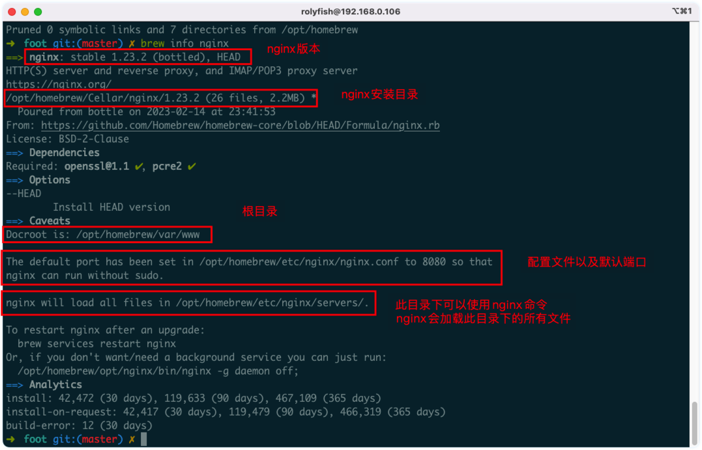

#### 启动nginx

> 启动nginx并访问`http://localhost:8080`

```bash
brew services start nginx
```

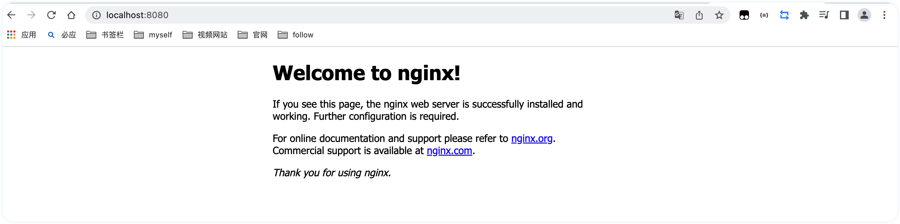

#### nginx部署前端项目


##### 配置文件

> nginx配置文件为nginx.conf，分别为**全局块、events块和http块**，在http块中，又包含http全局块、多个server块。每个server块中，可以包含server全局块和多个location块。在同一配置块中嵌套的配置块，各个之间不存在次序关系。
>
> 绝大多数指令不是特定属于某一个块的。同一个指令放在不同层级的块中，其作用域也不同，一般情况下，高层块中的指令可做用于低层级块。如果某个指令在两个不同层级的块中同时出现，则采用“就近原则”，即以较低层级块中的配置为准。

```json
ngnix.confg:{
  xxxx
	events:{
	},
  http:{
    xxxx
    location:{
    }
  }
}
```

###### 全局块

- user

  ```bash
  # 指定可以运行nginx服务的用户和用户组，只能在全局块配置
  # user [user] [group]
  # 将user指令注释掉，或者配置成nobody的话所有用户都可以运行
  # user nobody nobody;
  
  # 指定工作线程数，可以制定具体的进程数，也可使用自动模式，这个指令只能在全局块配置
  # worker_processes number | auto；
  # 列子：指定4个工作线程，这种情况下会生成一个master进程和4个worker进程
  # worker_processes 4;
  
  # 指定pid文件存放的路径，这个指令只能在全局块配置
  # pid logs/nginx.pid;
  
  # 指定错误日志的路径和日志级别，此指令可以在全局块、http块、server块以及location块中配置。(在不同的块配置有啥区别？？)
  # 其中debug级别的日志需要编译时使用--with-debug开启debug开关
  # error_log [path] [debug | info | notice | warn | error | crit | alert | emerg] 
  # error_log  logs/error.log  notice;
  # error_log  logs/error.log  info;
  ```

###### events块

```bash
# 当某一时刻只有一个网络连接到来时，多个睡眠进程会被同时叫醒，但只有一个进程可获得连接。如果每次唤醒的进程数目太多，会影响一部分系统性能。在Nginx服务器的多进程下，就有可能出现这样的问题。
# 开启的时候，将会对多个Nginx进程接收连接进行序列化，防止多个进程对连接的争抢
# 默认是开启状态，只能在events块中进行配置
# accept_mutex on | off;

# 如果multi_accept被禁止了，nginx一个工作进程只能同时接受一个新的连接。否则，一个工作进程可以同时接受所有的新连接。 
# 如果nginx使用kqueue连接方法，那么这条指令会被忽略，因为这个方法会报告在等待被接受的新连接的数量。
# 默认是off状态，只能在event块配置
# multi_accept on | off;

# 指定使用哪种网络IO模型，method可选择的内容有：select、poll、kqueue、epoll、rtsig、/dev/poll以及eventport，一般操作系统不是支持上面所有模型的。
# 只能在events块中进行配置
# use method
# use epoll

# 设置允许每一个worker process同时开启的最大连接数，当每个工作进程接受的连接数超过这个值时将不再接收连接
# 当所有的工作进程都接收满时，连接进入logback，logback满后连接被拒绝
# 只能在events块中进行配置
# 注意：这个值不能超过超过系统支持打开的最大文件数，也不能超过单个进程支持打开的最大文件数，具体可以参考这篇文章：https://cloud.tencent.com/developer/article/1114773
# worker_connections  1024;
```

###### http块

http块是Nginx服务器配置中的重要部分，代理、缓存和日志定义等绝大多数的功能和第三方模块的配置都可以放在这个模块中。

前面已经提到，http块中可以包含自己的全局块，也可以包含server块，server块中又可以进一步包含location块，在本书中我们使用“http全局块”来表示http中自己的全局块，即http块中不包含在server块中的部分。

可以在http全局块中配置的指令包括文件引入、MIME-Type定义、日志自定义、是否使用sendfile传输文件、连接超时时间、单连接请求数上限等。

```bash
# 常用的浏览器中，可以显示的内容有HTML、XML、GIF及Flash等种类繁多的文本、媒体等资源，浏览器为区分这些资源，需要使用MIME Type。换言之，MIME Type是网络资源的媒体类型。Nginx服务器作为Web服务器，必须能够识别前端请求的资源类型。

# include指令，用于包含其他的配置文件，可以放在配置文件的任何地方，但是要注意你包含进来的配置文件一定符合配置规范，比如说你include进来的配置是worker_processes指令的配置，而你将这个指令包含到了http块中，着肯定是不行的，上面已经介绍过worker_processes指令只能在全局块中。
# 下面的指令将mime.types包含进来，mime.types和ngin.cfg同级目录，不同级的话需要指定具体路径
# include  mime.types;

# 配置默认类型，如果不加此指令，默认值为text/plain。
# 此指令还可以在http块、server块或者location块中进行配置。
# default_type  application/octet-stream;

# access_log配置，此指令可以在http块、server块或者location块中进行设置
# 在全局块中，我们介绍过errer_log指令，其用于配置Nginx进程运行时的日志存放和级别，此处所指的日志与常规的不同，它是指记录Nginx服务器提供服务过程应答前端请求的日志
# access_log path [format [buffer=size]]
# 如果你要关闭access_log,你可以使用下面的命令
# access_log off;

# log_format指令，用于定义日志格式，此指令只能在http块中进行配置
# log_format  main '$remote_addr - $remote_user [$time_local] "$request" '
#                  '$status $body_bytes_sent "$http_referer" '
#                  '"$http_user_agent" "$http_x_forwarded_for"';
# 定义了上面的日志格式后，可以以下面的形式使用日志
# access_log  logs/access.log  main;

# 开启关闭sendfile方式传输文件，可以在http块、server块或者location块中进行配置
# sendfile  on | off;

# 设置sendfile最大数据量,此指令可以在http块、server块或location块中配置
# sendfile_max_chunk size;
# 其中，size值如果大于0，Nginx进程的每个worker process每次调用sendfile()传输的数据量最大不能超过这个值(这里是128k，所以每次不能超过128k)；如果设置为0，则无限制。默认值为0。
# sendfile_max_chunk 128k;

# 配置连接超时时间,此指令可以在http块、server块或location块中配置。
# 与用户建立会话连接后，Nginx服务器可以保持这些连接打开一段时间
# timeout，服务器端对连接的保持时间。默认值为75s;header_timeout，可选项，在应答报文头部的Keep-Alive域设置超时时间：“Keep-Alive:timeout= header_timeout”。报文中的这个指令可以被Mozilla或者Konqueror识别。
# keepalive_timeout timeout [header_timeout]
# 下面配置的含义是，在服务器端保持连接的时间设置为120 s，发给用户端的应答报文头部中Keep-Alive域的超时时间设置为100 s。
# keepalive_timeout 120s 100s

# 配置单连接请求数上限，此指令可以在http块、server块或location块中配置。
# Nginx服务器端和用户端建立会话连接后，用户端通过此连接发送请求。指令keepalive_requests用于限制用户通过某一连接向Nginx服务器发送请求的次数。默认是100
# keepalive_requests number;
```

###### http-server块

server块和“虚拟主机”的概念有密切联系，一个server块就是一个虚拟主机，可充分利用服务器资源，避免为每一个网站提供单独的ngnix服务器，虚拟主机技术使得Nginx服务器可以在同一台服务器上只运行一组Nginx进程，就可以运行多个网站。

server块包含自己的全局块，同时可以包含多个location块。在server全局块中，最常见的两个配置项是本虚拟主机的监听配置和本虚拟主机的名称或IP配置。

- listen指令

```bash
//第一种
listen address[:port] [default_server] [ssl] [http2 | spdy] [proxy_protocol] [setfib=number] [fastopen=number] [backlog=number] [rcvbuf=size] [sndbuf=size] [accept_filter=filter] [deferred] [bind] [ipv6only=on|off] [reuseport] [so_keepalive=on|off|[keepidle]:[keepintvl]:[keepcnt]];

//第二种
listen port [default_server] [ssl] [http2 | spdy] [proxy_protocol] [setfib=number] [fastopen=number] [backlog=number] [rcvbuf=size] [sndbuf=size] [accept_filter=filter] [deferred] [bind] [ipv6only=on|off] [reuseport] [so_keepalive=on|off|[keepidle]:[keepintvl]:[keepcnt]];

//第三种（可以不用重点关注）
listen unix:path [default_server] [ssl] [http2 | spdy] [proxy_protocol] [backlog=number] [rcvbuf=size] [sndbuf=size] [accept_filter=filter] [deferred] [bind] [so_keepalive=on|off|[keepidle]:[keepintvl]:[keepcnt]];

```

listen指令的配置非常灵活，可以单独制定ip，单独指定端口或者同时指定ip和端口。

```bash
listen 127.0.0.1:8000;  #只监听来自127.0.0.1这个IP，请求8000端口的请求
listen 127.0.0.1; #只监听来自127.0.0.1这个IP，请求80端口的请求（不指定端口，默认80）
listen 8000; #监听来自所有IP，请求8000端口的请求
listen *:8000; #和上面效果一样
listen localhost:8000; #和第一种效果一致
```

- Server_name指令

  ```bash
  server_name www.rolyfish.com;
  ```

###### http-location块

每个server块中可以包含多个location块。在整个Nginx配置文档中起着重要的作用，而且Nginx服务器在许多功能上的灵活性往往在location指令的配置中体现出来。

location块的主要作用是，基于Nginx服务器接收到的请求字符串（例如， server_name/uri-string），对除虚拟主机名称（也可以是IP别名，后文有详细阐述）之外的字符串（前例中“/uri-string”部分）进行匹配，对特定的请求进行处理。地址定向、数据缓存和应答控制等功能都是在这部分实现。许多第三方模块的配置也是在location块中提供功能。

在Nginx的官方文档中定义的location的语法结构为：


```bash
worker_processes  1;
events {
    worker_connections  1024;
}
http {
    include       mime.types;
    default_type  application/json;
    sendfile        on;
    keepalive_timeout  65;
    server {
        listen       8080;
        server_name  localhost;
        # 指定前端项目所在的位置
        location / {
            root   html/hmdp;
            index  index.html index.htm;
        }
        error_page   500 502 503 504  /50x.html;
        location = /50x.html {
            root   html;
        }
        location /api {
            default_type  application/json;
            #internal;
            keepalive_timeout   30s;
            keepalive_requests  1000;
        server_name  localhost;
        # 指定前端项目所在的位置
        location / {
            root   html/hmdp;
            index  index.html index.htm;
        }
        error_page   500 502 503 504  /50x.html;
        location = /50x.html {
            root   html;
        }
        location /api {
            default_type  application/json;
            #internal;
            keepalive_timeout   30s;
            keepalive_requests  1000;
            #支持keep-alive
            proxy_http_version 1.1;
            rewrite /api(/.*) $1 break;
            proxy_pass_request_headers on;
            #more_clear_input_headers Accept-Encoding;
            proxy_next_upstream error timeout;
            proxy_pass http://127.0.0.1:8081;
            #proxy_pass http://backend;
        }
    }
    
 
    upstream backend {
        server 127.0.0.1:8081 max_fails=5 fail_timeout=10s weight=1;
        #server 127.0.0.1:8082 max_fails=5 fail_timeout=10s weight=1;
    }
}
```


##### 放前端项目

放在`/opt/homebrew/var/www`


nginx安装目录下有一个快捷键

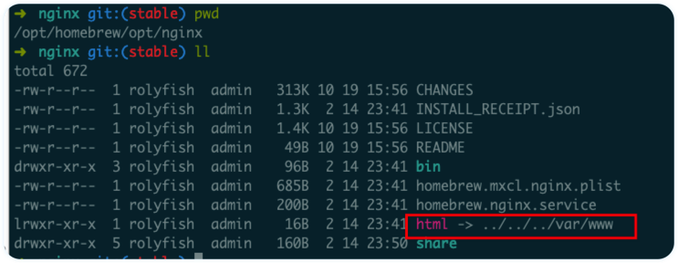

##### 启动ngnix

```bash
brew services start ngnix
```

##### 访问


### docker


### 项目介绍


#### 用户模块

##### 发送手机验证码

- 校验手机号
- 使用hutool包下的RandomUtil工具生成手机验证码,
- 将验证码缓存在Redis中，并设置其过期时间

##### 登录

- 获取前段发送的用户登录表单数据

- 校验手机号
- 校验验证码是否和缓存中一致
- 通过手机号码判断用户是否存在
  - 不存在则通过手机号创建默认用户
  - 存在则查出对应用户并缓存在Redis中


## Redis相关操作


### Session共享

> 我们一般会用Session存储一些基本用户信息，比如用户名称、手机号码等。并且可以基于Session判断用户登录状态。
>
> 但是使用Session的话会存在一些问题：就是Session共享的问题，如果我们的网站在多台服务器上集群部署的话，Session便不会在多个Tomcat上共享，导致Session不一致的情况。
>
> 这里即便可以通过Tomcat的配置实现多台Tomcat的Session一致的方式来实现，但是浪费内存。

#### Redis&Token

> 所以我们不能使用Session来存储用户凭证，这里便使用Redis来存储用户登录凭证，发送一串随机数字作为Token给到前端，这个Token作为Redis的key用户信息作为Value存在Redis上。在登录后前端每次请求都发送Token给后端，使用Token去Redis查询用户信息并放在ThreaLocal中，这样一次请求中都可以访问到用户信息。

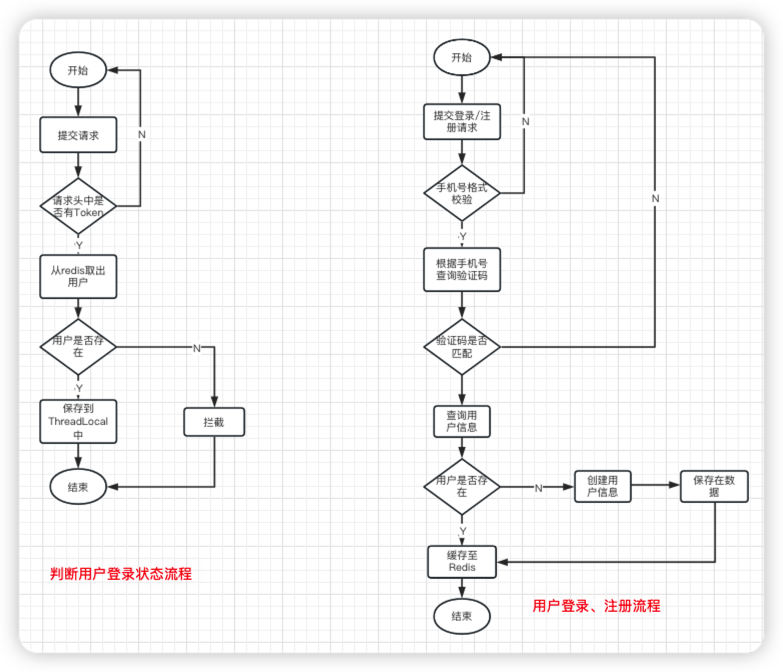

### 缓存

> 什么是缓存？

缓存就是数据交换的缓冲区（称作Cache [ kæʃ ] ），是存贮数据的临时地方，一般读写性能较高。

#### 缓存跟新策略

对于低一致性需求：使用内存淘汰机制，适合不太频繁更新的数据。

高一致性需求：主动更新，添加超时剔除作为兜底方案

|          | 内存淘汰                                                     | 超时剔除                                             | 主动更新                                 |
| -------- | :----------------------------------------------------------- | ---------------------------------------------------- | ---------------------------------------- |
| 说明     | 通过配置缓存内存淘汰机制，内存不足淘汰部分数据，下次查询再更新数据，不用自己维护 | 给缓存添加过期时间，到期自动删除，下次查询再更新缓存 | 编写业务逻辑，在修改数据库的时候删除缓存 |
| 一致性   | 差                                                           | 一般                                                 | 好                                       |
| 维护成本 | 无                                                           | 底                                                   | 高                                       |

##### 主动更新策略

- Cache Aside Pattern 调用者更新，在更新数据库时删除缓存
- Read/Write Through Pattern 调用外部服务，此服务将数据库和缓存整合为一个服务
- Write Behind Caching Pattern 只操作缓存，由其他线程异步将换成持久化到数据库

同时操作缓存和数据库问题：

> 更新缓存还是删除缓存

- 更新缓存：每次数据库更新缓存也要更新，缓存只关心最后的结果，可能会存在无效更新操作  ❎
- 删除缓存：更新数据库时删除缓存，下次查询再添加缓存  √

> 需要保证缓存和数据库更新操作的原子性

- 单体系统：将操作数据库和缓存放在一个事务中管理，当出现异常就会回滚
- 分布式系统：利用TCC等分布式方案

> 先操作数据库还是先删除缓存：

- 先删除缓存，再操作数据库   导致一致性问题几率较大。因为删除缓存后更新数据库耗时较长，期间如果有查询请求，则会将旧数据更新到缓存。
- 先操作数据库，再删除缓存，导致一致性问题较小。需要满足几个条件 - 数据库更新前缓存刚好失效 - 写入缓存的动作在另一个线程删除缓存之后


##### 小结

缓存更新的最佳实践方案：

- 低一致性需求：使用redis的内存淘汰机制
- 高一致性需求：主动更新，并添加超时兜底方案
  - 读操作
    - 缓存命中直接返回
    - 缓存未命中，查询数据库，写入缓存并设置超时时间，返回-
  - 写操作
    - 使用删除缓存的策略
    - 先操作数据库，再删除缓存，下次查询更新缓存
    - 确保操作数据库和删除缓存的原子性


#### 缓存穿透

> 缓存穿透是指客户端请求的数据缓存和数据库都没有命中，这样缓存失效，所有请求都打在数据上，导致数据库压力较大。
>
> 正常情况下没有问题，但是对于一些恶意穿透还是要避免的。

##### 解决方案

- 缓存空对象
  - 优点：缓存生效，实现简单
  - 缺点：①额外消耗Redis内存  ② 可能造成短期数据库不一致的情况
- 布隆过滤器（是一种位统计算法，将数据转换成位信息，用于判断是否存在）
  - 优点： 内存占用少
  - 缺点：①实现复杂 ② 有误判的可能


#### 缓存雪崩


#### 缓存击穿


