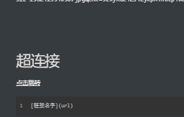

# MarkDown学习

## 二级标题

二个#＋空格

### 三级标题

==标题常用==

几级标题几个井号，并在最后一个井号后加一个空格

> 一级标题：`# 一级`
>
> 二级标题：`# 二级`


# 字体

**加粗**          在需要加粗字体上加双`**字**`。快捷键  `ctrl + b`

*斜体*           在需要加粗字体上加单`*字*`。快捷键  `ctrl + i`

***加粗加斜体***      在需要加粗字体上加三`***字***`。快捷键  未知

==上面三个够用了==

~~划线~~

```bash
ctrl+B I U
```

# 引用

==常用==

例子：如下

>  牛逼plus

快捷键：

```bash
ctrl+shift+Q
```

或者：

==推荐==

小于号加空格`> `


# 分割线

==常用==

<hr>

```bash
<hr>
```

# 图片

==常用==

> 一般来说直接复制图片即可，格式为·``



本地图片：


线上图片：


# 超连接

> 和图片唯一区别就是少一个感叹号  `[]()`

[点击跳转]()

```bash
[链接名字](url)
```

# 列表

==常用==

***有序列表***

1. A
2. B
3. C

***无序列表***

- A

- B

- C

  ```bash
  1.+空格  （有序）
  -+空格	（无序）
  ```

# 表格

==常用==

> 右击插入，快捷键`ctrl  t`

| 姓名 | 性别 | 生日 |
| :--: | :--: | :--: |
|      |      |      |
|      |      |      |

# 代码

==常用==

代码句字：一个`漂`.  esc下面的那个

`System.out.println("HelloWorld")`


代码片段： 三个漂，中间用代码语言类型，比如java   css  xml  等等   

例子：java

```java
public void main(arg[]){

}
```

例子：bash

```bash
代码块   ```+java(具体语言)+```
代码：  `具体代码`
```

