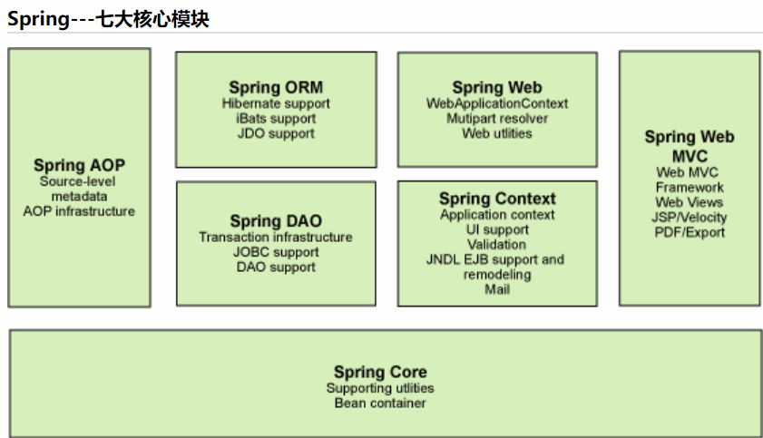

# Spring

# 简介

==Spring框架是一个开源的j2ee框架==。==简化项目开发==

提供了功能强大IOC、AOP及Web MVC等功能。

==轻量级的非入侵式框架：==Spring可以单独应用于构筑应用程序，也可以和Struts、Webwork、Tapestry等众多Web框架组合使用。因此， Spring不仅仅能应用于J2EE应用程序之中，也可以应用于桌面应用程序以及小应用程序之中。

Spring框架主要由七部分组成，分别是 Spring Core、 Spring AOP、 Spring ORM、 Spring DAO、Spring Context、 Spring Web和 Spring Web MVC。 

# spring依赖

<!-- https://mvnrepository.com/artifact/org.springframework/spring-webmvc -->
<dependency>
    <groupId>org.springframework</groupId>
    <artifactId>spring-webmvc</artifactId>
    <version>5.3.12</version>
</dependency>

<!-- https://mvnrepository.com/artifact/org.springframework/spring-webmvc -->
<dependency>
    <groupId>org.springframework</groupId>
    <artifactId>spring-jdbc</artifactId>
    <version>5.3.12</version>
</dependency>

# ***spring优点***

1. 开源
2. 轻量级  很小
3. 非入侵   不会影响你的项目
4. 控制反转ioc  面向切面aop
5. 支持事务处理
6. 支持框架整合     大杂烩

#  ***弊端：配置繁琐***


# ***七大模块***



Sring boot 

​		一个快速开发的脚手架

​		可开发微服务

spring cloud

​		基于spring boot实现

# ioc

> 普通的对象调用方式：

***<u>dao层</u>***

```java
public class UserDaoImpl implements UserDao{
    public void getuser() {
        System.out.println("userDaoImpl业务代码");
    }
}
```

***<u>servic层</u>***

```java
public class UserServiceImpl implements UserService{
    UserDao userDao = new UserDaoImpl();

    public void getuser() {
        System.out.println("调用UserService");
        userDao.getuser();
    }
}
```

> service想要调用dao层的接口，需要考虑其具体的实现类。

> 如果说同一个接口有不同的实现类，实现方式相同且都需要调用，此刻需要做：写dao层实现类，在service再做一个组合创建另一个实现类实例，这样就修改了原先代码，违背面向对象的原则

```java
public class UserServiceImpl implements UserService {
    private UserDao userDao1 = new UserDaoImpl1();
    private UserDao userDao2= new UserDaoImpl2();
    public void getUser1() {
        System.out.println("service 层  调用dao层");
        userDao1.getUser();
    }
    public void getUser2() {
        System.out.println("service 层  调用dao层");
        userDao2.getUser();
    }
}
```


******

***<u>解决</u>***

通过set注入的方式，只需要关心他的接口，并不关心他的实现。

```java
public class UserServiceImpl implements UserService {
    private UserDao userDao;
    public void setUserDao(UserDao userDao) {
        this.userDao = userDao;
    }
    public UserServiceImpl(UserDao userDao) {
        this.userDao = userDao;
    }
    public UserServiceImpl() {
        this.userDao = new UserDaoImpl1();
    }
    public void getUser() {
        System.out.println("service调用dao");
        userDao.getUser();
    }
}
```

> 这样就实现了一个业务类就可以调用实现了同一个接口的一类实现类，且不用改变原先代码。


# 第一个springapp

```xml
<?xml version="1.0" encoding="UTF-8"?>
<beans xmlns="http://www.springframework.org/schema/beans"
       xmlns:xsi="http://www.w3.org/2001/XMLSchema-instance"
       xsi:schemaLocation="http://www.springframework.org/schema/beans
       http://www.springframework.org/schema/beans/spring-beans.xsd">
    <bean id="user" class="com.roily.pojo.User">
        <property name="name" value="Spring"/>
    </bean>
</beans>
```

```java
public class User {
    private String name;
    public String getName() {
        return name;
    }
    public void setName(String name) {
        this.name = name;
    }
    public void show() {
        System.out.println("Hello," + name);
    }
}
```

```java
@Test
public void test01(){
    ApplicationContext context = new ClassPathXmlApplicationContext("ApplicationContext.xml");
    User user = (User) context.getBean("user");
    user.show();
}
```

***set方法注入 默认走无参构造器 set注入参数***

> 通过无参构造器创建实例，set注入属性

```xml
<bean id="user" class="com.roily.pojo.User">
    <property name="name" value="Spring"/>
</bean>
```

***构造器注入***

```xml
<bean id="user2" class="com.roily.pojo.User">
    <constructor-arg index="0" value="springuser2"/>
</bean>
<bean id="user3" class="com.roily.pojo.User">
    <constructor-arg name="name" value="springuser3"/>
</bean>
<bean id="user4" class="com.roily.pojo.User">
    <constructor-arg  type="java.lang.String" value="springuser4"/>
</bean>
<bean id="user5" class="com.roily.pojo.User">
    <constructor-arg  type="java.lang.String" value="springuser5"/>
    <constructor-arg  type="java.lang.String" value="springuser5"/>
</bean>
```

# 别名

```xml
<alias name="user" alias="asdad"/>

<bean id="user2" class="com.roily.pojo.User" name="user2">
    <constructor-arg index="0" value="springuser2"/>
</bean>

<bean id="user2" class="com.roily.pojo.User" name="u2">
    <constructor-arg index="0" value="springuser2"/>
</bean>

<bean id="user2" class="com.roily.pojo.User" name="u2 u3">
    <constructor-arg index="0" value="springuser2"/>
</bean>

<bean id="user2" class="com.roily.pojo.User" name="u2,u3 u4">
    <constructor-arg index="0" value="springuser2"/>
</bean>
```


可以有多个参数！！及合并配置文件

1. 

```

ApplicationContext context = new ClassPathXmlApplicationContext("ApplicationContext.xml");
```

2. 

```xml
<import resource="ApplicationContext.xml"/>
```

# 注入方式

构造器注入

***set注入***

```xml
<?xml version="1.0" encoding="UTF-8"?>
<beans xmlns="http://www.springframework.org/schema/beans"
       xmlns:xsi="http://www.w3.org/2001/XMLSchema-instance"
       xsi:schemaLocation="http://www.springframework.org/schema/beans
        https://www.springframework.org/schema/beans/spring-beans.xsd">

    <bean id="address" class="com.roily.pojo.Address">
        <property name="address" value="北京"/>
    </bean>
    <bean id="student" class="com.roily.pojo.Student">
        <property name="name" value="于延闯"/>
        <property name="address" ref="address"/>
        <property name="books">
            <array>
                <value>book1</value>
                <value>book2</value>
                <value>book3</value>
            </array>
        </property>
        <property name="hobbys">
            <list>
                <value>hobby1</value>
                <value>hobby2</value>
                <value>hobby3</value>
            </list>
        </property>
        <property name="card">
            <map>
                <entry key="饭卡" value="123"/>
                <entry key="身份证" value="萨达"/>
            </map>
        </property>
        <property name="games">
            <set>
                <value>LOL</value>
                <value>瀑布沟</value>
                <value>pubg</value>
            </set>
        </property>
<!--        <property name="wife" value=""></property>-->
        <property name="wife">
            <null/>
        </property>
        <property name="info">
            <props>
                <prop key="url">dad</prop>
                <prop key="asda">dad</prop>
            </props>
        </property>
    </bean>
</beans>
```

```xml
Student{name='于延闯', address=Address{address='北京'}, books=[book1, book2, book3], hobbys=[hobby1, hobby2, hobby3], card={饭卡=123, 身份证=萨达}, games=[LOL, 瀑布沟, pubg], wife='null', info={url=dad, asd=dad}}
```


***拓展注入***

p标签注入

```xml
<?xml version="1.0" encoding="UTF-8"?>
<beans xmlns="http://www.springframework.org/schema/beans"
       xmlns:xsi="http://www.w3.org/2001/XMLSchema-instance"
       xmlns:p="http://www.springframework.org/schema/p"
       xsi:schemaLocation="http://www.springframework.org/schema/beans
        https://www.springframework.org/schema/beans/spring-beans.xsd">

    <bean id="user" class="com.roily.pojo.User" p:name="ad" p:age="123123"/>
</beans>
```

```xml
<bean id="user2" class="com.roily.pojo.User" c:age="19" c:name="于延闯"/>
```

导入相关约束

***p命名空间方式对应无参构造set注入。***

***c命名空间就是有参构造注入***

# bean作用域

***单例模式***

```xml
<bean id="user2" class="com.roily.pojo.User" c:age="19" c:name="于延闯" scope="singleton"/>
```

***原型模式***

```xml
<bean id="user2" class="com.roily.pojo.User" c:age="19" c:name="于延闯" scope="prototype"/>
```

> 当bean的作用域为单例（默认）时会在初始化ioc容器的时候就将对象实例化，而其他的作用域需要在调用的时候才进行初始化
>
> 也容易理解，设置作用域就是限制他的生命周期，要用就创建，用完就摧毁

# Bean自动装配（属性）


```xml
autowire="byname"   保证set后的属性对应 
autowire="bytype"	保证class唯一 不能一个bean多个id
```

# 注解自动装配（属性）

==注解支持==

```xml
<context:annotation-config/>
```

```xml
可以在属性上也可以在set方法上
@autoWrited
@autoWrited的属性默认为true，设置为false即可以不需要，也就是可以为空
@requied（value = false）
```


> @AutoWrited 配合@Qualified
>
> @AutoWrited  byname匹配      @Qualified     bytype

> @Resource      先 byname  找不到  bytype

# 注解开发，自动注入bean，自动装配属性

==注解支持，扫描组件==

```xml
<context:annotation-config/>
<context:component-scan base-package="com.roily"/>
```

```java
//<bean id="user" class="XX.XX.XX"/>
@Component
public class User {
    //property name value
    @Value("于延闯")
    public String name;
    public void say(){
        System.out.println("@Component注解装配bean");
    }
}
```

***<u>衍生注解</u>***

```txt
@component
@service
@repository
@controller
注解点进去发现，service repository controller 都是component
```

# javaconfig配置

```java
@Configuration
@ComponentScan("com.roily.pojo")
public class JavaConfig {
    @Bean
    public User getUser(){
        return new User();
    }
    @Bean
    public User2 getUser2(){
        return new User2();
    }
}
```

```java
public class User {
    @Value("于延闯")
    private String name;
    public String getName() {
        return name;
    }
}
```

```
public class User2 {
    @Value("于延闯2")
    private String name;
    public String getName() {
        return name;
    }
}
```

```java
public class User3 {
    @Value("于延闯3")
    private String name;
    public String getName() {
        return name;
    }
}
```

```java
@org.junit.Test
public void test04(){
    ApplicationContext context = new AnnotationConfigApplicationContext(JavaConfig.class);
    User2 getUser = (User2) context.getBean("getUser2");
    System.out.println(getUser.getName());
}
public void test05(){
    ApplicationContext context = new ClassPathXmlApplicationContext("applicationContext.xml");
    User2 user2 = context.getBean("getUser2", User2.class);
    System.out.println(user2.getName());
}
```

```xml
@Configuration====><Beans>....</Beans>
@Bean====><Bean></Bean>
getUser2()==>id="xxx"
User2====>返回值相当于   class=“com.roily.pojo.user2”

@ComponentScan("com.roily.pojo")设置bean自动装配
前提：bean添加@component
同时也可以@import
```

# 事务

一个使用 MyBatis-Spring 的其中一个主要原因是它允许 MyBatis 参与到 Spring 的事务管理中。而不是给 MyBatis 创建一个新的专用事务管理器，MyBatis-Spring 借助了 Spring 中的 `DataSourceTransactionManager` 来实现事务管理。