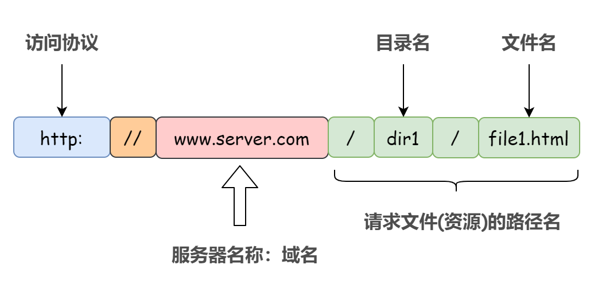
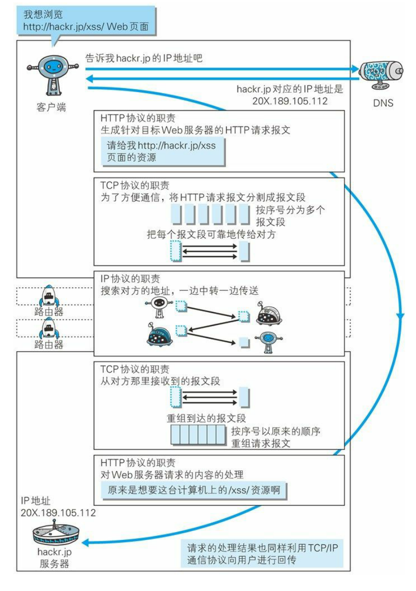
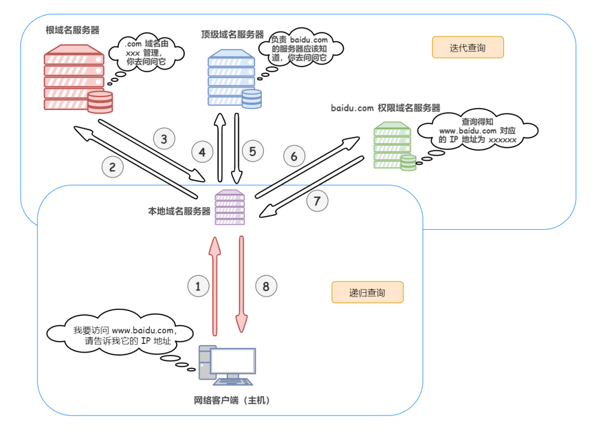

# http

http***超文本传输协议***是一种运行在Tcp上的简单请求响应协议

- 文本  html 字符串。。。
- 超文本   图片   音频  定位。。。。
- 端口：  80

## http请求

```java
请求 		 request  URL: https://www.baidu.com/
请求方法    request method: GET
状态代码    status: 200 OK
远程地址   remote: 180.101.49.12:443
引用站点策略 : origin-when-cross-origin
```

```java
Accept:text/html,application/xhtml+xml,application/xml;q=0.9,image/webp,image/apng,*/*;q=0.8,application/signed-exchange;v=b3;q=0.9
Accept-Encoding: gzip, deflate, br
Accept-Language: zh-CN,zh;q=0.9,en;q=0.8,en-GB;q=0.7,en-US;q=0.6
Cache-Control: max-age=0
Connection: keep-alive
```

- 请求行     请求方式 post  get

   get：  携带少量参数  不安全   高效

  post：携带大量参数   安全   效率较低 

- 消息头    

  Accept

  Accept-Encoding

  Accept-Language

  Cache-Control

  Connection

## http响应

```java
Cache-Control: private   缓存
Connection: keep-alive    连接
Content-Encoding: gzip    网页编码
Content-Type: text/html;charset=utf-8     网页语言
```

1. 响应体

   content-Encoding

   Accept-Language

   Cache-Control

   Connection

2. 响应状态

   200   成功

   3** 重定向

   4** url资源不存在

   5** 服务器错误   500     502网管错误

   ```java
   当在浏览器输入地址回车  到展示页面，经历了啥   
   ```
   

点击[查看](https://cloud.tencent.com/developer/article/1793846)

```txt
   在浏览中输入 URL 并且获取响应的过程，其实就是浏览器和该 URL 对应的服务器的网络通信过程。比如我们输入 www.baidu.com，那么会返回一个百度搜索的界面，这其实就是浏览器和百度服务器之间的网络通信过程。浏览器就是客户端，用于发出请求，而百度的服务器就是服务端，用于接收并响应请求。
   
   1. 解析 URL   
   浏览器也就是客户端进行url解析，获得请求的域名和相关参数
   了解需要请求那个域名的服务器，需要请求该服务器下的哪些资源
   
   不知道有没有同学会混淆域名和 URL 的概念，可以这样理解，URL 就是我们输入的网址，而网址里面含有域名。举个例子：www.baidu.com/veal98 是一个网址，而 www.baidu.com 就是服务器的域名。
   URL 各元素的组成如下
   2. 浏览器封装 HTTP 请求报文
   对 URL 进行解析之后，浏览器确定了目标服务器和文件名，接下来就需要根据这些消息「封装」成一个 HTTP 请求报文发送出去。举个 HTTP 请求报文的例子：
   3. DNS 域名解析获取 IP 地址
   封装好 HTTP 请求报文后，在正式还有一项准备工作没有做，那就是获取目标服务器的 IP 地址。
   虽然解析得到了域名，理论浏览器已经知道目标服务器是谁了。但是实际上，域名并不是目标服务器真正意义上的地址，互联网上每一台计算机都被全世界唯一 IP 地址标识着，但是 IP 地址并不方便记忆，所以才设计出了域名。
   那么就需要解析域名获取目标服务器的 IP 地址。不然空有一个方便记忆的域名咋知道这个请求到底发送到哪里去呢。由域名转换得到 IP 地址就是 DNS 协议做的事情，如下：
       1）首先搜索「浏览器的 DNS 缓存」，缓存中维护着一张域名与 IP 地址的对应表；
       2）若没有命中，则继续搜索「操作系统的 DNS 缓存」；
       3）若仍然没有命中，则操作系统将域名发送至「本地域名服务器」，本地域名服务器查询自己的 DNS 缓存，查找成功则返回结果（注意：主机和本地域名服务器之间的查询方式是「递归查询」）；
       4）若本地域名服务器的 DNS 缓存没有命中，则本地域名服务器向上级域名服务器进行查询，通过以下方式进行「迭代查询」（注意：本地域名服务器和其他域名服务器之间的查询方式是迭代查询，防止根域名服务器压力过大）：
       首先本地域名服务器向「根域名服务器」发起请求，根域名服务器是最高层次的，它并不会直接指明这个域名对应的 IP 地址，而是返回顶级域名服务器的地址，也就是说给本地域名服务器指明一条道路，让他去这里寻找答案
       本地域名服务器拿到这个「顶级域名服务器」的地址后，就向其发起请求，获取「权限域名服务器」的地址
       本地域名服务器根据权限域名服务器的地址向其发起请求，最终得到该域名对应的 IP 地址
       4）本地域名服务器将得到的 IP 地址返回给操作系统，同时自己将 IP 地址缓存起来
       5）操作系统将 IP 地址返回给浏览器，同时自己也将 IP 地址缓存起来
       6）至此，浏览器就得到了域名对应的 IP 地址，并将 IP 地址缓存起来
   4. 建立 TCP 连接
   获取到了目标服务器的 IP 地址之后，浏览器就知道我等下请求要发给谁了，这个时候就可以开始发送封装好了的 HTTP 请求报文了，那么既然需要发送请求，必然就需要 TCP 通过三次握手为浏览器和服务器之间建立可靠的连接，「保证双方都具有可靠的接收和发送能力」。
   5. 浏览器发送请求
   TCP 三次握手完成后，浏览器与目标服务器之间就建立了一个可靠的虚拟通道，于是浏览器就可以发送自己的 HTTP 请求了。
   需要注意的是，HTTP 请求报文或者响应报文在 TCP 连接通道上进行传输的时候，由于这些报文比较大，为了更容易和准确可靠的传输，「TCP 会将 HTTP 报文按序号分割成若干报文段并加上 TCP 首部，分别进行传输。接收方在收到这些报文段后，按照序号以原来的顺序重组 HTTP 报文」。
   6. 负责传输的 IP 协议
   实际上，TCP 在三次握手建立连接、四次握手断开连接、以及连接建立过程中的收发数据（TCP 报文段）等各阶段操作时，都是通过 IP 协议进行传输的，IP 协议将这些阶段的数据添加 IP 首部封装成 IP 数据报再进行传输。
   IP 数据报的首部存有「源 IP 地址」和 「目标 IP 地址」。所谓源 IP 地址 就是发送方的 IP 地址；目标 IP 地址就是通过 DNS 域名解析得到的目标服务器的 IP 地址。
   事实上，「IP 协议身处的网络层规定的是：数据报要通过怎样的路径（传输路线）才能到达对方计算机，并传送给对方」。不理解这句话的详细解释马上就来，继续往下读。
   7. 使用 ARP 协议凭借 MAC 地址通信
   上面说了，IP 协议的作用是把各种数据包传送给对方，而要保证确实传送到对方那里，则需要满足各类条件，其中必要的两个就是 IP 地址 和 MAC 地址。
   MAC 地址也是用来唯一标识一个接入互联网的设备的，可能不禁有小伙伴要问，既然网络层已经有了唯一标识的 IP 地址，为啥还需要 MAC 地址？
   看下面这幅图，在网络上，「通信的双方在同一局域网内的情况是很少见的，通常是需要多台计算机和网络设备的中转才能连接到对方。而在进行中转时，就需要利用下一站中转设备的 MAC 地址来搜索下一个中转目标」。
   8. 服务器响应请求
   浏览器的 HTTP 请求报文通过 TCP 三次握手建立的连接通道被切分成若干报文段分别发送给服务器，服务器在收到这些报文段后，按照序号以原来的顺序重组 HTTP 请求报文。然后处理并返回一个 HTTP 响应。当然，HTTP 响应报文也要经过和 HTTP 请求报文一样的过程。
   9. 断开 TCP 连接
   浏览器和服务器都不再需要发送数据后，四次挥手断开 TCP 连接，
   10. 浏览器显示界面
   浏览器接收到服务器返回的 HTTP 响应报文后，根据浏览器的渲染机制对相应的数据进行渲染
   
   总结
   屏蔽掉底层细节，笼统的总结一下上述过程。
   应用层：
   浏览器封装 HTTP 请求报文
   DNS 解析域名获得目标服务器地址
   传输层：
   建立连接
   把应用层传过来的 HTTP 请求报文进行分割，并在各个报文上打上标记序号及端口号转发给网络层
   网络层：
   利用 ARP 协议根据 IP 地址获取作为通信目的地的 MAC 地址后转发给链路层
   服务端在链路层收到数据，按序往上层发送，一直到应用层接收到浏览器发送来的 HTTP 请求报文，然后处理该请求并返回 HTTP 响应报文，浏览器接收到响应报文之后解析渲染界面。最后 TCP 断开连接。
```




