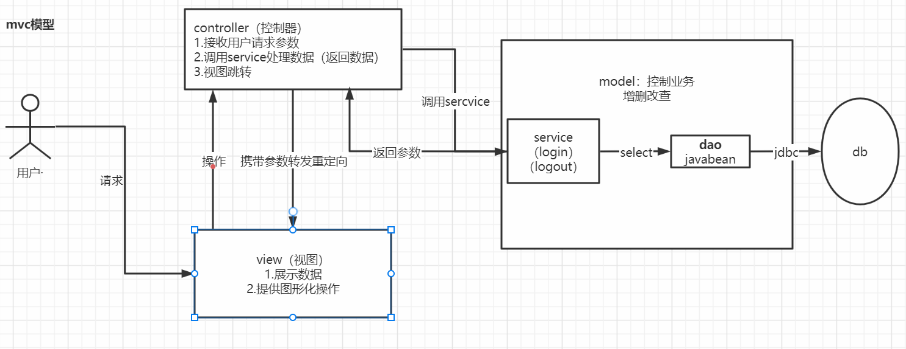
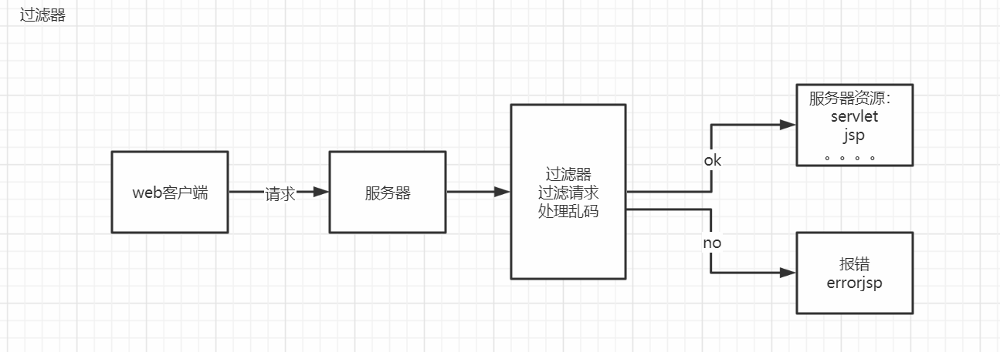

# mvc

model view controller  模型  视图  控制器



Model

​	处理业务：service

​	crud

View

​	展示数据

​	图形化操作   按钮 链接

Controller

​	接收数据 （request session 域中的数据）

​	调用业务处理数据

​	请求转发

# filter 过滤器

过滤网站发过来的数据



filter步骤.

写filter

```txt
实现filter接口，重写dofilter方法
```

注册filter（和servlet一样）

```java
    @Override
    public void doFilter(ServletRequest request, ServletResponse response, FilterChain chain) throws IOException, ServletException {
    request.setCharacterEncoding("utf-8");
    response.setCharacterEncoding("utf-8");
    response.setContentType("text/html;charset=utf-8");
    System.out.println("放行");
    chain.doFilter(request,response);
    System.out.println("filter  end");
    }
```

```txt
filterchain: 
 	  1.过滤器中的代码会在特定的情况下执行 （filter-mapping）
      2. 放行请求  传递req resp
      chain.dofilter()
初始化过滤器：启动服务器时
过滤器执行    特定url
销毁         服务器停时
```

# 监听器

写监听器

```txt
实现listener接口  很多  例：sessionlistener

实现sessioncreate  和  sessionDestroyed方法

统计session数量

	@Override
    public void sessionCreated(HttpSessionEvent se) {
        ServletContext sct = se.getSession().getServletContext();
        Integer count = (Integer) sct.getAttribute("OnlineCount");
        if(count==null){
             count = new Integer(1);
        }else {
            int num = count.intValue();
            count=new Integer(num+1);
        }
        sct.setAttribute("OnlineCount",count);
    }

    @Override
    public void sessionDestroyed(HttpSessionEvent se) {
        ServletContext sct = se.getSession().getServletContext();
        Integer count = (Integer) sct.getAttribute("OnlineCount");
        if(count==null){
            count = new Integer(0);
        }else {
            int num = count.intValue();
            count=new Integer(num-1);
        }
        sct.setAttribute("OnlineCount",count);
    }
```

注册监听器

```txt
  <listener>
        <listener-class>com.roily.listener.onlinecountlistener</listener-class>
  </listener>
  监听器有很多，监听的是各种操作，并不是监听指定资源的请求，可以说是全局的
```

## 常见应用

过滤器：**统一编码，统一用户认证，屏蔽非法文字，进行响应数据压缩**

监听器： 监听**session，request 和 servletContext**的状态等