MyBatis

# 1 简介

## 1.1 什么是MyBatis

- 持久层框架
- 自定义SQL片段
- 结果集映射。
- 避免了所有JDBC代码、手动设置参数以及获取结果集。
- 支持XML或者注解来配置和映射原生类型、接口和java的POJO数据库中的记录。
  - paramtype   int  map   ===  @Param
  - resulttype  pojobean
  - resulpmap  自定义映射
- MyBatis原生IBati  很多包都在ibatis下

## 【持久化】

### 数据持久化

- 持久化   ：   数据在**持久状态    瞬间状态 **转化的过程。
- 内存——**断电即失**
- 方式：    数据库（JDBC），io文件持久化

### ==为什么需要持久层？==

1. 数据的重要性
2. 内存资源昂贵
3. 完成持久化工作
4. 层界限十分明显


## 1.2 获取MyBatis

- Maven仓库：

  ```xml
  <dependency>
      <groupId>org.mybatis</groupId>
      <artifactId>mybatis</artifactId>
      <version>3.5.5</version>
  </dependency>
  ```

- GitHub：https://github.com/mybatis/mybatis-3/releases

- 官方中文文档：https://mybatis.org/mybatis-3/zh/index.html


## 1.3 MyBatis重要性

- 数据存入数据库
- 框架、自动化的方便性
- 简化JDBC代码
- 受众广泛
- 优点：
  - 简单易学
  - 灵活
  - sql和代码的分离，提高了可维护性
  - 提供映射标签，支持对象与数据库的orm字段关系映射
  - 提供对象关系映射标签，支持对象关系组件维护
  - 提供xml标签，支持动态sql


# 2 Hello MyBatis

- 学习步骤：
  1. 环境搭建
  2. MyBatis
  3. 编写代码
  4. 测试

## 2.1 MySQL数据创建

```MySQL
CREATE DATABASE `mybatis`;

USE `mybatis`;

CREATE TABLE `users`(
	`id` INT(20) NOT NULL PRIMARY KEY,
	`name` VARCHAR(30) DEFAULT NULL,
	`pwd` VARCHAR(30) DEFAULT NULL
)ENGINE=INNODB DEFAULT CHARSET=utf8


INSERt INTO `users` VALUES
( 1,'Camelot','c123'),
( 2,'Altria','a123'),
( 3,'Camemax','c123')
```


## 2.2 驱动与依赖

1. MySQL

   ```xml
   <dependency>
       <groupId>mysql</groupId>
       <artifactId>mysql-connector-java</artifactId>
       <version>8.0.21</version>
   </dependency>
   ```

2. MyBatis

   ```xml
   <dependency>
       <groupId>org.mybatis</groupId>
       <artifactId>mybatis</artifactId>
       <version>3.5.5</version>
   </dependency>
   ```

3. junit

   ```xml
   <dependency>
       <groupId>junit</groupId>
       <artifactId>junit</artifactId>
       <version>4.13</version>
       <scope>test</scope>
   </dependency>
   ```


## 2.3 MyBatis工具类

### 2.3.1 xml核心配置文件

#### 2.3.1.1 官方声明

- MyBatis 包含一个名叫 Resources 的工具类，它包含一些实用方法，使得从类路径或其它位置加载资源文件更加容易。

  ```java
  web项目可直接在classpath下拿
  //Returns a resource on the classpath as a Stream object
  String resource = "org/mybatis/example/mybatis-config.xml";
  InputStream inputStream = Resources.getResourceAsStream(resource);
  SqlSessionFactory sqlSessionFactory = new SqlSessionFactoryBuilder().build(inputStream);
  ```

- 【默认】XML核心配置文件 => 【mybatis-config.xml】

  XML 配置文件中包含了对 MyBatis 系统的核心设置，包括获取数据库连接实例的数据源（DataSource）以及决定事务作用域和控制方式的事务管理器（TransactionManager）。

  ```xml
  <?xml version="1.0" encoding="UTF-8" ?>
  <!DOCTYPE configuration
          PUBLIC "-//mybatis.org//DTD Config 3.0//EN"
          "http://mybatis.org/dtd/mybatis-3-config.dtd">
  <!-- configuration标签 => 声明MyBatis核心配置 -->
  <configuration>
      <!-- environments标签 => 设置MyBatis选用的环境信息 -->
      <environments default="development">
          <environment id="development">
              <!-- transactionManager标签 => 事务管理 -->
              <transactionManager type="JDBC"/>
              <!-- dataSource标签 => 配置数据源属性 -->
              <dataSource type="POOLED">
                  <property name="driver" value="${driver}"/>
                  <property name="url" value="${url}"/>
                  <property name="username" value="${username}"/>
                  <property name="password" value="${password}"/>
              </dataSource>
          </environment>
      </environments>
      <mappers>
          <mapper resource="org/mybatis/example/BlogMapper.xml"/>
      </mappers>
  </configuration>
  ```

  

#### 2.3.1.2 自定义核心配置文件

- 按照本地环境信息，自定义配置 => 【注意】==\&amp;== （转义字符amp;）

  ```xml
  <?xml version="1.0" encoding="UTF-8" ?>
  <!DOCTYPE configuration
          PUBLIC "-//mybatis.org//DTD Config 3.0//EN"
          "http://mybatis.org/dtd/mybatis-3-config.dtd">
  <!-- configuration标签 => 声明MyBatis核心配置 -->
  <configuration>
      <!-- environments标签 => 设置MyBatis选用的环境信息 -->
      <environments default="development">
          <environment id="development">
              <!-- transactionManager标签 => 事务管理 -->
              <transactionManager type="JDBC"/>
              <!-- dataSource标签 => 配置数据源属性 -->
              <dataSource type="POOLED">
                  <property name="driver" value="com.mysql.cj.jdbc.Driver"/>
                  <property name="url" value="jdbc:mysql://localhost:3306/mybatis?useSSL=false&amp;useUnicode=true&amp;characterEncoding=utf8&amp;serverTimezone=CST"/>
                  <property name="username" value="root"/>
                  <property name="password" value="123"/>
              </dataSource>
          </environment>
      </environments>
      <mappers>
          <mapper resource="org/mybatis/example/BlogMapper.xml"/>
      </mappers>
  </configuration>
  ```

  

### 2.3.2 SqlSessionFactory

#### 2.3.2.1 官方声明

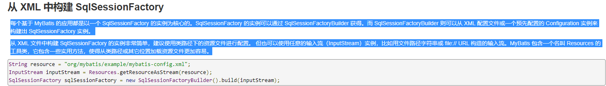

>即：SqlSessionFactory（MyBatis应用必需）实例 ---需要---> SqlSessionFactoryBuilder ---需要---> XML核心配置文件【mybatis-config.xml】

- 官方默认MyBatis应用类

  ```java
  // 定义XML核心配置文件路径信息
  String resource = "org/mybatis/example/mybatis-config.xml";
  // 读取XML核心配置文件路径信息
  InputStream inputStream = Resources.getResourceAsStream(resource);
  // 获得实例化SQLSessionFactory
  SqlSessionFactory sqlSessionFactory = new SqlSessionFactoryBuilder().build(inputStream);
  ```


#### 2.3.2.2 自定义配置

- 按照本地环境信息，自定义配置 

  ```java
  private static SqlSessionFactory sqlSessionFactory;
  static {
      try {
          // 定义XML核心配置文件路径信息
          String resource = "mybatis-config.xml";
          // 读取XML核心配置文件路径信息
          InputStream inputStream = Resources.getResourceAsStream(resource);
          // 获得实例化SQLSessionFactory
          sqlSessionFactory = new SqlSessionFactoryBuilder().build(inputStream);
  
      } catch (IOException e) {
          e.printStackTrace();
      }
  }
  ```

  

### 2.3.3 SqlSession

#### 2.3.3.1 官方声明

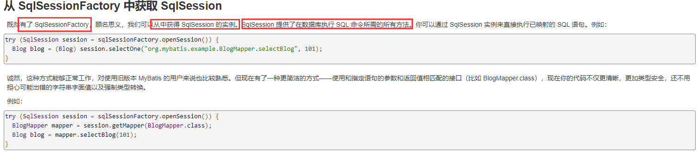

> 即：通过SQLSessionFactory获得SqlSession对象，使用SqlSession对象执行所有SQL方法。


#### 2.3.3.2 SqlSession接口方法

- 调用SqlSessionFactory.openSession()方法，返回SqlSession对象

  ```java
  // 静态方法获取SqlSession对象，通过SqlSessionFactory.openSession()方法
  public static SqlSession getSqlSession(){
      return sqlSessionFactory.openSession();
  }
  ```


### 2.3.4 完整工具类实现

- 将以上对象结合

  ```java
  package com.camemax.utils;
  
  import org.apache.ibatis.io.Resources;
  import org.apache.ibatis.session.SqlSession;
  import org.apache.ibatis.session.SqlSessionFactory;
  import org.apache.ibatis.session.SqlSessionFactoryBuilder;
  
  import java.io.IOException;
  import java.io.InputStream;
  
  public class MyBatisUtils {
      private static SqlSessionFactory sqlSessionFactory;
      static {
          try {
              // 定义XML核心配置文件路径信息
              String resource = "mybatis-config.xml";
              // 读取XML核心配置文件路径信息
              InputStream inputStream = Resources.getResourceAsStream(resource);
              // 获得实例化SQLSessionFactory
              sqlSessionFactory = new SqlSessionFactoryBuilder().build(inputStream);
  
          } catch (IOException e) {
              e.printStackTrace();
          }
      }
      //获取SqlSession对象
      public static SqlSession getSqlSession(){
          return sqlSessionFactory.openSession();
      }
  }
  ```


## 2.4 实体类Pojo

- 创建实体类Users，匹配数据库所需字段。

  ```java
  package com.camemax.pojo;
  
  public class Users {
  
      private int id;
      private String username;
      private String password;
      private String email;
      private int gender;
  
      public Users() { };
  
      public Users(int id, String username, String password, String email, int gender) {
          this.id = id;
          this.username = username;
          this.password = password;
          this.email = email;
          this.gender = gender;
      }
  
      public int getId() {
          return id;
      }
  
      public void setId(int id) {
          this.id = id;
      }
  
      public String getUsername() {
          return username;
      }
  
      public void setUsername(String username) {
          this.username = username;
      }
  
      public String getPassword() {
          return password;
      }
  
      public void setPassword(String password) {
          this.password = password;
      }
  
      public String getEmail() {
          return email;
      }
  
      public void setEmail(String email) {
          this.email = email;
      }
  
      public int getGender() {
          return gender;
      }
  
      public void setGender(int gender) {
          this.gender = gender;
      }
  
      @Override
      public String toString() {
          return "Users{" +
                  "id=" + id +
                  ", username='" + username + '\'' +
                  ", password='" + password + '\'' +
                  ", email='" + email + '\'' +
                  ", gender=" + gender +
                  '}';
      }
  }
  ```

  

## 2.5 Dao层 【接口】

- 操作实体类，完成与数据库的操作。

  ```java
  package com.camemax.dao;
  
  import com.camemax.pojo.Users;
  
  import java.util.List;
  
  public interface UsersDao {
  
      List<Users> getUsersInfo();
  }
  ```

  

## 2.6 Mapper

### 2.6.1 Mapper配置绑定

#### 2.6.1.1 官方声明

- 官方实例 => UsersMappers

  ```xml
  <?xml version="1.0" encoding="UTF-8" ?>
  <!DOCTYPE mapper
    PUBLIC "-//mybatis.org//DTD Mapper 3.0//EN"
    "http://mybatis.org/dtd/mybatis-3-mapper.dtd">
  <!-- mapper标签： 【namespace】： 指定dao层，绑定Dao -->
  <mapper namespace="org.mybatis.example.BlogMapper">
    <!-- SQL语句执行区 -->
    <select id="selectBlog" resultType="Blog">
      select * from Blog where id = #{id}
    </select>
  </mapper>
  ```


#### 2.6.1.2 自定义配置

- 按照本地环境信息，自定义配置 

  ```xml
  <?xml version="1.0" encoding="UTF-8" ?>
  <!DOCTYPE mapper
          PUBLIC "-//mybatis.org//DTD Mapper 3.0//EN"
          "http://mybatis.org/dtd/mybatis-3-mapper.dtd">
  <!-- mapper标签： 【namespace】： 指定dao层，绑定Dao -->
  <mapper namespace="com.camemax.dao.UsersDao">
        <!-- select 标签： 
   				【id】： 绑定Dao中的方法名
  				【resultType】： 指定对应【类的形式】返回结果集的类型 -->
      <select id="getUsersInfo" resultType="com.camemax.pojo.Users">
          select * from school.users
      </select>
  </mapper>
  ```


### 2.6.2 添加mapper注册

- 修改mybatis-config.xml中的\<mappers>\</mappers>标签，将其【resource】属性修改为【绑定Dao】的mapper.xml文件所在路径。

  - 路径结构

    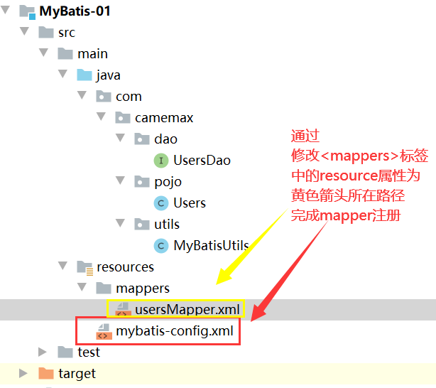

  - 自定义配置

    ```xml
    <!--如图所示配置-->
    <mappers>
        <mapper resource="mappers/usersMapper.xml"/>
    </mappers>
    ```

    

## 2.7 从SqlSessionFactory中获取

### 2.7.1 官方声明

- 创建Dao测试类 => UsersDaoTest，测试mybatis

  - 方式一：

    ```java
    try (SqlSession session = sqlSessionFactory.openSession()) {
      BlogMapper mapper = session.getMapper(BlogMapper.class);
      Blog blog = mapper.selectBlog(101);
    }
    ```

  - 方式二 【旧版】：

    ```java
    //通过 SqlSession 实例来直接执行已映射的 SQL 语句。
    try (SqlSession session = sqlSessionFactory.openSession()) {
      Blog blog = (Blog) session.selectOne("org.mybatis.example.BlogMapper.selectBlog", 101);
    }
    ```

  

### 2.7.2 自定义配置

- 创建Dao测试类 => UsersDaoTest，测试mybatis

  - 方式一：

    ```java
    // 调用MyBatisUtils.getSqlSession()方法，获取SqlSession对象
    SqlSession sqlSession = MyBatisUtils.getSqlSession();
    
    // 调用获取到的SQLSession对象中的getMapper对象
    // 反射Dao接口，动态代理Dao接口中的方法，并将这些方法存在对象【mapper】中
    UsersDao mapper = sqlSession.getMapper(UsersDao.class);
    
    // 调用mapper中对应方法，并设置对应的对象来接收其返回结果
    // 以下为测试方法getUsersInfo() => 获取所有Users表中信息，并用对应类接收
    List<Users> usersInfo = mapper.getUsersInfo();
    ```

  - 方式二 【旧版】：

    ```java
    // 调用MyBatisUtils.getSqlSession()方法，获取SqlSession对象
    SqlSession sqlSession = MyBatisUtils.getSqlSession();
    
    // 使用全限定名映射SQL Mapper文件，并按照结果集类型来使用对应的方法接收返回结果集
            List<Users> usersInfo = sqlSession.selectList("com.camemax.dao.UsersDao.getUsersInfo");
    ```

- 自定义配置

  ```java
  package com.camemax.dao;
  
  import com.camemax.pojo.Users;
  import com.camemax.utils.MyBatisUtils;
  import org.apache.ibatis.session.SqlSession;
  import org.junit.Test;
  
  import java.util.List;
  
  public class UsersDaoTest {
  
      @Test
      public void test(){
  
          // 调用MyBatisUtils.getSqlSession()方法，获取SqlSession对象
          SqlSession sqlSession = MyBatisUtils.getSqlSession();
  
          /*
          * 方式一
          * */
          // 调用获取到的SQLSession对象中的getMapper对象
          // 反射Dao接口，动态代理Dao接口中的方法，并将这些方法存在对象【mapper】中
          //UsersDao mapper = sqlSession.getMapper(UsersDao.class);
  
          // 调用mapper中对应方法，并设置对应的对象来接收其返回结果
          // 以下为测试方法getUsersInfo() => 获取所有Users表中信息，并用对应类接收
          //List<Users> usersInfo = mapper.getUsersInfo();
  
          /*
          *  方式二
          * */
          List<Users> usersInfo = sqlSession.selectList("com.camemax.dao.UsersDao.getUsersInfo");
          // for循环遍历输出List集合
          for (Users users : usersInfo) {
              System.out.println(users);
          }
          // 关闭sqlSession
          sqlSession.close();
  
      }
  }
  ```


### 2.8 MyBatis总结

- SqlSessionFactoryBuilder  => 【实体类】
- SqlSessionFactory => 【接口】
- SqlSession => 【继承了Closeable实体类】
- namespace => 【命名空间路径】

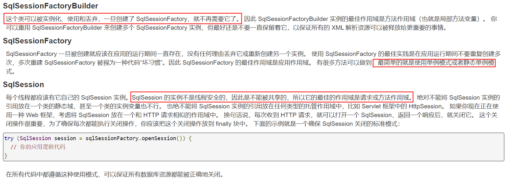


# 3 CRUD 

- 按目录结构完成【CRUD】的添加

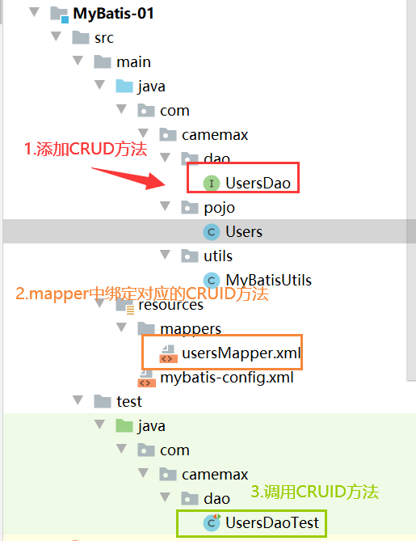


## 3.1 测试

1. 在Dao层中，添加 【update】 & 【delete】 & 【insert】的方法名

   ```java
   package com.camemax.dao;
   
   import com.camemax.pojo.Users;
   
   import java.util.List;
   
   public interface UsersDao {
   
       // 【select】所有用户信息
       List<Users> getUsersInfo();
   
       // 【select】指定用户信息
       Users getUserInfoById(int id);
   
       // 【update】指定用户信息
       Users updateUseInfoById(Users user);
   
       // 【insert】指定用户信息
       int insertUser(Users user);
   
       // 【delete】指定用户信息
       int deleteUserById(int id);
   }
   ```

2. 在XML映射器中，添加【update】 & 【delete】 & 【insert】方法的绑定

   ```xml
   <?xml version="1.0" encoding="UTF-8" ?>
   <!DOCTYPE mapper
           PUBLIC "-//mybatis.org//DTD Mapper 3.0//EN"
           "http://mybatis.org/dtd/mybatis-3-mapper.dtd">
   <mapper namespace="com.camemax.dao.UsersDao">
       <!-- select sql: 绑定getUsersInfo方法，返回所有用户信息 -->
       <!-- 【resultType】属性： 指定返回数据的类型 = Dao层所绑定的方法的方法头所指定的参数列表 -->
       <select id="getUsersInfo" resultType="com.camemax.pojo.Users">
           select * from school.users
       </select>
   
       <!-- select sql: 绑定getUserInfoById方法，返回指定用户信息 -->
       <!-- 【resultType】属性： 指定返回数据的类型 = Dao层所绑定的方法的方法头所指定的参数列表 -->
   	<!-- 【parameterType】属性： 指定传参类型 = Dao层所绑定的方法的方法头所指定的返回类型 -->
       <select id="getUserInfoById" parameterType="int" resultType="com.camemax.pojo.Users">
           select * from school.users where id = #{id}
       </select>
   
       <!-- update sql: 绑定updateUser方法，全额更新指定用户信息 -->
       <update id="updateUseInfoById" parameterType="com.camemax.pojo.Users">
           update school.users
           set username = #{username},
               password = #{password},
               email = #{email},
               gender = #{gender}
           where id = #{id}
       </update>
   
       <!-- insert sql: 绑定insertUser方法，插入单个用户信息-->
       <insert id="insertUser" parameterType="com.camemax.pojo.Users" >
           insert into school.users
           values (#{id},#{username},#{password},#{email},#{gender})
       </insert>
   
       <!-- delete sql: 绑定deleteUserById方法，删除指定用户信息 -->
       <delete id="deleteUserById" parameterType="int">
           delete from school.users
           where id = #{id}
       </delete>
   </mapper>
   ```

3. 在测试类中，添加【update】 & 【delete】 & 【insert】对应的方法

   1. 添加@Test注解 => 开启单元测试
   2. 调用MyBatis工具类，创建SqlSessionFactoryBuilder => SqlSessionFactory => SqlSession
   3. 调用SqlSession对象中的commit()方法 => 提交事务
   4. 调用SqlSession对象中的shutdown()方法 => 释放资源

   ```java
   package com.camemax.dao;
   
   import com.camemax.pojo.Users;
   import com.camemax.utils.MyBatisUtils;
   import org.apache.ibatis.session.SqlSession;
   import org.junit.Test;
   
   import java.util.List;
   
   public class UsersDaoTest {
   
       // 单元测试： 获取所有用户信息
       @Test
       public void getUsersInfo(){
   
           // 调用MyBatisUtils.getSqlSession()方法，获取SqlSession对象
           SqlSession sqlSession = MyBatisUtils.getSqlSession();
   
           // 调用获取到的SQLSession对象中的getMapper对象
           // 反射Dao接口，动态代理Dao接口中的方法，并将这些方法存在对象【mapper】中
           UsersDao mapper = sqlSession.getMapper(UsersDao.class);
   
           // 调用mapper中对应方法，并设置对应的对象来接收其返回结果
           // 以下为测试方法getUsersInfo() => 获取所有Users表中信息，并用对应类接收
           List<Users> usersInfo = mapper.getUsersInfo();
   
           // for循环遍历输出List集合
           for (Users users : usersInfo) {
               System.out.println(users);
           }
           // 关闭sqlSession
           sqlSession.close();
   
       }
   
       // 单元测试： 获取指定用户信息
       @Test
       public void getUserInfoById(){
           // 调用MyBatisUtils.getSqlSession()方法，获取SqlSession对象
           SqlSession sqlSession = MyBatisUtils.getSqlSession();
   
           // 调用获取到的SQLSession对象中的getMapper对象
           // 反射Dao接口，动态代理Dao接口中的方法，并将这些方法存在对象【mapper】中
           UsersDao mapper = sqlSession.getMapper(UsersDao.class);
   
           Users user = mapper.getUserInfoById(2);
           System.out.println(user);
   
           // 关闭sqlSession
           sqlSession.close();
       }
   
       // 单元测试： 单行插入指定用户信息
       @Test
       public void insertUsers(){
           // 调用MyBatisUtils.getSqlSession()方法，获取SqlSession对象
           SqlSession sqlSession = MyBatisUtils.getSqlSession();
   
           // 调用获取到的SQLSession对象中的getMapper对象
           // 反射Dao接口，动态代理Dao接口中的方法，并将这些方法存在对象【mapper】中
           UsersDao mapper = sqlSession.getMapper(UsersDao.class);
   /*
           int i1 = mapper.insertUser(new Users(2, "Aurthur", "aurthur", "Aurthur@outlook.com", 0));
           int i2 = mapper.insertUser(new Users(3, "Nero", "nero", "Nero@outlook.com", 0));
           int i3 = mapper.insertUser(new Users(4, "Gawain", "gawain", "Gawain@outlook.com", 1));
           int i4 = mapper.insertUser(new Users(5, "Lancelot", "lancelot", "Lancelot@outlook.com", 1));
   */
           int i = mapper.insertUser(
                   new Users(2, "Aurthur", "aurthur", "Aurthur@outlook.com", 0)
                   /*
                   ,new Users(3, "Nero", "nero", "Nero@outlook.com", 0)
                   ,new Users(4, "Gawain", "gawain", "Gawain@outlook.com", 1)
                   ,new Users(5, "Lancelot", "lancelot", "Lancelot@outlook.com", 1)
                   */
           );
   
           //提交事务
           sqlSession.commit();
           if ( i > 0 ){
               System.out.println("Insert Successful!");
           }
   
           // 关闭sqlSession
           sqlSession.close();
       }
   
       @Test
       public void deleteUserInfoById(){
           SqlSession sqlSession = MyBatisUtils.getSqlSession();
   
           UsersDao mapper = sqlSession.getMapper(UsersDao.class);
   
           String willDeleteUsername = mapper.getUserInfoById(2).getUsername();
           int i = mapper.deleteUserById(2);
   
           if (i > 0){
               System.out.println(willDeleteUsername + " has been deleted!");
           }
   
           sqlSession.commit();
           sqlSession.close();
       }
   
       @Test
       public void updateUseInfoById(){
   
           SqlSession session = MyBatisUtils.getSqlSession();
           UsersDao mapper = session.getMapper(UsersDao.class);
           int i = mapper.updateUseInfoById(new Users(1, "Camelot", "Fate/Grand Order", "Camelot@outlook.com", 1));
           if ( i > 0 ){
               System.out.println(mapper.getUserInfoById(1).getUsername() + " has been updated!");
           }
           session.commit();
           session.close();
       }
   }
   ```


# 4 批量插入

- 使用Map类型传递参数 => 【parameterType="map"】
  - 将【传递的参数】作为key，将【目标值】作为value
  - 调用put(\<key\>,\<value\>)方法


## 4.1 测试

### 4.1.1 批量插入

#### 4.1.1.1 官方声明

- List集合传参，XML映射器中使用\<foreach\>\<\foreach\>遍历List集合

  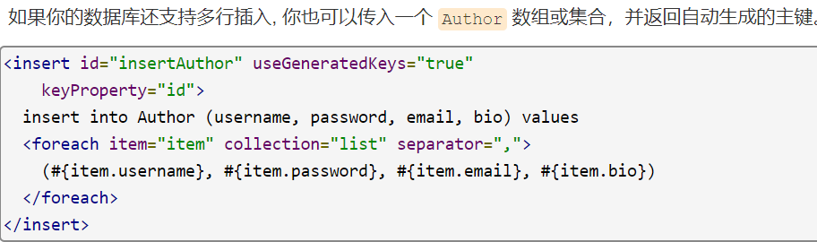

  - 参数解释：
    - foreach的主要作用在构建in条件中，它可以在SQL语句中进行迭代一个集合。foreach元素的属性主要有 collection，item，separator，index，open，close。
    - collection：指定要遍历的集合。表示传入过来的参数的数据类型。该属性是必须指定的，要做 foreach 的对象。在使用foreach的时候最关键的也是最容易出错的就是collection属性。在不同情况 下，该属性的值是不一样的，主要有一下3种情况：
      a. 如果传入的是单参数且参数类型是一个List的时候，collection属性值为list
      b. 如果传入的是单参数且参数类型是一个array数组的时候，collection的属性值为array
      c. 如果传入的参数是多个的时候，我们就需要把它们封装成一个Map了，当然单参数也可以封装成map。Map 对象没有默认的键
    - item：表示集合中每一个元素进行迭代时的别名。将当前遍历出的元素赋值给指定的变量，然后用#{变量名}，就能取出变量的值，也就是当前遍历出的元素。
    - separator：表示在每次进行迭代之间以什么符号作为分隔符。select * from tab where id in(1,2,3)相当于1,2,3之间的","
    - index：索引。index指定一个名字，用于表示在迭代过程中，每次迭代到的位置。遍历list的时候index就是索引，遍历map的时候index表示的就是map的key，item就是map的值。
    - open表示该语句以什么开始，close表示以什么结束。


#### 4.1.1.2 自定义配置

- Dao层 => 【UsersDao】

  ```java
  package com.camemax.dao;
  
  import com.camemax.pojo.Users;
  
  import java.util.List;
  
  public interface UsersDao {
      // 【insert】 批量用户信息
      int insertManyUseList(List<Users> users);
  }
  ```

- XML映射器 => 【usersMapper.xml】

  ```xml
  <?xml version="1.0" encoding="UTF-8" ?>
  <!DOCTYPE mapper
          PUBLIC "-//mybatis.org//DTD Mapper 3.0//EN"
          "http://mybatis.org/dtd/mybatis-3-mapper.dtd">
  <mapper namespace="com.camemax.dao.UsersDao">
  
      <!-- insert sql: 绑定insertManyUseMap,批量插入 -->
      <insert id="insertManyUseList" >
          insert into school.users values
          <!-- foreach 标签：
              -【item】属性： 表示集合中每一个元素进行迭代时的别名
              - 【collection】属性： 参数类型是一个List的时候，collection属性值为list
              - 【separator】属性： 表示在每次进行迭代之间以什么符号作为分隔符。    
          -->
          <foreach  item="user" collection="list" separator=",">
              (#{user.id},#{user.username},#{user.password},#{user.email},#{user.gender})
          </foreach>
      </insert>
  </mapper>
  ```

- 测试类 => 【UsersDaoTest.java】

  ```java
  package com.camemax.dao;
  
  import com.camemax.pojo.Users;
  import com.camemax.utils.MyBatisUtils;
  import org.apache.ibatis.session.SqlSession;
  import org.junit.Test;
  
  import java.util.ArrayList;
  import java.util.List;
  
  public class UsersDaoTest {
  	
      //单元测试： 批量插入用户信息
      @Test
      public void insertManyUseList(){
  
          // 创建要插入的List集合信息
          List<Users> users = new ArrayList<Users>();
          users.add(new Users(2, "Aurthur", "aurthur", "Aurthur@outlook.com", 0));
          users.add(new Users(3, "Nero", "nero", "Nero@outlook.com", 0));
          users.add(new Users(4, "Gawain", "gawain", "Gawain@outlook.com", 1));
          users.add(new Users(5, "Lancelot", "lancelot", "Lancelot@outlook.com", 1));
  
          SqlSession sqlSession = MyBatisUtils.getSqlSession();
  
          UsersDao mapper = sqlSession.getMapper(UsersDao.class);
  
          int i = mapper.insertManyUseList(users);
  
          if ( i > 0 ){
              System.out.println("Insert Many Finished and Successful!");
          }
          sqlSession.commit();
  
          sqlSession.close();
      }
  }
  ```

  

# 5 模糊查找

- 实现MyBatis模糊查找
- 为了防止SQL注入，则在处理层传输带【%】的参数给XML映射器

## 5.1 测试

- Dao层 => 【UsersDao】

  ```java
  package com.camemax.dao;
  import com.camemax.pojo.Users;
  
    import java.util.List;
    import java.util.Map;
  
    public interface UsersDao {
    // 【select】 模糊查询
        List<Users> getUsersInfoByPhantomSelect(String username);
    }
  ```


  ```xml
  
- XML映射器 => 【usersMapper.xml】

  ```xml
  <?xml version="1.0" encoding="UTF-8" ?>
  <!DOCTYPE mapper
          PUBLIC "-//mybatis.org//DTD Mapper 3.0//EN"
          "http://mybatis.org/dtd/mybatis-3-mapper.dtd">
  <mapper namespace="com.camemax.dao.UsersDao">
  	<!-- select sql: 绑定getUsersInfoByPhantomSelect,模糊查询 -->
      <select id="getUsersInfoByPhantomSelect" resultType="com.camemax.pojo.Users">
          select * from school.users where username like #{username}
      </select>
  </mapper>
  ```

- 测试类 => 【UsersDaoTest】

  ```java
  package com.camemax.dao;
  
  import com.camemax.pojo.Users;
  import com.camemax.utils.MyBatisUtils;
  import org.apache.ibatis.session.SqlSession;
  import org.junit.Test;
  
  import java.util.ArrayList;
  import java.util.List;
  
  public class UsersDaoTest {
  	@Test
      public void getUsersInfoByPhantomSelect(){
  
          SqlSession sqlSession = MyBatisUtils.getSqlSession();
  
          UsersDao mapper = sqlSession.getMapper(UsersDao.class);
  
          List<Users> users = mapper.getUsersInfoByPhantomSelect("%e%");
  
          for (Users user : users) {
              System.out.println(user);
          }
  
          sqlSession.close();
  }
  ```

  

# 6 [配置解析](https://mybatis.org/mybatis-3/zh/configuration.html)

- 面向核心配置文件（官方默认【mybatis-config.xml】）
- 核心配置文件结构：
  - configuration（配置）
    - [properties（属性）](https://mybatis.org/mybatis-3/zh/configuration.html#properties)
    - [settings（设置）](https://mybatis.org/mybatis-3/zh/configuration.html#settings)
    - [typeAliases（类型别名）](https://mybatis.org/mybatis-3/zh/configuration.html#typeAliases)
    - [typeHandlers（类型处理器）](https://mybatis.org/mybatis-3/zh/configuration.html#typeHandlers)
    - [objectFactory（对象工厂）](https://mybatis.org/mybatis-3/zh/configuration.html#objectFactory)
    - [plugins（插件）](https://mybatis.org/mybatis-3/zh/configuration.html#plugins)
    - [environments（环境配置）](https://mybatis.org/mybatis-3/zh/configuration.html#environments)
      - environment（环境变量）
        - transactionManager（事务管理器）
        - dataSource（数据源）
    - [databaseIdProvider（数据库厂商标识）](https://mybatis.org/mybatis-3/zh/configuration.html#databaseIdProvider)
    - [mappers（映射器）](https://mybatis.org/mybatis-3/zh/configuration.html#mappers)


## 6.1 环境配置（environment）

- 【官方声明】MyBatis 可以配置成适应多种环境，这种机制有助于将 SQL 映射应用于多种数据库之中

- **【官方声明】不过要记住：尽管可以配置多个环境，但每个 SqlSessionFactory 实例只能选择一种环境。**

  - 通过核心配置文件中的\<environments\>标签中的【default】属性指定\<enviroment\>标签中的【id】属性，完成多环境下的单环境选择。
  - 默认环境和环境 ID 顾名思义。 环境可以随意命名，但务必保证默认的环境 ID 要匹配其中一个环境 ID。

  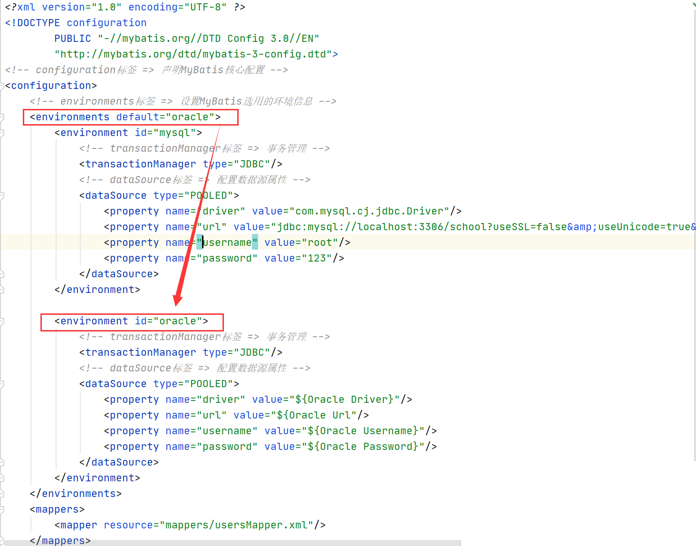


## 6.2 事务管理器（**transactionManager**）

- 【官方声明】：在 MyBatis 中有两种类型的事务管理器（也就是 type="[**JDBC|MANAGED**]"）：
  - **JDBC** – 这个配置直接使用了 JDBC 的提交和回滚设施，它依赖从数据源获得的连接来管理事务作用域。
  - **MANAGED** – 这个配置几乎没做什么。它从不提交或回滚一个连接，而是让容器来管理事务的整个生命周期（比如 JEE 应用服务器的上下文）。 默认情况下它会关闭连接。然而一些容器并不希望连接被关闭，因此需要将 closeConnection 属性设置为 false 来阻止默认的关闭行为。
- 【官方提示】：如果你正在使用 **Spring + MyBatis**，则没有必要配置事务管理器，因为 Spring 模块会使用自带的管理器来覆盖前面的配置。
- MyBatis默认事务管理器 => JDBC


## 6.3 数据源（DataSource）

- 【官方声明】：dataSource 元素使用标准的 JDBC 数据源接口来配置 JDBC 连接对象的资源。
- 【官方声明】：大多数 MyBatis 应用程序会按示例中的例子来配置数据源。虽然数据源配置是可选的，但如果要启用延迟加载特性，就必须配置数据源。

- 【官方声明】：有三种内建的数据源类型（也就是 type="[**UNPOOLED|POOLED|JNDI**]"）
  - **UNPOOLED**– 这个数据源的实现会每次请求时打开和关闭连接。虽然有点慢，但对那些数据库连接可用性要求不高的简单应用程序来说，是一个很好的选择。 性能表现则依赖于使用的数据库，对某些数据库来说，使用连接池并不重要，这个配置就很适合这种情形。
  - **POOLED**– 这种数据源的实现利用“池”的概念将 JDBC 连接对象组织起来，避免了创建新的连接实例时所必需的初始化和认证时间。 这种处理方式很流行，能使并发 Web 应用快速响应请求。
  - **JNDI** – 这个数据源实现是为了能在如 EJB 或应用服务器这类容器中使用，容器可以集中或在外部配置数据源，然后放置一个 JNDI 上下文的数据源引用。
- MyBatis默认数据源类型 => 【POOLED】
- 数据源类型： dbcp c3p0 druid hikari


## 6.4 属性（properties）

- 【官方声明】：属性可以在外部进行配置，并可以进行动态替换。

  - 外部.properties文件

    - 外部.properties文件 => 【dataSource.properties】

      ```properties
      #外部添加驱动配置
      propertiesDriver=com.mysql.cj.jdbc.Driver
      #外部添加Url地址
      propertisUrl=jdbc:mysql://localhost:3306/school?useSSL=false&useUnicode=true&characterEncoding=utf8&serverTimezone=CST
      ```

    - 核心配置文件 => 【mybatis-config.xml】

      ```xml
      <?xml version="1.0" encoding="UTF-8" ?>
      <!DOCTYPE configuration
              PUBLIC "-//mybatis.org//DTD Config 3.0//EN"
              "http://mybatis.org/dtd/mybatis-3-config.dtd">
      <!-- configuration标签 => 声明MyBatis核心配置 -->
      <configuration>
          <!-- properties标签 => 读取外部properties文件 -->
          <properties resource="dataSource.properties"/>
          <!-- environments标签 => 设置MyBatis选用的环境信息 -->
          <environments default="mysql">
              <environment id="mysql">
                  <!-- transactionManager标签 => 事务管理 -->
                  <transactionManager type="JDBC"/>
                  <!-- dataSource标签 => 配置数据源属性 -->
                  <dataSource type="POOLED">
                      <property name="driver" value="${propertiesDriver"/>
                      <property name="url" value="${propertiesUrl"/>
                      <property name="username" value="root"/>
                      <property name="password" value="123"/>
                  </dataSource>
              </environment>
          </environments>
          <mappers>
              <mapper resource="mappers/usersMapper.xml"/>
          </mappers>
      </configuration> 
      ```

  - 内部properties属性

    - 内部添加\<properties\>标签

      ```xml
      <?xml version="1.0" encoding="UTF-8" ?>
      <!DOCTYPE configuration
              PUBLIC "-//mybatis.org//DTD Config 3.0//EN"
              "http://mybatis.org/dtd/mybatis-3-config.dtd">
      <!-- configuration标签 => 声明MyBatis核心配置 -->
      <configuration>
          <!-- properties标签 => 读取外部properties文件 -->
          <properties resource="dataSource.properties">
              <property name="insideDriver" value="com.mysql.cj.jdbc.Driver"/>
              <property name="insideUrl" value="jdbc:mysql://localhost:3306/school?allowPublicKeyRetrieval=true&amp;useSSL=false&amp;useUnicode=true&amp;characterEncoding=utf8&amp;serverTimezone=CST"/>
              <property name="insideUsername" value="root"/>
              <property name="insidePassword" value="123"/>
          </properties>
          <!-- environments标签 => 设置MyBatis选用的环境信息 -->
          <environments default="mysql">
              <environment id="mysql">
                  <!-- transactionManager标签 => 事务管理 -->
                  <transactionManager type="JDBC"/>
                  <!-- dataSource标签 => 配置数据源属性 -->
                  <dataSource type="POOLED">
                      <property name="driver" value="${insideDriver}"/>
                      <property name="url" value="${insideDriver}"/>
                      <property name="username" value="${insideUsername}"/>
                      <property name="password" value="${insidePassword}"/>
                  </dataSource>
              </environment>
          </environments>
          <mappers>
              <mapper resource="mappers/usersMapper.xml"/>
          </mappers>
      </configuration>
      ```


## 6.5 设置（Settings）

- 【官方声明】：这是 MyBatis 中极为重要的调整设置，它们会改变 MyBatis 的运行时行为。

- 【官方声明】：一个配置完整的 settings 元素的示例如下：

  ```xml
  <settings>
    <setting name="cacheEnabled" value="true"/>
    <setting name="lazyLoadingEnabled" value="true"/>
    <setting name="multipleResultSetsEnabled" value="true"/>
    <setting name="useColumnLabel" value="true"/>
    <setting name="useGeneratedKeys" value="false"/>
    <setting name="autoMappingBehavior" value="PARTIAL"/>
    <setting name="autoMappingUnknownColumnBehavior" value="WARNING"/>
    <setting name="defaultExecutorType" value="SIMPLE"/>
    <setting name="defaultStatementTimeout" value="25"/>
    <setting name="defaultFetchSize" value="100"/>
    <setting name="safeRowBoundsEnabled" value="false"/>
    <setting name="mapUnderscoreToCamelCase" value="false"/>
    <setting name="localCacheScope" value="SESSION"/>
    <setting name="jdbcTypeForNull" value="OTHER"/>
    <setting name="lazyLoadTriggerMethods" value="equals,clone,hashCode,toString"/>
  </settings>
  ```


### 6.5.1 类别名（typeAliases）

- 【官方声明】：类型别名可为 Java 类型设置一个缩写名字。 它仅用于 XML 配置，意在降低冗余的全限定类名书写。

  ```xml
  <!-- 官方示例 -->
  <typeAliases>
    <typeAlias alias="Author" type="domain.blog.Author"/>
    <typeAlias alias="Blog" type="domain.blog.Blog"/>
    <typeAlias alias="Comment" type="domain.blog.Comment"/>
    <typeAlias alias="Post" type="domain.blog.Post"/>
    <typeAlias alias="Section" type="domain.blog.Section"/>
    <typeAlias alias="Tag" type="domain.blog.Tag"/>
  </typeAliases>
  ```

- 支持两种形式 ： [ **@Alias** || **XML映射器**]

  1. 【官方示例】：【注解】@Alias

     ```java
     @Alias("author")
     public class Author {
         ...
     }
     ```

  2. 【官方示例】：XML映射器 => [ **包名** | **全限定名**]

     ```xml
     <!-- 包名 -->
     <typeAliases>
       <!--除非使用注解，否则不支持自定义别名-->
       <package name="domain.blog"/>
     </typeAliases>
     
     <!-- 类路径 -->
     <typeAliases>
         <!-- 支持自定义别名Alias -->
     	<package name="com.camemax.dao.Users" alias="users"/>
     </typeAliases>
     ```

- 【官方声明】：常见的 Java 类型内建的类型别名。它们都是不区分大小写的，注意，为了应对原始类型的命名重复，采取了特殊的命名风格。

  | 别名       | 映射的类型 |
  | :--------- | :--------- |
  | _byte      | byte       |
  | _long      | long       |
  | _short     | short      |
  | _int       | int        |
  | _integer   | int        |
  | _double    | double     |
  | _float     | float      |
  | _boolean   | boolean    |
  | string     | String     |
  | byte       | Byte       |
  | long       | Long       |
  | short      | Short      |
  | int        | Integer    |
  | integer    | Integer    |
  | double     | Double     |
  | float      | Float      |
  | boolean    | Boolean    |
  | date       | Date       |
  | decimal    | BigDecimal |
  | bigdecimal | BigDecimal |
  | object     | Object     |
  | map        | Map        |
  | hashmap    | HashMap    |
  | list       | List       |
  | arraylist  | ArrayList  |
  | collection | Collection |
  | iterator   | Iterator   |

- 别名测试：

  - 包名+类注解@Alias

    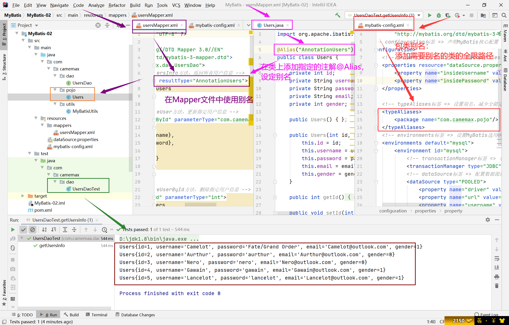

  - 自定义别名

    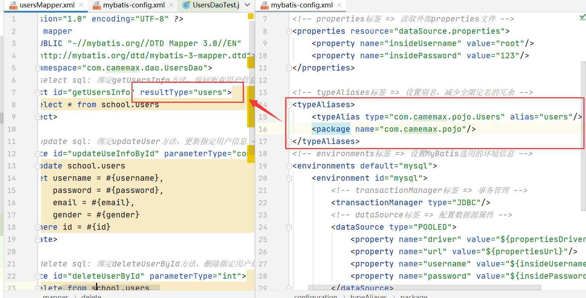


### 6.5.2 映射器(mapper)

- 定义SQL映射语句，指定MyBatis寻找SQL语句。

- 【官方声明】：指定映射文件路径

  1. 使用相对于类路径的资源引用 【推荐】：

     ```xml
     <mappers>
       <mapper resource="org/mybatis/builder/AuthorMapper.xml"/>
       <mapper resource="org/mybatis/builder/BlogMapper.xml"/>
       <mapper resource="org/mybatis/builder/PostMapper.xml"/>
     </mappers>
     ```

  2. 使用映射器接口实现类的完全限定类名

     ```xml
     <mappers>
       <mapper class="org.mybatis.builder.AuthorMapper"/>
       <mapper class="org.mybatis.builder.BlogMapper"/>
       <mapper class="org.mybatis.builder.PostMapper"/>
     </mappers>
     ```

  3. 将包内的映射器接口实现全部注册为映射器

     ```xml
     <mappers>
       <package name="org.mybatis.builder"/>
     </mappers>
     ```

  4. 使用完全限定资源定位符（URL） 【不推荐使用】

     ```xml
     <mappers>
       <mapper url="file:///var/mappers/AuthorMapper.xml"/>
       <mapper url="file:///var/mappers/BlogMapper.xml"/>
       <mapper url="file:///var/mappers/PostMapper.xml"/>
     </mappers>
     ```

- 测试

  1. 使用相对于类路径的资源引用：、

     - 资源目录：

       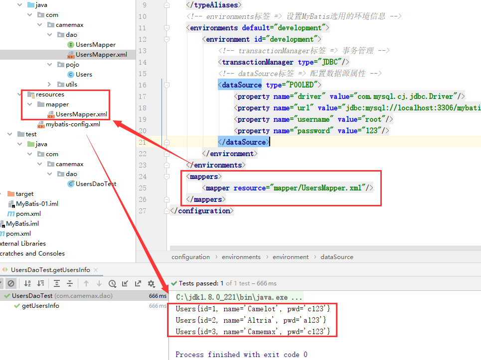

     - pom.xml中添加配置

       ```xml
       <!-- 过滤资源resource,使得resources路径能够被读取 -->
       <build>
           <resources>
               <resource>
                   <directory>src/main/resources</directory>
                   <includes>
                       <include>**/*.properties</include>
                       <include>**/*.xml</include>
                   </includes>
                   <filtering>true</filtering>
               </resource>
               <resource>
                   <directory>src/main/java</directory>
                   <includes>
                       <include>**/*.properties</include>
                       <include>**/*.xml</include>
                   </includes>
                   <filtering>true</filtering>
               </resource>
           </resources>
       </build>
       ```

     - mapper配置：

       ```xml
       <?xml version="1.0" encoding="UTF-8" ?>
       <!DOCTYPE configuration
               PUBLIC "-//mybatis.org//DTD Config 3.0//EN"
               "http://mybatis.org/dtd/mybatis-3-config.dtd">
       <!-- configuration标签 => 声明MyBatis核心配置 -->
       <configuration>
           <typeAliases>
               <typeAlias type="com.camemax.pojo.Users" alias="users"/>
           </typeAliases>
           <!-- environments标签 => 设置MyBatis选用的环境信息 -->
           <environments default="development">
               <environment id="development">
                   <!-- transactionManager标签 => 事务管理 -->
                   <transactionManager type="JDBC"/>
                   <!-- dataSource标签 => 配置数据源属性 -->
                   <dataSource type="POOLED">
                       <property name="driver" value="com.mysql.cj.jdbc.Driver"/>
                       <property name="url" value="jdbc:mysql://localhost:3306/mybatis?allowPublicKeyRetrieval=true&amp;useSSL=false&amp;useUnicode=true&amp;characterEncoding=utf8&amp;serverTimezone=CST"/>
                       <property name="username" value="root"/>
                       <property name="password" value="123"/>
                   </dataSource>
               </environment>
           </environments>
           <mappers>
               <mapper resource="mapper/UsersMapper.xml"/>
           </mappers>
       </configuration>
       ```

  2. 使用映射器接口实现类的完全限定类名

     - 资源目录：

       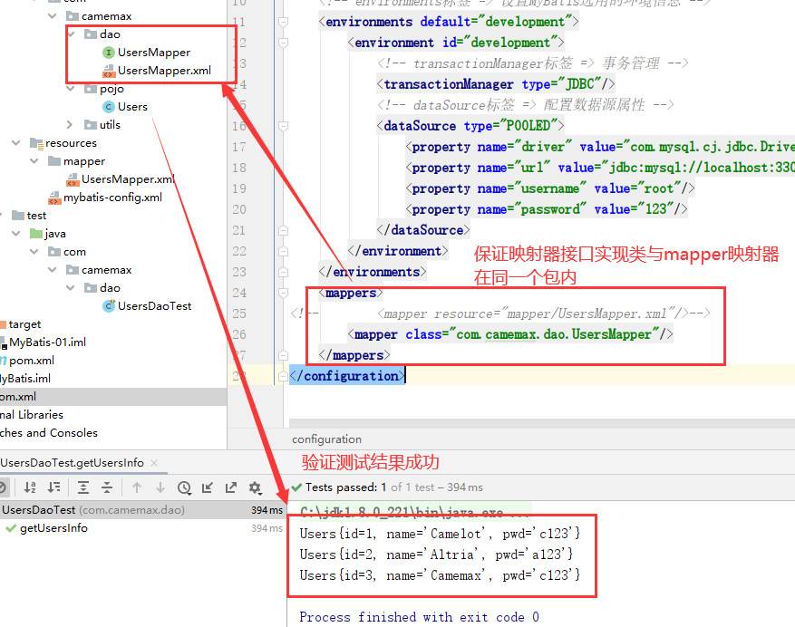

     - mapper配置：

       ```xml
       <?xml version="1.0" encoding="UTF-8" ?>
       <!DOCTYPE configuration
               PUBLIC "-//mybatis.org//DTD Config 3.0//EN"
               "http://mybatis.org/dtd/mybatis-3-config.dtd">
       <!-- configuration标签 => 声明MyBatis核心配置 -->
       <configuration>
           <typeAliases>
               <typeAlias type="com.camemax.pojo.Users" alias="users"/>
           </typeAliases>
           <!-- environments标签 => 设置MyBatis选用的环境信息 -->
           <environments default="development">
               <environment id="development">
                   <!-- transactionManager标签 => 事务管理 -->
                   <transactionManager type="JDBC"/>
                   <!-- dataSource标签 => 配置数据源属性 -->
                   <dataSource type="POOLED">
                       <property name="driver" value="com.mysql.cj.jdbc.Driver"/>
                       <property name="url" value="jdbc:mysql://localhost:3306/mybatis?allowPublicKeyRetrieval=true&amp;useSSL=false&amp;useUnicode=true&amp;characterEncoding=utf8&amp;serverTimezone=CST"/>
                       <property name="username" value="root"/>
                       <property name="password" value="123"/>
                   </dataSource>
               </environment>
           </environments>
           <mappers>
       <!--        <mapper resource="mapper/UsersMapper.xml"/>-->
               <mapper class="com.camemax.dao.UsersMapper"/>
           </mappers>
       </configuration>
       ```

  3. 将包内的映射器接口实现全部注册为映射器

     - 资源目录：

       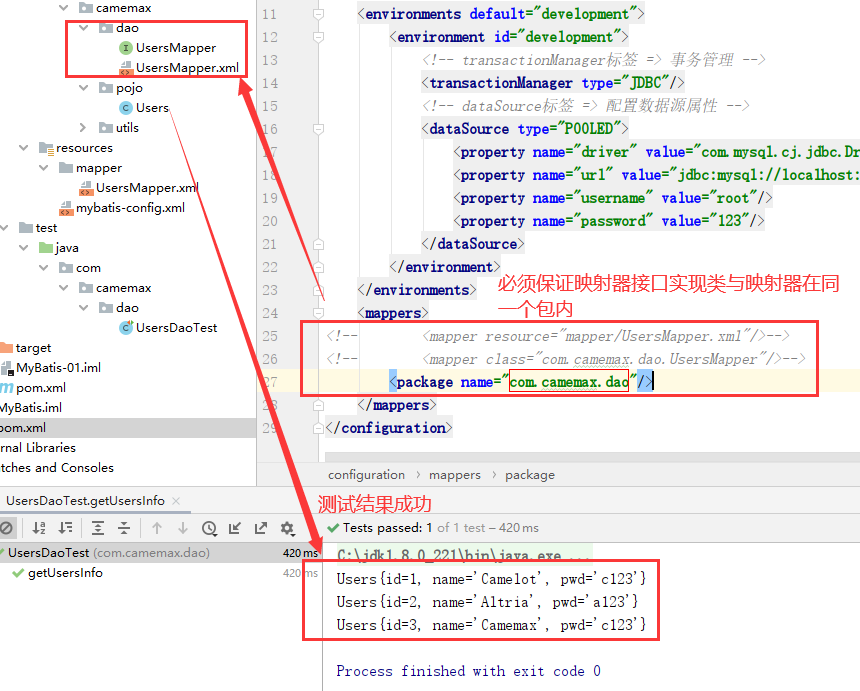

     - mapper配置：

       ```xml
       <?xml version="1.0" encoding="UTF-8" ?>
       <!DOCTYPE configuration
               PUBLIC "-//mybatis.org//DTD Config 3.0//EN"
               "http://mybatis.org/dtd/mybatis-3-config.dtd">
       <!-- configuration标签 => 声明MyBatis核心配置 -->
       <configuration>
           <typeAliases>
               <typeAlias type="com.camemax.pojo.Users" alias="users"/>
           </typeAliases>
           <!-- environments标签 => 设置MyBatis选用的环境信息 -->
           <environments default="development">
               <environment id="development">
                   <!-- transactionManager标签 => 事务管理 -->
                   <transactionManager type="JDBC"/>
                   <!-- dataSource标签 => 配置数据源属性 -->
                   <dataSource type="POOLED">
                       <property name="driver" value="com.mysql.cj.jdbc.Driver"/>
                       <property name="url" value="jdbc:mysql://localhost:3306/mybatis?allowPublicKeyRetrieval=true&amp;useSSL=false&amp;useUnicode=true&amp;characterEncoding=utf8&amp;serverTimezone=CST"/>
                       <property name="username" value="root"/>
                       <property name="password" value="123"/>
                   </dataSource>
               </environment>
           </environments>
           <mappers>
       <!--        <mapper resource="mapper/UsersMapper.xml"/>-->
       <!--        <mapper class="com.camemax.dao.UsersMapper"/>-->
               <package name="com.camemax.dao"/>
           </mappers>
       </configuration>
       ```

- 结论

  - 【使用相对于类路径的资源引用】：
    1. 支持放在resources目录下，但需要解除maven中的resources资源限制。
    2. \<mapper>标签中的【resource】属性指向mapper映射器所在的相对路径，并使用【/】分割
  - 【使用映射器接口实现类的完全限定类名】与 【将包内的映射器接口实现全部注册为映射器】：都需要将映射器接口实现类（dao）与mapper映射器放在==同一个包内==且==文件名相同==


## 6.7 作用域和生命周期

- MyBatis中，作用域与生命周期主要针对：【SqlSessionFactoryBuilder】、【SqlSessionFactory】、【SqlSession】

- 【官方声明】

  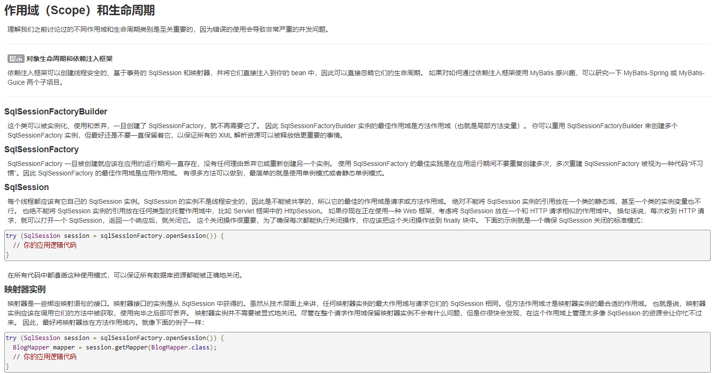


### 6.7.1 SqlSessionFactoryBuilder

- 【官方声明】

  >这个类可以被实例化、使用和丢弃，一旦创建了 SqlSessionFactory，就不再需要它了。 因此 SqlSessionFactoryBuilder 实例的最佳作用域是方法作用域（也就是局部方法变量）。 你可以重用 SqlSessionFactoryBuilder 来创建多个 SqlSessionFactory 实例，但最好还是不要一直保留着它，以保证所有的 XML 解析资源可以被释放给更重要的事情。

- 作用域 => 【方法作用域（局部方法变量）】

  ### 6.7.2 SqlSessionFactory

- 【官方声明】

  >SqlSessionFactory 一旦被创建就应该在应用的运行期间一直存在，没有任何理由丢弃它或重新创建另一个实例。 使用 SqlSessionFactory 的最佳实践是在应用运行期间不要重复创建多次，多次重建 SqlSessionFactory 被视为一种代码“坏习惯”。因此 SqlSessionFactory 的最佳作用域是应用作用域。 有很多方法可以做到，最简单的就是使用单例模式或者静态单例模式。

- 作用域 => 应用作用域

- 推荐使用【单例模式】或者【静态单例模式】

- 可以想象成 => 【数据库连接池】

6.7.3 SqlSession

- 【官方声明】

  >每个线程都应该有它自己的 SqlSession 实例。SqlSession 的实例不是线程安全的，因此是不能被共享的，所以它的最佳的作用域是请求或方法作用域。 绝对不能将 SqlSession 实例的引用放在一个类的静态域，甚至一个类的实例变量也不行。 也绝不能将 SqlSession 实例的引用放在任何类型的托管作用域中，比如 Servlet 框架中的 HttpSession。 如果你现在正在使用一种 Web 框架，考虑将 SqlSession 放在一个和 HTTP 请求相似的作用域中。 换句话说，每次收到 HTTP 请求，就可以打开一个 SqlSession，返回一个响应后，就关闭它。 这个关闭操作很重要，为了确保每次都能执行关闭操作，你应该把这个关闭操作放到 finally 块中。

- 作用域 => 【请求】或者【方法作用域（局部方法变量）】

- 一个web请求就可以开启一个SqlSession

- 及时释放资源，否则被占用

- 非线程安全，不能共享


# 7 [结果映射（resultMap）](https://mybatis.org/mybatis-3/zh/sqlmap-xml.html#Result_Maps)

- 【官方声明】

  >`resultMap` 元素是 MyBatis 中最重要最强大的元素。它可以让你从 90% 的 JDBC `ResultSets` 数据提取代码中解放出来，并在一些情形下允许你进行一些 JDBC 不支持的操作。实际上，在为一些比如连接的复杂语句编写映射代码的时候，一份 `resultMap` 能够代替实现同等功能的数千行代码。ResultMap 的设计思想是，对简单的语句做到零配置，对于复杂一点的语句，只需要描述语句之间的关系就行了。

- 【数据库字段】与【类属性字段】存在以下两种情况

  1. 命名相同：返回对应字段值
  2. 命名不相同：将导致查询不到指定字段值，返回'null'

- 解决【数据库字段】与【类属性字段】不相同

  1. SQL语句中实现字段别名

     - 【官方示例】

     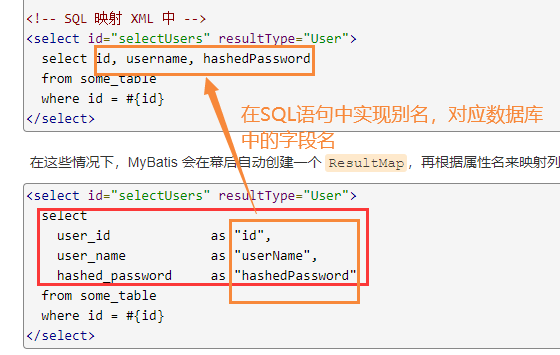

  2. mapper映射器中\<resultMap>标签绑定

     - 【官方实例】

       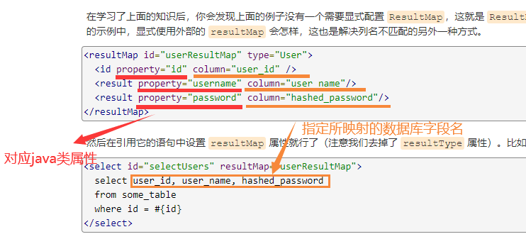

     - 测试

       - 修改实体类【Users】

         ```java
         package com.camemax.pojo;
         
         //实体类Users
         public class Users {
             // 【id】 => 【userId】
             private int userId;
             // 【name】 => 【userName】
             private String userName;
             // 【password】 => 【userPasswd】
             private String userPasswd;
         
             public Users(){};
         
             public Users(int id, String name, String pwd) {
                 this.userId = id;
                 this.userName = name;
                 this.userPasswd = pwd;
             }
         
             public int getId() {
                 return userId;
             }
         
             public void setId(int id) {
                 this.userId = id;
             }
         
             public String getName() {
                 return userName;
             }
         
             public void setName(String name) {
                 this.userName = name;
             }
         
             public String getPwd() {
                 return userPasswd;
             }
         
             public void setPwd(String pwd) {
                 this.userPasswd = pwd;
             }
         
             @Override
             public String toString() {
                 return "Users{" +
                         "id=" + userId +
                         ", name='" + userName + '\'' +
                         ", pwd='" + userPasswd + '\'' +
                         '}';
             }
         }
         ```

       - 修改mapper映射器 【UsersMapper】

         ```xml
         <?xml version="1.0" encoding="UTF-8" ?>
         <!DOCTYPE mapper
                 PUBLIC "-//mybatis.org//DTD Mapper 3.0//EN"
                 "http://mybatis.org/dtd/mybatis-3-mapper.dtd">
         <mapper namespace="com.camemax.dao.UsersMapper">
         
             <!-- 查询指定用户信息 -->
             <resultMap id="resultMapUser" type="users">
                 <!-- 类属性【userId】映射为数据库中的【id】字段 -->
                 <id property="userId" column="id"/>
                 <!-- 类属性【userName】映射为数据库中的【name】字段 -->
                 <result property="userName" column="name" />
                 <!-- 类属性【userPasswd】映射为数据库中的【password】字段 -->
                 <result property="userPasswd" column="password" />
             </resultMap>
         
             <!-- 【resultMap】属性指向<resultMap>标签 -->
             <select id="getUserInfoByUserId" resultType="users" parameterType="_int" resultMap="resultMapUser">
                 select * from mybatis.users
                 where id = #{id}
             </select>
         </mapper>
         ```


# 8 [日志](https://mybatis.org/mybatis-3/zh/logging.html)

## 8.1 日志工厂

- 【官方声明】

  >Mybatis 通过使用内置的日志工厂提供日志功能。内置日志工厂将会把日志工作委托给下面的实现之一：
  >
  >- SLF4J
  >- Apache Commons Logging
  >- Log4j 2
  >- Log4j
  >- JDK logging
  >
  >MyBatis 内置日志工厂会基于运行时检测信息选择日志委托实现。它会（按上面罗列的顺序）使用第一个查找到的实现。当没有找到这些实现时，将会禁用日志功能。
  >
  >不少应用服务器（如 Tomcat 和 WebShpere）的类路径中已经包含 Commons Logging。注意，在这种配置环境下，MyBatis 会把 Commons Logging 作为日志工具。这就意味着在诸如 WebSphere 的环境中，由于提供了 Commons Logging 的私有实现，你的 Log4J 配置将被忽略。这个时候你就会感觉很郁闷：看起来 MyBatis 将你的 Log4J 配置忽略掉了（其实是因为在这种配置环境下，MyBatis 使用了 Commons Logging 作为日志实现）。如果你的应用部署在一个类路径已经包含 Commons Logging 的环境中，而你又想使用其它日志实现，你可以通过在 MyBatis 配置文件 mybatis-config.xml 里面添加一项 setting 来选择其它日志实现。

- 可选参数：**SLF4J** | **LOG4J** | **LOG4J2** | **JDK_LOGGING** | **COMMONS_LOGGING** | **STDOUT_LOGGING** | **NO_LOGGING**


### 8.1.1 日志配置

- 配置mapper映射器，添加\<settings> - \<setting>标签

  - 测试 => 添加标准日志工厂**STDOUT_LOGGING**

    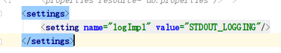

  - 测试输出

    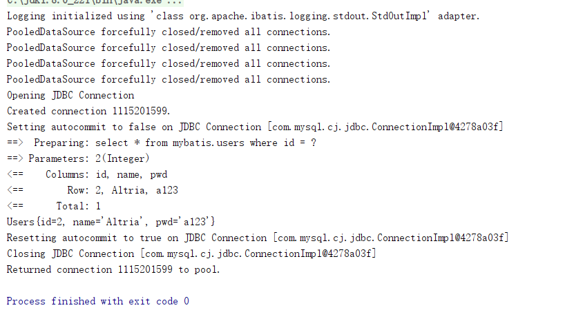


### 8.1.2 Log4J

- 什么是Log4J？

  - Log4j是[Apache](https://baike.baidu.com/item/Apache/8512995)的一个开源项目，通过使用Log4j，可以控制日志信息输送的目的地是[控制台](https://baike.baidu.com/item/控制台/2438626)、文件、[GUI](https://baike.baidu.com/item/GUI)组件，甚至是套接口服务器、[NT](https://baike.baidu.com/item/NT/3443842)的事件记录器、[UNIX](https://baike.baidu.com/item/UNIX) [Syslog](https://baike.baidu.com/item/Syslog)[守护进程](https://baike.baidu.com/item/守护进程/966835)等；
  - 控制每一条日志的输出格式；通过定义每一条日志信息的级别，能够更加细致地控制日志的生成过程。
  - 通过一个[配置文件](https://baike.baidu.com/item/配置文件/286550)来灵活地进行配置，而不需要修改应用的代码。

- 【官方声明】：使用方式

  1. 导入Maven依赖

     ```xml
     <dependency>
         <groupId>log4j</groupId>
         <artifactId>log4j</artifactId>
         <version>1.2.17</version>
     </dependency>
     ```

  2. 映射器开启日志功能

     ```xml
     <configuration>
       <settings>
         ...
         <setting name="logImpl" value="LOG4J"/>
         ...
       </settings>
     </configuration>
     ```

  3. log4j.properties

     ```properties
     # 全局日志配置
     log4j.rootLogger=ERROR, stdout,DEBUG,console,file
     # MyBatis 日志配置
     log4j.logger.org.mybatis.example.BlogMapper=TRACE
     # 控制台输出
     log4j.appender.stdout=org.apache.log4j.ConsoleAppender
     log4j.appender.stdout.layout=org.apache.log4j.PatternLayout
     log4j.appender.stdout.layout.ConversionPattern=%5p [%t] - %m%n
     ```

  4. 检测日志打印

     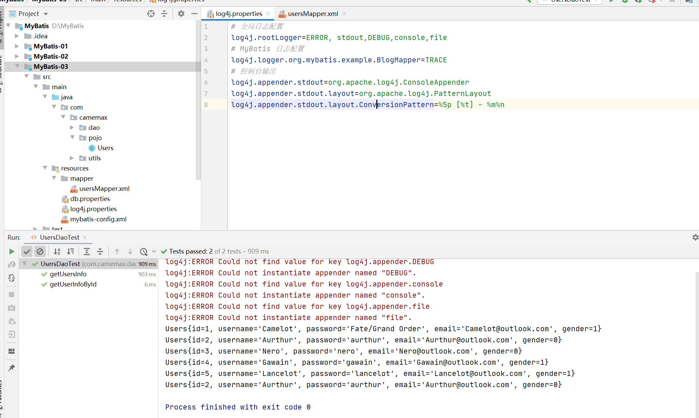

     

- 简洁的log4j.properties

  ```properties
  #将等级为DEBUG的日志信息输出到console和file这两个目的地，console和file的定义在下面的代码
  log4j.rootLogger=DEBUG,console,file
  
  #控制台输出的相关设置
  log4j.appender.console = org.apache.log4j.ConsoleAppender
  log4j.appender.console.Target = System.out
  log4j.appender.console.Threshold=DEBUG
  log4j.appender.console.layout = org.apache.log4j.PatternLayout
  log4j.appender.console.layout.ConversionPattern=【%c】-%m%n
  
  #文件输出的相关设置
  log4j.appender.file = org.apache.log4j.RollingFileAppender
  log4j.appender.file.File=./log/MyBatis.log
  log4j.appender.file.MaxFileSize=10mb
  log4j.appender.file.Threshold=DEBUG
  log4j.appender.file.layout=org.apache.log4j.PatternLayout
  log4j.appender.file.layout.ConversionPattern=【%p】【%d{yy-MM-dd}】【%c】%m%n
  
  #日志输出级别
  log4j.logger.org.mybatis=DEBUG
  log4j.logger.java.sql=DEBUG
  log4j.logger.java.sql.Statement=DEBUG
  log4j.logger.java.sql.ResultSet=DEBUG
  log4j.logger.java.sql.PreparedStatement=DEBUG
  ```

- 日志输出结果

  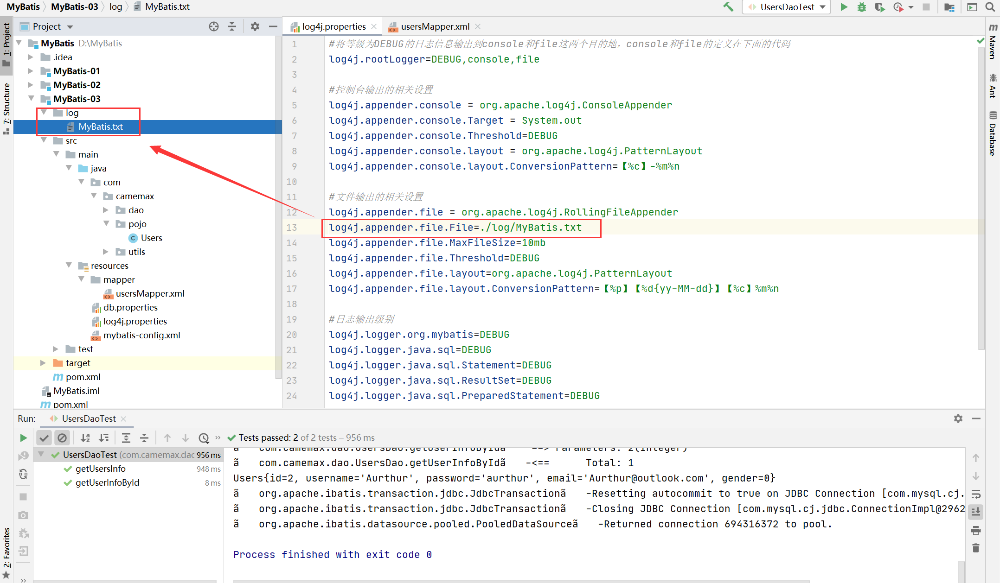


## 8.2 日志类使用

- 导入Apache-Log4J包

  ```java
  import org.apache.log4j.Logger;
  ```

- 使用反射当前对象来创建当前Logger对象

  ```java
  // 创建静态变量Logger对象 => logger
  // 使用当前类.class反射创建logger对象
  static Logger logger = logger.getLogger(UsersDaoTest.class)
  ```

- 设置输出等级与输出信息

  ```java
  @Test
  public void log4jTest(){
      logger.info("info: 日志输出等级【Info】");
      logger.debug("debug: 日志输出等级【DEBUG】");
      logger.error("error: 日志输出等级【ERROR】");
  }
  ```

- 日志打印输出

  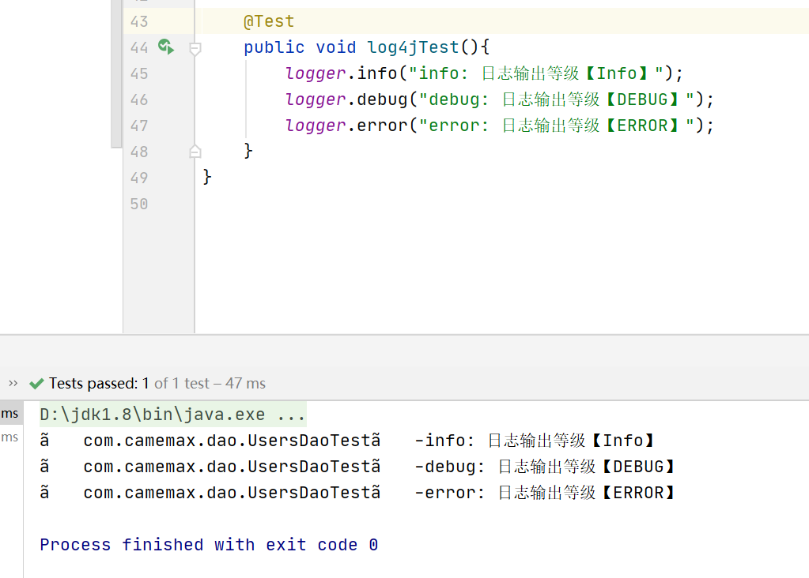


# 9 分页

- 减少单次获取到的数据量

- 实现方式

  - SQL语句 => limit

    ```sql
    // select * from mybatis.users limit <startIndex>,<returnSize>
    // limit x,-1 的bug已经被修复
    select * from mybatis.users limit 2,2
    ```

    - 测试

      1. 创建接口方法

         ```java
         List<Users> getUsersInfoByLimit();
         ```

      2. Mapper配置

         ```xml
         <resultMap id="getUsersInfoByLimit" type="MyBatisAliasUsers">
                 <id property="userId" column="id" />
                 <result property="userName" column="username" />
                 <result property="userPassword" column="password" />
                 <result property="userEmail" column="email" />
                 <result property="userGender" column="gender" />
             </resultMap>
             <!-- 使用map传入limit所需要的起始位置以及返回值 -->
             <select id="getUsersInfoByLimit" resultMap="getUsersInfoByLimit" parameterType="map">
                 select * from school.users limit #{startIndex},#{returnSize}
             </select>
         ```

      3. 测试类配置

         ```java
         @Test
         public void getUsersInfoByLimit(){
         
             MyBatisUtils myBatisUtils = new MyBatisUtils();
             SqlSession sqlSession = myBatisUtils.getSqlSession();
             UsersDao mapper = sqlSession.getMapper(UsersDao.class);
         
             // 指定HashMap传值给映射器Mapper
             // startIndex => 2
             // returnSize => 2
             HashMap<String,Integer> limitMap = new HashMap<String, Integer>();
             limitMap.put("startIndex",2);
             limitMap.put("returnSize",2);
         
             List<Users> users = mapper.getUsersInfoByLimit(limitMap);
             for (Users user : users) {
                 System.out.println(user);
             }
         
             sqlSession.close();
         }
         ```

      4. 日志输出返回结果

         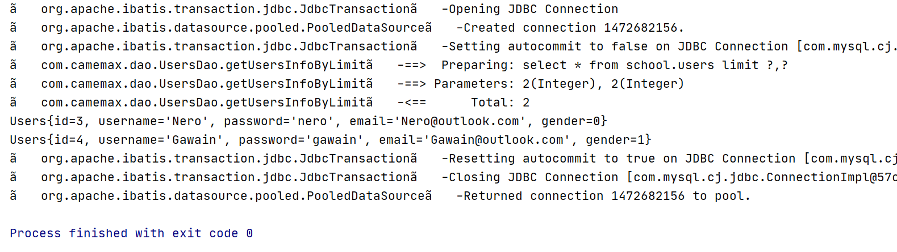

  - RowBounds 【不推荐】

  - PageHelper


# 10 注解

- 【官方声明】：可以使用Java注解进行配置

  - 接口注解配置

    ```java
    package org.mybatis.example;
    public interface BlogMapper {
      @Select("SELECT * FROM blog WHERE id = #{id}")
      Blog selectBlog(int id);
    }
    ```

- 测试

  1. dao层接口添加注解

     ```java
     @Select("select * from school.users")
     List<Users> getUsersInfoByAnnotation();
     ```
     
  2. 核心配置文件添加映射
  
     ```xml
     <!-- 核心配置文件绑定Dao层接口 -->
     <mappers>
         <mapper class="com.camemax.dao.UsersDao"/>
     </mappers>
     ```
  
  3. 测试类
  
     ```java
     @Test
     public void getUsersInfoByAnnotation(){
         MyBatisUtils myBatisUtils = new MyBatisUtils();
         SqlSession sqlSession = myBatisUtils.getSqlSession();
         UsersDao mapper = sqlSession.getMapper(UsersDao.class);
     
         List<Users> users = mapper.getUsersInfoByAnnotation();
         for (Users user : users) {
             System.out.println(user);
         }
     
         sqlSession.close();
     }
     ```

- 优缺点：

  - 优点：省去复杂的mapper映射器中的sql代码相关配置
  - 缺点：无法执行复杂的SQL，例如：存在字段异常不匹配时，使用注解执行SQL容易出现找不到值的情况（查询结果为'null'）

  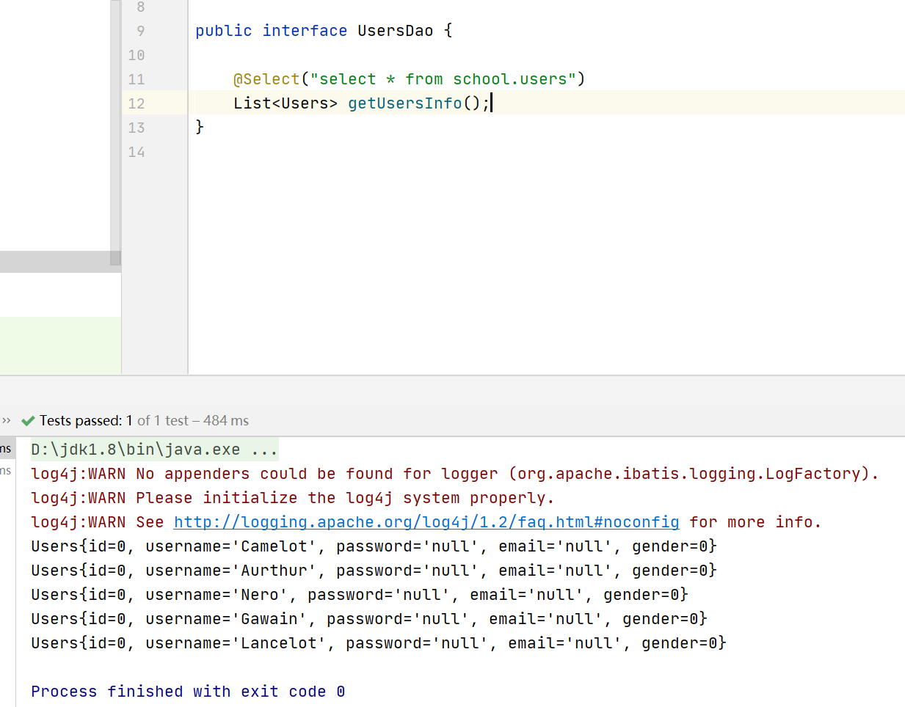


## 10.1 注解CRUD

- 使用注解完成简单的CRUD操作

### 10.1.1 INSERT


### 10.1.2 UPDATE

### 10.1.3 DELETE


# 11 MyBatis本质、底层与执行流程

- 本质：反射机制实现MyBatis三大类的创建

- 底层：使用动态代理接管dao层接口操作

- 执行流程：MyBatis工具类 => 【MyBatisUtils】，按照【官方使用步骤】：

  1. 获取核心配置文件【mybatis-config.xml】中的配置

     ```java
     try{
         // 指定配置文件路径
         String resource = "mybatis-config.xml";
         // 读取局部变量【resource】中的核心配置文件，并将其所有配置转化为input流
         // getResourceAsStream需要try...catch
         InputStream inputStream = Resources.getResourceAsStream(resource);
     }catch(Exception e){
         e.printStackTrace();
     }
     ```

  2. 实例化SqlSessionFactoryBuilder构造器 

     ```java
     // 调用SqlSessionFactoryBuilder()类的build()方法创建SqlSessionFactory对象
     /*
     	public class SqlSessionFactoryBuilder{
     		..
      		SqlSessionFactory build(InputStream inputStream) {
         return build(inputStream, null, null);
       }
     		..
     	}
     */
     SqlSessionFactory sqlSessionFactory = new SqlSessionFactoryBuilder().build(inputStream);
     ```

  3. 解析【1.获取核心配置文件中的配置】中配置好的文件解析流inputStream

     ```java
     // SqlSessionFactoryBuilder.build()重载
       public SqlSessionFactory build(InputStream inputStream) {
         return build(inputStream, null, null);
       }
     
     // SqlSessionFactoryBuilder.build()终会执行该build()方法：
     // XMLConfigBuilder.parse()完成对核心配置文件的解析
     public SqlSessionFactory build(Reader reader, String environment, Properties properties) {
         try {
           XMLConfigBuilder parser = new XMLConfigBuilder(reader, environment, properties);
           return build(parser.parse());
         } catch (Exception e) {
           throw ExceptionFactory.wrapException("Error building SqlSession.", e);
         } finally {
           ErrorContext.instance().reset();
           try {
             reader.close();
           } catch (IOException e) {
             // Intentionally ignore. Prefer previous error.
           }
         }
       }
     ```

  4. 实例化一个【按1.配置核心配置文件】的DefaultSqlSessionFactory

     ```java
     // 使用Configuration类存放所有XML配置信息，并传递给SqlSessionFactory对象
     public SqlSessionFactory build(Configuration config) {
         return new DefaultSqlSessionFactory(config);
     }
     ```

     1. 创建SqlSession对象

  5. 创建executor执行器

     - delegate = (SimpleExecutor)
     - tcm = (TranscationalCacheManager)
       - transcationalCache
     - autoCommit = **true** | **false**
     - dirty = **true** | **false**
     - cursorList = **null**

  6. 完成CRUD操作

  7. 判断事务

     - 成功提交
     - 失败回滚executor


# 12 多对一查询

- SQL返回的值需要使用到类时的处理方式

- 模拟测试：多个学生对应一个老师
  1. MySQL测试表【Teachers】、【Students】
  2. 测试实体类【Teachers】、【Students】
  3. dao层【TeachersMapper】、【StudentsMapper】
  4. XML映射文件【teachersMapper.xml】、【studentsMapper.xml】
  5. 核心配置文件=>【mybatis-config.xml】绑定dao接口、注册XML映射文件
  6. 输出测试
  
- 整体目录结构

  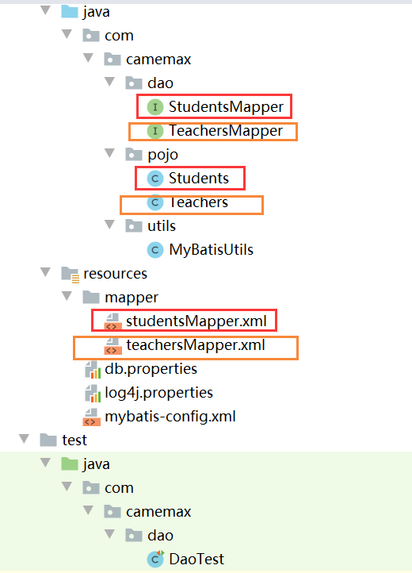


## 12.1 环境搭建

### 12.1.1 MySQL创建测试数据

```mysql
use school;

#教师表
DROP TABLE IF exists teachers;
create table teachers(
	`tid` int(10),
	`tname` varchar(20) DEFAULT NULL,
	PRIMARY KEY (`tid`)
	)ENGINE=INNODB DEFAULT CHARSET=utf8;

#学生表
DROP TABLE IF exists students;
create table students(
	`id` int(10) ,
	`name` varchar(20) DEFAULT NULL,
	`tid` int(10) DEFAULT NULL,
	PRIMARY KEY (`id`),
	CONSTRAINT `fktid` FOREIGN KEY (`tid`) REFERENCES `teachers` (`tid`)	
	)ENGINE=INNODB DEFAULT CHARSET=utf8;
	
	insert into teachers (`tid`,`tname`) values (1,'卡梅克斯');
	
	insert into students (`id`,`name`,`tid`) values (1,'小红',1);
	insert into students (`id`,`name`,`tid`) values (2,'小黄',1);
	insert into students (`id`,`name`,`tid`) values (3,'小黑',1);
	insert into students (`id`,`name`,`tid`) values (4,'小白',1);
	insert into students (`id`,`name`,`tid`) values (5,'小紫',1);

```

### 12.1.2 实体类与接口

- 学生相关

  - 【Students】实体类

    ```java
    package com.camemax.pojo;
    import org.apache.ibatis.type.Alias;
    
    @Alias("students")
    public class Students {
        private int sid;
        private String sname;
        // 添加【Teachers】类属性
        private Teachers teacher;
    
        public Students() {};
    
        public Students(int sid, String sname, Teachers teacher) {
            this.sid = sid;
            this.sname = sname;
            this.teacher = teacher;
        }
    
        public int getSid() {
            return sid;
        }
    
        public void setSid(int sid) {
            this.sid = sid;
        }
    
        public String getSname() {
            return sname;
        }
    
        public void setSname(String sname) {
            this.sname = sname;
        }
    
        public Teachers getTeacher() {
            return teacher;
        }
    
        public void setTeacher(Teachers teacher) {
            this.teacher = teacher;
        }
    
        @Override
        public String toString() {
            return "Students{" +
                    "sid=" + sid +
                    ", sname='" + sname + '\'' +
                    ", teacher=" + teacher +
                    '}';
        }
    }
    ```

  - 【StudentsMapper】接口

    ```java
    package com.camemax.dao;
    
    import com.camemax.pojo.Students;
    import java.util.List;
    
    public interface StudentsMapper {
    	//查询所有学生信息，同时输出教师信息
        List<Students> getStudentsInfo();
    }
    
    ```

    

- 教师相关

  - 【Teachers】实体类
  
    ```java
    package com.camemax.pojo;
    
    import org.apache.ibatis.type.Alias;
    
    @Alias("teachers")
    public class Teachers {
        private int tid;
        private String tname;
    
        public Teachers() {};
    
        public Teachers(int tid, String tname) {
            this.tid = tid;
            this.tname = tname;
        }
    
        public int getTid() {
            return tid;
        }
    
        public void setTid(int tid) {
            this.tid = tid;
        }
    
        public String getTname() {
            return tname;
        }
    
        public void setTname(String tname) {
            this.tname = tname;
        }
    
        @Override
        public String toString() {
            return "Teachers{" +
                    "tid=" + tid +
                    ", tname='" + tname + '\'' +
                    '}';
        }
    }
    ```
    
  - 【TeachersMapper】接口
  
    ```java
    package com.camemax.dao;
    
    public interface TeachersMapper {
    }
    ```
  
    

### 12.1.3 Mapper映射器

- mybatis-config.xml

  ```xml
  <?xml version="1.0" encoding="UTF-8" ?>
  <!DOCTYPE configuration
          PUBLIC "-//mybatis.org//DTD Config 3.0//EN"
          "http://mybatis.org/dtd/mybatis-3-config.dtd">
  <configuration>
      <properties resource="db.properties"/>
  
      <settings>
          <setting name="logImpl" value="LOG4J"/>
      </settings>
  
      <typeAliases>
          <package name="com.camemax.pojo"/>
      </typeAliases>
  
      <environments default="development">
          <environment id="development">
              <transactionManager type="JDBC"/>
              <dataSource type="POOLED">
                  <property name="driver" value="${propDriver}"/>
                  <property name="url" value="${propUrl}"/>
                  <property name="username" value="${propUsername}"/>
                  <property name="password" value="${propPassword}"/>
              </dataSource>
          </environment>
      </environments>
      <!-- 注册Mapper-->
      <mappers>
          <mapper resource="mapper/studentsMapper.xml"/>
          <mapper resource="mapper/teachersMapper.xml"/>
      </mappers>
  </configuration>
  ```


## 12.2 按查询嵌套处理【子查询】

- studentsMapper.xml

  ```xml
   <!-- 按查询嵌套处理 -->
  <select resultMap="StudentsInfoMapBySelect" id="getStudentsInfo">
      select * from school.students
  </select>
  <resultMap id="StudentsInfoMapBySelect" type="students">
      <id property="sid" column="id"/>
      <result property="sname" column="name"/>
  
      <!-- 复杂类型： Teachers类
              【association】: 对象
                  - 【property】: 设置获取到的结果集字段 => private Teachers teacher
                  - 【column】: 设置映射对应的数据库字段 => tid
                  - 【javaType】: 设置返回类型 => Teachers
                  - 【select】: 子查询绑定。通过其他<select>标签中的值，指向其他select语句 => <select id="TeachersInfo">
              【collection】: 集合
          -->
      <association property="teacher" column="tid" javaType="Teachers" select="TeachersInfo"/>
  </resultMap>
  
  <!-- 查询指定教师信息 -->
  <select id="TeachersInfo" resultType="teachers">
      select * from school.teachers where tid = #{tid}
  </select>
  
  
  ```

- teachersMapper.xml

  ```xml
  <?xml version="1.0" encoding="UTF-8" ?>
  <!DOCTYPE mapper
          PUBLIC "-//mybatis.org//DTD Mapper 3.0//EN"
          "http://mybatis.org/dtd/mybatis-3-mapper.dtd">
  <mapper namespace="com.camemax.dao.TeachersMapper">
  </mapper>
  ```

- 返回结果

  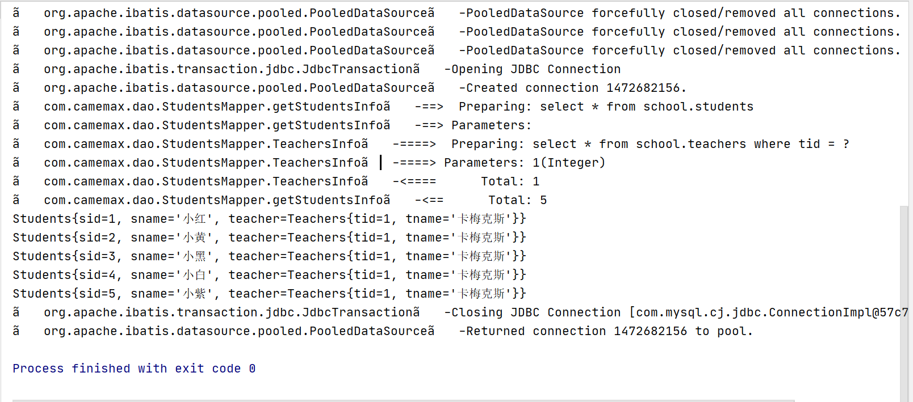


## 12.3 按结果嵌套处理【关联】

- studentsMapper.xml

  ```xml
  <!-- 按结果嵌套处理 -->
  <select id="getStudentsInfo" resultMap="getStudentsInfoByResult">
      select s.id studentId,
      s.name studentName,
      t.tname teacherName
      from students s,teachers t
      where s.tid = t.tid;
  </select>
  <resultMap id="getStudentsInfoByResult" type="students">
      <id property="sid" column="studentId"/>
      <result property="sname" column="studentName"/>
      <association property="teacher" javaType="Teachers">
          <result property="tname" column="teacherName"/>
      </association>
  </resultMap>
  ```

- teachersMapper.xml

  ```xml
  <?xml version="1.0" encoding="UTF-8" ?>
  <!DOCTYPE mapper
          PUBLIC "-//mybatis.org//DTD Mapper 3.0//EN"
          "http://mybatis.org/dtd/mybatis-3-mapper.dtd">
  <mapper namespace="com.camemax.dao.TeachersMapper">
  </mapper>
  ```

- 返回结果

  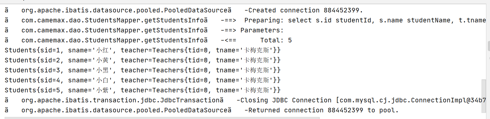

 

# 13 一对多查询

- 模拟测试：一名老师有多名学生 => 【面向教师】
- 本质：使用\<collection>标签完成一对多的输出


## 13.1 基于[12.1环境搭建](#12.1 环境搭建)做出的修改

1. dao层  => 【TeachersDao】

   ```java
   package com.camemax.dao;
   
   import com.camemax.pojo.Students;
   import com.camemax.pojo.Teachers;
   import org.apache.ibatis.annotations.Param;
   
   import java.util.List;
   
   public interface TeachersMapper {
   	// 传入指定教师编号，返回其下学生信息
       List<Students> getTeacherByIdHasStudents(@Param("tid") int tid);
   }
   
   ```

2. 实现类 => 【Teachers】

   ```java
   package com.camemax.pojo;
   
   import org.apache.ibatis.type.Alias;
   
   import java.util.List;
   
   @Alias("teachers")
   public class Teachers {
       private int tid;
       private String tname;
       // 新增属性 ： 教师拥有的学生
       private List<Students> teacherHasStudents;
   
       public List<Students> getTeacherHasStudents() {
           return teacherHasStudents;
       }
   
       public void setTeacherHasStudents(List<Students> teacherHasStudents) {
           this.teacherHasStudents = teacherHasStudents;
       }
   
       public Teachers(int tid, String tname, List<Students> teacherHasStudents) {
           this.tid = tid;
           this.tname = tname;
           this.teacherHasStudents = teacherHasStudents;
       }
   
       public Teachers() {};
   
       public int getTid() {
           return tid;
       }
   
       public void setTid(int tid) {
           this.tid = tid;
       }
   
       public String getTname() {
           return tname;
       }
   
       public void setTname(String tname) {
           this.tname = tname;
       }
   
       @Override
       public String toString() {
           return "Teachers{" +
                   "tid=" + tid +
                   ", tname='" + tname + '\'' +
                   ", teacherHasStudents=" + teacherHasStudents +
                   '}';
       }
   }
   ```

3. 实体类 => 【Students】

   ```
   package com.camemax.pojo;
   
   import org.apache.ibatis.type.Alias;
   
   @Alias("students")
   public class Students {
       private int sid;
       private String sname;
       private int tid;
   
       public Students(){};
       
       public Students(int sid, String sname, int tid) {
           this.sid = sid;
           this.sname = sname;
           this.tid = tid;
       }
   
       @Override
       public String toString() {
           return "Students{" +
                   "sid=" + sid +
                   ", sname='" + sname + '\'' +
                   ", tid=" + tid +
                   '}';
       }
   
       public int getSid() {
           return sid;
       }
   
       public void setSid(int sid) {
           this.sid = sid;
       }
   
       public String getSname() {
           return sname;
       }
   
       public void setSname(String sname) {
           this.sname = sname;
       }
   
       public int getTid() {
           return tid;
       }
   
       public void setTid(int tid) {
           this.tid = tid;
       }
   }
   ```

4. 测试实现类 => 【DaoTest】

   ```java
   @Test
   public void getStudentsByTid(){
       MyBatisUtils mybatis = new MyBatisUtils();
       SqlSession sqlSession = mybatis.getSqlSession();
       TeachersMapper mapper = sqlSession.getMapper(TeachersDao.class);
       
       System.out.println(mapper.getStudentsByTid(1));
     	sqlSession.close();
   }
   ```


## 13.2 按查询嵌套处理 【子查询】

1. XML映射文件 => teachersMapper.xml

   ```xml
   <select id="getStudentsByTid" resultMap="getStudentsByTidMapUseSelect">
       select * from school.teachers where tid = #{tid}
   </select>
   
   <!-- 创建【getStudentsByTidMapUseSelect】映射结果集，实现一对多结果返回。 
   	注意：Teachers类 使用了 @Alias("teachers") 
   -->
   <resultMap id="getStudentsByTidMapUseSelect" type="teachers">
       <id property="tid" column="tid" />
       <result property="tname" column="name" />
       <!-- Teachers类中新增List<Students> teacherHasStudents属性字段 
   			javaType: 指定在java中的字段类型属性
   			ofType: 指定类型所属类
   			select: 使resultMap绑定指定<select>标签
   			column: 使resultMap传递指定的属性字段
   	-->
       <collection property="teacherHasStudents" javaType="ArrayList" ofType="students" select="getStudentsByTid" column="tid"/> 
   </resultMap>
   
   <!-- 子查询：学生信息 -->
   <select id="getStudentsByTid" resultMap="studentsMap">
   	select * from school.students where tid = #{tid}
   </select>
   
   <!-- 创建【studentsMap】，映射Students类中，与Teachers表字段不一致的属性字段 -->
   <resultMap id="studentsMap" type="students">
       <id property="sid" column="id" />
       <result property="sname" column="name"/>
    	<!-- 不加会导致字段【tid】结果为0 -->   
       <result property="tid" column="tid" />
   </resultMap>
   ```

2. 输出结果

   ```java
   // 按查询嵌套处理 => 子查询 结果：
   [Teachers{tid=1, tname='卡梅克斯', teacherHasStudents=[Students{sid=1, sname='小红', tid=1}, Students{sid=2, sname='小黄', tid=1}, Students{sid=3, sname='小黑', tid=1}, Students{sid=4, sname='小白', tid=1}, Students{sid=5, sname='小紫', tid=1}]}]
   ```

   

## 13.3 按结果嵌套处理 【关联查询】

1. XML映射文件 => teachersMapper.xml

   ```xml
   <select id="getTeacherByIdHasStudents" resultMap="teacherGetStudentsByResult">
       select s.id studentId,s.name studentName,s.tid,t.tname teacherName,t.tid
       from students s,teachers t
       where s.tid = t.tid
       and t.tid = #{tid}
   </select>
   <resultMap id="teacherGetStudentsByResult" type="teachers">
       <id property="tid" column="tid"/>
       <result property="tname" column="teacherName"/>
       <collection property="teacherHasStudents" ofType="students">
           <id property="sid" column="studentId"/>
           <result property="sname" column="studentName"/>
           <result property="tid" column="tid" />
       </collection>
   </resultMap>
   ```

2. 测试结果

   ```java
   // 按结果嵌套处理 => 关联查询 结果：
   [Teachers{tid=1, tname='卡梅克斯', teacherHasStudents=[Students{sid=1, sname='小红', tid=1}, Students{sid=2, sname='小黄', tid=1}, Students{sid=3, sname='小黑', tid=1}, Students{sid=4, sname='小白', tid=1}, Students{sid=5, sname='小紫', tid=1}]}]
   ```


# 14.[动态SQL](https://mybatis.org/mybatis-3/zh/dynamic-sql.html)

- 【官方声明】

  >动态 SQL 是 MyBatis 的强大特性之一。如果你使用过 JDBC 或其它类似的框架，你应该能理解根据不同条件拼接 SQL 语句有多痛苦，例如拼接时要确保不能忘记添加必要的空格，还要注意去掉列表最后一个列名的逗号。利用动态 SQL，可以彻底摆脱这种痛苦。
  >
  >使用动态 SQL 并非一件易事，但借助可用于任何 SQL 映射语句中的强大的动态 SQL 语言，MyBatis 显著地提升了这一特性的易用性。
  >
  >如果你之前用过 JSTL 或任何基于类 XML 语言的文本处理器，你对动态 SQL 元素可能会感觉似曾相识。在 MyBatis 之前的版本中，需要花时间了解大量的元素。借助功能强大的基于 OGNL 的表达式，MyBatis 3 替换了之前的大部分元素，大大精简了元素种类，现在要学习的元素种类比原来的一半还要少。


## 14.1 IF关键字

### 14.1.1 环境搭建

1. MySQL建表 => 【blog】

   ```mysql
   #建表
   drop database if exists test;
   create database test;
   
   use test;
   drop table if exists blog;
   create table blog(
   	`id` varchar(50) NOT NULL COMMENT '博客id',
   	`title` varchar(100) NOT NULL COMMENT '博客标题',
   	`author` varchar(30) NOT NULL COMMENT '博客作者',
   	`create_time` datetime NOT NULL COMMENT '创建时间',
   	`views` int(30) NOT NULL COMMENT '浏览量'
   )ENGINE=INNODB DEFAULT CHARSET=utf8;
   ```

2. 准备工作&&创建测试数据

   1. 创建实体类 => 【Blogs】

      ```java
      package com.camemax.pojo;
      
      import org.apache.ibatis.type.Alias;
      
      import java.util.Date;
      
      @Alias("blogs")
      public class Blogs {
          private String id;
          private String title;
          private String author;
          private Date createTime;
          private int views;
      
          public Blogs(){};
      
          public Blogs(String blogId, String blogTitle, String blogAuthor, Date createTime, int blogViews) {
              this.id = blogId;
              this.title = blogTitle;
              this.author = blogAuthor;
              this.createTime = createTime;
              this.views = blogViews;
          }
      
          @Override
          public String toString() {
              return "Blog{" +
                      "blogId='" + id + '\'' +
                      ", blogTitle='" + title + '\'' +
                      ", blogAuthor='" + author + '\'' +
                      ", createTime=" + createTime +
                      ", blogViews=" + views +
                      '}';
          }
      
          public String getBlogId() {
              return id;
          }
      
          public void setBlogId(String blogId) {
              this.id = blogId;
          }
      
          public String getBlogTitle() {
              return title;
          }
      
          public void setBlogTitle(String blogTitle) {
              this.title = blogTitle;
          }
      
          public String getAuthor() {
              return author;
          }
      
          public void setAuthor(String author) {
              this.author = author;
          }
      
          public Date getCreateTime() {
              return createTime;
          }
      
          public void setCreateTime(Date createTime) {
              this.createTime = createTime;
          }
      
          public int getViews() {
              return views;
          }
      
          public void setViews(int views) {
              this.views = views;
          }
      }
      ```

   2. 创建dao层接口 => BlogsMapper

      ```java
      package com.camemax.dao;
      
      import com.camemax.pojo.Blogs;
      public interface BlogsMapper {
          int addBlog(Blogs blog);
      }
      ```

   3. XML映射文件 => 【BlogsMapper.xml】

      ```xml
      <?xml version="1.0" encoding="UTF-8" ?>
      <!DOCTYPE mapper
              PUBLIC "-//mybatis.org//DTD Mapper 3.0//EN"
              "http://mybatis.org/dtd/mybatis-3-mapper.dtd">
      <mapper namespace="com.camemax.dao.BlogsMapper">
      
          <insert id="addBlog" parameterType="blogs">
              insert into test.blog values(
                  #{id},
                  #{title},
                  #{author},
                  #{createTime},
                  #{views}
              )
          </insert>
      </mapper>
      ```

   4. 核心配置文件 => 【mybatis-config.xml】

      ```xml
      <?xml version="1.0" encoding="UTF-8" ?>
      <!DOCTYPE configuration
              PUBLIC "-//mybatis.org//DTD Config 3.0//EN"
              "http://mybatis.org/dtd/mybatis-3-config.dtd">
      <configuration>
          <properties resource="db.properties"/>
      
          <settings>
              <setting name="logImpl" value="LOG4J"/>
              <setting name="mapUnderscoreToCamelCase" value="true"/>
          </settings>
      
          <typeAliases>
              <package name="com.camemax.pojo"/>
          </typeAliases>
      
          <environments default="development">
              <environment id="development">
                  <transactionManager type="JDBC"/>
                  <dataSource type="POOLED">
                      <property name="driver" value="${propDriver}"/>
                      <property name="url" value="${propUrl}"/>
                      <property name="username" value="${propUsername}"/>
                      <property name="password" value="${propPassword}"/>
                  </dataSource>
              </environment>
          </environments>
          <mappers>
              <mapper resource="mapper/BlogsMapper.xml"/>
      <!--        <mapper class="com.camemax.dao.UsersDao"/>-->
      <!--        <package name="com.camemax.dao"/>-->
          </mappers>
      </configuration>
      ```

   5. JDBC => 【db.properties】

      ```properties
      propDriver=com.mysql.cj.jdbc.Driver
      propUrl=jdbc:mysql://localhost:3306/test?useSSL=false&characterEncoding=utf8&serverTimezone=CST&useUnicode=true
      propUsername=root
      propPassword=123
      ```

   6. 使用UUID类实现唯一字段值

      ```java
      package com.camemax.utils;
      
      import java.util.UUID;
      
      public class UUIDUtils {
          public static String createUUID() {
              String createUUID = UUID.randomUUID().toString().replaceAll("-", "");
              return createUUID;
          }
      }
      ```

      

3. 测试实现类  => 【DaoTest】 ： 完成测试数据创建工作

   ```java
   @Test
       public void addBlog(){
   
           MyBatisUtils myBatisUtils = new MyBatisUtils();
           SqlSession sqlSession = myBatisUtils.getSqlSession();
           BlogsMapper mapper = sqlSession.getMapper(BlogsMapper.class);
   
           Blogs blogs = new Blogs();
           blogs.setBlogId(UUIDUtils.createUUID());
           blogs.setBlogTitle("MyBatis");
           blogs.setAuthor("Camemax");
           blogs.setCreateTime(new Date());
           blogs.setViews(9999);
           int i1 = mapper.addBlog(blogs);
   
           try {
               Thread.sleep(3000);
           } catch (InterruptedException e) {
               e.printStackTrace();
           }
   
           blogs.setBlogId(UUIDUtils.createUUID());
           blogs.setBlogTitle("Spring");
           blogs.setAuthor("Aurthur");
           blogs.setCreateTime(new Date());
           int i2 = mapper.addBlog(blogs);
   
   
           try {
               Thread.sleep(3000);
           } catch (InterruptedException e) {
               e.printStackTrace();
           }
           blogs.setBlogId(UUIDUtils.createUUID());
           blogs.setAuthor("Artria");
           blogs.setBlogTitle("Spring Framework");
           blogs.setCreateTime(new Date());
           int i3 = mapper.addBlog(blogs);
   
           try {
               Thread.sleep(3000);
           } catch (InterruptedException e) {
               e.printStackTrace();
           }
           blogs.setBlogId(UUIDUtils.createUUID());
           blogs.setAuthor("Camelot");
           blogs.setBlogTitle("Spring Boot");
           blogs.setCreateTime(new Date());
           int i4 = mapper.addBlog(blogs);
   
           try{
               Thread.sleep(3000);
           }catch (Exception e){
               e.printStackTrace();
           }
           blogs.setBlogId(UUIDUtils.createUUID());
           blogs.setBlogTitle("Waiting Update Title");
           blogs.setAuthor("Waiting Update Author");
           blogs.setCreateTime(new Date());
           blogs.setViews(0);
           int i5 = mapper.addBlog(blogs);
   
           if ( i1 > 0 && i2 > 0 && i3 > 0 && i4 > 0 && i5 > 0 ){
               System.out.println("add succeed");
           }
   
           sqlSession.close();
       }
   ```

4. 查询插入结果

   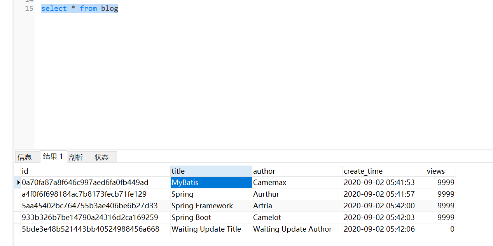


### 14.1.2 动态SQL测试

1. dao层 接口  => 【BlogsMapper】

   ```java
   package com.camemax.dao;
   
   import com.camemax.pojo.Blogs;
   import java.util.List;
   import java.util.Map;
   
   public interface BlogsMapper {
   	// 创建【插入测试数据】的方法
       int addBlog(Blogs blog);
   
       // 创建【实现动态SQL查询】的方法
       List<Blogs> getBlogsByDynamicSQL(Map<String,String> map);
   }
   ```

2. XML映射文件 => 【BlogsMapper.xml】

   ```xml
   <select id="getBlogsByDynamicSQL">
       <!-- 注意： where 1 = 1 尽量不使用 -->
   	select * from test.blog where 1 = 1
       <!-- <if>标签： 当向数据库发送的请求中，【title】字段不为空时，则添加【title】字段的查询过滤条件 -->
       <if test="title != null">
           and title = #{title}
       </if>
       <!-- <if>标签： 当向数据库发送的请求中，【author】字段不为空时，添加【author】字段的查询过滤条件 -->
       <if test="author != null">
           and author = #{author}
       </if>
   </select>
   ```

3. 测试实现类 => 【DaoTest】

   ```java
   @Test
   public void getBlogsByDynamicSQL(){
       
       MyBatisUtils mybatis = new MyBatisUtils();
       SqlSession sqlSession = mybatis.getSqlSession();
       BlogsMapper mapper = sqlSession.getMapper(BlogsMapper.class);
       
       List<Blogs> blogs = mapper.getBlogsByDynaticSQL();
       for (Blogs blog : blogs){
           System.out.print(blog);
       }
       
       sqlSession.close();
   }
   ```

4. 测试结果

   - 不加筛选条件，即传参的HashMap为null

     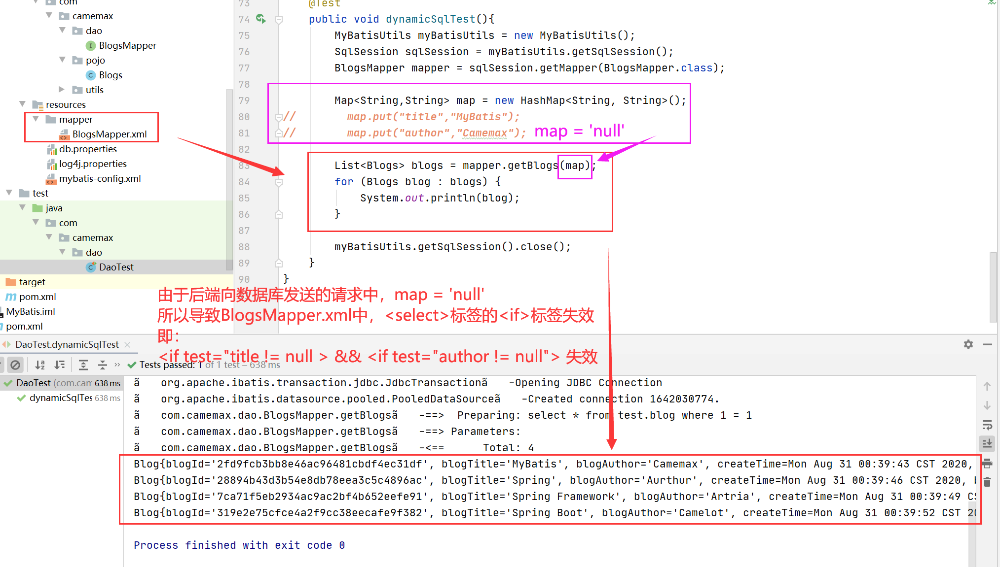

   - 添加筛选条件

     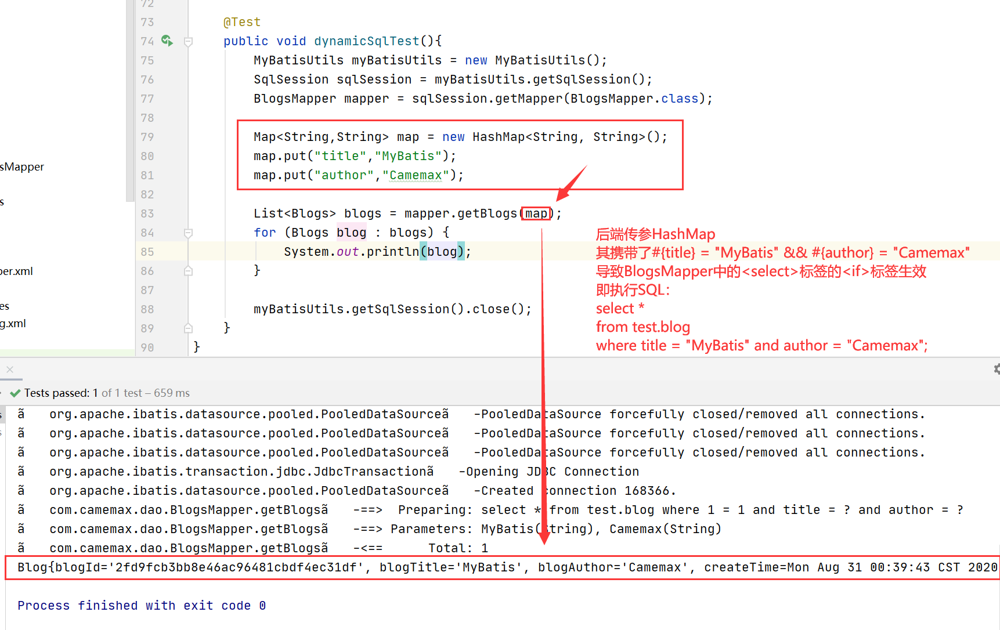


## 14.2 where、set

- 【官方实例】

  - 失败案例

    - 前面几个例子已经合宜地解决了一个臭名昭著的动态 SQL 问题。现在回到之前的 “if” 示例，这次我们将 “state = ‘ACTIVE’” 设置成动态条件，看看会发生什么。

      ```xml
      <select id="findActiveBlogLike"
           resultType="Blog">
        SELECT * FROM BLOG
        WHERE
        <if test="state != null">
          state = #{state}
        </if>
        <if test="title != null">
          AND title like #{title}
        </if>
        <if test="author != null and author.name != null">
          AND author_name like #{author.name}
        </if>
      </select>
      ```

    - 如果没有匹配的条件会怎么样？最终这条 SQL 会变成这样：

      ```sql
      SELECT * FROM BLOG
      WHERE
      ```

    - 这会导致查询失败。如果匹配的只是第二个条件又会怎样？这条 SQL 会是这样:

      ```sql
      SELECT * FROM BLOG
      WHERE
      AND title like ‘someTitle’
      ```

      

  - 成功案例

    - 这个查询也会失败。这个问题不能简单地用条件元素来解决。这个问题是如此的难以解决，以至于解决过的人不会再想碰到这种问题。MyBatis 有一个简单且适合大多数场景的解决办法。而在其他场景中，可以对其进行自定义以符合需求。而这，只需要一处简单的改动：

      ```xml
      <select id="findActiveBlogLike"
           resultType="Blog">
        SELECT * FROM BLOG
        <where>
          <if test="state != null">
               state = #{state}
          </if>
          <if test="title != null">
              AND title like #{title}
          </if>
          <if test="author != null and author.name != null">
              AND author_name like #{author.name}
          </if>
        </where>
      </select>
      ```

- 【官方声明】

  - \<where>标签：

    - *where* 元素只会在子元素返回任何内容的情况下才插入 “WHERE” 子句。而且，若子句的开头为 “AND” 或 “OR”，*where* 元素也会将它们去除。

  - \<trim>标签：

    - 如果 *where* 元素与你期望的不太一样，你也可以通过自定义 trim 元素来定制 *where* 元素的功能。比如，和 *where* 元素等价的自定义 trim 元素为：

      ```xml
      <trim prefix="WHERE" prefixOverrides="AND |OR ">
        <!-- 【prefixOverrides】属性：忽略通过管道符分隔的文本序列（注意此例中的空格是必要的）。会移除所有 prefixOverrides 属性中指定的内容，并且插入 prefix 属性中指定的内容。-->
      </trim>
      ```

  - \<set>标签：

    - 用于动态更新语句的类似解决方案叫做 *set*。*set* 元素可以用于动态包含需要更新的列，忽略其它不更新的列。

      ```xml
      <update id="updateAuthorIfNecessary">
        update Author
          <set>
            <if test="username != null">username=#{username},</if>
            <if test="password != null">password=#{password},</if>
            <if test="email != null">email=#{email},</if>
            <if test="bio != null" >bio=#{bio}</if>
          </set>
        where id=#{id}
      </update>
      ```


### 14.2.1 测试

1. Dao层接口添加实现方法 => 【BlogsMapper】

   ```java
   int updateBlogInfoBySet(Map map);
   ```

2. XML映射文件 => 【BlogsMapper.xml】

   ```xml
   <update id="updateBlogInfoBySet" parameterType="blogs">
       update test.blog 
       <set>
       	<if test="title != null"> title = #{title}</if>
           <if test="author != null"> author = #{author}</if>
           <if test="create_time != null"> create_time = #{createTime}</if>
           <if test="views != null"> views = #{views></if>
       </set>
   </update>
   ```

3. 测试实现类 => 【DaoTest】

   ```java
   @Test
   public void dynamicSqlUpdateBySet(){
       MyBatisUtils myBatisUtils = new MyBatisUtils();
       SqlSession sqlSession = myBatisUtils.getSqlSession();
       BlogsMapper mapper = sqlSession.getMapper(BlogsMapper.class);
   
       HashMap<String,String> map = new HashMap<String, String>();
       map.put("title","updatedTitle");
       map.put("author","updatedAuthor");
       map.put("createTime", String.valueOf(new Date()));
       map.put("views","1");
       map.put("id","5bde3e48b521443bb40524988456a668");
   
       int i = mapper.updateBlogInfoBySet(map);
       if (i > 0 ){
           System.out.println("Update Succeed!");
       }
       sqlSession.close();
   }
   ```

4. 测试结果

   1. 日志输出

      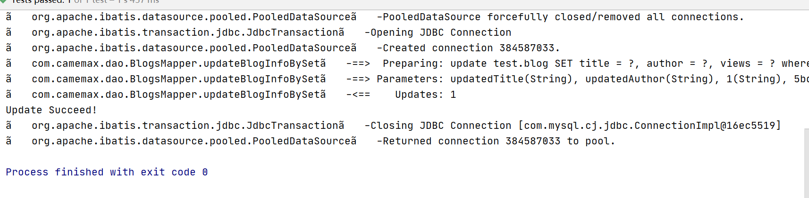

   2. 数据库验证

      - 原数据库数据

        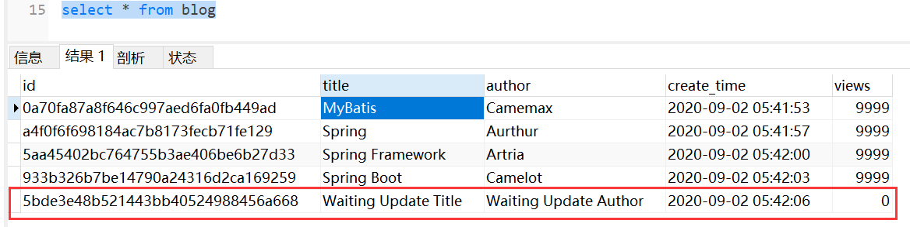

      - 现数据库数据

        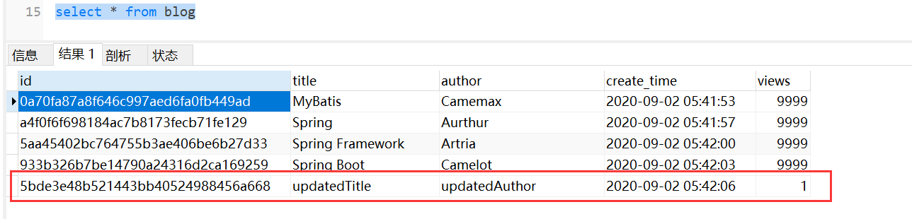


## 14.3 choose、when、otherwise

- 【官方声明】：有时候，我们不想使用所有的条件，而只是想从多个条件中选择一个使用。针对这种情况，MyBatis 提供了 choose 元素，它有点像 Java 中的 switch 语句。

  - 例子

    ```xml
    <select id="findActiveBlogLike"
         resultType="Blog">
      SELECT * FROM BLOG WHERE state = ‘ACTIVE’
      <choose>
        <when test="title != null">
          AND title like #{title}
        </when>
        <when test="author != null and author.name != null">
          AND author_name like #{author.name}
        </when>
        <otherwise>
          AND featured = 1
        </otherwise>
      </choose>
    </select>
    ```

    

### 14.3.1 测试

#### 14.3.1.1 环境搭建

1. dao层接口添加方法 => 【BlogsMapper】

   ```java
   List<Blogs> queryBlogsByChoose(Map map);
   ```

2. xml映射文件 => 【BlogsMapper.xml】

   ```xml
   <select id="queryBlogsByChoose" resultType="blogs" parameterType="map">
       select * from test.blog
       <!-- <choose>标签： 选择性返回
            |-   <when>标签： 当其内部条件成立时返回
            |-   <otherwise>标签： 当所有条件都不满足时执行
   	-->
       <choose>
           <when test=" title != null ">
               <where>
                   and title = #{title}
               </where>
           </when>
           <when test=" author != null">
               <where>
                   and author = #{author}
               </where>
           </when>
           <otherwise>
               <where>
                   and views = 9999
               </where>
           </otherwise>
       </choose>
   </select>
   ```

3. 测试实现类 => 【DaoTest】 (按测试情况进行配置 )


#### 14.3.1.2 测试结果

- 单个条件成立

  - 测试实现类 => 【DaoTest】

    ```java
    @Test
    public void dynamicSqlChoose(){
        MyBatisUtils myBatisUtils = new MyBatisUtils();
        SqlSession sqlSession = myBatisUtils.getSqlSession();
        BlogsMapper mapper = sqlSession.getMapper(BlogsMapper.class);
    
        HashMap<String,String> map = new HashMap<String, String>();
        //创建单条件成立的集合
        map.put("title","MyBatis");
        System.out.println(mapper.queryBlogsByChoose(map));
    
        sqlSession.close();
    }
    ```

  - 输出结果  1行记录：返回条件成立的结果集，不执行\<otherwise>标签

    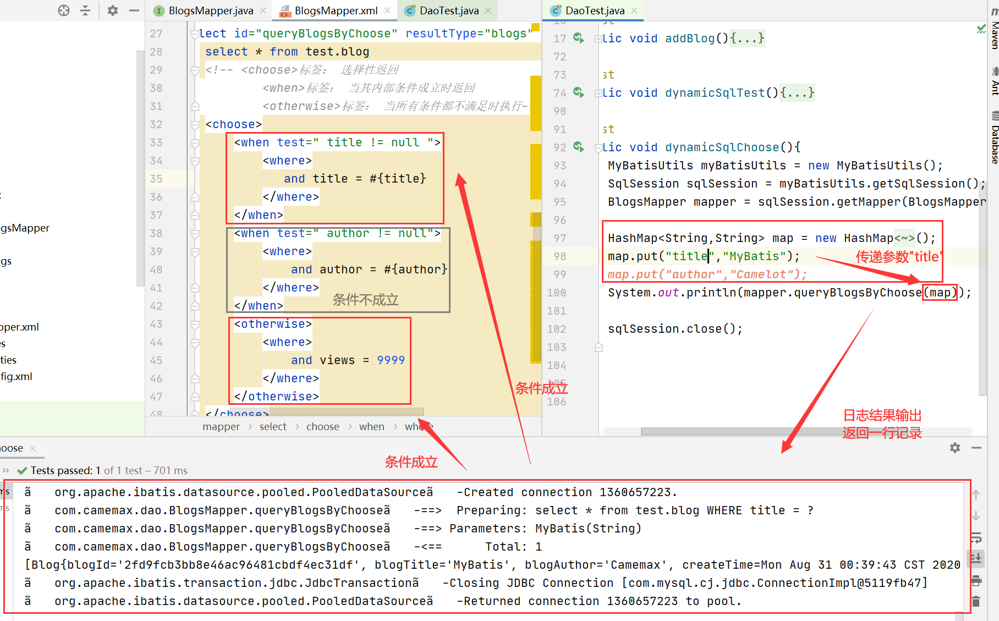

  

- 多个条件成立

  - 测试实现类 => 【DaoTest】

    ```java
    @Test
        public void dynamicSqlChoose(){
            MyBatisUtils myBatisUtils = new MyBatisUtils();
            SqlSession sqlSession = myBatisUtils.getSqlSession();
            BlogsMapper mapper = sqlSession.getMapper(BlogsMapper.class);
    
            HashMap<String,String> map = new HashMap<String, String>();
            //创建多个条件满足的集合
            map.put("title","MyBatis");
          	map.put("author","Camelot");
            System.out.println(mapper.queryBlogsByChoose(map));
    
            sqlSession.close();
        }
    ```

  - 输出结果 => 多个成立条件中的第一个（即：and title = #{title} ），返回其结果

    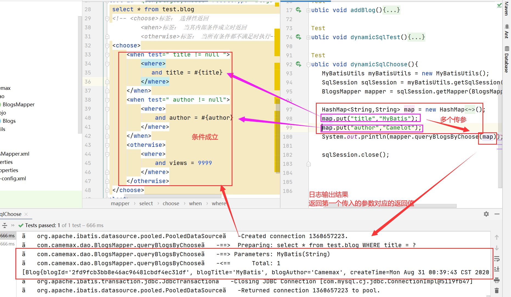

    

- \<when>都为false，\<otherwise>为true

  - 测试实现类 => 【DaoTest】

    ```java
    @Test
    public void dynamicSqlChoose(){
        MyBatisUtils myBatisUtils = new MyBatisUtils();
        SqlSession sqlSession = myBatisUtils.getSqlSession();
        BlogsMapper mapper = sqlSession.getMapper(BlogsMapper.class);
    
        //创建空集合传入
        HashMap<String,String> map = new HashMap<String, String>();
        System.out.println(mapper.queryBlogsByChoose(map));
    
        sqlSession.close();
    }
    ```

  - 输出结果： 4行记录 =>  跳过所有条件(false)，最后执行\<otherwise>标签

    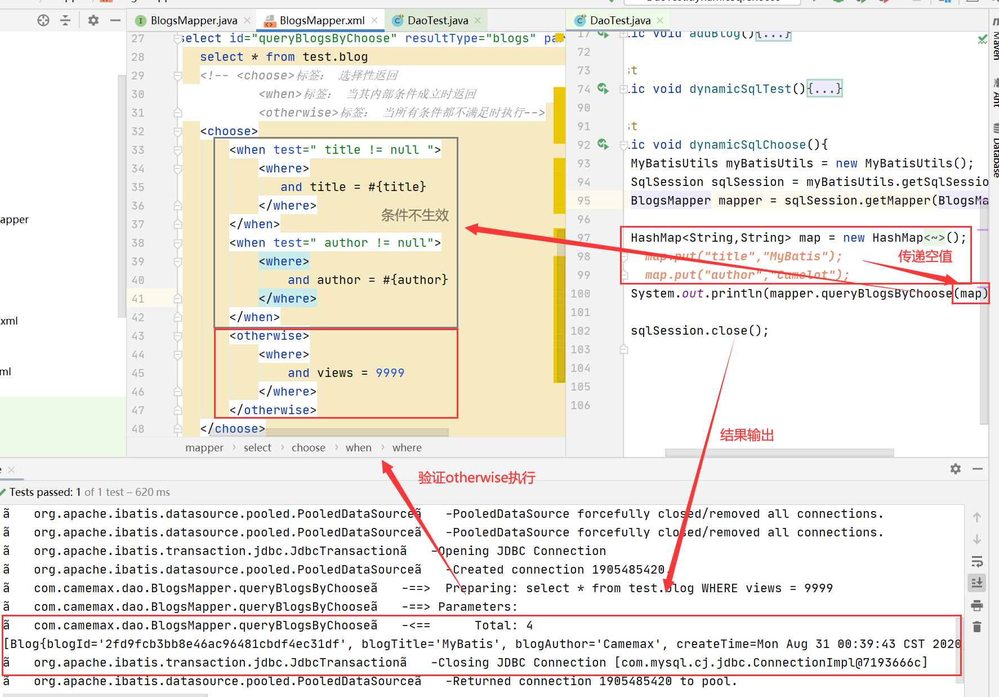


- 结论

  >\<choose>标签会在多个条件都满足的情况下，仅会返回第一个传参的返回值。
  >
  >但当其他条件都不满足时，可以添加\<otherwise>标签，用于返回一个固有值。


## 14.4 Trim

- Trim可以自定义SQL语句中的规范，当\<where>标签、\<set>标签不满足时，可以使用Trim自定义。


### 14.4.1 Trim自定义测试

- 使用Trim复写\<where>、\<set>规则

#### 14.4.1.1 \<trim>实现\<where>

1. Dao层接口 => 【BlogsMapper】

   ```java
   List<Blogs> queryBlogsByTrim(Map<String,String> map)
   ```

2. XML映射器 => 【BlogsMapper.xml】

   ```xml
   <select id="queryBlogsByTrim" parameterType="blogs">
   	select * from test.blog
       <trim prefix="WHERE" prefixOverride="AND |OR ">
           <if test="titleMap != null"> AND title = #{titleMap}</if>
           <if test="authorMap != null"> OR author = #{authorMap}</if>
       </trim>
   </select>
   ```

3. 测试实现类 => 【DaoTest】

   ```java
   @Test
   public void dynamicSqlSelectByTrim(){
       MyBatisUtils mybatis = new MyBatisUtils;
       SqlSession sqlSession = mybatis.getSqlSession();
       BlogsMapper mapper = sqlSession.getMapper(BlogsMapper.class);
   
       HashMap<String,String> map = new HashMap<String,String>();
       map.put("titleMap","MyBatis");
       map.put("authorMap","Altria");
   
       for (Blogs blog : mapper.queryBlogsByTrim(map)) {
           System.out.println(blog);
       }
   	
       sqlSession.close();
   }
   ```

4. 输出结果

   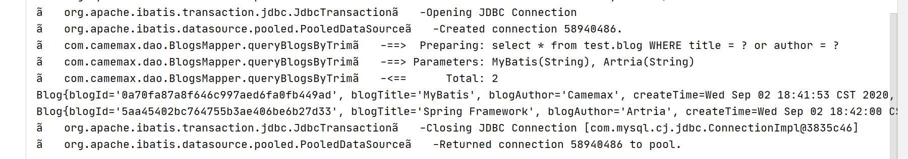

#### 14.4.1.2 \<trim>实现\<set>

1. Dao层接口 => 【BlogsMapper】

   ```java
   int updateBlogInfoByTrim(Map<String,String> map)
   ```

2. XML映射文件 => 【BlogsMapper.xml】

   ```xml
   <update id="updateBlogInfoByTrim" parameterType="map">
   	update test.blog
       <trim prefix="SET" suffixOverride=",">
           <if test="titleMap != null"> title = #{titleMap},</if>
           <if test="authorMap != null"> author = #{authorMap},</if>
       </trim>
       where id = #{idMap}
   </update>
   ```

3. 测试实现类 => 【DaoTest】

   ```java
   @Test
   public void dynamicSqlUpdateByTrim(){
       
       MyBatisUtils mybatis = new MyBatisUtils();
       SqlSession sqlSession = mybatis.getSqlSession();
       BlogsMapper mapper = mybatis.getMapper(BlogsMapper.class);
       
       Map<String,String> map = new HashMap<String,String>();
       map.put("authorMap","Altria");
       map.put("titleMap","Spring Framework Updated");
       map.put("idMap","5aa45402bc764755b3ae406be6b27d33");
       
       int i = mapper.updateBlogInfoByTrim(map);
       if( i > 0 ){
           System.out.println("Update Succeed!");
       }
   }
   ```

4. 测试结果

   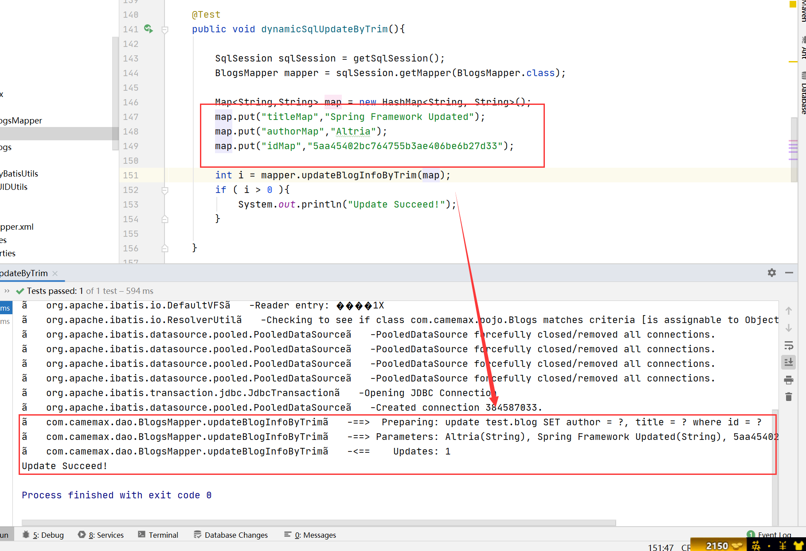

   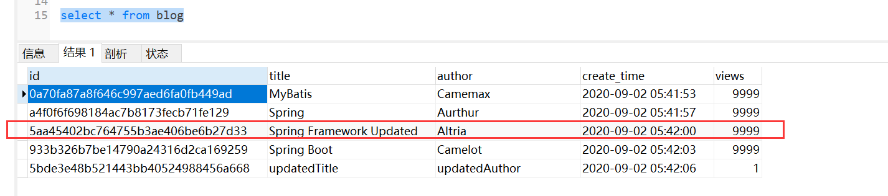


# 15.缓存

- 【官方声明】

  > MyBatis 内置了一个强大的事务性查询缓存机制，它可以非常方便地配置和定制。 为了使它更加强大而且易于配置，我们对 MyBatis 3 中的缓存实现进行了许多改进。

- 一级缓存（SqlSession级别）
- 二级缓存（mapper||namespace级别）


## 15.1 一级缓存

### 15.1.1 什么是一级缓存？

> Mybatis对缓存提供支持，但是在没有配置的默认情况下，它只开启一级缓存，一级缓存只是相对于同一个SqlSession而言。


### 15.1.2 一级缓存的作用

>在参数和SQL完全一样的情况下，我们使用同一个SqlSession对象调用一个Mapper方法，往往只执行一次SQL，因为使用SelSession第一次查询后，MyBatis会将其放在缓存中，以后再查询的时候，如果没有声明需要刷新，并且缓存没有超时的情况下，SqlSession都会取出当前缓存的数据，而不会再次发送SQL到数据库。


### 15.1.3 **一级缓存的生命周期有多长？**

1. MyBatis在开启一个数据库会话时，会 创建一个新的SqlSession对象，SqlSession对象中会有一个新的Executor对象。Executor对象中持有一个新的PerpetualCache对象；当会话结束时，SqlSession对象及其内部的Executor对象还有PerpetualCache对象也一并释放掉。
2. 如果SqlSession调用了close()方法，会释放掉一级缓存PerpetualCache对象，一级缓存将不可用。
3. 如果SqlSession调用了clearCache()，会清空PerpetualCache对象中的数据，但是该对象仍可使用。
4. SqlSession中执行了任何一个update操作(update()、delete()、insert()) ，都会清空PerpetualCache对象的数据，但是该对象可以继续使用


### 15.1.4 如何判断缓存目标？

1. 传入的statementId
2. 查询时要求的结果集中的结果范围
3. 这次查询所产生的最终要传递给JDBC java.sql.Preparedstatement的Sql语句字符串（boundSql.getSql() ）
4. 传递给java.sql.Statement要设置的参数值


### 15.1.5 测试

1. Dao层接口添加测试方法 => 【BlogsMapper】

   ```xml
   Blogs getBlogInfoByAuthor(String author);
   ```

2. 核心XML配置文件 => 【mybatis-config.xml】

   ````xml
   <settings>
       ...
       <!-- 	全局性地开启或关闭所有映射器配置文件中已配置的任何缓存。
                  默认状态： 开启 => value="true"  -->
       <!-- 显示开启一级缓存 -->
       <setting name="cacheEnabled" value="true"/>
   </settings>
   ````

3. XML映射文件 => 【BlogsMapper.xml】

   ```xml
   <select id="getBlogInfoByAuthor" resultType="blogs" parameterType="string">
   	select * from test.blog
       <where>
           <if test="post_author != null">
           	author = #{post_author}
           </if>
       </where>
   </select>
   ```

4. 测试实现类

   1. 正常操作

      ```java
      @Test
      public void firstLevelCacheTest(){
      
          SqlSession sqlSession = getSqlSession();
          BlogsMapper mapper = sqlSession.getMapper(BlogsMapper.class);
      
          // 第一次执行执行SqlSession
          Blogs artria1 = mapper.getBlogInfoByAuthor("Altria");
          System.out.println(artria1);
      
          // 第二次执行SqlSession
          Blogs artria2 = mapper.getBlogInfoByAuthor("Altria");
          System.out.println(artria2);
      
          // 对比两个对象是否相同
          System.out.println(artria1 == artria2);
          sqlSession.close();
      }
      ```

   2. 清空SqlSession

      ```java
      @Test
      public void firstLevelCacheTest(){
      
          SqlSession sqlSession = getSqlSession();
          BlogsMapper mapper = sqlSession.getMapper(BlogsMapper.class);
      
          // 第一次执行执行SqlSession
          Blogs artria1 = mapper.getBlogInfoByAuthor("Altria");
          System.out.println(artria1);
      
          // 将第一次结果提交
          sqlSession.commit();
          
          // 第二次执行SqlSession
          Blogs artria2 = mapper.getBlogInfoByAuthor("Altria");
          System.out.println(artria2);
      
          // 对比两个对象是否相同
          System.out.println(artria1 == artria2);
          sqlSession.close();
      }
      ```

      

5. 日志输出

   1. 正常输出

      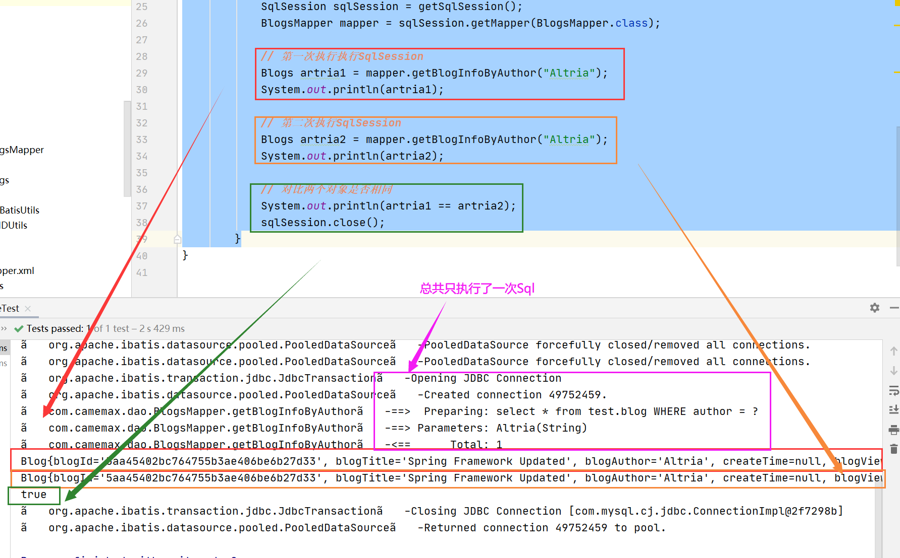

   2. 清空SqlSession

      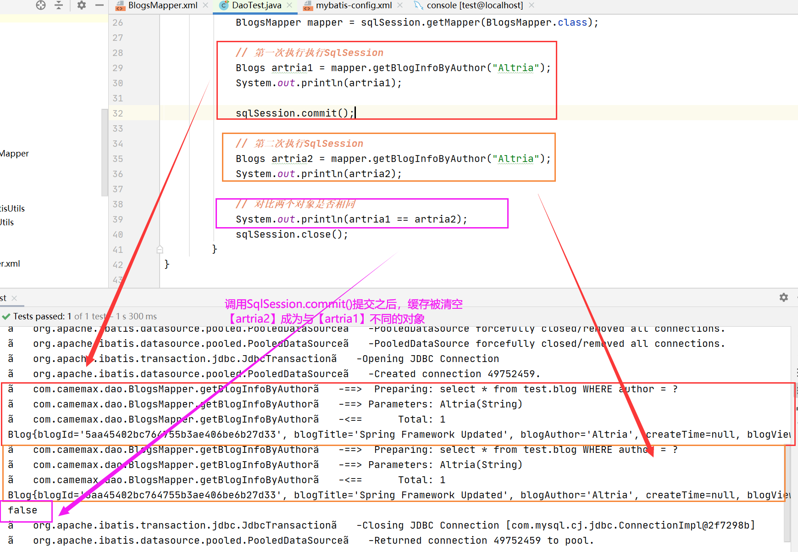


## 15.2 二级缓存

- 【官方声明】 => 如何开启【二级缓存】

  >默认情况下，只启用了本地的会话缓存，它仅仅对一个会话中的数据进行缓存。 要启用全局的二级缓存，只需要在你的 SQL 映射文件中添加一行：

  - 在XML映射文件中添加以下代码，以开启【二级缓存】

    ```xml
    <cache/>
    ```

- 【官方声明】 => 【二级缓存】的作用

  - 映射语句文件中的所有 select 语句的结果将会被缓存。
  - 映射语句文件中的所有 insert、update 和 delete 语句会刷新缓存。
  - 缓存会使用最近最少使用算法（LRU, Least Recently Used）算法来清除不需要的缓存。
  - 缓存不会定时进行刷新（也就是说，没有刷新间隔）。
  - 缓存会保存列表或对象（无论查询方法返回哪种）的 1024 个引用。
  - 缓存会被视为读/写缓存，这意味着获取到的对象并不是共享的，可以安全地被调用者修改，而不干扰其他调用者或线程所做的潜在修改。

- 【官方提示】 => 【二级缓存】的作用域

  - 缓存只作用于 cache 标签所在的映射文件中的语句。如果你混合使用 Java API 和 XML 映射文件，在共用接口中的语句将不会被默认缓存。你需要使用 @CacheNamespaceRef 注解指定缓存作用域。

- 【官方声明】 => \<cache>标签的属性修改

  ```xml
  <cache
    eviction="FIFO"
    flushInterval="60000"
    size="512"
    readOnly="true"/>
  ```

  >这个更高级的配置创建了一个 FIFO 缓存，每隔 60 秒刷新，最多可以存储结果对象或列表的 512 个引用，而且返回的对象被认为是只读的，因此对它们进行修改可能会在不同线程中的调用者产生冲突。
  >
  >可用的清除策略有：
  >
  >- `LRU` – 最近最少使用：移除最长时间不被使用的对象。
  >- `FIFO` – 先进先出：按对象进入缓存的顺序来移除它们。
  >- `SOFT` – 软引用：基于垃圾回收器状态和软引用规则移除对象。
  >- `WEAK` – 弱引用：更积极地基于垃圾收集器状态和弱引用规则移除对象。
  >
  >默认的清除策略是 LRU。
  >
  >flushInterval（刷新间隔）属性可以被设置为任意的正整数，设置的值应该是一个以毫秒为单位的合理时间量。 默认情况是不设置，也就是没有刷新间隔，缓存仅仅会在调用语句时刷新。
  >
  >size（引用数目）属性可以被设置为任意正整数，要注意欲缓存对象的大小和运行环境中可用的内存资源。默认值是 1024。
  >
  >readOnly（只读）属性可以被设置为 true 或 false。只读的缓存会给所有调用者返回缓存对象的相同实例。 因此这些对象不能被修改。这就提供了可观的性能提升。而可读写的缓存会（通过序列化）返回缓存对象的拷贝。 速度上会慢一些，但是更安全，因此默认值是 false。

- 总结

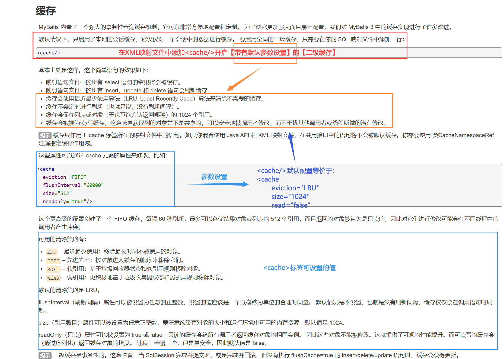


### 15.2.1 什么是二级缓存？

>MyBatis的二级缓存是Application级别的缓存，它可以提高对数据库查询的效率，以提高应用的性能。
>
>SqlSessionFactory层面上的二级缓存默认是不开启的，二级缓存的开席需要进行配置，实现二级缓存的时候，MyBatis要求==返回的POJO必须是可序列化==的（ 要求实现Serializable接口）


### 15.2.2 二级缓存的作用

>- 映射语句文件中的所有select语句将会被缓存。
>- 映射语句文件中的所有insert、update和delete语句会刷新缓存。
>- 缓存会使用默认的Least Recently Used（LRU，最近最少使用的）算法来收回。
>- 根据时间表，比如No Flush Interval,（CNFI没有刷新间隔），缓存不会以任何时间顺序来刷新。
>- 缓存会存储列表集合或对象(无论查询方法返回什么)的1024个引用
>- 缓存会被视为是read/write(可读/可写)的缓存，意味着对象检索不是共享的，而且可以安全的被调用者修改，不干扰其他调用者或线程所做的潜在修改。


### 15.2.3 测试

1. 实现类 => 【实现Serializable接口】

   ```java
   public class Blogs implements Serializable(){
       ...
   }
   ```

2. XML配置文件 => 【开启二级缓存】

   - 默认配置

     ```xml
     <cache/>
     ```

   - 自定义配置

     ```xml
     <cache
           eviction="FIFO" 
           flushInterval="3000"
           size="512"
           readOnly="true"/>
     ```

3. 测试commit操作

   ​	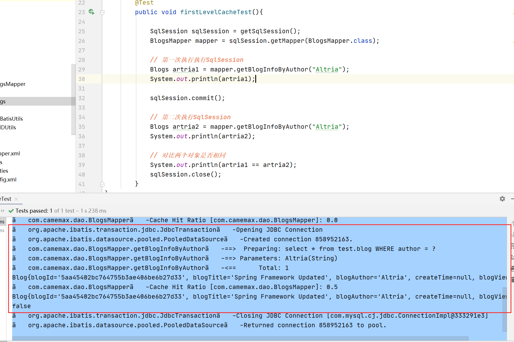