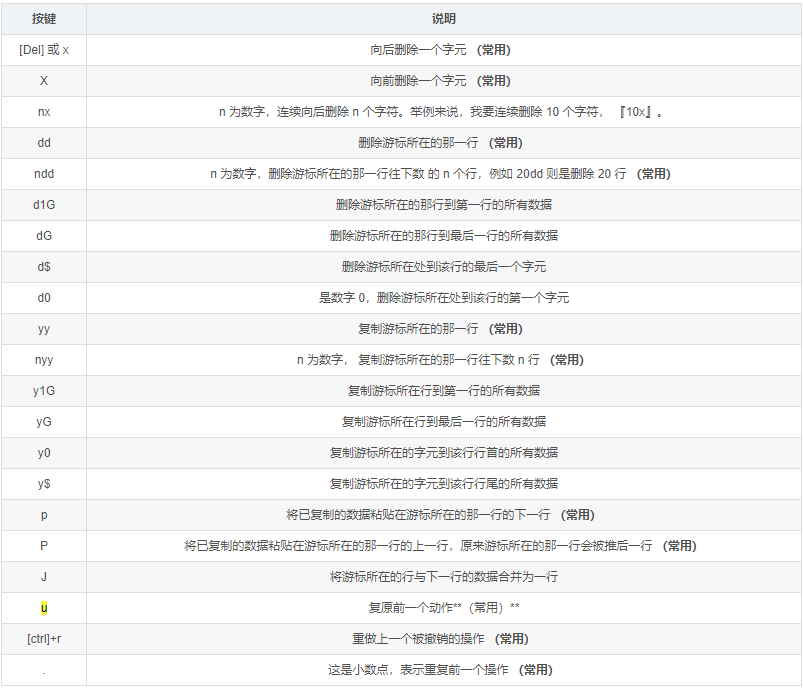

# Linux学习日志


## 学习相关资料和技术文档

csdn博主笔记：https://blog.csdn.net/su2231595742/article/list/1

linux狂神说学习笔记：https://blog.csdn.net/su2231595742/article/details/112472796

linux安装在VMwear教程：https://blog.csdn.net/babyxue/article/details/80970526


## 1.入门概述

### 1.1、我们为什么要学习Linux

linux诞生了这么多年，以前还喊着如何能取代windows系统，现在这个口号已经小多了，任何事物发展都有其局限性都有其天花板。就如同在国内再搞一个社交软件取代腾讯一样，想想而已基本不可能，因为用户已经习惯于使用微信交流，不是说技术上实现不了解而是老百姓已经习惯了，想让他们不用，即使他们自己不用亲戚朋友还是要用，没有办法的事情。

用习惯了windows操作系统，再让大家切换到别的操作系统基本上是不可能的事情，改变一个人已经养成的习惯太难。没有办法深入到普通老百姓的生活中，并不意味着linux就没有用武之地了。在服务器端，在开发领域linux倒是越来越受欢迎，很多程序员都觉得不懂点linux都觉得不好意思，linux在开源社区的地位依然岿然不动。

尤其是作为一个后端程序员，是必须要掌握Linux的，因为这都成为了你找工作的基础门槛了，所以不得不学习！

### 1.2、Linux 简介

Linux 内核最初只是由芬兰人林纳斯·托瓦兹（Linus Torvalds）在赫尔辛基大学上学时出于个人爱好而编写的。

Linux 是一套免费使用和自由传播的类 Unix 操作系统，是一个基于 POSIX（可移植操作系统接口） 和UNIX 的多用户、多任务、支持多线程和多 CPU 的操作系统。

Linux 能运行主要的 UNIX 工具软件、应用程序和网络协议。它支持 32 位和 64 位硬件。Linux 继承了Unix 以网络为核心的设计思想，是一个性能稳定的多用户网络操作系统。

### 1.3、Linux 发行版

Linux 的发行版说简单点就是将 Linux 内核与应用软件做一个打包。

Kali linux：安全渗透测试使用！（有兴趣做安全的同学可以了解一下！）


目前市面上较知名的发行版有：Ubuntu、RedHat、CentOS、Debian、Fedora、SuSE、OpenSUSE、Arch Linux、SolusOS 等。


### 1.4、Linux 应用领域

今天各种场合都有使用各种 Linux 发行版，从嵌入式设备到超级计算机，并且在服务器领域确定了地位，通常服务器使用 LAMP（Linux + Apache + MySQL + PHP）或 LNMP（Linux + Nginx+ MySQL +PHP）组合。

目前 Linux 不仅在家庭与企业中使用，并且在政府中也很受欢迎。

巴西联邦政府由于支持 Linux 而世界闻名。
有新闻报道俄罗斯军队自己制造的 Linux 发布版的，做为 G.H.ost 项目已经取得成果。
印度的 Kerala 联邦计划在向全联邦的高中推广使用 Linux。
中华人民共和国为取得技术独立，在龙芯处理器中排他性地使用 Linux。
在西班牙的一些地区开发了自己的 Linux 发布版，并且在政府与教育领域广泛使用，如Extremadura 地区的 gnuLinEx 和 Andalusia 地区的 Guadalinex。
葡萄牙同样使用自己的 Linux 发布版 Caixa Mágica，用于 Magalh?es 笔记本电脑和 e-escola 政府软件。
法国和德国同样开始逐步采用 Linux。


### 1.5、Linux vs Windows


## 2、环境搭建

Linux 的安装，安装步骤比较繁琐（操作系统本身也是一个软件），现在其实云服务器挺普遍的，价格也便宜，如果直接不想搭建，也可以直接买一台学习用用！

安装CentOS （在本地安装，这个不太建议，如果没有经济来源的话，可以考虑在本地搭建）

Linux是一个操作系统，你也可以把自己电脑安装成双系统！

虚拟机（VMware下载（收费的，注册码！）

官网下载：


安装完成后打开软件有如下界面：


在虚拟机上安装CentOS7

1、可以通过镜像进行安装！ 下载地址：http://mirrors.aliyun.com/centos/7/isos/x86_64/，下载完成后安装即可！安装操作系统和安装软件是一样的，注意：Linux磁盘分区的时候需要注意分区名即可！/boot /home!

2、可以使用我已经制作好的镜像！（狂神制作好的一个自己的镜像！）使用百度云链接下载即可！

链接：https://pan.baidu.com/s/1e0YEzN3BW0DDXFtMscvvVA
提取码：716m
复制这段内容后打开百度网盘手机App，操作更方便哦

3、安装 VMware 虚拟机软件，然后打开我们的镜像即可使用！

打开后的样子：


VMware的使用方式：

点击屏幕进入虚拟机、Ctrl + Alt 将聚焦退出虚拟机！

开机后的页面：


默认的用户是：kuangshen 密码是 123456

root用户：root-123456

大家下载完毕后，可以安装系统，然后根据我们的账号密码，来自己测试登录！

那我们的本地Linux环境就准备好了！

购买云服务器（有经济来源的话，可以购买阿里云服务器，因为这才是最近接公司中原生环境的！）

云服务器就是一个远程电脑，服务器一般不会关机！

虚拟机安装后占用空间，也会有些卡顿，我们作为程序员其实可以选择购买一台自己的服务器，这样的话更加接近真实线上工作；

1、阿里云购买服务器：https://www.aliyun.com/minisite/goods?userCode=0phtycgr
2、购买完毕后，获取服务器的ip地址，重置服务器密码，就可以远程登录了

获取公网IP地址！
修改自己的登录密码


关于安全组的说明： （在阿里云这个很重要，自己需要开放什么端口来这里配置就好啦，我们在后面安装环境的时候会再次说明）


3、下载 xShell 远程连接工具22，进行远程连接使用！建议使用360一键下载！还需要下载一个 xFtp 文件上传21！

下载完毕后，直接打开即可！
4、使用Xshell连接远程服务器！~


登录用户名和密码之后，登录成功就是如下界面：


这里就是我们的Linux操作系统了！以后的操作都在这里操作，项目也在这里进行发布！

Ctrl + 鼠标滚轮，放大和缩小字体！
上传文件使用xftp即可！

![[外链图片转存失败,源站可能有防盗链机制,å»ºè®®å°†å›¾ç‰‡ä¿å­˜ä¸‹æ¥ç›´æŽ¥ä¸Šä¼ (img-koZOdxTP-1608902092584)(C:\Users\22315\AppData\Roaming\Typora\typora-user-images\image-20201225210630901.png)]](https://img-blog.csdnimg.cn/2020122521160917.png)


Tomcat 需要 Java环境！我们后会按照JDK，到时候再测试吧，先学基本的Linux命令为主！
远程环境安装！

注意事项：

如果要打开端口，需要在阿里云的安全组面板中开启对应的出入规则，不然的话会被阿里拦截！

如果前期不好操作，可以推荐安装宝塔面板，傻瓜式管理服务器

安装教程：https://www.bt.cn/bbs/thread-19376-1-1.html

1、开启对应的端口
2、一键安装
3、安装完毕后会得到远程面板的地址，账号，密码，就可以登录了
4、登录之后就可以可视化的安装环境和部署网站！

**关于域名**

如果自己的网站想要上线，就一定要购买一个域名然后进行备案；

备案的话需要一些认证和时间，备完完毕后，就可以解析到自己的网站了，这个时候就可以使用域名来进行服务器的访问


## 3、走近Linux系统

### 3.1、开机登录

开机会启动许多程序。它们在Windows叫做"服务"（service），在Linux就叫做"守护进程"（daemon）。

开机成功后，它会显示一个文本登录界面，这个界面就是我们经常看到的登录界面，在这个登录界面中会提示用户输入用户名，而用户输入的用户将作为参数传给login程序来验证用户的身份，密码是不显示的，输完回车即可！

一般来说，用户的登录方式有三种：

命令行登录
ssh登录
图形界面登录
最高权限账户为 root，可以操作一切！

### 3.2、关机

在linux领域内大多用在服务器上，很少遇到关机的操作。毕竟服务器上跑一个服务是永无止境的，除非特殊情况下，不得已才会关机。

关机指令为：shutdown ；


```
sync # 将数据由内存同步到硬盘中。
shutdown # 关机指令，你可以man shutdown 来看一下帮助文档。例如你可以运行如下命令关机：
shutdown –h 10 # 这个命令告诉大家，计算机将在10分钟后关机
shutdown –h now # 立马关机
shutdown –h 20:25 # 系统会在今天20:25关机
shutdown –h +10 # 十分钟后关机
shutdown –r now # 系统立马重启
shutdown –r +10 # 系统十分钟后重启
reboot # 就是重启，等同于 shutdown –r now
halt # 关闭系统，等同于shutdown –h now 和 poweroff
```

最后总结一下，不管是重启系统还是关闭系统，首先要运行 sync 命令，把内存中的数据写到磁盘中。


### 3.3、系统目录结构

1、一切皆文件
2、根目录 / ，所有的文件都挂载在这个节点下

登录系统后，在当前命令窗口下输入命令：

```
ls /
```


你会看到如下图所示：


树状目录结构：


以下是对这些目录的解释：

/bin： bin是Binary的缩写, 这个目录存 放着最经常使用的命令。
/boot： 这里存放的是启动Linux时使用的一些核心文件，包括一些连接文件以及镜像文件。（不要动）
/dev ： dev是Device(设备)的缩写, 存放的是Linux的外部设备，在Linux中访问设备的方式和访问文件的方式是相同的。
**/etc： 这个目录用来存放所有的系统管理所需要的配置文件和子目录。**
**/home：用户的主目录，在Linux中，每个用户都有一个自己的目录，一般该目录名是以用户的账号命名的。**
/lib： 这个目录里存放着系统最基本的动态连接共享库，其作用类似于Windows里的DLL文件。（不要动）
/lost+found： 这个目录一般情况下是空的，当系统非法关机后，这里就存放了一些文件。（存放突然关机的一些文件）
/media：linux系统会自动识别一些设备，例如U盘、光驱等等，当识别后，linux会把识别的设备挂载到这个目录下。
/mnt：系统提供该目录是为了让用户临时挂载别的文件系统的，我们可以将光驱挂载在/mnt/上，然后进入该目录就可以查看光驱里的内容了。（我们后面会把一些本地文件挂载在这个目录下）
**/opt：这是给主机额外安装软件所摆放的目录。比如你安装一个ORACLE数据库则就可以放到这个目录下。默认是空的。**
/proc： 这个目录是一个虚拟的目录，它是系统内存的映射，我们可以通过直接访问这个目录来获取系统信息。（不用管）
**/root：该目录为系统管理员，也称作超级权限者的用户主目录。**
/sbin：s就是Super User的意思，这里存放的是系统管理员使用的系统管理程序。
/srv：该目录存放一些服务启动之后需要提取的数据。
/sys：这是linux2.6内核的一个很大的变化。该目录下安装了2.6内核中新出现的一个文件系统sysfs 。
**/tmp：这个目录是用来存放一些临时文件的。用完即丢的文件，可以放在这个目录下，安装包！**
**/usr：这是一个非常重要的目录，用户的很多应用程序和文件都放在这个目录下，类似于windows下的program files目录。**
/usr/bin： 系统用户使用的应用程序。
/usr/sbin： 超级用户使用的比较高级的管理程序和系统守护程序。Super
/usr/src： 内核源代码默认的放置目录。
/var：这个目录中存放着在不断扩充着的东西，我们习惯将那些经常被修改的目录放在这个目录下。包括各种日志文件。
/run：是一个临时文件系统，存储系统启动以来的信息。当系统重启时，这个目录下的文件应该被删掉或清除。
/www：存放服务器网站相关的资源，环境，网站的项目


## 4、常用基本命令

### 4.1、目录管理

#### 4.1.1、绝对路径、相对路径

绝对路径路径的全称：C:\ProgramData\360safe\xxx.xx

比如说 360safe 目录下，那这个 xxx.xx 文件，对应我们的相对配置就 /xxx.xx

cd ： 切换目录命令！
./ ： 当前目录
cd .. ： 返回上一级目录（cd 英文句号打两个）


#### 4.1.2、ls （列出目录！）

在Linux中 ls 可能是最常常被使用的 !

-a参数：all ，查看全部的文件，包括隐藏文件
-l 参数 列出所有的文件，包含文件的属性和权限，没有隐藏文件
所有Linux可以组合使用！


#### 4.1.3、cd 命令 切换目录

cd 目录名（绝对路径都是以 / 开头，相对路径，对于当前目录该如何寻找 …/…/）


#### 4.1.4、mkdir 创建目录

mkdir xxx ： 创建目录
mkdir -p test2/test3/test4： 创建多级目录

```
[root@kuangshen home]# mkdir test1 # 创建目录
[root@kuangshen home]# ls
install.sh kuangshen kuangstudy test1 www
[root@kuangshen home]# cd test1
[root@kuangshen test1]# cd ..
[root@kuangshen home]# mkdir test2/test3/test4 # 创建多级目录
mkdir: cannot create directory ‘test2/test3/test4’: No such file or directory
[root@kuangshen home]# mkdir -p test2/test3/test4
[root@kuangshen home]# ls
install.sh kuangshen kuangstudy test1 test2 www
[root@kuangshen home]# cd test2
[root@kuangshen test2]# ls
test3
[root@kuangshen test2]# cd test3
[root@kuangshen test3]# ls
test4
```

#### 4.1.5、rmdir 删除目录

rmdir xxx ： 删除不为空的目录
rmdir -p test2/test3/test4 ：强制删除目录

```
[root@kuangshen test3]# cd /home
[root@kuangshen home]# ls
install.sh kuangshen kuangstudy test1 test2 www
[root@kuangshen home]# rmdir test1
[root@kuangshen home]# ls
install.sh kuangshen kuangstudy test2 www
[root@kuangshen home]# rmdir test2
rmdir: failed to remove ‘test2’: Directory not empty
[root@kuangshen home]# rmdir -p test2
rmdir: failed to remove ‘test2’: Directory not empty
[root@kuangshen home]# rmdir -p test2/test3/test4
[root@kuangshen home]# mkdir -p test2/test3/test4
[root@kuangshen home]# rmdir test2/test3/test4
[root@kuangshen home]# ls
install.sh kuangshen kuangstudy test2 www
[root@kuangshen home]# mkdir -p test2/test3/test4
[root@kuangshen home]# ls
install.sh kuangshen kuangstudy test2 www
[root@kuangshen home]# rmdir -p test2/test3/test4
[root@kuangshen home]# ls
install.sh kuangshen kuangstudy www
```


rmdir 仅能删除空的目录，如果下面存在文件，需要先删除文件，递归删除多个目录 -p 参数即可

#### 4.1.6、cp 复制文件目录

cp 原来的地方 新的地方
如果文件重复，就选则覆盖（y）或者 放弃（n）

```
[root@kuangshen home]# cp install.sh kuangstudy # 拷贝文件至目录
[root@kuangshen home]# ls
install.sh kuangshen kuangstudy www
[root@kuangshen home]# cd kuangstudy/
[root@kuangshen kuangstudy]# ls
install.sh
[root@kuangshen kuangstudy]# cd ..
[root@kuangshen home]# cp install.sh kuangstudy # 如果文件重复，就选则覆盖（y）或者 放弃（n）
cp: overwrite ‘kuangstudy/install.sh’? y
```


```
[root@aubin aubin]# cd /
[root@aubin /]# cd home 
[root@aubin home]# ls
aubin  test  test2
[root@aubin home]# cd test 
[root@aubin test]# touch test.txt
[root@aubin test]# ls
test.txt
[root@aubin home]# cp test/test.txt test2 
[root@aubin home]# cd test2
[root@aubin test2]# ls
test.txt
```


#### 4.1.7、rm 移除文件目录

-f 忽略不存在的文件，不会出现警告，强制删除！
-r 递归删除目录！
-i 互动，删除询问是否删除
rm -rf / 删库跑路
rm -rf / # 系统中所有的文件就被删除了，删库跑路就是这么操作的！

```
[aubin@aubin /]$ su
密码：
[root@aubin /]# cd /
[root@aubin /]# cd  home
[root@aubin home]# ls
aubin  test  test2
[root@aubin home]# cd test
[root@aubin test]# ls
test2  test.txt
[root@aubin test]# rm -rf test.txt
[root@aubin test]# ls
test2
[root@aubin test]# 
```


#### 4.1.8、mv 移动文件目录

还可以重命名文件夹

-f 强制
-u 只替换已经更新过的文件
mv install.sh kuangstudy    移动文件
mv kuangstudy kuangstudy2   重命名文件夹

```
[root@aubin test]# cd ..
[root@aubin home]# ls
aubin  test  test2
[root@aubin home]# cd test2
[root@aubin test2]# ls
test.txt
[root@aubin test2]# cd ..
[root@aubin home]# mkdir test3
[root@aubin home]# ls
aubin  test  test2  test3
[root@aubin home]# mv test2/test.txt test3
[root@aubin home]# cd test3
[root@aubin test3]# ls
test.txt
[root@aubin test3]# cd ..
[root@aubin home]# mv test3 test4
[root@aubin home]# ls
aubin  test  test2  test4
[root@aubin home]# 
```


### 4.2、基本属性

十个字母 ；1 类型

#### 4.2.1、看懂文件属性

Linux系统是一种典型的多用户系统，不同的用户处于不同的地位，拥有不同的权限。为了保护系统的安全性，Linux系统对不同的用户访问同一文件（包括目录文件）的权限做了不同的规定。

在Linux中我们可以使用 ll 或者 ls –l 命令来显示一个文件的属性以及文件所属的用户和组，如：

```
[root@aubin home]# ls -ll
总用量 4
drwx------. 16 aubin aubin 4096 3月  22 18:20 aubin
drwxr-xr-x.  2 root  root    35 3月  22 18:31 test
drwxr-xr-x.  2 root  root     6 3月  22 18:33 test2
drwxr-xr-x.  2 root  root    22 3月  22 18:33 test4
```

实例中，root文件的第一个属性用"d"表示。"d"在Linux中代表该文件是一个目录文件。

在Linux中第一个字符代表这个文件是目录、文件或链接文件等等：

当为[ d ]则是目录
当为[ - ]则是文件；
若是[ l ]则表示为链接文档 ( link file )；
若是[ b ]则表示为装置文件里面的可供储存的接口设备 ( 可随机存取装置 )；
若是[ c ]则表示为装置文件里面的串行端口设备，例如键盘、鼠标 ( 一次性读取装置 )。
接下来的字符中，以三个为一组，且均为『rwx』 的三个参数的组合。

其中，[ r ]代表可读(read)、[ w ]代表可写(write)、[ x ]代表可执行(execute)。

要注意的是，这三个权限的位置不会改变，如果没有权限，就会出现减号[ - ]而已。

每个文件的属性由左边第一部分的10个字符来确定（如下图）：


从左至右用0-9这些数字来表示。

第0位确定文件类型，第1-3位确定属主（该文件的所有者）拥有该文件的权限。第4-6位确定属组（所有者的同组用户）拥有该文件的权限，第7-9位确定其他用户拥有该文件的权限。

其中：

第1、4、7位表示读权限，如果用"r"字符表示，则有读权限，如果用"-"字符表示，则没有读权限；
第2、5、8位表示写权限，如果用"w"字符表示，则有写权限，如果用"-"字符表示没有写权限；
第3、6、9位表示可执行权限，如果用"x"字符表示，则有执行权限，如果用"-"字符表示，则没有执行权
限。
对于文件来说，它都有一个特定的所有者，也就是对该文件具有所有权的用户。

同时，在Linux系统中，用户是按组分类的，一个用户属于一个或多个组。

文件所有者以外的用户又可以分为文件所有者的同组用户和其他用户。

因此，Linux系统按文件所有者、文件所有者同组用户和其他用户来规定了不同的文件访问权限。

在以上实例中，test 文件是一个目录文件，属主和属组都为 root。


#### 4.2.2、修改文件属性

1、chgrp：更改文件属组

```
chgrp [-R] 属组名 文件名
```


-R：递归更改文件属组，就是在更改某个目录文件的属组时，如果加上-R的参数，那么该目录下的所有文件的属组都会更改。

2、chown：更改文件属主，也可以同时更改文件属组

```
chown [–R] 属主名 文件名
chown [-R] 属主名：属组名 文件名
```


3、chmod：更改文件9个属性（必须要掌握）

3、chmod：更改文件9个属性（必须要掌握）

你没有权限操作此文件！

```
chmod [-R] xyz 文件或目录
```


Linux文件属性有两种设置方法，一种是数字（常用的是数字），一种是符号。

Linux文件属性有两种设置方法，一种是数字（常用的是数字），一种是符号。

Linux文件的基本权限就有九个，分别是owner/group/others三种身份各有自己的read/write/execute权限。

先复习一下刚刚上面提到的数据：文件的权限字符为：『-rwxrwxrwx』， 这九个权限是三个三个一组的！其中，我们可以使用数字来代表各个权限，各权限的分数对照表如下：

```
r:4    w:2    x:1

可读可写不可执行 rw- 6
可读可写不课执行 rwx 7

chomd  777  文件赋予所有用户可读可执行！
```


每种身份(owner/group/others)各自的三个权限(r/w/x)分数是需要累加的，例如当权限为：[-rwxrwx—]分数则是：

owner = rwx = 4+2+1 = 7
group = rwx = 4+2+1 = 7
others= — = 0+0+0 = 0

```
chmod 770 filename
```


#### 4.2.3、文件内容查看

我们会经常使用到文件查看！

Linux系统中使用以下命令来查看文件的内容：

cat 由第一行开始显示文件内容，用来读文章，或者读取配置文件啊，都使用cat名

tac 从最后一行开始显示，可以看出 tac 是 cat 的倒着写！

```
[root@aubin test]# echo 'chen' >> test.txt
[root@aubin test]# cat test.txt
chen
[root@aubin test]# echo 'JM' >> test.txt
[root@aubin test]# cat test.txt
chen
JM
[root@aubin test]# tac test.txt
JM
chen
```

nl 显示的时候，顺道输出行号！ 看代码的时候，希望显示行号！ 常用

```
[root@aubin test]# nl test.txt
     1	chen
     2	JM
```

more 一页一页的显示文件内容，带余下内容的（空格代表翻页，enter 代表向下看一行， :f 行号）


less 与 more 类似，但是比 more 更好的是，他可以往前翻页！ （空格下翻页，pageDown，pageUp键代表翻动页面！退出 q 命令，查找字符串 /要查询的字符向下查询，向上查询使用？要查询的字符串，n 继续搜寻下一个，N 上寻找！）


head 只看头几行 通过 -n 参数来控制显示几行！

```
[root@aubin test]# head -n 1 test.txt
chen
```

tail 只看尾巴几行 -n 参数 要查看几行！

```
[root@aubin test]# tail -n 1 test.txt
JM
```

你可以使用 man [命令]来查看各个命令的使用文档，如 ：man cp。

网络配置目录：cd /etc/sysconfig/network-scripts


ifconfig 命令查看网络配置！


#### 4.2.4、Linux 链接

**拓展：Linux 链接的概念（了解即可！）**

Linux的链接分为两种：硬链接、软链接！

**硬链接：**A—B，假设B是A的硬链接，那么他们两个指向了同一个文件！允许一个文件拥有多个路径，用户可以通过这种机制建立硬链接到一些重要文件上，防止误删！

**软链接**： 类似Window下的快捷方式，删除的源文件，快捷方式也访问不了！

创建连接 ln 命令！

touch 命令创建文件！

echo 输入字符串,也可以输入到文件中！

```
[root@kuangshen home]# touch f1 # 创建一个f1文件
[root@kuangshen home]# ls
f1 install.sh kuangshen www
[root@kuangshen home]# ln f1 f2 # 创建一个硬链接 f2
[root@kuangshen home]# ls
f1 f2 install.sh kuangshen www
[root@kuangshen home]# ln -s f1 f3 # 创建一个软链接（符号连接） f3
[root@kuangshen home]# ls
f1 f2 f3 install.sh kuangshen www
[root@kuangshen home]# ll
total 28
-rw-r--r-- 2 root root 0 Mar 24 20:17 f1
-rw-r--r-- 2 root root 0 Mar 24 20:17 f2
lrwxrwxrwx 1 root root 2 Mar 24 20:18 f3 -> f1
-rw-r--r-- 1 root root 20078 Mar 4 16:48 install.sh
drwxr-xr-x 2 root root 4096 Mar 23 21:25 kuangshen
drwxrw---x 2 www www 4096 Mar 23 12:46 www
[root@kuangshen home]# echo "i love kuangshen" >>f1 # 给f1文件中写入一些字符串！
[root@kuangshen home]# ls
f1 f2 f3 install.sh kuangshen www
[root@kuangshen home]# clear
[root@kuangshen home]# ll
total 36
-rw-r--r-- 2 root root 17 Mar 24 20:19 f1
-rw-r--r-- 2 root root 17 Mar 24 20:19 f2
lrwxrwxrwx 1 root root 2 Mar 24 20:18 f3 -> f1
-rw-r--r-- 1 root root 20078 Mar 4 16:48 install.sh
drwxr-xr-x 2 root root 4096 Mar 23 21:25 kuangshen
drwxrw---x 2 www www 4096 Mar 23 12:46 www
[root@kuangshen home]# cat f1 # 查看f1
i love kuangshen
[root@kuangshen home]# cat f2 # 查看f2
i love kuangshen
[root@kuangshen home]# cat f3 # 查看f3
i love kuangshen
```


删除f1之后，查看f2 和 f3 的区别

删除f1之后，查看f2 和 f3 的区别

```
[root@kuangshen home]# rm -rf f1
[root@kuangshen home]# ls
f2 f3 install.sh kuangshen www
[root@kuangshen home]# cat f2 # f2 硬链接还在
i love kuangshen
[root@kuangshen home]# cat f3 # f3（软连接、符号连接）快捷方式失效！
cat: f3: No such file or directory
```


### 4.3、Vim 编辑器

#### 4.3.1、什么是Vim编辑器

im 通过一些插件可以实现和IDE一样的功能！

Vim是从 vi 发展出来的一个文本编辑器。代码补完、编译及错误跳转等方便编程的功能特别丰富，在程序员中被广泛使用。尤其是Linux中，必须要会使用Vim（查看内容，编辑内容，保存内容！）

简单的来说， vi 是老式的字处理器，不过功能已经很齐全了，但是还是有可以进步的地方。

vim 则可以说是程序开发者的一项很好用的工具。

所有的 Unix Like 系统都会内建 vi 文书编辑器，其他的文书编辑器则不一定会存在。

连 vim 的官方网站 (http://www.vim.org) 自己也说 vim 是一个程序开发工具而不是文字处理软件。

vim 键盘图：


#### 4.3.2、三种使用模式

基本上 vi/vim 共分为三种模式，分别是命令模式（Command mode），输入模式（Insert mode）和底线命令模式（Last line mode）。这三种模式的作用分别是：

**命令模式：**用户刚刚启动 vi/vim，便进入了命令模式。


此状态下敲击键盘动作会被Vim识别为命令，而非输入字符。比如我们此时按下i，并不会输入一个字符，i被当作了一个命令。

以下是常用的几个命令：

i 切换到输入模式，以输入字符。
x 删除当前光标所在处的字符。
: 切换到底线命令模式，以在最底一行输入命令。 如果是编辑模式，需要先退出编辑模式！ESC
若想要编辑文本：启动Vim，进入了命令模式，按下i，切换到输入模式。

命令模式只有一些最基本的命令，因此仍要依靠底线命令模式输入更多命令。

**输入模式：**在命令模式下按下 i 就进入了输入模式。


在输入模式中，可以使用以下按键：

字符按键以及Shift组合，输入字符
ENTER，回车键，换行
BACK SPACE，退格键，删除光标前一个字符
DEL，删除键，删除光标后一个字符
方向键，在文本中移动光标
HOME/END，移动光标到行首/行尾
Page Up/Page Down，上/下翻页
Insert，切换光标为输入/替换模式，光标将变成竖线/下划线
ESC，退出输入模式，切换到命令模式
底线命令模式：在命令模式下按下:（英文冒号）就进入了底线命令模式。光标就移动到了最底下，就可以在这里输入一
些底线命令了！


底线命令模式可以输入单个或多个字符的命令，可用的命令非常多。

在底线命令模式中，基本的命令有（已经省略了冒号）：wq

q 退出程序
w 保存文件


按ESC键可随时退出底线命令模式。


简单的说，我们可以将这三个模式想成底下的图标来表示：


#### 4.3.3、完整的演示说明

新建或者编辑文件，按 i 进入编辑模式，编写内容，编写完成后退出编辑模式，esc，退出之后进入底线命令模式 ： wq 保存退出！

#### 4.3.4、Vim 按键说明

除了上面简易范例的 i, Esc, :wq 之外，其实 vim 还有非常多的按键可以使用。

**第一部分：一般模式可用的光标移动、复制粘贴、搜索替换等**


按键	说明
h 或向左方向键(←)	游标向左移动一个字元
j 或向下方向键 (↓)	游标向下移动一个字元
k 或向上方向键 (↑)	游标向上移动一个字元
l 或向右方向键 (→)	游标向右移动一个字元
[ctrl]+[f]	屏幕向下移动一页，相当于[Page Down]（常用）
[ctrl]+[b]	屏幕向上移动一页，相当于[Page Up]（常用）
[ctrl]+[d]	屏幕向下移动半页
[ctrl]+[u]	屏幕向上移动半页
数字+[Space]	n 表示数字，按下数字后再按空格键，游标会向右移动到这一行的第 n 个字元。
功能键[Home]或 0	游标移动到这一行的第一个字元处
功能键[End]或 $	游标移动到这一行的最后一个字元处 （常用）
H	游标移动到这个屏幕最上方那一行的第一个字元
M	游标移动到这个屏幕中央那一行的第一个字元
L	游标移动到这个屏幕最下方那一行的第一个字元
G	游标移动到这个档案的最后一行 （常用）
nG	n 为数字。游标移动到这个档案的第 n 行
gg	游标移动到这个档案的第一行 （常用）
数字+[Enter]	n 为数字。游标向下移动 n 行 （常用）


替换搜索	
/word	向光标之下寻找一个名称为 word 的字符串。例如要在档案内搜寻 vbird 这个字符串，就输入 /vbird 即可！(常用)
?word	向光标之上寻找一个字符串名称为 word 的字符串。
n	这个 n 是英文按键。代表重复前一个搜寻的动作。举例来说， 如果刚刚我们执行 /vbird去向下搜寻 vbird 这个字符串，则按下 n 后，会向下继续搜寻下一个名称为 vbird 的字符串。如果是执行 ?vbird 的话，那么按下 n 则会向上继续搜寻名称为 vbird 的字符串！
N	这个 N 是英文按键。与 n 刚好相反，为『反向』进行前一个搜寻动作。例如 /vbird后，按下 N 则表示『向上』搜寻 vbird 。




按键	说明
[Del] 或 x	向后删除一个字元 （常用）
X	向前删除一个字元 （常用）
nx	n 为数字，连续向后删除 n 个字符。举例来说，我要连续删除 10 个字符， 『10x』。
dd	删除游标所在的那一行 （常用）
ndd	n 为数字，删除游标所在的那一行往下数 的 n 个行，例如 20dd 则是删除 20 行 （常用）
d1G	删除游标所在的那行到第一行的所有数据
dG	删除游标所在的那行到最后一行的所有数据
d$	删除游标所在处到该行的最后一个字元
d0	是数字 0，删除游标所在处到该行的第一个字元
yy	复制游标所在的那一行 （常用）
nyy	n 为数字， 复制游标所在的那一行往下数 n 行 （常用）
y1G	复制游标所在行到第一行的所有数据
yG	复制游标所在行到最后一行的所有数据
y0	复制游标所在的字元到该行行首的所有数据
y$	复制游标所在的字元到该行行尾的所有数据
p	将已复制的数据粘贴在游标所在的那一行的下一行 （常用）
P	将已复制的数据粘贴在游标所在的那一行的上一行，原来游标所在的那一行会被推后一行 （常用）
J	将游标所在的行与下一行的数据合并为一行
u	复原前一个动作**（常用）**
[ctrl]+r	重做上一个被撤销的操作 （常用）
.	这是小数点，表示重复前一个操作 （常用）


**第二部分：一般模式切换到编辑模式的可用的按钮说明**


进入输入或取代的编辑模式	
i, I	进入输入模式(Insert mode)：i 为『从目前光标所在处输入』， I 为『在目前所在行的第一个非空格符处开始输入』。(常用)
a, A	进入输入模式(Insert mode)：a 为『从目前光标所在的下一个字符处开始输入』，A 为『从光标所在行的最后一个字符处开始输入』。(常用)
o, O	进入输入模式(Insert mode)：这是英文字母 o 的大小写。o 为『在目前光标所在的下一行处输入新的一行』；O 为在目前光标所在处的上一行输入新的一行！(常用)
r, R	进入取代模式(Replace mode)：r 只会取代光标所在的那一个字符一次；R会一直取代光标所在的文字，直到按下 ESC 为止；(常用)
[Esc]	退出编辑模式，回到一般模式中**(常用)**


**第三部分：一般模式切换到指令行模式的可用的按钮说明**


按键	说明
:w	将编辑的文件写入硬盘 （常用）
:w!	若文件属性为『只读』时，强制写入该档案。不过，到底能不能写入， 还是跟你对该档案的档案权限有关啊！
:q	离开 vi （常用）
:q!	若曾修改过档案，又不想储存，使用 ! 为强制离开不储存档案。注意一下，那个惊叹号 (!) 在vi 当中，常常具有『强制』的意思
:wq	文件写入硬盘后（即保存）离开 vi （常用）
:wq!	文件强制写入硬盘后（即保存）离开 vi
ZZ	大写字母 Z，如果文件没有修改，则直接离开；如果文件被修改，则保存后离开
:w [filename]	将当前文件另存为另一个文件，这个新文件的保存路径为当前路径
:r [filename]	在当前文件中读入另一个文件的数据，插入到当前游标所在列的后面
:n1,n2 w [filename]	将第 n1 行到第 n2 行的数据储存为新的文件
:! command	暂时离开 vi 到指令列模式下执行 command 的显示结果。例如『:! ls /home』即可在 vi 当中看 /home 底下以 ls 输出的档案信息！
:set nu 设置行号，代码中经常会使用！	显示行号，设定之后，会在每一行的前缀显示该行的行号
:set nonu	与 set nu 相反，为取消行号！
以上标注的掌握熟练即可，其与的了解或者自己测一测即可，我们平时使用VIM 最多的就是修改下文件内容而已！


### 4.4、账号管理

你一般在公司中，用的应该都不是 root 账户！

#### 4.4.1、简介

Linux系统是一个多用户多任务的分时操作系统，任何一个要使用系统资源的用户，都必须首先向系统管理员申请一个账号，然后以这个账号的身份进入系统。

用户的账号一方面可以帮助系统管理员对使用系统的用户进行跟踪，并控制他们对系统资源的访问；另一方面也可以帮助用户组织文件，并为用户提供安全性保护。

每个用户账号都拥有一个唯一的用户名和各自的口令。

用户在登录时键入正确的用户名和口令后，就能够进入系统和自己的主目录。

实现用户账号的管理，要完成的工作主要有如下几个方面：

用户账号的添加、删除与修改。
用户口令的管理。
用户组的管理。

#### 4.4.2、用户账号的管理

用户账号的管理工作主要涉及到用户账号的添加、修改和删除。

添加用户账号就是在系统中创建一个新账号，然后为新账号分配用户号、用户组、主目录和登录Shell等资源。

属主，属组

#### 4.4.3、添加用户useradd 

useradd -选项 用户名

-m： 自动创建这个用户的主目录 /home/qinjiang

-G : 给用户分配组！

```
[root@aubin test]# useradd -m cjm1
```

理解一下本质：Linux中一切皆文件，这里的添加用户说白了就是往某一个文件中写入用户的信息了！

/etc/passwd

#### 4.4.4、删除用户 userdel

userdel -r qinjiang 删除用户的时候将他的目录页一并删掉！

```
[root@aubin test]# userdel -r cjm1
```


#### 4.4.5、修改用户 usermod

修改用户 usermod 对应修改的内容 修改那个用户

```
[root@kuangshen home]# usermod -d /home/233 qinjiang
修改完毕之后查看配置文件即可！
```

修改完毕之后查看配置文件即可！

#### 4.4.6、切换用户

root用户


1.切换用户的命令为：su username 【username是你的用户名】

2.从普通用户切换到root用户，还可以使用命令：sudo su


3.在终端输入 exit 或 logout 或使用快捷方式ctrl+d，可以退回到原来用户，其实ctrl+d也是执行的exit命令

```
[root@aubin test]# su aubin
[aubin@aubin test]$ exit
exit
[root@aubin test]# 
```

4.在切换用户时，如果想在切换用户之后使用新用户的工作环境，可以在su和username之间加 - ，例如：【su - root】

$表示普通用户
#表示超级用户，也就是root用户
有的小伙伴在阿里云买完服务器后，主机名是一个随机字符串！


#### 4.4.7、用户的密码设置

我们一般通过root创建用户的时候！要配置密码！

Linux上输入密码是不会显示的，你正常输入就可以了，并不是系统的问题！

在公司中，你们一般拿不到公司服务器的 root 权限，都是一些分配的账号！

如果是超级用户的话：

```
passwd username：
new password：
re password：
```

如果是普通用户：

```
passwd
(current) UNIX password:   # 输当前用用户密码
new password： # 密码不能太过于简单！
re password：
```


#### 4.4.8、锁定账户

root，比如张三辞职了！冻结这个账号，一旦冻结，这个人就登录不上系统了！

```
passwd -l qinjiang # 锁定之后这个用户就不能登录了！
passwd -d qinjiang # 没有密码也不能登录！
```


在公司中，你一般触及不到 root 用户！作为一个开发一般你拿不到!

这以上的基本命令，大家必须要掌握！但是自己玩的时候可以使用来学习！Linux是一个多用户的系统！


### 4.5、用户组管理

属主、属组

每个用户都有一个用户组，系统可以对一个用户组中的所有用户进行集中管理（开发、测试、运维、root）。不同Linux 系统对用户组的规定有所不同，如Linux下的用户属于与它同名的用户组，这个用户组在创建用户时同时创建。

用户组的管理涉及用户组的添加、删除和修改。**组的增加、删除和修改实际上就是对/etc/group文件的更新。**

#### 4.5.1、创建用户组 

**groupadd**

创建完用户组后可以得到一个组的id，这个id是可以指定的！ -g 520， 如果不指定就是自增1


#### 4.5.2、删除用户组 

**groupdel**


#### 4.5.3、修改用户组

**修改用户组的权限信息和名字 groupmod -g -n**


#### 4.5.4、切换用户组

```
登录当前用户 qinjiang
$ newgrp root
```


#### 4.5.5、文件的查看

```
/etc/passwd
```

4.5.5、拓展：文件的查看！（了解即可）
/etc/passwd

```
用户名:口令(登录密码，我们不可见):用户标识号:组标识号:注释性描述:主目录:登录Shell
这个文件中的每一行都代表这一个用户，我们可以从这里看出这个用户的主目录在哪里，可以看到属于哪一个组！
```

登录口令：把真正的加密后的用户口令字存放到**/etc/shadow**文件中，保证我们密码的安全性！

用户组的所有信息都存放在**/etc/group**文件中。


### 4.6、磁盘管理

#### 4.6.1、磁盘空间使用量

df （列出文件系统整体的磁盘使用量） du（检查磁盘空间使用量！）

df
df -h


du
du -a 查看隐藏文件


#### 4.6.2、挂载磁盘或文件

Mac 或者想使用Linux 挂载我们的一些本地磁盘或者文件！

挂载：mount


卸载：umount -f [挂载位置] 强制卸载

除了这个之外，以后我们安装了JDK ，其实可以使用java中的一些命令来查看信息！

### 4.7、进程管理

Linux中一切皆文件

（文件：读写执行（查看，创建，删除，移动，复制，编辑），权限（用户、用户组）。系统：（磁盘，进程））

对于我们开发人员来说，其实Linux更多偏向于使用即可！

#### 4.7.1、基本概念

1、在Linux中，每一个程序都是有自己的一个进程，每一个进程都有一个id号！
2、每一个进程呢，都会有一个父进程！
3、进程可以有两种存在方式：前台！后台运行！
4、一般的话服务都是后台运行的，基本的程序都是前台运行的！

#### 4.7.2、命令

ps 查看当前系统中正在执行的各种进程的信息！

ps -xx ：

-a 显示当前终端运行的所有的进程信息（当前的进程一个）
-u 以用户的信息显示进程
-x 显示后台运行进程的参数！

```
ps -aux 查看所有的进程
ps -aux|grep mysql
| 在Linux这个叫做管道符 A|B
grep 查找文件中符合条件的字符串！
```


对于我们来说，这里目前只需要记住一个命令即可 ps -xx|grep 进程名字！ 过滤进程信息！

ps -ef：可以查看到父进程的信息

```
ps -ef|grep mysql # 看父进程我们一般可以通过目录树结构来查看！
进程树！
pstree -pu
-p 显示父id
-u 显示用户组
```


结束进程：杀掉进程，等价于window结束任务！

kill -9 进程的id

但是啊，我们平时写的一个Java代码死循环了，可以选择结束进程！杀进程

```
kill -9 进程的id
```


表示强制结束该进程！

将Java程序打包发布的时候讲解！ nohup ，代表后台执行程序


## 5、环境安装

安装软件一般有三种方式：

rpm（Jdk：在线发布一个SringBoot项目！）
解压缩（tomcat，启动并通过外网访问，发布网站）
yum在线安装（docker：直接安装运行跑起来docker就可以！）！

## 5.1、JDK安装

我们开发java程序必须要的环境！
1、下载JDK rpm。去oralce 官网下载即可！
2、安装java环境

```
# 检测当前系统是否存在java环境！ java -version
# 如果有的话就需要卸载
# rpm -qa|grep jdk # 检测JDK版本信息
# rpm -e --nodeps jdk_
# 卸载完毕后即可安装jdk
# rpm -ivh rpm包
# 配置环境变量！
```


如果存在可以提前卸载：


安装：


配置环境变量： /etc/profile 在文件的最后面增加java的配置和 window安装环境变量一样！

```
JAVA_HOME=/usr/java/jdk1.8.0_221-amd64
CLASSPATH=%JAVA_HOME%/lib;%JAVA_HOME%/jre/lib
PATH=$JAVA_HOME/bin;$JAVA_HOME/jre/bin
export PATH CLASSPATH JAVA_HOME
```


让这个配置文件生效！ source /etc/profile 我们来发布一个项目试试！

```
# 开启防火墙端口

firewall-cmd --zone=public --add-port=9000/tcp --permanent

# 重启防火墙

systemctl restart firewalld.service

# 查看所有开启的端口，如果是阿里云，需要配置安全组规则！

firewall-cmd --list-ports
```


### 5.2、Tomcat 安装

ssm war 就需要放到tomcat 中运行！

1、下载tomcat。官网下载即可 tomcat9 apache-tomcat-9.0.22.tar.gz

2、解压这个文件

```
tar -zxvf apache-tomcat-9.0.22.tar.gz
```


3、启动tomcat测试！ ./xxx.sh 脚本即可运行

```
# 执行 ./startup.sh
# 停止 ./shotdown.sh
```


如果防火墙8080 端口开了并且阿里云安全组也开放了这个时候就可以直接访问远程了！

```
# 查看firewall服务状态

systemctl status firewalld

# 开启、重启、关闭、firewalld.service服务

# 开启

service firewalld start

# 重启

service firewalld restart

# 关闭

service firewalld stop

# 查看防火墙规则

firewall-cmd --list-all # 查看全部信息
firewall-cmd --list-ports # 只看端口信息

# 开启端口

开端口命令：firewall-cmd --zone=public --add-port=8080/tcp --permanent
重启防火墙：systemctl restart firewalld.service
命令含义：
--zone #作用域
--add-port=80/tcp #添加端口，格式为：端口/通讯协议

--permanent #永久生效，没有此参数重启后失效
```


上传完毕的项目直接购买自己的域名，备案解析过去即可！1年级都会做！

域名解析后，如果端口是80 - http 或者 443-https 可以直接访问，如果是 9000 8080，就需要通过Apcahe或者Nginx做一下反向代理即可，配置文件即可，十分之简单，大家如果想要上线自己的网站，到目前为止，那么你可以如愿以偿了！

### 5.3、Docker（yum安装）

联网的情况下 yum install -y yum 源

官网安装参考手册：https://docs.docker.com/install/linux/docker-ce/centos/

我们现在是在Linu下执行，一定要联网 ，yum 在线安装！

将心比心！为什么要做这些事情的一个思想！

1、检测CentOS 7

```
[root@kuangshen bin]# cat /etc/redhat-release
CentOS Linux release 7.7.1908 (Core)
```

2、安装我们的准备环境

yum -y install 包名 # yum install 安装命令 -y 所有的提示都为 y
yum -y install gcc
yum -y install gcc-c++

3、清楚以前的版本！后面根据官网安装即可，我就不在这里写了!

```
 yum install -y yum-utils
  yum install -y device-mapper-persistent-data
yum install -y lvm2
```

### 5.4、宝塔面板（懒人式安装）

具体的教程 https://www.bilibili.com/video/BV177411K7bH


## 6、扩展：Vmware使用

很多小伙伴，比较吝啬，买不起70一年的服务器 ！ Vmware本地安装包！

### 6.1、快照

保留当前系统信息为快照，随时可以恢复，以防未来系统被你玩坏，就好比游戏中的归档！


平时的话，我们每配置一个东西就可以拍摄一个快照，保留信息！

### 6.2、本地网络配置

大一学的计算机网络原理中有！

需要保证 Linux虚拟机和本机处在同一个网段！

windows


Linux 也必须要配置到 对应的网段 192.168.0.110

/etc/sysconfig/network-scripts/


桥接模式 : 192.168.0.110 192.168.0. 160


一定要桥接到正确的网卡即可！
静态的话就需要配置IP地址，IPADDR=192.168.0.110，以下是静态的网络配置，这两种方式，都可以让虚拟机连接外网从而实现网络开发！


傻瓜式配置，只能在图形界面下有效！


配置完毕即可上网！


## 操作图文教程


Ubuntu系统提示用户不在 sudoers 文件中，此事将被报告。

https://www.linuxrumen.com/rmxx/1822.html


linux vim如何保存退出

https://zhidao.baidu.com/question/584316536.html


管理员和普通用户

管理员#

普通用户$

命令：su  然后输入密码


