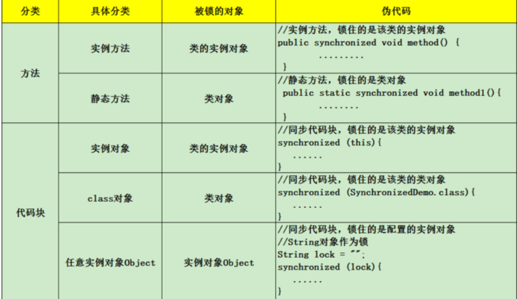
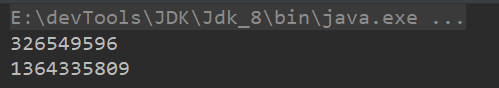
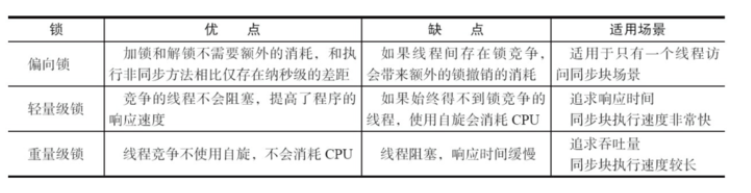

本文学习。synchronized关键字、CAS简介、偏向锁、轻量级锁、重量级锁。

> [上一章]() |||| [下一章]()


首先看一个现象：

```java
public class SynchronizedDeom01 {
    //共享数据
    private static Integer a = 0;
    public static void main(String[] args) throws InterruptedException {
        for (int i = 0; i < 10; i++) {
            new Thread(()->{
                for (int j = 0; j < 10000; j++) {
                    a++;
                }
            }).start();
        }
        //保证非main线程执行结束
        Thread.sleep(1000);
        System.out.println(a);
    }
}
```

不妨多测几次，结果肯定小于100000。

出现以上现象的原因是：**内存可见性问题**，以及**重排序导致的问题**。首先共享数据a对于线程是不可见的，每个线程读取的数据不一定是最新的。然后a++不是一个原子操作，之前线程操作可能会被后面的操做覆盖，  a++   =》(读取a，a加一，给a赋值)。

java关键字synchronized就具有使每个线程依次排队操作共享变量的功能。很显然，这种同步机制效率很低，但synchronized是其他并发容器实现的基础。

<hr>

#### synchronized实现原理

在java代码中使用synchronized可是使用在代码块和方法中，根据Synchronized用的位置可以有这些使用场景：



如图，synchronized可以用在**方法**上也可以使用在**代码块**中，其中方法是实例方法和静态方法分别锁的是该类的实例对象和该类的对象。而使用在代码块中也可以分为三种，具体的可以看上面的表格。这里的需要注意的是：**如果锁的是类对象的话，尽管new多个实例对象，但他们仍然是属于同一个类依然会被锁住，即线程之间保证同步关系**。

<hr>

##### 对象锁（monitor）机制

现在我们来看看synchronized的具体底层实现。先写一个简单的demo:

```java
public class SynchronizedDemo {
    public static void main(String[] args) {
        synchronized (SynchronizedDemo.class) {
        }
        method();
    }
    private static void method() {
    }
}
```

​	一个线程在执行代码前会获取对象的`monitor`，获取`monitor`之后首先需要执行`monitorenter`指令，退出同步代码时会执行`monitorexit`指令。而被锁的对象在被获取`monitor`执行`monitorenter`指令时计数器会加一，执行`monitorexit`时计数器会减一。

​	获取`monitor`是`synchronized`实现同步的关键，而获取`monitor`这个过程是**互斥**的，也就是同一时刻只有一个线程可以获取到`monitor`，其他线程没有获取到`monitor`就会阻塞在同步代码入口处，进入`BLOCKED`状态。

​	`synchronized`是一个阻塞操作，直观上让线程`排队`，保证了内存可见性和避免指令重排，但是这样也会使得未获得锁的线程挂起，从而浪费资源。

<hr>

###### 对象锁分类

前面我们说过`synchronized`可以有同步方法（静态方法、实例方法），同步代码块。总的来说分两种

锁类对象、锁实例对象。

1、锁类对象

同步代码块：

```java
public class SynchronizedBlockClass {
    //共享数据
    private static Integer a = 0;
    public static void main(String[] args) throws InterruptedException {
        for (int i = 0; i < 100; i++) {
            new Thread(() -> {
                synchronized (SynchronizedBlockClass.class) {
                    for (int j = 0; j < 100; j++) {
                        a++;
                    }
                }
            }).start();
        }
        //保证非main线程执行结束
        Thread.sleep(5000);
        System.out.println(a);
    }
}
```

静态同步方法：

```java
class SynchronizedBlockClass2 {
    private static Integer a = 0;
    public static synchronized void add() {
        a++;
    }
    public static void main(String[] args) throws InterruptedException {
        for (int i = 0; i < 10; i++) {
            new Thread(() -> {
                for (int j = 0; j < 10000; j++) {
                    add();
                }
            }).start();
        }
        //保证非main线程执行结束
        Thread.sleep(2000);
        System.out.println(a);
    }
}
```

两种方式都是锁类对象，没有区别，只不过同步静态方法会被`ACC_SYNCHRONIZED`修饰而已。

而被static修饰的`Integer`共享对象属于类。类对象在内存中只有一个，也就是只有这10个线程竞争同一把锁，自然就可以实现同步。

2、锁实例对象

```java
public class SynchronizedBlockObj {

    public static void main(String[] args) throws InterruptedException {
        System.out.println(Money.money);
        for (int i = 0; i < 10; i++) {
            Money money = new Money();
            new Thread(new MyRunAble(money)).start();
        }
        Thread.sleep(2000);
        System.out.println(Money.money);
    }

}

class Money {
    static Integer money = 0;
    //实例同步方法
    synchronized void add() {
        for (int i = 0; i < 10000; i++) {
            money++;
        }
    }
    //锁this
    public void add2() {
        synchronized (this) {
            for (int i = 0; i < 10000; i++) {
                money++;
            }
        }
    }
}

class MyRunAble implements Runnable {
    private Money money;

    public MyRunAble(Money money) {
        this.money = money;
    }
    @Override
    public void run() {
        money.add();
	  //money.add2();
    }
}
```

此案例结果远远小于100000。是因为每个线程锁的是不同的实例对象，也就是获取不同的锁，，而共享数据属于类且每个实例对象都可以访问，不会造成阻塞和普通方法没两样。

`this`代表当前实例对象，同步实例方法和锁this是一个效果。

尝试锁住同一个实例对象：

```java
public static void main(String[] args) throws InterruptedException {
    Money money = new Money();
    System.out.println(Money.money);
    for (int i = 0; i < 10; i++) {
        //Money money = new Money();
        new Thread(new MyRunAble(money)).start();
    }
    Thread.sleep(2000);
    System.out.println(Money.money);
}
```

结果是我们想要的，因为这10个线程获取（竞争）的是同一把锁，就会阻塞。

3、锁普通`Object`对象

如果我们锁`Integer`等基本数据类型、`String`

```java
public class SynchronizedBlockSimpleObj {
    private static Integer a = 0;
    public static void main(String[] args) throws InterruptedException {
        System.out.println(a);
        for (int i = 0; i < 10; i++) {
            new Thread(() -> {
                synchronized (a) {
                    for (int j = 0; j < 10000; j++) {
                        a++;
                    }
                }
            }).start();
        }
        Thread.sleep(5000);
        System.out.println(a);
    }
}
```

对于这种简单的对象，作为锁时不能修改它的值，修改值就会直接改变对象。

`String`是不可变的作为锁也是一样不能修改值。

```java
@Test
public void tt() {
    Integer i1 = 10;
    System.out.println(System.identityHashCode(i1));
    i1 = i1 + 1;
    System.out.println(System.identityHashCode(i1));
}
```



对象内存地址不一样，也就是引用i1指向的不同的对象。

```java
public class SynchronizedBlockSimpleObj {
    private static Integer a = 0;
    private static Integer b = 0;
    
    public static void main(String[] args) throws InterruptedException {
        System.out.println(b);
        for (int i = 0; i < 10; i++) {
            new Thread(() -> {
                synchronized (a) {
                    for (int j = 0; j < 10000; j++) {
                        b++;
                    }
                }
            }).start();
        }
        Thread.sleep(5000);
        System.out.println(b);
    }
}
```

简单类型作为锁只要不改变他的值就可以。

总结一句话对于需要共享资源封装成一个类，让类的实例对象作为锁是很合理的。

<hr>

#### CAS操作

##### 什么是CAS？

​	使用锁时，线程获取锁是一种**悲观锁策略**，就是每次线程都会获取锁并阻塞其他线程。获取锁和释放锁的操做是最大的开销。

​	CAS操作（又称为无锁操作）是一种**乐观锁策略**，即它认为所有线程访问临界区资源时不会出现冲突。如果出现冲突就自旋转，直到当前操作没有冲突为止。

​	CAS是英文单词**CompareAndSwap**的缩写，中文意思是：比较并替换。

​	CAS需要有3个操作数：内存地址V，旧的预期值O，即将要更新的目标值N。当V和O相同时，也就是没有线程修改该值，将N赋给V。反之V和O不相同，表明该值已经被其他线程改过了，所以不能将新值N赋给V，返回V即可。当多个线程使用CAS操作一个变量时，只有一个线程会成功，并成功更新，其余会失败。失败的线程会重新尝试，当然也可以选择挂起线程。

##### CAS的问题

**1. ABA问题**
	CAS操作是检查旧值有没有变化，来判断是否通过检查，这里存在一个问题。ABA问题，即原数据A->变为B->再变回为A，那么它是否改变呢？这里的处理方式参照`mysql`的乐观锁策略，即添加版本号。添加版本号后的变化过程是：1A->2B->3A.=。事实上很多juc包下也是这样解决的。

**2. 自旋时间过长**

​	CAS确实避免了大量`Synchronized`关于获取对象锁和释放对象锁的操作。但是对于CAS操作失败的线程会无限自旋，这样也会造成资源浪费，性能不一定比`Synchronized`高。

**3. 只能保证一个共享变量的原子操作**

​	`Unsafe.class`下提供的使用CAS操作保证内存可见和原子性的方法，每次操作一个对象，可见只能保证一个对象的原子性。所以对于多个共享数据封装成一个对象，对封装后的对象做CAS操作是安全的。

```java
public final native boolean compareAndSwapObject(Object var1, long var2, Object var4, Object var5);
public final native boolean compareAndSwapInt(Object var1, long var2, int var4, int var5);
public final native boolean compareAndSwapLong(Object var1, long var2, long var4, long var6);
```

<hr>

#### Java对象头

进行同步操作的时候是通过获取对象的monitor来保证同步的,就是获取对象的标志位，而这个标志位存在对象头里。Java对象头里的Mark Word，32位默认存储结构为：


锁有4种状态，级别从低到高依次是：**无锁状态、偏向锁状态、轻量级锁状态和重量级锁状态**，这几个状态会随着竞争情况逐渐升级。**锁可以升级但不能降级**，意味着偏向锁升级成轻量级锁后不能降级成偏向锁。这种锁升级却不能降级的策略，目的是为了提高获得锁和释放锁的效率。

<hr>

#### 偏向锁

对于同一个线程多次获取同一个锁，此刻进行加锁和释放锁是没必要的，偏向锁就是为了让线程获得锁的代价降低。

​	·1、偏向锁,语义及是偏向某个线程的锁，它的的获取方式为：

​	当访问同步代码时会在入口校验，该对象的对象头里是否存储着偏向锁的线程id，如果不存在则将当前线程id记录进对象头，以后该线程进入同步代码时不会进行CAS校验。

​	如果当前对象头内没有当前线程Id，会首先进行校验这个对象是否是偏向锁（锁标志位为01），如果不是，则进行CAS竞争、如果是，则尝试替换对象头内线程id为当前线程。

​	2、偏向锁在当其他线程尝试竞争偏向锁时，持有偏向锁的线程才会释放锁。


<hr>

#### 轻量级锁

> **加锁**

线程在执行同步块之前，JVM会先在当前线程的栈桢中**创建用于存储锁记录的空间**，并将对象头中的Mark Word复制到锁记录中，官方称为**Displaced Mark Word**。然后线程尝试使用CAS**将对象头中的Mark Word替换为指向锁记录的指针**。如果成功，当前线程获得锁，如果失败，表示其他线程竞争锁，当前线程便尝试使用自旋来获取锁。


> **解锁**

轻量级解锁时，会使用原子的CAS操作将Displaced Mark Word替换回到对象头，如果成功，则表示没有竞争发生。如果失败，表示当前锁存在竞争，锁就会膨胀成重量级锁。下图是两个线程同时争夺锁，导致锁膨胀的流程图。


#### 为啥升级锁

​	在偏向锁和轻量级锁时，获取锁都是直接进行CAS竞争，即乐观锁策略，此刻虽不会造成阻塞，但是在线程竞争比较激烈时，频繁的CAS操作和自旋操作不见得效率比重量锁效率高。


<hr>

#### 比较

