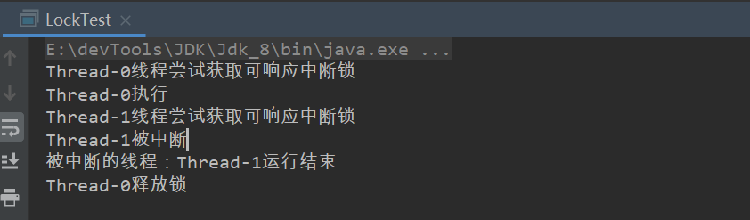
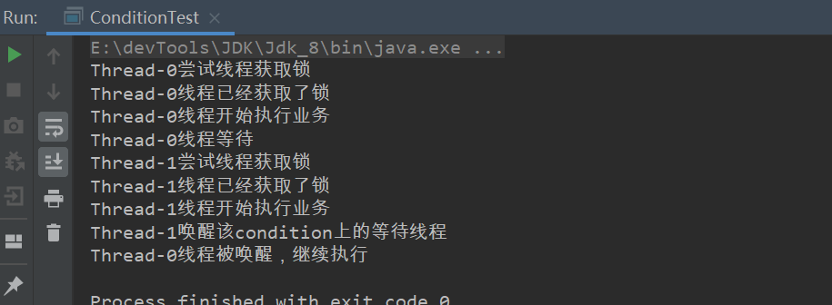
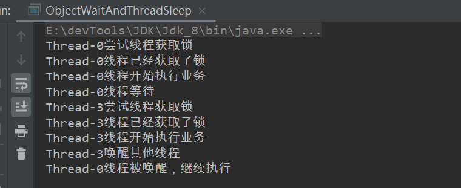

本文首先尝试使用lock控制线程执行，后期进行原理分析。


>  上一章

#### lock

我们知道synchronized关键字可以实现线程同步，确实SE1.5之前关于线程同步大多使用synchronized实现，它可以隐式的加锁解锁（monitorenter和monitorexit），无需开发者关心底层。

SE1.5之后并发包下引入了lock接口，和synchronized一样拥有锁功能，虽需要显示获取、关闭锁，但它拥有了锁获取和释放的可操作性，可中断的获取锁以及超时获取锁等多种synchronized关键字所不具备的同步特性。

例子：

ReentrantLock是lock的一个实现类：

使用lock的一般操作为：

```java
try{
	lock.lock();    
}catch(){
    ...
}finally{
    lock.unlock();
} 
```

##### Lock接口API

> public class ReentrantLock implements **Lock**, java.io.Serializabl

```java
void lock(); //获取锁
void lockInterruptibly() throws InterruptedException；//获取锁的过程能够响应中断
boolean tryLock();//非阻塞式响应中断能立即返回，获取锁反回true反之返回fasle
boolean tryLock(long time, TimeUnit unit) throws InterruptedException;//超时获取锁，在超时内或者未中断的情况下能够获取锁
Condition newCondition();//获取与lock绑定的等待通知组件，当前线程必须获得了锁才能进行等待，进行等待时会先释放锁，当再次获取锁时才能从等待中返回
```

接下来我们尝试使用这些方法

<hr>


##### lock()方法

和Sychronized一样会以阻塞的方式实现同步，只不过lock需要主动释放锁。

```java
public class LockDemo01 {
    private static int a = 0;
    public static void main(String[] args) throws InterruptedException {
        Lock lock = new ReentrantLock();
        for (int i = 0; i < 10; i++) {
            new Thread(() -> {
                try {
                    lock.lock();
                    for (int i1 = 0; i1 < 10000; i1++) {
                        a++;
                    }
                }catch (Exception e){

                }finally {
                    lock.unlock();
                }
            }).start();
        }
        Thread.sleep(2000);
        System.out.println(a);
    }
}
```

##### lockInterruptibly()

lockInterruptibly()方法获取锁的过程(阻塞)可响应中断。如果两个线程竞争获取锁（lock.lockInterruptibly()），此刻线程t1获取了锁，那么线程t2只有等待，如果此刻对线程t2调用t2.interrupt()方法时，会阻止线程t2的等待过程。

如果没有中断操作的话此方法获取的锁和lock方法没有区别。

尝试获取可响应中断锁的线程正在运行时(或者被阻塞在代码入口处)被中断时会抛出InterruptedException在catch代码块捕获并执行其他业务。

```java
public class LockTest {

    private static ReentrantLock lock = new ReentrantLock();

    public static void main(String[] args) throws InterruptedException {

        Thread t1 = new Thread(() -> {
            System.out.println(Thread.currentThread().getName() + "线程尝试获取可响应中断锁");

            try {
                lock.lockInterruptibly();
                System.out.println(Thread.currentThread().getName() + "执行");
                int i = 10;
                while (i-- > 0) Thread.sleep(200);
            } catch (InterruptedException e) {
                System.out.println(Thread.currentThread().getName() + "被中断");
            } finally {
                //lock必须手动释放
                lock.unlock();
                System.out.println(Thread.currentThread().getName() + "释放锁");
            }
        });

        Thread t2 = new Thread(() -> {

            System.out.println(Thread.currentThread().getName() + "线程尝试获取可响应中断锁");

            try {
                lock.lockInterruptibly();
                System.out.println(Thread.currentThread().getName() + "执行");
            } catch (InterruptedException e) {
                //响应中断线程
                System.out.println(Thread.currentThread().getName() + "被中断");
            } finally {
                //处理异常  如果线程没有获取锁而手动关闭的化  会抛出异常
                try {
                    //lock必须手动释放
                    lock.unlock();
                    System.out.println(Thread.currentThread().getName() + "释放锁");
                } catch (Exception e) {
                    System.out.println("被中断的线程：" + Thread.currentThread().getName() + "运行结束");
                }
            }
        });

        t1.start();
        //睡一会  t1先执行
        Thread.sleep(100);
        t2.start();
        //中断线程2  如果不中断 和lock是一样的
        t2.interrupt();
    }
}
```



##### tryLock()

```java
lock.tryLock(200, TimeUnit.MILLISECONDS)
lock.tryLock()
```

- lock.tryLock()

非阻塞式响应中断能立即返回，获取锁反回true反之返回fasle。不会阻塞不会自旋。

- lock.tryLock(200, TimeUnit.MILLISECONDS)

在指定时间范围内获取锁会立刻返回true，指定时间范围内未获取锁不会立刻返回false，超过指定时间范围返回false。类似于超时范围。

此例线程t2循环等待（类似自旋），t1释放锁

```java
class TryLockTest2 {

    private static ReentrantLock lock = new ReentrantLock();

    public static void main(String[] args) throws InterruptedException {
        Thread t1 = new Thread(() -> {
            //获取锁成功
            if (lock.tryLock()) {
                try {
                    System.out.println(Thread.currentThread().getName() + "线程获取锁成功，开始做事");
                    int i = 10;
                    while (i-- > 0) {
                        try {
                            Thread.sleep(100);
                        } catch (InterruptedException e) {
                            e.printStackTrace();
                        }
                    }
                }finally {
                    System.out.println(Thread.currentThread().getName() + "线程释放锁");
                    lock.unlock();
                }
            }
            //获取锁失败
            else {
                System.out.println(Thread.currentThread().getName() + "线程获取锁失败，做其他事");
            }
        });
        Thread t2 = new Thread(() -> {
            //一直等待成功获取锁
            while (!lock.tryLock()) System.out.println("等待获取锁");
            try {
                //获取锁成功
                System.out.println(Thread.currentThread().getName() + "线程获取锁成功，开始做事");
            }finally {
                System.out.println(Thread.currentThread().getName() + "线程释放锁");
                lock.unlock();
            }
        });
        t1.start();
        Thread.sleep(500);
        t2.start();
        //保证非main线程运行成功
        Thread.sleep(500);
    }
}
```


<hr>

##### newCondition();

newCondition()方法获取与lock绑定的等待通知组件，当前线程必须获得了锁才能进行等待，进行等待时会先释放锁，当再次获取锁时才能从等待中返回。

```java
//当前线程进入等待状态，如果其他线程调用condition的signal或者signalAll方法并且当前线程获取Lock从await方法返回，如果在等待状态中被中断会抛出被中断异常；
void await() throws InterruptedException;
//当前线程进入等待状态直到被通知，中断或者超时；
long awaitNanos(long nanosTimeout) throws InterruptedException;
//同二  支持自定义时间
boolean await(long time, TimeUnit unit)throws InterruptedException：
//当前线程进入等待状态直到被通知，中断或者到了某个时间
boolean awaitUntil(Date deadline) throws InterruptedException;
```

```java
void signal();//唤醒当前condition上的线程（应该是队列）
void signalAll();//唤醒当前condition上的所有
```

- 使用await()方法前必须先获取锁，await()方法会释放锁和cpu分配的时间片。
- 调用await()使得线程进入等待状态，如果被中断会抛出中断异常。
- await(long time, TimeUnit unit)等待指定时长，必须再次获得锁才可以从await返回，也就是如果锁被其他线程占有，则自超过定义时间范围也不会唤醒。
- 使用signal()方法前必须先获取锁。唤醒同一个condition上的线程（队列）

例子：

```java
public class ConditionTest {
    //lock
    private static ReentrantLock lock = new ReentrantLock();
    //condition
    private static Condition condition = lock.newCondition();

    public static void main(String[] args) throws InterruptedException {

        Thread t1 = new Thread(() -> {
            try {
                System.out.println(Thread.currentThread().getName() + "尝试线程获取锁");
                //调用condition的await()方法前需要首先获取锁
                lock.lock();
                System.out.println(Thread.currentThread().getName() + "线程已经获取了锁");
                System.out.println(Thread.currentThread().getName() + "线程开始执行业务");

                System.out.println(Thread.currentThread().getName() + "线程等待");
                condition.await();
                System.out.println(Thread.currentThread().getName() + "线程被唤醒，继续执行");
            } catch (InterruptedException e) {
                e.printStackTrace();
            } finally {
                lock.unlock();
            }
        });

        Thread t2 = new Thread(() -> {
            try {
                System.out.println(Thread.currentThread().getName() + "尝试线程获取锁");
                //调用condition的await()方法前需要首先获取锁
                lock.lock();
                System.out.println(Thread.currentThread().getName() + "线程已经获取了锁");
                System.out.println(Thread.currentThread().getName() + "线程开始执行业务");
                System.out.println(Thread.currentThread().getName() + "唤醒该condition上的等待线程");
                condition.signal();
            } finally {
                lock.unlock();
            }
        });
        t1.start();
        //t1先启动
        //Thread.sleep(5);
        t2.start();
        //保证非main线程执行
        Thread.sleep(1000);
    }
}
```



<hr>


#### await&signal VS wait&notify

- awit&signal属于Condition类下，wait&notify属于Object类下。
- await需要获取lock，wait需要获取monitor
- await属于java语言级别，wait属于java底层。（前者拓展性更好）

- await更灵活：可响应中断、可设置多个等待队列、自定义超时时间。而wait不行
- await和wait都会释放锁交出时间片。

Thread.sleep();方法不会释放锁。

##### wait测试

> Object.wait()必须获取对象监视器（monitor），也就是必须在同步代码快里执行。调用wait()会释放锁交出时间片，一直等待直到其他线程唤醒(notify)它。

```java
class ObjectWaitAndThreadSleep {

    public static void main(String[] args) throws InterruptedException {
        ObjectWaitAndThreadSleep objectWaitAndThreadSleep = new ObjectWaitAndThreadSleep();

        objectWaitAndThreadSleep.ObjectWait();
    }
    public void ObjectWait() throws InterruptedException {
        //监视器
        Object o = new Object();
        Thread t1 = new Thread(() -> {
            System.out.println(Thread.currentThread().getName() + "尝试线程获取锁");
            synchronized (o) {
                System.out.println(Thread.currentThread().getName() + "线程已经获取了锁");
                System.out.println(Thread.currentThread().getName() + "线程开始执行业务");
                try {
                    System.out.println(Thread.currentThread().getName() + "线程等待");
                    o.wait();
                } catch (InterruptedException e) {
                    e.printStackTrace();
                }
                System.out.println(Thread.currentThread().getName() + "线程被唤醒，继续执行");
            }
        });
        Thread t2 = new Thread(() -> {
            synchronized (o) {
                System.out.println(Thread.currentThread().getName() + "尝试线程获取锁");
                System.out.println(Thread.currentThread().getName() + "线程已经获取了锁");
                System.out.println(Thread.currentThread().getName() + "线程开始执行业务");

                System.out.println(Thread.currentThread().getName() + "唤醒其他线程");
                o.notify();
            }
        });
        t1.start();
        Thread.sleep(1000);
        t2.start();
        Thread.sleep(500);
    }
}
```




