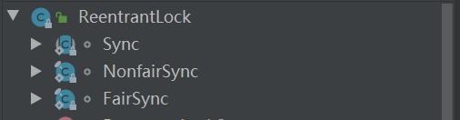
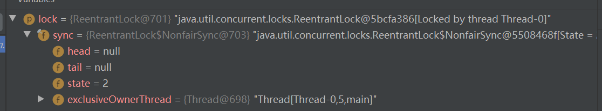
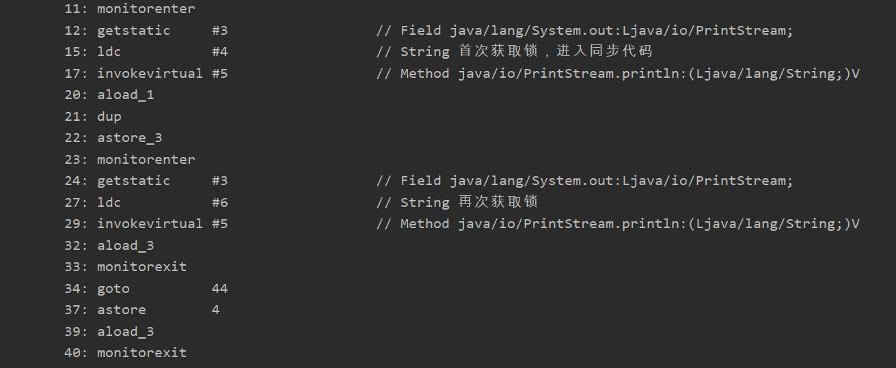
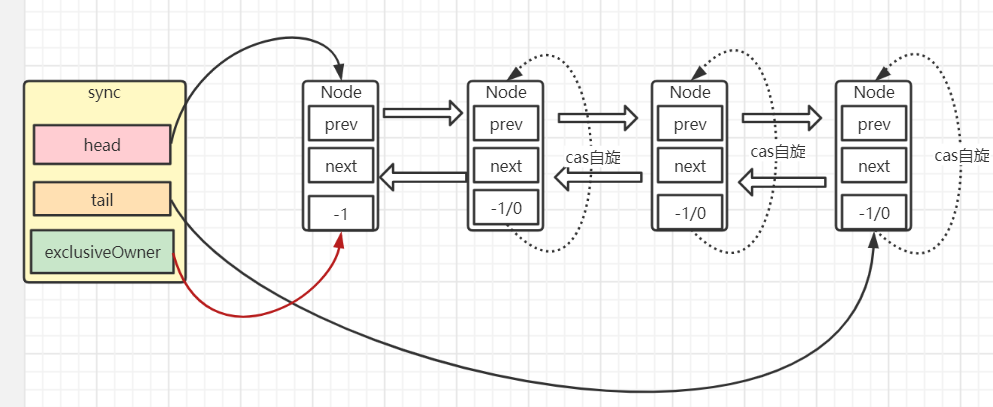
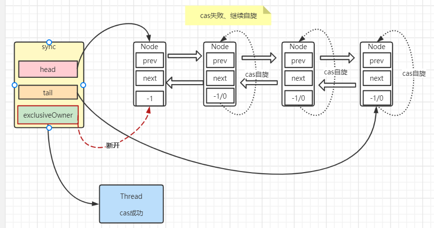

ReenTrantLock理解

> 上一篇


#### 简介

首先看一下这个类



Sync是AQS的一个实现类、NofairSync非公平锁、FairSync公平锁这两个都是Sync的子类。

其他的就是一些获取锁的方法和出队入队。

ReentrantLock重入锁，是实现Lock接口的一个类，也是在实际编程中使用频率很高的一个锁，**支持重入性，表示能够对共享资源能够重复加锁，即当前线程获取该锁再次获取不会被阻塞**。与此同时，ReentrantLock还支持**公平锁和非公平锁**两种方式。


#### ReenTrantLock的重入性

ReenTrantLock默认非公平锁。

以下代码就是重入的逻辑。当   当前线程为同步状态的拥有者，则同步状态加一。

```java
else if (current == getExclusiveOwnerThread()) {
    int nextc = c + acquires;
    if (nextc < 0) // overflow
        throw new Error("Maximum lock count exceeded");
    setState(nextc);
    return true;
}
```

测试以下：debug模式启动，断点打在最后一个lock()方法

```java
public static void main(String[] args) {
    ReentrantLock lock = new ReentrantLock();
    new Thread(()->{
        try {
            lock.lock();
            lock.lock();
            lock.lock();
        }finally {
		//不释放锁
        }
    }).start();
}
```



state = 2 即该线程获取了两次同步状态(加了两次锁)。


##### 再看一下释放锁的逻辑：

当前同步状态减一，当同步状态为0，返回true。

```java
protected final boolean tryRelease(int releases) {
    int c = getState() - releases;
    if (Thread.currentThread() != getExclusiveOwnerThread())
        throw new IllegalMonitorStateException();
    boolean free = false;
    if (c == 0) {
        free = true;
        setExclusiveOwnerThread(null);
    }
    setState(c);
    return free;
}
```


##### 对比Synchronized

jvm提供的原子操作lock和unlock我们接触不到，jvm提供了monitorEnter和monitorExit两个指令来加锁和释放锁。执行monitorEnter指令前需要获取对象监视器monitor。Synchronized支持重入，线程执行monitorEnter指令计数器加一，monitorExit指令计数器减一，减到0就释放结束了。

```java
public static void main(String[] args) throws InterruptedException {
    //共享资源
    Object o = new Object();
    try {
        synchronized (o){
            System.out.println("首次获取锁，进入同步代码");
            synchronized (o){
                System.out.println("再次获取锁");
            }
        }
    }catch (Exception e){
        System.out.println("异常");
    }
}
```

用javap -v查看字节码文件



下面还有两个monitorExit指令，是遇到异常需要执行的指令。


小结：

- synchronized使用对象监视器(monitor)隐式加锁释放锁，lock使用同步队列管理线程需要手动的加锁释放锁。
- 都支持重入性


<hr>


#### 公平锁和非公平锁

ReentrantLock支持两种锁：**公平锁**和**非公平锁**。

非公平锁获取线程只有一个准则就是：

同步状态值state为0时就去竞争获取锁：包括新来的和同步队列里头结点的后驱节点。

这里就有两种情况这个线程是新来的还是同步队列里的？

①新来的：如果state值大于0，同步状态被占有，则去排队。如果state值为0，就去竞争锁！！！竞争成功则可以获取锁。这TM不是插队了嘛。

②同步队列里的节点的线程：会自旋，时刻监视自己的状态，监视自己节点的前驱节点是否为头结点并且是否可以竞争到锁。


ReenTrantLock默认为非公平锁

```java
public ReentrantLock() {
    sync = new NonfairSync();
}
```

```java
public ReentrantLock(boolean fair) {
    sync = fair ? new FairSync() : new NonfairSync();
}
```


**何谓公平，是针对获取锁而言的，如果一个锁是公平的，那么锁的获取顺序就应该符合请求上的绝对时间顺序，满足FIFO**。ReentrantLock的构造方法无参时是构造非公平锁，源码为：

FairSync.tryAcquire

```java
protected final boolean tryAcquire(int acquires) {
        final Thread current = Thread.currentThread();
        int c = getState();
        if (c == 0) {
            if (!hasQueuedPredecessors() &&
                compareAndSetState(0, acquires)) {
                setExclusiveOwnerThread(current);
                return true;
            }
        }
        else if (current == getExclusiveOwnerThread()) {
            int nextc = c + acquires;
            if (nextc < 0)
                throw new Error("Maximum lock count exceeded");
            setState(nextc);
            return true;
        }
        return false;
    }
}
```

和非公平锁没太大区别，只不过加了一层hasQueuedPredecessors()判断。我们看一下：

首先看一下哦tryAcquire返回true也就是可以获取锁的前置条件就是hasQueuedPredecessors()反回false

```java
public final boolean hasQueuedPredecessors() {
    // The correctness of this depends on head being initialized
    // before tail and on head.next being accurate if the current
    // thread is first in queue.
    //获取头结点和尾结点
    Node t = tail; // Read fields in reverse initialization order
    Node h = head;
    //缓存
    Node s;
    //头结点尾结点不是一个节点，也就是完成了初始化 并且同步队列还有节点
    return h != t &&
		//头结点的后继节点为null   当前线程不是头结点后驱节点线程
        ((s = h.next) == null || s.thread != Thread.currentThread());
}
```

何时返回false：

①头结点尾结点指向同一个节点：也就是未初始化或同步队列没值了，自然可以直接竞争

②头结点的后继节点不为null，且头结点的后继节点线程不是当前线程。这表明同步队列还有等待的节点，并且竞争的线程不是头结点的后继节点内的线程，那就是插队进来的！！！！


图解方式：

原状态:



解释：sync为同步器、head和tail为头尾节点、exclusiveOwner为同步状态拥有者(这是AQS父类一个属性)、Node们构成同步队列。


公平锁情况下排队获取锁：


公平锁情况下，会先判断同步队列列里是否还有节点，如果有获取同步状态失败，尾插法将节点插入同步队列，并且使得sync的tail指向刚插入的节点。即公平锁在同步队列有节点的情况下不会进行竞争。


非公平锁情况下：

可能会出现这种情况，cas竞争



当头结点完全释放锁时，如果此刻刚好启动一个线程去获取锁，同时此刻head节点的后驱节点也在cas自旋尝试获取得到锁，如果head节点的后驱节点cas失败了，也就出现上图所示状态，同步队列没有变化，但是锁却被一个同步队列外的线程获取，形成了插队！！！


> **公平锁  VS  非公平锁**

1. 公平锁每次获取到锁为同步队列中的第一个节点，**保证请求资源时间上的绝对顺序**，而非公平锁有可能刚释放锁的线程下次继续获取该锁，则有可能导致其他线程永远无法获取到锁，**造成“饥饿”现象**。

2. 公平锁为了保证时间上的绝对顺序，需要频繁的上下文切换，而非公平锁会降低一定的上下文切换，降低性能开销。因此，ReentrantLock默认选择的是非公平锁，则是为了减少一部分上下文切换，**保证了系统更大的吞吐量**。


