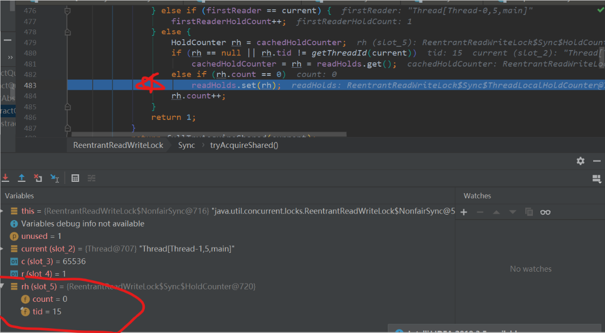

读写锁


> 上一篇


### 读写锁简介

目前我们知道的锁，无非是Synchronized和ReentrantLock，他们都是独占式锁，以阻塞的方式实现同步。我们知道只有写操作才会造成线程安全问题，但是大多业务场景下，读业务远远大于些业务，而且读是没有线程安全性问题的，如果我们对每一个执行读业务的线程都加锁，显然效率是不高的。

读写锁就是解决这样的问题的，对于读锁可以多次被不同线程获取，即是共享锁，但是对于写锁所有线程都会阻塞，即是独占锁。

ReenTrantReadWriteLock本身没有实现Lock接口，而是内聚了ReadLock和WriterLock，然后提供获取和释放读写锁的方法。

- 支持重入性
- 分别使用低16位和高16位表示写锁和读锁重入次数


<hr>

#### 写锁源码解析

##### 写锁获取锁

ReentrantReadWriteLock.sync.tryAcquire()

```java
protected final boolean tryAcquire(int acquires) {
    /*
     * Walkthrough:
     * 1. If read count nonzero or write count nonzero
     *    and owner is a different thread, fail.
     * 2. If count would saturate, fail. (This can only
     *    happen if count is already nonzero.)
     * 3. Otherwise, this thread is eligible for lock if
     *    it is either a reentrant acquire or
     *    queue policy allows it. If so, update state
     *    and set owner.
     */
    //获取当前线程
    Thread current = Thread.currentThread();
    //获取同步状态
    int c = getState();
    //计算写锁被获取次数，以下有介绍
    int w = exclusiveCount(c);
    if (c != 0) {
        // (Note: if c != 0 and w == 0 then shared count != 0)
        //同步状态被读锁获取，阻塞进入同步队列
        if (w == 0 || current != getExclusiveOwnerThread())
            return false;
        //如果写锁获取次数达上限 65536  抛出异常
        if (w + exclusiveCount(acquires) > MAX_COUNT)
            throw new Error("Maximum lock count exceeded");
        // Reentrant acquire
        //写锁重入    w != 0 && current == getExclusiveOwnerThread()
        setState(c + acquires);
        return true;
    }
    //写锁是否阻塞
    if (writerShouldBlock() ||
        !compareAndSetState(c, c + acquires))
        return false;
    //写锁不阻塞，设置当前线程为同步状态拥有者，并返回true
    setExclusiveOwnerThread(current);
    return true;
}
```

写锁是否阻塞：

①对于非公平锁，writerShouldBlock()返回false，如果cas成功则获取写锁，如果cas失败则阻塞。

②对于公平锁，需要看同步队列是否有其他节点，

-  如果有，writerShouldBlock()返回true，则直接阻塞。
-  如果没有，writerShouldBlock()则返回false，当cas成功获取得到写锁。

接下来阻塞就入队进行自旋，不阻塞就执行。

总结：对于写锁获取的过程和普通独占锁获取没有区别

<hr>

exclusiveCount

```java
//65536  =》   2^16-1
static int exclusiveCount(int c) { return c & EXCLUSIVE_MASK; }
```

按位与运算，得到同步状态低16位的值。其实在hashMap中也有类似用法，用来表示除一个二的幂次方数取余的。


<hr>


writerShouldBlock

对于非公平锁：写锁不阻塞

```java
final boolean writerShouldBlock() {
    return false; // writers can always barge
}
```

对于公平锁，当同步队列存在节点时阻塞，不存在节点不阻塞

```java
final boolean writerShouldBlock() {
      return hasQueuedPredecessors();
}
```

<hr>


##### 写锁释放锁

tryRelease

```java
protected final boolean tryRelease(int releases) {
    //判断当前线程是否是同步状态拥有者
    if (!isHeldExclusively())
        throw new IllegalMonitorStateException();
    //同步状态减一
    int nextc = getState() - releases;
    //写锁被获取次数是否为0（是否被释放完全）。
    boolean free = exclusiveCount(nextc) == 0;
    if (free)
        setExclusiveOwnerThread(null);
    setState(nextc);
    return free;
}
```

写锁的释放还是很简单的，简单判断①当前线程是否为同步状态拥有者②写锁是否完全释放，然后修改同步状态和同步状态拥有者即可。


<hr>


#### 读锁源码分析

##### 读锁获取锁

首先我们了解几个变量：

firstReader   首个读锁拥有者的线程

firstReaderHoldCount  首个读锁拥有者线程重入次数

cachedHoldCounter   缓存上一个线程id和重入次数

readHolds  提供访问ThreadLocalMap方法的对象

引入它们3个实际上是缓存，减少对readHolds的访问，也即减少了查找ThreadLocalMap的次数，提升了速度。

cachedHoldCounter也类似，它用缓存上一个成功获取读锁的线程的HoldCounter对象，HoldCounter对象里面存了线程的ID和重入次数。它缓存的至少是第二个成功获取读锁线程的HoldCounter，因为第一个线程的重入信息缓存在firstReader、firstReaderHoldCounter中了。


读锁是一个共享锁

```java
public void lock() {
    sync.acquireShared(1);
}
```

###### tryAcquireShared

```java
protected final int tryAcquireShared(int unused) {
    /*
     * Walkthrough:
     * 1. If write lock held by another thread, fail.
     * 2. Otherwise, this thread is eligible for
     *    lock wrt state, so ask if it should block
     *    because of queue policy. If not, try
     *    to grant by CASing state and updating count.
     *    Note that step does not check for reentrant
     *    acquires, which is postponed to full version
     *    to avoid having to check hold count in
     *    the more typical non-reentrant case.
     * 3. If step 2 fails either because thread
     *    apparently not eligible or CAS fails or count
     *    saturated, chain to version with full retry loop.
     */
            //1.如果其他线程拥有了写锁，获取共享锁失败
            //2.如果没有写锁，就代表可以获取共享锁，不过要现判断是否应该进行阻塞（由于队列策略）
            //	并且通过CAS的方法更新同步状态，更新成功就代表获取锁成功
            //3.如果获取共享锁失败，代表CAS失败或者共享锁数量满了

    Thread current = Thread.currentThread();
    int c = getState();
    //如果有写锁获取了同步状态且当前线程不是同步状态的拥有者(不是锁降级) 则获取锁失败
    if (exclusiveCount(c) != 0 &&
        getExclusiveOwnerThread() != current)
        return -1;
    //获取读锁被获取次数
    int r = sharedCount(c);
    //如果读锁应该被阻塞  或读锁被获取次数达到上限  或cas失败  则进行"完全获取共享锁"
    if (!readerShouldBlock() &&
        r < MAX_COUNT &&
        compareAndSetState(c, c + SHARED_UNIT)) {
        //读锁被首次获取，记录线程和首次重入次数
        if (r == 0) {
            firstReader = current;
            firstReaderHoldCount = 1;
        } else if (firstReader == current) {
            //首个获取读锁线程  重入就加一
            firstReaderHoldCount++;
        } else {
            //不是首次获取读锁，也不是首个重入，那么就是一个新的获取读锁的线程
            //需要维护一个HoldCounter对象
            HoldCounter rh = cachedHoldCounter;
            //①rh为null：第二个获取读锁的线程，初始化cache，,并记录在readHolds里
            //②不是重入，更新cache,并记录在readHolds里
            if (rh == null || rh.tid != getThreadId(current))
                cachedHoldCounter = rh = readHolds.get();
            //什么情况下会走这个判断：rh！=null and  rh.tid==getThreadId(current) and rh.count == 0
            //什么情况会走这里？当前线程释放读锁后再次获取读锁且获取成功，重新将cachedHoldCounter放回readHolds里
            else if (rh.count == 0)
                readHolds.set(rh);
            //当前读锁重入次数加一（①重入②初始值加一）
            rh.count++;
        }
        return 1;
    }
    //cas失败时 进行自旋
    return fullTryAcquireShared(current);
}
```

读锁的获取相对复杂：

①如果同步状态已经被写锁获取且当前线程不是同步状态的拥有者（即不是重入），就进行入队操作

②readerShouldBlock()返回false，也就是读锁不应该被阻塞、写锁被获取次数未达上限且cas成功，则获取读锁成功。（这里分首次获取读锁和第二次以后获取读锁，readerShouldBlock也在下文说明）

③readerShouldBlock()返回true，也就是读锁应该被阻塞，执行fullTryAcquireShared()方法,如果返回-1，进行入队操作。如果返回1则成功获取锁

> fullTryAcquireShared()方法也做了上面cas失败时自旋的操作。


不晓得各位有没有这样一个疑问？何时走下面的判断？

```java
else if (rh.count == 0)
                readHolds.set(rh);
```

什么情况下是这样的？：rh！=null and  rh.tid==getThreadId(current) and rh.count == 0

cacheHolerCounter不是null，也就是第二个即之后的线程获取读锁，rh.tid==getThreadId(current)此条件是重入那么count至少为1吧~~。但是最后一个条件为count == 0。思考良久，掉了十根头发，结果就是下面的例子，各位在int i = 10初打断点，debug查看。

测试：

```java
class readHoldsTest{
    private static ReadWriteLock readWriteLock = new ReentrantReadWriteLock();
    private static Lock readLock = readWriteLock.readLock();

    public static void main(String[] args) {

        new Thread(()-> {
            readLock.lock();
            //获取读锁死循环  模拟占用firstReader
            while (true);
        }).start();
        new Thread(()-> {

            try {
                readLock.lock();
                //第二次获取读锁
                System.out.println("第二次获取读锁");
            }finally {
                System.out.println("释放读锁");
                readLock.unlock();
            }
            int i = 0;
            try {
                readLock.lock();
                //释放锁后再次获取
                System.out.println("释放锁后再次获取");
            }finally {
                System.out.println("释放读锁");
                readLock.unlock();
            }
        }).start();
    }
}
```



<hr>


###### doAcquireShared：

读锁的入队操作

```java
private void doAcquireShared(int arg) {
    //添加可共享节点到  同步队列
    final Node node = addWaiter(Node.SHARED);
    boolean failed = true;
    try {
        boolean interrupted = false;
        //自旋  
        for (;;) {
            //获取当前节点前驱节点
            final Node p = node.predecessor();
            if (p == head) {
                //如果前驱节点为头结点且可以获取同步状态，获取(共享锁)读锁成功
                int r = tryAcquireShared(arg);
                if (r >= 0) {
                    setHeadAndPropagate(node, r);
                    p.next = null; // help GC
                    if (interrupted)
                        selfInterrupt();
                    failed = false;
                    return;
                }
            }
            if (shouldParkAfterFailedAcquire(p, node) &&
                parkAndCheckInterrupt())
                interrupted = true;
        }
    } finally {
        if (failed)
            cancelAcquire(node);
    }
}
```

入队操作和普通锁一样，只不过往同步队列添加的是共享节点。


<hr>


###### readerShouldBlock()方法：

作为公平锁：和写锁是一样的，如果同步队列有节点的话就阻塞

```java
final boolean readerShouldBlock() {
    return hasQueuedPredecessors();
}
```

```java
public final boolean hasQueuedPredecessors() {
    // The correctness of this depends on head being initialized
    // before tail and on head.next being accurate if the current
    // thread is first in queue.
    Node t = tail; // Read fields in reverse initialization order
    Node h = head;
    Node s;
    return h != t &&
        ((s = h.next) == null || s.thread != Thread.currentThread());
}
```

作为非公平锁：

当头结点的后驱节点不是共享节点时阻塞，也就是是写锁时阻塞

```java
final boolean apparentlyFirstQueuedIsExclusive() {
    Node h, s;
    return (h = head) != null &&
        (s = h.next)  != null &&
        !s.isShared()         &&
        s.thread != null;
}
```


<hr>


###### fullTryAcquireShared


```java
final int fullTryAcquireShared(Thread current) {
    /*
     * This code is in part redundant with that in
     * tryAcquireShared but is simpler overall by not
     * complicating tryAcquireShared with interactions between
     * retries and lazily reading hold counts.
     */
    //从第二个获取读锁的线程开始，每一个线程都需要维护一个HoldCounter对象，cachedHoldCounter缓存上一个线程的HoldCounter
    HoldCounter rh = null;
    //自旋
    for (;;) {
        int c = getState();
        if (exclusiveCount(c) != 0) {
            if (getExclusiveOwnerThread() != current)
                return -1;
            // else we hold the exclusive lock; blocking here
            // would cause deadlock.
        } else if (readerShouldBlock()) {
            // Make sure we're not acquiring read lock reentrantly  
            if (firstReader == current) {
                // assert firstReaderHoldCount > 0;
                //首个读锁重入  啥都不做，都在下面做
            } else {
                if (rh == null) {
                    //读取上一个线程的缓存信息，用于判断是否重入
                    rh = cachedHoldCounter;
                    //①rh为null：第二个获取读锁的线程，初始化cache
		            //②不是重入，重置cache
                    if (rh == null || rh.tid != getThreadId(current)) {
                        //更新缓存
                        rh = readHolds.get();
                        if (rh.count == 0)
                            //移除  线程value
                            readHolds.remove();
                    }
                }
                if (rh.count == 0)
                    return -1;
            }
        }
        if (sharedCount(c) == MAX_COUNT)
            throw new Error("Maximum lock count exceeded");
        if (compareAndSetState(c, c + SHARED_UNIT)) {
            if (sharedCount(c) == 0) {
                firstReader = current;
                firstReaderHoldCount = 1;
            } else if (firstReader == current) {
                firstReaderHoldCount++;
            } else {
                if (rh == null)
                    rh = cachedHoldCounter;
                if (rh == null || rh.tid != getThreadId(current))
                    rh = readHolds.get();
                else if (rh.count == 0)
                    readHolds.set(rh);
                rh.count++;
                cachedHoldCounter = rh; // cache for release
            }
            return 1;
        }
    }
}
```

##### 读锁释放锁

```java
protected final boolean tryReleaseShared(int unused) {
    Thread current = Thread.currentThread();
    //如果当前线程  是首个读锁拥有者
    if (firstReader == current) {
        // assert firstReaderHoldCount > 0;
        if (firstReaderHoldCount == 1)
            firstReader = null;
        else
            firstReaderHoldCount--;
    } else {
        //如果当前线程不是首个读锁拥有者  获取HoldCounter对象
        HoldCounter rh = cachedHoldCounter;
        if (rh == null || rh.tid != getThreadId(current))
            //如果满足条件，去readHolds里获取HoldCounter对象 移除线程信息并计数器置位0
            rh = readHolds.get();
        //否则就是释放锁（重入次数）
        int count = rh.count;
        if (count <= 1) {
            readHolds.remove();
            if (count <= 0)
                throw unmatchedUnlockException();
        }
        --rh.count;
    }
    for (;;) {
        //将同步状态高16位置位0
        int c = getState();
        int nextc = c - SHARED_UNIT;
        if (compareAndSetState(c, nextc))
            // Releasing the read lock has no effect on readers,
            // but it may allow waiting writers to proceed if
            // both read and write locks are now free.
            return nextc == 0;
    }
}
```


#### 锁降级

读写锁支持锁降级，**遵循按照获取写锁，获取读锁再释放写锁的次序，写锁能够降级成为读锁**，不支持锁升级，关于锁降级下面的示例代码摘自ReentrantWriteReadLock源码中：

```java
void processCachedData() {
        rwl.readLock().lock();
        if (!cacheValid) {
            // Must release read lock before acquiring write lock
            rwl.readLock().unlock();
            rwl.writeLock().lock();
            try {
                // Recheck state because another thread might have
                // acquired write lock and changed state before we did.
                if (!cacheValid) {
                    data = ...
            cacheValid = true;
          }
          // Downgrade by acquiring read lock before releasing write lock
          rwl.readLock().lock();
        } finally {
          rwl.writeLock().unlock(); // Unlock write, still hold read
        }
      }
 
      try {
        use(data);
      } finally {
        rwl.readLock().unlock();
      }
    }
}
```

这是源码中的例子，需要注意的是获取写锁之前一定要释放读锁。

关于锁降级在源码中也有说明，也就是获读锁时①存在线程获取了写锁②当前线程不是同步状态用有者  需要同时满足这两个条件才会返回-1，也就是获取读锁失败。

那么如果我们在获取了写锁的线程内去获取读锁会怎样？

测试：

```java
class Runable01 implements Runnable {
    private static ReadWriteLock readWriteLock = new ReentrantReadWriteLock();
    private static Lock readLock = readWriteLock.readLock();
    private static Lock writeLock = readWriteLock.writeLock();
    //共享数据
    private static int count = 0;
    @Override
    public void run() {
        try {
            System.out.println("尝试获取写锁");
            writeLock.lock();
            System.out.println("获取了写锁");
            System.out.println("业务操作");
            do Thread.sleep(500); while (++count < 10);
            try {
                System.out.println("尝试获取读锁");
                readLock.lock();
                System.out.println("获取了读锁");
                System.out.println("读取共享变量" + "count:" + count);
            } finally {
                //释放写锁，线程锁降级为读锁
                writeLock.unlock();
            }
        } catch (InterruptedException e) {
            e.printStackTrace();
        } finally {
            readLock.unlock();
        }
    }
    public static void main(String[] args) {

        new Thread(new Runable01()).start();
    }
}
```


锁降级针对的是线程拥有锁的类型，而不是锁的性质发生变化。

锁降级顺序：获取写锁   ----->  获取读锁------> 释放写锁

获取读锁操作在 释放写锁操作之前是为了保证在同一个线程内完成此操作，因为as if seriel 保证了单线程的内存可见性。

如果说是这样的顺序：获取写锁   ----->  释放写锁------> 获取读锁

这样就是普通的锁竞争了，你无法保证，一定可以获取读锁。


<hr>


### 例子

写锁被当前线程获取，其他线程阻塞

写锁+写锁

```java
//模拟读锁被获取，其他锁阻塞
public static void main(String[] args) {
    ReadWriteLock readWriteLock  = new ReentrantReadWriteLock();
    Lock writeLock = readWriteLock.writeLock();
    new Thread(()->{
        try {
            System.out.println(Thread.currentThread().getName()+"尝试获取写锁");
            //当前线程获取写锁  其他线程阻塞
            writeLock.lock();
            System.out.println(Thread.currentThread().getName()+"获取了写锁");
            System.out.println("睡5秒 在此过程其他线程阻塞");
            Thread.sleep(5000);
        } catch (InterruptedException e) {
            e.printStackTrace();
        }finally {
            System.out.println(Thread.currentThread().getName() + "释放写锁");
            writeLock.unlock();
        }
    }).start();

    new Thread(()->{
        try {
            System.out.println(Thread.currentThread().getName()+"尝试获取写锁");
            //当前线程阻塞
            writeLock.lock();
            System.out.println(Thread.currentThread().getName()+"获取了写锁");
        }finally {
             System.out.println(Thread.currentThread().getName() + "释放写锁");
            writeLock.unlock();
        }
    }).start();
}
```


<hr>


写锁+读锁

```java
//模拟读锁被获取，其他锁阻塞
public static void main(String[] args) {
    ReadWriteLock readWriteLock = new ReentrantReadWriteLock();
    Lock readLock = readWriteLock.readLock();
    Lock writeLock = readWriteLock.writeLock();

    new Thread(() -> {
        try {
            System.out.println(Thread.currentThread().getName() + "尝试获取写锁");
            //当前线程获取写锁  其他线程阻塞
            writeLock.lock();
            System.out.println(Thread.currentThread().getName() + "获取了写锁");
            System.out.println("睡5秒 在此过程其他线程阻塞");
            Thread.sleep(5000);
        } catch (InterruptedException e) {
            e.printStackTrace();
        } finally {
            System.out.println(Thread.currentThread().getName() + "释放写锁");
            writeLock.unlock();
        }
    }).start();

    new Thread(() -> {
        try {
            System.out.println(Thread.currentThread().getName() + "尝试获取读锁");
            //当前线程阻塞
            readLock.lock();
            System.out.println(Thread.currentThread().getName() + "获取了读锁");
        } finally {
            System.out.println(Thread.currentThread().getName() + "释放读锁");

            readLock.unlock();
        }
    }).start();
}
```


<hr>


读锁+读锁  不会阻塞

```java
public static void main(String[] args) {
    ReadWriteLock readWriteLock = new ReentrantReadWriteLock();
    Lock readLock = readWriteLock.readLock();
    Lock writeLock = readWriteLock.writeLock();
    new Thread(() -> {
        try {
            System.out.println(Thread.currentThread().getName() + "尝试获取读锁");
            //当前线程获取读锁
            readLock.lock();
            System.out.println(Thread.currentThread().getName() + "获取了读锁");
            System.out.println("睡5秒");
            Thread.sleep(5000);
        } catch (InterruptedException e) {
            e.printStackTrace();
        } finally {
            System.out.println(Thread.currentThread().getName() + "释放读锁");

            readLock.unlock();
        }
    }).start();
    new Thread(() -> {
        try {
            System.out.println(Thread.currentThread().getName() + "尝试获取读锁");
            readLock.lock();
            System.out.println(Thread.currentThread().getName() + "获取了读锁");
        } finally {
            System.out.println(Thread.currentThread().getName() + "释放读锁");
            readLock.unlock();
        }
    }).start();
}
```


<hr>


读锁＋写锁

会阻塞，也说明了一点，获取写锁之前一定要释放写锁。源码也可以看出，如果有线程获取了读锁，且当前线程不是同步状态拥有者，那么就会阻塞进入同步队列。

```java
class WrlDemo04 {
    public static void main(String[] args) {
        ReadWriteLock readWriteLock = new ReentrantReadWriteLock();
        Lock readLock = readWriteLock.readLock();
        Lock writeLock = readWriteLock.writeLock();
        new Thread(() -> {
            try {
                System.out.println(Thread.currentThread().getName() + "尝试获取读锁");
                //当前线程获取读锁
                readLock.lock();
                System.out.println(Thread.currentThread().getName() + "获取了读锁");
                Thread.sleep(5000);
                System.out.println("睡5秒");
            } catch (InterruptedException e) {
                e.printStackTrace();
            } finally {
                System.out.println(Thread.currentThread().getName() + "释放读锁");

                readLock.unlock();
            }
        }).start();

        new Thread(() -> {
            try {
                System.out.println(Thread.currentThread().getName() + "尝试获取写锁");
                writeLock.lock();
                System.out.println(Thread.currentThread().getName() + "获取了写锁");
            } finally {
                System.out.println(Thread.currentThread().getName() + "释放写锁");
                writeLock.unlock();
            }
        }).start();
    }
}
```


