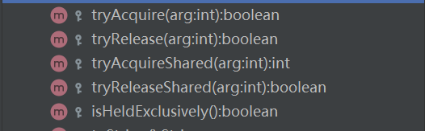
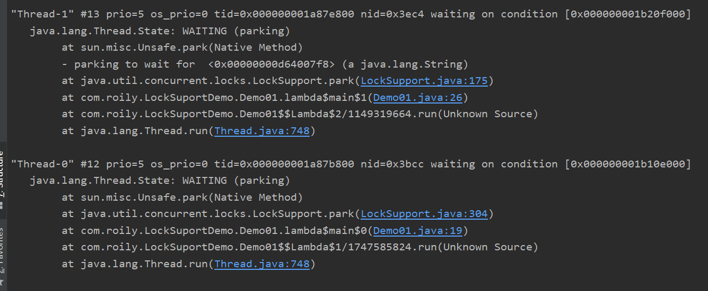

本文学习LockSuport


> 上一章


#### LockSuport简介

aqs可重写方法：



 我们晓得AQS提供了获取共享式锁和获取非共享式锁供同步器实现，以及一些模板方法来实现线程阻塞、自旋和入队，从而控制线程的执行。

AQS对线程的控制依赖于LockSuport，而LockSuport是基于UNSAFE这个非常底层的包的。

  LockSupport是JDK中比较底层的类，用来创建锁和其他同步工具类的基本线程阻塞原语。java锁和同步器框架的核心AQS:AbstractQueuedSynchronizer，就是通过调用LockSupport.park()和LockSupport.unpark()实现线程的阻塞和唤醒的。每个使用LockSupport的线程都会与一个许可关联，如果该许可可用，并且可在线程中使用，则调用park()将会立即返回，否则可能阻塞。如果许可尚不可用，则可以调用 unpark 使其可用。但是注意许可**不可重入**，也就是说只能调用一次park()方法，否则会一直阻塞。


<hr>


#### LockSuport阻塞方法

```java
public static void park()//阻塞当前线程，如果调用unpark方法或者当前线程被中断，从能从park()方法中返回
void park(Object blocker)：//功能同方法1，入参增加一个Object对象，用来记录导致线程阻塞的阻塞对象，方便进行问题排查；
void parkNanos(long nanos)：//阻塞当前线程，最长不超过nanos纳秒，增加了超时返回的特性；
void parkNanos(Object blocker, long nanos)：//功能同方法3，入参增加一个Object对象，用来记录导致线程阻塞的阻塞对象，方便进行问题排查；
void parkUntil(long deadline)：//阻塞当前线程，知道deadline；
void parkUntil(Object blocker, long deadline)：//功能同方法5，入参增加一个Object对象，用来记录导致线程阻塞的阻塞对象，方便进行问题排查；
```

关于blocker，park方法添加obj可以方便出错排查。

使用jps + jstack pid 查看 堆栈信息，注意这边信息倒着看。



没大区别，多了一行wait for obj。


<hr>


#### LockSuport唤醒方法

void unpark(Thread thread):唤醒处于阻塞状态的指定线程


<hr>

#### 例子

每个线程都有唯一许可信息，且许可信息默认是被线程获取，park()方法尝试获取许可信息，unpark()释放许可信息。如果许可信息被占用则需等待许可信息被释放。


这个例子还是很简单的：

```java
class Demo02 {
    public static void main(String[] args) {
        Thread t1 = new Thread(() -> {
            //线程一等待
            System.out.println(Thread.currentThread().getName() + "线程等待");
            LockSupport.park();
            System.out.println(Thread.currentThread().getName() + "线程被唤醒，继续执行");
        });
        Thread t2 = new Thread(() -> {
            //线程而唤醒线程一
            for (int i = 0; i < 10; i++) {
                try {
                    Thread.sleep(500);
                } catch (InterruptedException e) {
                    e.printStackTrace();
                }
            }
            System.out.println(Thread.currentThread().getName()+"尝试唤醒"+t1.getName());
            LockSupport.unpark(t1);

        });
        t1.start();

        t2.start();
    }
}
```


park的线程如果被中断：

如果park线程被中断，会释放许可信息，此时和unpark效果一样，这也是lockInterrupt，可响应中断锁的原理。

```java
public static void main(String[] args) throws InterruptedException {

    Thread t1 = new Thread(() -> {
        //线程一等待
        System.out.println(Thread.currentThread().getName() + "线程等待");
        LockSupport.park();
        System.out.println(Thread.currentThread().getName() + "线程被唤醒，继续执行");

    });


    t1.start();

    //t1.interrupt();

    LockSupport.unpark(t1);

    System.out.println(t1.getState());

}
```

