## JMeter使用


### 安装jdk

> 安装JDK并配置环境

```bash
➜  ~ java -version
openjdk version "1.8.0_352"
OpenJDK Runtime Environment (Zulu 8.66.0.15-CA-macos-aarch64) (build 1.8.0_352-b08)
OpenJDK 64-Bit Server VM (Zulu 8.66.0.15-CA-macos-aarch64) (build 25.352-b08, mixed mode)
```


### 安装JMeter

#### 下载

地址:[JMeter下载地址](https://jmeter.apache.org/download_jmeter.cgi)

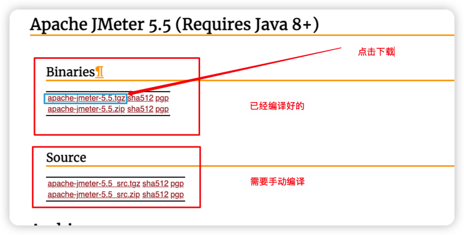

> 将JMeter放在固定目录并解压：

```bash
tar -zxvf apache-jmeter-5.5.tgz

## 我的目录
➜  apache-jmeter-5.5 pwd
/Users/rolyfish/Desktop/software/apache-jmeter-5.5
```


### 运行JMeter

#### 运行


> 进入到bin目录执行一下命令即可执行。

```bash
➜  bin sh jmeter
```

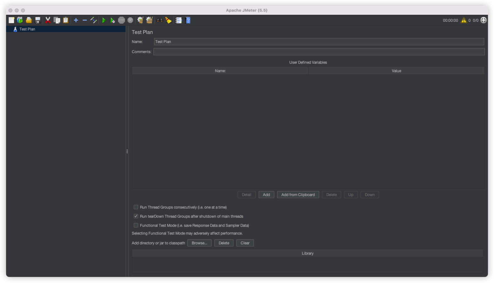

#### 配置中文

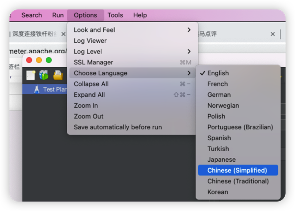

#### 为JMeter配置环境

```bash
➜  bin cd ~/
➜  ~ vim .zshrc
```

```shell
export JMETER_HOME=/Users/rolyfish/Desktop/software/apache-jmeter-5.5
export PATH=$JAVA_HOME/bin:$PATH:.:$JMETER_HOME/bin:$PATH
export CLASSPATH=.:$JAVA_HOME/lib/dt.jar:$JAVA_HOME/lib/tools.jar:$JMETER_HOME/lib/ext/ApacheJMeter_core.jar:$JMETER_HOME/lib/jorphan.jar:$JMETER_HOME/lib/logkit-2.0.jar
```

> 经过以上配置即可在终端任意位置运行JMeter


### 简单使用


#### 创建线程组

线程组用来模拟用户。一个线程组模块可以包含多个线程，每个线程代表一个用户，这样可以模拟高并发下的请求，并根据网站的响应信息来判断网站的相关性能。

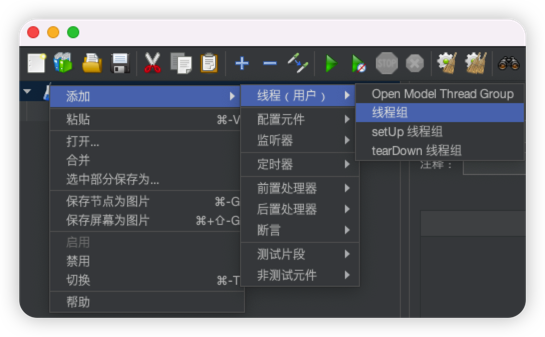

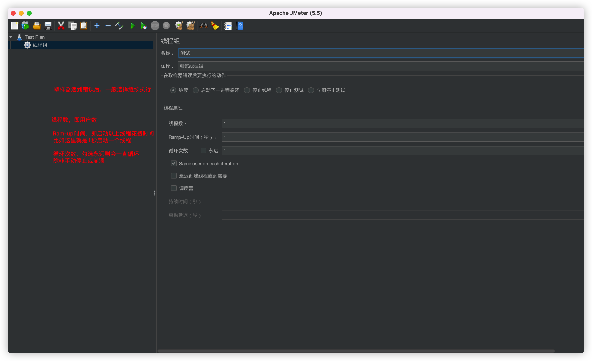


#### 创建HTTP请求

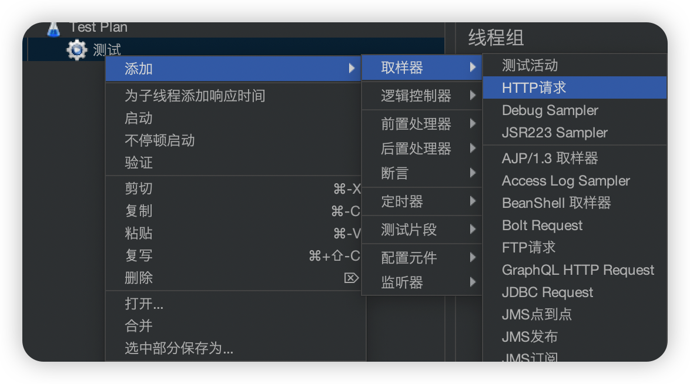

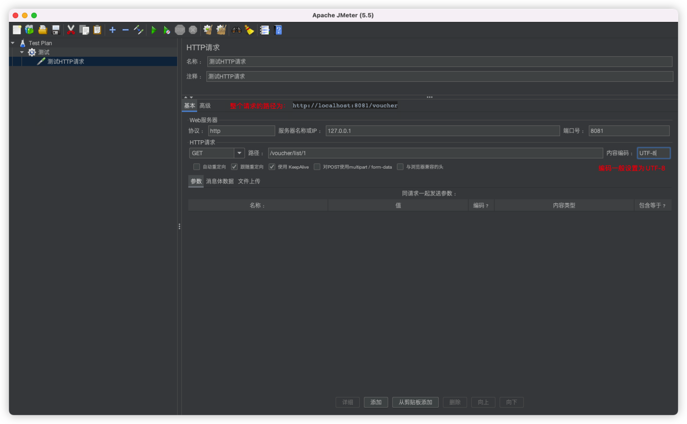

#### 添加结果树deng

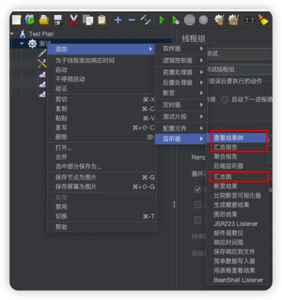

#### 模拟一个请求并查看结果

> 300个线程在2秒内启动完

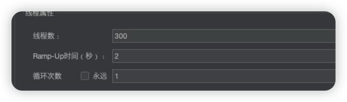

> 查看结果数

乱码问题：

一、添加后置处理器设置编码`prev.setDataEncoding("utf-8");`

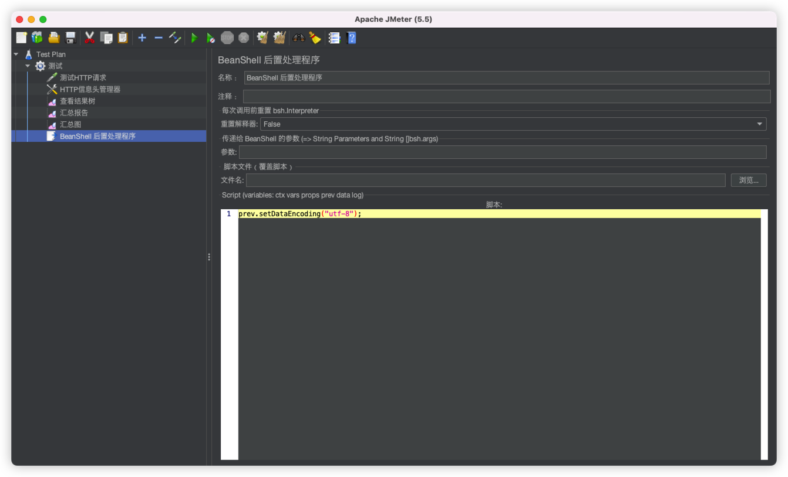

二、修改配置文件

配置文件路径：`/Users/rolyfish/Desktop/software/apache-jmeter-5.5/bin/Jmeter.properties`

设置：`sampleresult.default.encoding=UTF-8`

vim搜索命令  /encoding   搜索n下一个

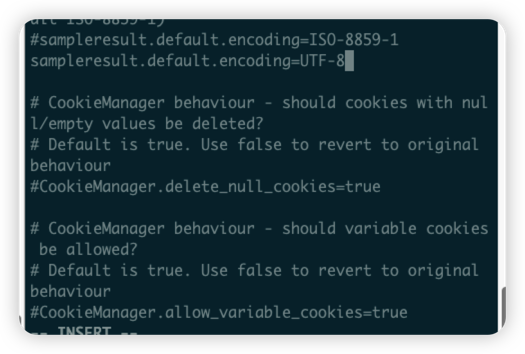

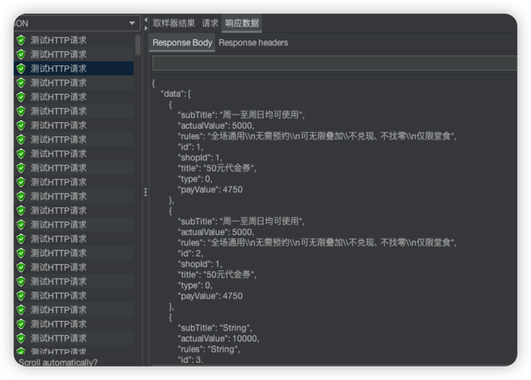


### 其他

GET请求携带参数请求：

