本文学习swagger的使用。


> [xxxxx]()


#### swagger简介

​	swagger是一个api文档生成工具。

> 其作用有：

- 生成api文档(包括方法、类、参数)
- 简单单元测试
- 描述信息标注于代码上有助于代码理解，有助于协同开发

- 有助于前后端及时交流

> 出现原因

- 以前写api文档可能都是word文件，不能及时更新，造成前后端交流障碍。

- 对于简单单元测试，用其他工具(比如Postman、Postwoman)没必要，而swagger对于简单单元测试使用成本很低。


#### SpringBoot集成Swagger

前提：Jdk版本1.8+,应该都是吧。

##### 依赖

版本用最新的，很久没更新了.....

```xml
<dependency>
    <groupId>io.springfox</groupId>
    <artifactId>springfox-swagger2</artifactId>
</dependency>
<dependency>
    <groupId>io.springfox</groupId>
    <artifactId>springfox-swagger-ui</artifactId>
</dependency>
```

关于Swagger-annocations（注解）,swagger默认是1.5.20的，如果你想用新的，可以自行导入新的。

```xml
<dependency>
    <groupId>io.swagger.core.v3</groupId>
    <artifactId>swagger-annotations</artifactId>
    <version>2.1.13</version>
</dependency>
```

其他的依赖也记得加，swagger依赖mvc，所以所web的启动器也得加。


##### 基本使用

> 配置类

```java
//开启swagger注解支持
@EnableSwagger2
//声明配置类
@Configuration
public class GlobalConfig {

}
```

启动项目，访问`http://localhost:8080/swagger-ui.html`

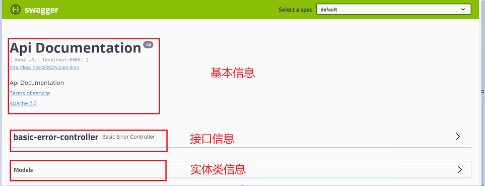

这是SpringBoot提供的默认的接口和实体。

<hr>

##### 配置swagger

- Swagger实例Bean是Docket，所以通过配置Docket实例来配置Swaggger。

- 通过apiInfo()属性配置文档信息

```java
@Bean //配置docket以配置Swagger具体参数
    public Docket docket() {

        return new
                Docket(DocumentationType.SWAGGER_2)
                .apiInfo(apiInfo());
}
//配置文档信息
private ApiInfo apiInfo() {
    Contact contact =
            new Contact("RoilyFish", "http://RoilyFish.com/联系人访问链接", "1056819225@qq.com");
    return new ApiInfo(
            "Swagger基本使用", // 标题
            "测试如何配置Swagger文档信息", // 描述
            "v1.0.0", // 版本
            "http://xxx.xxx", // 组织链接
            contact, // 联系人信息
            "RoilyFish---许可信息", // 许可
            "Link许可链接", // 许可连接
            new ArrayList<>()// 扩展
    );
}
```

- 写一个自己的Controller和Entity

```java
@RestController
public class SwaggerController {

    @RequestMapping(value = "/tets",method = RequestMethod.POST)
    public void testController(String str){
    }
}
```

我这里创建了两个实体类，只有User在Controller里用过。

```java
@Data
public class User {
    private String name;
    private Integer age;
}
@Data
public class Address {
    private String address;
}
```

> 重启测试

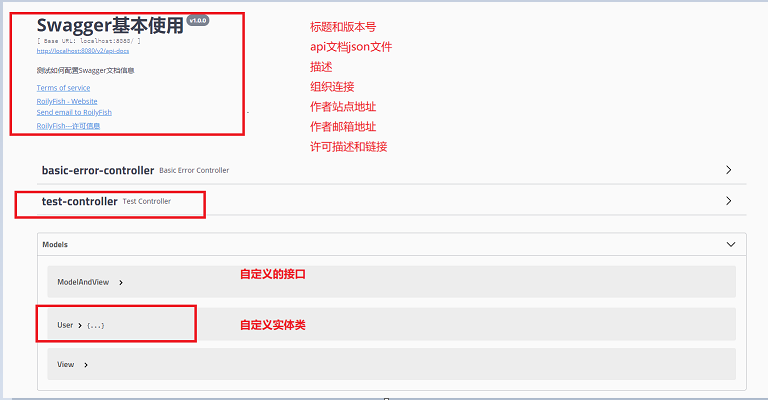

所有信息如标注。可以发现：

- 接口的话swagger默认扫描全部
- 实体只会扫描到被使用到的


##### 配置扫描接口

> 配置我们想展示的接口。配置com.example.demo包下的接口都被扫描。

```java
@Bean //配置docket以配置Swagger具体参数
public Docket docket() {

    return new
            Docket(DocumentationType.SWAGGER_2)
            .apiInfo(apiInfo())
            .select()
            .apis(RequestHandlerSelectors.basePackage("com.example.demo"))
            .build();
}
```

> 重启测试：

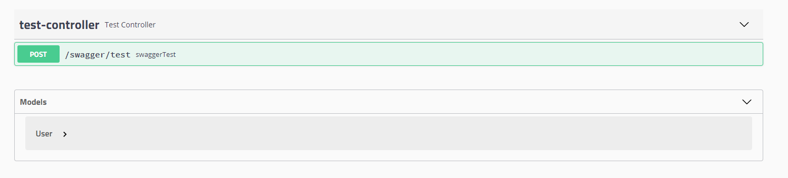

> 关于RequestHandlerSelectors的可配置选项

```java
//扫描所有，也是默认选项
public static Predicate<RequestHandler> any() {}
//不扫描
public static Predicate<RequestHandler> none() {}
//扫描标注指定注解的方法 比如withMethodAnnotation(GetMapping.class)只扫描get请求
public static Predicate<RequestHandler> withMethodAnnotation(final Class<? extends Annotation> annotation) {}
//扫描标志指定注解的类  比如withClassAnnotation(Controller.class)
public static Predicate<RequestHandler> withClassAnnotation(final Class<? extends Annotation> annotation) {}
```


##### swagger开关配置

> 同过Docket.enable()来控制是否启用swagger，比如我们设置两套环境dev、pro在开发环境开启，在生产环境关闭。

yml配置：

```yml
##静态参数配置
custom:
  swagger:
    ##开启swagger
    enableSwagger: true
```

引用yml配置的两种方式：

```java
@EnableSwagger2
//声明配置类
@Configuration
public class GlobalConfig {
    @Value("${custom.swagger.enableSwagger}")
    boolean enableSwagger;
    
    @Bean //配置docket以配置Swagger具体参数
    public Docket docket() {
        return new
                Docket(DocumentationType.SWAGGER_2)
                .apiInfo(apiInfo())
                .enable(enableSwagger)
                    .select()
                    .apis(RequestHandlerSelectors.basePackage("com.example.demo"))
                .build();
    }
}
```


另外的方式：

利用Profiles工具设置哪些环境下可以访问swagger，比如说dev和test下可以访问。

```java
//设置哪些环境下可以访问swagger
Profiles of = Profiles.of("dev", "test");
boolean enable = environment.acceptsProfiles(of);
```


##### 配置Api分组

我们可以注入多个Docket。

这里就注入两个Docket分别属于RoilyFish和yyc分组。

比如一个模块有多人开发就可以分别设置分组。

```java
@Bean //配置docket以配置Swagger具体参数
public Docket docket(Environment environment) {
    return new
            Docket(DocumentationType.SWAGGER_2)
            .apiInfo(apiInfo())
            .enable(enableSwagger)
            .groupName("RoilyFish")
                .select()
                .apis(RequestHandlerSelectors.basePackage("com.example.demo"))
            .build()
            ;
}
@Bean //配置docket以配置Swagger具体参数
public Docket docketYYC(Environment environment) {
    return new
            Docket(DocumentationType.SWAGGER_2)
            .apiInfo(apiInfo())
            .enable(enableSwagger)
            .groupName("yyc")
                .select()
                .apis(RequestHandlerSelectors.basePackage("com.example.demo"))
            .build();
}
```

> 重启测试      右上角就可以选择分组。

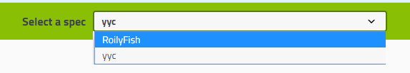


至此swagger的基本使用就差不多了，swagger会自动去扫描controller和实体，但是我们得去详细描述接口和实体啊，所以接下来就尝试使用具体注解去配置接口和实体。


<hr>


#### 详细使用

##### @APi

作用于类上，也就是Controller，标注该类为swagger资源API。

几个常用属性：

```java
//这个属性不知道是不是被弃用了，我设置是没有效果的
String value() default "";
//设置被标注的类属于哪个标签。可设置多个
String[] tags() default "";
//该属性虽被标注弃用，但不影响使用。对被标注的类进行描述
@Deprecated String description() default "";
//设置被标注的类在API资源表中的等级，如果等级一样则以首字母排序
@Deprecated int position() default 0;
//设置是否隐藏该api
boolean hidden() default false;
```

使用：

比如说这里有两个API：

```java
@Api(tags = {"TestController"}, description = "排序关于", position= 0)
@RestController
public class TestController {
    @RequestMapping(value = "/swagger/test",method = RequestMethod.POST)
    public String query(@RequestBody User user){
        //doQuery
        return JSON.toJSONString(user);
    }
}

@Api(tags = {"AboutUserController"}, description = "用户相关API",position=1)
@RestController
public class AboutUserController {
    @RequestMapping(value = "/swagger/test2",method = RequestMethod.POST)
    public String swaggerTest(@RequestBody User user){
        return JSON.toJSONString(user);
    }
}
```

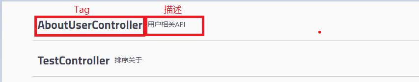

这个排序也没起作用，兼容性越来越差了。


##### @ApiPoeration

作用于接口上，对接口进行说明。

```java
@ApiOperation(
    //对接口进行描述
    value = "swagger测试",
    //接口的详细描述
    notes = "swaggerTest的冗余描述，用于对接口的详细描述",
    //将接口归总到指定的tag
    tags = {"TestController"},
    //响应类型
    response = String.class,
    //请求类型
    httpMethod = "POST",
    //是否隐藏
    hidden = true)
```

常用：就给对应的接口做个说明

```java
@RequestMapping(value = "/swagger/test2", method = RequestMethod.POST)
@ApiOperation(value = "swagger测试")
public String swaggerTest(@RequestBody User user) {

    return JSON.toJSONString(user);
}
```


##### @ApiModel & @ApiModelProperty

作用于实体类，对实体类进行描述。可以识别泛型。

> @ApiMode

```java
//实体显示字段
String value() default "";
//对实体进行描述
 String description() default "";
//可以设置父类，不设置对于存在继承的子类不会显示父类字段
Class<?> parent() default Void.class;
```

> @ApiModelProperty

```java
//对字段进行描述
String value() default "";
//是否必须
boolean required() default false;
//可以设置排序，默认按字母排序，如果存在父类的话，顺序不太友好
int position() default 0;
//是否隐藏
boolean hidden() default false;
//例子，用于测试
String example() default "";
```

别的也没用。

```java
//父类
@ApiModel(value = "Base",description = "基类")
@Data
public class Base {
    @ApiModelProperty(value = "父类属性",position = 1)
    private String value;
}

//子类
@ApiModel(value = "Address", description = "地址", subTypes = Base.class)
@Data
public class Address extends Base {
    @ApiModelProperty(value = "地址" example = "xxxxx",require = true)
    private String address;
    @ApiModelProperty(value = "附加信息")
    private String zDes;
}
```

- 父类设置  position = 1.。将父类属性放于尾部。
- 子类的value，描述都有，如果说设置了require = true的话，属性后会追加星号
- 同时该模型（实体）,必须出现在参数或返回值。

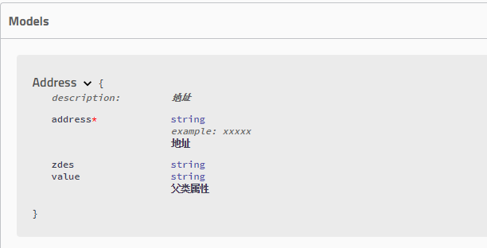


##### @ApiParam

对请求参数说明。

```java
//参数显示
String name() default "";
//参数描述
String value() default "";
```

```java
@ApiParam(name = "addressxxx",value = "请求参数说明")
```

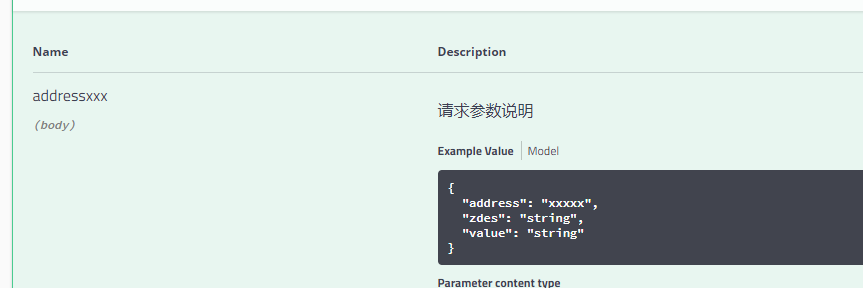


#### swagger单元测试

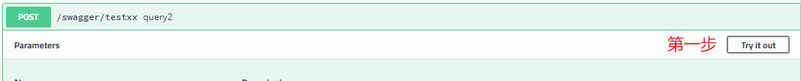


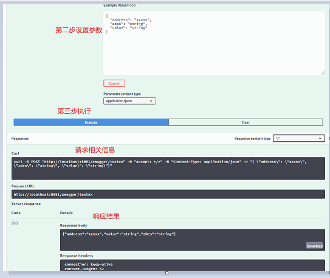


#### swagger换肤

> 修改swagger默认皮肤

```xml
<dependency>
    <groupId>com.github.xiaoymin</groupId>
    <artifactId>swagger-bootstrap-ui</artifactId>
    <version>1.9.6</version>
</dependency>
```

bootstrap的。

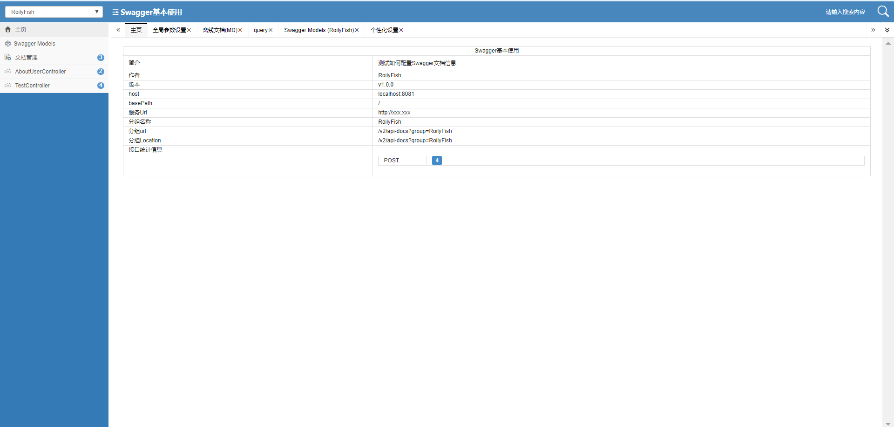

其他的比如说lay-ui的基本都差不多，可以理解为对swagger的增强。


#### 关于兼容性问题


由于Swagger很久没更新，与Boot的兼容性越来越差，在springboot2.6.X版本整合swagger就会出现问题。

这里具体原因不清楚，也没必要清楚，大概就是和web启动器相关配置冲突。

我这里尝试了一下。

依赖：

- 这里用的SpringBoot2.6.6版本是一个通用稳定版本。

- 这里升级一下swagger-annocation。

- springfox包含了swagger 和swagger-ui.

```xml
<spring-boot-starter.version>2.6.6</spring-boot-starter.version>
<spring-boot-starter-web.version>2.6.6</spring-boot-starter-web.version>
<spring-boot-starter-test.version>2.6.6</spring-boot-starter-test.version>
<dependency>
    <groupId>org.springframework.boot</groupId>
    <artifactId>spring-boot-starter</artifactId>
    <version>${spring-boot-starter.version}</version>
</dependency>

<dependency>
    <groupId>org.springframework.boot</groupId>
    <artifactId>spring-boot-starter-web</artifactId>
    <version>${spring-boot-starter-web.version}</version>
</dependency>

<dependency>
    <groupId>org.springframework.boot</groupId>
    <artifactId>spring-boot-starter-test</artifactId>
    <version>${spring-boot-starter-test.version}</version>
    <scope>test</scope>
</dependency>
<dependency>
    <groupId>io.swagger.core.v3</groupId>
    <artifactId>swagger-annotations</artifactId>
    <version>2.1.13</version>
</dependency>
<dependency>
    <groupId>io.springfox</groupId>
    <artifactId>springfox-boot-starter</artifactId>
    <version>3.0.0</version>
</dependency>
```

配置：

@EnableSwagger2
@EnableOpenApi

都可以，配一个

```java
//@EnableSwagger2
@EnableOpenApi
@EnableWebMvc
@Configuration
public class GloableConfig implements WebMvcConfigurer {
}
```

其他就和swagger一样配置就好。


##### 路径问题

访问这个路径是没有问题的`http://localhost:8880/swagger-ui/index.html`


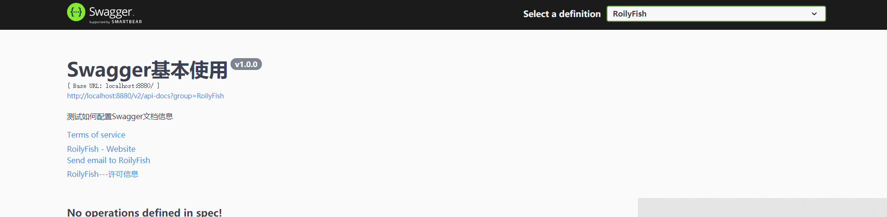


但是这个路径就不行了`http://localhost:8880/swagger-ui.html`

我也大概了解了一下。

这个是springfox.springfox-swagger-ui下的，index.html就是swagger主页面，这里可能映射不到，我尝试使用处理器去手动映射它但是其他的css就没见了，不想浪费时间就算了。

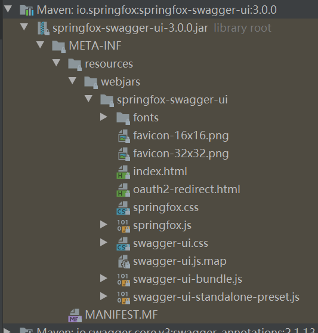

