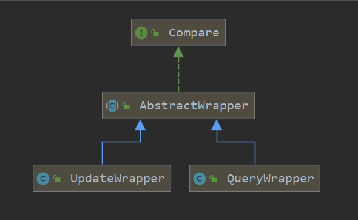

本文学习mp的条件构造器。

> [xxxx]()


#### Wrapper

构造查询\更新条件，用于拼接sql语句。这个原理就不用了解了，会用就行。


条件构造器相关类图（部分）



- Compare 比较器  
- AbstractWrapper 为UpdateWrapper&QueryWrapper父类
- UpdateWrapper  更新条件构造
- QueryWrapper 查询条件构造器


官网上有这么一句话：注意: entity 生成的 where 条件与 使用各个 api 生成的 where 条件**没有任何关联行为**

啥意思呢？

我们在学mp注解时不是遇到TableField里的whereStrategy属性嘛，这是只用于实体查询，优先级很低，无论是wrapper还是xml配置文件的条件都比他优先级高。

```java
@TableField(whereStrategy = FieldStrategy.NOT_EMPTY)
```


<hr>


#### Compare

这个接口定义了比较方法。AbstractWrapper实现。

首先Compare类下的方法都有一个首个参数是Boolean的重载，是一个是否加入sql语句的判断条件。


##### 先了解一下这个实体比较

@TableField(whereStrategy = FieldStrategy.NOT_EMPTY)

例子：

```java
public void test01(){
    QueryWrapper<User2> wrapper = new QueryWrapper<>(User2.builder()
            .name("").build());
    List<User2> users = userMapper.selectList(wrapper);
    users.forEach(System.out::println);
}
```

如果不加生成的sql为：

```sql
SELECT id,name,email,deleted,version,create_time,update_time,tb_user_test_colum FROM user WHERE name=? AND version=? AND deleted=0 ORDER BY id ASC
```

添加非空判断：

```java
@TableField(whereStrategy = FieldStrategy.NOT_EMPTY)
private String name;
```

生成的sql为：

```sql
SELECT id,name,email,deleted,version,create_time,update_time,tb_user_test_colum FROM user WHERE version=? AND deleted=0 ORDER BY id ASC
```

也就是：

```xml
<if test=" name!='' ">
	and name = #{name}
</if>
```


##### allEq

api:

```java
//常用  会调用其它重载
default <V> Children allEq(Map<R, V> params);
default <V> Children allEq(Map<R, V> params, boolean null2IsNull);
<V> Children allEq(boolean condition, Map<R, V> params, boolean null2IsNull);
```

 allEq(boolean condition, Map<R, V> params, boolean null2IsNull);

- condition   执行条件
- map   查询条件
- null2IsNull    是否参数为 null 自动执行 isNull 方法, false 则忽略这个字段

例子：

```java
@Test
public void test02() {
    QueryWrapper<User2> wrapper = new QueryWrapper<>();
    Map<String, Object> map = new HashMap<>();
    map.put("name", "xx");
    wrapper.allEq(!StringUtils.isEmpty((CharSequence)map.get("name")),map,true);
    List<User2> users = userMapper.selectList(wrapper);
    users.forEach(System.out::println);
}
```

当name属性为空时不拼接sql（包括后面的isNill判断）

也就是：

```xml
<if test=" name!='' ">
	and name = #{name}
</if>
```


##### eq

```java
// column 为数据库字段   val为比较条件    and column = #{val}
Children eq(boolean condition, R column, Object val);
default Children eq(R column, Object val) {
    return eq(true, column, val);
}
```

和Alleq类似。


##### ne

```java
Children eq(boolean condition, R column, Object val);
default Children ne(R column, Object val) {
    return ne(true, column, val);
}
```


##### gt & lt&ge&le

greater than  >

less than       <

greater than equals   >=

less than equals  <=

```java
gt(R column, Object val)
gt(boolean condition, R column, Object val)
```


##### between  & not between

```java
default Children between(R column, Object val1, Object val2) {
    return between(true, column, val1, val2);
}
Children between(boolean condition, R column, Object val1, Object val2);
default Children notBetween(R column, Object val1, Object val2) {
    return notBetween(true, column, val1, val2);
}
Children notBetween(boolean condition, R column, Object val1, Object val2);
```

- BETWEEN val1AND val2
- not BETWEEN val1AND val2


##### like & not like

```java
default Children like(R column, Object val) {
    return like(true, column, val);
}
Children like(boolean condition, R column, Object val);
default Children notLike(R column, Object val) {
    return notLike(true, column, val);
}
Children notLike(boolean condition, R column, Object val);
```


##### isNull  &  isNotNull

```java
default Children isNull(R column) {
    return isNull(true, column);
}
Children isNull(boolean condition, R column);
default Children isNotNull(R column) {
    return isNotNull(true, column);
}
Children isNotNull(boolean condition, R column);
```

- column  is  null 
- column  is  not   null 

isNull可以和allEq替换。

```java
wrapper.allEq(StringUtils.isEmpty((CharSequence)map.get("name")),map,true);
```


##### in & notIn

```java
default Children in(R column, Collection<?> coll) {
    return in(true, column, coll);
}
/**
 * 字段 IN (value.get(0), value.get(1), ...)
 * <p>例: in("id", Arrays.asList(1, 2, 3, 4, 5))</p>
 * <li> 注意！集合为空若存在逻辑错误，请在 condition 条件中判断 </li>
 * <li> 如果集合为 empty 则不会进行 sql 拼接 </li>
 */
Children in(boolean condition, R column, Collection<?> coll);
default Children in(R column, Object... values) {
    return in(true, column, values);
}
Children in(boolean condition, R column, Object... values);
default Children notIn(R column, Collection<?> coll) {
    return notIn(true, column, coll);
}
Children notIn(boolean condition, R column, Collection<?> coll);
default Children notIn(R column, Object... value) {
    return notIn(true, column, value);
}
Children notIn(boolean condition, R column, Object... values);
```

注意！集合为空若存在逻辑错误，请在 condition 条件中判断

```java
List<Long> ids = new ArrayList<Long>();
ids.add(1L);
ids.add(2L);
ids.add(3L);
ids.add(4L);
wrapper.in(!ids.isEmpty(),"id",ids);
```


#####  inSql  & notInSql

```java
default Children inSql(R column, String inValue) {
    return inSql(true, column, inValue);
}
Children inSql(boolean condition, R column, String inValue);
default Children notInSql(R column, String inValue) {
    return notInSql(true, column, inValue);
}
Children notInSql(boolean condition, R column, String iValue);
```

例1: notInSql("id", "1, 2, 3, 4, 5, 6")

例2: notInSql("id", "select id from table where id &lt; 3")


##### groupBy

需要配合wrapper.select();

```java
@Test
public void test05() {
    QueryWrapper<User2> wrapper = new QueryWrapper<>();
    wrapper.select(" id  , name , count(*) as xx ");
    wrapper.groupBy("name","id");
    List<User2> users = userMapper.selectList(wrapper);
    users.forEach(System.out::println);
}
```


#####  orderByAsc  & orderByDesc  & orderBy


##### having


##### fun

```java
default Children func(Consumer<Children> consumer) {
    return func(true, consumer);
}
Children func(boolean condition, Consumer<Children> consumer);
```

Comsumer是一个函数式接口。使用lambda表达式实现。

```java
@FunctionalInterface
public interface Consumer<T> {
    void accept(T t);
}
```

之前我们使用condition   来判断是否加入sql拼接，很不好，用这个就好很多。

例子：

```java
@Test
public void test06() {
    QueryWrapper<User2> wrapper = new QueryWrapper<>();
    Map<String, Object> map = new HashMap<>();
    map.put("name","");
    wrapper.func((t)->{
        if (!StringUtils.isEmpty((String)map.get("name"))){
            t.eq("name",map.get("name"));
        }
        t.eq("email","zxxxx");
    });
    List<User2> users = userMapper.selectList(wrapper);
    users.forEach(System.out::println);
}
```

##### or & and

or   Api

```JAVA
default Children or() {
    return or(true);
}

Children or(boolean condition);

//可嵌套or
Children or(boolean condition, Consumer<Param> consumer);
default Children nested(Consumer<Param> consumer) {
    return nested(true, consumer);
}
```

and api

```java
default Children and(Consumer<Param> consumer) {
    return and(true, consumer);
}
Children and(boolean condition, Consumer<Param> consumer);
```


##### nested

- 正常嵌套 不带 AND 或者 OR
- 例: `nested(i -> i.eq("name", "李白").ne("status", "活着"))`--->`(name = '李白' and status <> '活着')`


##### apply

拼接sql，会自动补全add，{0}表示第一个参数。

```java
wrapper.apply( " 1 = {0} ", 1);
```


##### last

拼接到最后


##### exists & notExists

判断子查询是否有记录。

```java
wrapper.exists(" (select id from user) ");
```


##### select

api

```java
Children select(R... columns);
default Children select(Predicate<TableFieldInfo> predicate) {
    return select(null, predicate);
}
Children select(Class<T> entityClass, Predicate<TableFieldInfo> predicate);
```

Predicate是一个函数式接口

```java
@FunctionalInterface
public interface Predicate<T> {
    boolean test(T t);
}
```

```java
//查询 id email name
wrapper.select(" id ,email ", "name");
//查询所有字段
wrapper.select(User2.class, tableFieldInfo -> true);
```


##### set

```java
default Children set(R column, Object val) {
    return set(true, column, val);
}
default Children set(boolean condition, R column, Object val) {
    return set(condition, column, val, null);
}
default Children set(R column, Object val, String mapping) {
    return set(true, column, val, mapping);
}
Children set(boolean condition, R column, Object val, String mapping);
```

 

##### setSql

```java
setSql(String sql)
```


##### 总结

简单使用这个行，复杂的话就用xml吧。这个吊东西自定义结果集不太行。


