本文总结`Mybatis`的配置详情和基本使用。

> `Mybatis`是为数不多的跟着官网学习，就能学明白的，建议多看看官方文档。
>
> 传送门:[Mybatis官网](https://mybatis.org/mybatis-3/zh/index.html)
>
> [<上一章]()   ||   [下一章>]()

#### mybatis基本使用

##### 引入依赖

`junit、mysql-conn、mybatis`

```xml
<dependency>
    <groupId>junit</groupId>
    <artifactId>junit</artifactId>
    <version>4.12</version>
    <scope>test</scope>
</dependency>

<dependency>
    <groupId>mysql</groupId>
    <artifactId>mysql-connector-java</artifactId>
    <version>8.0.28</version>
</dependency>

<dependency>
    <groupId>org.mybatis</groupId>
    <artifactId>mybatis</artifactId>
    <version>3.5.7</version>
</dependency>
```

##### 创建mybatis配置文件

`mybatis-config.xml`，配置文件名随意

去官网复制配置

配置写死：`driver url username password  `写死

```xml
<?xml version="1.0" encoding="UTF-8" ?>
<!DOCTYPE configuration
  PUBLIC "-//mybatis.org//DTD Config 3.0//EN"
  "http://mybatis.org/dtd/mybatis-3-config.dtd">
<configuration>
  <environments default="development">
    <environment id="development">
      <transactionManager type="JDBC"/>
      <dataSource type="POOLED">
          <property name="driver" value="com.mysql.cj.jdbc.Driver"/>
          <property name="url" value="jdbc:mysql://localhost:3306/mybatis_plus?useUnicode=true&amp;charactEncoding=utf8&amp;useSSL=true"/>
          <property name="username" value="root"/>
          <property name="password" value="123456"/>
      </dataSource>
    </environment>
  </environments>
  <mappers>
   // <mapper resource="org/mybatis/example/BlogMapper.xml"/>
  </mappers>
</configuration>
```

测试：

```java
@Test
public void testConn() throws IOException {
    InputStream in = Resources.getResourceAsStream("mybatis-config.xml");
    SqlSessionFactory sqlSessionFactory = new SqlSessionFactoryBuilder().build(in);
    SqlSession sqlSession = sqlSessionFactory.openSession();
    System.out.println(sqlSession);
    System.out.println(sqlSession.getConnection());
}
```

结果:

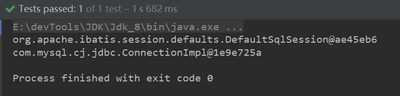

> 可以获取连接，没问题。

##### 封装mybatis工具类

```java
public class mybatisUtil {
    private static SqlSessionFactory sqlSessionFactory;
    static {
        try {
            InputStream in = Resources.getResourceAsStream("mybatis-config.xml");
            Properties prop = new Properties();
            prop.load(in);
            sqlSessionFactory = new SqlSessionFactoryBuilder().build(in);
        } catch (IOException e) {
            e.printStackTrace();
        }
    }
    public static SqlSession OpenSqlSession() {
        return sqlSessionFactory.openSession();
    }
}
```

测试：

```java
@Test
public void testConn2() throws IOException {
    SqlSession sqlSession = mybatisUtil.OpenSqlSession();
    System.out.println(sqlSession);
    System.out.println(sqlSession.getConnection());
}
```

结果:

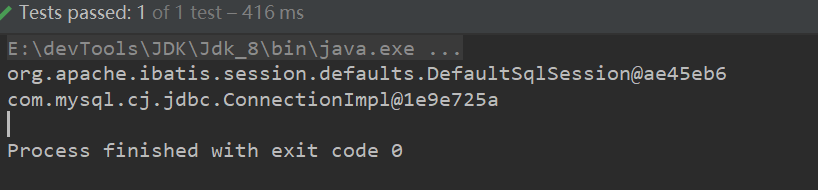

> 也是没有问题的。
>
> 我们现在先走一便流程，之后在了解`sqlsession  sqlsessionFactory  sqlsessionFactoryBuilder`这三个类。


##### 创建实体类


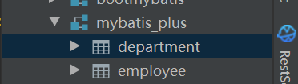


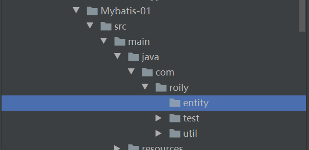

> 鼠标右击表，按步骤可利用`idea`快速创建实体类。

> 对应数据类型转化一下

```java
@Data
@Builder
@AllArgsConstructor
@NoArgsConstructor
public class Department {
  private long deptId;
  private String deptName;
  private long delete;
  private Date createTime;
  private Date modifyTime;
}
```

##### 创建mapper接口（也可以是dao）

> 创建mapper接口，并定义测试方法

```java
public interface DepartmentMapper {
    //查询所有记录
    List<Department> queryBatch();
}
```

##### 编写mapper配置文件

> 说明：一切静态文件都尽量放在`resources`下，`maven`约定大于配置。

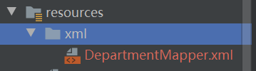


```xml
<?xml version="1.0" encoding="UTF-8"?>
<!DOCTYPE mapper
        PUBLIC "-//mybatis.org//DTD Mapper 3.0//EN"
        "http://mybatis.org/dtd/mybatis-3-mapper.dtd">
<mapper namespace="com.roily.mapper.DepartmentMapper">
    <select id="queryBatch" resultType="com.roily.entity.Department">
        select * from department
    </select>
</mapper>
```

> 先走流程，`namespace`命名空间不要错,指向对应的接口(`mapper`)。

`mybatis-config.xml`添加配置：添加`mapper`扫描。

```xml
<!-- sql mapper(sql映射文件)的位置-->
<mappers>
        <mapper resource="xml/DepartmentMapper.xml"/>
</mappers>
```

测试：

```java
@Test
public void testConn3() throws IOException {
    SqlSession sqlSession = mybatisUtil.OpenSqlSession();
    DepartmentMapper mapper = sqlSession.getMapper(DepartmentMapper.class);
    List<Department> departments = mapper.queryBatch();
    for (Department department : departments) {
        System.out.println(department);
    }
}
```


问题：如果`mapper.xml`放在`Sources`目录下，也就是`java`文件夹下。

比如和`mapper`接口放一起。

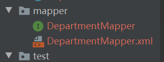

修改配置：

```xml
<mapper resource="com/roily/mapper/DepartmentMapper.xml"/>
```

测试：

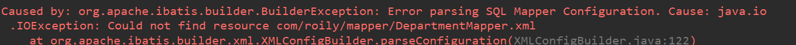

> `io`错误，找不到目标文件。

> 看编译后的`target`文件加下，对应目录真的没有`mapper.xml`配置文件。
>
> 原因：`maven`静态资源过滤问题。

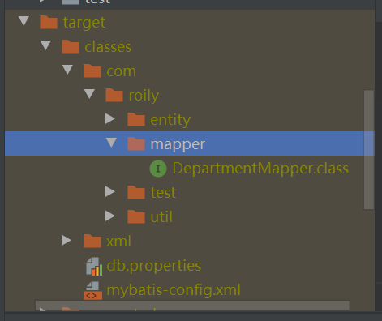

解决：配置`maven`忽略`xml` 静态资源过滤。

```xml
<build>
    <resources>
        <resource>
            <directory>src/main/resources</directory>
            <includes>
                <include>**/*.properties</include>
                <include>**/*.xml</include>
            </includes>
            <filtering>true</filtering>
        </resource>
        <resource>
            <directory>src/main/java</directory>
            <includes>
                <include>**/*.properties</include>
                <include>**/*.xml</include>
            </includes>
            <filtering>true</filtering>
        </resource>
    </resources>
</build>
```

> 修改`pom.xml`配置，意思就是忽略`java、properties`路径下的配置文件过滤。

测试：


唉，又有问题，时间转化不了。

解决：`mybatis`是默认关闭驼峰命名的，所以我们得开启

源码在：`org.apache.ibatis.builder.xml.XMLConfigBuilder `258行(版本差异若有不同)

```java
configuration.setMapUnderscoreToCamelCase(booleanValueOf(props.getProperty("mapUnderscoreToCamelCase"), false));
```

> 添加配置`settings`,开启驼峰命名规则

```xml
<settings>
    <setting name="mapUnderscoreToCamelCase" value="true"/>
</settings>

```

结果：

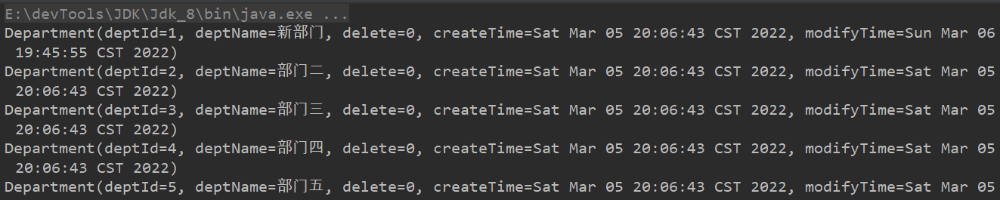


#### 使用mybatis  CRUD

##### 测试环境搭建

数据库表：`department`

```sql
CREATE TABLE `department` (
  `deptId` INT(10) NOT NULL AUTO_INCREMENT COMMENT '部门id',
  `deptName` VARCHAR(10) NOT NULL COMMENT '部门名称',
  `delete` TINYINT(4) NOT NULL DEFAULT '0' COMMENT '逻辑删除字段',
  `create_time` DATETIME NOT NULL DEFAULT CURRENT_TIMESTAMP COMMENT '插入时间',
  `modify_time` DATETIME NOT NULL DEFAULT CURRENT_TIMESTAMP COMMENT '修改时间',
  PRIMARY KEY (`deptId`)
) ENGINE=INNODB AUTO_INCREMENT=33 DEFAULT CHARSET=utf8
```

依赖：同上加一个`junit`

```xml
<dependency>
    <groupId>junit</groupId>
    <artifactId>junit</artifactId>
    <version>4.12</version>
</dependency>
```

数据库配置文件：(使用外部配置文件，不写死)

```properties
driver=com.mysql.cj.jdbc.Driver
url=jdbc:mysql://localhost:3306/mybatis_plus?useUnicode=true&charactEncoding=utf8&useSSL=true
username=root
password=123456
###额外的配置自行添加
```

`mybatis`配置文件：`mybatis-config.xml`

1. `properties`标签，引入外部数据库配置文件。

2. 添加设置：日志、驼峰命名
3. 别名（①指定类、②扫描包，包下的实体类别名都是小写）

```xml
<properties resource="db.properties">
</properties>
<settings>
    <setting name="mapUnderscoreToCamelCase" value="true"/>
    <setting name="logImpl" value="STDOUT_LOGGING"/>
</settings>
<typeAliases>
        <package name="com.roily.entity"/>
</typeAliases>
<environments default="dev1">
    <environment id="dev1">
        <transactionManager type="JDBC"/>
        <dataSource type="POOLED">
            <property name="driver" value="${driver}"/>
            <property name="url" value="${url}"/>
            <property name="username" value="${username}"/>
            <property name="password" value="${password}"/>
        </dataSource>
    </environment>
</environments>

```

> 关于配置简单提一下，驼峰一定得加、日志可以是`Log4J`后面我们配一下。
>
> 别名建议使用`package`,配置类名首字母为小写为别名。
>
> 环境：可以配置多套数据源，但需要指定`default`。使用`$  EL`表达式取值，方便维护。事务管理配置指定用`JDBC`的，另一个`MANAGED`不够友好，会自动关闭连接，对于后面容器框架是很不好的。
>
> 目前就这么配。

`mapper.xml`配置

##### 查询

`mapper`接口

```java
//查询所有记录
List<Department> queryBatch2();
```

`mapper.xml`配置

由于我们配置了实体类的别名，这里可以直接类名首字母小写即可。

```xml
<select id="queryBatch2" resultType="department">
    select * from department
</select>
```

测试：

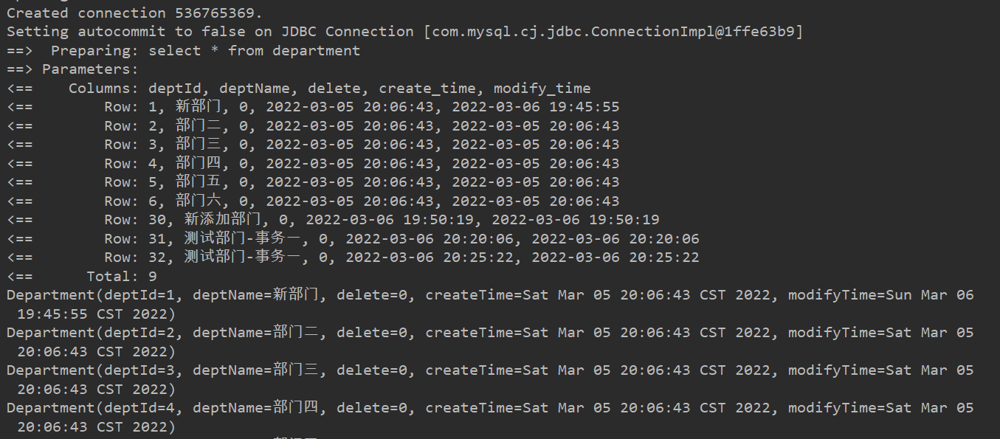

> 配置了日志，有详细的获取连接，和获取结果集得过程。


##### 条件查询

`mapper`接口

```java
//根据id查询
Department queryById(@Param("id") Integer id);
```

> 简单数据类型都加上`@Param()`  `int`、`String`。。。

`mapper.xml`配置文件

```xml
<select id="queryById" parameterType="integer" resultType="department">
    select * from department where deptId = #{id}
</select>
```

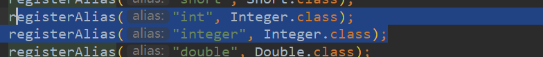

> `parameterType="integer" `可以不用配置，因为有默认的关系映射。
>
> 大部分的数据类型都不用配，包括`map`和`entity`
>
> 后面详细说明[`#`和`$`这两个占位符的区别]()。其实也就是 	`sql`注入的区别。

结果：

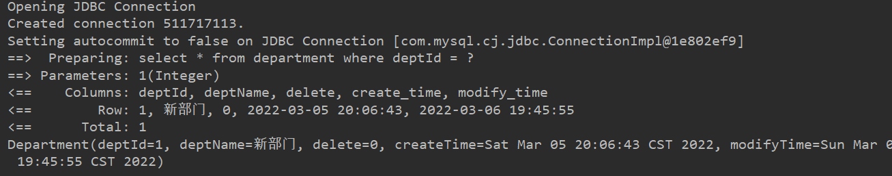

##### 插入

`mapper`接口

```java
//插入记录
int insertIntoDept(Department dept);
```

`mapper.xml`配置文件

```xml
<insert id="insertIntoDept">
    insert into department(`deptName`,`delete`,`create_time`,`modify_time`)
    values (#{deptName},#{delete},#{createTime},#{modifyTime})
</insert>
```

测试：

> `sqlSession.commit();``insert`插入数据需要操作事务，`sqlsession`
>
> 默认不自动提交事务，需要手动提交。

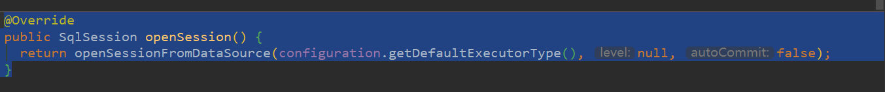

> 或者在`opensession()`时传入参数`openSession(true) `

```xml
@Test
public void testConn7() throws IOException {

    SqlSession sqlSession = mybatisUtil.OpenSqlSession();

    DepartmentMapper mapper = sqlSession.getMapper(DepartmentMapper.class);

    Department department = Department.builder()
            .deptName("mybatis部门")
            .delete(0)
            .createTime(new Date())
            .modifyTime(new Date()).build();
    System.out.println(department);
    int i = mapper.insertIntoDept(department);
    sqlSession.commit();
    System.out.println(i);
}
```

结果：

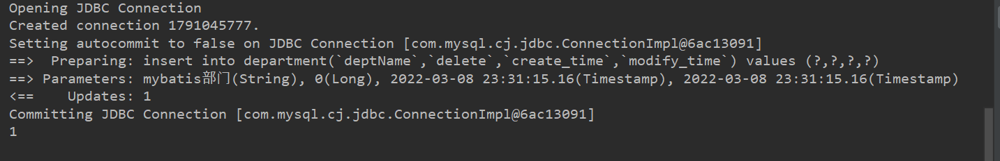


> 不用担心时间转化不了,`mybatis`自动将`date`->`timeStamp`

##### 删除

`mapper`接口

```java
int deleteById(@Param("id") Integer id);
```

`mapper.xml`配置文件

```xml
<delete id="deleteById">
    delete from `department` where `deptId` = #{id}
</delete>
```

测试：

```java
@Test
public void testConn8() throws IOException {
    SqlSession sqlSession = mybatisUtil.OpenSqlSession();
    DepartmentMapper mapper = sqlSession.getMapper(DepartmentMapper.class);
    int rows = mapper.deleteById(40);
    sqlSession.commit();
    System.out.println(rows);
}
```

结果：

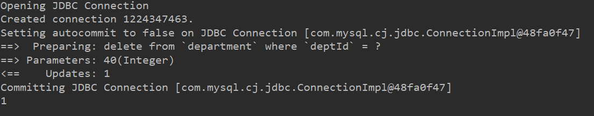

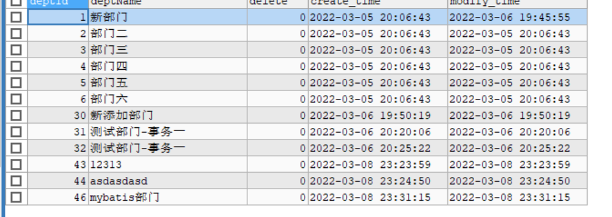

##### 修改

`mapper`接口

```java
int modifyById(Department dept);
```

`mapper.xml`配置文件

```xml
<update id="modifyById" >
    update `department` 
    set 
    `deptName` = #{deptName},
    `modify_time` = #{modifyTime}  
    where `deptId` = #{deptId}
</update>
```

测试：

```java
@Test
public void testConn9() throws IOException {

    SqlSession sqlSession = mybatisUtil.OpenSqlSession();


    DepartmentMapper mapper = sqlSession.getMapper(DepartmentMapper.class);

    Department deptOld = mapper.queryById(46);
    System.out.println(deptOld);
    //deptName字段只有10  截断
    deptOld.setDeptName((deptOld.getDeptName()+"更新").substring(3));
    deptOld.setModifyTime(new Date());
    int rows = mapper.modifyById(deptOld);
    sqlSession.commit();

    System.out.println(rows);
}
```

结果：

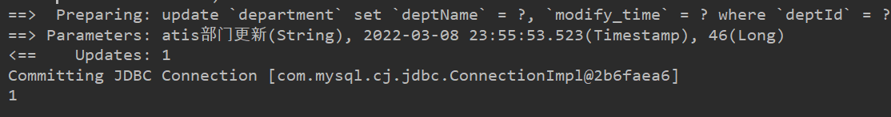


> `OK`基本的增删改查都可以了，接下来总结配置的具体内容和作用。
>
> 包括：
>
> ​	1、 `Log4j`日志
>
> ​	2、使用注解`@Alias`配置别名  以及注解写`sql`
>
> ​	3、以上使用的都是`ibatis`默认提供的数据源，我们换一个数据源
>
> ​	4、`mybatis`的缓存机制，以及如何实现

