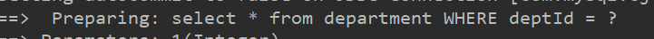
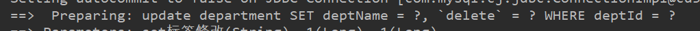
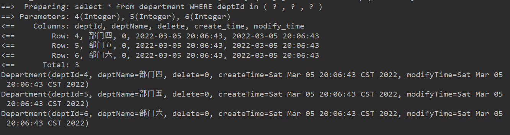
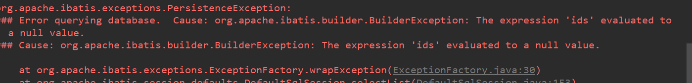
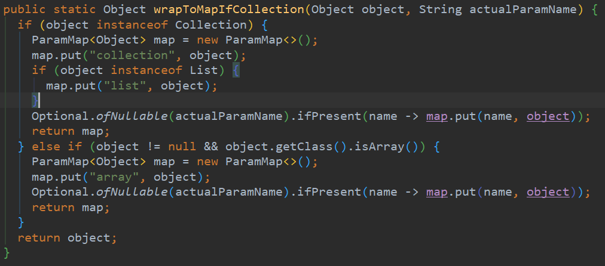
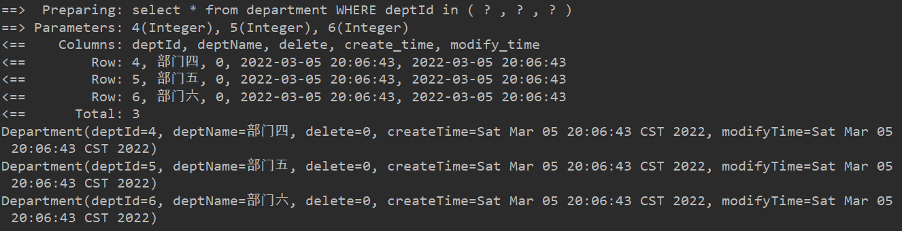
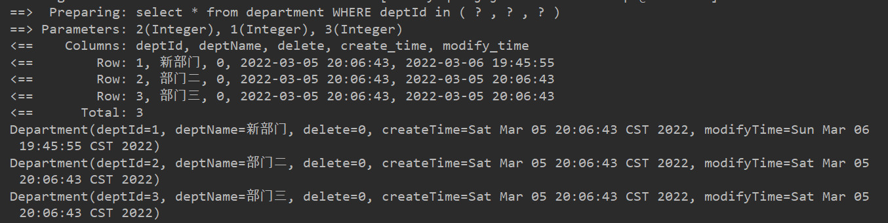

本文是`Mybatis`动态`sql`也是常用标签总结。

> `Mybatis`是为数不多的跟着官网学习，就能学明白的，建议多看看官方文档。
>
> 传送门:[Mybatis官网](https://mybatis.org/mybatis-3/zh/index.html)
>
> [<上一章]()   ||   [下一章>]()


### 动态sql

动态`sql`就是根据不同的条件拼接`sql`语句。


#### 原生JDBC实现动态sql的缺陷

原生`JDBC`也可以实现动态`sql`,但是存在许多缺陷。

##### 拼接时的空格

例如：

```java
//查询条件
String deptN = "部门二";
Integer isDelete = 0;
//获取连接
Connection conn = DriverManager.getConnection(url, user, pass);
//编写sql
String sql = "select * from department where 1 = 1";
if (deptN != null)
    sql+="and deptName = ?";
if (isDelete != null)
    sql+="and `delete` = ?";
PreparedStatement prep = conn.prepareStatement(sql);

System.out.println(sql);

if (deptN != null)
    prep.setString(1, deptN);

if (isDelete != null)
    prep.setInt(2, isDelete);
```

拼接过后的`sql`:

```sql
select * from department where 1 = 1and deptName = ?and `delete` = ?
```

`?and`缺少空格，报`SQLSyntaxErrorException``sql`语句错误。

##### sql最后的逗号

比如说批量插入时，需要去掉最后出现的逗号

```java
String sql = "insert into department(deptName) " +
        "values";
for (Department dept : list) {
    sql += "(?),";
}
sql = sql.substring(0, sql.lastIndexOf(","));
```


#### mybatis动态sql

> 通标签动态拼接`sql`且处理原生动态`sql`缺陷

[`mybatis`相关配置](https://juejin.cn/post/7073120041381658632#heading-8)：目录：测试环境搭建

##### 相关标签

###### where标签

> 用于代替`where`关键字的，并且可以舍弃不必要的`and`，特别是配合`if`标签使用。

比如说根据`id`查询 

  `mapper：`接口

```java
public interface DepartmentMapper {
    //根据id查询
    Department queryById(@Param("id") Integer id);
}
```

`mapper.xml`配置文件

```xml
<select id="queryById" resultType="department">
    select * from department
    <where>
        and deptId = #{id}
    </where>
</select>
```

测试：

```java
@Test
public void testwhere(){
    SqlSession sqlSession = MybatisUtil.getSqlSession();
    DepartmentMapper mapper = sqlSession.getMapper(DepartmentMapper.class);
    Department department = mapper.queryById(1);
    System.out.println(department);
}
```

结果：



他会将第一个`and`省略

注意：但是他不会自动添加and。比如说有两个条件第一个条件`and`加不加都行，但是第二个`and`一定添加。


###### if标签

`<if  test = ""></if>`

当`test`条件满足时才拼接`sql`，同时第一个`and`也会被`<where>`处理

```xml
<select id="queryByIdIf" resultType="department">
    select * from department
    <where>
        <if test="id ge 1">
            and deptId = #{id}
        </if>
    </where>
</select>
```


###### choose、when、otherwise

官网：[choose、when、otherwise](https://mybatis.org/mybatis-3/zh/dynamic-sql.html)

和`java`中的`switch  case`一样

`jdk1.8`的`switch`是不是不支持，判断引用类型？

```java
int i = 10;
switch (i) {
    case 1:
        System.out.println("1");
        break;
    case 2:
        System.out.println("2");
        break;
    case 10:
        System.out.println("10");
        break;
    default:
        System.out.println("default");
}
```


###### set标签

set 标签可以用于动态包含需要更新的列，忽略其它不更新的列，且会去除最后一个逗号。

```java
//更新
int updateByEntity(Department dept);
```

```xml
<update id="updateByEntity" parameterType="department">
    update department
    <set>
        <if test=" deptName!=null and deptName!='' ">
            deptName = #{deptName},
        </if>
        <if test=" delete gte 0 ">
            `delete` = #{delete},
        </if>
    </set>
    <where>
        deptId = #{deptId}
    </where>
</update>
```



> 会为我们补全`set`以及删除最后一个逗号  配合if是很好用的。


###### foreach标签

循环标签，多用于`in`判断和批量插入。

`in`判断

```java
//in   ids
List<Department> queryIn(int[] ids);
```

```java
<select id="queryIn" resultType="department">
    select * from department
    <where>
        <foreach collection="array" item="item" index="index"
         open="deptId in (" separator="," close=")" >
            #{item}
        </foreach>
    </where>
</select>
```

测试:

```java
@Test
public void test4() {

    SqlSession sqlSession = MybatisUtil.getSqlSession();

    DepartmentMapper mapper = sqlSession.getMapper(DepartmentMapper.class);

    int[] ids = {4, 5, 6};
    List<Department> departments = mapper.queryIn(ids);

    for (Department dept : departments) {
        System.out.println(dept);
    }
}
```



没有问题可以查出来。


***<u>问题一：如果传入的参数为`null`，或者数组长度为0呢。</u>***

以前foreach标签  内是有 nullable属性的吧，现在没了

测试：出问题了



解决：

利用`if`标签加判断，前提是 参数使用@Param修饰，`@Param("ids") int[] ids`，不然会有找不到参数异常。

```xml
<select id="queryIn" resultType="department">
    select * from department
    <where>
        <if test=" ids==null or ids.length==0 ">
            1 = 2
        </if>
        <if test=" ids!=null and ids.length gt 0 ">
            <foreach collection="array" item="item" index="index"
                     open="deptId in (" separator="," close=")">
                <!--    #{item}           -->
                #{item}
            </foreach>
        </if>
    </where>
</select>
```


<u>***问题二：foreach标签属性***</u>

你可以将任何可迭代对象（如 List、Set 等）、Map 对象或者数组对象作为集合参数传递给 *foreach*。当使用可迭代对象或者数组时，index 是当前迭代的序号，item 的值是本次迭代获取到的元素。当使用 Map 对象（或者 Map.Entry 对象的集合）时，index 是键，item 是值。

`collection`属性：`collection、array、list`

源码`DefaultSqlsession`



item  and   index

`list  set`都基于数组实现。

如果迭代参数是`array`、`list`、`set`的话，`index` 是下标，`item`是元素。

如果迭代参数是 Map（或者 Map.Entry 对象的集合）时，index 是键(key)，item 是值(value)。


通用：不用管迭代对象的类型，因为`sqlsession`会帮我帮我们处理，参数是啥就传啥。

**`mapper`接口:**

注意使用@Param修饰

```java
List<Department> queryIn(@Param("ids") int[] ids);
```

**配置文件：**

注意过滤参数为空的情况，且collection="ids"

```java
<select id="queryIn" resultType="department">
    select * from department
    <where>
        <if test=" ids==null or ids.length==0 ">
            1 = 2
        </if>
        <if test=" ids!=null and ids.length gt 0 ">
            <foreach collection="ids" item="item" index="index"
                     open="deptId in (" separator="," close=")">
                #{item}
            </foreach>
        </if>
    </where>
</select>
```

测试：

```java
int[] ids = {4, 5, 6};
List<Department> departments = mapper.queryIn(ids);
```

结果：



使用map:

```java
//in   map
List<Department> queryInMap(@Param("map") Map map);
```

```xml
<select id="queryInMap" resultType="department">
    select * from department
    <where>
        <if test=" map == null or map.size==0 ">
            1 = 2
        </if>
        <if test=" map!=null and map.size gt 0 ">
            <foreach collection="map" item="value" index="key"
                     open="deptId in (" separator="," close=")">
                <!--    #{item}           -->
                #{value}
            </foreach>
        </if>
    </where>
</select>
```

```java
@Test
public void test5() {

    SqlSession sqlSession = MybatisUtil.getSqlSession();

    DepartmentMapper mapper = sqlSession.getMapper(DepartmentMapper.class);

    Map<String, Integer> map = new HashMap<String, Integer>();

    map.put("id1",1);
    map.put("id2",2);
    map.put("id3",3);

    List<Department> departments = mapper.queryInMap(map);

    for (Department dept : departments) {
        System.out.println(dept);
    }
}
```




###### trim标签

自定义标签。

***<u>使用`trim`实现`where`</u>***

```xml
<select id="trimToWhere" resultType="department">
    select * from department
    <trim prefix="where" prefixOverrides="and |or">
        and deptId = #{id}
    </trim>
</select>
```

```bash
prefix  		 前缀
prefixOverrides  覆盖最前面的  and or  and后面的空格必要
suffix   	 	 后缀
suffixOverrides  覆盖最后面
```

实际应用：插入语句，对于插入数据的判断

```java
<trim prefix="(" suffix=")" suffixOverrides=",">
    <if test="blogId != null">blog_id,</if>
    <if test="blogTitle != null">blog_title,</if>
    <if test="blogSubUrl != null">blog_sub_url,</if>
    <if test="blogCoverImage != null">blog_cover_image,</if>
</trim>
```


#### sql片段

`<sql>`定义片段，`<include>`引入片段

多用于定义必要常用字段，或者排除占用内存较大字段，提升`sql`性能。

```xml
<sql id="department_base_colum">
    deptId,deptName,`delete`,create_time,modify_time
</sql>
<select id="baseColum" resultType="department">
    select
    <include refid="department_base_colum"/>
    from department
    <trim prefix="where" prefixOverrides="and |or">
        and deptId = #{id}
    </trim>
</select>
```

