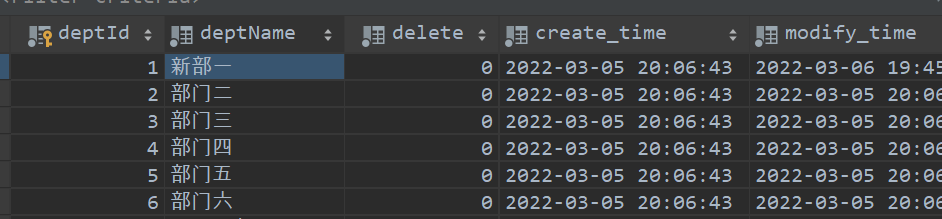
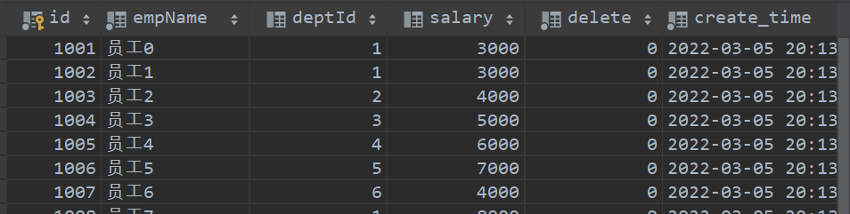
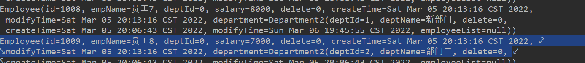
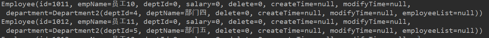
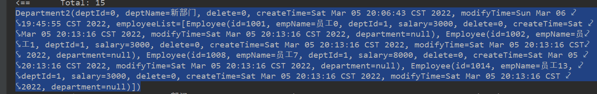

本文关于`Mybatis`处理结果集映射,不做源码解读，只总结使用。

> `Mybatis`是为数不多的跟着官网学习，就能学明白的，建议多看看官方文档。
>
> 传送门:[Mybatis官网](https://mybatis.org/mybatis-3/zh/index.html)
>
> [<上一章]()   ||   [下一章>]()

原码讲解文章:[Lucare：Mybatis源码分析（7）—— 结果集处理](https://blog.csdn.net/fcs_learner/article/details/80031960)

####  1、ResultType

##### 结果集和实体类完全匹配

```java
<sql id="department_base_colum">
    deptId,deptName,`delete`,create_time,modify_time
</sql>
<select id="baseColum" resultType="department">
    select
    <include refid="department_base_colum"/>
    from department
    <trim prefix="where" prefixOverrides="and |or">
        and deptId = #{id}
    </trim>
</select>
```

```java
public class Department {
  private long deptId;
  private String deptName;
  private long delete;
  private Date createTime;
  private Date modifyTime;
}
```

> 处理方式：查询出结果集，根据列名(colum)，去实体类找寻对应的`setProperty()`方法。


##### 结果集和实体类不完全匹配

日常写代码，需要的结果集大部分和我们的返回实体类不匹配，需要我们手动映射。

对于简单的映射：

这是需要的返回实体：

```java
public class ResultEntity {
    private long intProperty;
    private String stringProperty;
    private Date dateProperty;
}
```

对于结果集做以下结果集映射：

```java
<sql id="department_base_colum_map">
    deptId intProperty,deptName stringProperty,`delete`,create_time dateProperty,modify_time
</sql>

<select id="resultTypeTest" resultType="resultEntity">
    select
    <include refid="department_base_colum_map"/>
    from department
</select>
```

> `mysql`中对字段取别名，可以省略`AS`
>
> 上面我们说明，结果集的映射是根据列名和实体类对应的，所以这里可以做取别名处理。


#### 2、ResultType

> 上面的例子对于简单的结果集映射，是完全够用了。对于复杂的结果集的映射就需要`resultMap`处理

上面的例子也可以使用`resultMap`处理结果集：

```xml
<select id="resultMapTest" resultMap="resultMapEntity">
    select
    <include refid="department_base_colum"/>
    from department
</select>

<resultMap id="resultMapEntity" type="resultEntity">

    <result column="deptId" property="intProperty"/>
    <result column="deptName" property="stringProperty"/>
    <result column="create_time" property="dateProperty"/>

</resultMap>
```


##### 复杂结果映射

###### 环境搭建

`department`部门表和`employee`员工表

```sql
CREATE TABLE `department` (
  `deptId` INT(10) NOT NULL AUTO_INCREMENT COMMENT '部门id',
  `deptName` VARCHAR(10) NOT NULL COMMENT '部门名称',
  `delete` TINYINT(4) NOT NULL DEFAULT '0' COMMENT '逻辑删除字段',
  `create_time` DATETIME NOT NULL DEFAULT CURRENT_TIMESTAMP COMMENT '插入时间',
  `modify_time` DATETIME NOT NULL DEFAULT CURRENT_TIMESTAMP COMMENT '修改时间',
  PRIMARY KEY (`deptId`)
) ENGINE=INNODB AUTO_INCREMENT=61 DEFAULT CHARSET=utf8
CREATE TABLE `employee` (
  `id` INT(10) NOT NULL COMMENT '员工id',
  `empName` VARCHAR(10) NOT NULL COMMENT '员工名称',
  `deptId` INT(10) DEFAULT NULL COMMENT '部门id',
  `salary` INT(10) DEFAULT '1000' COMMENT '员工工资',
  `delete` TINYINT(4) NOT NULL DEFAULT '0' COMMENT '逻辑删除字段',
  `create_time` DATETIME NOT NULL DEFAULT CURRENT_TIMESTAMP COMMENT '插入时间',
  `modify_time` DATETIME NOT NULL DEFAULT CURRENT_TIMESTAMP COMMENT '修改时间',
  PRIMARY KEY (`id`)
) ENGINE=INNODB DEFAULT CHARSET=utf8
```

插入数据：





实体类：

使用`lombok`

```java
public class Department {

  private long deptId;
  private String deptName;
  private long delete;
  private Date createTime;
  private Date modifyTime;
  private List<Employee> employeeList;

}
```

```java
public class Employee {
    private long id;
    private String empName;
    private long deptId;
    private long salary;
    private long delete;
    private Date createTime;
    private Date modifyTime;
    private Department department;
}
```

`mybatis-config.xml`配置略


***<u>第一种：查询员工信息，并映射部门信息。</u>***

第一种方式：

`mapper`接口

```java
List<Department2> getDeptInfo();
```

`mapper.xml`

`<resultMap>`中存在默认映射规则，就是表名和字段名，同时支持驼峰命名。

我们可以写映射规则，覆盖默认规则，这也是我们主要做的工作。

```xml
<select id="getEmployeeList" resultMap="employeeInfo">
    select * from employee
</select>

<resultMap id="employeeInfo" type="employee">

</resultMap>
```

修改`<resultMap>`

```java
<select id="getEmployeeList" resultMap="employeeInfo">
    select * from employee
</select>

<resultMap id="employeeInfo" type="employee">
    <!-- 复杂类型： department类
            【association】: 对象
                - 【property】: 设置获取到的结果集字段
                - 【column】: 设置映射对应的数据库字段 => deptId
                - 【javaType】: 设置返回类型 => Department
                - 【select】: 子查询绑定。通过其他<select>标签中的值，指向其他select语句 => <select id="TeachersInfo">
            【collection】: 集合
        -->
    <association property="department" column="deptId" javaType="department" select="departmentInfo"/>

</resultMap>

<select id="departmentInfo" resultType="Department2">
    select * from department where deptId = #{deptId}
</select>
```

测试：



总结：

这种属于查询过程中进行嵌套处理。首先查询`employee`信息，然后根据`employee`的`deptId`查部门信息。每查询一个`employee`就嵌套一个`dept`。


第二种方式:

`mapper.xml`:

```xml
<select id="getEmployeeListByResult" resultMap="employeeInfoByResult">
    select e.id, e.empName, d.deptId, d.deptName from employee e, department d
    where e.deptId = d.deptId
</select>
<resultMap id="employeeInfoByResult" type="employee">

    <result property="id" column="id"/>
    <result property="empName" column="empName"/>

    <association property="department" javaType="department2">
        <result property="deptId" column="deptId"/>
        <result property="deptName" column="deptName"/>
    </association>
</resultMap>
```



> 这种方式大部分情况下需要取别名，做手动映射。
>
> 这种方式是按查询结果进行映射，先联表查询，查出结果，最后进行映射。个人喜欢这种方式


***<u>第二种：查询部门信息，并映射员工信息。</u>***

```xml
<select id="getDeptListInfo" resultMap="departmentInfo">
    select * from department
</select>
<resultMap id="departmentInfo" type="Department2">
    <!--
            javaType: 指定在java中的字段类型属性
            ofType: 指定类型所属类
            column: deptId  作为 getEmployeesByDeptId的参数
    -->
    <collection property="employeeList" javaType="list" ofType="department2" select="getEmployeesByDeptId"
                column="deptId"/>
</resultMap>
<select id="getEmployeesByDeptId" resultType="employee">
 select * from employee where deptId = #{deptId}
</select>
```



也是可以的。


```xml
<select id="getDeptListInfoResult" resultMap="departmentInfoResult">
    select d.deptId, d.deptName,e.id,e.empName
    from department d,employee e
    where d.deptId = e.deptId
</select>
<resultMap id="departmentInfoResult" type="department2">
    <id property="deptId" column="deptId"/>
    <result property="deptName" column="deptName"/>

    <collection property="employeeList" ofType="employee">
        <result property="id" column="id"/>
        <result property="empName" column="empName"/>
    </collection>
</resultMap>
```

也是可以的。


找个时间我再整理一下，太乱了。