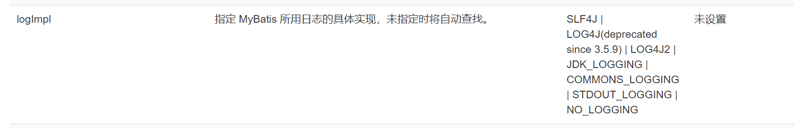
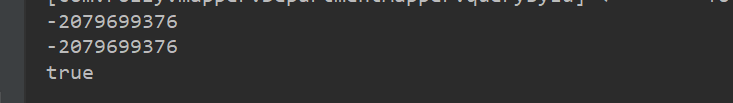
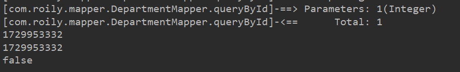
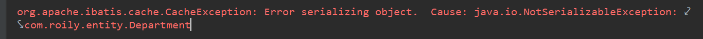
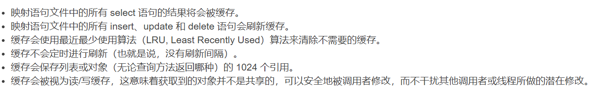
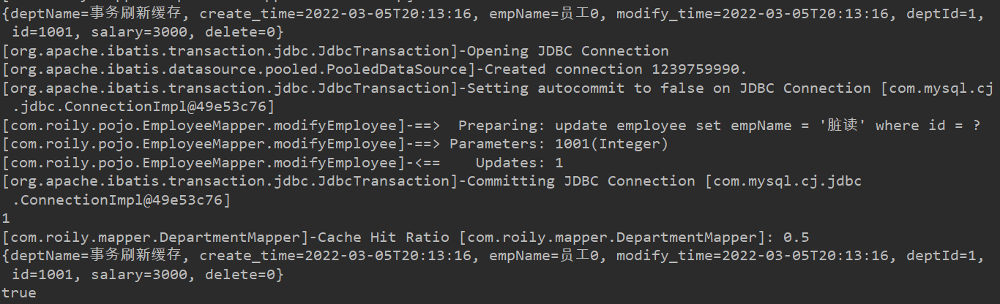
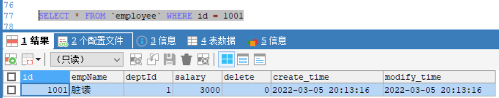

本文总结`Mybatis`的日志配置和缓存。

> `Mybatis`是为数不多的跟着官网学习，就能学明白的，建议多看看官方文档。
>
> 传送门:[Mybatis官网](https://mybatis.org/mybatis-3/zh/index.html)
>
> [<上一章]()   ||   [下一章>]()


#### 日志

[mybatis中文官方文档对于日志的说明](https://mybatis.org/mybatis-3/zh/configuration.html#settings)

常用的有：`STDOUT_LOGGING`和`LOG4J`,且默认是关闭日志的。



##### `STDOUT_LOGGING`

无需配置，日志记录相对简洁，且没有日志等级配置，无法直接序列化到本地。


##### `LOG4J`

什么是Log4J？

- Log4j是`Apache`的一个开源项目，通过使用Log4j，可以控制日志信息输送的目的地是`控制台`等。
- 控制每一条日志的输出格式；通过定义每一条日志信息的级别，能够更加细致地控制日志的生成过程。
- 也可以配置日志输出格式；

###### 使用

1. 引入依赖：

```xml
<!-- https://mvnrepository.com/artifact/log4j/log4j -->
<dependency>
    <groupId>log4j</groupId>
    <artifactId>log4j</artifactId>
    <version>1.2.17</version>
</dependency>
```

2. `mybatis`开启日志配置

```xml
<settings>
    <setting name="logImpl" value="LOG4J"/>
</settings>
```

3. `log4j.properties`的配置 

```properties
#将等级为DEBUG的日志信息输出到console和file这两个目的地，console和file的定义在下面的代码
log4j.rootLogger=DEBUG,console,file
#控制台输出的相关设置
log4j.appender.console = org.apache.log4j.ConsoleAppender
log4j.appender.console.Target = System.out
log4j.appender.console.Threshold=DEBUG
log4j.appender.console.layout = org.apache.log4j.PatternLayout
log4j.appender.console.layout.ConversionPattern=[%c]-%m%n
#文件输出的相关设置
log4j.appender.file = org.apache.log4j.RollingFileAppender
log4j.appender.file.File=./log/MyBatis.log
log4j.appender.file.MaxFileSize=10mb
log4j.appender.file.Threshold=DEBUG
log4j.appender.file.layout=org.apache.log4j.PatternLayout
log4j.appender.file.layout.ConversionPattern=[%p][%d{yy-MM-dd}][%c]%m%n
#日志输出级别
log4j.logger.org.mybatis=DEBUG
log4j.logger.java.sql=DEBUG
log4j.logger.java.sql.Statement=DEBUG
log4j.logger.java.sql.ResultSet=DEBUG
log4j.logger.java.sql.PreparedStatement=DEBUG
```

> 配置结束，`log4j`是一个成熟的日志框架，其作用原不止于此，关于配置和使用自行百度，并且日常常用自然就会啊


#### 缓存

[mybatis中文官方文档关于缓存](https://mybatis.org/mybatis-3/zh/sqlmap-xml.html#cache)

> `mybatis`存在两种缓存  一级缓存和二级缓存

- `mybatis`默认开启一级缓存，如需显示开启一级缓存只需在`<setting>`中显示1设置即可。
- 一级缓存属于会话级别，也就是和`sqlsession`生命周期一样
- 存在事务操作会刷新一级缓存
- 开启二级缓存需在`mapper`映射文件中开启

##### 一级缓存测试

```java
@Test
public void cachTest(){

    SqlSession sqlSession = MybatisUtil.getSqlSession();
    DepartmentMapper mapper = sqlSession.getMapper(DepartmentMapper.class);

    Department department1 = mapper.queryById(1);
    System.out.println(department1.hashCode());

    Department department2 = mapper.queryById(1);
    System.out.println(department2.hashCode());
    
    System.out.println(department1 == department2);

}
```

> `lombok`为我们重写了`hashcode()`方法，哈希值相等参考价值不大，但是`==`号返回`true`那么对象是一定相等的。



> 查询同一条数据在`sqlsession`作用域中拿到了对象是相同的。
>

##### 事务操作刷新缓存

```java
@Test
public void cachTest2(){

    SqlSession sqlSession = MybatisUtil.getSqlSession();
    DepartmentMapper mapper = sqlSession.getMapper(DepartmentMapper.class);

    Department department1 = mapper.queryById(1);
    System.out.println(department1.hashCode());
    //事务操作
    Department dept = Department.builder().deptName("事务刷新缓存").deptId(2).build();
    int i = mapper.updateByEntity(dept);
    sqlSession.commit();
    Department department2 = mapper.queryById(1);
    
    System.out.println(department1.hashCode());
    System.out.println(department2.hashCode());

    System.out.println(department1 == department2);
}
```



> 不管是修改所查询的数据，还是其他数据，都会刷新`mybatis`一级缓存。


##### 二级缓存配置

`mybatis-config.xml`

`mybatis`默认开启缓存，可不必要显示配置。

```xml
<setting name="cacheEnabled" value="true"/>
```

只需在`mapper`映射文件添加以下标签即可

```xml
<cache/>
```

##### 二级缓存测试

```java
@Test
public void cachTest3(){

    SqlSession sqlSession = MybatisUtil.getSqlSession();
    DepartmentMapper mapper = sqlSession.getMapper(DepartmentMapper.class);
    Department department1 = mapper.queryById(1);
    sqlSession.close();

    SqlSession sqlSession2 = MybatisUtil.getSqlSession();
    DepartmentMapper mapper2 = sqlSession2.getMapper(DepartmentMapper.class);
    Department department2 = mapper2.queryById(1);

    System.out.println(department1.hashCode());
    System.out.println(department2.hashCode());

    System.out.println(department1 == department2);
}
```

> 报错了



> MyBatis的二级缓存是Application级别的缓存，它可以提高对数据库查询的效率，以提高应用的性能。
>
> SqlSessionFactory层面上的二级缓存默认是不开启的，二级缓存的开席需要进行配置，实现二级缓存的时候，MyBatis要求==返回的POJO必须是可序列化==的（ 要求实现Serializable接口）

测试：

说明：`sqlSession.commit();`如果没有开启`sqlsession`自动提交，这行代码是必要的，也就是说显示将查询数据提交到缓存，这样再次查询就能一定命中。

```java
@Test
public void cachTest4(){

    SqlSession sqlSession = MybatisUtil.getSqlSession();
    DepartmentMapper mapper = sqlSession.getMapper(DepartmentMapper.class);
    Department department1 = mapper.queryById(1);

    sqlSession.commit();
    
    SqlSession sqlSession2 = MybatisUtil.getSqlSession();
    DepartmentMapper mapper2 = sqlSession2.getMapper(DepartmentMapper.class);
    Department department2 = mapper2.queryById(1);
    System.out.println(department1 == department2);
}
```




##### 二级缓存造成脏读

在`DepartmentMapper.xml`开启二级缓存，实现查询接口

```xml
<cache
        eviction="FIFO"
        flushInterval="3000"
        size="512"
        readOnly="true"/>
<select id="selectAsMap" resultType="map">
        select e.*, d.deptName from department d,employee e
        where e.deptId = d.deptId
        and e.id = #{id}
</select>
```

在`EmployeeMapper.xml`     实现修改接口

```xml
<update id="modifyEmployee">
    update employee set empName = '脏读'
    where id = #{id}
</update>
```

测试：

```java
@Test
public void cachTest5(){

    SqlSession sqlSession = MybatisUtil.getSqlSession();
    DepartmentMapper mapper = sqlSession.getMapper(DepartmentMapper.class);
    Map<String, Object> map = mapper.selectAsMap(1001);
    System.out.println(map);
    //提交到缓存
    sqlSession.commit();

    //事务操作  修改1001员工
    SqlSession sqlSession1 = MybatisUtil.getSqlSession();
    EmployeeMapper mapper1 = sqlSession1.getMapper(EmployeeMapper.class);
    int i = mapper1.modifyEmployee(1001);
    sqlSession1.commit();

    SqlSession sqlSession2 = MybatisUtil.getSqlSession();
    DepartmentMapper mapper2 = sqlSession2.getMapper(DepartmentMapper.class);
    Map<String, Object> map2 = mapper2.selectAsMap(1001);
    System.out.println(map2);
    System.out.println(map2 == map);
}
```

结果：



> 显示从缓存读取数据，而且`Hit  Ratio` 命中了缓存。

查看数据库：




##### 总结：

二级缓存需要在`mapper`映射文件中显示开启，作用域为`namespace`且各个`namespace`之间互不影响，当二级缓存失效时默认会降级到一级缓存，最后才失效。事务操作会直接将二级缓存降级到一级缓存然后刷新缓存。对于多表查询不能使用二级缓存，因为`namespace`隔离，会造成脏读。