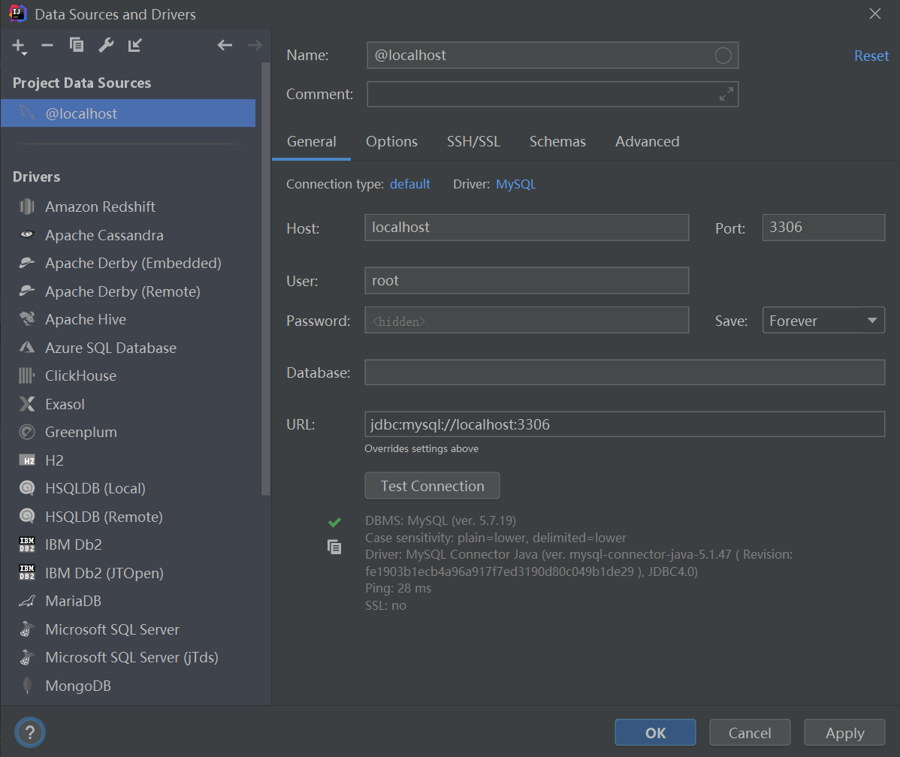
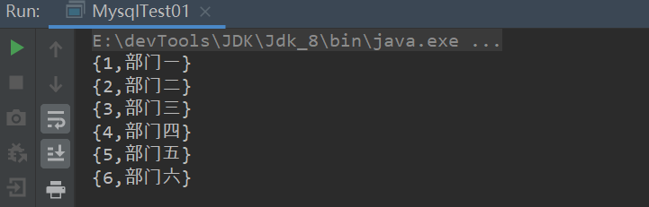
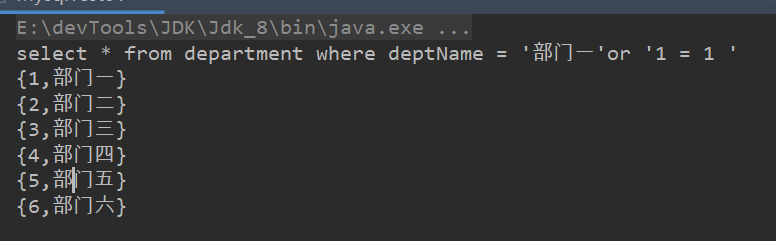
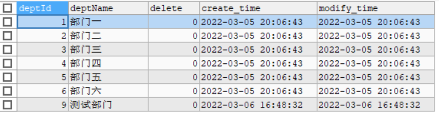

Mysql从0到0.9

此章节总结使用`ide`连接数据库，使用原生`jdbc`来操作数据库。

工具：`idea`  `maven` `mysql`

> [上一篇、Mysql基础]()||[下一篇]()
>
> 代码资源：[源码]()


Mysql从0到0.9

> [上一篇、Mysql基础]()||[下一篇]()

#### idea连接mysql

创建空maven项目。

点工具栏的`DataBase`,配置一下。没有去百度一下。




#### 使用jdbc操作数据库


##### 添加依赖

> 根据版本的不同，驱动类也会有所不同

```xml
 <dependency>
            <groupId>mysql</groupId>
            <artifactId>mysql-connector-java</artifactId>
            <version>8.0.28</version>
</dependency>
```

##### 测试一（简单查询）

> 我引入的`mysql8.0`的驱动为`com.mysql.cj.jdbc.Driver`
>
> 如果低版本则为`com.mysql.jdbc.Driver`
>
> 如果报连接错误（时区相关），添加`serverTimezone=GMT%2B8`到`url`后

```java
public static void main(String[] args) throws SQLException {
        try {
            //注册驱动
            Class.forName("com.mysql.cj.jdbc.Driver");
        } catch (ClassNotFoundException e) {
            e.printStackTrace();
        }
        String url = "jdbc:mysql://localhost:3306/mybatis_plus?useUnicode=true&charactEncoding=utf8&useSSL=true";
        String user = "root";
        String pass = "123456";
        //获取连接
        Connection conn = DriverManager.getConnection(url,user,pass);
        //编写sql
        String sql = "select * from department";
        Statement statement = conn.createStatement();
        ResultSet resultSet = statement.executeQuery(sql);
        while (resultSet.next()) {
            Object deptId = resultSet.getObject("deptId");
            Object deptName = resultSet.getObject("deptName");
            System.out.println("{"+deptId+","+deptName+"}");
        }
        resultSet.close();
        statement.close();
        conn.close();
    }
```



> 注意：手动关闭资原。

##### 测试二（条件查询）

> 根据`id`查询。将`id`作为参数传入即可。只需修改`sql`语句即可

```java
方法定义:test2(String deptName)

sql语句:String sql = "select * from department where deptName = "+"'"+deptName+"'";

方法调用:test2("部门一");
```


##### sql注入

问题：`sql`注入,如果我传入 `"部门一'"+"or'1 = 1 "`呢

```java
test2("部门一'"+"or'1 = 1 ");
```



> 通过`sql`注入将所有的记录都查询出来，显然是不安全的。

解决：使用`preparedStatement`对`sql`进行预编译处理，使用占位符，对特殊字符不做编译处理，只作为字符串处理。

==对比`statement``preparedStatement`有如下优势==

- 简化Statement中的操作      无需手动拼接sql
- 提高执行语句的性能（预编译，缓存，sql只解析一次）

- 可读性和可维护性更好

- 安全性更好   （有效防止sql注入）

代码：只需修改一下代码，注意executeQuery没有参数，已做预处理。

```java
//编写sql
String sql = "select * from department where deptName = ?";
PreparedStatement prep = conn.prepareStatement(sql);
prep.setString(1,deptName);
ResultSet resultSet = prep.executeQuery();
```

测试：

```java
//正常
test3("部门一");
//sql注入失败
test3("部门一'"+"or'1 = 1 ");
```


##### 结果封装实体类

实体类`department`

```java
@Data
@AllArgsConstructor
@NoArgsConstructor
public class Department {
    private static SimpleDateFormat format = new SimpleDateFormat("yyyy-mm-dd HH:mm:ss");

    private Integer deptId;
    private String deptName;
    private Integer delete;
    private Date create_time;
    private Date modify_time;

    @Override
    public String toString() {
        return "Department{" +
                "deptId=" + deptId +
                ", deptName='" + deptName + '\'' +
                ", delete=" + delete +
                ", create_time=" + format.format(create_time) +
                ", modify_time=" + format.format(modify_time) +
                '}';
    }
}
```

结果封装：

```java
Department department = null;
while (resultSet.next()) {
    department = new Department();
    System.out.println(resultSet.getObject("create_time").getClass());
    department.setDeptId((Integer) resultSet.getObject("deptId"));
    department.setDeptName((String) resultSet.getObject("deptName"));
    department.setDelete((Integer) resultSet.getObject("delete"));
    department.setCreate_time(Date.from(((LocalDateTime)resultSet.getObject("create_time")).atZone(ZoneId.systemDefault()).toInstant()));
    department.setModify_time(Date.from(((LocalDateTime)resultSet.getObject("modify_time")).atZone(ZoneId.systemDefault()).toInstant()));
    System.out.println(department.toString());
}
```

> 注意：`ResultSet`得到的时间类型为`java.time.LocalDateTime`,在`java`中一定都要转化为`java.util.date`进行操作。

有关文章：[Java8新的时间API：LocalDate, LocalTime 和 LocalDateTime](https://juejin.cn/post/7028206208498532359)

##### 测试三（插入、更新、删除）

> 以下都以`preparedStatement`操作。

插入：

```java
public static void insert(Department department) throws SQLException {
    try {
        //注册驱动
        Class.forName("com.mysql.cj.jdbc.Driver");
    } catch (ClassNotFoundException e) {
        e.printStackTrace();
    }
    String url = "jdbc:mysql://localhost:3306/mybatis_plus?useUnicode=true&charactEncoding=utf8&useSSL=true&serverTimezone=GMT%2B8";
    String user = "root";
    String pass = "123456";
    //获取连接
    Connection conn = DriverManager.getConnection(url, user, pass);
    //编写sql
    String sql = "insert into department(deptName) " +
            "values (?)";
    PreparedStatement prep = conn.prepareStatement(sql);
    prep.setString(1, department.getDeptName());
    boolean execute = prep.execute();
    System.out.println(execute);
    prep.close();
    conn.close();
}
```

```java
Department department = new Department();
department.setDeptName("测试部门");
insert(department);
```



> 返回值`false`不表示插入失败，而是没有结果集`ResultSet` 是`inset`或`update`

更新：

```java
public static void update(Department department) throws SQLException {
    try {
        //注册驱动
        Class.forName("com.mysql.cj.jdbc.Driver");
    } catch (ClassNotFoundException e) {
        e.printStackTrace();
    }
    String url = "jdbc:mysql://localhost:3306/mybatis_plus?useUnicode=true&charactEncoding=utf8&useSSL=true&serverTimezone=GMT%2B8";
    String user = "root";
    String pass = "123456";
    //获取连接
    Connection conn = DriverManager.getConnection(url, user, pass);
    //编写sql
    String sql = "update department ";
    if(department.getDeptName()!=null){
        sql+="set deptName = ?, ";
    }if(department.getDelete()!=null){
        sql+=" delete  = ?, ";
    }if(department.getCreate_time()!=null){
        sql+=" create_time = ?, ";
    }if(department.getModify_time()!=null){
        sql+=" modify_time = ?, ";
    } if(department.getModify_time()==null){
        sql+=" modify_time = CURRENT_TIMESTAMP() , ";
    }
    //去掉最后一个 ，
    sql = sql.substring(0, sql.lastIndexOf(","));

    sql+="where deptId = ?";
    PreparedStatement prep = conn.prepareStatement(sql);
    //占位符个数
    int count = 0;
    if(department.getDeptName()!=null){
        prep.setObject(++count,department.getDeptName());
    }if(department.getDelete()!=null){
        prep.setObject(++count,department.getDelete());
    }if(department.getCreate_time()!=null){
        prep.setObject(++count,department.getCreate_time());
    }if(department.getModify_time()!=null){
        prep.setObject(++count,department.getModify_time());
    }
    prep.setObject(++count,department.getDeptId());
    int rows = prep.executeUpdate();
    System.out.println(rows);
    prep.close();
    conn.close();
}
```

> 这里注意对于日期类型`java.sql.Data`是没有时分秒的，我们使用`prep`设置值的时候一定使用`setObject`，避免类型转换。

删除：

> 两种实现：
>
> ​	逻辑删除：`set delete = 1`
>
> ​	物理删除：`delete`

```java
public static void delete(Department department) throws SQLException {
        try {
            //注册驱动
            Class.forName("com.mysql.cj.jdbc.Driver");
        } catch (ClassNotFoundException e) {
            e.printStackTrace();
        }
        String url = "jdbc:mysql://localhost:3306/mybatis_plus?useUnicode=true&charactEncoding=utf8&useSSL=true&serverTimezone=GMT%2B8";
        String user = "root";
        String pass = "123456";
        //获取连接
        Connection conn = DriverManager.getConnection(url, user, pass);
        //编写sql
        String sql = "delete from department where deptId = ? ";

        PreparedStatement prep = conn.prepareStatement(sql);

        prep.setObject(1,department.getDeptId());

        int rows = prep.executeUpdate();
        System.out.println(rows);
        prep.close();
        conn.close();
    }
```

#### 批量插入，批量删除

> 批量插入  循环拼接sql字符串

```java
String sql = "insert into department(deptName) " +
        "values";
for (Department dept : list) {
    sql+="(?),";
}
sql = sql.substring(0,sql.lastIndexOf(","));
PreparedStatement prep = conn.prepareStatement(sql);
int count = 0;
for (Department dept : list) {
    prep.setObject(++count, dept.getDeptName());
}
boolean execute = prep.execute();
```

测试：

```java
Department department = null;
List<Department> depts = new ArrayList<>();
for (int i = 0; i < 10; i++) {
    department= new Department();
    department.setDeptName("批量插入部门"+i);
    depts.add(department);
}
insertBash(depts);
```

> 批量删除

```java
String sql = "delete from department  " +
        "where deptId in(";
for (Integer deptId : deptIds) {
    sql += deptId+",";
}
sql = sql.substring(0, sql.lastIndexOf(","));
sql += ")";
PreparedStatement prep = conn.prepareStatement(sql);
int rows = prep.executeUpdate();
```

测试：

```java
Integer[] integers = new Integer[20];
for (int i = 0; i < integers.length; i++) {
    integers[i] = 10+i;
}
deleteBash(integers);
```

> 说明：如上例子没做特殊处理，比如null值判断，等等。


至此对于原生的jdbc操作结束。接下来尝试封装一些工具类。

