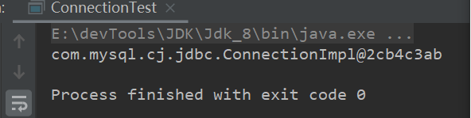

Mysql从0到0.9

此章节总结一些工具类，包括获取连接工具类，基础查询、更新方法。

工具：`idea`  `maven` `mysql`

> [上一篇、Mysql基础]()||[下一篇]()
>
> 代码资源：[源码]()

#### 数据库配置文件

> `db.properties``properties`是`java`常用的配置文件。
>
> 其他常用的包括`xml`、`yml`、甚至是`html`或自定义的。只要解析得出来了。
>
> 这里使用`properties` 因为`java`提供了解析`properties`配置文件的工具类，解析方便。

数据配置文件：

```properties
driver=com.mysql.cj.jdbc.Driver
url=jdbc:mysql://localhost:3306/mybatis_plus?useUnicode=true&charactEncoding=utf8&useSSL=true&serverTimezone=GMT%2B8
username=root
passwd=123456
```

> 时区和驱动按需修改。
>
> 使用`com.mysql.jdbc.Driver`？
>
> 是否加时区配置`serverTimezone=GMT%2B8`

#### 数据库获取连接工具类

```java
public class  JdbcConnectionUtil {
    private static String url;
    private static String userName;
    private static String pass;
    private static String driver;
    
    static {
        InputStream in = JdbcConnectionUtil.class.getClassLoader().getResourceAsStream("db.properties");
        Properties prop = new Properties();
        try {
            //配置加载进prop
            prop.load(in);
        } catch (IOException e) {
            e.printStackTrace();
        }
        //初始化配置
        driver = prop.getProperty("driver");
        userName = prop.getProperty("username");
        pass = prop.getProperty("passwd");
        url = prop.getProperty("url");
        //加载驱动
        try {
            Class.forName(driver);
        } catch (ClassNotFoundException e) {
            e.printStackTrace();
        }
    }
    
    public static Connection getConn() throws SQLException {
        return DriverManager.getConnection(url,userName,pass);
    }
}
```

> 使用`static`代码块保证数据库配置文件只加载一次，数据库驱动只注册一次。
>
> `Maven`项目编译过后配置文件都会放在类路径下也就是`classpath:`，通过类加载器加载。

测试：

```java
Connection conn = JdbcConnectionUtil.getConn();
System.out.println(conn);
conn.close();
```



测试无误，接下来封装关闭资源方法。

> 按需关闭资源即可

```java
public static void CloseSource(Connection conn, Statement statement, ResultSet resultSet){
    if (conn!=null){
        try {
            conn.close();
        } catch (SQLException e) {
            e.printStackTrace();
        }
    }if (statement!=null){
        try {
            statement.close();
        } catch (SQLException e) {
            e.printStackTrace();
        }
    }if (resultSet!=null){
        try {
            resultSet.close();
        } catch (SQLException e) {
            e.printStackTrace();
        }
    }
}
```

> `conn.close()`即可写成`JdbcConnectionUtil.CloseSource(conn,null,null);`

#### 封装基础sql工具类

> 包括查询方法，更新方法

```java
public static ResultSet query(Connection conn, PreparedStatement prep, ResultSet resultSet, Object[] params, String sql) {

    if (params == null || params.length == 0) {
        try {
            prep = conn.prepareStatement(sql);
            resultSet = prep.executeQuery();
        } catch (SQLException e) {
            e.printStackTrace();
        }
        return resultSet;
    }
    try {
        prep = conn.prepareStatement(sql);
        int index = 0;
        for (Object param : params) {
            prep.setObject(++index, param);
        }

        resultSet = prep.executeQuery();
    } catch (SQLException e) {
        e.printStackTrace();
    }
    return resultSet;
}

public static Integer update(Connection conn, PreparedStatement prep, Object[] params, String sql) {
    Integer rows = 0;
    if (params == null || params.length == 0) {
        try {
            rows = prep.executeUpdate();
        } catch (SQLException e) {
            e.printStackTrace();
        }
        return rows;
    }

    try {
        prep = conn.prepareStatement(sql);
        int index = 0;
        for (Object param : params) {
            prep.setObject(++index, param);
        }
        rows = prep.executeUpdate();
    } catch (SQLException e) {
        e.printStackTrace();
    }
    return rows;
}

public static Boolean insert(Connection conn, PreparedStatement prep, Object[] params, String sql) {
    Boolean flag = null;
    if (params == null || params.length == 0) {
        try {
            flag = prep.execute();
        } catch (SQLException e) {
            e.printStackTrace();
        }
        return flag;
    }

    try {
        prep = conn.prepareStatement(sql);
        int index = 0;
        for (Object param : params) {
            prep.setObject(++index, param);
        }
        flag = prep.execute();
    } catch (SQLException e) {
        e.printStackTrace();
    }
    return flag;
}
```

> 讲道理`update`和`insert`可以合并都使用`execute()`方法执行`sql`。但为了现实`update`行数，还是分开。

测试：

```java
public class DaoTest extends BaseDao {
    private static Connection conn;
    private static PreparedStatement prep;
    private static ResultSet resultSet;

    //查询所有部门
    public static List<Department> queryAllDept() throws SQLException {
        List<Department> depts = new ArrayList<>();
        Department department = null;
        String sql = "select * from department";
        conn = JdbcConnectionUtil.getConn();
        resultSet = query(conn, prep, resultSet, null, sql);

        while (resultSet.next()) {
            department = new Department();
            department.setDeptId((Integer) resultSet.getObject("deptId"));
            department.setDeptName((String) resultSet.getObject("deptName"));
            department.setDelete((Integer) resultSet.getObject("delete"));
            department.setCreate_time(Date.from(((LocalDateTime) resultSet.getObject("create_time")).atZone(ZoneId.systemDefault()).toInstant()));
            department.setModify_time(Date.from(((LocalDateTime) resultSet.getObject("modify_time")).atZone(ZoneId.systemDefault()).toInstant()));
            System.out.println(department.toString());
            depts.add(department);
        }
        JdbcConnectionUtil.CloseSource(conn, prep, resultSet);

        return depts;
    }

    //查询所有部门{1,2,3}
    public static List<Department> queryDept(Integer[] deptIds) throws SQLException {
        List<Department> depts = new ArrayList<>();
        Department department = null;
        String sql = "select * from department where deptId in (";
        for (int i = 0; i < deptIds.length; i++) {
            sql += "?, ";
        }
        sql = sql.substring(0, sql.lastIndexOf(","));
        sql += ")";
        conn = JdbcConnectionUtil.getConn();
        resultSet = query(conn, prep, resultSet, deptIds, sql);
        System.out.println(sql);
        while (resultSet.next()) {
            department = new Department();
            department.setDeptId((Integer) resultSet.getObject("deptId"));
            department.setDeptName((String) resultSet.getObject("deptName"));
            department.setDelete((Integer) resultSet.getObject("delete"));
            department.setCreate_time(Date.from(((LocalDateTime) resultSet.getObject("create_time")).atZone(ZoneId.systemDefault()).toInstant()));
            department.setModify_time(Date.from(((LocalDateTime) resultSet.getObject("modify_time")).atZone(ZoneId.systemDefault()).toInstant()));
            System.out.println(department.toString());
            depts.add(department);
        }
        JdbcConnectionUtil.CloseSource(conn, prep, resultSet);

        return depts;
    }

    //更新
    public static void update(Department dept){

        if(dept == null) return;
        List<Object> list = new ArrayList<>();
        list.add(dept.getDeptName());
        list.add(dept.getDeptId());
        Object[] params = list.toArray();
        conn = JdbcConnectionUtil.getConn();
        String sql = "update department set deptName = ?, " +
                "modify_time = current_timestamp " +
                "where deptId = ?";
        Integer rows = update(conn, prep, params, sql);
        System.out.println(rows);

    }

    //更新
    public static void insert(Department dept){
        if(dept == null) return;
        List<Object> list = new ArrayList<>();
        list.add(dept.getDeptName());
        Object[] params = list.toArray();
        conn = JdbcConnectionUtil.getConn();
        String sql = "insert into department(deptName) values(?) ";
        Boolean status = insert(conn, prep, params, sql);
        System.out.println(status);
    }

    public static void main(String[] args) throws SQLException {
        //查询所有
        //List<Department> departments = queryAllDept();
        //System.out.println(departments);

        // 查询 【1，2，3】
        //Integer[] deptIds = new Integer[]{1, 2, 3};
        //List<Department> departments = queryDept(deptIds);
        //System.out.println(departments);

        //更新
        //Department department = new Department();
        //department.setDeptName("新部门");
        //department.setDeptId(1);
        //update(department);
        //插入
        Department department = new Department();
        department.setDeptName("新添加部门");
        insert(department);
    }
}
```

> 可以都是可以的，存在优化空间。