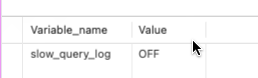
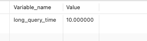
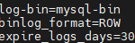
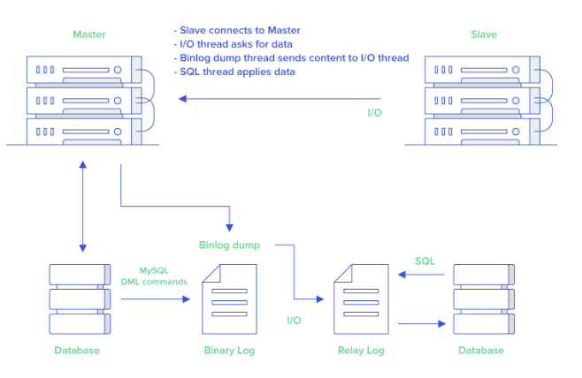
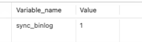
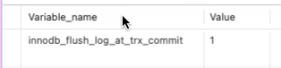
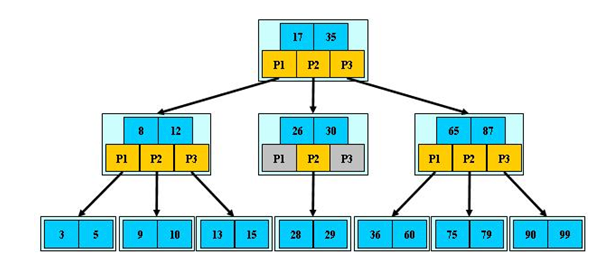
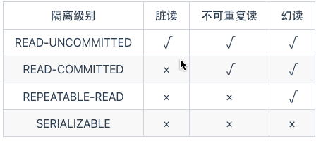
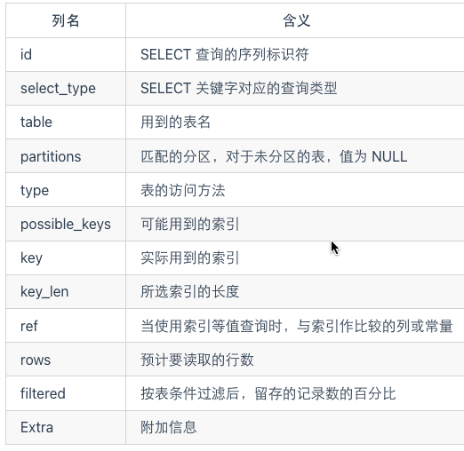

# Mysql总结

> 分两部分说明：理论和应用。

## 理论

### mysql中的日志


#### 常见日志

- 错误日志(error log): 
- ==二进制日志==(binlog): 记录更改数据库操作
- 一般查询日志(genneral  query  log )：所有sql记录，一般不建议开启
- 慢查询日志(slow query log): 执行超过 `long_query_time`的查询, 用于分析慢查询
- ==事务日志==(redolog & undolog): 重做日志和回滚日志
- 中继日志(relay log): 主从复制中从库接受 master的 binlog dump线程发过来的数据
- DDL日志: DDL执行的元数据


#### 慢查询日志

> 慢查询日志记录了执行时间超过 long_query_time（默认是 10s，通常设置为1s）的所有查询语句，在解决 SQL 慢查询（SQL 执行时间过长）问题的时候经常会用到。

可以通过 show variables like "slow_query_log";命令来查看慢查询日志是否开启，默认是关闭的。



long_query_time 参数定义了一个查询消耗多长时间才可以被定义为慢查询，默认是 10s，通过 SHOW VARIABLES LIKE '%long_query_time%'命令即可查看：




可以通过全局配置修改：

```sql
SET GLOBAL long_query_time=1
```


#### binlog

> binlog(binary log 即二进制日志文件) 主要记录了对 MySQL 数据库执行了更改的所有操作(数据库执行的所有 DDL 和 DML 语句)，包括表结构变更（CREATE、ALTER、DROP TABLE…）、表数据修改（INSERT、UPDATE、DELETE...），但不包括 SELECT、SHOW 这类不会对数据库造成更改的操作。

##### 开启binlog

> 修改my.conf配置文件。




##### binlog模式

- Statement 模式 ：每一条会修改数据的sql都会被记录在binlog中，如inserts, updates, deletes。
- Row 模式 （推荐）: 每一行的具体变更事件都会被记录在binlog中。
- Mixed 模式 ：Statement 模式和 Row 模式的混合。默认使用 Statement 模式，少数特殊具体场景自动切换到 Row 模式。

相比较于 Row 模式来说，Statement 模式下的日志文件更小，磁盘 IO 压力也较小，性能更好有些。不过，其准确性相比于 Row 模式要差。

你可以使用 show variables like '%binlog_format%'; 查看 binlog 使用的模式


##### binlog作用

> mysql主从数据同步



1主库将数据库中数据的变化写入到 binlog
2从库连接主库
3从库会创建一个 I/O 线程向主库请求更新的 binlog
4主库会创建一个 binlog dump 线程来发送 binlog ，从库中的 I/O 线程负责接收
5从库的 I/O 线程将接收的 binlog 写入到 relay log 中。
6从库的 SQL 线程读取 relay log 同步数据本地（也就是再执行一遍 SQL ）。


> Canal

1. Canal 模拟 MySQL Slave 节点与 MySQL Master 节点的交互协议，把自己伪装成一个 MySQL Slave 节点，向 MySQL Master 节点请求 binlog；
2. MySQL Master 节点接收到请求之后，根据偏移量将新的 binlog 发送给 MySQL Slave 节点；
3. Canal 接收到 binlog 之后，就可以对这部分日志进行解析，获取主库的结构及数据变更。


##### binlog 刷盘策略

对于InnoDB存储引擎而言，事务在执行过程中，会先把日志写入到binlog cache中，只有在事务提交的时候，才会把binlog cache中的日志持久化到磁盘上的binlog文件中。写入内存的速度更快，这样做也是为了效率考虑。

因为一个事务的binlog不能被拆开，无论这个事务多大，也要确保一次性写入，所以系统会给每个线程分配一个块内存作为binlog cache。我们可以通过binlog_cache_size参数控制单个线程 binlog cache 大小，如果存储内容超过了这个参数，就要暂存到磁盘（Swap）。

那么 binlog 是什么时候刷到磁盘中的呢？ 可以通过  sync_binlog 参数控制 biglog 的刷盘时机，取值范围是 0-N，默认为 0 ：

●0：不去强制要求，由系统自行判断何时写入磁盘；
●1：每次提交事务的时候都要将binlog写入磁盘；
●N：每 N 个事务，才会将binlog写入磁盘。

> 通过`show VARIABLES like 'sync_binlog'`查看mysql  binlog刷盘策略。




#### redolog

> mysql为了提升性能, 它大多数操作是在内存中以页为单位进行数据操作, 如果说某一时刻数据内存中页的数据没能写入磁盘mysql就宕机了,就会导致事务不能持久化。redolog就是为了解决这个问题,redolog会将内存中页内数据的修改记录, 并通过刷盘策略持久化到本地,这样即便内存中页内数据未能持久化到磁盘,在下次重启后也会根据redolog恢复数据。

查看刷盘策略：

1符合ACID,可以保障数据不丢失

show VARIABLES like 'innodb_flush_log_at_trx_commit'




##### binlog 和 redolog 有什么区别？

●binlog 主要用于数据库还原，属于数据级别的数据恢复，主从复制是 binlog 最常见的一个应用场景。redolog 主要用于保证事务的持久性，属于事务级别的数据恢复。
●redolog 属于 InnoDB 引擎特有的，binlog 属于所有存储引擎共有的，因为 binlog 是 MySQL 的 Server 层实现的。
●redolog 属于物理日志，主要记录的是某个页的修改。binlog 属于逻辑日志，主要记录的是数据库执行的所有 DDL 和 DML 语句。
●binlog 通过追加的方式进行写入，大小没有限制。redo log 采用循环写的方式进行写入，大小固定，当写到结尾时，会回到开头循环写日志。

#### undolog

> 每一个事务对数据的修改都会被记录到 undo log ，当执行事务过程中出现错误或者需要执行回滚操作的话，MySQL 可以利用 undo log 将数据恢复到事务开始之前的状态。
>
> undo log 属于逻辑日志，记录的是 SQL 语句，比如说事务执行一条 DELETE 语句，那 undo log 就会记录一条相对应的 INSERT 语句。

InnoDB存储引擎中 MVCC 的实现用到了 undo log 。当用户读取一行记录时，若该记录已经被其他事务占用，当前事务可以通过undo log读取之前的行版本信息，以此实现非锁定读取。

### 索引

##### B树 & B+树

###### B 树：为磁盘而生

B 树也称 B-树(其中-不是减号)，是为磁盘等辅存设备设计的多路平衡查找树，与二叉树相比，B 树的每个非叶节点可以有多个子树。  因此，当总节点数量相同时，B 树的高度远远小于 AVL 树和红黑树(B 树是一颗“矮胖子”)，磁盘 IO 次数大大减少。

定义 B 树最重要的概念是阶数(Order)，对于一颗 m 阶 B 树，需要满足以下条件：

●每个节点最多包含 m 个子节点。
●如果根节点包含子节点，则至少包含 2 个子节点；除根节点外，每个非叶节点至少包含 m/2 个子节点。
●拥有 k 个子节点的非叶节点将包含 k - 1 条记录。
●所有叶节点都在同一层中。

可以看出，B 树的定义，主要是对非叶结点的子节点数量和记录数量的限制。



###### B+树

B+树也是多路平衡查找树，其与 B 树的区别主要在于：

- B 树中每个节点(包括叶节点和非叶节点)都存储真实的数据,B+树中只有叶子节点存储真实的数据,非叶节点只存储键。
- B 树中一条记录只会出现一次，不会重复出现，而 B+树的键则可能重复重现——一定会在叶节点出现，也可能在非叶节点重复出现。
- B+树的叶节点之间通过双向链表链接。

由此，B+树与 B 树相比，有以下优势：

- 更少的 IO 次数
- 更适于范围查询
- 更稳定的查询效率：B 树的查询时间复杂度在 1 到树高之间(分别对应记录在根节点和叶节点)，而 B+树的查询复杂度则稳定为树高，因为所有数据都在叶节点。

B+树也存在劣势：由于键会重复出现，因此会占用更多的空间。但是与带来的性能优势相比，空间劣势往往可以接受，因此 B+树的在数据库中的使用比 B 树更加广泛。


> 分析一下B+它能力。
>
> Mysql B+树高度在2-4

Mysql基于B+树实现的索引, 每一个节点都以一个页(16kb)来保存, 假设一个节点内存1000个子节点, 一页就可以存1000个索引, 每个索引占16字节(参与索引的列长度不宜太长, 会导致B+树过高)。

叶子节点内子节点不仅包含索引信息还包含完备数据, 所以子节点个数较少, 假设100个。

对于一颗 3 层 B+树，第一层(根节点)有 1 个页面，可以存储 1000 条记录；第二层有 1000 个页面，可以存储 1000`*`1000条记录；第三层(叶节点)有1000`*`1000个页面，每个页面可以存储 100 条记录，因此可以存储 1000`*`1000`*`100 条记录，即 1 亿条。而对于二叉树，存储 1 亿条记录则需要 26 层左右。

### 事务

> 不可重复读和幻读有什么区别？

- 不可重复读的重点是内容修改或者记录减少比如多次读取一条记录发现其中某些记录的值被修改；
- 幻读的重点在于记录新增比如多次执行同一条查询语句（DQL）时，发现查到的记录增加了。


>  innoDB 有哪几类行锁？

InnoDB 行锁是通过对索引数据页上的记录加锁实现的，MySQL InnoDB 支持三种行锁定方式：

- **记录锁（Record Lock）**：也被称为记录锁，属于单个行记录上的锁。
- **间隙锁（Gap Lock）**：锁定一个范围，不包括记录本身。
- **临键锁（Next-Key Lock）**：Record Lock+Gap Lock，锁定一个范围，包含记录本身，主要目的是为了解决幻读问题（MySQL 事务部分提到过）。记录锁只能锁住已经存在的记录，为了避免插入新记录，需要依赖间隙锁。

**在 InnoDB 默认的隔离级别 REPEATABLE-READ 下，行锁默认使用的是 Next-Key Lock。但是，如果操作的索引是唯一索引或主键，InnoDB 会对 Next-Key Lock 进行优化，将其降级为 Record Lock，即仅锁住索引本身，而不是范围。**


##### 隔离级别

**READ-UNCOMMITTED(读取未提交)**：最低的隔离级别，允许读取尚未提交的数据变更，可能会导致脏读、幻读或不可重复读。

**READ-COMMITTED(读取已提交)**：允许读取并发事务已经提交的数据，可以阻止脏读，但是幻读或不可重复读仍有可能发生。

**REPEATABLE-READ(可重复读)**：对同一字段的多次读取结果都是一致的，除非数据是被本身事务自己所修改，可以阻止脏读和不可重复读，但幻读仍有可能发生。

**SERIALIZABLE(可串行化)**：最高的隔离级别，完全服从 ACID 的隔离级别。所有的事务依次逐个执行，这样事务之间就完全不可能产生干扰，也就是说，该级别可以防止脏读、不可重复读以及幻读。




### 优化

> 数据类型

- 如何存储ip
- 对于非负数值采用 无符号整型  UNSIGNED INT 0~4294967295(多一倍空间)  
- 避免 text和blob
- 尽量所有列都标记为  not null （利于索引）
- 使用timestamp存储时间 （相比于字符串占用空间小）

> 合理使用索引

- 单表索引上限5个，禁止为每一列都添加索引
- 禁止全文索引
- 主键使用自增而不是uuid、hash
- 出现在select、update、delete后 且出现在where后的列可以创建索引
- 包含在order by 、group by、distinct中的字段可以创建索引
- 联合索引,取代多个单个索引
- 联合索引, 区分度高的列放在区分度低的列之前
- 联合索引, 小字段的列放在大字段的列之前( 这样一页保存的索引多, io效率高)
- 使用频繁的列放在索引最左侧(较少建立索引)
- 避免重复创建索引  primary key(id)、index(id)、unique index(id)
- 避免出现冗余索引  index(a,b,c)、index(a,b)、index(a)

> 关于频繁查询优先考虑使用覆盖索引
>
> 覆盖索引：就是包含了所有查询字段 (where,select,order by,group by 包含的字段) 的索引

**覆盖索引的好处：**

- **避免 InnoDB 表进行索引的二次查询:** InnoDB 是以聚集索引的顺序来存储的，对于 InnoDB 来说，二级索引在叶子节点中所保存的是行的主键信息，如果是用二级索引查询数据的话，在查找到相应的键值后，还要通过主键进行二次查询才能获取我们真实所需要的数据。而在覆盖索引中，二级索引的键值中可以获取所有的数据，避免了对主键的二次查询 ，减少了 IO 操作，提升了查询效率。
- **可以把随机 IO 变成顺序 IO 加快查询效率:** 由于覆盖索引是按键值的顺序存储的，对于 IO 密集型的范围查找来说，对比随机从磁盘读取每一行的数据 IO 要少的多，因此利用覆盖索引在访问时也可以把磁盘的随机读取的 IO 转变成索引查找的顺序 IO。

> sql规范

- 禁止前置`%`
- 在定义联合索引时，如果 a 列要用到范围查找的话，就要把 a 列放到联合索引的右侧，使用 left join 或 not exists 来优化 not in 操作，因为 not in 也通常会使用索引失效。
- 禁止select `* `
  - 无法使用覆盖索引
  - io网络带宽压力较大
- 尽量避免数据类型隐式转化
  - 当操作符**左右两边的数据类型不一致**时，会发生**隐式转换**。
  - 当 where 查询操作符**左边为数值类型**时发生了隐式转换，那么对效率影响不大，但还是不推荐这么做。
  - 当 where 查询操作符**左边为字符类型**时发生了隐式转换，那么会导致索引失效，造成全表扫描效率极低。
  - 字符串转换为数值类型时，非数字开头的字符串会转化为`0`，以数字开头的字符串会截取从第一个字符到第一个非数字内容为止的值为转化结果。

- 尽量避免使用子查询,尽管mysql会进行优化但临时表的创建也是有成本的。可以使用join进行优化
- 避免多表join
- 使用批处理操作, 避免频繁连接
- 避免同列的or操作, 可使用in代替
- where从句禁止使用 函数进行转化和计算


> 注意点

- 存储引擎选择   Innodb
- 编码选择   utf8  如果有emjo等  选择 utf8mb4
- 表和字段都要添加注释
- 对于经常联表查询的字段放在一个表中(不用死遵守范式)
- 禁止线上数据库压测

 

> 如何分析sql

EXPLAIN  `select * from user where id = 1`




## 应用

