# redis

## 安装

> redis只有linux版本的，平常在windows下使用的是微软转译过的。
>
> 我是使用的linux版本： Ubuntu 22.04 ARM64
>
> 虚拟机选择：Parallels Desktop 18    或   租一个服务器

- 下载redis[官网下载](https://redis.io/download/)

- 移动到`/usr/local/src`下，并解压

  `mv  redis-6.2.6.tar.gz /usr/local/src/redis-6.2.6.tar.gz`

  `tar -xzf redis-6.2.6.tar.gz`

- 进入解压后的文件夹执行编译命令

  `make && make install`

### 启动redis方式

#### 默认启动

> redis编译好后会将`redis-server` 加入环境。直接执行redis-server即可。
>
> 这种启动属于`前台启动`，会阻塞整个会话窗口，窗口关闭或者按下`CTRL + C`则Redis停止。

进入`usr/local/bin`查看

```bash
cd /usr/local/bin
```

 		

#### 自定义配置文件

> 此方式，redis会以守护进程的方式启动。

修改redis配置文件（`/usr/local/src/redis-6.2.6/redis.conf`）：

修改前备份一下（`cp redis.conf  redis.conf.bak`）

```bash
##允许访问的地址，默认是127.0.0.1，会导致只能在本地访问。修改为0.0.0.0则可以在任意IP访问，生产环境不要设置为0.0.0.0
bind 0.0.0.0
# 守护进程，修改为yes后即可后台运行
daemonize yes 
requirepass 123123
```

```bash
port 6379
# 工作目录，默认是当前目录，也就是运行redis-server时的命令，日志.持久化等文件会保存在这个目录
dir .
# 数据库数量，设置为1，代表只使用1个库，默认有16个库，编号0~15
databases 1
# 设置redis能够使用的最大内存
maxmemory 512mb
# 日志文件，默认为空，不记录日志，可以指定日志文件名
logfile "redis.log"
```

启动redis：

```bash
redis-server redis.conf
```


#### 注册redis服务&开机自启

首先，新建一个系统服务文件：

```sh
vi /etc/systemd/system/redis.service
```

```bash
[Unit]
Description=redis-server
After=network.target

[Service]
Type=forking
ExecStart=/usr/local/bin/redis-server /usr/local/src/redis-6.2.6/redis.conf
PrivateTmp=true

[Install]
WantedBy=multi-user.target
```

然后重载系统服务：

```sh
systemctl daemon-reload
```

现在，我们可以用下面这组命令来操作redis了：

```sh
# 启动
systemctl start redis
# 停止
systemctl stop redis
# 重启
systemctl restart redis
# 查看状态
systemctl status redis
```

执行下面的命令，可以让redis开机自启：

```sh
systemctl enable redis
```


### redis客户端

- redis-cli 自带的命令行客户端
- 图形化客户端
- 各种编程客户端

#### redis-cli

Redis安装完成后就自带了命令行客户端：redis-cli，使用方式如下：

```sh
redis-cli [options] [commonds]
```

其中常见的options有：

- `-h 127.0.0.1`：指定要连接的redis节点的IP地址，默认是127.0.0.1
- `-p 6379`：指定要连接的redis节点的端口，默认是6379
- `-a 123321`：指定redis的访问密码 

其中的commonds就是Redis的操作命令，例如：

- `ping`：与redis服务端做心跳测试，服务端正常会返回`pong`

不指定commond时，会进入`redis-cli`的交互控制台：


#### 图形化客户端

> `quickredis`能用

[下载地址](https://github.com/quick123official/quick_redis_blog/releases/)


### Docker安装Redis

#### docker拉取镜像

```bash
➜  ~ docker pull redis:latest
```

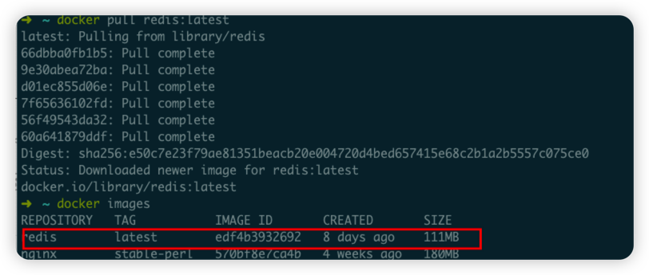

#### redis配置

> 创建redis的挂载目录,包括配置目录和数据目录。

```bash
➜  home cd ~
➜  ~ mkdir -p ~/home/redis/conf  ## redis配置存放目录
➜  ~ mkdir -p ~/home/redis/data  ## redis数据存放目录，挂载配置后，持久化文件会放在这里
```

> 配置redis
>
> [官网配置模版](https://redis.io/docs/management/config/),对应好版本,这里的redis版本为7.0。复制下来

创建配置文件：

```bash
➜  ~ cd home/redis/conf
➜  conf touch redis.conf
```

复制官网配置文件进去：

修改几个配置

```bash
# bind 127.0.0.1 -::1   ## 这个配置注掉,表示只允许本机连接。或修改为 bind 0.0.0.0
daemonize no
requirepass 123123 ## 设置密码
```

#### 启动redis

> -d --privileged=true 使得容器内root拥有真正的root权限
>
> --appendonly yes   开启持久化  或者在配置文件中修改为`appendonly yes`

```shell
docker run -d --privileged=true -p 6380:6379 
-v /Users/rolyfish/home/redis/conf/redis.conf:/etc/redis/redis.conf 
-v /Users/rolyfish/home/redis/data:/data 
--name testredis redis redis-server /etc/redis/redis.conf 
--appendonly yes
```

> docker ps 即可查看正在运行的redis容器

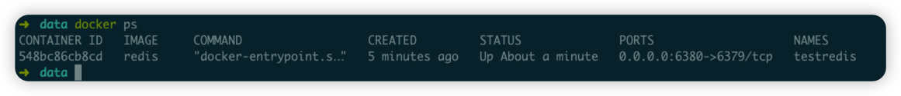

> 交互模式进入容器,并使用redis客户端redis-cli

```shell
➜  data docker exec -it testredis /bin/bash
root@548bc86cb8cd:/data# redis-cli
127.0.0.1:6379> info
NOAUTH Authentication required.
127.0.0.1:6379> auth 123123
OK
127.0.0.1:6379> set name yuyc
OK
127.0.0.1:6379> get name
"yuyc"
```

#### 远程连接

> 配置ip和端口即可链接成功。

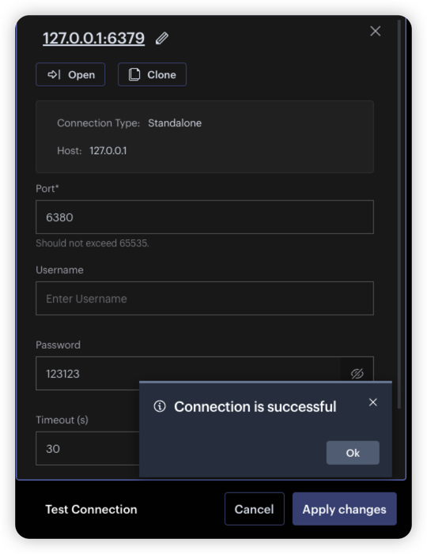

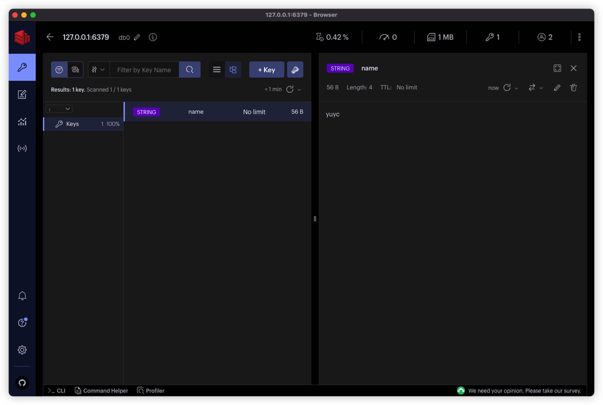


## 常用命令


### redis命令查询

> 如何查询redis命令：

- 官网查询
- 命令查询

[官网](https://redis.io/commands/)

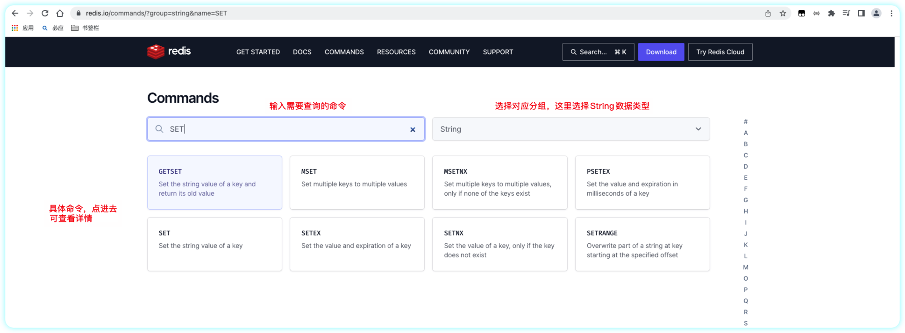

> 官网给出的命令详情非常详细，命令行也可以给出命令简单信息：

`help`命令

```bash
127.0.0.1:6379> help
redis-cli 6.2.6
To get help about Redis commands type:
      "help @<group>" to get a list of commands in <group>
      "help <command>" for help on <command>
      "help <tab>" to get a list of possible help topics
      "quit" to exit
```

`help @group`:查看某一分组的所有命令

```bash
127.0.0.1:6379> help @String
  APPEND key value
  summary: Append a value to a key
  since: 2.0.0
  BITCOUNT key [start end]
  summary: Count set bits in a string
  since: 2.6.0
  BITFIELD key [GET type offset] [SET type offset value] [INCRBY type offset increment] [OVERFLOW WRAP|SAT|FAIL]
  summary: Perform arbitrary bitfield integer operations on strings
  since: 3.2.0
  
.....
```

`help command `：查看某一具体命令

```bash
127.0.0.1:6379> help set
  SET key value [EX seconds|PX milliseconds|EXAT timestamp|PXAT milliseconds-timestamp|KEEPTTL] [NX|XX] [GET]
  summary: Set the string value of a key
  since: 1.0.0
  group: string
```


### 通用命令

常用通用命令一般都是对key进行操作：

- KEYS：查看符合模板的所有key
- DEL：删除一个指定的key
- EXISTS：判断key是否存在
- EXPIRE：给一个key设置有效期，有效期到期时该key会被自动删除
- TTL：查看一个KEY的剩余有效期
- flushdb  删除当前数据库所有key
- flushshall  删除所有数据库所有key

例如：

```bash
127.0.0.1:6379> keys k*
1) "k3"
2) "k2"
3) "k1"
```

```bash
127.0.0.1:6379> del k1 k2
(integer) 2
127.0.0.1:6379> keys * 
1) "k3"
```

```bash
127.0.0.1:6379> EXISTS k1 k2 k3
(integer) 1
# 只有一个k3存在
```

`expire`只会对存在的key生效：

设置过期时间的key过期后ttl值为-2

不设置过期时间的key，也就是永久有效，ttl值为-1

```bash
127.0.0.1:6379> EXPIRE k1 10
(integer) 0
127.0.0.1:6379> ttl k1
(integer) -2
127.0.0.1:6379> EXPIRE k3 10
(integer) 1
127.0.0.1:6379> ttl k3
(integer) 5
127.0.0.1:6379> ttl k3
(integer) 1
127.0.0.1:6379> ttl k3
(integer) -2
127.0.0.1:6379> ttl k3
(integer) -2
```

### 基本数据类型

#### String

String类型，也就是字符串类型，是Redis中最简单的存储类型。

其value是字符串，不过根据字符串的格式不同，又可以分为3类：

* string：普通字符串
* int：整数类型，可以做自增.自减操作
* float：浮点类型，可以做自增.自减操作

String的常见命令有：

* SET：添加或者修改已经存在的一个String类型的键值对
* GET：根据key获取String类型的value
* MSET：批量添加多个String类型的键值对
* MGET：根据多个key获取多个String类型的value
* INCR：让一个整型的key自增1
* INCRBY:让一个整型的key自增并指定步长，例如：incrby num 2 让num值自增2
* INCRBYFLOAT：让一个浮点类型的数字自增并指定步长
* SETNX：添加一个String类型的键值对，前提是这个key不存在，否则不执行
* SETEX：添加一个String类型的键值对，并且指定有效期

example：

> set命令：如果key不存在则设置值，如果key存在则更新值

```bash
127.0.0.1:6379> set name yuyc
OK
127.0.0.1:6379> get name
"yuyc"
127.0.0.1:6379> set name yuycnew
OK
127.0.0.1:6379> get name
"yuycnew"
```

> MSET key value [key value....]
>
> MGET key [key ......]

```bash
127.0.0.1:6379> MSET k1 v1 k2 v2 k3 v3
OK
127.0.0.1:6379> MGET k1 k2 k3
1) "v1"
2) "v2"
3) "v3"
```

> Incr 命令，对存储的整数自增1
>
> incrby key increment ,对存储的整数自增,并指定步长
>
> INCRBYFLOAT key  increment

```bash
127.0.0.1:6379> set age 22
OK
127.0.0.1:6379> INCR age 
(integer) 23
127.0.0.1:6379> INCR age 
(integer) 24
127.0.0.1:6379> INCRBY age 2
(integer) 26
127.0.0.1:6379> INCRBYFLOAT age 0.1
"26.1"
```

> setnx key value 当key不存在添加key，当key存在添加失败
>
> setex 添加key并指定过期时间，等同于set key value ex secends

```bash
127.0.0.1:6379> setnx age 22
(integer) 0
127.0.0.1:6379> setex age 10 22
OK
127.0.0.1:6379> ttl age
(integer) 3
127.0.0.1:6379> ttl age
(integer) -2
127.0.0.1:6379> set age 10 ex 10
OK
```

##### 层次结构

> redis是一个key-value形式的存储结构，不允许存在重复key值，往往会有冲突。
>
> 通过为key添加前缀解决冲突。

```bash
127.0.0.1:6379> set test:user:1 '{"name":lizicheng","age":33}'
OK
127.0.0.1:6379> set test:user:2 '{"name":yuyc","age":22}'
OK
127.0.0.1:6379> set test:dept:1 '{"name":"dept1",num:1}'
OK
127.0.0.1:6379> set test:dept:2 '{"name":"dept2",num:100}'
OK
```

在redis-cli这里key值如下：

```bash
127.0.0.1:6379> keys test*
1) "test:user:1"
2) "test:dept:2"
3) "test:dept:1"
4) "test:user:2"
```

但是在quickredis中可分层次：


#### hash

> 使用String存储json字符串，不利于修改每一属性的值。使用redis的hash数据结构可对每一个属性单独存储，操作起来简单许多。

**Hash类型的常见命令**

- HSET key field value：添加或者修改hash类型key的field的值

- HGET key field：获取一个hash类型key的field的值

- HMSET：批量添加多个hash类型key的field的值   ( 现等同于HSET命令 )

- HMGET：批量获取多个hash类型key的field的值

- HGETALL：获取一个hash类型的key中的所有的field和value
- HKEYS：获取一个hash类型的key中的所有的field
- HINCRBY:让一个hash类型key的字段值自增并指定步长
- HSETNX：添加一个hash类型的key的field值，前提是这个field不存在，否则不执行


> HSET key field value [field value ....]  等同于  HMSET   （跟版本有关，有些版本hset不可批量设置）
>
> HGET key field
>
> HMGET key field [field ....]

```bash
127.0.0.1:6379> hset test:huser:1 name yuyc age 22
(integer) 2
127.0.0.1:6379> hset test:huser:2 name liziceng age 22
(integer) 2
127.0.0.1:6379> hget test:huser:1 name
"yuyc"
127.0.0.1:6379> HMGET test:huser:1 name age
1) "yuyc"
2) "22"
```


> HGETALL key 。
>
> 类似于HashMap的Entities

```bash
127.0.0.1:6379> HGETALL test:huser:1
1) "name"
2) "yuyc"
3) "age"
4) "22"
```


> HKEYS key     获取所有属性
>
> HVALS key     获取所有值

```bash
127.0.0.1:6379> hkeys test:huser:1
1) "name"
2) "age"
127.0.0.1:6379> HVALS test:huser:1
1) "yuyc"
2) "22"
```

#### list

Redis中的List类型与Java中的LinkedList类似，可以看做是一个双向链表结构。既可以支持正向检索和也可以支持反向检索。

特征也与LinkedList类似：

* 有序
* 元素可以重复
* 插入和删除快
* 查询速度一般

常用来存储一个有序数据，例如：朋友圈点赞列表，评论列表等。

**List的常见命令有：**

- LPUSH key element ... ：向列表左侧插入一个或多个元素
- LPOP key：移除并返回列表左侧的第一个元素，没有则返回nil
- RPUSH key element ... ：向列表右侧插入一个或多个元素
- RPOP key：移除并返回列表右侧的第一个元素
- LRANGE key star end：返回一段角标范围内的所有元素 (end 为 -1 代表返回start之后所有元素) 
- BLPOP和BRPOP(阻塞效果)：与LPOP和RPOP类似，只不过在没有元素时等待指定时间，而不是直接返回nil

```bash
127.0.0.1:6379> lpush ids 1 2 3
(integer) 3
127.0.0.1:6379> rpush ids -1 -2 -3
(integer) 6
127.0.0.1:6379> lrange ids 0 -1
1) "3"
2) "2"
3) "1"
4) "-1"
5) "-2"
6) "-3"
127.0.0.1:6379> lpop ids 2
1) "3"
2) "2"
127.0.0.1:6379> rpop ids 2
1) "-3"
2) "-2"
127.0.0.1:6379> lrange ids 0 -1
1) "1"
2) "-1"
## 没有元素 等待 30 再返回nil
127.0.0.1:6379> blpop l1 30
(nil)
(30.05s)
```

#### set

Redis的Set结构与Java中的HashSet类似，可以看做是一个value为null的HashMap。因为也是一个hash表，因此具备与HashSet类似的特征：

* 无序
* 元素不可重复
* 查找快
* 支持交集.并集.差集等功能

**Set类型的常见命令**

* SADD key member ... ：向set中添加一个或多个元素
* SREM key member ... : 移除set中的指定元素
* SCARD key： 返回set中元素的个数
* SISMEMBER key member：判断一个元素是否存在于set中
* SMEMBERS：获取set中的所有元素
* SINTER key1 key2 ... ：求key1与key2的交集
* SDIFF key1 key2 ... ：求key1与key2的差集
* SUNION key1 key2 ..：求key1和key2的并集

```bash
127.0.0.1:6379> sadd c1 a b c 
(integer) 3
127.0.0.1:6379> srem c1 c
(integer) 1
# 不可重复添加
127.0.0.1:6379> sadd c1 a
(integer) 0
127.0.0.1:6379> scard c1
(integer) 2
127.0.0.1:6379> SMEMBERS c1
1) "a"
2) "b"
127.0.0.1:6379> SISMEMBER c1 a
(integer) 1
127.0.0.1:6379> sadd c2 b c d
(integer) 3
# 交集
127.0.0.1:6379> SINTER c1 c2
1) "b"
# 并集
127.0.0.1:6379> SUNION c1 c2 
1) "c"
2) "a"
3) "b"
4) "d"
# 差集
127.0.0.1:6379> SDIFF c1 c2
1) "a"
```

#### sortedset

Redis的SortedSet是一个可排序的set集合，与Java中的TreeSet有些类似，但底层数据结构却差别很大。SortedSet中的每一个元素都带有一个score属性，可以基于score属性对元素排序，底层的实现是一个跳表（SkipList）加 hash表。

SortedSet具备下列特性：

- 可排序
- 元素不重复
- 查询速度快

因为SortedSet的可排序特性，经常被用来实现排行榜这样的功能。

SortedSet的常见命令有：

- ZADD key score member：添加一个或多个元素到sorted set ，如果已经存在则更新其score值
- ZREM key member：删除sorted set中的一个指定元素
- ZSCORE key member : 获取sorted set中的指定元素的score值
- ZRANK key member：获取sorted set 中的指定元素的排名
- ZCARD key：获取sorted set中的元素个数
- ZCOUNT key min max：统计score值在给定范围内的所有元素的个数
- ZINCRBY key increment member：让sorted set中的指定元素自增，步长为指定的increment值
- ZRANGE key min max：按照score排序后，获取指定排名范围内的元素
- ZRANGEBYSCORE key min max：按照score排序后，获取指定score范围内的元素
- ZDIFF.ZINTER.ZUNION：求差集.交集.并集

注意：所有的排名默认都是升序，如果要降序则在命令的Z后面添加REV即可，例如：

- **升序**获取sorted set 中的指定元素的排名：ZRANK key member
- **降序**获取sorted set 中的指定元素的排名：ZREVRANK key memeber


```bash
127.0.0.1:6379> zadd zsx 30 yuyc1 20 yuyc2 40 yuyc3 55 yuyc4 5 yuyc5
(integer) 5
127.0.0.1:6379> ZREM zsx yuyc1
(integer) 1
##  zrange key min max 获取指定名次
127.0.0.1:6379> zrange zsx 0 -1
1) "yuyc5"
2) "yuyc2"
3) "yuyc3"
4) "yuyc4"
127.0.0.1:6379> ZSCORE zsx yuyc2
## 返回指定成员排名  从0开始
127.0.0.1:6379> zrank zsx yuyc2
(integer) 1
## 返回成员个数
127.0.0.1:6379> zcard zsx
(integer) 4
## 返回指定分数范围内的成员个数
127.0.0.1:6379> zcount zsx 0 40
(integer) 3
## 给指定成员分数加3
127.0.0.1:6379> ZINCRBY zsx 3 yuyc2
"23"
## 返回指定分数范围内的成员  对比 zrange 
127.0.0.1:6379> ZRANGEBYSCORE zsx 0 40
1) "yuyc5"
2) "yuyc2"
3) "yuyc3"

## 升序 降序获取成员排名
127.0.0.1:6379> zrank zsx yuyc2
(integer) 1
127.0.0.1:6379> ZREVRANK zsx yuyc2
(integer) 2
```


### 特殊类型


## redis客户端

### jedis

> redis  java客户端之一 ----jedis

[redis客户端](https://redis.io/resources/clients/#java)

测试链接：

```java
@Test
public void test() {
   final Jedis jedis = new Jedis("10.211.55.4", 6379);
   jedis.auth("123123");
   jedis.set("key", "value");
   System.out.println(jedis.get("key"));
}
```


### jedis连接池

> jedis连接

```java
public class JedisFactory {
    private static JedisPool pool;

    static {

        final GenericObjectPoolConfig<Jedis> config = new GenericObjectPoolConfig<>();
        // 最大连接数
        config.setMaxTotal(10);
        // 最大空闲连接
        config.setMaxIdle(10);
        // 最小空闲连接
        config.setMinIdle(1);
        // 等待时长
        config.setMaxWait(Duration.ofMillis(2000));
        // 从连接池得到连接前会进行校验，校验不通过则销毁当前连接，并借用一个新的连接
        config.setTestOnBorrow(true);
        // 返回结果前对链接进行校验，校验不通过则销毁当前连接
        config.setTestOnReturn(true);
        pool = new JedisPool(config, "10.211.55.4", 6379, 6000, "123123");
    }
    public static Jedis jedis() {
        return pool.getResource();
    }
    public static void close(Jedis jedis) {
        jedis.close();
    }
}
```

```java
@Test
public void jedisPool(){
    final Jedis jedis = JedisFactory.jedis();
    System.out.println(jedis.get("key"));
  	// 这里close方法不再是关闭资源，而是将连接归还连接池
    JedisFactory.close(jedis);
}
```

### SpringDataRedis-客户端


#### 基础

> SpringData是Spring中数据操作的模块，包含对各种数据库的集成，其中对Redis的集成模块就叫做SpringDataRedis，官网地址：https://spring.io/projects/spring-data-redis

* 提供了对不同Redis客户端的整合（Lettuce和Jedis）
* 提供了RedisTemplate统一API来操作Redis - --标准
* 支持Redis的发布订阅模型
* 支持Redis哨兵和Redis集群
* 支持基于Lettuce的响应式编程
* 支持基于JDK.JSON.字符串.Spring对象的数据序列化及反序列化  -- 自动转化
* 支持基于Redis的JDKCollection实现

#### redisTemplate

SpringDataRedis中提供了RedisTemplate工具类，其中封装了各种对Redis的操作。并且将不同数据类型的操作API封装到了不同的类型中：

| **API**                         | **返回值类型**  | **说明**              |
| ------------------------------- | --------------- | --------------------- |
| **redisTemplate**.opsForValue() | ValueOperations | 操作String类型数据    |
| **redisTemplate**.opsForHash()  | HashOperations  | 操作Hash类型数据      |
| **redisTemplate**.opsForList()  | ListOperations  | 操作List类型数据      |
| **redisTemplate**.opsForSet()   | SetOperations   | 操作Set类型数据       |
| **redisTemplate**.opsForZSet()  | ZSetOperations  | 操作SortedSet类型数据 |
| **redisTemplate**               |                 | 通用的命令            |

#### Spring配置

想要通过IOC注册并使用RedisTemplate，必须先了解以下两个接口 `org.springframework.data.redis.connection` package and its `RedisConnection` and `RedisConnectionFactory` interfaces for working with and retrieving active connections to Redis.

- RedisConnection
- RedisConnectionFactory

> RedisConnectionFactory接口下有两个实现类JedisConnectionFactory和LettuceConnectionFactory。

##### xml配置

```xml
<!--  如果redis设置密码，reids客户端需要auth命令验证，这里也需要配置  -->
<bean id="redisPass" class="org.springframework.data.redis.connection.RedisPassword">
    <constructor-arg value="123123"/>
</bean>
<bean id="redisStandaloneConfiguration"
      class="org.springframework.data.redis.connection.RedisStandaloneConfiguration">
    <!--        <property name="hostName" value="10.211.55.4"/>-->
    <property name="hostName" value="127.0.0.1"/>
    <property name="port" value="6379"/>
    <!--        <property name="password" ref="redisPass"/>-->
</bean>

<!--  不设置则使用默认连接池配置  -->
<bean id="jedisPoolConfig" class="org.apache.commons.pool2.impl.GenericObjectPoolConfig">
        <!--    最大连接数    -->
        <property name="maxTotal" value="10"/>
        <!--    最大空闲连接    -->
        <property name="maxIdle" value="10"/>
        <!--    最小空闲连接    -->
        <property name="minIdle" value="1"/>
        <!--    没有连接，等待时长    -->
        <property name="maxWaitMillis" value="1000"/>
        <!--        获取连接前对连接进行校验，校验不通过则销毁当前连接，重新借一个新的连接-->
        <property name="testOnBorrow" value="true"/>
        <property name="testOnReturn" value="true"/>
    </bean>
</bean>

<bean id="jedisClientConfiguration"
      class="org.springframework.data.redis.connection.jedis.JedisConnectionFactory.MutableJedisClientConfiguration">
    <property name="poolConfig" ref="jedisPoolConfig"/>
</bean>

<bean id="jedisConnectionFactory" class="org.springframework.data.redis.connection.jedis.JedisConnectionFactory">
    <constructor-arg ref="redisStandaloneConfiguration"/>
    <constructor-arg ref="jedisClientConfiguration"/>
</bean>

<bean id="redisTemplate" class="org.springframework.data.redis.core.RedisTemplate">
    <property name="connectionFactory" ref="jedisConnectionFactory"/>
</bean>
```

验证：

```java
@Test
public void test1() {
    final ApplicationContext app = new ClassPathXmlApplicationContext("classpath:application.xml");
    final String[] beanDefinitionNames = app.getBeanDefinitionNames();
    for (String beanDefinitionName : beanDefinitionNames) {
        System.out.println(beanDefinitionName);
    }
    final RedisTemplate redisTemplate = app.getBean(RedisTemplate.class);
    final ValueOperations<String,String> valueOperations = redisTemplate.opsForValue();
    valueOperations.set("redistemplate", "value");
    System.out.println(valueOperations.get("redistemplate"));
}
```


##### javaconfig配置

```java
public class RedisConfigration {

    public @Bean RedisPassword redisPassword() {
        return RedisPassword.of("123123");
    }
    public @Bean RedisStandaloneConfiguration redisStandaloneConfiguration(@Autowired RedisPassword redisPassword) {
        final RedisStandaloneConfiguration redisStandaloneConfiguration = new RedisStandaloneConfiguration();
        // redisStandaloneConfiguration.setPassword(redisPassword);
        redisStandaloneConfiguration.setHostName("127.0.0.1");
        // redisStandaloneConfiguration.setHostName("10.211.55.4");
        redisStandaloneConfiguration.setPort(6379);
        return redisStandaloneConfiguration;
    }
    public @Bean JedisConnectionFactory jedisConnectionFactory(@Autowired RedisStandaloneConfiguration redisStandaloneConfiguration) {
        return new JedisConnectionFactory(redisStandaloneConfiguration);
    }

    public @Bean RedisTemplate redisTemplate(@Autowired JedisConnectionFactory jedisConnectionFactory) {
        final RedisTemplate redisTemplate = new RedisTemplate();
        redisTemplate.setConnectionFactory(jedisConnectionFactory);
        return redisTemplate;
    }
}
```

验证：

```java
@Test
public void test2() {
    final ApplicationContext app = new AnnotationConfigApplicationContext(RedisConfigration.class);
    final String[] beanDefinitionNames = app.getBeanDefinitionNames();
    for (String beanDefinitionName : beanDefinitionNames) {
        System.out.println(beanDefinitionName);
    }
    final RedisTemplate redisTemplate = app.getBean(RedisTemplate.class);
    final ValueOperations valueOperations = redisTemplate.opsForValue();
    System.out.println(valueOperations.get("redistemplate"));
}
```


##### redis支持自定义范型

> redisTemplate 可设置范型。
>
> 设置范型需要配合序列化工具使用

```java
/**
 * 对非string的key和value 需要设置序列化工具
 */
@Test
public void test3() {
    final ApplicationContext app = new AnnotationConfigApplicationContext(RedisConfigration.class);

    final RedisTemplate redisTemplate = app.getBean(RedisTemplate.class);
    GenericJackson2JsonRedisSerializer jsonRedisSerializer = new GenericJackson2JsonRedisSerializer();
    redisTemplate.setKeySerializer(RedisSerializer.string());
    redisTemplate.setHashKeySerializer(RedisSerializer.string());
    redisTemplate.setValueSerializer(jsonRedisSerializer);
    redisTemplate.setHashValueSerializer(jsonRedisSerializer);

    final ListOperations<String, User> listOperations = redisTemplate.opsForList();
    final List<User> users = Arrays.asList(new User("李自成", 21), new User("李自成", 21));
    final Long count = listOperations.leftPushAll("users", users);
    System.out.println(count);

    final List<User> users2 = listOperations.range("users",0,listOperations.size("users"));
    users2.forEach(System.out::println);
    
    final User users1 = listOperations.leftPop("users");
    System.out.println(users1);
}
```


#### SpringBoot配置

依赖：

```xml
<!--redis依赖-->
<dependency>
    <groupId>org.springframework.boot</groupId>
    <artifactId>spring-boot-starter-data-redis</artifactId>
    <version>2.6.6</version>
</dependency>
```

配置：

```yml
spring:
 redis:
#    host: 10.211.55.4
    host: 127.0.0.1
    port: 6379
#    password: 123123
#    SpringBoot默认使用lettuce实现,必须配置否则连接池不生效
    lettuce:
      pool:
        max-active: 8  #最大连接
        max-idle: 8   #最大空闲连接
        min-idle: 0   #最小空闲连接
        max-wait: 100ms #连接等待时间
```


验证：

```java
public static void main(String[] args) {
    final ApplicationContext app = SpringApplication.run(RedisDemoApplication.class, args);
    //打印beannames
    final String[] beanNames = app.getBeanDefinitionNames();
    for (String beanName : beanNames) {
        System.out.println(beanName);
    }
    /**
     * 得到redisTemplate并进行插入查询操作
     */
    final RedisTemplate redisTemplate = app.getBean("redisTemplate",RedisTemplate.class);
    final ValueOperations<String,Object> valueOperations = redisTemplate.opsForValue();
    valueOperations.set("name","李自成");
    final Object name = valueOperations.get("name");
    log.info("name:{}",name);
}
```


##### 序列化

###### jdk

> `SpringBootDate`支持自动将key、value以及hash结构，序列化和反序列化。
>
> `SpringBoot`默认使用的是Jdk序列化工具

例子：

```java
@Autowired
RedisTemplate redisTemplate;

@Test
public void testRedisTemplateSerializer() {
    final ValueOperations valueOperations = redisTemplate.opsForValue();
    valueOperations.set("name", "李自成");
    final String name = (String) valueOperations.get("name");
    System.out.println("name=" + name);
}
```

通过redis-cli查看对应值：


> 通过查看`redisTemplate`的源码发现如果`redisTemplate`的默认序列化工具为空，则默认使用JDK序列化工具。
>
> 使用默认(JDK)序列化工具的缺点：
>
> - 可读性差
> - 占内存

```java
public void afterPropertiesSet() {
   if (defaultSerializer == null) {

      defaultSerializer = new JdkSerializationRedisSerializer(
            classLoader != null ? classLoader : this.getClass().getClassLoader());
   }
}
```

###### json

> 不使用默认的`RedisTemlate`，我们选择手动注入自定义`RedisTemplate`，并设置其key-value的序列化工具。

```java
@Configuration
public class RedisConfig {
/**
    * 注册redisTemplate 并设置序列化工具
    * @param connectionFactory
    * @return
*/
public @Bean RedisTemplate<String, Object> redisTemplate(@Autowired RedisConnectionFactory connectionFactory){
    // 创建RedisTemplate对象
    RedisTemplate<String, Object> template = new RedisTemplate<>();
    // 设置连接工厂
    template.setConnectionFactory(connectionFactory);
    // 创建JSON序列化工具
    GenericJackson2JsonRedisSerializer jsonRedisSerializer = new GenericJackson2JsonRedisSerializer();
    // 设置Key的序列化
    template.setKeySerializer(RedisSerializer.string());
    template.setHashKeySerializer(RedisSerializer.string());
    // 设置Value的序列化
    template.setValueSerializer(jsonRedisSerializer);
    template.setHashValueSerializer(jsonRedisSerializer);
    // 返回
    return template;
}
```

这样对于key和value，就不会使用JDK序列化工具了

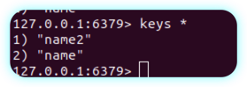


> 优点就是可读性强。缺点就是自动序列化时会夹带类信息，浪费存储空间。


###### stringRedisTemplate

> 无论是key和value都看成字符串进行处理，需要手动序列化和反序列化。

```java
@Test
public void testStringRedisTemplate() {
    final ValueOperations<String, String> valueOperation = stringRedisTemplate.opsForValue();
    // 序列化
    final User user = User.builder().age(22).name("李自成").build();
    final String userStr = JSON.toJSONString(user);
    valueOperation.set("user:1", userStr);
    // 反序列化
    final String s = valueOperation.get("user:1");
    final User user1 = JSON.parseObject(s, User.class);
    log.info("user1:" + user1);
}
```


测试opsForHash,HashOptions的api和HashMap的api相似，而不是以命令命名。

```java
@Test
void testHash() {
    stringRedisTemplate.opsForHash().put("user:400", "name", "李自成");
    stringRedisTemplate.opsForHash().put("user:400", "age", "21");

    Map<Object, Object> entries = stringRedisTemplate.opsForHash().entries("user:400");
    System.out.println("entries = " + entries);
}
```

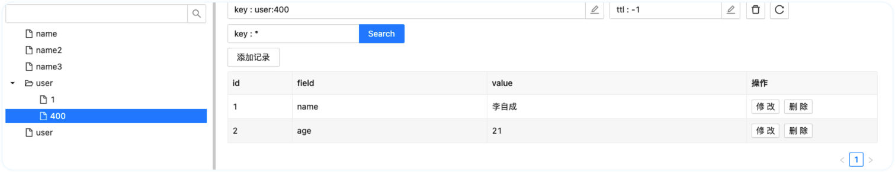


<hr>

## 黑马点评项目


### homebrew安装nginx

> 通过homebrew安装nginx

#### 安装命令

```bash
brew install nginx
```

#### 查看nginx安装信息

```bash
brew info nginx
```

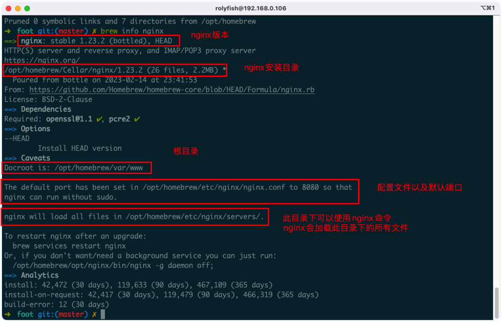

#### 启动nginx

> 启动nginx并访问`http://localhost:8080`

```bash
brew services start nginx
```


#### nginx部署前端项目


##### 配置文件

> nginx配置文件为nginx.conf，分别为**全局块、events块和http块**，在http块中，又包含http全局块、多个server块。每个server块中，可以包含server全局块和多个location块。在同一配置块中嵌套的配置块，各个之间不存在次序关系。
>
> 绝大多数指令不是特定属于某一个块的。同一个指令放在不同层级的块中，其作用域也不同，一般情况下，高层块中的指令可做用于低层级块。如果某个指令在两个不同层级的块中同时出现，则采用“就近原则”，即以较低层级块中的配置为准。

```json
ngnix.confg:{
  xxxx
	events:{
	},
  http:{
    xxxx
    location:{
    }
  }
}
```

###### 全局块

- user

  ```bash
  # 指定可以运行nginx服务的用户和用户组，只能在全局块配置
  # user [user] [group]
  # 将user指令注释掉，或者配置成nobody的话所有用户都可以运行
  # user nobody nobody;
  
  # 指定工作线程数，可以制定具体的进程数，也可使用自动模式，这个指令只能在全局块配置
  # worker_processes number | auto；
  # 列子：指定4个工作线程，这种情况下会生成一个master进程和4个worker进程
  # worker_processes 4;
  
  # 指定pid文件存放的路径，这个指令只能在全局块配置
  # pid logs/nginx.pid;
  
  # 指定错误日志的路径和日志级别，此指令可以在全局块、http块、server块以及location块中配置。(在不同的块配置有啥区别？？)
  # 其中debug级别的日志需要编译时使用--with-debug开启debug开关
  # error_log [path] [debug | info | notice | warn | error | crit | alert | emerg] 
  # error_log  logs/error.log  notice;
  # error_log  logs/error.log  info;
  ```

###### events块

```bash
# 当某一时刻只有一个网络连接到来时，多个睡眠进程会被同时叫醒，但只有一个进程可获得连接。如果每次唤醒的进程数目太多，会影响一部分系统性能。在Nginx服务器的多进程下，就有可能出现这样的问题。
# 开启的时候，将会对多个Nginx进程接收连接进行序列化，防止多个进程对连接的争抢
# 默认是开启状态，只能在events块中进行配置
# accept_mutex on | off;

# 如果multi_accept被禁止了，nginx一个工作进程只能同时接受一个新的连接。否则，一个工作进程可以同时接受所有的新连接。 
# 如果nginx使用kqueue连接方法，那么这条指令会被忽略，因为这个方法会报告在等待被接受的新连接的数量。
# 默认是off状态，只能在event块配置
# multi_accept on | off;

# 指定使用哪种网络IO模型，method可选择的内容有：select、poll、kqueue、epoll、rtsig、/dev/poll以及eventport，一般操作系统不是支持上面所有模型的。
# 只能在events块中进行配置
# use method
# use epoll

# 设置允许每一个worker process同时开启的最大连接数，当每个工作进程接受的连接数超过这个值时将不再接收连接
# 当所有的工作进程都接收满时，连接进入logback，logback满后连接被拒绝
# 只能在events块中进行配置
# 注意：这个值不能超过超过系统支持打开的最大文件数，也不能超过单个进程支持打开的最大文件数，具体可以参考这篇文章：https://cloud.tencent.com/developer/article/1114773
# worker_connections  1024;
```

###### http块

http块是Nginx服务器配置中的重要部分，代理、缓存和日志定义等绝大多数的功能和第三方模块的配置都可以放在这个模块中。

前面已经提到，http块中可以包含自己的全局块，也可以包含server块，server块中又可以进一步包含location块，在本书中我们使用“http全局块”来表示http中自己的全局块，即http块中不包含在server块中的部分。

可以在http全局块中配置的指令包括文件引入、MIME-Type定义、日志自定义、是否使用sendfile传输文件、连接超时时间、单连接请求数上限等。

```bash
# 常用的浏览器中，可以显示的内容有HTML、XML、GIF及Flash等种类繁多的文本、媒体等资源，浏览器为区分这些资源，需要使用MIME Type。换言之，MIME Type是网络资源的媒体类型。Nginx服务器作为Web服务器，必须能够识别前端请求的资源类型。

# include指令，用于包含其他的配置文件，可以放在配置文件的任何地方，但是要注意你包含进来的配置文件一定符合配置规范，比如说你include进来的配置是worker_processes指令的配置，而你将这个指令包含到了http块中，着肯定是不行的，上面已经介绍过worker_processes指令只能在全局块中。
# 下面的指令将mime.types包含进来，mime.types和ngin.cfg同级目录，不同级的话需要指定具体路径
# include  mime.types;

# 配置默认类型，如果不加此指令，默认值为text/plain。
# 此指令还可以在http块、server块或者location块中进行配置。
# default_type  application/octet-stream;

# access_log配置，此指令可以在http块、server块或者location块中进行设置
# 在全局块中，我们介绍过errer_log指令，其用于配置Nginx进程运行时的日志存放和级别，此处所指的日志与常规的不同，它是指记录Nginx服务器提供服务过程应答前端请求的日志
# access_log path [format [buffer=size]]
# 如果你要关闭access_log,你可以使用下面的命令
# access_log off;

# log_format指令，用于定义日志格式，此指令只能在http块中进行配置
# log_format  main '$remote_addr - $remote_user [$time_local] "$request" '
#                  '$status $body_bytes_sent "$http_referer" '
#                  '"$http_user_agent" "$http_x_forwarded_for"';
# 定义了上面的日志格式后，可以以下面的形式使用日志
# access_log  logs/access.log  main;

# 开启关闭sendfile方式传输文件，可以在http块、server块或者location块中进行配置
# sendfile  on | off;

# 设置sendfile最大数据量,此指令可以在http块、server块或location块中配置
# sendfile_max_chunk size;
# 其中，size值如果大于0，Nginx进程的每个worker process每次调用sendfile()传输的数据量最大不能超过这个值(这里是128k，所以每次不能超过128k)；如果设置为0，则无限制。默认值为0。
# sendfile_max_chunk 128k;

# 配置连接超时时间,此指令可以在http块、server块或location块中配置。
# 与用户建立会话连接后，Nginx服务器可以保持这些连接打开一段时间
# timeout，服务器端对连接的保持时间。默认值为75s;header_timeout，可选项，在应答报文头部的Keep-Alive域设置超时时间：“Keep-Alive:timeout= header_timeout”。报文中的这个指令可以被Mozilla或者Konqueror识别。
# keepalive_timeout timeout [header_timeout]
# 下面配置的含义是，在服务器端保持连接的时间设置为120 s，发给用户端的应答报文头部中Keep-Alive域的超时时间设置为100 s。
# keepalive_timeout 120s 100s

# 配置单连接请求数上限，此指令可以在http块、server块或location块中配置。
# Nginx服务器端和用户端建立会话连接后，用户端通过此连接发送请求。指令keepalive_requests用于限制用户通过某一连接向Nginx服务器发送请求的次数。默认是100
# keepalive_requests number;
```

###### http-server块

server块和“虚拟主机”的概念有密切联系，一个server块就是一个虚拟主机，可充分利用服务器资源，避免为每一个网站提供单独的ngnix服务器，虚拟主机技术使得Nginx服务器可以在同一台服务器上只运行一组Nginx进程，就可以运行多个网站。

server块包含自己的全局块，同时可以包含多个location块。在server全局块中，最常见的两个配置项是本虚拟主机的监听配置和本虚拟主机的名称或IP配置。

- listen指令

```bash
//第一种
listen address[:port] [default_server] [ssl] [http2 | spdy] [proxy_protocol] [setfib=number] [fastopen=number] [backlog=number] [rcvbuf=size] [sndbuf=size] [accept_filter=filter] [deferred] [bind] [ipv6only=on|off] [reuseport] [so_keepalive=on|off|[keepidle]:[keepintvl]:[keepcnt]];

//第二种
listen port [default_server] [ssl] [http2 | spdy] [proxy_protocol] [setfib=number] [fastopen=number] [backlog=number] [rcvbuf=size] [sndbuf=size] [accept_filter=filter] [deferred] [bind] [ipv6only=on|off] [reuseport] [so_keepalive=on|off|[keepidle]:[keepintvl]:[keepcnt]];

//第三种（可以不用重点关注）
listen unix:path [default_server] [ssl] [http2 | spdy] [proxy_protocol] [backlog=number] [rcvbuf=size] [sndbuf=size] [accept_filter=filter] [deferred] [bind] [so_keepalive=on|off|[keepidle]:[keepintvl]:[keepcnt]];

```

listen指令的配置非常灵活，可以单独制定ip，单独指定端口或者同时指定ip和端口。

```bash
listen 127.0.0.1:8000;  #只监听来自127.0.0.1这个IP，请求8000端口的请求
listen 127.0.0.1; #只监听来自127.0.0.1这个IP，请求80端口的请求（不指定端口，默认80）
listen 8000; #监听来自所有IP，请求8000端口的请求
listen *:8000; #和上面效果一样
listen localhost:8000; #和第一种效果一致
```

- Server_name指令

  ```bash
  server_name www.rolyfish.com;
  ```

###### http-location块

每个server块中可以包含多个location块。在整个Nginx配置文档中起着重要的作用，而且Nginx服务器在许多功能上的灵活性往往在location指令的配置中体现出来。

location块的主要作用是，基于Nginx服务器接收到的请求字符串（例如， server_name/uri-string），对除虚拟主机名称（也可以是IP别名，后文有详细阐述）之外的字符串（前例中“/uri-string”部分）进行匹配，对特定的请求进行处理。地址定向、数据缓存和应答控制等功能都是在这部分实现。许多第三方模块的配置也是在location块中提供功能。

在Nginx的官方文档中定义的location的语法结构为：


```bash
worker_processes  1;
events {
    worker_connections  1024;
}
http {
    include       mime.types;
    default_type  application/json;
    sendfile        on;
    keepalive_timeout  65;
    server {
        listen       8080;
        server_name  localhost;
        # 指定前端项目所在的位置
        location / {
            root   html/hmdp;
            index  index.html index.htm;
        }
        error_page   500 502 503 504  /50x.html;
        location = /50x.html {
            root   html;
        }
        location /api {
            default_type  application/json;
            #internal;
            keepalive_timeout   30s;
            keepalive_requests  1000;
        server_name  localhost;
        # 指定前端项目所在的位置
        location / {
            root   html/hmdp;
            index  index.html index.htm;
        }
        error_page   500 502 503 504  /50x.html;
        location = /50x.html {
            root   html;
        }
        location /api {
            default_type  application/json;
            #internal;
            keepalive_timeout   30s;
            keepalive_requests  1000;
            #支持keep-alive
            proxy_http_version 1.1;
            rewrite /api(/.*) $1 break;
            proxy_pass_request_headers on;
            #more_clear_input_headers Accept-Encoding;
            proxy_next_upstream error timeout;
            proxy_pass http://127.0.0.1:8081;
            #proxy_pass http://backend;
        }
    }
    
 
    upstream backend {
        server 127.0.0.1:8081 max_fails=5 fail_timeout=10s weight=1;
        #server 127.0.0.1:8082 max_fails=5 fail_timeout=10s weight=1;
    }
}
```


##### 放前端项目

放在`/opt/homebrew/var/www`


nginx安装目录下有一个快捷键

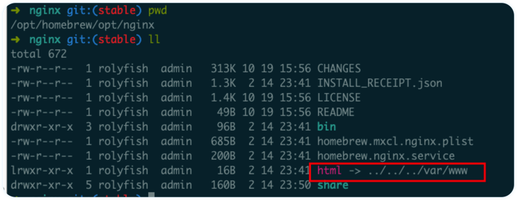

##### 启动ngnix

```bash
brew services start ngnix
```

##### 访问


### docker

> 使用docker安装ngnix部署前端项目。

#### 安装nginx

```bash
➜  nginx git:(stable) docker search nginx
## 不指定版本默认 latest
➜  nginx git:(stable) docker pull nginx 
## 查看安装的nginx镜像
➜  nginx git:(stable) docker images -a
REPOSITORY   TAG       IMAGE ID       CREATED       SIZE
redis        latest    edf4b3932692   4 weeks ago   111MB
```

#### 配置

> 启动ngnix容器

```bash
➜  docker run --name -d nginx:latest
```

> 拷贝nginx配置到本地，路径为你需要挂载的路径

```bash
➜  nginx docker cp nginxtest:/etc/nginx ~/home/nginx/nginx2

## 挂载日志
➜  nginx2 docker cp nginxtest:/var/log/nginx ~/home/nginx/nginx2/log

## nginx pid文件
➜  nginx2 docker cp nginxtest:/var/run/nginx.pid ~/home/nginx/nginx2/log/nginx.pid
```

> 放前端项目

```bash
## 拷贝静态资源路径
➜  html docker cp nginxtest:/usr/share/nginx/html  ~/home/nginx/nginx2/html

## 拷贝黑马点评项目到 ngnix挂载目录
➜  html cp -rf ~/home/nginx/docker-nginx/html/hmdp ~/home/nginx/nginx2/html/hmdp
```

> 修改配置

主要修改`/Users/rolyfish/home/nginx/nginx2/conf.d/default.conf`这个文件

```bash
server {
    listen       80;
    listen  [::]:80;
    server_name  rolyfish;

    access_log  /var/log/nginx/host.access.log  main;

    location / {
        root   /usr/share/nginx/html/hmdp;
        index  index.html index.htm;
    }

    #error_page  404              /404.html;

    error_page   500 502 503 504  /50x.html;
    location = /50x.html {
        root   /usr/share/nginx/html;
    }

    location /api {
        default_type  application/json;
        #internal;
        keepalive_timeout   30s;
        keepalive_requests  1000;
        #支持keep-alive
        proxy_http_version 1.1;
        rewrite /api(/.*) $1 break;
        proxy_pass_request_headers on;
        #more_clear_input_headers Accept-Encoding;
        proxy_next_upstream error timeout;
        ## 宿主机上启动后台项目的话 ip地址使用宿主机分配的网桥地址
        ## proxy_pass http://10.211.55.2:8081;
        ## 开启负载均衡
        proxy_pass http://backend;
    }
}
```

`ngnix.conf`添加负载均衡配置“

```bash
upstream backend {
   server 10.211.55.2:8081 max_fails=5 fail_timeout=10s weight=1;
 # server 127.0.0.1:8082 max_fails=5 fail_timeout=10s weight=1;
} 
```

#### IP地址

> `10.211.55.2:8081`。
>
> 如果是在docker宿主机上启动的项目，需要访问宿主分配的网桥地址。

```bash
## 查看容器的网络信息
➜  ~ docker inspect nginxhmdp
```

```bash
## 查看宿主机网络状况
➜  ~ ifconfig

## 找到bridge相关信息 ·10.211.55.2·
bridge100: flags=8863<UP,BROADCAST,SMART,RUNNING,SIMPLEX,MULTICAST> mtu 1500
	options=3<RXCSUM,TXCSUM>
	ether a2:78:17:f5:5f:64
	inet 10.211.55.2 netmask 0xffffff00 broadcast 10.211.55.255
	inet6 fe80::a078:17ff:fef5:5f64%bridge100 prefixlen 64 scopeid 0x18
	inet6 fdb2:2c26:f4e4::1 prefixlen 64
	Configuration:
		id 0:0:0:0:0:0 priority 0 hellotime 0 fwddelay 0
		maxage 0 holdcnt 0 proto stp maxaddr 100 timeout 1200
		root id 0:0:0:0:0:0 priority 0 ifcost 0 port 0
		ipfilter disabled flags 0x0
	member: vmenet0 flags=3<LEARNING,DISCOVER>
	        ifmaxaddr 0 port 23 priority 0 path cost 0
	member: vmenet2 flags=3<LEARNING,DISCOVER>
	        ifmaxaddr 0 port 27 priority 0 path cost 0
	nd6 options=201<PERFORMNUD,DAD>
	media: autoselect
	status: active
```

#### 启动

```bash
➜  docker run --name nginxhmdp -p 80:80 \
        -v /Users/rolyfish/home/nginx/nginx2/nginx.conf:/etc/nginx/nginx.conf \
        -v /Users/rolyfish/home/nginx/nginx2/html/:/usr/share/nginx/html/ \
        -v /Users/rolyfish/home/nginx/nginx2/logs/:/var/log/nginx/ \
        -v /Users/rolyfish/home/nginx/nginx2/conf.d/:/etc/nginx/conf.d/ \
        --privileged=true -d nginx:latest
```


### 项目介绍


#### 用户模块

##### 发送手机验证码

- 校验手机号
- 使用hutool包下的RandomUtil工具生成手机验证码,
- 将验证码缓存在Redis中，并设置其过期时间

##### 登录

- 获取前段发送的用户登录表单数据

- 校验手机号
- 校验验证码是否和缓存中一致
- 通过手机号码判断用户是否存在
  - 不存在则通过手机号创建默认用户
  - 存在则查出对应用户并缓存在Redis中


## Redis相关操作


### Session共享

> 我们一般会用Session存储一些基本用户信息，比如用户名称、手机号码等。并且可以基于Session判断用户登录状态。
>
> 但是使用Session的话会存在一些问题：就是Session共享的问题，如果我们的网站在多台服务器上集群部署的话，Session便不会在多个Tomcat上共享，导致Session不一致的情况。
>
> 这里即便可以通过Tomcat的配置实现多台Tomcat的Session一致的方式来实现，但是浪费内存。

#### Redis&Token

> 所以我们不能使用Session来存储用户凭证，这里便使用Redis来存储用户登录凭证，发送一串随机数字作为Token给到前端，这个Token作为Redis的key，用户信息作为Value，存在Redis上。在登录后前端每次请求都发送Token给后端，使用Token去Redis查询用户信息并放在ThreaLocal中，这样一次请求中都可以访问到用户信息。

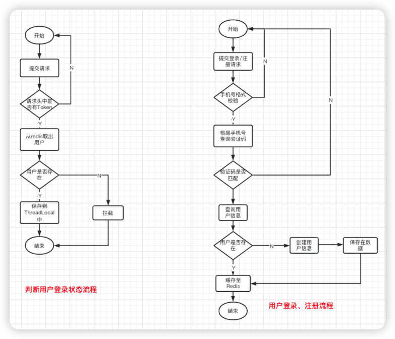

### 缓存更新策略

对于低一致性需求：使用内存淘汰机制，适合不太频繁更新的数据。

高一致性需求：主动更新，添加超时剔除作为兜底方案

|          | 内存淘汰                                                     | 超时剔除                                             | 主动更新                                 |
| -------- | :----------------------------------------------------------- | ---------------------------------------------------- | ---------------------------------------- |
| 说明     | 通过配置缓存内存淘汰机制，内存不足淘汰部分数据，下次查询再更新数据，不用自己维护 | 给缓存添加过期时间，到期自动删除，下次查询再更新缓存 | 编写业务逻辑，在修改数据库的时候删除缓存 |
| 一致性   | 差                                                           | 一般                                                 | 好                                       |
| 维护成本 | 无                                                           | 底                                                   | 高                                       |

#### 主动更新策略

- Cache Aside Pattern 调用者更新，在更新数据库时删除缓存
- Read/Write Through Pattern 调用外部服务，此服务将数据库和缓存整合为一个服务
- Write Behind Caching Pattern 只操作缓存，由其他线程异步将换成持久化到数据库

同时操作缓存和数据库问题：

> 更新缓存还是删除缓存

- 更新缓存：每次数据库更新缓存也要更新，缓存只关心最后的结果，可能会存在无效更新操作  ❎
- 删除缓存：更新数据库时删除缓存，下次查询再添加缓存  ✔

> 需要保证缓存和数据库更新操作的原子性

- 单体系统：将操作数据库和缓存放在一个事务中管理，当出现异常就会回滚
- 分布式系统：利用TCC等分布式方案

> 先操作数据库还是先删除缓存：

- 先删除缓存，再操作数据库  ： 导致一致性问题几率较大。因为删除缓存后更新数据库耗时较长，期间如果有查询请求，则会将旧数据更新到缓存。
- 先操作数据库，再删除缓存，导致一致性问题较小。需要满足几个条件 - 数据库更新前缓存刚好失效 - 写入缓存的动作在另一个线程删除缓存之后

#### 小结

缓存更新的最佳实践方案：

- 低一致性需求：使用redis的内存淘汰机制
- 高一致性需求：主动更新，并添加超时兜底方案
  - 读操作
    - 缓存命中直接返回
    - 缓存未命中，查询数据库，写入缓存并设置超时时间，返回-
  - 写操作
    - 使用删除缓存的策略
    - 先操作数据库，再删除缓存，下次查询更新缓存
    - 确保操作数据库和删除缓存的原子性

### 缓存穿透

> 缓存穿透是指客户端请求的数据缓存和数据库都没有命中，这样缓存失效，所有请求都打在数据上，导致数据库压力较大。
>
> 正常情况下没有问题，但是对于一些恶意穿透还是要避免的。

#### 解决方案

- 缓存空对象
  - 优点：缓存生效，实现简单
  - 缺点：①额外消耗Redis内存  ② 可能造成短期数据库不一致的情况
- 布隆过滤器（是一种位统计算法，将数据转换成位信息，用于判断是否存在）
  - 优点： 内存占用少
  - 缺点：①实现复杂 ② 有误判的可能
  
  

缓存穿透产生的原因是什么？

- 用户请求的数据在缓存中和数据库中都不存在，不断发起这样的请求，给数据库带来巨大压力

缓存穿透的解决方案有哪些？

- 缓存null值
- 布隆过滤
- 增强id的复杂度，避免被猜测id规律
- 做好数据的基础格式校验
- 加强用户权限校验
- 做好热点参数的限流

#### 以缓存空对象为例

> 使用缓存空对象的方案会导致短期的数据不一致的问题，当接下来更新数据时，一定会对数据做同步，短期的数据不一致只在于更新数据库完成至删除缓存之间，是可以接受的。

##### 前后方案做对比

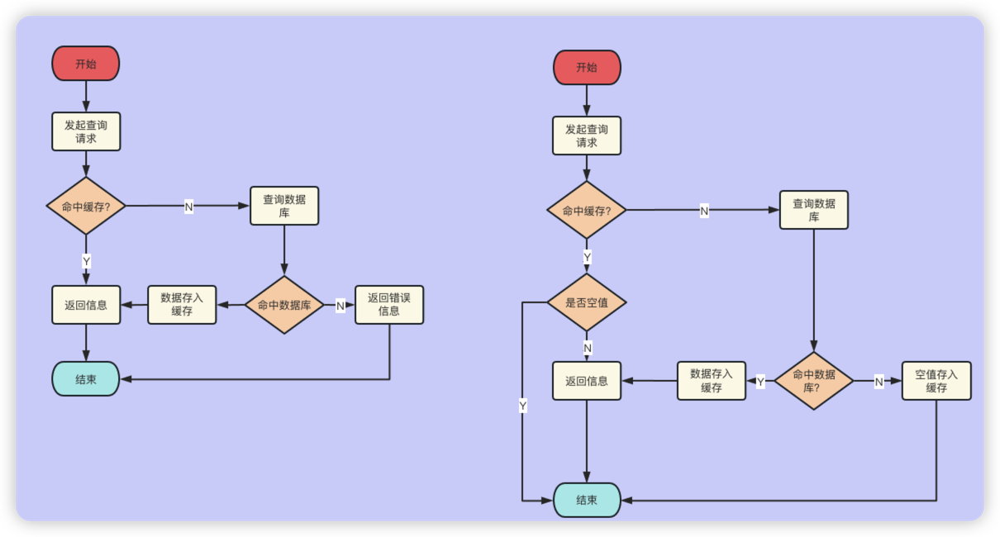

##### 代码实现

```java
private Shop queryWithPassThrough(Long id) {
    final String key = CACHE_SHOP_KEY + id;
    // 1 通过id查询缓存
    final String value = stringRedisTemplate.opsForValue().get(key);
    // 2.1 缓存命中且不为 "NULL" 返回数据
    if (StringUtils.isNotBlank(value) && !PASS_THROUGH_VALUE.equals(value)) {
        return JSONUtil.toBean(value, Shop.class);
    }
    // 2.2 命中 为空"NULL" 返回null 不再查询数据库
    if (PASS_THROUGH_VALUE.equals(value)) {
        return null;
    }
    // 3 查询数据库
    final Shop shop = this.getById(id);
    // 3.1 数据库未命中，空值写入缓存 返回null
    if (null == shop) {
        stringRedisTemplate.opsForValue().set(key, PASS_THROUGH_VALUE, CACHE_NULL_TTL, TimeUnit.MINUTES);
        return null;
    }
    // 3.2 数据库命中， 写入缓存 返回数据
    stringRedisTemplate.opsForValue().set(key, JSONUtil.toJsonStr(shop), CACHE_NULL_TTL, TimeUnit.MINUTES);
    return shop;
}
```

### 缓存雪崩

> 缓存雪崩是指在同一时段大量的缓存key同时失效或者Redis服务宕机，导致大量请求到达数据库，带来巨大压力

##### 解决方案

- 给不同的Key的TTL添加随机值
- 利用Redis集群提高服务的可用性
- 给缓存业务添加降级限流策略给业务
- 添加多级缓存

### 缓存击穿

> 缓存击穿问题也叫热点Key问题，就是一个被==高并发访问==并且==缓存重建业务较复杂==的key突然失效了，无数的请求访问会在瞬间给数据库带来巨大的冲击。

#### 解决方案

- 互斥锁
- 逻辑过期

##### 互斥锁

> 我们希望首个到达缓存重建业务的线程进行缓存重建，其他线程等待并重试。

==锁什么？==

> - 一定得是所有线程可见的共享对象
>
> - 单机环境下String是个不错的选择
>
> - 集群环境下则不行
>
>   集群环境下使用Redis作为分布式锁，对所有JVM可见

###### 全局唯一id

> 对于并发请求，分布式锁的key的要求不仅要求可见，同时需要在不同机器上体现唯一性，这样防止误删。后面再说。。


###### 流程图：

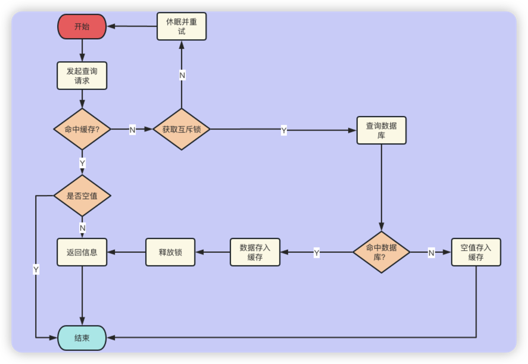

###### 时序图：


###### 代码实现：

```java
private Shop queryWithMutex(Long id) {
    final String key = CACHE_SHOP_KEY + id;
    // 1 通过id查询缓存
    final String value = stringRedisTemplate.opsForValue().get(key);
    // 2.1 缓存命中且不为 "NULL" 返回数据
    if (StringUtils.isNotBlank(value) && !PASS_THROUGH_VALUE.equals(value)) {
        return JSONUtil.toBean(value, Shop.class);
    }
    // 2.2 命中 为空"NULL" 返回null 不再查询数据库
    if (PASS_THROUGH_VALUE.equals(value)) {
        return null;
    }
    // 3 获取互斥锁
    final ILock redisLock = new MyDefinedSimpleRedisLock("shop:" + id, stringRedisTemplate);
    try {
        final boolean b = redisLock.tryLock(1800);
        if (b) {
            // 缓存重建
            final Shop shop = this.getById(id);
            // 3.1 数据库未命中，空值写入缓存 返回null
            if (null == shop) {
                stringRedisTemplate.opsForValue().set(key, PASS_THROUGH_VALUE, CACHE_NULL_TTL, TimeUnit.MINUTES);
                return null;
            }
            stringRedisTemplate.opsForValue().set(key, JSONUtil.toJsonStr(shop), CACHE_NULL_TTL, TimeUnit.MINUTES);
            return shop;
        } else {
            // 自旋重试
            try {
                Thread.sleep(200);
            } catch (InterruptedException e) {
                throw new RuntimeException(e);
            }
            return queryWithMutex(id);
        }
    } finally {
        redisLock.unlock();
    }
}
```

##### 逻辑过期

> 逻辑过期解决缓存击穿问题:
>
> - 选择逻辑过期的方案，那么此数据在redis中不用设置过期时间
>   - 热点数据一般提前加载过了，也就是默认存在
> - 缓存未命中，直接返回数据不存在
> - 缓存命中
>   - 判断是否过期
>     - 过期：获取锁，开启新线程返回旧数据
>     - 未过期：直接返回旧数据

###### 创建RedisData对象

> 此对象存储Redisd的过期时间和value数据。

```java
public class RedisData {
    private LocalDateTime expireTime;
    private Object data;
}
```

###### 流程图

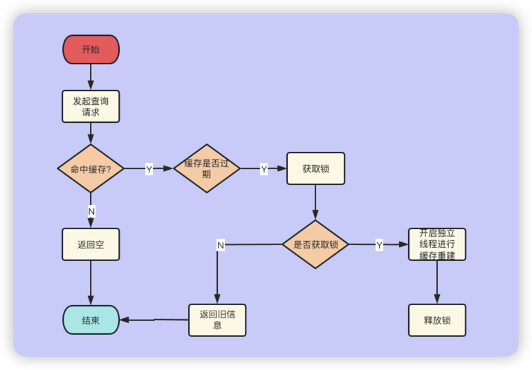

###### 代码实现

```java
private Shop queryWithLogicalExpire(Long id) {
    final String key = CACHE_SHOP_KEY + id;
    // 1 通过id查询缓存
    final String value = stringRedisTemplate.opsForValue().get(key);
    // 2.1 缓存未命中
    if (StringUtils.isBlank(value)) {
        // 直接返回空
        return null;
    }
    // 2.2 命中 解析数据
    final RedisData redisData = JSONUtil.toBean(value, RedisData.class);
    final LocalDateTime expireTime = redisData.getExpireTime();
    final Shop shop = JSONUtil.toBean((JSONObject) redisData.getData(), Shop.class);
    // 2.2.1 未过期
    if (LocalDateTime.now().isBefore(expireTime)) {
        return shop;
    }
    MyDefinedSimpleRedisLock redisLock = new MyDefinedSimpleRedisLock(LOCK_SHOP_KEY + id, stringRedisTemplate);
    try {
        final boolean b = redisLock.tryLock(LOCK_SHOP_TTL + 100000L);
        // 2.2.2 过期  获取锁  开启新线程缓存重建
        if (b) {
            threadPoolExecutor.submit(() -> {
                // 2.2.2.1 查询数据库
                final Shop shop1 = getById(id);
                // 2.2.2.2 构建RedisData
                final RedisData redisData1 = new RedisData();
                redisData1.setExpireTime(LocalDateTime.now().plusSeconds(CACHE_SHOP_TTL));
                redisData1.setData(shop1);
                stringRedisTemplate.opsForValue().set(CACHE_SHOP_KEY + id, JSONUtil.toJsonStr(redisData1));
            });
        }
    } finally {
        redisLock.unlock();
    }
    return shop;
}
```

### 全局唯一ID

> 对于订单号，流水号这些唯一性标识需要满足：
>
> - 唯一性
> - 递增性
> - 安全性   不可用1、2、3.。。这样的容易被猜测的
> - 高可用   不能随便出问题
> - 高性能   性能要好

全局ID的组成为64位：

- 符号位：1bit，永远为0
- 时间戳：31bit，以秒为单位，可以使用69年
- 序列号：32bit，秒内的计数器，支持每秒产生2^32个不同ID

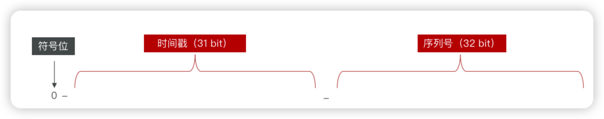

#### 全局唯一ID生成策略

- UUID

  > 唯一，与时间和机器有关，但是不满足自增

- Redis自增

  > 唯一、自增  但是需要包装一下，不然容易猜测

- snowflake算法

  > 0 + 41位时间戳 + 10位机器码 + 12位序列号。
  >
  > 唯一、自增 很好

- 数据库自增

  > 自增、唯一  但是容易被猜、性能不行

##### Redis自增ID策略

> key的选择：前缀（统一前缀+分类） + 时间
>
> 每天一个key，方便统计订单量
>
> ID构造是 时间戳 + 序列号

redis自增命令：

```bash
127.0.0.1:6379> INCR icr
(integer) 1
127.0.0.1:6379> INCR icr
(integer) 2
```

代码实现步骤：

- 获取时间戳（定义起始时间戳，当前时间戳减去起始时间戳）
- 格式化当日日期  作为前缀使用
- 组装全局唯一ID，时间戳+序列号
  - 左移32位  并和序列号按位或

```java
public long nextId(String keyPrefix) {
    // 1.生成时间戳
    LocalDateTime now = LocalDateTime.now();
    long nowSecond = now.toEpochSecond(ZoneOffset.UTC);
    long timestamp = nowSecond - BEGIN_TIMESTAMP;

    // 2.生成序列号
    // 2.1.获取当前日期，精确到天
    String date = now.format(DateTimeFormatter.ofPattern("yyyy:MM:dd"));
    // 2.2.自增长
    long count = stringRedisTemplate.opsForValue().increment("icr:" + keyPrefix + ":" + date);

    // 3.拼接并返回
    return timestamp << COUNT_BITS | count;
}
```

### 秒杀场景

> hmdp秒杀优惠券为例

#### 基本功能

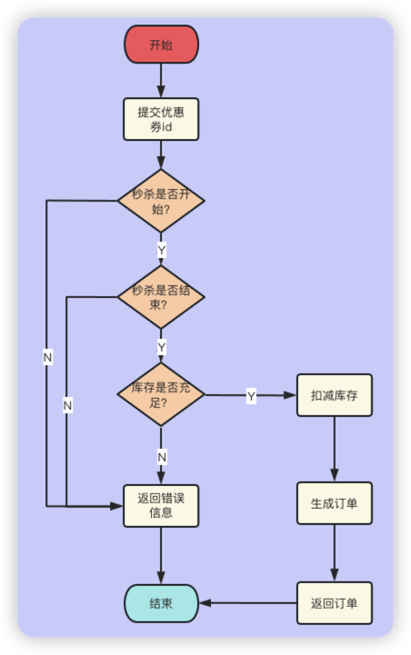

##### 超卖问题

> 并发环境下有可能产生超卖问题，也就是库存可能小于0。问题出现的原因就是有一部份线程判断库存充足，且还未完成减库存动作，这之间有很多其他线程已经判断了库存充足。

###### 使用Jmeter测试

准备200个请求,模拟200次并发。


库存100个

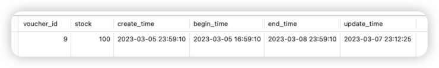

测试结果： 

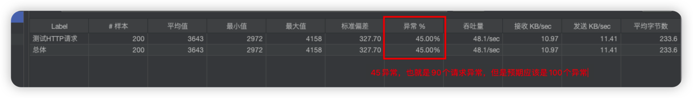

###### 时序图解释

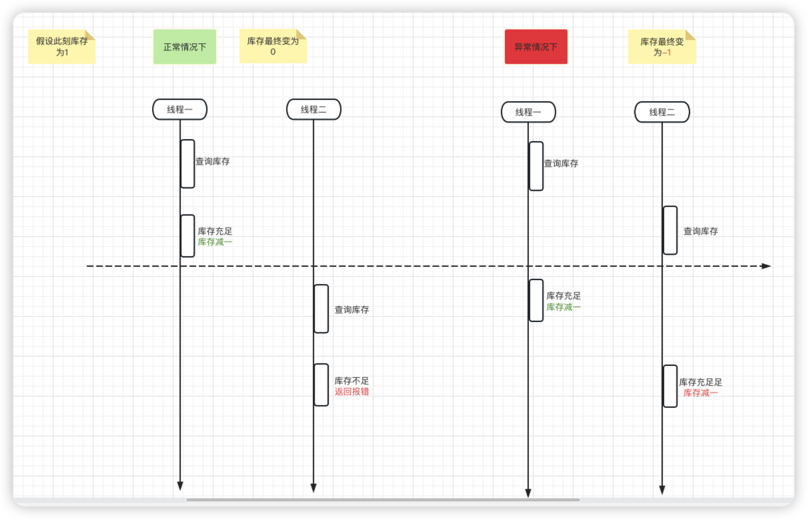

###### 超卖问题解决

> 加锁

- 乐观锁
- 悲观锁

###### 悲观锁解决

> 悲观锁认为数据一定会发生线程安全问题,因此在操作数据之间会首先获取锁。
>
> 单机环境下可以锁，优惠券id。集群环境下得使用分布式锁

```java
synchronized ((voucherId + "").intern()) {
    // 1.查询优惠券信息
    // 2. 判断起始时间
    // 3. 判断库存
    // 4. 扣减库存
    // 5.创建订单
    // 保存订单
    // 6.返回订单
}
```

###### 乐观锁解决

> 乐观锁用于更新情况,乐观锁认为线程安全问题不一定会发生,只会在修改数据的时候判断数据是否被修改了。
>
> - 如果数据被修改了,则重试或抛异常
> - 如果数据未被修改过,则线程安,操作数据

只需要修改sql即可

```java
// 4. 扣减库存， ==扣减库存时判断库存是否被修改过==
final boolean success = seckillVoucherService.update()
        .setSql("stock = stock-1")
        .eq("voucher_id", seckillVoucher.getVoucherId())
        .eq("stock", seckillVoucher.getStock())
        .update();
```

> 上面方案存在过多重试的情况。特定需求情况下,可以借助Mysql的行锁来实现，只需要判断库存大于0即可。

```java
// 4. 扣减库存， ==扣减库存时判断库存是否被修改过==
final boolean success = seckillVoucherService.update()
        .setSql("stock = stock-1")
        .eq("voucher_id", seckillVoucher.getVoucherId())
        //.eq("stock", seckillVoucher.getStock())
        .gt("stock", 0)
        .update();
```

> 还有就是==分段锁==，我们可以将资源分配在不同的数据库或者表中,对于进来的请求进行哈希分配提高成功率。

```java
//对于进来的请求进行散列
int flag = (Thread.currentThread().getId() + "").hashCode() & 1;
return flag>0? optimisticLock(voucherId):optimisticLockAdd(voucherId);
```

###### 互斥锁乐观锁对比

悲观锁,让线程串行执行

- 简单
- 性能差

乐观锁,不加锁

- 性能好
- 存在成功率低的问题

##### 一人一单问题

> 一个人只能下一单,也就是扣减库存之前需要判断订单表里是否有该用户的订单，如果有才可以减库存生成订单。
>
> 虽然减库存这里使用乐观锁保证了并发安全。
>
> 但是在查询订单是否存在到更新库存这之间如果有多个线程已经判断订单不存在了则也会出现并发安全。
>
> 也就是判断订单是否存在到减库存这一段是需要加锁的,而这是个查询操作,放弃乐观锁,使用Synchronized。

```java
@Transactional
Result createVoucherOrder(Long voucherId) {
  synchronized (userId.toString().intern()) {
        // 判断此用户是否已
        // 经下过单
        final Map<String, Object> map = new HashMap<>();
        map.put("voucher_id",voucherId);
        map.put("user_id",userId);
        final Integer count = this.query().allEq(map).count();
        if (count > 0) {
            return Result.fail("该用户" + userId + "已经下过单");
        }
        //减库存
        //生成订单。。。
		}
}
```


##### 事务失效问题

> @Transactional事务生效是因为,Spring对当前对象进行代理,由代理对象进行事务处理。
>
> 问题：锁释放但是事务没有提交
>
> 解决：代理整个方法

```java
final UserDTO user = UserHolder.getUser();
final Long userId = user.getId();
synchronized (userId.toString().intern()) {
    return this.createVoucherOrder(voucherId);
}
```

> 这样会发生事务失效的问题,this.createVoucherOrder(voucherId);调用此方法的是当前对象不是代理对象,事务会失效。
>
> 解决:找到代理对象。

```java
synchronized (userId.toString().intern()) {
    // 获取当前对象的代理对象,Spring会为我们生成代理对象来处理事务
    final IVoucherOrderService voucherOrderService = (IVoucherOrderService) AopContext.currentProxy();
    // this当前对象调用方法事务不会生效
    //return this.createVoucherOrder(voucherId);
    return voucherOrderService.createVoucherOrder(voucherId);
}
```

==注意：==引入aspectj依赖，并添加暴露代理对象的注解`@EnableAspectJAutoProxy(exposeProxy = true)`


#### 集群部署问题

> 项目以集群部署的话会产生在单机项目下不会出现的并发问题。

##### idea模拟集群

- 右击复制配置


- 配置端口

Add vmoption 添加`-Dserver.port=8082`

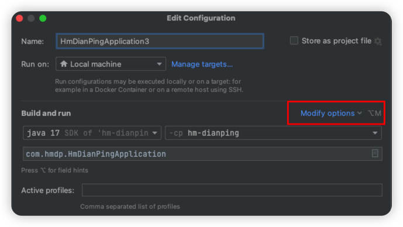

- 启动

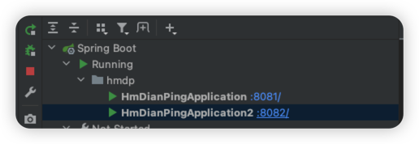

##### nginx配置负载均衡

> 默认采用轮询。
>
> 访问80端口就是访问http://backend;就是访问 8081和8082这两个服务。

```bash
 ## 修改 server location下的代理配置
 proxy_pass http://backend;
 
 ## 添加节点
 upstream backend {
   server 127.0.0.1:8081 max_fails=5 fail_timeout=10s weight=1;
   server 127.0.0.1:8082 max_fails=5 fail_timeout=10s weight=1;
 }
```

##### 时序图

> 单机环境下多个线程共享JVM,得到的是同一个对象监视器,synchronized生效。
>
> 集群环境下多个线程不共享JVM,得到的不是同一个对象监视器,可能会造成线程安全问题。
>
> 所以得找到一块所有线程共享的空间,借助它来实现分布式锁,就是Redis。

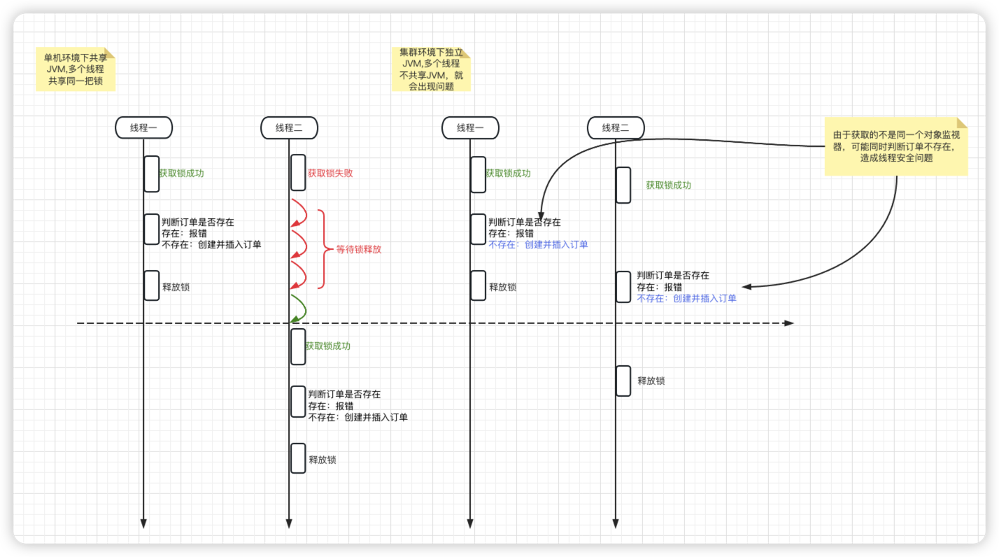

#### 分布式锁简介

> 分布式锁：满足分布式系统或集群模式下多进程可见并且互斥的锁。

分布式锁满足的条件：

- 多进程可见(需要一块多进程共享的数据区)
- 互斥
- 高可用
- 高性能
- 安全性

#### 分布式锁实现方案

> 以下方案都是多进程可见的。

|        | **MySQL**              | **Redis**          | **Zookeeper**      |
| ------ | ---------------------- | ------------------ | ------------------ |
| 互斥   | mysql写操作有行锁      | setnx互斥命令      | 节点唯一性         |
| 高可用 | 好 (主从)              | 好（主从、集群）   | 好                 |
| 高性能 | 一般                   | 好                 | 一般               |
| 安全性 | 链接断开，锁会自动释放 | 好（超时自动释放） | 节点断开，自动释放 |

#### 使用Redis实现分布式锁

##### 基本步骤

**获取锁（tryLock()）**

> 利用redis的setnx命令，如果key存在则返回1，不存在则返回二

```bash
127.0.0.1:6379> setnx lock thread0
(integer) 1
127.0.0.1:6379> setnx lock thread0
(integer) 0
```

**释放锁(unLock())**

> 删除key

```bash
127.0.0.1:6379> del lock
(integer) 1
```

**添加超时时间**

> 为redis锁的key设置过期时间，防止服务宕机使得锁得不到释放，所有进程都获取不到锁。
>
> 使用原子命令！

```bash
127.0.0.1:6379> help set
  SET key value [EX seconds|PX milliseconds|EXAT timestamp|PXAT milliseconds-timestamp|KEEPTTL] [NX|XX] [GET]
  summary: Set the string value of a key
  since: 1.0.0
  group: string
127.0.0.1:6379> set lock thread0 nx ex 30
OK
127.0.0.1:6379> get lock
"thread0"
127.0.0.1:6379> ttl lock
(integer) 17
127.0.0.1:6379> ttl lock
(integer) 15
```

**代码实现**

> 这是一个非阻塞锁,获取锁失败就重试

```java
public class MyDefinedSimpleRedisLock implements ILock {

    /**
     * 分布式锁的key名称
     */
    private String key;

    private StringRedisTemplate stringRedisTemplate;

    public MyDefinedSimpleRedisLock(String key, StringRedisTemplate stringRedisTemplate) {
        this.key = key;
        this.stringRedisTemplate = stringRedisTemplate;
    }

    public boolean tryLock(long timeoutSec, TimeUnit timeUnit) {
        return Boolean.TRUE.equals(stringRedisTemplate.opsForValue().setIfAbsent(key, Thread.currentThread().getId() + "", timeoutSec, timeUnit));
    }

    @Override
    public boolean tryLock(long timeoutSec) {
        return tryLock(timeoutSec, TimeUnit.SECONDS);
    }

    /**
     * 分布式锁id，这里简单固定，后面需要优化成唯一id
     */
    @Override
    public void unlock() {
        // 释放锁
        stringRedisTemplate.delete(key);
    }
}
```

##### 分布式锁解决超卖

```java
// 分布式锁  使用用户id作为key
final ILock redisLock = new MyDefinedSimpleRedisLock(LOCK_USER_KEY + userId, redisTemplate);
final boolean b = redisLock.tryLock(LOCK_USER_TTL);
if (!b) {
    // 重试或者失败
    //return optimisticLock(voucherId);
    // 重复下单是不允许的可以返回失败
    return Result.fail("不要重复下单!!");
}
try {
  // 获取当前对象的代理对象,Spring会为我们生成代理对象来处理事务
  final IVoucherOrderService voucherOrderService = (IVoucherOrderService) AopContext.currentProxy();
    // this当前对象调用方法事务不会生效
    //return this.createVoucherOrder(voucherId);
    return voucherOrderService.createVoucherOrder(voucherId);
  } finally {
    redisLock.unlock();
}
```

##### 分布式锁-误删问题

> 如图：使用超时删除来防止锁无法被释放,这样也会导致锁误删的问题。

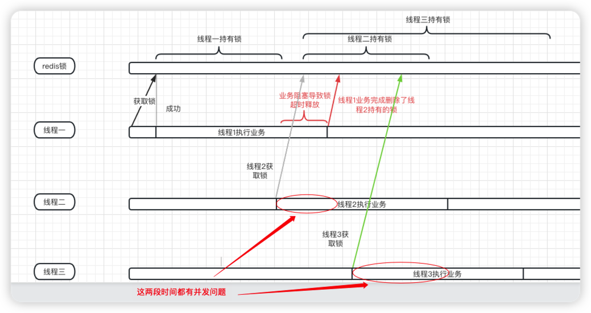

> 解决方式:线程获取锁的时候存入线程唯一标识,在释放锁的时候判断是否是当前线程的锁。
>
> UUID+线程ID,UUID分辨机器,线程ID分辨虚拟机线程,组合起来可作为线程唯一标识。

```java
// 机器标识
private static final String ID_PREFIX = UUID.randomUUID().toString(true);

// 获取锁
public boolean tryLock(long timeoutSec, TimeUnit timeUnit) {
	return Boolean.TRUE.equals(stringRedisTemplate.opsForValue().setIfAbsent(key, ID_PREFIX + Thread.currentThread().getId(), timeoutSec, timeUnit));
}

// 释放锁
public void unlock() {
    final String lockValueExpect = ID_PREFIX + Thread.currentThread().getId();
    final String lockValue = stringRedisTemplate.opsForValue().get(key);
    // 当前线程锁，才释放
    if (lockValueExpect.equals(lockValue)) {
      // 释放锁
      stringRedisTemplate.delete(key);
    }
}
```


##### 分布式锁-释放锁原子性

> 上面我们解决分布式锁误删问题的方案是:存入线程标识,释放锁的时首先判断是否是当前线程的锁,然后再释放锁。
>
> 而判断是否是当前线程的锁和释放锁是两个操作,不是原子操作,若在这两个操作之间我们线程阻塞了(Full GC会导致所有线程阻塞),直到分布式锁超时释放,那么其他线程就可以获取锁,后面线程被唤醒后就又会导致误删的问题。
>
> 解决方案:lua脚本保证,判断锁和释放锁是原子操作

###### LUA脚本

> LUA脚本中可以包含多条Redis命令,Redis执行LUA脚本是原子操作。

**Redis调用函数**

语法：

```shell
redis.call('命令','key'，'参数',....)
```

执行set命令:

```shell
set name yuyc
## 等价于
redis.call('set','name','yuyc')
```

执行get命令:

```shell
get name
## 等价于
redis.call('get','name')
```

**Redis执行LUA脚本**


```shell
127.0.0.1:6379> help @scripting
  EVAL script numkeys key [key ...] arg [arg ...]
  summary: Execute a Lua script server side
  since: 2.6.0
```

**执行无参数的LUA脚本**

```shell
127.0.0.1:6379> eval "return redis.call('set','name','yuyc')" 0
OK
127.0.0.1:6379> eval "return redis.call('get','name')" 0
"yuyc"
127.0.0.1:6379> eval "return redis.call('del','name')" 0
(integer) 1
```

**执行有参数的LUA脚本**

> 如果脚本中的key、value不想写死,可以作为参数传递。key类型参数会放入KEYS数组,其它参数会放入ARGV数组,在脚本中可以从KEYS和ARGV数组获取这些参数,数组下标从1开始。

```shell
127.0.0.1:6379> eval "return redis.call('set',KEYS[1],ARGV[1])" 1 age 23
OK
127.0.0.1:6379> eval "return redis.call('get',KEYS[1])" 1 age
"23"
```

###### 释放锁的LUA脚本

```lua
-- 待释放锁的key
local key = KEYS[1]
-- 传入的线程标识
local value = ARGV[1]
-- 获取锁
local threadID = redis.call('get',key)
-- 判断是否相等
if (value == threadID) then
    return redis.call('del',key)
end
return 0
```

优化：

```lua
if (redis.call('get', KEYS[1]) == ARGV[1]) then
    return redis.call('del', KEYS[1])
end
return 0
```

###### 调用LUA脚本

```java
// 提前加载 lua脚本
private final static DefaultRedisScript<Long> UNLOCK_SCRIP = new DefaultRedisScript<>();
static {
    UNLOCK_SCRIP.setLocation(new ClassPathResource("lua/unlock.lua"));
    UNLOCK_SCRIP.setResultType(Long.class);
}
/**
 * lua脚本释放锁，保证判断是否是当前线程锁的操作和删除锁的操作原子性
 */
@Override
public void unlock() {
    stringRedisTemplate.execute(UNLOCK_SCRIP, Arrays.asList(key), ID_PREFIX + Thread.currentThread().getId());
}
```

##### 小结

基于Redis的分布式锁实现思路：

- 利用set nx ex获取锁，并设置过期时间
- 保存线程标示释放锁时先判断线程标示是否与自己一致，一致则删除锁

特性：

- 利用set nx满足互斥性
- 利用set ex保证故障时锁依然能释放，避免死锁，提高安全性
- 利用Redis集群保证高可用和高并发特性


#### Redission

[GITHUP地址](https://github.com/redisson/redisson/wiki/%E7%9B%AE%E5%BD%95)

> Redisson提供了丰富分布式锁类型

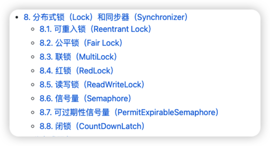

> 上面基于setnx命令我们自己封装的分布式锁存在哪些缺点？

- 不可重入

  > 锁不可重入可能会导致死锁的问题。
  >
  > Java为我们提供的Synchronized和ReentrantLock都是可重入的。

- 不可重试

  > 不可重试重新获取锁,导致频繁比例过大。

- 超时释放

  > 添加超时释放可以防止死锁,但是这个超时时间很难把控,可能在业务未完全完成时,锁就被超时释放了,虽然我们使用LUA脚本来防止误删的情况出现,但锁还是提前释放了,存在安全隐患。

- 主从一致性

  > 主节点的锁未同步给从节点就宕机了,其他线程就可以拿到锁。存在并发安全问题。

##### 简介

> Redisson是一个在Redis的基础上实现的Java驻内存数据网格（In-Memory Data Grid）。它不仅提供了一系列的分布式的Java常用对象，还提供了许多分布式服务。其中包括(`BitSet`, `Set`, `Multimap`, `SortedSet`, `Map`, `List`, `Queue`, `BlockingQueue`, `Deque`, `BlockingDeque`, `Semaphore`, `Lock`, `AtomicLong`, `CountDownLatch`, `Publish / Subscribe`, `Bloom filter`, `Remote service`, `Spring cache`, `Executor service`, `Live Object service`, `Scheduler service`) Redisson提供了使用Redis的最简单和最便捷的方法。Redisson的宗旨是促进使用者对Redis的关注分离（Separation of Concern），从而让使用者能够将精力更集中地放在处理业务逻辑上。

> 人话: 一个基于Redis实现的分布式工具的集合。 

##### 配置

###### 引入依赖

```XML
<dependency>
    <groupId>org.redisson</groupId>
    <artifactId>redisson</artifactId>
    <version>3.13.6</version>
</dependency>
```

###### 程序化配置

```java
@Configuration
public class RedissonConfig {
    @Bean
    public RedissonClient redissonClient() {
        // 配置
        Config config = new Config();
  		  config.useSingleServer().setAddress("redis://10.211.55.4:6379")
                                .setPassword("123123");
        // 创建RedissonClient对象
        return Redisson.create(config);
    }
}
```

###### yml配置

> 创建redisson.yml配置文件：([官网有配置模板](https://github.com/redisson/redisson/wiki/2.-%E9%85%8D%E7%BD%AE%E6%96%B9%E6%B3%95#22-%E6%96%87%E4%BB%B6%E6%96%B9%E5%BC%8F%E9%85%8D%E7%BD%AE))

```yml
singleServerConfig:
  idleConnectionTimeout: 10000
  connectTimeout: 10000
  timeout: 3000
  retryAttempts: 3
  retryInterval: 1500
  password: 123123
  subscriptionsPerConnection: 5
  clientName: null
  address: "redis://10.211.55.4:6379"
  subscriptionConnectionMinimumIdleSize: 1
  subscriptionConnectionPoolSize: 50
  connectionMinimumIdleSize: 32
  connectionPoolSize: 64
  database: 0
  dnsMonitoringInterval: 5000
threads: 0
nettyThreads: 0
codec: !<org.redisson.codec.JsonJacksonCodec> { }
"transportMode": "NIO"
```

> 配置即可

```java
@Bean(name = "redissonClient2")
public RedissonClient redissonClient2() throws IOException {
    final Config config = Config.fromYAML(new File(new ClassPathResource("redisson.yml").getAbsolutePath()));
    return Redisson.create(config);
}
```


##### 使用

```java
// 注入并创建锁
@Autowired
RedissonClient redisson;
final RLock redisLock = redisson.getLock(LOCK_USER_KEY + userId);
final boolean b = redisLock.tryLock(LOCK_USER_TIMEOUT, LOCK_USER_TTL, TimeUnit.SECONDS);
redisLock.unLock();
```

> tryLock方法参数说明：
>
> - waitTime 重试时间。获取不到锁会重试,直到超过重试时间
> - leaseTime 自动释放时间  (ttl)    默认-1
> - unit时间单位

```java
boolean tryLock(long waitTime, long leaseTime, TimeUnit unit) throws InterruptedException;
```


##### 原理

###### 可重入原理

> 重入锁指的是当前线程可多次获取锁,重入加锁则重入次数加一,释放锁的时候重入次数减一,直到重入次数为0,则释放锁。
>
> 自定义实现的锁,我们使用的是`opsForValue的set nx命令`也就是不可重入。参照`JDK`的可重入锁`ReentrantLock`的原理,它会有一个重入次数,所以需要实现`Redis`实现锁重入,必须存入锁被重入次数,那么必须使用哈希结构。

> Hset命令,没有类似于set nx ex 2的命令,所以得分步骤实现,分步实现又有线程安全问题,所以得借助Lua脚本实现。

```shell
127.0.0.1:6379> help hset
  HSET key field value [field value ...]
  summary: Set the string value of a hash field
  since: 2.0.0
  group: hash
```

步骤：

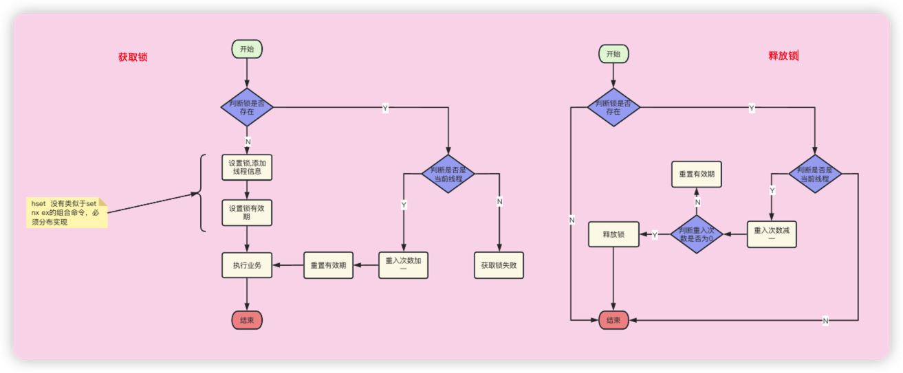

lua脚本实现：

获取锁：

```lua
local hkey = KEYS[1]
local threadID = ARGV[1]
local releaseTime = ARGV[2]
---- KEY不存在
if (redis.call('exists', hkey) == 0) then
    -- 设置重入次数为1,并设置过期时间
    redis.call('hset', hkey, threadID, '1');
    redis.call('expire', hkey, releaseTime);
    return 1;
end
---- key存在且是当前线程   hexists key field 判断哈希结构属性是否存在
if (redis.call('hexists', hkey, threadID) == 1) then
    redis.call('hincrby', hkey, threadID, '1');
    redis.call('pexpire', hkey, releaseTime);
end
return redis.call('pttl', hkey);
```

释放锁：

```lua
local hkey = KEYS[1]
local threadID = ARGV[1]
local releaseTime = ARGV[2]
-- KEY不存在
if (redis.call('hexists', hkey, threadID) == 0) then
    return nil;
end
-- key存在且是当前线程
local counter = redis.call('hincrby', hkey, threadID, -1);
if (counter > 0) then
    -- 重置有效期
    redis.call('pexpire', hkey, releaseTime)
    return 0;
else
    -- 释放锁
    redis.call('del', hkey)
    return 1;
end
return nil;
```

测试：

```java
@Test
public void test() {
    final MyReentrantRedisLock myReentrantRedisLock = new MyReentrantRedisLock("LOCK:TEST", redisTemplate);
    method1(myReentrantRedisLock);
}
private void method1(MyReentrantRedisLock myReentrantRedisLock) {
    try {
        final boolean b = myReentrantRedisLock.tryLock(30L);
        if (b) {
            log.info(Thread.currentThread().getName() + "method1" + "获取锁");
            method2(myReentrantRedisLock);
        }
    } finally {
        myReentrantRedisLock.unlock();
        log.info(Thread.currentThread().getName() + "method1" + "释放锁");
    }

}

private void method2(MyReentrantRedisLock myReentrantRedisLock) {
    try {
        final boolean b = myReentrantRedisLock.tryLock(30L);
        if (b) {
            log.info(Thread.currentThread().getName() + "method2" + "获取锁");
        }
    } finally {
        myReentrantRedisLock.unlock();
        log.info(Thread.currentThread().getName() + "method2" + "释放锁");
    }
}
```

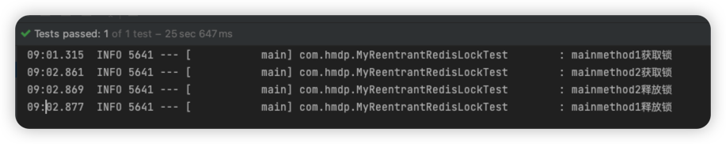

###### 可重试

> 上面我们实现的redis可重入锁,Redisson也是这样实现的。
>
> 那么Redisson是如何实现重试的呢？
>
> 几个参数：
>
> - long waitTime   重试时间,获取失败不会立刻返回,会不断重试
> - long leaseTime  自动释放时间,过期时间
> -  TimeUnit unit  时间单位
>
> 如果不设置超时释放时间则默认为-1,并开启看门狗机制,不断刷新锁的有效时长,在锁被释放的时候才会取消看门狗机制。看门狗默认为30s。看门狗机制防止业务执行过程中锁自动释放。
>
> Redisson获取锁失败不会立刻进行重试,它会订阅并等待释放锁的信号,通过发布订阅和信号量机制防止频繁重试。
>
> Redisson释放锁操作会发布一个通知,通知等待线程开始重试获取锁,并取消看门狗机制。

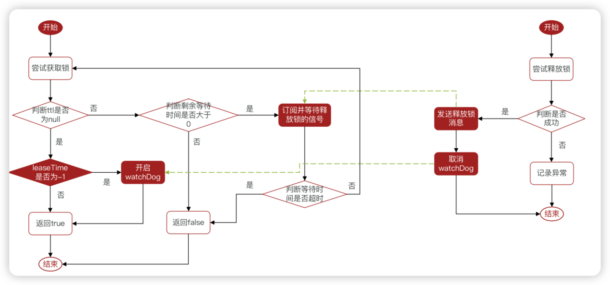

###### 小结

Redisson分布式锁原理：

- 可重入：利用hash结构记录线程id和重入次数
- 可重试：利用信号量和PubSub功能实现等待、唤醒，获取锁失败的重试机制
- 超时续约：利用watchDog，每隔一段时间（releaseTime / 3），重置超时时间

##### Redisson分布式锁主从一致性问题

> 当我们搭建主从Redis服务的时候,主节点用于写,从节点用于读,以提高Redis的性能。但是也会出现主从一致性问题,也就是主节点宕机的时候,数据未同步到从节点。
>
> 如果设置了一个锁在主节点,主节点未来得及同步到从节点,此刻选举从节点作为主节点,新的主节点没有锁信息,导致锁失效问题。

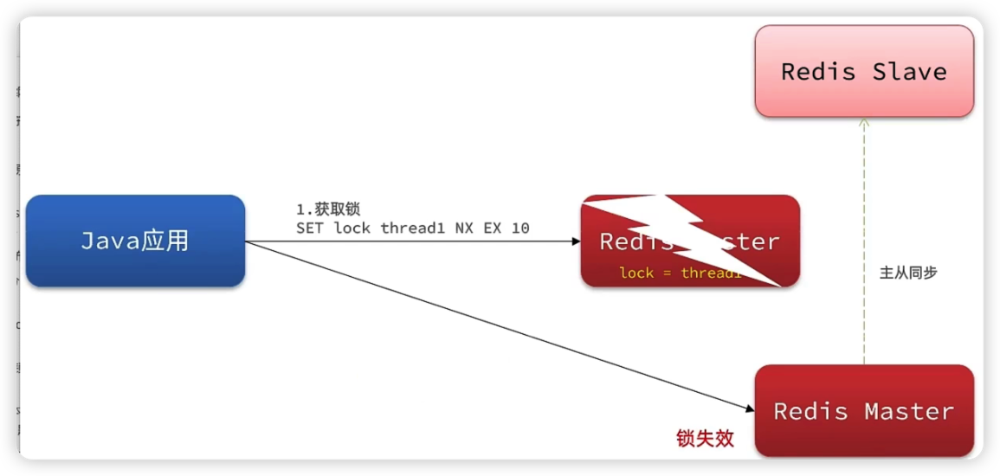

> 为了解决这样的问题Redisson提出了MutiLock(联锁),使用这把锁咱们就不使用主从了，每个节点的地位都是一样的， 这把锁加锁的逻辑需要写入到每一个主丛节点上，只有所有的服务器都写入成功，此时才是加锁成功，假设现在某个节点挂了，那么他去获得锁的时候，只要有一个节点拿不到，都不能算是加锁成功，就保证了加锁的可靠性。

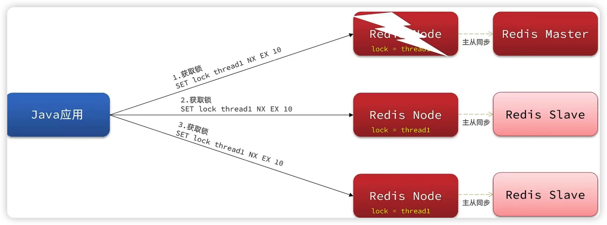

MutiLock原理：

当我们去设置了多个锁时，redission会将多个锁添加到一个集合中，然后用while循环去不停去尝试拿锁，但是会有一个总共的加锁时间，这个时间是用需要加锁的个数 * 1500ms ，假设有3个锁，那么时间就是4500ms，假设在这4500ms内，所有的锁都加锁成功， 那么此时才算是加锁成功，如果在4500ms有线程加锁失败，则会再次去进行重试。

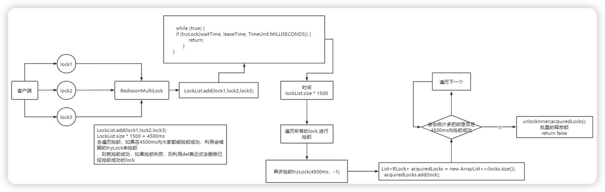

联锁的实现细节和是否设置重试时间和过期时间有关：

- 如果没有设置重试时间,那么默认负一,其中有一把锁获取失败,就会返回false(即获取锁失败)
- 如果设置了重试时间,则联锁获取失败会进行重试(重试之前会把所有已经获取的锁)
- 如果没有设置超时释放时间,则会开启看门狗机制,进行锁自动续期
- 如果设置了超时释放时间,则会在获取所有锁之后做一个刷新锁的过期时间(避免联锁超时时间不一致问题)。如果超时释放时间和重试时间,那么超时释放时间会调整为重试时间*2,避免已经获取的锁提前过期释放。

###### 测试联锁

```java
@Bean
public RedissonClient redissonClient() throws IOException {
    final Config config = Config.fromYAML(new File(new ClassPathResource("redisson.yml").getAbsolutePath()));
    return Redisson.create(config);
}

@Bean(name = "redissonClient1")
public RedissonClient redissonClient1() throws IOException {
    final Config config = Config.fromYAML(new File(new ClassPathResource("redisson2.yml").getAbsolutePath()));
    return Redisson.create(config);
}
```

```java
@Slf4j
@SpringBootTest
public class MutliRedissonTest {
    @Autowired
    @Qualifier("redissonClient1")
    RedissonClient redissonClient1;
    @Autowired
    @Qualifier("redissonClient")
    RedissonClient redissonClient;
    RLock redissonMultiLock = null;
    @BeforeEach
    void setUp() {
        final RLock lock1 = redissonClient1.getLock("LOCK:TEST:");
        final RLock lock2 = redissonClient.getLock("LOCK:TEST:");
        redissonMultiLock = new RedissonMultiLock(lock1, lock2);
    }
    @Test
    public void test() {
        try {
            final boolean b = redissonMultiLock.tryLock(10, 100, TimeUnit.SECONDS);
            if (b) {
                log.info("联锁获取成功");
            }
        } catch (InterruptedException e) {
        } finally {
            redissonMultiLock.unlock();
            log.info("联锁释放");
        }
    }
}
```

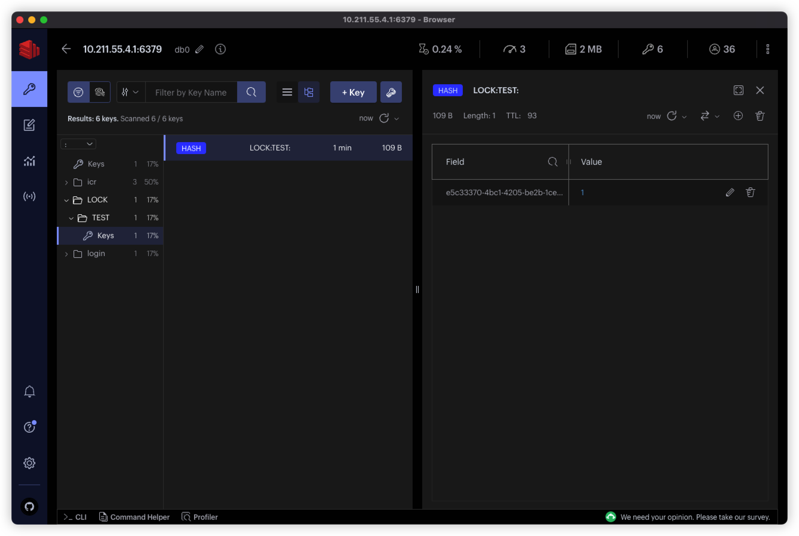


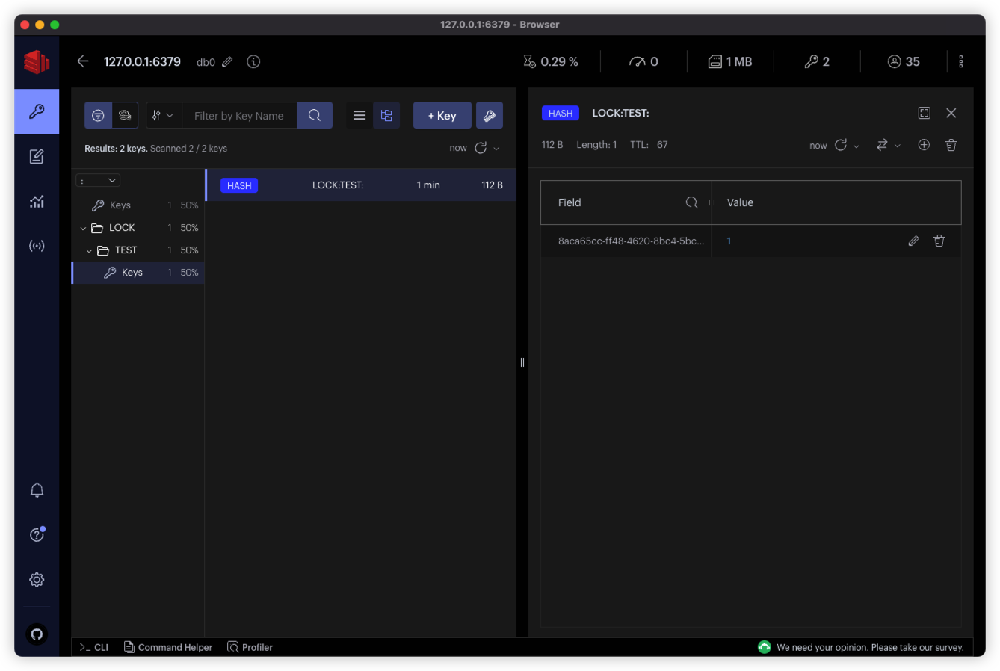

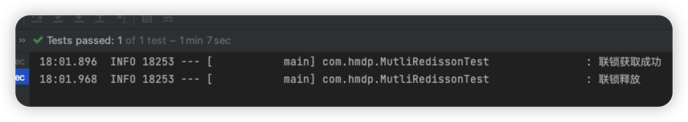

##### 总结

1）不可重入Redis分布式锁：

- 原理：利用setnx的互斥性；利用ex避免死锁；释放锁时判断线程标示
- 缺陷：不可重入、无法重试、锁超时失效

2）可重入的Redis分布式锁：

- 原理：利用hash结构，记录线程标示和重入次数；利用watchDog延续锁时间；利用信号量控制锁重试等待
- 缺陷：redis宕机引起锁失效问题

3）Redisson的multiLock：

- 原理：多个独立的Redis节点，必须在所有节点都获取重入锁，才算获取锁成功
- 缺陷：运维成本高、实现复杂


#### 性能优化

> 对优惠券秒杀功能做性能优化。

##### 测试

> 对当前业务做性能测试。

第一步准备用户数据

```java
@Override
public Result createSecKillUserDate(Long num, String basephone) {
  String phone = "";
  final List<String> tockens = new ArrayList<>();
  final Integer nums = Integer.valueOf(num + "");

  for (int i = 0; i < nums; i++) {
    int l = String.valueOf(i).length();
    phone = basephone.substring(0, basephone.length() - l) + i;

    // 发送验证码
    final Result result = sendCode(phone, null);
    // 验证码
    final String code = (String) result.getData();
    final LoginFormDTO loginFormDTO = new LoginFormDTO();
    loginFormDTO.setCode(code);
    loginFormDTO.setPhone(phone);
    loginFormDTO.setPassword("defaultpassword");
    final Result login = login(loginFormDTO, null);
    tockens.add((String) login.getData());
  }
  // 写入文件
  String filePath = "/Users/rolyfish/Desktop/software/apache-jmeter-5.5/jmetertestfile/tockens.txt";
  try (FileWriter fileWriter = new FileWriter(filePath, true)) {

    IOUtils.writeLines(tockens, System.lineSeparator(), fileWriter);
  } catch (IOException e) {
    throw new RuntimeException(e);
  }
  return null;
}
```

第二部测试：

200并发平均耗时1s多,QBS只有75每秒,性能低下。

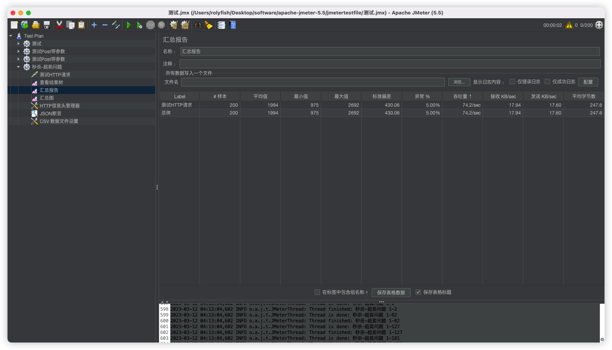

##### 分析

> 秒杀业务流程：查询优惠券->判断库存->查询订单->判断一人一单->扣减库存->创建订单。
>
> 这些所有步骤的耗时是呈现给用户的耗时,其中有很大部分是和数据库打交道,优化思路就是将这些与数据库打交道的操作,做出异步处理的逻辑。

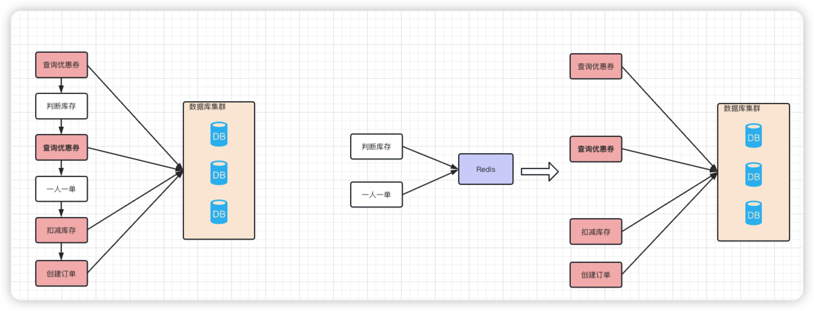

##### 优化

> 判断库存和一人一单在Redis里进行判断,下单操作异步执行,这样呈现给用户的响应时间段只有在Redis里的判断操作。

- 添加优惠券时,将库存放入Redis,活动起止日期通过设置过期时间或定时脚本实现。Key为seckill:stock:voucherid,类型为String
- 库存是否充足通过判断Redis里的库存信息
- 一人一单:用户购买过就将用户ID存在Redis中。Key为seckill:order:voucherid,类型为set。

库存是否充足和一人一单的判断,为了防止并发问题,得保证原子性执行,需要使用Lua脚本：

###### 编写Lua脚本

```lua
-- 用户ID
local userId = ARGV[1]
-- 库存key
local stockKey = ARGV[2]
-- 优惠券key
local orderKey = ARGV[3]
-- 1.1 判断库存是否充足
if (redis.call("exists", stockKey) == 0 or tonumber(redis.call("get", stockKey)) <= 0) then
    -- 不充足返回1
    return 1
end
-- 订单充足 判断一人一单
if (redis.call("sismember", voucherKey, userId) == 1) then
    -- 已经下过单了 返回2
    return 2
end
-- 定单充足，且没有下过单 返回0
-- 3.1 库存减一
-- 3.2 加入订单set
redis.call("incrby", stockKey, -1)
redis.call("sadd", voucherKey, userId)
return 0
```

###### 调用

```java
private static final DefaultRedisScript<Long> SECKILL_SCRIPT = new DefaultRedisScript<>();

static {
    SECKILL_SCRIPT.setLocation(new ClassPathResource("lua/seckill.lua"));
    SECKILL_SCRIPT.setResultType(Long.class);
}

/**
 * lua脚本实现秒杀,redis单线程
 * - 初始化 lua脚本
 * - 执行lua脚本
 *
 * @param voucherId
 * @return
 */
private Result luaSeckillOrder(Long voucherId) {
    UserDTO user = UserHolder.getUser();
    final Long result = redisTemplate.execute(SECKILL_SCRIPT,
                Collections.emptyList(),
                user.getId().toString(),
                voucherId.toString());
    final int resultI = result.intValue();
    if (resultI != 0) {
        return Result.fail(resultI == 1 ? "库存不足x" : "您已经下过单了x");
    }
    return Result.ok("用户:" + user.getId() + "购买订单:" + voucherId + "成功");
}
```

###### 测试

> 性能有了较大提升,本机电脑开的东西多占cpu性能,服务也会按集群部署,性能只会更好

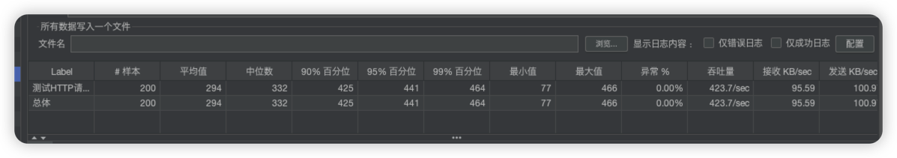

###### 异步下单

> 接下来就是将已经通过校验的订单以异步的形式存储在数据库。

创建阻塞队列和异步处理线程池,`voucherOrderServiceProxy`这个代理对象还是为了防止事务失效,在子线程中是拿不到代理对象的(AopContext.*currentProxy*()获取代理对象是基于ThreadLocal实现的)。

```java
private IVoucherOrderService voucherOrderServiceProxy = null;
// 设置容量防止溢出
private final static BlockingQueue<VoucherOrder> ORDER_TASKS = new ArrayBlockingQueue<>(1024 * 1024);
// 线程池
private static final ExecutorService SECKILL_EXECUTOR_SERVICE = new ThreadPoolExecutor(10, 10, 60L, TimeUnit.SECONDS, new LinkedBlockingDeque<>(), new ThreadFactory() {
    @Override
    public Thread newThread(Runnable r) {
        return new Thread(r);
    }
});
```

在这之前lua脚本做资格的判断,判断成功则放入阻塞队列,并且在这里初始化代理对象

```java
// 创建订单信息放入阻塞队列
// 1.1 全军唯一订单ID
long orderID = redisIdWorker.nextId(UNIQUE_ID_KEY_ORDER);
// 1.2 用户ID
long userID = user.getId();
final VoucherOrder voucherOrder = new VoucherOrder();
voucherOrder.setId(orderID);
voucherOrder.setUserId(userID);
voucherOrder.setVoucherId(voucherId);
try {
    ORDER_TASKS.put(voucherOrder);
} catch (InterruptedException e) {
    log.info("线程终端异常");
}
voucherOrderServiceProxy = (IVoucherOrderService) AopContext.currentProxy();
```

> 在我们项目启动就会注入这个组件到Spring容器中,会触发类的初始化,@PostConstruct这个注解的作用就是当类初始化完成后,就执行这个方法。
>
> 这个方法不停的从阻塞队列中拿取订单,并执行创建订单的业务

```java
// 当类初始化之后执行此方法
@PostConstruct
private void init() {
    SECKILL_EXECUTOR_SERVICE.submit(() -> {
        // 从阻塞对列拿订单信息,并创建
        while (true) {
            final VoucherOrder voucherOrder = ORDER_TASKS.take();
            handleVoucherOrder(voucherOrder);
        }
    });
}
```


###### 缺点

秒杀业务的优化思路是什么？

- 先利用Redis完成库存余量、一人一单判断，完成抢单业务
- 再将下单业务放入阻塞队列，利用独立线程异步下单

基于阻塞队列的异步秒杀存在哪些问题？

- 内存限制问题（阻塞队列有大小限制{JVM内存限制}）
- 数据安全问题(服务突然挂掉,异步下单业务还没有执行完,会导致数据不一致=


##### 消息队列优化异步下单

> 基于Java阻塞队列实现的异步任务,存在内存和不可持久化(后期重试)的问题,所以得基于中间件来实现异步任务。

> 消息队列(**M**essage **Q**ueue)。
>
> 最简单的消息队列模型存在三个角色：
>
> - 生产者
> - 队列
> - 消费者

###### Redis-List实现消息队列

> Redis-List是一个双向链表, 借助以下两组命令可模拟单项队列：
>
> - LPUSH 和 RPOP
> - RPUSH 和 LPOP
>
> 当链表为空时POP命令会返回null,借助BRPOP和BLPOP可实现阻塞效果。

基于List的消息队列有哪些优缺点？

优点：

- 利用Redis存储，不受限于JVM内存上限
- 基于Redis的持久化机制，数据安全性有保证
- 可以满足消息有序性

缺点：

- 无法避免消息丢失

  > POP命令是 remove  and  get  消息。移出队列消息->消费者挂了->消息未处理，则会造成消息丢失。

- 只支持单消费者


###### 基于PubSub

> PubSub(发布订阅)是Redis2.0引入的消息传递模型。消费者可以订阅一个或多个channel,生产者发送消息后,订阅者可以收到消息。

> PubSub相关命令如下：

- PUBLISH channel message 向指定频道发送消息  ，返回订阅此消息的消费者个数
- SUBSCRIBE channel [channel ...]  订阅渠道
- UNSUBSCRIBE [channel [channel ...]] 取消订阅渠道
- PSUBSCRIBE pattern [pattern ...]
- PUNSUBSCRIBE [pattern [pattern ...]]

PubSub天然阻塞。

优缺点

优点：

- 支持多生产多消费  （广播）

缺点：

- 不可持久化 （消息发送后没有消费者接收,消息就会消失）
- 无法避免消息丢失
- 消息堆积有上限


###### 基于Stream

> Stream是Redis5.0引入的一种新的数据类型,可借助它实现一个完善的消息队列。


**单消费模式**

> 发送消息命令

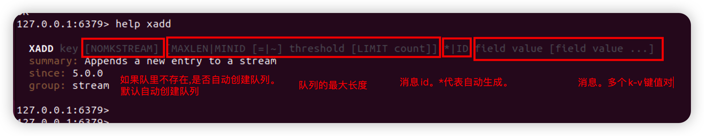

例子：

队列users不存在则创建一个名为users的队列,长度上限为100左右,id自动生成,并且向队列发送一个消息`{name=yuyc,age=24}`

```bash
127.0.0.1:6379> xadd users maxlen ~ 100 * name yuyc age 24
"1680669340282-0"
127.0.0.1:6379> xlen users
(integer) 1
```


> 读取消息命令。可阻塞,多个队列

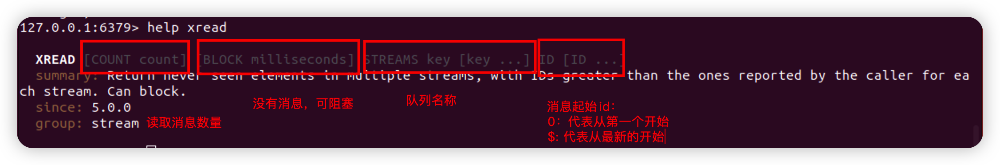

例子:

```bash
127.0.0.1:6379> xadd users * name lizicheng age 100
"1680670543704-0"
127.0.0.1:6379> xlen users
(integer) 2
127.0.0.1:6379> xadd goods maxlen ~ 100 * name foot price 100
"1680670617264-0"
127.0.0.1:6379> xadd goods maxlen ~ 100 * name warter price 200
"1680670631851-0"

## 从users goods队列中读取消息，每个队列读取1个，从队列头部开始
127.0.0.1:6379> xread count 1 block 2000 streams users goods 0 0
1) 1) "users"
   2) 1) 1) "1680669340282-0"
         2) 1) "name"
            2) "yuyc"
            3) "age"
            4) "24"
2) 1) "goods"
   2) 1) 1) "1680670617264-0"
         2) 1) "name"
            2) "foot"
            3) "price"
            4) "100"
```


> 单消费模式优缺点

优点：

- 消息可回溯
- 一个消息可以被多个消费者读取
- 可以阻塞读取 (xread命令存在block可填选项,指定超时时间)

缺点：

- 有消息漏读的风险

  > 当我们指定起始ID为$时，代表读取最新的消息，如果我们处理一条消息的过程中，又有超过1条以上的消息到达队列，则下次获取时也只能获取到最新的一条，会出现漏读消息的问题。

​	

**消费组模式**

> Consumer Group：将多个消费者划分到一个组中，监听同一个队列。具备下列特点

- 消息分流 - Stream队列中的消息会分给组内不同的消费者(不会重复消费),提升消费速度
- 消息提示 - 消费者会维护一个标识,记录最后一个被处理的消息,消费者宕机重启会保证此消息可以被消费
- 消息确认 - 消费者获取消息后,消息处于pending状态,进入pending-list中。当消息处理完成后需要通过XACK命令确认,确认之后消息才会从pending-list 中移除

> 消费者组管理命令

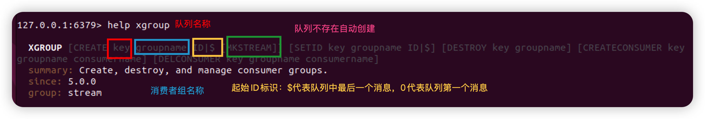

```bash
## 创建消费者
XGROUP [CREATE key groupname ID|$ [MKSTREAM]]
# key  队列名称
# groupname 消费者名称
# id|$ 起始id标识
# mkstream 队列不存在自动创建队列
```

```bash
## 删除消费者组
XGROUP [DESTROY key groupname] 
```

```bash
## 给指定消费者组添加消费者
XGROUP [CREATECONSUMER key groupname consumername] 
```

```bash
## 删除指定消费者组中的消费者
XGROUP [DELCONSUMER key groupname consumername]
```

例子：

```bash
127.0.0.1:6379> xadd users maxlen 100 * name yuyc1 age 22 
"1680797294977-0"
127.0.0.1:6379> xadd users maxlen 100 * name yuyc2 age 22 
"1680797298488-0"
127.0.0.1:6379> xadd users maxlen 100 * name yuyc3 age 22 
"1680797300855-0"
127.0.0.1:6379> xlen users
(integer) 3
127.0.0.1:6379> xgroup create users g1 $ mkstream 
OK
127.0.0.1:6379> xgroup createconsumer users g1 c1
(integer) 1
127.0.0.1:6379> xgroup createconsumer users g1 c2
(integer) 1
```


**从消费者组读取消息**

```bash
XREADGROUP GROUP group consumer [COUNT count] [BLOCK milliseconds] [NOACK] STREAMS key [key ...] ID [ID ...]
```

- group - 消费者组名称
- consumer - 消费者名称，如果消费者不存在则自动创建一个消费者
- count - 本次查询的最大数量
- milliseconds - 最大等待时间
- NOACK - 自动确认,无需手动确认(确认pending-list中的消息，一般需要手动确认)
- STREAMS key [key ...] - 指定队列名称
- ID [ID ...] - 获取消息的起始ID
  - `>`： 从下一个未消费的消息开始
  - 其他:一般是0，指的是从pending-list中获取已消费但未确认的消息

例子：

```bash
# pnding-list中没有待确认消息
127.0.0.1:6379> xreadgroup group g1 c1 count 1 block 200000 streams users  0
1) 1) "users"
   2) (empty array)
# 读取队列中最新的元素 （会阻塞一会,待生产者放入消息）
127.0.0.1:6379> xreadgroup group g1 c1 count 1 block 200000 streams users  >
1) 1) "users"
   2) 1) 1) "1680797912168-0"
         2) 1) "name"
            2) "yuyc9"
            3) "age"
            4) "22"
(23.25s)
# 读取已消费但未确认消息
127.0.0.1:6379> xreadgroup group g1 c1 count 1 block 200000 streams users  0
1) 1) "users"
   2) 1) 1) "1680797912168-0"
         2) 1) "name"
            2) "yuyc9"
            3) "age"
            4) "22"
# 确认消息
127.0.0.1:6379> xack users g1 1680797912168-0
(integer) 1
```

> 消费组模式优缺点

STREAM类型消息队列的XREADGROUP命令特点：

- 消息可回溯
- 可以多消费者争抢消息，加快消费速度
- 可以阻塞读取
- 没有消息漏读的风险
- 有消息确认机制，保证消息至少被消费一次


**对比**

|                  | **List**                                 | **PubSub**         | **Stream**                                             |
| ---------------- | ---------------------------------------- | ------------------ | ------------------------------------------------------ |
| **消息持久化**   | 支持                                     | 不支持             | 支持                                                   |
| **阻塞读取**     | 支持                                     | 支持               | 支持                                                   |
| **消息堆积处理** | 受限于内存空间，可以利用多消费者加快处理 | 受限于消费者缓冲区 | 受限于队列长度，可以利用消费者组提高消费速度，减少堆积 |
| **消息确认机制** | 不支持                                   | 不支持             | 支持                                                   |
| **消息回溯**     | 不支持                                   | 不支持             | 支持                                                   |


###### 基于Steam消费者组模式优化

> 创建Stream类型的消息队列 ，key为`stream.orders`

```bash
127.0.0.1:6379> xgroup create stream.orders g1 0 mkstream 
OK
127.0.0.1:6379> xgroup createconsumer stream.orders g1 c1 
(integer) 1
127.0.0.1:6379> keys stream.*
1) "stream.orders"
```

> 修改秒杀Lua脚本`skill.lua`。
>
> `skill.lua`秒杀脚本中除了做库存判断、一人一单判断之外，添加一个加入消息队列的操作，这样可以减少与redis的IO次数。
>
> lua脚本添加一个订单id参数

```lua
-- 用户ID
local userId = ARGV[1]
-- 优惠券id
local voucherId = ARGV[2]
-- 订单key
local orderKey = ARGV[3]
-- stream队列key
local streamQueueKey = ARGV[4]

-- 库存 key
local stockKey = "seckill:stock:" .. voucherId
-- 优惠券 key
local voucherKey = "seckill:order:" .. voucherId


-- 1.1 判断库存是否充足
if (redis.call("exists", stockKey) == 0 or tonumber(redis.call("get", stockKey)) <= 0) then
    -- 不充足返回1
    return 1
end
-- 订单充足 判断一人一单
if (redis.call("sismember", voucherKey, userId) == 1) then
    -- 已经下过单了 返回2
    return 2
end
-- 定单充足，且没有下过单 返回0
-- 3.1 库存减一
-- 3.2 加入订单set
redis.call("incrby", stockKey, -1)
redis.call("sadd", voucherKey, userId)
-- 3.3 订单信息加入消息队列
--   XADD key [NOMKSTREAM] [MAXLEN|MINID [=|~] threshold [LIMIT count]] *|ID field value [field value ...]
redis.call("xadd", streamQueueKey, "*", "userId", userId, "voucherId", voucherId, "id", orderKey)
return 0
```

> 修改java代码。
>
> 修改调用秒杀lua脚本和订单入库异步任务

调用lua脚本添加一个参数，并去除加入阻塞队列的操作

```java
private Result luaSeckillOrder(Long voucherId) {
        UserDTO user = UserHolder.getUser();
        long orderId = redisIdWorker.nextId(UNIQUE_ID_KEY_ORDER);
        final Long result = redisTemplate.execute(SECKILL_SCRIPT,
                Collections.emptyList(),
                user.getId().toString(),
                voucherId.toString(), String.valueOf(orderId),
                SECKILL_STREAMQUEUEORDER_KEY);
        assert result != null;
        final int resultI = result.intValue();
        if (resultI != 0) {
            return Result.fail(resultI == 1 ? "库存不足x" : "您已经下过单了" + user.getId());
        }
        voucherOrderServiceProxy = (IVoucherOrderService) AopContext.currentProxy();
        return Result.ok("用户:" + user.getId() + "购买订单:" + voucherId + "成功");
}
```

异步下单

```java
@PostConstruct
private void init() {
  SECKILL_EXECUTOR_SERVICE.submit(() -> {
    while (true) {
      try {
        // 读取Stream消息队列中的值 XREADGROUP GROUP group consumer [COUNT count] [BLOCK milliseconds] [NOACK] STREAMS key [key ...] ID [ID ...]
        final List<MapRecord<String, Object, Object>> orderList = redisTemplate.opsForStream().read(
          Consumer.from("g1", "c1"),
          StreamReadOptions.empty().count(1).block(Duration.ofSeconds(2)),
          StreamOffset.create(SECKILL_STREAMQUEUEORDER_KEY, ReadOffset.lastConsumed())
        );
        // 判断是否获取成功

        if (null == orderList || orderList.size() == 0) {
          // 获取失败或者没有值继续循环
          continue;
        }
        // 有值  解析成 VoucherOrder 并存储
        handleRecordList(orderList);
      } catch (Exception e) {
        log.info("处理订单异常:{}", e.getMessage());
        handlePendingList();
      }
    }
  });
}

private void handlePendingList() {
  while (true) {
    try {
      // 读取pending-list已消费未确认的消息   XREADGROUP GROUP group consumer [COUNT count] [BLOCK milliseconds] [NOACK] STREAMS key [key ...] ID [ID ...]
      final List<MapRecord<String, Object, Object>> orderList = redisTemplate.opsForStream().read(
        Consumer.from("g1", "c1"),
        StreamReadOptions.empty().count(1).block(Duration.ofSeconds(2)),
        StreamOffset.create(SECKILL_STREAMQUEUEORDER_KEY, ReadOffset.from("0"))
      );
      // 判断是否获取成功
      if (null == orderList || orderList.size() == 0) {
        // 获取失败,没有待确认消息,跳出循环
        break;
      }
      // 有值  解析成 VoucherOrder 并存储
      handleRecordList(orderList);
    } catch (Exception e) {
      log.info("处理pending-list订单异常:{}", e.getMessage());
      try {
        Thread.sleep(20);
      } catch (InterruptedException ex) {
        log.info("异常");
      }
    }
  }
}

private void handleRecordList(List<MapRecord<String, Object, Object>> orderList) {
  final MapRecord<String, Object, Object> order = orderList.get(0);
  final Map<Object, Object> orderMap = order.getValue();
  final VoucherOrder voucherOrder = BeanUtil.fillBeanWithMap(orderMap, new VoucherOrder(), CopyOptions.create().ignoreError());
  // 下单
  handleVoucherOrder(voucherOrder);
  // 确认  XACK key group ID [ID ...]
  redisTemplate.opsForStream().acknowledge(SECKILL_STREAMQUEUEORDER_KEY, "g1", order.getId());
}
```


