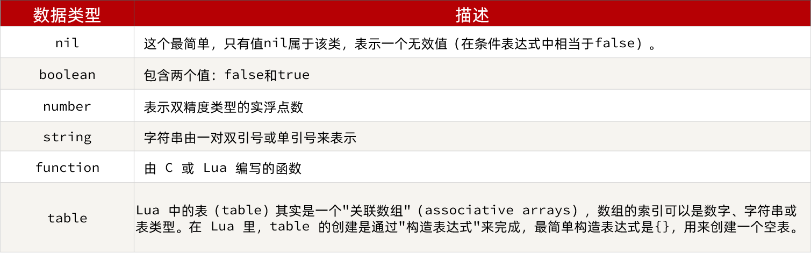

# 多级缓存


## 什么是多级缓存

> 传统的缓存架构的请求流程: 一个请求首先到达我们的服务器(Tomcat),随后去查询Redis缓存,缓存没有再去数据库中查。

存在以下问题:

- 所有请求都会到达服务器(Tomcat),Tomcat成为整个服务的性能瓶颈
- 当Redis缓存失效,会对数据库造成冲击

多级缓存的目的就是充分拆分整个请求流程中的所有环节,在整个请求流程添加多级缓存,减轻服务器压力

- 对于静态资源,浏览器会优先读取本地缓存
- 对于非静态资源,访问服务器
  - 在Ngnix添加缓存,请求到达Nginx,优先读取Ngnix本地缓存
  - Ngnix本地缓存未命中,则请求Redis
  - Redis没命中,则请求服务器(Tomcat)
  - 请求进入Tomcat,优先查询JVM本地进程缓存
  - JVM本地进程缓存未命中则查询数据库


> 在多级缓存的架构中,Nginx不再只作为一个静态资源的提供者,而是成为了一个提供业务逻辑的`Web服务器`
>
> Nginx存在以下职责：
>
> - 反向代理
> - 负载均衡
> - 本地缓存
> - Redis查询
> - Tomcat查询(请求反向代理到服务器Tomcat)

正是因为Nginx负责的职责较多,所以Ngnix也需要搭建集群：


同时Tomcat也会集群部署：


> 在多级缓存架构中需要解决的点是:

- 在Ngnix编写业务逻辑
  - Nngix本地缓存
  - 查询Redis
  - 查询Tomcat
- JVM本地进程缓存

其中Nginx编程则会用到OpenResty框架结合Lua这样的语言。

## 例子

> 商品查询例子

#### docker安装Mysql

使用docker安装Mysql

##### 1.1、安装docker

> 执行`docker -v`查看提示即可

```snap install docker```

安装成功查看docker版本：

```shell
root@ubuntu-linux-22-04-desktop:/home/tmp/docker/mysql# docker -v
Docker version 20.10.17, build 100c70180f
```

##### 1.2、准备挂载目录

挂载路径：`/home/tmp/docker/mysql`

##### 1.3、启动容器

1.2.1、拉取Mysql镜像

```shell
## 查看docker帮助
docker --help

## 搜索mysql镜像
docker search mysql

## 拉取docker 镜像。下载成功后会有Status: Downloaded newer image for mysql:latest提示
docker pull mysql:latest
```

1.2.2、启动mysql并挂载目录

```shell
docker run \
 -p 3306:3306 \
 --name mysql \
 -v $PWD/conf:/etc/mysql/conf.d \
 -v $PWD/logs:/logs \
 -v $PWD/data:/var/lib/mysql \
 -e MYSQL_ROOT_PASSWORD=123456 \
 --privileged \
 -d \
 mysql:latest
```

参数说明：

- `-p`端口映射
- `--name` docker容器名称
- `-v`参数这里是,挂载目录。格式为`本地路径:容器内部路径`
- `-e` envirment,设置环境变量
- `--privileged`使得mysql拥有root权限
- `-d`后台启动

启动状态：


> 交互模式进入docker-mysql容器并使用mysql客户端连接mysql

```shell
# 交互模式进入docker容器
docker exec -it dfc3cedea039 /bin/bash
# 连接mysql 
mysql -u root -p
mysql> show databases;
+--------------------+
| Database           |
+--------------------+
| information_schema |
| mysql              |
| performance_schema |
| sys                |
+--------------------+
4 rows in set (0.00 sec)
```

> Mysql可视化客户端Navicat远程连接mysql


##### 1.4、修改配置

> 交互模式进入docker-mysql容器,是缺省mysql配置文件的,我们需要本地创建并挂载上去。


1.4.1、在`$pwd/mysql/conf`下创建`my.cnf`文件

```ini
[mysqld]
## 跳过ip解析域名过程,提高查询效率
skip-name-resolve
character_set_server=utf8
## mysqldata目录
datadir=/var/lib/mysql
## 唯一id
server-id=1000
## MySQL 客户端连接服务器端时使用的端口号，默认为 3306
port=3306
## mysqld_safe 脚本将默认使用 user=mysql 选项来启动
user = mysql
```

1.4.2、重启

`docker restart mysql`


#### 初始化数据

```sql
SET NAMES utf8mb4;
SET FOREIGN_KEY_CHECKS = 0;
create DATABASE if not EXISTS `item`;
use `item`;
DROP TABLE IF EXISTS `tb_item`;
CREATE TABLE `tb_item`  (
  `id` bigint(20) NOT NULL AUTO_INCREMENT COMMENT '商品id',
  `title` varchar(264) CHARACTER SET utf8 COLLATE utf8_general_ci NOT NULL COMMENT '商品标题',
  `name` varchar(128) CHARACTER SET utf8 COLLATE utf8_general_ci NOT NULL DEFAULT '' COMMENT '商品名称',
  `price` bigint(20) NOT NULL COMMENT '价格（分）',
  `image` varchar(200) CHARACTER SET utf8 COLLATE utf8_general_ci NULL DEFAULT NULL COMMENT '商品图片',
  `category` varchar(200) CHARACTER SET utf8 COLLATE utf8_general_ci NULL DEFAULT NULL COMMENT '类目名称',
  `brand` varchar(100) CHARACTER SET utf8 COLLATE utf8_general_ci NULL DEFAULT NULL COMMENT '品牌名称',
  `spec` varchar(200) CHARACTER SET utf8 COLLATE utf8_general_ci NULL DEFAULT NULL COMMENT '规格',
  `status` int(1) NULL DEFAULT 1 COMMENT '商品状态 1-正常，2-下架，3-删除',
  `create_time` datetime NULL DEFAULT NULL COMMENT '创建时间',
  `update_time` datetime NULL DEFAULT NULL COMMENT '更新时间',
  PRIMARY KEY (`id`) USING BTREE,
  INDEX `status`(`status`) USING BTREE,
  INDEX `updated`(`update_time`) USING BTREE
) ENGINE = InnoDB AUTO_INCREMENT = 10001 CHARACTER SET = utf8mb4 COMMENT = '商品表' ROW_FORMAT = COMPACT;

INSERT INTO `tb_item`(`title` ,`name` ,`price` ,`image` ,`category` ,`brand`,`spec` ,`status` ,`create_time` ,`update_time` )
 VALUES ('RIMOWA 21寸托运箱拉杆箱 SALSA AIR系列果绿色 820.70.36.4', 'SALSA AIR', 16900, 'https://m.360buyimg.com/mobilecms/s720x720_jfs/t6934/364/1195375010/84676/e9f2c55f/597ece38N0ddcbc77.jpg!q70.jpg.webp', '拉杆箱', 'RIMOWA', '{\"颜色\": \"红色\", \"尺码\": \"26寸\"}', 1, '2019-05-01 00:00:00', '2019-05-01 00:00:00')
 , ('安佳脱脂牛奶 新西兰进口轻欣脱脂250ml*24整箱装*2', '脱脂牛奶', 68600, 'https://m.360buyimg.com/mobilecms/s720x720_jfs/t25552/261/1180671662/383855/33da8faa/5b8cf792Neda8550c.jpg!q70.jpg.webp', '牛奶', '安佳', '{\"数量\": 24}', 1, '2019-05-01 00:00:00', '2019-05-01 00:00:00')
 , ('唐狮新品牛仔裤女学生韩版宽松裤子 A款/中牛仔蓝（无绒款） 26', '韩版牛仔裤', 84600, 'https://m.360buyimg.com/mobilecms/s720x720_jfs/t26989/116/124520860/644643/173643ea/5b860864N6bfd95db.jpg!q70.jpg.webp', '牛仔裤', '唐狮', '{\"颜色\": \"蓝色\", \"尺码\": \"26\"}', 1, '2019-05-01 00:00:00', '2019-05-01 00:00:00')
 , ('森马(senma)休闲鞋女2019春季新款韩版系带板鞋学生百搭平底女鞋 黄色 36', '休闲板鞋', 10400, 'https://m.360buyimg.com/mobilecms/s720x720_jfs/t1/29976/8/2947/65074/5c22dad6Ef54f0505/0b5fe8c5d9bf6c47.jpg!q70.jpg.webp', '休闲鞋', '森马', '{\"颜色\": \"白色\", \"尺码\": \"36\"}', 1, '2019-05-01 00:00:00', '2019-05-01 00:00:00')
 , ('花王（Merries）拉拉裤 M58片 中号尿不湿（6-11kg）（日本原装进口）', '拉拉裤', 38900, 'https://m.360buyimg.com/mobilecms/s720x720_jfs/t24370/119/1282321183/267273/b4be9a80/5b595759N7d92f931.jpg!q70.jpg.webp', '拉拉裤', '花王', '{\"型号\": \"XL\"}', 1, '2019-05-01 00:00:00', '2019-05-01 00:00:00');
DROP TABLE IF EXISTS `tb_item_stock`;
CREATE TABLE `tb_item_stock`  (
  `item_id` bigint(20) NOT NULL COMMENT '商品id，关联tb_item表',
  `stock` int(10) NOT NULL DEFAULT 9999 COMMENT '商品库存',
  `sold` int(10) NOT NULL DEFAULT 0 COMMENT '商品销量',
  PRIMARY KEY (`item_id`) USING BTREE
) ENGINE = InnoDB CHARACTER SET = utf8mb4 COLLATE = utf8mb4_general_ci COMMENT = '库存表' ROW_FORMAT = COMPACT;
INSERT INTO `tb_item_stock` VALUES (10001, 99996, 3219);
INSERT INTO `tb_item_stock` VALUES (10002, 99999, 54981);
INSERT INTO `tb_item_stock` VALUES (10003, 99999, 189);
INSERT INTO `tb_item_stock` VALUES (10004, 99999, 974);
INSERT INTO `tb_item_stock` VALUES (10005, 99999, 18649);
SET FOREIGN_KEY_CHECKS = 1;
```

#### 导入后端项目


#### 导入前端项目

> docker安装nginx

1. docker  search nginx

2. docker pull nginx

3. docker run --name nginx -d nginx:latest

4. 复制目录

   ```tex
   docker cp nginx:/etc/nginx ./conf
   docker cp nginx:/var/log/nginx ./logs
   docker cp nginx:/var/run/nginx.pid ./logs/nginx.pid
   docker cp nginx:/usr/share/nginx/html ./html
   ```

5. 拷贝前端项目到html

6. 修改配置

​	


## JVM进程缓存

> 即将数据保存在JVM内存中,请求时首先查询缓存,未命中再去查询数据库。


### Caffeine

缓存在日常开发中启动至关重要的作用，由于是存储在内存中，数据的读取速度是非常快的，能大量减少对数据库的访问，减少数据库的压力。我们把缓存分为两类：

- 分布式缓存，例如Redis：
  - 优点：存储容量更大、可靠性更好、可以在集群间共享
  - 缺点：访问缓存有网络开销
  - 场景：缓存数据量较大、可靠性要求较高、需要在集群间共享
- 进程本地缓存，例如HashMap、GuavaCache：
  - 优点：读取本地内存，没有网络开销，速度更快
  - 缺点：存储容量有限、可靠性较低、无法共享
  - 场景：性能要求较高，缓存数据量较小

我们今天会利用Caffeine框架来实现JVM进程缓存。


**Caffeine**是一个基于Java8开发的，提供了近乎最佳命中率的高性能的本地缓存库。目前Spring内部的缓存使用的就是Caffeine。GitHub地址：https://github.com/ben-manes/caffeine

Caffeine的性能非常好，下图是官方给出的性能对比(读 (75%) / 写 (25%))：


##### 基本使用

```java
@Test
void testBasicOps() {
    // 创建缓存对象
    Cache<String, String> cache = Caffeine.newBuilder().build();
    // 存数据
    cache.put("gf", "迪丽热巴");

    // 取数据，不存在则返回null
    String gf = cache.getIfPresent("gf");
    System.out.println("gf = " + gf);

    // 取数据，不存在则去数据库查询
    String defaultGF = cache.get("defaultGF", key ->
            // 这里可以去数据库根据 key查询value
            "柳岩"
    );
    System.out.println("defaultGF = " + defaultGF);
}
```


#### Caffeine驱逐策略

Caffeine提供了三种缓存驱逐策略：

- **基于容量**：设置缓存的数量上限

  ```java
  // 创建缓存对象
  Cache<String, String> cache = Caffeine.newBuilder()
      .maximumSize(1) // 设置缓存大小上限为 1
      .build();
  ```

- **基于时间**：设置缓存的有效时间

  ```java
  // 创建缓存对象
  Cache<String, String> cache = Caffeine.newBuilder()
      // 设置缓存有效期为 10 秒，从最后一次写入开始计时 
      .expireAfterWrite(Duration.ofSeconds(10)) 
      .build();
  
  ```

- **基于引用**：设置缓存为软引用或弱引用，利用GC来回收缓存数据。性能较差，不建议使用。

> **注意**：在默认情况下，当一个缓存元素过期的时候，Caffeine不会自动立即将其清理和驱逐。而是在一次读或写操作后，或者在空闲时间完成对失效数据的驱逐。

### 实现JVM进程缓存

#### 需求

利用Caffeine实现下列需求：

- 给根据id查询商品的业务添加缓存，缓存未命中时查询数据库
- 给根据id查询商品库存的业务添加缓存，缓存未命中时查询数据库
- 缓存初始大小为100
- 缓存上限为10000

#### 实现

##### 注入Cache

```java
@Bean
public Cache<Long, Item> itemCache() {
    return Caffeine.newBuilder()
            .initialCapacity(100)
            .maximumSize(10_000)
            .build();
}

@Bean
public Cache<Long, ItemStock> itemStockCache() {
    return Caffeine.newBuilder()
            .initialCapacity(100)
            .maximumSize(10_000)
            .build();
}
```

##### 修改查询业务逻辑

> `@Autowrite`注解默认按照类型注入,如果按照类型注入失败的话,则会根据属性名称Byname的方式注入。

```java
@Autowired
Cache<Long, Item> itemCache;

@Autowired
@Qualifier("itemStockCache")//可以省略
Cache<Long, ItemStock> itemStockCache;

@GetMapping("/{id}")
public Item findById(@PathVariable("id") Long id) {
    return itemCache.get(
            id,
            key -> itemService.query().ne("status", 3).eq("id", key).one()
    );
}
@GetMapping("/stock/{id}")
public ItemStock findStockById(@PathVariable("id") Long id) {
    return itemStockCache.get(id, key -> stockService.getById(key));
}
```


## Ngnix缓存

> Ngnix除了存储静态资源和做反向代理,还可以使用`Lua`编写业务逻辑。

### Lua

Lua是一种强大而快速的编程语言 它易于学习和使用，并易于嵌入到应用程序中。Lua被设计成一种轻量级的可嵌入脚本语言,从而为应用程序提供灵活的扩展和定制功能。

[Lua官网](https://www.lua.org/)

#### HelloWorld

1. 安装lua

   命令行输入`Lua`根据提示安装即可


2. 创建`hello.lua`

   > 并输入`prinf('Hello World!')`

   ```shell
   vim hello.lua
   ```

3. 执行`hello.lua`

   ```lua
   lua hello.lua
   ```

   

​	

#### 基本语法

> Lua基本语法学习。

##### Lua数据类型

> Lua是一种动态类型语言,变量没有类型,只有价值观 
>
> Lua中有八种基本类型： nil，boolean，number， 字符串、函数、用户数据 线程和表。



> 变量声明

```lua
-- hello world
print('Hellow World!!')

-- type()函数可以判断一个变量的类型
print(type('Hello Lua'))
print(type(function() return 1 end))
 
-- 声明局部变量 local

-- 声明字符串
local str = 'hello'
-- 字符串拼接用 ..
local appned = str .. 'lua'
print(append)
-- 声明数字
local age = 23
-- 声明boolean
local flag = true

-- 声明table类型
-- 数组(也作为map,key为角标)
local arr = {'java','lua','python'}
-- map
local map = {name='yuyc',age=22}
```

> table使用

作为数组使用下标从1开始

```lua
-- table的下标从1开始
print(arr[1])
```

table作为map既可以以数组访问也可以以.访问

```lua
-- table作为map既可以以数组访问也可以以.访问
print(map[name])
print(map.name)
```

##### lua循环

```lua
-- lua循环
for index, value in ipairs(arr) do
    print(index, value)
end
for key, value in pairs(map) do
    print(key, value)
end
```

##### 条件控制

```lua
-- lua 条件控制
local num = 100;
if num > 10 then
    print(num)
else
    print(num)
end
```

##### 函数

函数定义

```lua
function 函数名( argument1, argument2..., argumentn)
    -- 函数体
    return 返回值
end
```

```lua
-- lua 函数
function pairsArr(arr)
    if not arr then
        return nil;
    end
    for index, value in ipairs(arr) do
        print(value)
    end
    return arr
end
print(pairsArr(arr))
```


### 实现Ngnix缓存

多级缓存的实现离不开Nginx编程，而Nginx编程又离不开OpenResty。

#### OpenRestry

##### 简介

> OpenResty是一个成熟的Web平台,它旨在帮助开发人员轻松 构建可伸缩的Web应用程序、Web服务和动态Web网关。可以直接作为一个Nginx使用
>
> 它集成了: 
>
> - 增强版本 Nginx核心
> - 增强版 LuaJIT
> - 许多Lua库
> - 很多高质量的 第三方Nginx模块
> -  大部分的外部依赖

[OpenResty官网](https://openresty.org/cn/)

##### 安装

[OpenResty安装](https://openresty.org/cn/linux-packages.html)

我使用的Linux发行版本为`Fedora 36`

###### 安装开发库

> 根据不同Linux发行版选择安装方式

[地址](https://openresty.org/cn/installation.html)

```shell
yum install -y pcre-devel openssl-devel gcc --skip-broken
```

###### 安装yun-utils

```shel
yum install -y yum-utils
```

###### 安装openrestry仓库

> 根据不同版本选择安装方式

[openrestry地址](https://openresty.org/cn/linux-packages.html)

```shell
sudo dnf install -y dnf-plugins-core

sudo dnf config-manager --add-repo https://openresty.org/package/fedora/openresty.repo
```

> 安装Openrestry

```shell
sudo dnf install -y openresty
```

###### 安装工具

```shell
sudo dnf install -y openresty-opm
```

###### openresty默认安装路径


###### 配置环境变量

1. 打开配置文件

   ```shell
   vi /etc/profile
   ```

2. 添加环境变量

   ```shell
   export NGINX_HOME=/usr/local/openresty/nginx
   export PATH=${NGINX_HOME}/sbin:$PATH
   ```

3. 生效配置

   ```shell
   source /etc/profile
   ```

###### 启动

```shell
# 启动nginx
nginx
# 重新加载配置
nginx -s reload
# 停止
nginx -s stop
```


###### 配置

备份nginx默认配置

```shell
cp nginx.conf nginx.conf.backup
rm ngnix.conf
```

`vim nginx.conf`添加如下配置

```properties

#user  nobody;
worker_processes  1;
error_log  logs/error.log;

events {
    worker_connections  1024;
}

http {
    include       mime.types;
    default_type  application/octet-stream;
    sendfile        on;
    keepalive_timeout  65;

    server {
        listen       8081;
        server_name  localhost;
        location / {
            root   html;
            index  index.html index.htm;
        }
        error_page   500 502 503 504  /50x.html;
        location = /50x.html {
            root   html;
        }
    }
}
```

启动并访问：


###### 添加OpenResty模块

> 添加Lua和c模块

```nginx
lua_package_path "/usr/local/openresty/lualib/?.lua;;";
lua_package_cpath "/usr/local/openresty/lualib/?.so;;";  
```

##### openresty入门


