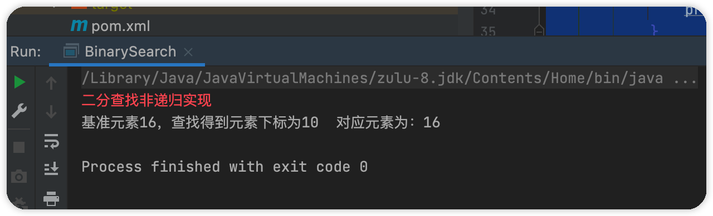
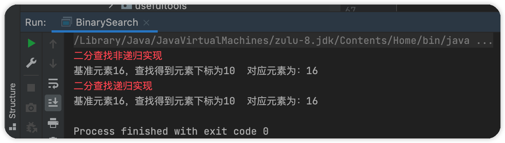

#### 二分查找

> 二分查找，又叫折半查找，待查找集合要求有序。查找成功返回基准元素对应下标，查找失败返回-1。每次查找，基准元素和待查找集合中间元素比较，如果基准元素较大，待排序集合置为右半边集合，再次进行查找过程。如果基准元素较小，待排序集合置为左半边集合，再次进行查找过程。直到查找结束。

实现方式分为两种：

- 非递归实现
- 递归实现


##### 非递归实现

```java
/**
 * 二分查找-非递归实现
 * 思想：
 * 基准元素大于中间元素，原中间下标加一置为 左指针
 * 基准元素小于中间元素，原中间下标减一置为，右指针
 *
 * @param source
 * @param element
 * @return
 */
public static int binarySearchWithOut(int[] source, int element) {
    int prev = 0;
    int last = source.length;
    int mid = 0;
    while (prev <= last) {
        mid = (prev + last) / 2;
        if (element == source[mid]) {
            return mid;
        } else if (element <= source[mid]) {
            //左
            last = mid - 1;
        } else {
            prev = mid + 1;
        }
    }
    return -1;
}

public static void main(String[] args) {
    final int[] source = new int[]{1, 3, 5, 7, 8, 9, 11, 12, 13, 15, 16, 16, 22, 23, 34, 56, 211,};
    System.err.println("二分查找非递归实现");
    final int index = binarySearchWithOut(source, 16);
    System.out.println("基准元素16，查找得到元素下标为" + index + "  " + "对应元素为：" + source[index]);
}
```




##### 递归实现

> 对于这种结束循环条件很明确的算法，很适合使用递归实现。

```java
public static int binarySearch(int[] source, int prev, int last, int element) {
    int mid = (prev + last) / 2;
    if (prev <= last) {
        if (element == source[mid]) {
            return mid;
        } else if (element > source[mid]) {
            return binarySearch(source, mid + 1, last, element);
        } else {
            return binarySearch(source, prev, mid - 1, element);
        }
    }
    return -1;
}

public static void main(String[] args) throws InterruptedException {
    final int[] source = new int[]{1, 3, 5, 7, 8, 9, 11, 12, 13, 15, 16, 16, 22, 23, 34, 56, 211,};
    System.err.println("二分查找递归实现");
    final int index2 = binarySearch(source, 0, source.length, 16);
    System.out.println("基准元素16，查找得到元素下标为" + index + "  " + "对应元素为：" + source[index2]);
}
```

