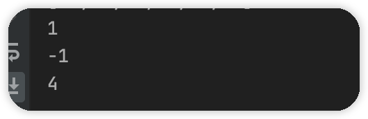

### 字符串匹配

> 字符串匹配算法指的是用于计算一个“文本串”是否包含了一个“模式串”，我们分别使用txt和pat表示。如果可以匹配返回首次匹配的下标，否则返回-1。

有多中算法：

- 暴力匹配
- KMP（Knuth-Morris-Pratt）算法

这里我们重点讨论这两种。


#### 暴力匹配

> 在Java中字符串底层是一个字符数组，暴力匹配算法的做法就是，存在两个指针I和J，外循环遍历“文本串”，内循环遍历“模式串”，如果出现不匹配的情况，会同时回退I和J，如此会多出很多不必要的比较，导致算法时间复杂度低效。

##### java实现

```java
private static int simpleCompare(String txt, String pat) {
    //模式字符串长度
    final int P = txt.length();
    //文本字符串长度
    final int Q = pat.length();

    //长度得够才可以包含
    for (int i = 0; i <= P - Q; i++) {
        int j;
        for (j = 0; j < Q; j++) {
            if (txt.charAt(i + j) != pat.charAt(j)) {
                break;
            }
        }
        if (j == Q) {
            return i;
        }
    }
    //未匹配返回-1
    return -1;
}
public static void main(String[] args) {
	  System.out.println(simpleCompare("123321", "123"));
 	 	System.out.println(simpleCompare("abcd", "cd"));
	  System.out.println(simpleCompare("abcdab", "bc"));
  	System.out.println(simpleCompare("abcdab", "x"));
}
```


> 暴力匹配未对文本串中已匹配的字符串部分做分析，而是每次都回退，会产生很多不必要的比较，由此KMP算法来了。


### KMP

> KMP算法相对暴力算法有着较大改进，主要解决文本串指针回退问题，避免不必要的重复比较，从而提高效率。那么它是如何解决模式串指针回退问题的呢？

以一个例子说明：

文本串：ABCDABEABCDABCDABDE

模式串：ABCDABD

1、匹配失败后移

2、

> 模式串后移四位。关键点就在于如何计算模式串移动的位数。
>
> 模式串移动位数 = 已匹配字符数 - 已匹配字符数部分匹配值（最大）
>
> 重点在于计算部分匹配值，下面再说先匹配


3、


##### 部分匹配值

> 部分匹配值，由生成的部分匹配表查出，部分匹配表由字符串的前缀后缀共有元素最大长度得出。

部分匹配表：

| 字符串     |  A   B   C   D   A   B   |
| ---------- | :----------------------: |
| 部分匹配值 | 0    0   0   0    1    2 |

字符串的前缀后缀：

| 字符串 | A   B   C   D   A   B   |
| ------ | ----------------------- |
| 前缀   | A、AB、ABC、ABCD、ABCDA |
| 后缀   | B、AB、DAB、CDAB、BCDAB |

部分匹配表如何生成：

“A”对应前缀后缀为空集：

| 字符串   | 前缀                             | 后缀                             | 部分匹配值 | 说明                    |
| -------- | -------------------------------- | -------------------------------- | ---------- | ----------------------- |
| “A”      | []                               | []                               | 0          | “A”的前缀后缀都为空集   |
| “AB”     | ["A"]                            | ["B"]                            | 0          | 前缀后缀共有元素长度为0 |
| “ABC”    | ["A"、"AB"]                      | ["C"、"BC"]                      | 0          | 前缀后缀共有元素长度为0 |
| "ABCD"   | ["A"、"AB"、“ABC”]               | ["D"、"CD"、“BCD”]               | 0          | 前缀后缀共有元素长度为0 |
| “ABCDA”  | ["A" "AB" “ABC”  “ABCD”]         | ["A" ”DA" "CDA"  “BCDA”]         | 1          | 共有元素为“A”，长度为1  |
| “ABCDAB” | ["A" "AB" “ABC”  “ABCD” “ABCDA”] | ["B" “AB" "DAB"  “CDAB” ”BCDAB“] | 2          | 共有元素为”AB“长度为2   |

##### next数组

> 部分匹配表已经得到了，此刻我们已经知道，在失配的时候模式串右移位数

模式串右移位数 = 已匹配字符数 - 已匹配字符数最大部分匹配值

> 这里就可以看出，确定模式串的右移位数，我们无需考虑首次失配字符，只需考虑已匹配字符串（也就是适配字符之前的字符串）。因此引入next[]数组，同时也是为了方便运算。
>
> next[]数组，next[j]表示，j为首个失配字符，[0,j-1]这一串字符串为已匹配字符串，其最大部分匹配值就是next[j]。

> 也就是最大部分匹配值右移~，且第一位初始化为1。

模式串右移位数 = 已匹配字符数 - 已匹配字符数最大部分匹配值 

= 已匹配字符数 - (next[失配下标]+1)

= 失配下标 - next[失配下标]

| 模式串         | A    | B    | C    | A    | B    |
| -------------- | ---- | ---- | ---- | ---- | ---- |
| 最大部分匹配值 | 0    | 0    | 0    | 1    | 2    |
| next数组       | -1   | 0    | 0    | 0    | 1    |


> 代码实现

- 第一位为-1
- 第二位为0（因为第一位最大部分匹配值为0）
- k表示前缀下标，会回退、j表示后缀下标不会回退
- `pat[j] == pat[k]`时表示 模式串 0 - j ，最大匹配值为k+1，所以next[++j] = ++k
- 否则，k回退为之前最大部分匹配值

```java
static int[] next(char[] pat) {
    int pLen = pat.length;
    final int[] next = new int[pLen];
    //第一位为-1
    next[0] = -1;
    //k 为 next[j]
    int k = -1;
    int j = 0;
    while (j < pLen - 1) {
        //p[k]表示前缀，p[j]表示后缀
        if (k == -1 || pat[j] == pat[k]) {
            next[++j] = ++k;
        } else {
            k = next[k];
        }
    }
    return next;
}
```

测试：

```java
public static void main(String[] args) {
    String str  = "ABDABC";
    final int[] next = next(str.toCharArray());
    System.out.println(CollectionUtils.arrayToList(next));
}
```


##### java实现KMP

> pat为模式串，txt为文本串。

有几点：

- 某次循环首个字符不匹配。那么文本串后移，模式串归0
- 模式串文本串对应字符匹配，那么模式串文本串都后移
- 如果不匹配。那么模式串整体右移，而模式串对应指针j需要回归

举例子：


模式串整体后移 = j  - next[j]

模式串整体右移几位，j指针位置就要回归几位  ： j = j - (j - next[j])

即 j = next[j]

```java
public static int kmp(String txt, String pat) {
    final char[] t = txt.toCharArray();
    final char[] p = pat.toCharArray();
    Assert.isTrue(t.length >= p.length, "文本串不能比模式串小");
    //获取next数组
    final int[] next = next(pat.toCharArray());
    //文本串指针
    int i = 0;
    //模式串指针
    int j = 0;
    while (i < t.length && j < p.length) {
        //j = -1也就是上次循环首个字符不匹配，那么文本串都后移一位。模式串归0
        //如果匹配，模式串文本串都后移一位
        if (j == -1 || t[i] == p[j]) {
            i++;
            j++;
        } else {
            //不匹配，模式串移动位数 = 当前下标 - 对应next值 = j - next[j]
            //模式串移动几位那么j就得回退多少 j = j - (j - next[j])
            j = next[j];
        }
    }
    //模式串比较完毕那么匹配成功
    if (j == p.length) {
        return i - j;
    } else {
        return -1;
    }
}
```

测试：

```java
System.out.println(kmp("123456", "23"));
System.out.println(kmp("123456", "xxx"));
System.out.println(kmp("ABCAADFCXW", "ADFC"));
```




##### 优化

> 这里对于next数组的求值存在优化点。

同样以例子说明：


> 个人觉得抽象至极，但很合理，只能想象，没有证据~~。

```java
static int[] nextNew(char[] pat) {
    final int pLen = pat.length;
    final int[] next = new int[pLen];
    //第一位为-1
    next[0] = -1;
    //k为 前缀下标，k会回退
    int k = -1;
    //j为后缀下标，j不回退
    int j = 0;
    while (j < pLen - 1) {
        //p[k]表示前缀，p[j]表示后缀
        if (k == -1 || pat[j] == pat[k]) {
            //相等时,若后缀出现不匹配的情况，需要跳过前缀与文本串的比较
            if (pat[++k] == pat[++j]) {
                next[j] = next[k];
            } else {
                next[j] = k;
            }
        } else {
            k = next[k];
        }
    }
    return next;
}
```

