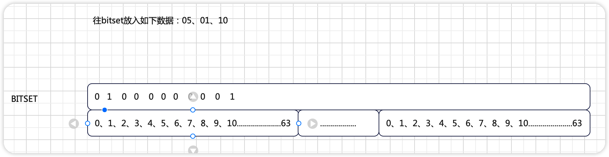
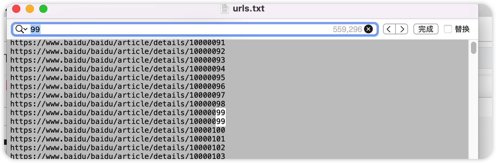
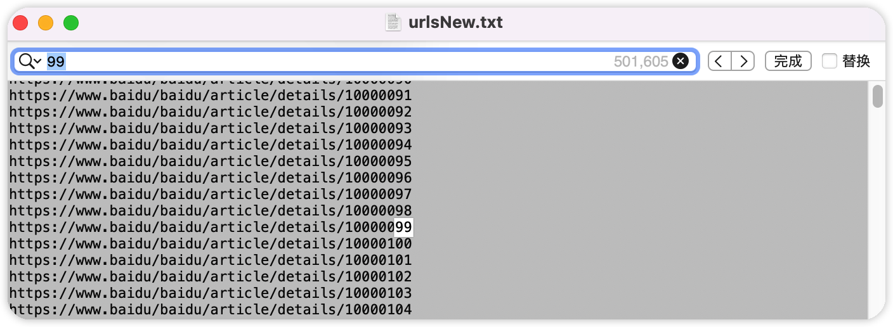
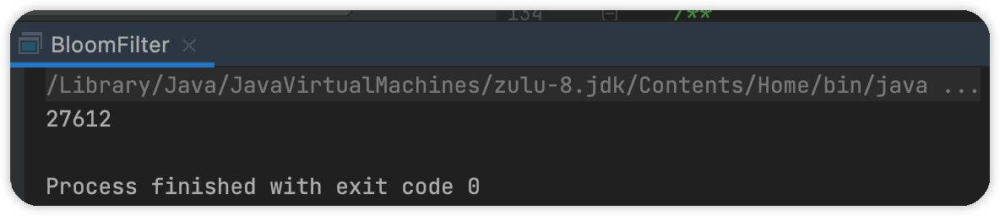
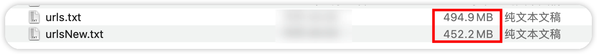

### 哈希表

> 对于数据去重存在很多算法，首先想到的就是哈希表。通过散列函数将可能出现的数据通过哈希值映射到表中的一个位置，通过哈希值可以加快查找速度。

一个典型的应用就是`HashMap`

存在以下特点

- 如果哈希值不等，那么对应的数据也是不等的
- 如果哈希值相等，那么对应的元素不一定不相等（存在碰撞的可能性）

#### hash表去重

> 利用`hashMap`快速查找的特性，我们可以利用其进行去重操作

```java
/**
 * 对数组去重
 *
 * @param source
 */
public static void withoutRepeat(int[] source) {
    final int[] temp = new int[source.length];
    final Map<Integer, Boolean> map = new HashMap<>();
    int index = 0;
    for (int element : source) {
        if (!map.containsKey(element)) {
            map.put(element, true);
            temp[index++] = element;
        }
    }
    System.arraycopy(temp, 0, source, 0, temp.length);
}
```


#### 缺点

> 对于大数据去重，哈希表就不再适用。

- 哈希表不仅仅只能做标记一个数据是否出现过，可以存储一个数据的附属状态，比如计算一个数据出现的次数，那么使用哈希表来去重有点大材小用了
- 哈希表的空间利用率只用50%，和其加载因子有关，之所以叫散列表是应为数据不连续，且哈希表也不是存满数据的


<hr>


### bitset

> 称为`位集`，是一种空间利用率很高的数据结构。而且所做的事情很存粹只是用于记录某个值是否出现过，通过1、0来判断。

#### 原理

BitSet使用一个long[]数组来存储元素状态，内部频繁使用位运算来确定元素对应数组下标，再通过或运算来修改该元素对应状态为1，一个long可以存储64个元素状态。极致的压缩了空间。但也存在缺点如果说元素值分布不均匀值与值之间存在较大的跨度，就会导致空间的利用率没有想象的那么大。



#### 去重

```java
public static int[] withoutRepeat(int[] source) {
    final BitSet bitSet = new BitSet();
    for (Integer element : source) {
        bitSet.set(element);
    }
    final int[] target = bitSet.stream().toArray();
    System.arraycopy(target, 0, source, 0, target.length);
    return target;
}
```


#### 优缺点

优点：

> bitset的空间复杂度不随原集合内个数的增加而增加

缺点

> bitset的空间复杂度随原集合内最大元素大小增加而增加


### 布隆过滤器

> 对于一个对象判断是否重复使用`BitSet`的话，一般会使用`BitSet`存储对象对应的哈希值，但是就会有一个问题：如果说这个对象对应的哈希算法很糟糕，出现碰撞的概率很高的话，那么BitSet出现误判的几率就很高。
>
> 应运而生的布隆过滤器(Bloom Filter)就出现了，其核心思想就是使用多个哈希函数来降低误判概率

#### 实现

- 哈希算法使用加权哈希
- 默认八次哈希，减少误判率
- bitset位数固定2^24，避免数据过大，降低空间利用率

```java
public class BloomFilter {

    /**
     * bitSet分配2^24位
     */
    private static final int DEFAULT_SIZE = 1 << 25;

    /**
     * 哈希种子，循环加权次数
     */
    private static final int[] SEEDS = new int[]{3, 5, 7, 11, 13, 31, 37, 61};
    /**
     * 位集，给定初始化范围，避免频繁扩容
     */
    private final BitSet bits = new BitSet(DEFAULT_SIZE);

    /**
     * 多次哈希的哈希函数
     */
    private final SimpleHash[] func = new SimpleHash[SEEDS.length];

    /**
     * 布隆过滤器，初始化哈希函数
     */
    public BloomFilter() {
        for (int i = 0; i < SEEDS.length; i++) {
            func[i] = new SimpleHash(DEFAULT_SIZE, SEEDS[i]);
        }
    }

    /**
     * 将字符串对应多次哈希结果记录到bitSet中
     */
    public void add(String value) {
        for (SimpleHash f : func) {
            bits.set(f.hash(value), true);
        }
    }

    /**
     * 判断是否重复
     */
    public boolean contains(String value) {
        if (value == null) {
            return false;
        }
        boolean ret = true;
        for (SimpleHash f : func) {
            ret = ret && bits.get(f.hash(value));
            //存在一次为0直接返回
            if (!ret) {
                break;
            }
        }
        return ret;
    }

    /**
     * 哈希函数类
     */
    @Data
    @AllArgsConstructor
    public static class SimpleHash {
        private final int cap;
        private final int seed;

        //采用简单的加权和hash
        public int hash(String value) {
            int result = 0;
            int len = value.length();
            for (int i = 0; i < len; i++) {
                result = seed * result + value.charAt(i);
            }
            //防止哈希过大
            return (cap - 1) & result;
        }
    }
}
```

#### 使用

> 对1000万个url进行去重


##### 生成10万个url

> 99的倍数则写两次，模拟重复数据

```java
/**
 * 生成1000万个url
 */
@Test
public void test() {
    String filePath = "/Users/rolyfish/Desktop/MyFoot/testfile";
    String fileName = "urls.txt";
    int urlNum = 10000000;
    String baseUrl = "https://www.baidu/baidu/article/details/";
    try (FileWriter fileWriter = new FileWriter(new File(filePath, fileName), true)) {
        //生成100000个url
        for (int i = 0; i < urlNum; i++) {
            //写两次
            if (i % 99 == 0) {
                fileWriter.write(baseUrl + (urlNum + i));
                fileWriter.write(System.lineSeparator());
                fileWriter.flush();
            }
            fileWriter.write(baseUrl + (urlNum + i));
            fileWriter.write(System.lineSeparator());
            fileWriter.flush();
        }
        fileWriter.flush();
        fileWriter.close();
    } catch (IOException e) {
        System.out.println();
    }
}
```

这里是存在重复数据的,而且文件还是挺大的。




##### 测试去重

> 读取url文件，一行一行读，判断是否重复，不重复写入新的文件中。

```java
/**
 * 使用此布隆过滤器对10万个url去重
 */
public static void main(String[] args) {
    final long start = Calendar.getInstance().getTime().getTime();
    final BloomFilter bloomFilter = new BloomFilter();
    String filePath = "/Users/rolyfish/Desktop/MyFoot/testfile";
    String fileName = "urls.txt";
    String fileNameNew = "urlsNew.txt";
    final File fileUrl = new File(filePath, fileName);
    final File fileUtlNew = new File(filePath, fileNameNew);
    if (!fileUrl.exists()) {
        System.out.println("文件不存在");
    }
    String buffer = "";
    try (
            final FileReader fileReader = new FileReader(fileUrl);
            final BufferedReader bufferedReader = new BufferedReader(fileReader);
            final FileWriter fileWriter = new FileWriter(fileUtlNew)) {
        while ((buffer = bufferedReader.readLine()) != null) {
            if (!bloomFilter.contains(buffer)){
                fileWriter.write(buffer);
                fileWriter.write(System.lineSeparator());
                fileWriter.flush();
            }
            //添加到布隆过滤器
            bloomFilter.add(buffer);
        }
        fileWriter.close();
        fileReader.close();
    } catch (IOException e) {
        System.out.println("io异常");
    }
  	final long end = Calendar.getInstance().getTime().getTime();
  	System.out.println(end - start);
}
```

实现了去重，且速度是可观的。








##### Google提供的布隆过滤器

> Google为我们提供的布隆过滤器，位于`com.google.common.hash`包下。原理相似。

依赖

```xml
<dependency>
    <groupId>com.google.guava</groupId>
    <artifactId>guava</artifactId>
    <version>31.1-jre</version>
</dependency>
```


使用：

```java
public static void main(String[] args) {
    /**
     * 参数说明：
     *  - 参数漏斗
     *  - 预期插入多少次
     *  - 预期误判率
     */
    BloomFilter<String> filter = BloomFilter.create(Funnels.stringFunnel(Charset.defaultCharset()), 100, 0.01);

    /**
     * 将元素放入布隆过滤器
     * - 位集发生改变则一定是首次添加返回true
     * - 位集未发生改变，可能不是首次添加（存在误判），返回false
     */
    filter.put("123");

    /**
     * 判断元素是否存在于位集
     * - false 一定不存在
     * - true  可能存在（存在误判）
     */
    filter.test("123");
}
```