排序算法经过长时间演变，已很成熟，也有很多方案，每种排序算法都有其优点与缺点，需要在不同场合结合算法特性选择使用。

## 排序算法

排序算法大致分为两大类：

- 内排序
- 外排序

> 内排序指的是在排序过程中所有数据、记录都存在内存中，在内存中完成排序操作。外排序指的是如果待排序数据量庞大，在排序过程中需要使用外部存储设备，需要外部存储设备协助排序来减轻内存压力，存在内外存数据交互。内排序是外排序的基础。
>
> 这里列的都是内排序。

内排序又分为：

1. 插入排序
   - 直接插排序
   - 希尔排序
2. 选择排序
   - 直接选择排序
   - 堆排序
3. 交换排序
   - 冒泡排序
   - 快速排序
4. 归并排序
5. 基数排序


排序算法时间、空间复杂度：

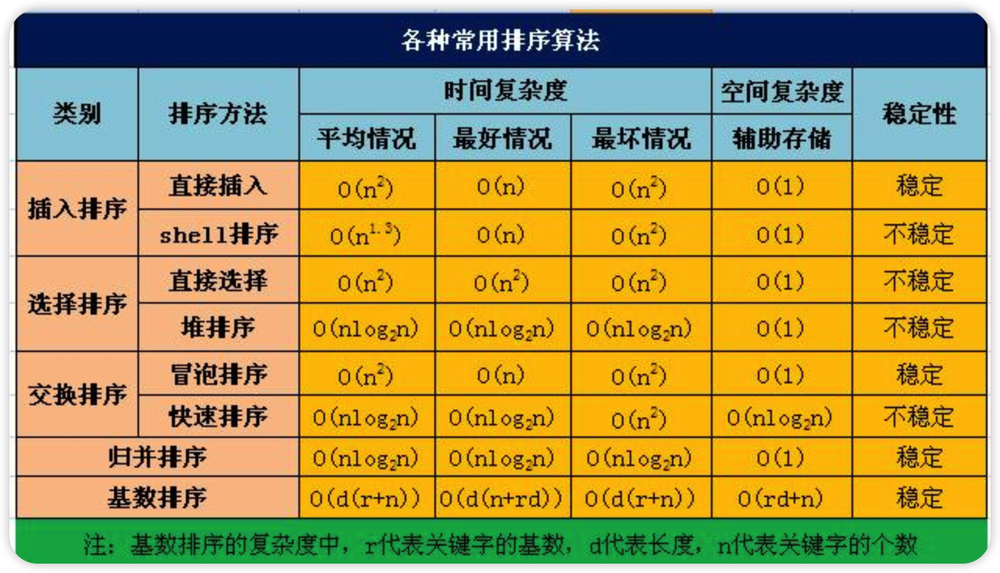


### 插入排序

> 插入排序按实现方式不同分为：

- 直接插入排序
- 二分插入排序
- 希尔排序

#### 直接插入排序

> 直接插入排序(Straight Insertion Sort)的基本思想是: 把n个待排序的元素看成为一个有序表和一个无序表。开始时有序表中只包含1个元素，无序表中包含有n-1个元素，排序过程中每次从无序表中取出第一个元素，将它插入到有序表中的适当位置，使之成为新的有序表，重复n-1次可完成排序过程。

图示：

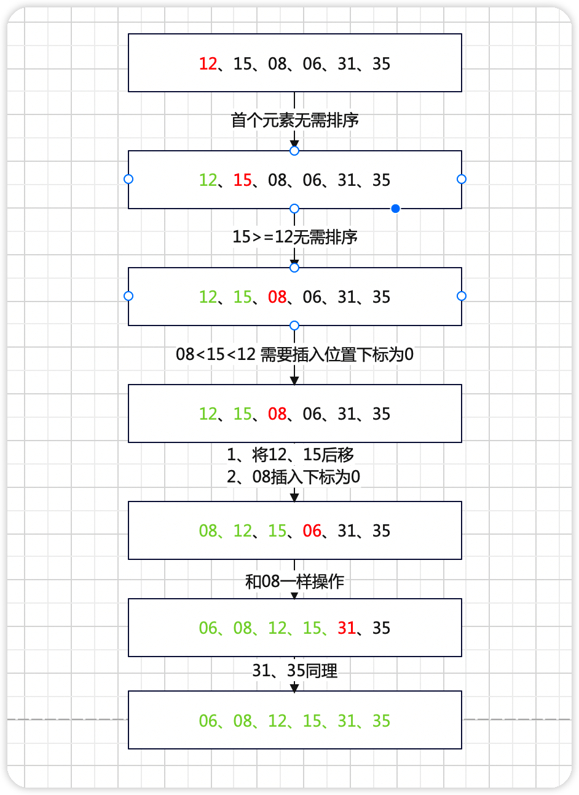

##### 实现步骤

- 取出无序序列第一个元素，并找出其在有序序列对应的位置
- 将无序区的第一个元素插入到有序区，在有必要时对有序序列元素进行整体右移


如何确定无序序列第一个元素插入位置？

> 当无序序列第一个元素大于等于第一个有序序列某个元素，其插入位置为此元素的后一位。

有序序列何时需要移位？

> 当无序序列第一个元素大于等于有序序列的最大值时，无需移位。
>
> 否则需要移位

##### 时间复杂度

> 遍历一趟的时间复杂度为O(n)，需要遍历n-1此，因此时间复杂度为O(n^2^)。


##### 稳定性

排序算法稳定性定义:

假设在序列中,a[i] = a[j],若排序前,a[i] 在 a[j]之前。排序之后,a[i] 任在 a[j]之前，那么这个算法是稳定的。

> 直接插入排序满足算法稳定性。

##### java实现

```java
public class SortUtils {
    /**
     * @param size      数组大小
     * @param lowLimit  下限
     * @param highLimit 上限
     * @return 集合
     */
    public static Integer[] createRandomColl(int size, int lowLimit, int highLimit) {
        Assert.check(size > 0, "数组长度需要大于0");
        final Integer[] coll = new Integer[size];
        for (int i = 0; i < size; i++) {
            coll[i] = lowLimit + (int) (Math.random() * (highLimit - lowLimit));
        }
        return coll;
    }
  	public static <T> void print(T[] t) {
        final StringBuilder sb = new StringBuilder("[");
        for (T t1 : t) {
            sb.append(t1 + "、");
        }
        sb.replace(sb.lastIndexOf("、"), sb.lastIndexOf("、") + 1, "]");
        System.out.println(sb);
    }
}

public class StraightInsertionSort<T extends Comparable> {

    public static <T extends Comparable> void straightInsertionSort(T[] array) {
        straightInsertionSort(array, 0, array.length - 1, true);
    }

    public static <T extends Comparable> void straightInsertionSort(T[] array, int last) {
        straightInsertionSort(array, 0, last, true);
    }


    public static <T extends Comparable> void straightInsertionSort(T[] array, int first, int last) {
        straightInsertionSort(array, first, last, true);
    }
    /**
     * @param array 待排序集合
     * @param first 排序起始下标
     * @param last  排序终止下标
     * @param flag  从0开始 true  从1开始 false
     */
    public static <T extends Comparable> void straightInsertionSort(T[] array, int first, int last, boolean flag) {
        last = Math.min(array.length, last);
        if (!flag) {
            first--;
            last--;
        }
        for (int i = first + 1; i <= last; i++) {
            //[first i-1]是有序的，给i在[first i-1]找个合适位置插入
            //遍历 i-1 到 first
            int j = i - 1;
            for (; j >= first; j--) {
                //待插入元素比，array[j]大于等于，插入位置确定了 j+1
                if (array[i].compareTo(array[j]) >= 0) {
                    break;
                }
            }
            //不相等才全体后移，相等插入位置即是当前位置，i++
            if (j != i - 1) {
                //缓存被覆盖的值，也是待插入元素
                T temp = array[i];
                int k = i - 1;
                //j+1 到 i-1 全体后移
                for (; k > j; k--) {
                    array[k + 1] = array[k];
                }
                //将值放入合适位置
                array[j + 1] = temp;
            }
        }
    }
    public static void main(String[] args) {
        final Integer[] randomColl = SortUtils.createRandomColl(10, 5, 15);
        SortUtils.print(randomColl);
        straightInsertionSort(randomColl);
        SortUtils.print(randomColl);
    }
}
```

结果：

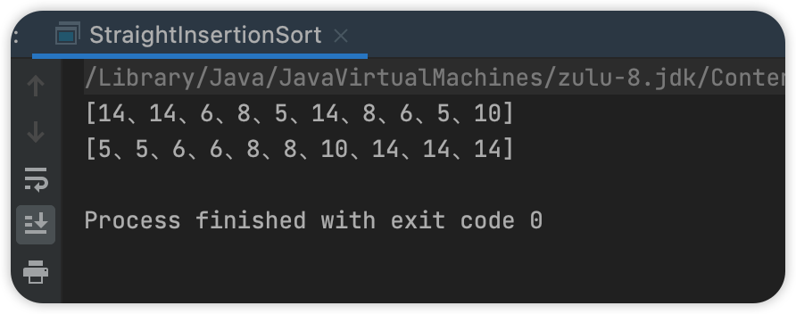


#### 二分法插入排序

> 选中待排序元素temp，在已有序集合中存在三个指针left、mid、right，每次循环temp和mid对应元素比较，循环条件为left<=right，当temp<source[mid]时 right = mid -1，否则left = mid+1。
>
> 二分法插入排序的基本思想是: 把n个待排序的元素看成为一个有序表和一个无序表。开始时有序表中只包含1个元素，无序表中包含有n-1个元素，排序过程中每次从无序表中取出第一个元素，将它插入到有序表中的适当位置，使之成为新的有序表，重复n-1次可完成排序过程。

图示：

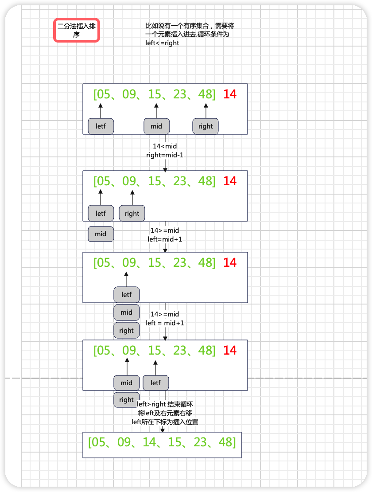

##### 实现步骤

- 取出无序序列第一个元素，并找出其在有序序列对应的位置
- 将无序区的第一个元素插入到有序区，在有必要时对有序序列元素进行整体右移

##### 时间复杂度

> 遍历一趟的时间复杂度为O(n)，需要遍历n-1此，因此时间复杂度为O(n^2^)。

##### 稳定性

> 满足算法稳定性。

##### java实现

```java
public class DichotomyInsertSort {

    /**
     * 核心思想
     * - 将待排序序列分为，有序和无序两部分
     * - 对有序序列进行标三个点 left、mid、right
     * - 无序序列每次取出首个元素，和mid进行比较
     * --- 大于等于，left = mid+1 mid = (left + right)/2
     * --- 小于 right = mid-1  mid = (left+mid)/2
     * --- 循环条件为 left <= right
     * --- 结束循环 left及其右边元素右移， 待插入元素插入 left所在下标位置
     */
    public static <T extends Comparable> void dichotomyInsertSort(T[] array, int first, int last, boolean flag) {
        if (!flag) {
            first--;
            last--;
        }
        int left = 0;
        int right = 0;
        int mid = 0;
        //待排序元素
        int tempIndex = first + 1;
        for (; tempIndex <= last; tempIndex++) {
            left = first;
            right = tempIndex - 1;
            T temp = array[tempIndex];
            while (left <= right) {
                mid = (right + left) / 2;
                if (array[tempIndex].compareTo(array[mid]) >= 0) {
                    left = mid + 1;
                } else {
                    right = mid - 1;
                }
            }
            if (left != tempIndex) {
                int m = tempIndex;
                for (; m > left; ) {
                    array[m] = array[--m];
                }
                array[left] = temp;
            }
        }
    }


    public static void main(String[] args) {

        final Integer[] randomColl = SortUtils.createRandomColl(20, 5, 15);
        SortUtils.print(randomColl);
        dichotomyInsertSort(randomColl, 0, randomColl.length - 1, true);
        SortUtils.print(randomColl);

    }

}
```

结果：

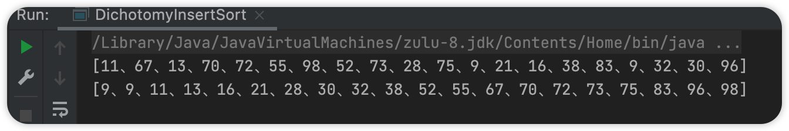

#### 希尔排序

> 希尔排序是将集合按照一定增量进行分组，分成多个子数组，对各个子数组进行直接插入排序，然后依次缩小赠量，直至增量为1进行最后一次直接插入排序。

增量的取值范围为：[1，数组长度）

一般首次取 数组长度/2，之后每次循环除以二

如此可以保证最后一次的增量为1。

//todo 这里图需要调整

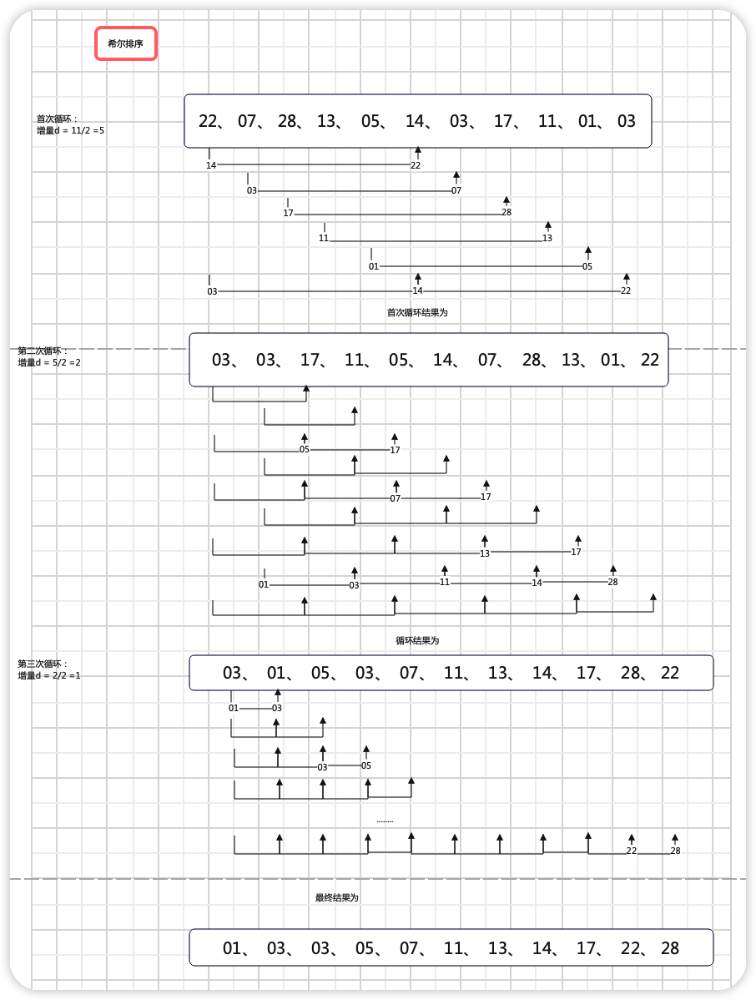


##### 实现步骤

- 设置步长，将待排序序列分组  ([0,gap,2gap]，[1,1+gap,1+2gap])
- 对每一组进行直接插入排序
- 缩小gap，一般 gap / = 2 ，直到gap = 1
- 重复上面操作

##### 时间复杂度

> 受步长影响，步长为1，退化为直接插入排序，时间复杂度为 O(n^2^)。

##### 稳定性

> 不稳定

希尔排序处理那些杂乱无章的序列时，比起直接插入排序有很大优势。在序列很乱时，步长也很大，所以进行直接插入排序的元素很少，那么元素的移动次数就会少，速度很快；当序列基本上有序了，步长也变小了，直接插入排序对基本有序的序列效率不差，因此相较于直接插入排序效率来的要高。由于序列按步长进行分组，在各种组中排序是稳定的，但是相同的元素在各种分组中移动是不可知的，因此稳定性会被打乱。


##### java实现

> 实现关键

- 增量的起始量一般为数组长度一半，之后依次除二
- 在此增量上对数组进行分组，分组后进行直接插入排序

> 比直接插入排序好在哪里

直接插入排序，是一个双循环排序，对于已有序的集合排序友好，但是对于杂乱无章的集合不友好。且直接插入排序在移动元素时步长为1，需要移动多次。而希尔排序移动数组步长为step(增量)，移动元素次数变少了，通过多次分组后得到了一个差不多有序的集合，再进行最后一次直接插入排序。

```java
public class XiErInsertSort {

    public static <T extends Comparable> void xiErInsertSort(T[] source) {
        xiErInsertSort(source, 0, source.length - 1, source.length / 2, true);
    }

    /**
     * 希尔排序是对直接插入排序的一种优化
     * 直接插入排序的缺点：每次循环只插入一个值，对于有序集合友好，对于杂乱集合，需要频繁移动元素
     * 希尔排序优化思路：将源集合以某个增量分组，对各分组内的元素进行直接插入排序（由于增量的存在移动元素次数不再频繁）
     * <p>
     * 增量选择：一般为集合长度一半，依次除二，直到为1。增量的选择不互为倍数
     *
     * @param source 源集合
     */
    public static <T extends Comparable> void xiErInsertSort(T[] source, int first, int last, int gap, boolean flag) {
        if (!flag) {
            first--;
            last--;
        }

        gap = Math.min(gap, source.length);

        //存储每次直接插入排序的待插入元素
        T temp;

        //gap为步长，每次除二， 直到gap = 1
        for (; gap >= 1; gap /= 2) {
            //共gap组（0 - gap-1），对每一组进行直接插入排序
            for (int i = 0; i < gap; i++) {
                /**
                 * 0 gap 2gap
                 * 1 gap+1 2gap+1
                 * ...
                 * gap-1 2gap-1 3gap-1
                 */

                /**
                 *  对每一组进行直接插入排序
                 *
                 *  有序序列  j-2gap j-gap
                 *  无序序列  j j+gap j+2gap
                 *
                 *  j为待插入无序序列首个元素
                 */
                int j = i + gap;
                for (; j <= /*source.length-1*/last; j += gap) {
                    //j为待插入元素，即分组后无序序列的首个元素，给j找个合适位置落下

                    //遍历 j-gap j-2gap ...
                    int m = j - gap;
                    for (; m >= /*0*/first; m -= gap) {
                        //待插入元素比，source[m] 大于等于，插入位置确定了 m+gap
                        if (source[j].compareTo(source[m]) >= 0) {
                            break;
                        }
                    }
                    //不相等才全体后移，相等插入位置即是当前位置，i+gap
                    if (m != j - gap) {
                        temp = source[j];
                        int q = j - gap;
                        //m+gap m+2gap 后移，
                        for (; q > m; q -= gap) {
                            source[q + gap] = source[q];
                        }
                        source[m + gap] = temp;
                    }
                }
            }
        }
    }

    public static void main(String[] args) {
        final Integer[] randomColl = SortUtils.createRandomColl(15, 0, 45);
        SortUtils.print(randomColl);
        xiErInsertSort(randomColl);
        SortUtils.print(randomColl);

    }
}
```

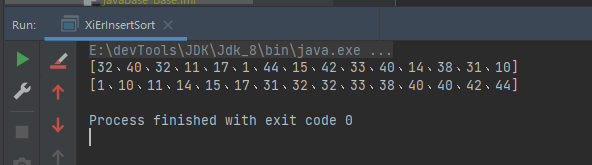


### 选择排序

> 每趟从待排序记录中找出最小的元素，放到已排序记录中的最后面，直到排序完成。

> 大致分为

- 直接选择排序
- 堆排序


#### 直接选择排序

> 在待排序记录中假设首个元素为最小元素min，待排序存在比min小的元素，则该元素和min元素互换位置，直到排序完成。
>
> 将待排序序列分为有序、无序两部分，首次循环有序序列为空。
>
> 每次循环找出最下(大)zhi1

图示：

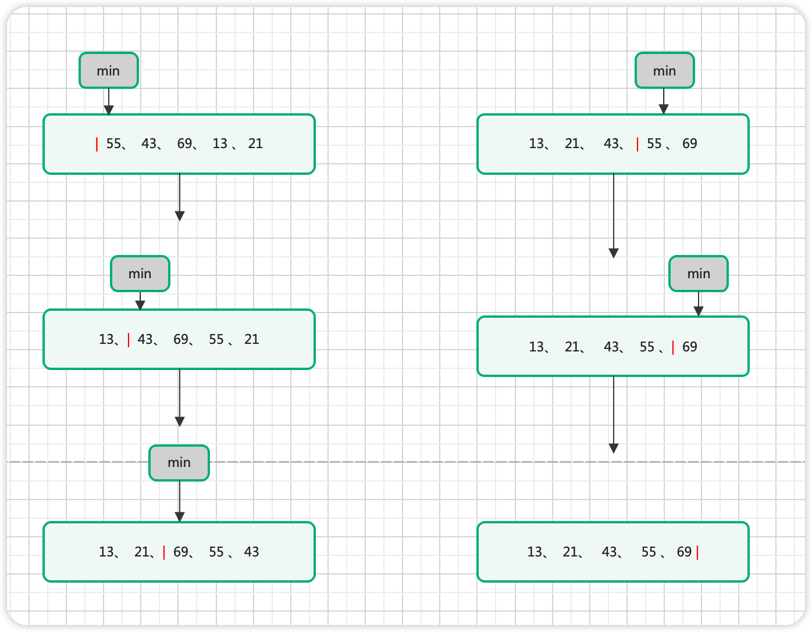


##### 实现步骤

- 将待排序序列分为有序无序两部分，首次循环有序序列为空
- 在无序序列中找出极值，以尾插法插入有序序列，循环直至排序完成


##### 时间复杂度

> 遍历一趟的时间复杂度为O(n)，需要遍历n-1此，因此时间复杂度为O(n^2^)。


##### 稳定性

> 直接选择排序不满足算法稳定性。
>
> 因为在交换时，极值的交换会破坏算法的稳定性

- 1、2、3、7、4、4   这种情况是满足的
- 1、2、3、7(1)、7(2)、4         这种则不满足

##### java实现

```java
public class SelectionSort {
    public static <T extends Comparable> void selectionSort(T[] array) {
        selectionSort(array, 0, array.length - 1);
    }
    public static <T extends Comparable> void selectionSort(T[] array, int last) {
        selectionSort(array, 0, last, true, true);
    }
    public static <T extends Comparable> void selectionSort(T[] array, int first, int last) {
        selectionSort(array, first, last, true, true);
    }
    public static <T extends Comparable> void selectionSort(T[] array, int first, int last, boolean flag) {
        selectionSort(array, first, last, flag, true);
    }

    /**
     * 直接选择排序
     * @param array
     * @param first 排序上界
     * @param last  排序下届
     * @param flag  二进制？
     * @param desc  fales 降序   true升序
     * @param <T>
     */
    public static <T extends Comparable> void selectionSort(T[] array, int first, int last, boolean flag, boolean desc) {
        if (!flag) {
            first--;
            last--;
        }
        //split 为无序序列首个元素
        for (int split = first; split <= last; split++) {
            //最值下标
            int tempIndexTemp = split;
            int tempIndex = split + 1;
            for (; tempIndex <= last; tempIndex++) {
                if (desc) {
                    //tempIndex 为新的最值
                    if (array[tempIndex].compareTo(array[tempIndexTemp]) < 0) {
                        tempIndexTemp = tempIndex;
                    }
                } else {
                    //tempIndex 为新的最值
                    if (array[tempIndex].compareTo(array[tempIndexTemp]) > 0) {
                        tempIndexTemp = tempIndex;
                    }
                }
            }
            //交换位置
            if (tempIndexTemp != split) {
                //缓存极值
                T temp =array[tempIndexTemp];
                array[tempIndexTemp] = array[split];
                array[split] = temp;
            }
        }
    }
    public static void main(String[] args) {
        final Integer[] randomColl = SortUtils.createRandomColl(30, 5, 100);
        SortUtils.print(randomColl);
        selectionSort(randomColl);
        SortUtils.print(randomColl);
    }
}
```

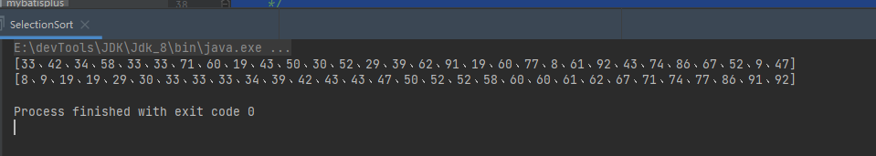


#### 堆排序

> 堆我们一般指的是二叉堆，及一颗完全二叉树，一般以数组的形式存储。

##### 分类

- 大顶堆

  - > 及任意父元素的值大于其任意子元素，此刻堆顶为序列最大值

- 小顶堆

  - > 反之为小顶堆


##### 性质

- 是一颗完全二叉树
- 有序性，任意父节点值大于（小于）其子节点
- 父节点下标i，其左子节点`2*i+1`，右节点`2*i+2`
- 节点下标i，其父节点为 `(i-1)/2`


##### 数据结构

大顶堆小顶堆图示：

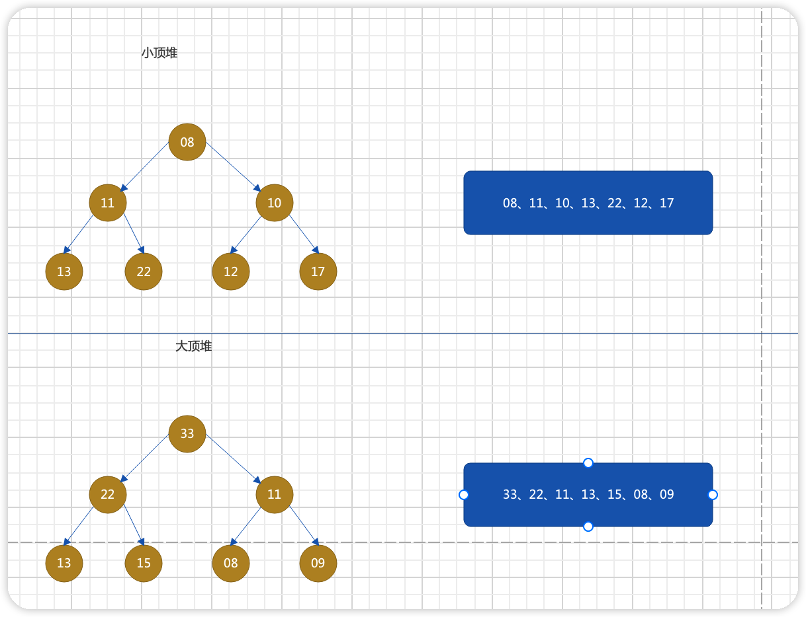

存储结构：

> 堆一般以数组作为其存储结构，任意节点n，其两个子节点为2n+1和2n+2，如果是大顶堆则父节点大于两个子节点，如果是小顶堆，父节点小于两个子节点。


##### PriorityQueue

> priorityQueue是java提供的使用堆实现的有序队列，可以借助参考

PriorityQueue默认升序排序，即默认小顶堆，不过可以修改Comparter来改变其为大顶堆。

```java
public class HeapSort {
    @Test
    public void testPriorityQueue() {
        final int[] randomColl = DirectInsertSort.createRandomColl(20, 10, 30);
        System.out.println("源集合");
        System.out.println(CollectionUtils.arrayToList(randomColl));
        System.out.println("小顶堆");
        final PriorityQueue<Integer> descHeap = new PriorityQueue<>((Collection<? extends Integer>) CollectionUtils.arrayToList(randomColl));
        descHeap.forEach(element -> {
            System.out.printf(element + ",");
        });
        System.out.println();
        System.out.println("大顶堆");
        final PriorityQueue<Integer> ascHeap = new PriorityQueue<>((ele1, ele2) -> ele1 > ele2 ? -1 : 1);
        for (int ele : randomColl) {
            ascHeap.add(ele);
        }
        ascHeap.forEach(element -> {
            System.out.printf(element + ",");
        });
    }
}
```

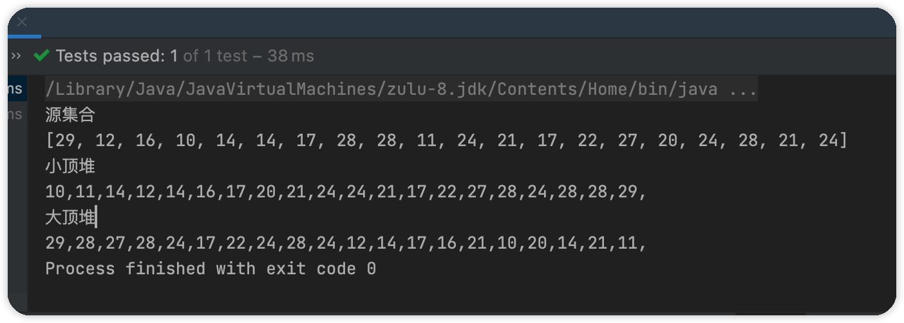

> 简单阅读PriorityQueue源码可以发现，实现堆排序，存在以下关键步骤。

- 如何构建一个堆

- 在踢出堆顶元素的时候如何保证，剩余元素可以调整为一个新堆

##### 实现步骤

> 排序算法一般都使用数据进行，实现一般尽量不申请额外的内存空间，也就是尽量使用原地算法。

- 如何将一个数组调整为为具有二叉堆性质的数组

  > - 任意父节点n，其子节点为2n+1和2n+2
  > - 任意子节点n，其父节点为(n-1)/2
  > - 任意父节点(大于或小于)其两个子节点
  >
  > 在调整之前数组中父子节点的位置就已经确定了，我们只需要遍历数组调整其父子关系即可，那么调整的起始下标为多少？方向是从后往前还是从前往后？
  >
  > 方向肯定是从后往前，因为从前往后的话，之前调整好的父子关系可能会被破坏。
  >
  > 对于(n-1)/2之后的所有节点，它们没有子节点，也就是无需调整，所以调整的起始节点为(n-1)/2

- 选举出极值后，剩余节点可以重新调整为新的二叉堆

  > 堆顶元素为极值，一般会使用堆顶元素和最后一个元素进行交换，交换完后对剩余元素进行调整

- 调整的逻辑

  > 从后往前调整，必然会对其父节点造成影响，所以我们需要循环对其所有父节点进行检查

##### 时间复杂度

> O(n*lg(n))


##### 稳定性

> 不满足算法稳定性。
>
> 因为在交换时，父子节点的交换会破坏算法的稳定性

##### Java实现

```java
public class HeapSort {

    /**
     * 小顶堆向下调整
     *
     * @param array 原数组
     * @param start 下调节点的起始位置 一般为0，表示从第一个开始
     * @param end   终止下标，一般为数组最后一个下标
     * @param <T>
     */
    public static <T extends Comparable> void minHeapDown(T[] array, int start, int end) {
        //父节点，被下调的父节点
        int parent = start;
        //待上调子节点,默认左子节点，为左右子节点中较小的
        int son = 2 * parent + 1;
        //循环截止条件：没有子节点
        for (; son <= end; ) {
            /**
             * 防止下标越界，即存在左子节点，不存在右子节点
             * 右子节点较小
             */
            if (son < end && array[son].compareTo(array[son + 1]) > 0) {
                //选择较小的子节点
                son++;
            }
            // 父节点较大，则交换位置
            if (array[parent].compareTo(array[son]) > 0) {
                T temp = array[parent];
                array[parent] = array[son];
                array[son] = temp;
                //如果 parent被下调了，那么下调之后的位置也需要调整
                parent = son;
                //更新子节点
                son = 2 * son + 1;
            } else {
                //无需调整则跳出循环
                break;
            }
        }
    }

    /**
     * @param array
     * @param <T>
     */
    public static <T extends Comparable> void createMinHeap(T[] array) {
        int end = array.length - 1;
        //(n - 1) / 2为最后一个父节点，从他开始调整。调整完后得到一个小顶堆
        for (int parent = (end - 1) / 2; parent >= 0; parent--) {
            minHeapDown(array, parent, end);
        }
    }

    /**
     * @param array
     * @param <T>
     */
    public static <T extends Comparable> void heapSort(T[] array) {
        //转化为小顶堆
        createMinHeap(array);
        /**
         * 对小顶堆进行排序
         * - 首先堆顶元素是最小值，拿出来和数组最后一个元素进行交换
         * - 交换完成后，对剩余数组进行堆调整
         */
        for (int i = array.length - 1; i >=0 ; i--) {
            //堆顶元素
            T temp = array[0];
            array[0] = array[i];
            array[i] = temp;
            minHeapDown(array, 0, i - 1);
        }
    }

    public static void main(String[] args) {
        final Integer[] randomColl = SortUtils.createRandomColl(20, 0, 100);
        SortUtils.print(randomColl);
        //createMinHeap(randomColl);
        heapSort(randomColl);
        SortUtils.print(randomColl);
    }
}
```

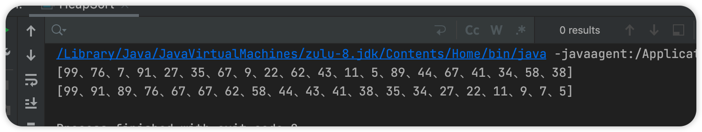


<hr>


### 交换排序

> 即在合适的位置交换元素，循环结束后可以达到集合有序的目的。

> 分为

- 冒泡排序
- 快速排序

#### 冒泡排序

> 同样对一个集合分为有序和无序两部分。冒泡排序在每次便利时会对无序集合自上到下两两相邻的元素依次进行比较和调整，较大元素下沉，较小元素上浮，也就是当相邻两个元素之间的排序规则与预期相悖则交换他们的位置，这样一趟下来，最后一个元素为极值，如此循环直至序列有序。

图示：

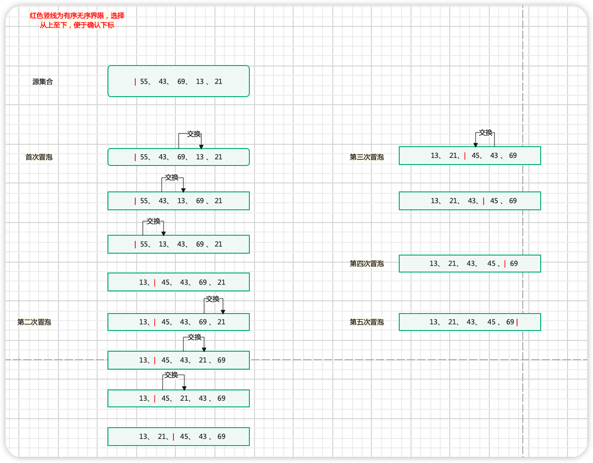

##### 时间复杂度

> 遍历一趟的时间复杂度为O(n)，需要遍历n-1此，因此时间复杂度为O(n^2^)。


##### 稳定性

> 满足稳定性算法。

##### java实现

> 大致可以分为两种思路：每次循环将最大值下沉和每次循环将最小值上浮。

需要注意的是内循环，循环的次数，减少非必要循环。

```java
public class BubbleSort {

    /**
     * 冒泡排序
     *
     * @param array 待排序数组
     * @param start 起始下标
     * @param end   终止下标
     * @param <T>
     */
    public static <T extends Comparable> void bubbleSort(T[] array, int start, int end) {
        /**
         * 每趟循环会对数组相邻两个元素，两两对比，大的下沉小的上浮，选举出最大元素在数组右侧，循环此操作直至数组有序
         */
        boolean flag = true;
        //缓存
        T temp = null;
        for (int i = start; i <= end; i++) {
            for (int j = start; j < end - i; j++) {
                if (array[j].compareTo(array[j + 1]) > 0) {
                    temp = array[j];
                    array[j] = array[j + 1];
                    array[j + 1] = temp;
                    if (flag) flag = false;
                }
            }
            //如果没有发生交换，说明数组已经有序，跳出循环
            if (flag) {
                break;
            }
        }
    }

    public static void main(String[] args) {

        final Integer[] randomColl = SortUtils.createRandomColl(20, 0, 100);
        SortUtils.print(randomColl);
        bubbleSort(randomColl, 0, randomColl.length - 1);
        SortUtils.print(randomColl);

    }

}
```

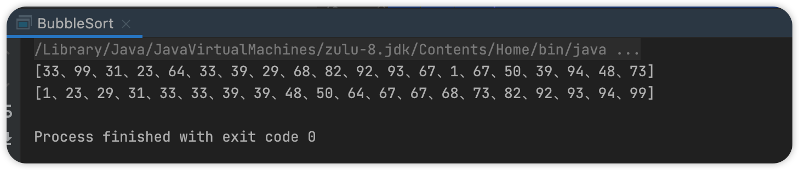


#### 快速排序

> 以一个元素为基准，经过一趟排序，将一个无序数组分为两部分，一部分比基准大，一部分比基准小，此刻基准元素处于正确的位置，再对这两个无序数组进行递归，直到完成排序。


##### 实现步骤

> 每一趟循环确定一个基准元素的位置，并返回其下标，作为递归的参数。

##### 时间复杂度

> 最坏 O(n^2^)  平均O(n*lg(n))

##### 稳定性

> 非稳定性算法。

5(1) 5(2) 3  =》 3 5(2) 5(1)

##### 代码实现

```java
public class QuickSort {

    public static <T extends Comparable> void quickSort(T[] array) {
        quickSort(array, 0, array.length - 1);
    }

    private static <T extends Comparable> void quickSort(T[] array, int l, int r) {
        if (l < r) {
            //基准元素确定位置并返回下标
            int midIndex = midIndex(array, l, r);
            //递归
            quickSort(array, l, midIndex - 1);
            quickSort(array, midIndex + 1, r);
        }
    }

    public static <T extends Comparable> int midIndex(T[] array, int l, int r) {
        //以第一个元素为基准
        int left = l;
        int right = r;
        T midEle = array[left];

        while (left < right) {
            //从右向左找出第一个小于基准的元素
            while (left < right && midEle.compareTo(array[right]) <= 0) {
                right--;
            }
            //将小的元素，移动到左边
            array[left] = array[right];
            //从左向右找出第一个大于基准的元素
            while (left < right && midEle.compareTo(array[left]) >= 0) {
                left++;
            }
            //将较大元素移动到右边
            array[right] = array[left];
        }
        array[left] = midEle;
        //以上确定了一个基准元素
        return left;
    }


    public static void main(String[] args) {

        final Integer[] randomColl = SortUtils.createRandomColl(20, 0, 100);
        SortUtils.print(randomColl);
        quickSort(randomColl);
        SortUtils.print(randomColl);

    }
}
```

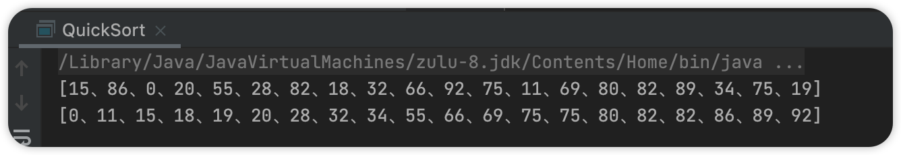


### 归并排序

> 归并排序会申请一个辅助数组空间，用于将两个已有序数组组合成一个新的有序数组，同时涉及到递归算法。

图示：

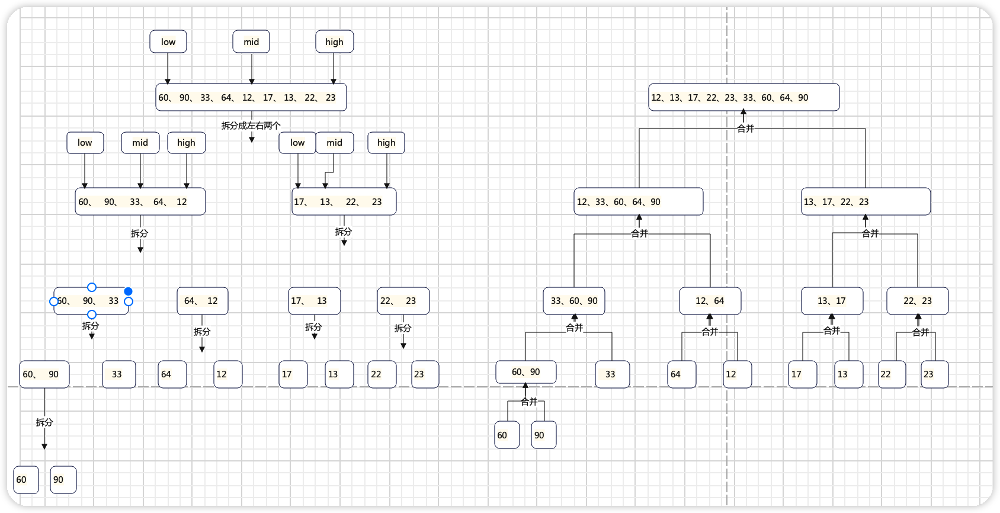


##### 实现步骤

> 这里只实现自上而下的归并排序。
>
> 将待排序序列一拆为二，对拆分后的两个序列做归并排序，也就是递归。当拆分后的序列只有一个元素时，也就是start == end 时，对序列进行两两合并，此刻的两个序列都是有序的，合并思路：两个有序序列逐个比较，较小的放入缓存数组直至有一个序列空了，然后将剩余的大元素直接放入缓存数组尾部，再同步到原序列。

##### 时间复杂度

> O(n*lg(n))

##### 稳定性

> 稳定

{5(1) 5(2) 2}  --> {5(1)}、{5(2)}、{2}  合并 => {5(1)、5(2)}、{2} => {5(1) 5(2) 2} 

{5(1)  2  5(2)  } -----> {5(1)}、2、{5(2)}  合并 => {5(1)、2}、{5(2)} => {5(1)  2  5(2)  } 

##### java实现

思路：

```java
public class MergeSort {
    public static void split(int[] source, int prev, int last) {
        //这是一个归并，得有结束归并的条件
        if (prev < last) {
            int mid = (prev + last) / 2;
            //左边
            split(source, prev,mid);
            //右边
            split(source,mid+1,last);
            //合并
            merge(source, prev,mid,last);
        }
    }

    private static void merge(int[] source, int prev, int mid, int last) {
        
    }
}
```

```java
public class MergeSort {

    /**
     * 自上而下的归并排序
     * - 一拆为二，对这两个序列进行归并排序
     * - 合并
     * 递归
     *
     * @param array
     * @param start
     * @param end
     * @param <T>
     */
    public static <T extends Comparable> void mergeSort(T[] array, int start, int end) {
        if (start < end) {
            //递归退出条件  start >= end 也就是待排序序列长度小于1了
            int mid = (start + end) / 2;
            //左边递归归并
            mergeSort(array, start, mid);
            //右边递归归并
            mergeSort(array, mid + 1, end);
            //对两个有序序列进行合并。 为啥是有序的？拆分到最后，序列个数都为1，一层一层合并都是有序的，这个算法是归并算法的核心
            merge(array, start, mid, end);
        }
    }

    public static <T extends Comparable> void merge(T[] array, int start, int mid, int end) {
        //需要一个缓存空间，存放两个有序序列合并后的结果
        T[] tempA = (T[]) Array.newInstance(Comparable.class, end - start + 1);
        int ls = start;
        int rs = mid + 1;
        int i = 0;
        /**
         * 逐个比较，小的放入缓存数组，直到一方为空
         */
        while (ls <= mid && rs <= end) {
            if (array[ls].compareTo(array[rs]) <= 0) {
                tempA[i++] = array[ls++];
            } else {
                tempA[i++] = array[rs++];
            }
        }

        //剩余的都是有序的且较大的直接放入缓存数组
        while (ls <= mid) {
            tempA[i++] = array[ls++];
        }
        while (rs <= end) {
            tempA[i++] = array[rs++];
        }

        //将缓存拷贝进原数组
        for (int j = 0; j < i; j++) {
            array[start + j] = tempA[j];
        }
        tempA = null;
    }

    public static void main(String[] args) {

        final Integer[] randomColl = SortUtils.createRandomColl(20, 0, 100);
        SortUtils.print(randomColl);
        mergeSort(randomColl, 0, randomColl.length - 1);
        SortUtils.print(randomColl);

    }

}
```

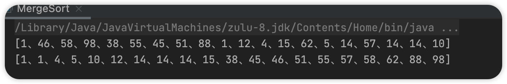


### 基数排序

> 首先对所有待排序集合元素同一长度，高位不足补0。依次从低位（个位）开始排序，直到最高位排序完成整个集合变为一个有序集合。
>
> 思想就是高位决定权较大，所以得靠后。

图示：

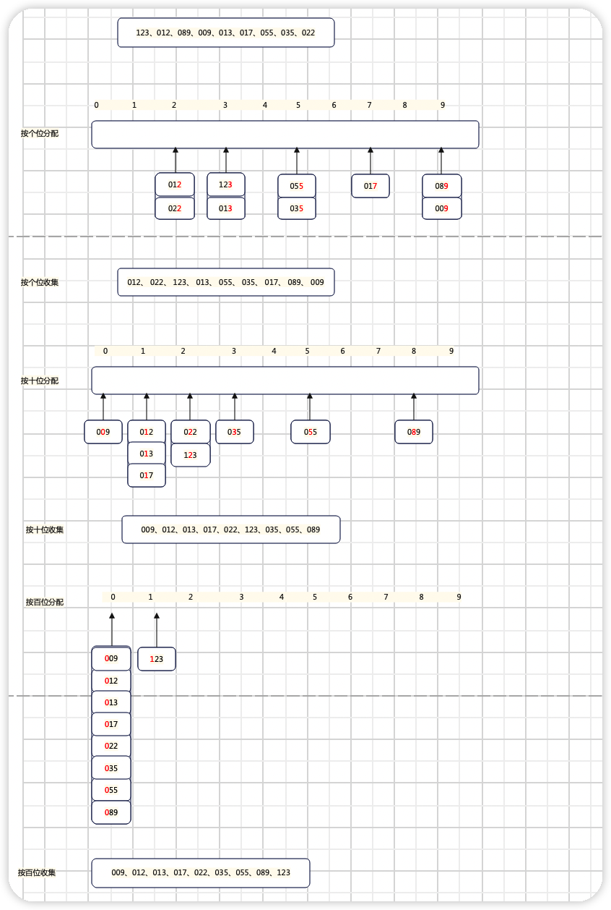

步骤：

- 计算最大数存在几位（确定循环次数）
- 需要一个桶存放各位相同的元素（十个  0  - 9 存在十位）


#####  java实现

> 获取集合最大数，并得到其最大位数，用于确定循环次数

```java
/**
 * 获取最大基数
 *
 * @param source 数组
 * @return 最大基数
 */
public static int getMaxRadix(int[] source) {
    int radix = 0;
    int max = source[0];
    for (int ele : source) {
        max = Math.max(max, ele);
    }
    do {
        radix++;
    } while ((max /= 10) > 0);
    return radix;
}
```

> 进行基数排序，重点在于

- 元素应该放入哪个桶？使用先取整再取余
- 一次循环结束需要清空桶

```java
public static void radixSort(int[] source) {

    //获取最大基数
    final int maxRadix = getMaxRadix(source);
    //创建十个桶，这里使用ArrayList
    final List<ArrayList<Integer>> buckets = new ArrayList<>();
    for (int i = 0; i < 10; i++) {
        buckets.add(new ArrayList<>());
    }

    for (int i = 0; i < maxRadix; i++) {
        int index;
        ArrayList<Integer> arrayList;
        //分配 数据放在哪个桶里
        for (int ele : source) {
            //先取整、再取余。 找到对应的桶
            index = ele / (int) Math.pow(10, i) % (int) Math.pow(10, 1);
            arrayList = buckets.get(index);
            arrayList.add(ele);
        }

        int indexX = 0;
        //收集
        for (int j = 0; j < buckets.size(); j++) {
            final ArrayList<Integer> tTemp = buckets.get(j);
            //桶不为空，写会集合
            while (!tTemp.isEmpty()) {
                source[indexX++] = tTemp.get(0);
                //移出桶
                tTemp.remove(0);
            }
        }
    }
}
```

> 测试

```java
public static void main(String[] args) {

    final int[] randomColl = DirectInsertSort.createRandomColl(30, 10, 150);
    System.out.println("源集合：=》" + CollectionUtils.arrayToList(randomColl));
    radixSort(randomColl);
    System.out.println("基数排序后：=》" + CollectionUtils.arrayToList(randomColl));
}
```

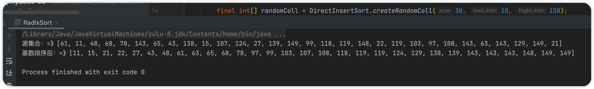


<hr>


### 计数排序

> 对于一个无序集合，想要确定任意元素的正确位置，我们只需要知道该序列中存在多少个比该元素小的元素，假设有k个，那么该元素的正确下标为k+1。
>
> 计数数组会额外申请两个数组空间，空间复杂度较高。

基数排序涉及一个辅助数组和一个计数数组，计数数组用于记录某个元素存在多少比其小的元素个数，辅助数组用于存放有序元素并最后拷贝到原数组中。

假设有一个无序集合存在n个元素，任意元素大小范围为 0 - m，首先通过一次循环，将每个元素出现的次数记录进count[]数组，再通过一次循环将count[n] + count[n-1]得出某个元素之前存在的记录数，那么就通过这个计数数组就可以确认任意元素的正确下标。

#### java实现

```java
public class CountSort {
    public static void main(String[] args) {
        int[] source = DirectInsertSort.createRandomColl(20, 0, 20);
        System.out.println("源数组：=》"+CollectionUtils.arrayToList(source));
        countSort(source);
        System.out.println("计数排序后：=》"+CollectionUtils.arrayToList(source));
    }
    /**
     * 计算任意数组的最大元素值，用于生成辅助数组
     *
     * @param source
     * @return
     */
    public static int maxElement(int[] source) {
        Assert.isTrue(null != source && source.length > 0, " 数组不可为空");
        int max = source[0];
        for (int ele : source) {
            max = Math.max(ele, max);
        }
        return max;
    }


    public static void countSort(int[] source) {
        //计数数组个数
        final int count = maxElement(source) + 1;
        //初始化计数数组
        int[] counts = new int[count];
        //计算各个元素出现的次数
        for (int element : source) {
            counts[element]++;
        }
        //计算任意元素存在多少比其小的元素个数,下标从1开始
        for (int i = 1; i < counts.length; i++) {
            counts[i] = counts[i] + counts[i - 1];
        }

        //需要一个辅助数组
        final int[] target = new int[source.length];
        //从后往前
        for (int i = source.length - 1; i >= 0; i--) {
            target[counts[source[i]] - 1] = source[i];
            //计数器减一
            counts[source[i]]--;
        }
        System.arraycopy(target, 0, source, 0, source.length);
    }
}
```

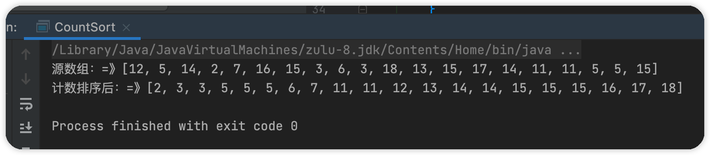

<hr>

### 桶排序

> 桶排序和基数排序的思想比较相似。
>
> 桶排序是将一个较长的集合拆分为多个较短的集合，每一个短集合称为桶，对桶内元素进行排序（排序算法可自定），最后将集合进行合并。

- 每个桶有对应编号，桶内元素随编号增长存在有序性

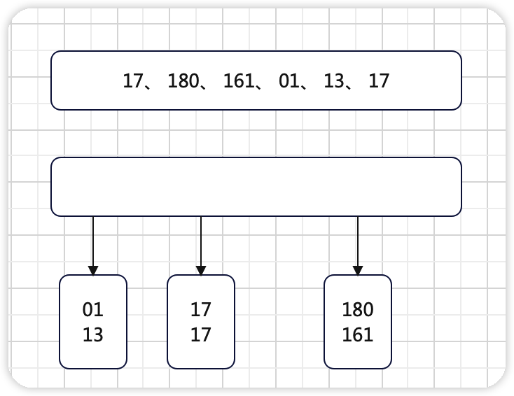

- 桶的个数由待排序集合的大小关系决定，一般为 max - min 个

  所以存在计算待排序集合的最大最小值的算法

- 待排序集合元素落于哪个桶，由自定义算法决定，且必须体现桶之间的有序性

​		一般为``((value-min) / (max-min+1.0) * bucketNum)``,表现为一个随元素大小递增的特性


#### java实现

```java
public class BuckSort {
    /**
     * 计算待排序集合最大值
     *
     * @param source
     * @return max
     */
    public static int collMax(int[] source) {
        int max = source[0];
        for (int element : source) {
            max = Math.max(element, max);
        }
        return max;
    }
    /**
     * 计算待排序集合最小值
     *
     * @param source
     * @return min
     */
    public static int collMin(int[] source) {
        int min = source[0];
        for (int element : source) {
            min = Math.min(element, min);
        }
        return min;
    }
    public static void bucketSort(int[] source) {
        //获取最值
        int max = collMax(source);
        int min = collMin(source);
        //确定桶的个数n
        int bucketNum = max - min;
        //初始化桶
        List<ArrayList<Integer>> buckets = new ArrayList<>(bucketNum);
        for (int i = 0; i < bucketNum; i++) {
            buckets.add(new ArrayList<Integer>());
        }
        //将元素放入桶内
        for (int value : source) {
            //元素对应桶下标
            int index = (int) ((value - min) / (max - min + 1.0) * bucketNum);
            buckets.get(index).add(value);
        }
        //桶内排序
        for (int i = 0; i < buckets.size(); i++) {
            Collections.sort(buckets.get(i));
        }
        //合并
        int j = 0;
        for (ArrayList<Integer> bucket : buckets) {
            for (int value : bucket) {
                source[j++] = value;
            }
        }
    }
    public static void main(String[] args) {
        final int[] randomColl = DirectInsertSort.createRandomColl(20, 5, 35);
        System.out.println("原集合：=>" + CollectionUtils.arrayToList(randomColl));
        bucketSort(randomColl);
        System.out.println("桶排序:=>" + CollectionUtils.arrayToList(randomColl));
    }
}
```