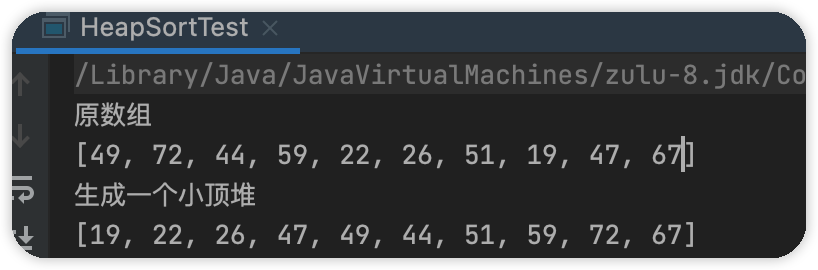
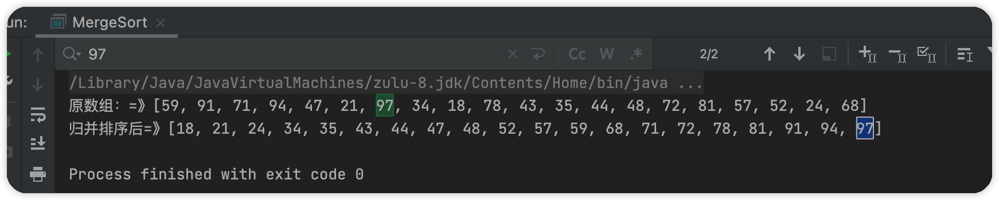

排序算法经过长时间演变，已很成熟，也有很多方案，每种排序算法都有其优点与缺点，需要在不同场合结合算法特性选择使用。

## 排序算法

排序算法大致分为两大类：

- 内排序
- 外排序

> 内排序指的是在排序过程中所有数据、记录都存在内存中，在内存中完成排序操作。外排序指的是如果待排序数据量庞大，在排序过程中需要使用外部存储设备，需要外部存储设备协助排序来减轻内存压力，存在内外存数据交互。内排序是外排序的基础。
>
> 这里列的都是内排序。

内排序又分为：

1. 插入排序
   - 直接插排序
   - 希尔排序
2. 选择排序
   - 直接选择排序
   - 堆排序
3. 交换排序
   - 冒泡排序
   - 快速排序
4. 归并排序
5. 基数排序


排序算法时间、空间复杂度：


### 插入排序

> 插入排序按实现方式不同分为：

- 直接插入排序
- 二分插入排序
- 希尔排序

#### 直接插入排序

> 直接插入排序(Straight Insertion Sort)的基本思想是: 把n个待排序的元素看成为一个有序表和一个无序表。开始时有序表中只包含1个元素，无序表中包含有n-1个元素，排序过程中每次从无序表中取出第一个元素，将它插入到有序表中的适当位置，使之成为新的有序表，重复n-1次可完成排序过程。

图示：


##### 实现步骤

- 取出无序序列第一个元素，并找出其在有序序列对应的位置
- 将无序区的第一个元素插入到有序区，在有必要时对有序序列元素进行整体右移


如何确定无序序列第一个元素插入位置？

> 当无序序列第一个元素大于等于第一个有序序列某个元素，其插入位置为此元素的后一位。

有序序列何时需要移位？

> 当无序序列第一个元素大于等于有序序列的最大值时，无需移位。
>
> 否则需要移位

##### 时间复杂度

> 遍历一趟的时间复杂度为O(n)，需要遍历n-1此，因此时间复杂度为O(n^2^)。


##### 稳定性

排序算法稳定性定义:

假设在序列中,a[i] = a[j],若排序前,a[i] 在 a[j]之前。排序之后,a[i] 任在 a[j]之前，那么这个算法是稳定的。

> 直接插入排序满足算法稳定性。

##### java实现

```java
public class SortUtils {
    /**
     * @param size      数组大小
     * @param lowLimit  下限
     * @param highLimit 上限
     * @return 集合
     */
    public static Integer[] createRandomColl(int size, int lowLimit, int highLimit) {
        Assert.check(size > 0, "数组长度需要大于0");
        final Integer[] coll = new Integer[size];
        for (int i = 0; i < size; i++) {
            coll[i] = lowLimit + (int) (Math.random() * (highLimit - lowLimit));
        }
        return coll;
    }
  	public static <T> void print(T[] t) {
        final StringBuilder sb = new StringBuilder("[");
        for (T t1 : t) {
            sb.append(t1 + "、");
        }
        sb.replace(sb.lastIndexOf("、"), sb.lastIndexOf("、") + 1, "]");
        System.out.println(sb);
    }
}

public class StraightInsertionSort<T extends Comparable> {

    public static <T extends Comparable> void straightInsertionSort(T[] array) {
        straightInsertionSort(array, 0, array.length - 1, true);
    }

    public static <T extends Comparable> void straightInsertionSort(T[] array, int last) {
        straightInsertionSort(array, 0, last, true);
    }


    public static <T extends Comparable> void straightInsertionSort(T[] array, int first, int last) {
        straightInsertionSort(array, first, last, true);
    }
    /**
     * @param array 待排序集合
     * @param first 排序起始下标
     * @param last  排序终止下标
     * @param flag  从0开始 true  从1开始 false
     */
    public static <T extends Comparable> void straightInsertionSort(T[] array, int first, int last, boolean flag) {
        last = Math.min(array.length, last);
        if (!flag) {
            first--;
            last--;
        }
        for (int i = first + 1; i <= last; i++) {
            //[first i-1]是有序的，给i在[first i-1]找个合适位置插入
            //遍历 i-1 到 first
            int j = i - 1;
            for (; j >= first; j--) {
                //待插入元素比，array[j]大于等于，插入位置确定了 j+1
                if (array[i].compareTo(array[j]) >= 0) {
                    break;
                }
            }
            //不相等才全体后移，相等插入位置即是当前位置，i++
            if (j != i - 1) {
                //缓存被覆盖的值，也是待插入元素
                T temp = array[i];
                int k = i - 1;
                //j+1 到 i-1 全体后移
                for (; k > j; k--) {
                    array[k + 1] = array[k];
                }
                //将值放入合适位置
                array[j + 1] = temp;
            }
        }
    }
    public static void main(String[] args) {
        final Integer[] randomColl = SortUtils.createRandomColl(10, 5, 15);
        SortUtils.print(randomColl);
        straightInsertionSort(randomColl);
        SortUtils.print(randomColl);
    }
}
```

结果：


#### 二分法插入排序

> 选中待排序元素temp，在已有序集合中存在三个指针left、mid、right，每次循环temp和mid对应元素比较，循环条件为left<=right，当temp<source[mid]时 right = mid -1，否则left = mid+1。
>
> 二分法插入排序的基本思想是: 把n个待排序的元素看成为一个有序表和一个无序表。开始时有序表中只包含1个元素，无序表中包含有n-1个元素，排序过程中每次从无序表中取出第一个元素，将它插入到有序表中的适当位置，使之成为新的有序表，重复n-1次可完成排序过程。

图示：


##### 实现步骤

- 取出无序序列第一个元素，并找出其在有序序列对应的位置
- 将无序区的第一个元素插入到有序区，在有必要时对有序序列元素进行整体右移

##### 时间复杂度

> 遍历一趟的时间复杂度为O(n)，需要遍历n-1此，因此时间复杂度为O(n^2^)。

##### 稳定性

> 满足算法稳定性。

##### java实现

```java
public class DichotomyInsertSort {

    /**
     * 核心思想
     * - 将待排序序列分为，有序和无序两部分
     * - 对有序序列进行标三个点 left、mid、right
     * - 无序序列每次取出首个元素，和mid进行比较
     * --- 大于等于，left = mid+1 mid = (left + right)/2
     * --- 小于 right = mid-1  mid = (left+mid)/2
     * --- 循环条件为 left <= right
     * --- 结束循环 left及其右边元素右移， 待插入元素插入 left所在下标位置
     */
    public static <T extends Comparable> void dichotomyInsertSort(T[] array, int first, int last, boolean flag) {
        if (!flag) {
            first--;
            last--;
        }
        int left = 0;
        int right = 0;
        int mid = 0;
        //待排序元素
        int tempIndex = first + 1;
        for (; tempIndex <= last; tempIndex++) {
            left = first;
            right = tempIndex - 1;
            T temp = array[tempIndex];
            while (left <= right) {
                mid = (right + left) / 2;
                if (array[tempIndex].compareTo(array[mid]) >= 0) {
                    left = mid + 1;
                } else {
                    right = mid - 1;
                }
            }
            if (left != tempIndex) {
                int m = tempIndex;
                for (; m > left; ) {
                    array[m] = array[--m];
                }
                array[left] = temp;
            }
        }
    }


    public static void main(String[] args) {

        final Integer[] randomColl = SortUtils.createRandomColl(20, 5, 15);
        SortUtils.print(randomColl);
        dichotomyInsertSort(randomColl, 0, randomColl.length - 1, true);
        SortUtils.print(randomColl);

    }

}
```

结果：


#### 希尔排序

> 希尔排序是将集合按照一定增量进行分组，分成多个子数组，对各个子数组进行直接插入排序，然后依次缩小赠量，直至增量为1进行最后一次排序。

增量的取值范围为：[1，数组长度）

一般首次取 数组长度/2，之后每次循环除以二

如次可以保证最后一次的增量为1。


##### java实现

> 实现关键

- 增量的起始量一般为数组长度一半，之后依次除二
- 在此增量上对数组进行分组，分组后进行直接插入排序

> 比直接插入排序好在哪里

直接插入排序，是一个双循环排序，对于已有序的集合排序友好，但是对于杂乱无章的集合不友好。且直接插入排序在移动元素时步长为1，需要移动多次。而希尔排序移动数组步长为step(增量)，移动元素次数变少了，通过多次分组后得到了一个差不多有序的集合，再进行最后一次直接插入排序。

```java
public class XiErInsertSort {
    
    /**
     * 希尔排序是对直接插入排序的一种优化
     * 直接插入排序的缺点：每次循环只插入一个值，对于有序集合友好，对于杂乱集合，需要频繁移动元素
     * 希尔排序优化思路：将源集合以某个增量分组，对各分组内的元素进行直接插入排序（由于增量的存在移动元素次数不再频繁）
     * <p>
     * 增量选择：一般为集合长度一半，依次除二，直到为1。增量的选择不互为倍数
     *
     * @param source 源集合
     */
    public static void xiErInsertSort(int[] source) {
        //增量
        int step = 0;
        int temp = 0;
        for (step = source.length / 2; step > 0; step /= 2) {
            //step为分组后的待排序元素,对其进行直接插入排序
            for (int j = step; j < source.length; j++) {
                temp = source[j];
                int i = j - step;
                while (i >= 0 && temp < source[i]) {
                    source[i + step] = source[i];
                    i -= step;
                }
                source[i + step] = temp;
            }
        }
    }

    public static void main(String[] args) {
        final int[] randomColl = DirectInsertSort.createRandomColl(17, 10, 20);
        System.out.println("希尔排序前");
        System.out.println(CollectionUtils.arrayToList(randomColl));
        xiErInsertSort(randomColl);
        System.out.println("希尔排序后");
        System.out.println(CollectionUtils.arrayToList(randomColl));

    }
}
```


### 选择排序

> 每趟从待排序记录中找出最小的元素，放到已排序记录中的最后面，直到排序完成。

> 大致分为

- 直接选择排序
- 堆排序


#### 直接选择排序

> 在待排序记录中假设首个元素为最小元素min，待排序存在比min小的元素，则该元素和min元素互换位置，直到排序完成

图示：


##### java实现

```java
public class DirectSelectInsert {
    public static void directSelectInsert(int[] source) {
        //待排序记录最小值
        int min = 0;
        //最小值下标
        int minIndex = 0;
        for (int i = 0; i < source.length - 1; i++) {
            min = source[i];
            minIndex = i;
            for (int j = i; j < source.length; j++) {
                if (source[j] < min){
                    min = source[j];
                    minIndex = j;
                }
            }
            //交换
            source[minIndex] = source[i];
            source[i] = min;
        }
    }
    public static void main(String[] args) {
        final int[] randomColl = DirectInsertSort.createRandomColl(20, 10, 20);
        System.out.println("直接选择排序前");
        System.out.println(CollectionUtils.arrayToList(randomColl));
        directSelectInsert(randomColl);
        System.out.println("直接选择排序后");
        System.out.println(CollectionUtils.arrayToList(randomColl));
    }
}
```


#### 堆排序

> 堆我们一般指的是二叉堆，及一颗完全二叉树，一般以数组的形式存储。

##### 分类

- 大顶堆

  - > 及任意父元素的值大于其任意子元素，此刻堆顶为序列最大值

- 小顶堆

  - > 反之为小顶堆


##### 性质

- 是一颗完全二叉树
- 有序性，任意父节点值大于（小于）其子节点


##### 数据结构

大顶堆小顶堆图示：


存储结构：

> 堆一般以数组作为其存储结构，任意节点n，其两个子节点为2n+1和2n+2，如果是大顶堆则父节点大于两个子节点，如果是小顶堆，父节点小于两个子节点。


##### PriorityQueue

> priorityQueue是java提供的使用堆实现的有序队列，可以借助参考

PriorityQueue默认升序排序，即默认小顶堆，不过可以修改Comparter来改变其为大顶堆。

```java
public class HeapSort {
    @Test
    public void testPriorityQueue() {
        final int[] randomColl = DirectInsertSort.createRandomColl(20, 10, 30);
        System.out.println("源集合");
        System.out.println(CollectionUtils.arrayToList(randomColl));
        System.out.println("小顶堆");
        final PriorityQueue<Integer> descHeap = new PriorityQueue<>((Collection<? extends Integer>) CollectionUtils.arrayToList(randomColl));
        descHeap.forEach(element -> {
            System.out.printf(element + ",");
        });
        System.out.println();
        System.out.println("大顶堆");
        final PriorityQueue<Integer> ascHeap = new PriorityQueue<>((ele1, ele2) -> ele1 > ele2 ? -1 : 1);
        for (int ele : randomColl) {
            ascHeap.add(ele);
        }
        ascHeap.forEach(element -> {
            System.out.printf(element + ",");
        });
    }
}
```


> 简单阅读PriorityQueue源码可以发现，实现堆排序，存在以下关键步骤。

- 如何构建一个堆

- 在推出顶堆的时候如何保证，剩余元素可以调整为一个新堆。踢出堆顶元素，剩余元素重新建堆

> 如何构建一个堆（这里以小顶堆实现）

关键在于堆的性质

①父节点为n那么两个子节点为2n+1和2n+2，那么只需要关注下标为【0,half-1】的元素与其子节点关系即可，如果父节点小于其两个子节点则无需调整，否则选出较小子节点作为新的父节点。因为构成二叉堆之后 【half，size-1】中的元素都为【0,half-1】中某个节点子节点。

②一定从half-1开始调整，这样可以保证下标为0的节点为堆顶

代码实现：

```java
class HeapSortTest {

    static int[] heap;

    /**
     * @param k 为父节点
     * @param x 父节点对应元素
     */
    void siftDownComparable(int k, int x,int[] source) {
        int size = source.length;
        //一半
        int half = size >>> 1;
        while (k < half) {
            //当前为左子节点下标，后续更新为较小子节点下标
            int child = (k << 1) + 1;
            //c当前为左子节点，后续为左右子节点较小值
            int c = source[child];
            int right = child + 1;
            //右子节点小于左子节点，更新child和c
            if (right < size && c > source[right]) {
                c = source[child = right];
            }
            //父节点小于较小子节点，跳出循环
            if (x <= c) {
                break;
            }
            //更新父节点
            source[k] = c;
            //记录child，因为child对应元素被移动，需要检查其子节点是否合理
            k = child;
        }
        source[k] = x;
    }

    /**
     * 生成小顶堆
     * @param source
     */
    private void heapify(int[] source) {
        for (int i = (source.length >>> 1) - 1; i >= 0; i--){
            siftDownComparable(i, source[i],source);
        }
    }

    public static void main(String[] args) {
        final HeapSortTest heapSortTest = new HeapSortTest();
        heap = DirectInsertSort.createRandomColl(10, 10, 90);
        System.out.println("原数组");
        System.out.println(CollectionUtils.arrayToList(heap));
        heapSortTest.heapify(heap);
        System.out.println("生成一个小顶堆");
        System.out.println(CollectionUtils.arrayToList(heap));
    }
}
```




如何堆排序：

循环建堆，踢出堆顶元素即可，当然这不是一个好的解决方案，因为我大量申请内存空间

```java
System.out.println("堆排序后");
for (int i = 0; i < heap.length - 1; i++) {
    //待生成堆集合
    final int[] tempColl = Arrays.copyOfRange(heap, i, heap.length - 1);
    heapSortTest.createHeap(tempColl);
    heap[i] =tempColl[0];
}
System.out.println(CollectionUtils.arrayToList(heap));
```


<hr>


### 交换排序

> 即在合适的位置交换元素，循环结束后可以达到集合有序的目的。

> 大致分为

- 冒泡排序
- 快速排序

#### 冒泡排序

> 同样对一个集合分为有序和无序两部分，冒泡排序会对无序集合自上到下两两相邻的元素依次进行比较和调整，较大元素下沉，较小元素上浮，也就是当相邻两个元素之间的排序规则与预期相悖则交换他们的位置。

图示：


##### java实现

> 大致可以分为两种思路：每次循环将最大值下沉和每次循环将最小值上浮。

需要注意的是内循环，循环的次数，减少非必要循环。

```java
public class BubbleSort {
    /**
     * 上浮
     *
     * @param source
     */
    public static void bubbleSortUp(int[] source) {
        int temp = 0;
        for (int i = source.length - 1; i > 0; i--) {
            //减i是因为，每次循环都会将，较小值上浮没必要比较到0
            for (int j = source.length - 1; j > source.length - i; j--) {
                if (source[j] < source[j - 1]) {
                    //交换
                    temp = source[j];
                    source[j] = source[j - 1];
                    source[j - 1] = temp;
                }
            }
        }
    }

    /**
     * 下沉
     * 将最大值下沉
     *
     * @param source
     */
    public static void bubbleSortDown(int[] source) {
        int temp = 0;
        for (int i = 0; i < source.length; i++) {
            //减一是因为，每次循环都会将，较大值下沉没必要比较到0
            for (int j = 0; j < source.length - i - 1; j++) {
                if (source[j] > source[j + 1]) {
                    //交换
                    temp = source[j];
                    source[j] = source[j + 1];
                    source[j + 1] = temp;
                }
            }
        }
    }

    public static void main(String[] args) {
        final int[] randomColl = DirectInsertSort.createRandomColl(20, 10, 100);
        System.out.println("源集合：=》" + CollectionUtils.arrayToList(randomColl));
        bubbleSortUp(randomColl);
        System.out.println("up冒泡排序后：=》" + CollectionUtils.arrayToList(randomColl));
        System.out.println("================");

        final int[] randomColl2 = DirectInsertSort.createRandomColl(20, 10, 3000);
        System.out.println("源集合：=》" + CollectionUtils.arrayToList(randomColl2));
        bubbleSortDown(randomColl2);
        System.out.println("down冒泡排序后：=》" + CollectionUtils.arrayToList(randomColl2));
    }
}
```


#### 快速排序

> 以一个元素为基准，经过一趟排序，将一个无序数组分为两部分，一部分比基准大，一部分比基准小，此刻基准元素处于正确的位置，再对这两个无序数组进行递归，直到完成排序。

关键算法

- 将基准元素放置正确位置，并返回下标

##### 伪代码

```java
public class QuickSort {

    public static void quick(int[] source) {
        quickSort(source, 0, source.length - 1);
    }

    /**
     * 快速排序
     *
     * @param source 无序集合
     * @param prev   开始下标
     * @param last   结束下标
     */
    public static void quickSort(int[] source, int prev, int last) {
        //递归，需要结束标志，无此标志形成死循环
        if (prev < last) {
            final int middle = getMiddle(source, prev, last);
            quickSort(source, middle + 1, last);
            quickSort(source, prev, middle - 1);
        }
    }
    public static int getMiddle(int[] source, int prev, int last) {
        return 1;
    }
}
```

那么重要的就是如何获取基准元素下标的算法了:

```java
public static int getMiddle(int[] source, int prev, int last) {
    //以首个元素为基准
    final int middleElement = source[prev];
    while (prev < last){
        //找到右边比基准小的元素
        while (prev < last & middleElement <= source[last]){
            last--;
        }
      //将其放到左边
        source[prev] = source[last];
        //找到左边比基准大的元素
        while (prev < last & middleElement >= source[prev]){
            prev++;
        }
      //将其放到右边
        source[last] = source[prev];
    }
    source[prev] = middleElement;
    return prev;
}
```

> 测试

```java
public static void main(String[] args) {
    final int[] randomColl = DirectInsertSort.createRandomColl(30, 10, 100);
    System.out.println("源集合：=》" + CollectionUtils.arrayToList(randomColl));
    quick(randomColl);
    System.out.println("快排后：=》" + CollectionUtils.arrayToList(randomColl));
}
```


### 归并排序

> 归并排序会申请一个辅助数组空间，用于将两个已有序数组组合成一个新的有序数组，同时涉及到递归算法。

图示：


同样的写一个伪代码：

```java
public class MergeSort {
    public static void split(int[] source, int prev, int last) {
        //这是一个归并，得有结束归并的条件
        if (prev < last) {
            int mid = (prev + last) / 2;
            //左边
            split(source, prev,mid);
            //右边
            split(source,mid+1,last);
            //合并
            merge(source, prev,mid,last);
        }
    }

    private static void merge(int[] source, int prev, int mid, int last) {
        
    }
}
```

同样的重点也是这个合并算法：

大致思路：左右两边逐个比较，将较小的填入协助数组，然后将左边剩余和右边剩余依次填入协助数组，最后更新原数组。

```java
private static void merge(int[] source, int prev, int mid, int last) {
    //协助数组长度
    final int tempLength = last - prev + 1;
    //协助数组
    final int[] temp = new int[tempLength];
    //左右两边起始下标
    int i = prev;
    int j = mid + 1;
    //协助数组起始下标
    int k = 0;

    while (i <= mid & j <= last) {
        //i 较小， i后移，且对应元素记录协助数组
        if (source[i] < source[j]) {
            temp[k++] = source[i++];
        } else {
            temp[k++] = source[j++];
        }
    }

    //将左边剩余元素记录进协助数组
    while (i <= mid) {
        temp[k++] = source[i++];
    }
    //将左边剩余元素记录进协助数组
    while (j <= last) {
        temp[k++] = source[j++];
    }

    //跟新原数组
    for (int index = 0; index < tempLength; index++) {
        source[prev++] = temp[index];
    }
}
```

测试：

```java
public static void main(String[] args) {

    final int[] randomColl = DirectInsertSort.createRandomColl(20, 10, 100);
    System.out.println("原数组：=》" + CollectionUtils.arrayToList(randomColl));
    split(randomColl, 0, randomColl.length - 1);

    System.out.println("归并排序后=》" + CollectionUtils.arrayToList(randomColl));

}
```




### 基数排序

> 首先对所有待排序集合元素同一长度，高位不足补0。依次从低位（个位）开始排序，直到最高位排序完成整个集合变为一个有序集合。
>
> 思想就是高位决定权较大，所以得靠后。

图示：


步骤：

- 计算最大数存在几位（确定循环次数）
- 需要一个桶存放各位相同的元素（十个  0  - 9 存在十位）


#####  java实现

> 获取集合最大数，并得到其最大位数，用于确定循环次数

```java
/**
 * 获取最大基数
 *
 * @param source 数组
 * @return 最大基数
 */
public static int getMaxRadix(int[] source) {
    int radix = 0;
    int max = source[0];
    for (int ele : source) {
        max = Math.max(max, ele);
    }
    do {
        radix++;
    } while ((max /= 10) > 0);
    return radix;
}
```

> 进行基数排序，重点在于

- 元素应该放入哪个桶？使用先取整再取余
- 一次循环结束需要清空桶

```java
public static void radixSort(int[] source) {

    //获取最大基数
    final int maxRadix = getMaxRadix(source);
    //创建十个桶，这里使用ArrayList
    final List<ArrayList<Integer>> buckets = new ArrayList<>();
    for (int i = 0; i < 10; i++) {
        buckets.add(new ArrayList<>());
    }

    for (int i = 0; i < maxRadix; i++) {
        int index;
        ArrayList<Integer> arrayList;
        //分配 数据放在哪个桶里
        for (int ele : source) {
            //先取整、再取余。 找到对应的桶
            index = ele / (int) Math.pow(10, i) % (int) Math.pow(10, 1);
            arrayList = buckets.get(index);
            arrayList.add(ele);
        }

        int indexX = 0;
        //收集
        for (int j = 0; j < buckets.size(); j++) {
            final ArrayList<Integer> tTemp = buckets.get(j);
            //桶不为空，写会集合
            while (!tTemp.isEmpty()) {
                source[indexX++] = tTemp.get(0);
                //移出桶
                tTemp.remove(0);
            }
        }
    }
}
```

> 测试

```java
public static void main(String[] args) {

    final int[] randomColl = DirectInsertSort.createRandomColl(30, 10, 150);
    System.out.println("源集合：=》" + CollectionUtils.arrayToList(randomColl));
    radixSort(randomColl);
    System.out.println("基数排序后：=》" + CollectionUtils.arrayToList(randomColl));
}
```


<hr>


### 计数排序

> 对于一个无序集合，想要确定任意元素的正确位置，我们只需要知道该序列中存在多少个比该元素小的元素，假设有k个，那么该元素的正确下标为k+1。
>
> 计数数组会额外申请两个数组空间，空间复杂度较高。

基数排序涉及一个辅助数组和一个计数数组，计数数组用于记录某个元素存在多少比其小的元素个数，辅助数组用于存放有序元素并最后拷贝到原数组中。

假设有一个无序集合存在n个元素，任意元素大小范围为 0 - m，首先通过一次循环，将每个元素出现的次数记录进count[]数组，再通过一次循环将count[n] + count[n-1]得出某个元素之前存在的记录数，那么就通过这个计数数组就可以确认任意元素的正确下标。

#### java实现

```java
public class CountSort {
    public static void main(String[] args) {
        int[] source = DirectInsertSort.createRandomColl(20, 0, 20);
        System.out.println("源数组：=》"+CollectionUtils.arrayToList(source));
        countSort(source);
        System.out.println("计数排序后：=》"+CollectionUtils.arrayToList(source));
    }
    /**
     * 计算任意数组的最大元素值，用于生成辅助数组
     *
     * @param source
     * @return
     */
    public static int maxElement(int[] source) {
        Assert.isTrue(null != source && source.length > 0, " 数组不可为空");
        int max = source[0];
        for (int ele : source) {
            max = Math.max(ele, max);
        }
        return max;
    }


    public static void countSort(int[] source) {
        //计数数组个数
        final int count = maxElement(source) + 1;
        //初始化计数数组
        int[] counts = new int[count];
        //计算各个元素出现的次数
        for (int element : source) {
            counts[element]++;
        }
        //计算任意元素存在多少比其小的元素个数,下标从1开始
        for (int i = 1; i < counts.length; i++) {
            counts[i] = counts[i] + counts[i - 1];
        }

        //需要一个辅助数组
        final int[] target = new int[source.length];
        //从后往前
        for (int i = source.length - 1; i >= 0; i--) {
            target[counts[source[i]] - 1] = source[i];
            //计数器减一
            counts[source[i]]--;
        }
        System.arraycopy(target, 0, source, 0, source.length);
    }
}
```


<hr>

### 桶排序

> 桶排序和基数排序的思想比较相似。
>
> 桶排序是将一个较长的集合拆分为多个较短的集合，每一个短集合称为桶，对桶内元素进行排序（排序算法可自定），最后将集合进行合并。

- 每个桶有对应编号，桶内元素随编号增长存在有序性


- 桶的个数由待排序集合的大小关系决定，一般为 max - min 个

  所以存在计算待排序集合的最大最小值的算法

- 待排序集合元素落于哪个桶，由自定义算法决定，且必须体现桶之间的有序性

​		一般为``((value-min) / (max-min+1.0) * bucketNum)``,表现为一个随元素大小递增的特性


#### java实现

```java
public class BuckSort {
    /**
     * 计算待排序集合最大值
     *
     * @param source
     * @return max
     */
    public static int collMax(int[] source) {
        int max = source[0];
        for (int element : source) {
            max = Math.max(element, max);
        }
        return max;
    }
    /**
     * 计算待排序集合最小值
     *
     * @param source
     * @return min
     */
    public static int collMin(int[] source) {
        int min = source[0];
        for (int element : source) {
            min = Math.min(element, min);
        }
        return min;
    }
    public static void bucketSort(int[] source) {
        //获取最值
        int max = collMax(source);
        int min = collMin(source);
        //确定桶的个数n
        int bucketNum = max - min;
        //初始化桶
        List<ArrayList<Integer>> buckets = new ArrayList<>(bucketNum);
        for (int i = 0; i < bucketNum; i++) {
            buckets.add(new ArrayList<Integer>());
        }
        //将元素放入桶内
        for (int value : source) {
            //元素对应桶下标
            int index = (int) ((value - min) / (max - min + 1.0) * bucketNum);
            buckets.get(index).add(value);
        }
        //桶内排序
        for (int i = 0; i < buckets.size(); i++) {
            Collections.sort(buckets.get(i));
        }
        //合并
        int j = 0;
        for (ArrayList<Integer> bucket : buckets) {
            for (int value : bucket) {
                source[j++] = value;
            }
        }
    }
    public static void main(String[] args) {
        final int[] randomColl = DirectInsertSort.createRandomColl(20, 5, 35);
        System.out.println("原集合：=>" + CollectionUtils.arrayToList(randomColl));
        bucketSort(randomColl);
        System.out.println("桶排序:=>" + CollectionUtils.arrayToList(randomColl));
    }
}
```