## Vmware下载

[https://www.ghxi.com/vmware17.html](下载地址)


## Centos安装

### 下载镜像文件

> [centos7 X64下载](https://mirrors.aliyun.com/centos/7/isos/x86_64/)

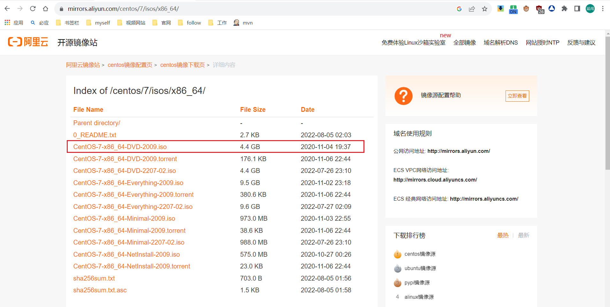


### 安装centos 7


[安装](https://www.runoob.com/w3cnote/vmware-install-centos7.html)

按教程来， 网络类型换一下

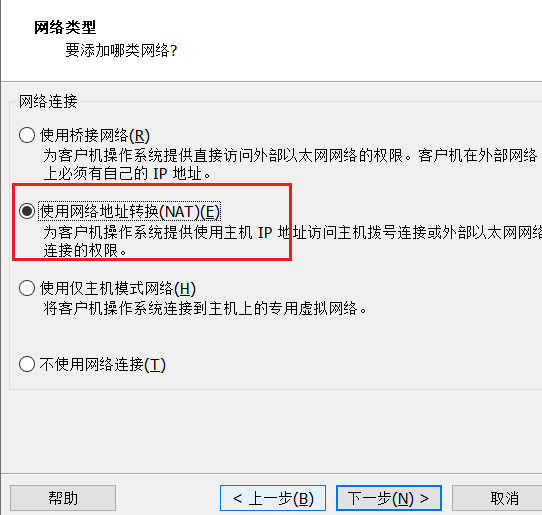


如果网络设置有问题的话 先跳过


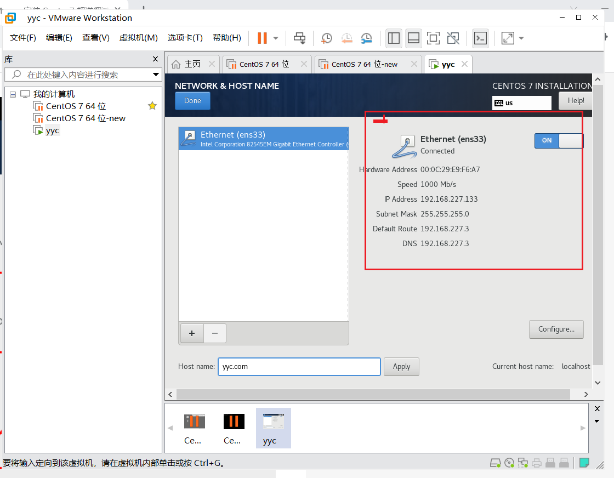


> 开启虚拟机

切换root用户命令: su

测试一下网络

```shell
ping www.baidu.com
```

> 如果有问题检查流程

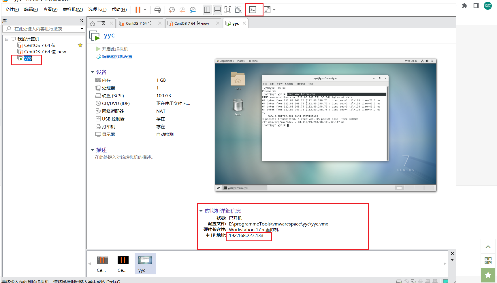

>  如果没有就是网络配置有问题
>
> 查看  VMware  -> 编辑  --> 虚拟机网络编辑器 -> 看下有没有配置
>
> 没有的话得配置，或者修改一下

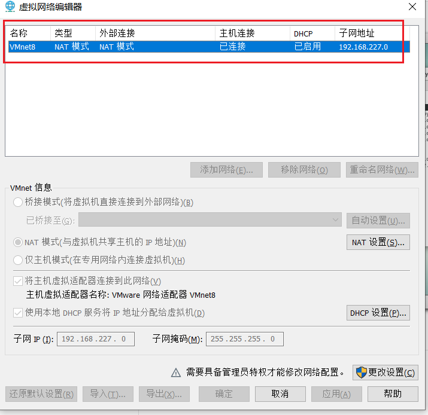


> 解决步骤

- 看一下 ipconfig

- 看一下windows网络配置

  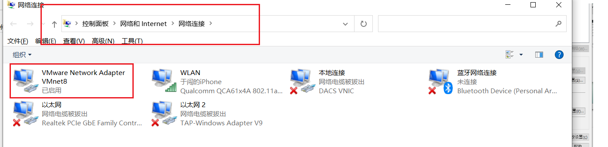

- [教程](https://www.cnblogs.com/santia-god/p/16778627.html)


## mobaxtrm

> 连接工具安装  
>
> [下载地址](https://www.ghxi.com/mobaxterm.html)

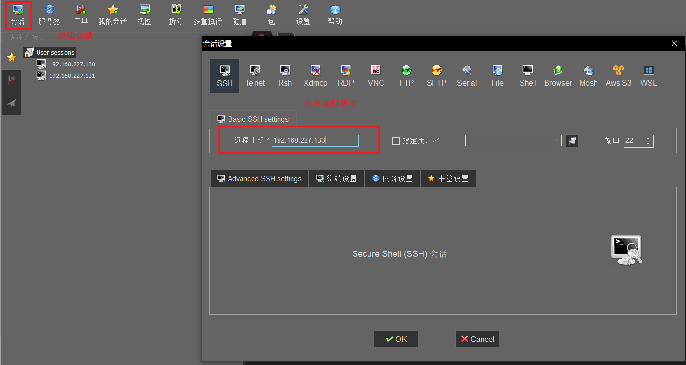

登录就行


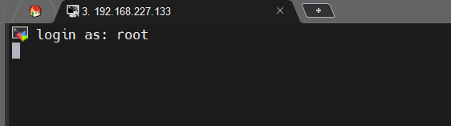


## docker

- 切到root用户  

  `su`

### 安装

[安装教程](https://yeasy.gitbook.io/docker_practice/install/centos)

> 或者按以下顺序执行就行

```shell
yum remove docker \
                  docker-client \
                  docker-client-latest \
                  docker-common \
                  docker-latest \
                  docker-latest-logrotate \
                  docker-logrotate \
                  docker-selinux \
                  docker-engine-selinux \
                  docker-engine
```


```shell
yum install -y yum-utils
```


```shell
yum-config-manager \
    --add-repo \
    https://mirrors.aliyun.com/docker-ce/linux/centos/docker-ce.repo
```


```shell
sudo sed -i 's/download.docker.com/mirrors.aliyun.com\/docker-ce/g' /etc/yum.repos.d/docker-ce.repo
```

> 一路按  y。 或者 yum install  -y    。就采用一路按y的方式

```shell
yum install docker-ce docker-ce-cli containerd.io
```

> 检查安装

```shell
docker -v
```

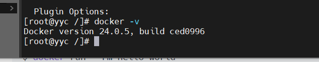

> docker  加入服务

```shell
# 注册docke服务
systemctl enable docker

# 启动
systemctl start docker
systemctl restart docker
systemctl stop docker
```


> 配置docker镜像仓库。 我使用的 阿里云镜像
>
> [阿里云地址](https://www.aliyun.com/product/acr?source=5176.11533457&userCode=8lx5zmtu)
>
> 注册个账号
>
> [镜像工具](https://cr.console.aliyun.com/cn-hangzhou/instances/mirrors)

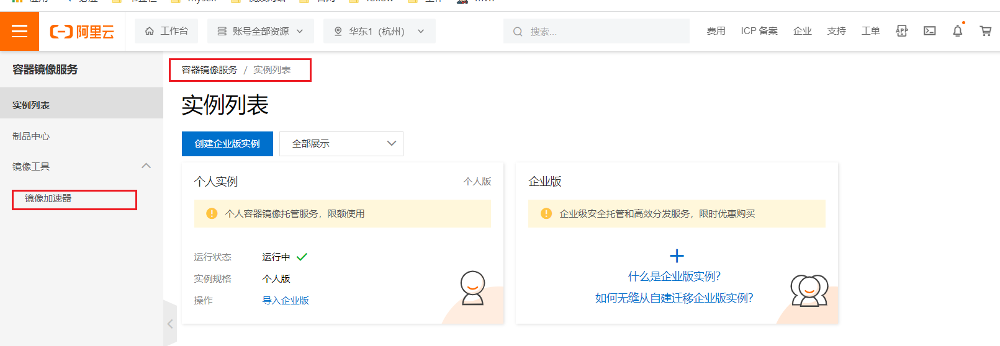

复制执行一下

```she
sudo mkdir -p /etc/docker
sudo tee /etc/docker/daemon.json <<-'EOF'
{
  "registry-mirrors": ["https://3rfiuyyp.mirror.aliyuncs.com"]
}
EOF
sudo systemctl daemon-reload
sudo systemctl restart docker
```

> 安装helloworld测试

```she
docker run --rm hello-world
```


## docker 安装  mysql

> [参考地址](https://gitee.com/rolyfish/foot/blob/master/%E6%95%B0%E6%8D%AE%E5%BA%93/mysql/mysql%E8%A7%84%E7%BA%A6.md)

- 拉取镜像

  ```shell
  docker pull mysql:8.0.33
  ```

- 查看镜像

  ```shell
  docker images
  ```

  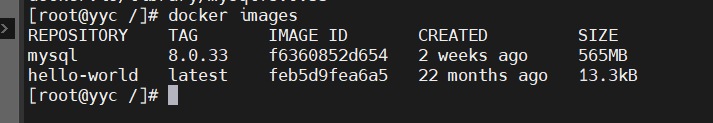

- 准备挂载目录

  > yyc  换成你自己的

  ```shell
  mkdir -p  /home/yyc/home/docker/mysql/data /home/yyc/home/docker/mysql/conf
  ```

- 启动容器

  ```shell
  docker run --name mysql \
  -p 3316:3306 \
  -v /home/yyc/home/docker/mysql/data:/var/lib/mysql \
  -v /home/yyc/home/docker/mysql/conf:/etc/mysql/conf.d \
  -e MYSQL_ROOT_PASSWORD=123456 \
  -d mysql:8.0.33
  ```

  、

- 测试连接

  **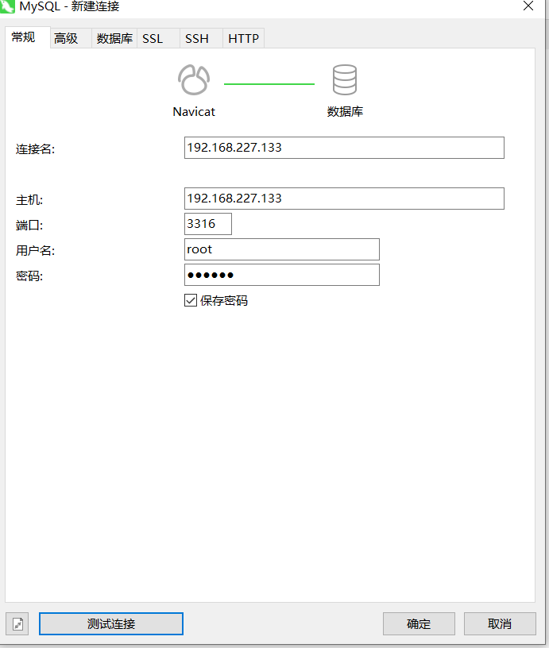**


## dockers 安装 redis

- 拉取镜像

  ```shell
  docker pull redis:7.0
  ```

- 创建挂载目录

  ```shell
  mkdir -p  /home/yyc/home/docker/redis/data /home/yyc/home/docker/redis/conf
  ```

- 修改配置

  ```shell
  # 创建配置文件
  
  cd /home/yyc/home/docker/redis/conf
  vim redis.conf
  ```

  [官方配置文件模板](https://redis.io/docs/management/config/)复制到创建的 redis.conf里面

  **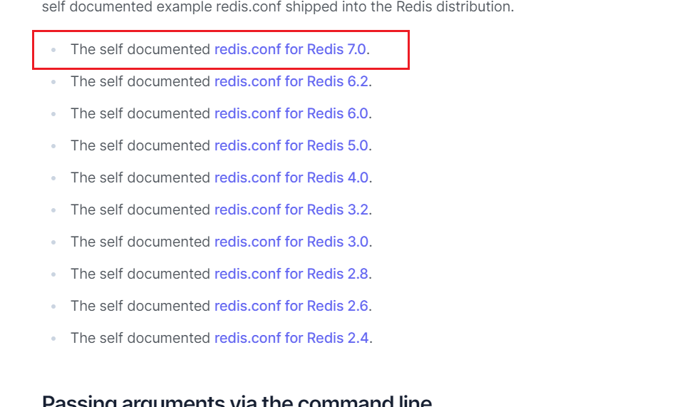**

  选择匹配的配置，复制粘贴， ==

  ==注：==vim工具使用，i --- 进入编辑模式， `/`-----进入搜索模式, 按`n`可以匹配下一个

  esc  退出编辑或搜索

  `:`------加q! 强制退出   加wq  写入并退出

  > 修改几个配置。 通过 `/`进行搜索

  ```shell
  # bind 127.0.0.1 -::1   ## 这个配置注掉,表示只允许本机连接。或修改为 bind 0.0.0.0
  daemonize no
  requirepass 123123 ## 设置密码
  protected-mode no ## 允许外部主机访问
  ```

- 启动redis

  ```shell
  docker run -d --privileged=true -p 6379:6379 \
  -v /home/yyc/home/docker/redis/conf/redis.conf:/etc/redis/redis.conf  \
  -v /home/yyc/home/docker/redis/data:/data \
  --name redis7.0 \
  redis:7.0 redis-server /etc/redis/redis.conf \
  --appendonly yes
  ```

- docker ps查看

  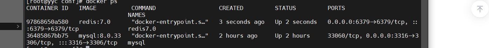

- 测试redis

  ```shell
  docker exec -it redis7.0 /bin/bash
  
  redis-cli
  
  auth 123456
  ```

  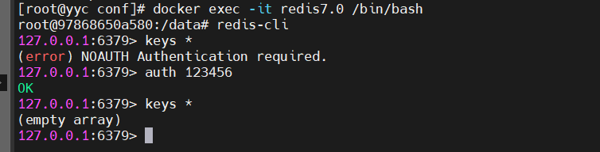

- 可视化工具[redis-insight](https://redis.com/redis-enterprise/redis-insight/)

  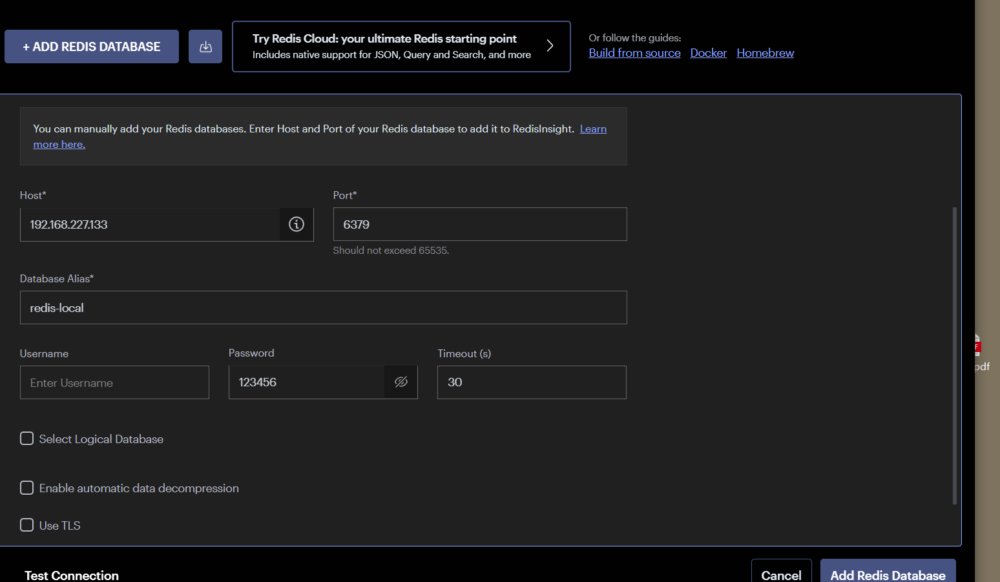

  


