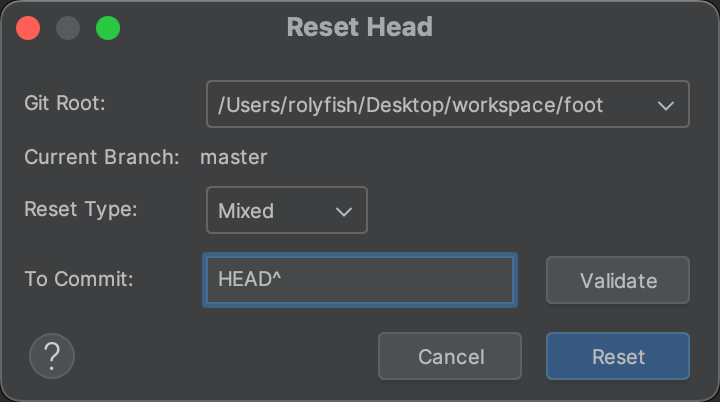

## 编程规范

### git规范

#### 分支命名规则

- main、master分支: 主干分支
- release: 大版本迭代分支。基于主干分支。 例如:release-20230101
- feature: 特性分支。 基于release分支。大需求分支
- dev分支: 开发分支。基于feature分支。
- hotfix: 紧急bug修复分支。 基于main分支。

> 注意：
>
> - 所有分支只能从源分支merge
> - 出现冲突, 拉取merge分支, 解决冲突后合并

#### 提交规范

代码提交规范: `type#任务id_描述`

> type

- feat
- fix
- docs
- style
- refactor
- test
- chore

#### idea使用git

##### 代码颜色对应状态

- 红色：创建后就没Add到本地Git的，本地库没有    
- 蓝色：改动过，没提交远程
- 绿色：新创建提交到本地库了，没提交远程

##### 标签颜色对应含义

- 黄色代表HEAD（黄色只是表示HEAD的位置，当前分支，没其它含意）
- 绿色表示的是你本地（存在的）分支
- 紫色是远程（存在的）分支

##### 撤销本地提交

##### 合并本地多次提交

> 2

