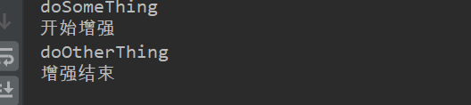

#### 代理模式

> 代理模式（Proxy Pattern）就是多一个代理类出来，替原对象进行一些操作。对真实角色的方法进行代理并增强。并且不会影响真实角色的逻辑。这种类型的设计模式属于结构型模式。

应用：

​	Spring aop 环绕通知

​	mybatis对于Mapper的代理

#### 静态代理

> 我们以买房为例

三个角色：

- 房东 （被代理对象）
- 经纪人 （代理对象）
- 客户   （客户端）

##### 对比装饰器模式

> 代理模式和装饰器模式很相似，透明化的装饰器模式要求将装饰方法抽象出来作为一个接口，装饰器去实现该接口。而代理模式没有做要求，代理模式只有一个要求：代理对象和真实对象实现同一个接口。

先看一下装饰器模式的实现：


定义一个卖房子的抽象接口：

```java
public interface SellHouse {
    /**
     * 卖房子动作
     */
    void sellHouse();
}
```

房东想卖房子就要去实现这个接口：

```java
public class HouseOwner implements SellHouse {
    @Override
    public void sellHouse() {
        System.out.println("房东卖房子");
    }
}
```

一个经纪人他需要帮房东找客户、签合同等等～～，将方法抽象出来

```java
public interface IHouseProxy {
    /**
     * 中介前置动作
     */
    void prevWork();
    /**
     * 中介后置动作
     */
    void nextWork();
}
```

定义一个经纪人：代替房东卖房子，并做一些扩展

```java
public class HouseProxy implements SellHouse, IHouseProxy {
    /**
     * 被代理对象,只代理一个
     */
    private HouseOwner houseOwner = new HouseOwner();

    /**
     * 销售也卖房子,但是包括前置服务和后续维护服务
     */
    @Override
    public void sellHouse() {
        prevWork();
        houseOwner.sellHouse();
        nextWork();
    }

    @Override
    public void prevWork() {
        System.out.println("挂牌");
        System.out.println("联系客户");
        System.out.println("签合同");
    }
    @Override
    public void nextWork() {
        System.out.println("维护");
    }
}
```

客户端：

```java
/**
 * 直接找房东买：两个人都会不签合同，房东信息容易泄露
 */
@Test
public void test01(){
    HouseOwner houseOwner = new HouseOwner();
    houseOwner.sell();
}
/**
 * 经纪人，就比较专业。
 */
@Test
public void test2(){
    //经纪人
    HouseProxy houseProxy = new HouseProxy();
    houseProxy.sell();
}
```


##### 静态代理

> 静态代理在编译期间就会生成代理对象，代理对象唯一或只能够代理一类对象。

定义抽象接口：

```java
public interface SellHouse {
    void sell();
}
```

房东实现卖房子抽象接口：

```java
public class HouseOwner implements SellHouse{
    public void sell(){
        System.out.println("房东卖房子");
    }
}
```

经纪人：

```java
public class HouseProxy implements SellHouse{
    //被代理对象
    private SellHouse houseOwner;

    public void setHouseOwner(SellHouse houseOwner) {
        this.houseOwner = houseOwner;
    }
    //销售也卖房子,但是包括前置服务和后续维护服务
    public void sell(){
        prevWork();
        houseOwner.sell();
        nextWork();
    }
  //定义抽象方法，这样可以对客户端隐藏实现细节
    private void prevWork(){
        System.out.println("挂牌");
        System.out.println("联系客户");
        System.out.println("签合同");
    }
    private void nextWork(){
        System.out.println("维护");
    }
}
```

测试：

```java
@Test
public void test2(){
    //经纪人
    HouseProxy houseProxy = new HouseProxy();
    houseProxy.setHouseOwner(new HouseOwner());
    houseProxy.sell();
}
```

##### 优点

- 真实对象（被代理对象）业务纯粹（房东不用操心客户，也不用学签合同）

- 简单，好理解
- 对客户端隐藏实现细节（房东信息不会泄露）

##### 缺点

- 只能代理一类对象（实现同一接口的对象）


<hr>


#### 动态代理

> 动态代理就是为了解决，静态代理代理角色单一，不够通用的问题。动态代理是在运行期间，通过反射机制实现动态代理。

分类：

- jdk动态代理    只能代理实现接口的类（生成代理对象依赖源对象类的接口列表）
- Cglib 动态代理   可以代理实现接口的类和实现抽象类的类


##### JDK动态代理

> 需要Proxy类和InvocationHandler接口的支持。

proxy类用于生成代理对象

InvocationHandler，要想实现JDK动态代理必须实现这个接口，实现这个接口的类称为：代理对象的调用处理程序


##### 实现(卖房子例子)

> 抽象接口和房东都是一样的

实现InvocationHandler接口

```java
@Data
public class SellHouseHandler implements InvocationHandler {
    //代理SellHouse这一类的真实角色
    private SellHouse sellHouse;

    /**
     * 生成代理对象
     *
     * 参数说明：
     * - 真实对象类加载器
     * - 真实对象接口列表
     * - 实现InvocationHandler接口的实例，也就是this
     */
    public Object getProxy() {
       return Proxy.newProxyInstance(
                sellHouse.getClass().getClassLoader(),
                sellHouse.getClass().getInterfaces(),
                this);
    }

    /**
     * 实现invocationHandler接口必须重写的方法
     *
     * @param proxy  代理角色
     * @param method 真实角色执行方法的包装（可以通过反射获取）
     * @param args   真实对象执行方法的参数列表
     */
    @Override
    public Object invoke(Object proxy, Method method, Object[] args) throws Throwable {
        System.out.println(Arrays.toString(proxy.getClass().getInterfaces()));
        prevWork();
        Object invoke = method.invoke(sellHouse, args);
        nextWork();
        return invoke;
    }
    private void prevWork(){
        System.out.println("挂牌");
        System.out.println("联系客户");
        System.out.println("签合同");
    }
    private void nextWork(){
        System.out.println("维护");
    }
}
```

关于invoke的method说明:

可以认为是对真实角色方法的包装

```java
public class HouseOwner implements SellHouse {
    public void sell(){
        System.out.println("房东卖房子");
    }
    @Test
    public void test() throws NoSuchMethodException, InvocationTargetException, IllegalAccessException {
        Method sell = HouseOwner.class.getDeclaredMethod("sell");
        sell.invoke(houseOwner,null);
    }
}
```

测试：

```java
@Test
public void test(){
    SellHouseHandler sellHouseHandler = new SellHouseHandler();
    sellHouseHandler.setSellHouse(new HouseOwner());
    SellHouse proxy = (SellHouse)sellHouseHandler.getProxy();
    proxy.sell();
}
```


##### 总结

> 实现方式不是这一种，把Proxy和Invoke方法参数理解了就行。比如说真实角色可以不通过set的方式注入，可以在getProxy(<? extend class>)中声明参数。

通用的写法，既然使用了反射，那么就得体现他的强大

```java
@Data
public class CommonInvocationHandler implements InvocationHandler {
    //代理所有对象
    private Object target;

    public Object getProxy() {
        return Proxy.newProxyInstance(
                object.getClass().getClassLoader(),
                object.getClass().getInterfaces(),
                this);
    }
    @Override
    public Object invoke(Object proxy, Method method, Object[] args) throws Throwable {

        prevWork();
        Object invoke = method.invoke(target, args);
        nextWork();
        return invoke;
    }

    private void prevWork() {
        System.out.println(target.getClass().getName() + "类的实例被代理");
        System.out.println("该类实现的接口列表为：" + Arrays.toString(target.getClass().getInterfaces()));
    }
    private void nextWork() {
        System.out.println(target.getClass().getName() + "执行完毕");
    }
}
```


##### 优点

- 静态代理优点
- 修复静态代理缺点

##### 缺点

- 走了一遍代理，且使用反射，性能受影响。考虑他的强大这一点损耗可以忽略
- 不能代理类，只能代理实现接口的类

<hr>


##### cglib

> JDK动态代理存在一个缺陷，就是不能够代理未实现接口的类。Cglib可以代理所有。

###### 依赖

 ```xml
<!-- https://mvnrepository.com/artifact/cglib/cglib -->
<dependency>
    <groupId>cglib</groupId>
    <artifactId>cglib</artifactId>
    <version>3.3.0</version>
</dependency>
 ```


###### 实现

> 被代理的对象

```java
public class Obj {
    /**
     * 定义两个方法
     * 一个是普通方法，一个是被final修饰的方法
     */
    final public void doSomeThing() {
        System.out.println("doSomeThing");
    }
    public void doOtherThing() {
        System.out.println("doOtherThing");
    }
}
```

> 方法拦截器。拦截所有借助此拦截器生成的代理对象，执行方法都会走这里。

```java
public class MyMethodInterceptor implements MethodInterceptor {
    @Override
    public Object intercept(Object o, Method method, Object[] objects, MethodProxy methodProxy) throws Throwable {
        System.out.println("开始增强");
        //method.invoke(o, objects);
        methodProxy.invokeSuper(o, objects);
        System.out.println("增强结束");
        return null;
    }
}
```

> 代理对象生成器

代理对象的生成依赖于真实对象的Class对象，和方法拦截器。

```java
@Data
public class CgLibProxy {
    private Class<? extends Object> object;
    public Object getProxy() {
        //创建Enhancer对象，类似于JDK动态代理的Proxy类
        Enhancer enhancer = new Enhancer();
        //设置目标类的字节码文件,很明显使用反射实现
        enhancer.setSuperclass(object);
        //设置借助哪个拦截器实现（也就是做哪些增强）
        enhancer.setCallback(new MyMethodInterceptor());
        //这里的creat方法就是正式创建代理类
        return enhancer.create();
    }
}
```

> 使用

```java
public static void main(String[] args) {
    CgLibProxy cgLibProxy = new CgLibProxy();
    cgLibProxy.setObject(Obj.class);
    //这里的creat方法就是正式创建代理类
    Obj proxy = (Obj)cgLibProxy.getProxy();
    //调用代理类的final方法
    proxy.doSomeThing();
    //调用代理类的非final方法
    proxy.doOtherThing();
}
```




###### 结论

- 使用反射实现代理
- 只能对非final方法做增强

