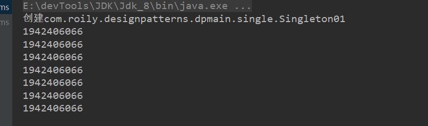
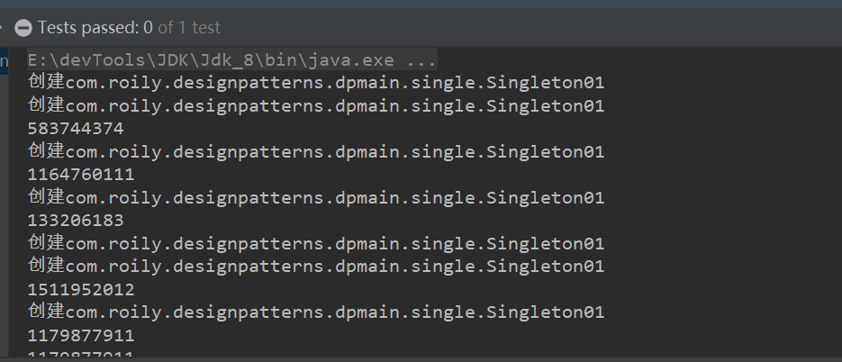
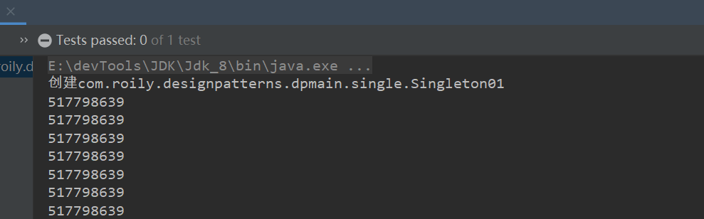
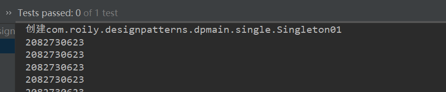
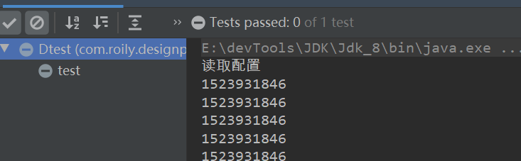
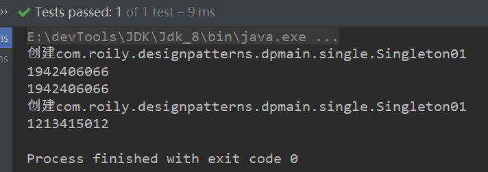

学习单例模式，不同实现优缺点。


### 单例模式

#### 定义

单例模式（Singleton Pattern）是 Java 中最简单的设计模式之一。这种类型的设计模式属于创建型模式，它提供了一种创建对象的最佳方式。

确保某一个类 只有一个实例，而且自行实例化并向整个系统提供这个实例。这个类提供了一种访问其唯一的对象的方式，可以直接访问，不需要实例化该类的对象。

> 有以下特点

- 构造器私有化

- 单例类自己创建唯一实例
- 单例类提供方法供其他类访问唯一实例


#### 适用场景

> 需要控制实例数量、避免频繁创建与销毁、节省系统资源的场景。

- 一个系统配置类，我们无需频繁创建，在首次使用的时候就创建全局唯一实例。再次使用，不通过创建而是通过访问。

- 一些i/o资源，或者是连接资源，创建全局唯一的实例，通过内存、或池化技术管理。而不是频繁创建与销毁。


#### 如何实现

- 构造函数私有化。不提供构造函数供外部类使用，而是类内部创建实例，并提供访问实例的方法。

- 推荐lazy loading方式实现。在想使用的时候初始化，而不是系统启动就初始化浪费资源。


#### 实现方式


##### 懒汉式、非线程安全

> 这是一种lazy loading 的实现方式。适合单线程环境，在多线程环境下存在线程安全问题。

```java
public class Singleton01 {
    private static Singleton01 instance;
    //构造器私有化
    private Singleton01() {
        System.out.println("创建" + Singleton01.class.getName());
    }
	//提供外部访问实例方法
    public static Singleton01 getInstance() {
        if (instance == null){
            instance = new Singleton01();
        }
        return instance;
    }
}
```

> 测试单线程环境下，获取同一个实例。

> 构造方法只执行了一次

```java
/**
 * 多次获取同一个实例
 */
@Test
public void test01(){
    System.out.println(Singleton01.getInstance().hashCode());
    System.out.println(Singleton01.getInstance().hashCode());
    System.out.println(Singleton01.getInstance().hashCode());
    System.out.println(Singleton01.getInstance().hashCode());
}
```



> 测试多线程情况下，会破坏单例，创建多个不同实例

> 构造方法执行了多次，单例被破坏。在创建唯一实例前，已有多个线程判断实例为空，所以会创建多个实例。

```java
/**
 * 测试多线程情况下会创建多个不同实例
 */
@Test
public void test02(){
    for (int i = 0; i < 100; i++) {
        new Thread(()->{
            System.out.println(Singleton01.getInstance().hashCode());
        }).start();
    }
    //保证线程执行结束
    while (true);
}
```




##### 懒汉式、线程安全

> 上面一种单例的实现方式，非线程安全。也就是getInstance()方法不支持多线程。那么就可以加锁。

如下两种实现存在一个严重的缺点：就是当单例对象不为null时，获取单例实例是不需要加锁的，如下实现会存在性能问题。

sychronized实现：

```java
public class Singleton02 {
    private static Singleton02 instance;
    private Singleton02() {
        System.out.println("创建" + Singleton01.class.getName());
    }
    public static synchronized Singleton02 getInstance() {
        if (instance == null) 
            instance = new Singleton02();
        return instance;
    }
}
```

Reentrantlock实现：

```java
public class Singleton02_Lock {
    private static Singleton02_Lock instance;
    static ReentrantLock lock = new ReentrantLock();

    private Singleton02_Lock() {
        System.out.println("创建" + Singleton01.class.getName());
    }
    public static Singleton02_Lock getInstance() {
        lock.lock();
        try {
            if (instance == null) {
                instance = new Singleton02_Lock();
            }
        }catch (Exception e){
        }finally {
            lock.unlock();
        }
        return instance;
    }
}
```

> 测试多线程环境

```java
/**
 * lock  测试多线程情况下会创建多个不同实例
 */
@Test
public void test02(){

    for (int i = 0; i < 100; i++) {
        new Thread(()->{
            System.out.println(Singleton02_Lock.getInstance().hashCode());
        }).start();
    }
    //保证线程执行结束
    while (true);
}
```




##### 饿汉式

> 借助类加载器初始化，不存在线程安全问题，但在类被首次直接引用就会初始化，浪费内存。

优点：不存在线程安全问题

缺点：不属于懒加载（延迟加载）

```java
public class Singleton03 {
    //在首次直接引用初始化。这个初始化可能是由于其他原因
    private static Singleton03 instance = new Singleton03();

    private Singleton03() {
        System.out.println("创建" + Singleton01.class.getName());
    }
    public static Singleton03 getInstance() {
        return instance;
    }
}
```

> 测试多线程环境下

这是不存在线程安全问题的。

```java
@Test
public void test() {
    for (int i = 0; i < 100; i++) {
        new Thread(() -> {
            System.out.println(Singleton03.getInstance().hashCode());
        }).start();
    }
    while (true) ;
}
```




> 为何说浪费资源？ 我们希望他是一个lazy  Loading状态的，也就是想用他他才实例化。

那么如果这个单例类存在一个静态成员变量，当我们使用它时，就会造成类的初始化，此刻我并不想用这个实例，但是它却实例化了，不是我想要的结果。

```java
//定义一个静态成员变量
static Integer i = 10;
private Singleton03() throws InterruptedException {
    //如果说创建这个实例需要消耗大量时间
    Thread.sleep(3000);
    System.out.println("创建" + Singleton01.class.getName());
}
```


##### 双重校验锁

> 这是懒汉式加锁的一种升级，避免了不用加锁的情况，也就是 singleton != null时。

```java
public class Singleton04 {
    //使用volatile，及时通知其他线程，单例被创建了，请更新
    private volatile static Singleton04 singleton;

    private Singleton04() {
        System.out.println("创建" + this.getClass().getName());
    }
    public static Singleton04 getSingleton() {
        //等于空时加锁，避免重复创建单例
        if (singleton == null) {
            synchronized (Singleton04.class) {
                if (singleton == null) {
                    singleton = new Singleton04();
                }
            }
        }
        return singleton;
    }
}
```

> 测试

```java
@Test
public void test() {
    for (int i = 0; i < 100; i++) {
        new Thread(() -> {
            System.out.println(Singleton04.getSingleton().hashCode());
        }).start();
    }
    while (true) ;
}
```


##### 登记式

> 这是对饿汉式的一种升级，使用静态内部类的方式，避免资源浪费，达到想用再实例化的目的。

```java
public class Singleton05 {
    public static Integer i = 10;
    private static class SingletonHolder {
        private static final Singleton05 INSTANCE = new Singleton05();
    }
    private Singleton05() {
        System.out.println("创建" + this.getClass().getName());
    }
    public static final Singleton05 getInstance() {
        return SingletonHolder.INSTANCE;
    }
}
```

> 达到lazy_loading目的，且保证并发安全

```java
/**
 * 直接引用也不会触发静态内部类的初始化
 */
@Test
public void testx() {
    System.out.println(Singleton05.i);
}

/**
 * 双重校验锁，并发环境下线程安全问题
 */
@Test
public void test() {
    for (int i = 0; i < 100; i++) {
        new Thread(() -> {
            System.out.println(Singleton05.getInstance().hashCode());
        }).start();
    }
    while (true) ;
}
```


##### 枚举类

> 枚举类的实例天生为单例。枚举类的枚举实例，可以理解为省略了private static final 关键字的属性，也就是在类装载的时候就初始化了。结合等级式单例实现方式。


```java
public class DataSource {
    private Properties properties;
    private DataSource(Properties properties) {
        this.properties = properties;
    }

    //定义一个静态内部枚举类
    static enum DataSourceEnum{
        MYSQL;
        private DataSource dataSource;
        //默认私有
        DataSourceEnum() {
            System.out.println("读取配置");
            InputStream in = this.getClass().getClassLoader().getResourceAsStream("db.properties");
            Properties prop = new Properties();
            try {
                prop.load(in);
                dataSource = new DataSource(prop);
            } catch (IOException e) {
                e.printStackTrace();
            }
        }
        DataSource getInstance(){
            return dataSource;
        }
    }
    //暴露外部使用方法
    public static DataSource getInstance(){
        return DataSourceEnum.MYSQL.getInstance();
    }
}
```

> 只读一次配置，同样利用类加载器实现单例，并保证线程安全




#### 总结

不建议使用懒汉式。饿汉式的单例可以使用大部分场景，如有明确lazy_loading需求时，可以考虑使用，双重校验锁和登记式。

单例并不安全，反射可以破坏单例。

```java
@Test
public void test01() throws NoSuchMethodException, IllegalAccessException, InvocationTargetException, InstantiationException {
    System.out.println(Singleton01.getInstance().hashCode());
    System.out.println(Singleton01.getInstance().hashCode());

    //反射，获取构造器
    Constructor<Singleton01> declaredConstructor = Singleton01.class.getDeclaredConstructor();
    //破坏私有属性
    declaredConstructor.setAccessible(true);
    //创建实例
    Singleton01 singleton01 = declaredConstructor.newInstance();
    System.out.println(singleton01.hashCode());
}
```

