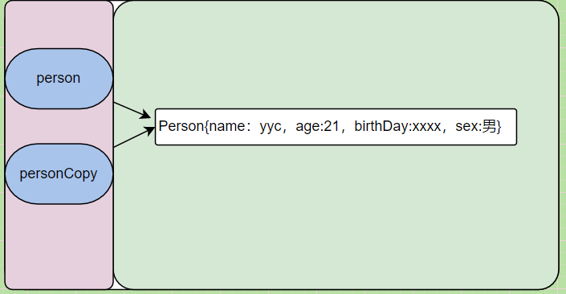
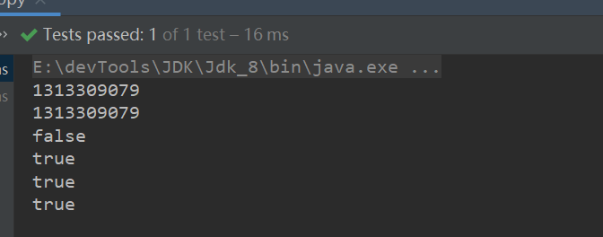
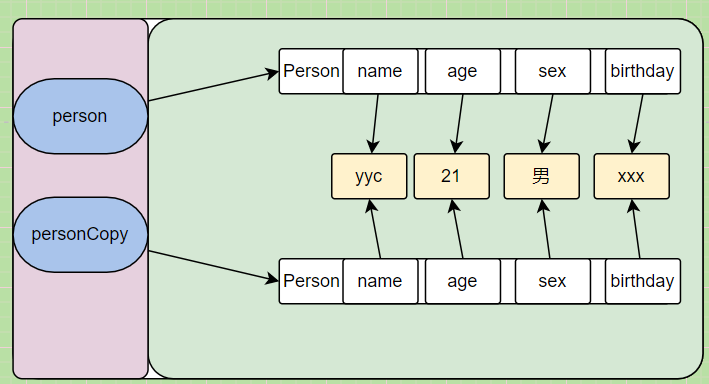
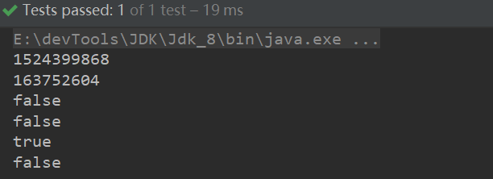
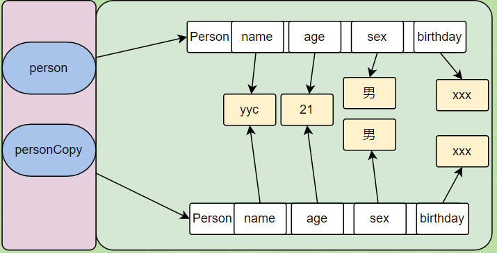
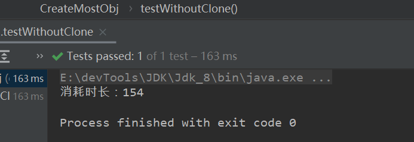
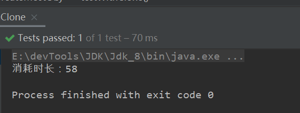
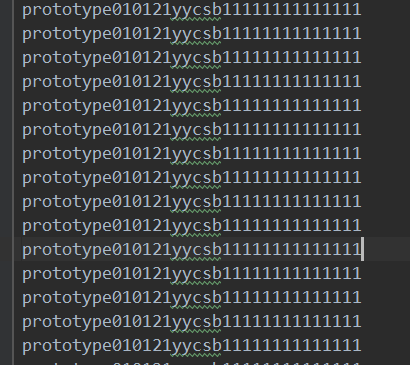
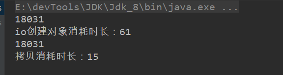

### 原型模式

原型模式（Prototype Pattern）用于创建重复的对象，同时又能保证性能。一般用于创建比较复杂的对象。


#### 拷贝

> 原型模式实际上调用的是Object的clone()方法。

可以发现这是一个Native本地方法，效率较高。

```java
protected native Object clone() throws CloneNotSupportedException;
```

了解一下三种拷贝方式：

- 引用拷贝
- 浅拷贝
- 深拷贝


##### 引用拷贝

> 创建一个新的引用指向同一块内存地址。两个引用操作的同一个对象。

需拷贝的对象：

```java
@Data
@AllArgsConstructor
@NoArgsConstructor
@Accessors(chain = true)
public class Person {
    String name;
    StringBuffer sex;
    Integer age;
    Date birthDay;
}
```

引用拷贝：

```java
@Test
public void quoteCopy() {
    Person person = new Person();
    person
            .setAge(21)
            .setName("yyc")
            .setSex("男")
            .setBirthDay(Calendar.getInstance().getTime());

    Person personCopy = person;

    System.out.println(person.hashCode());
    System.out.println(personCopy.hashCode());
    //相等
    System.out.println(personCopy == person);
}
```

图示：




##### 浅拷贝

> 创建新的引用和对象，对象内部的基本数据类型（基本数据类型只有值的概念）同时也被拷贝，对于引用类型只拷贝引用，不会拷贝具体对象。

只需要实现Cloneable接口重写clone()方法就行：

Cloneable接口就是一个标志接口，标志改类支持拷贝。和RandomAccess支持随机访问一样。

不实现Cloneable接口会报不支持拷贝异常。

```java
@Override
public Person clone() throws CloneNotSupportedException {
    return (Person)super.clone();
}
```

测试：

lombok重写了hashCode和equals，所以这里我们有等等号判断两个对象是否相等。

结论就是：对象被拷贝了，内部属性没有被拷贝而是内存共享。

```java
@Test
public void shallowCopy() throws CloneNotSupportedException {
    Person person = new Person();
    person
            .setAge(21)
            .setName("yyc")
            .setSex("男")
            .setBirthDay(Calendar.getInstance().getTime());

    Person personCopy = person.clone();
    //lomBok重写了hashCode方法
    System.out.println(person.hashCode());
    System.out.println(personCopy.hashCode());
    //两个对象不相等
    System.out.println(personCopy == person);
    //内部属性 StringBuffer
    System.out.println(person.getSex() == personCopy.getSex());
    //内部属性 Integer
    System.out.println(person.getAge() == personCopy.getAge());
    //内部属性 Date
    System.out.println(person.getBirthDay() == personCopy.getBirthDay());
}
```



图示：




##### 深拷贝

> 对象内部属性也会被拷贝，也就是完全不同的两个对象。

对于基本数据类型，也就是int、short、long等只有值的概念，对象被拷贝，他们也被拷贝。

对于引用数据类型，提供修改属性api的类型需要主动拷贝。但是对于未提供修改api的类不需要主动拷贝，比如String和八大基本数据类型的包装类型。

那么对于Person来说其内部属性我们只需要主动拷贝Date即可。

```java
@Override
public Person clone() throws CloneNotSupportedException {
    Person clone = (Person) super.clone();
    clone.setSex(new StringBuffer(sex.toString()));
    clone.setBirthDay((Date) birthDay.clone());
    return clone;
}
```

测试：

```java
@Test
public void deepCopy() throws CloneNotSupportedException {

    Person person = new Person();
    person
        .setAge(21)
        .setName("yyc")
        .setSex(new StringBuffer("男"))
        .setBirthDay(Calendar.getInstance().getTime());

    Person personCopy = person.clone();

    //lomBok重写了hashCode方法
    System.out.println(person.hashCode());
    System.out.println(personCopy.hashCode());
    //两个对象不相等
    System.out.println(personCopy == person);
    //内部属性 StringBuffer
    System.out.println(person.getSex() == personCopy.getSex());
    //内部属性 Integer
    System.out.println(person.getAge() == personCopy.getAge());
    //内部属性 Date
    System.out.println(person.getBirthDay() == personCopy.getBirthDay());
}
```




图示：



注意：

> 深拷贝，拷贝出来的对象，从意义上来说是两个完全不同的对象了。所以对于提供修改对象Api的类，一定要主动拷贝（或是clone()方法，或是new 一个新的），防止拷贝出来的对象的修改操作引起原始对象的修改。
>
> 但是对于为提供修改对象api的类，不用主动拷贝，即便拷贝的对象对其重新赋值，也不会影响原始对象。


<hr>


#### 实现

> 比如说创建一个对象需要消耗比较长时间的资源（比如数据库、比如io）或者需要通过循环创建多个对象，此刻可以考虑使用原型模式，对象创建出来先放入缓存，下次创建直接去拿并且拷贝一份。
>
> clone()方法会跳过构造器，直接操作内存中的二进制流，所以说效率较高。

注意：

> 对于基本数据类型、基本数据类型的包装类型以及String可以不用拷贝，但是对于可变的引用类型除非不考虑修改，否则必须主动拷贝。


##### 循环创建多个对象

创建一个原型类：

```java
public class Prototype implements Cloneable {
    /**
     * 基本数据类型、包装类型、String可以不用拷贝
     */
    int id;
    Integer age;
    String name;
    /**
     * 对于可变的数据类型得主动拷贝
     */
    StringBuffer sb;
    Date createTime;
    /**
     * 访问权限扩大
     * 返回对象范围缩小
     */
    @Override
    public Prototype clone() throws CloneNotSupportedException {
        Prototype clone = (Prototype) super.clone();
        clone.setSb(new StringBuffer(sb));
        clone.setCreateTime((Date) createTime.clone());
        return clone;
    }
}
```

测试：

> 不使用原型模式循环创建100000个对象

```java
@Test
public void testWithoutClone() {
    long start = Calendar.getInstance().getTime().getTime();
    for (int i = 0; i < 10000; i++) {
        Prototype prototype = new Prototype(i, 21, "" + i, new StringBuffer("" + i), Calendar.getInstance().getTime());
    }
    long end = Calendar.getInstance().getTime().getTime();

    System.out.println("消耗时长：" + (end - start));
}
```




> 使用原型模式创建100000个对象

```java
@Test
public void testWithClone() throws CloneNotSupportedException {

    long start = Calendar.getInstance().getTime().getTime();
    Prototype prototype = new Prototype(1, 21, "" + 1, new StringBuffer("" + 1), Calendar.getInstance().getTime());
    for (int i = 0; i < 10000; i++) {
        Prototype clone = prototype.clone();
        clone.setId(i);
        clone.setAge(i);
        //clone.setSb(new StringBuffer(""+i));
        //clone.setCreateTime(Calendar.getInstance().getTime());
    }
    long end = Calendar.getInstance().getTime().getTime();
    System.out.println("消耗时长：" + (end - start));
}
```



> 差距还是蛮大的，为什么我将sb和date属性的set给注释掉呢？ 不要忘记在clone()方法内也进行了拷贝，所以这是一个等量替换的对比。


##### 需要io资源创建对象

> 比如说我们的对象创建依赖于一个txt文件，每次创建都需要读取这个txt文件。

首先初始化这个文件：

```java
@Test
public void init() throws IOException {
    //获取项目路径
    String property = System.getProperty("user.dir");
    String path = property + "/file";
    String fileName = "prototype.txt";
    File file = new File(path);
    //创建文件夹
    file.mkdirs();
    file = new File(file, fileName);
    if (!file.exists()) {
        file.createNewFile();
    }
    FileWriter fileWriter = new FileWriter(file);
    BufferedWriter bw = new BufferedWriter(fileWriter);
    StringBuffer sb = new StringBuffer();
    for (int i = 0; i < 100; i++) {
        sb.append("prototype01")
                .append("01")
                .append("21")
                .append("yyc")
                .append("sb")
                .append("11111111111111");
        bw.write(sb.toString());
        bw.newLine();
        bw.flush();
        sb.delete(0, sb.length());
    }
    bw.close();
    fileWriter.close();
}
```

会得到这么一个文件，每一行都是一个Prototype对象。



> 读取文件创建对象

多复制一点：这里有18031个


> 下次使用直接拷贝ArrayList

```java
@Test
public void createObjWithIo() throws IOException, CloneNotSupportedException {
    long start = Calendar.getInstance().getTime().getTime();
    FileReader fileReader = new FileReader(new File(System.getProperty("user.dir") + "/file" + "/prototype.txt"));
    BufferedReader br = new BufferedReader(fileReader);
    String str;
    while ((str = br.readLine()) != null) {
        if (str.isEmpty())
            continue;
            //空行不处理
        else {
            Prototype prototype = new Prototype();
            prototype = prototype.setId(Integer.parseInt(str.substring(11, 13)))
                    .setAge(Integer.parseInt(str.substring(13, 15)))
                    .setName(str.substring(15, 18))
                    .setSb(new StringBuffer(str.substring(18, 20)))
                    .setCreateTime(new Date(Long.parseLong(str.substring(20))));

            prototypes.add(prototype);
        }

    }
    fileReader.close();
    br.close();

    long end = Calendar.getInstance().getTime().getTime();
    System.out.println(prototypes.size());
    System.out.println("io创建对象消耗时长：" + (end - start));


    ArrayList<Prototype> arrayList = new ArrayList<>();

    long startCopy = Calendar.getInstance().getTime().getTime();


    for (Prototype prototype : prototypes) {

        arrayList.add(prototype.clone());

    }

    long endCopy = Calendar.getInstance().getTime().getTime();
    System.out.println(arrayList.size());
    System.out.println("拷贝消耗时长：" + (endCopy - startCopy));
}
```

对比：



注意这里没有使用ArrayList的拷贝方法，因为ArrayList底层的Clone方法使用的是System.ArrayCopy方法，这是一种浅拷贝，存在拷贝对象修改原型对象的风险。

测试：

~~~java
public void testArrayListCopy() {

  ArrayList<Prototype> prototypes = new ArrayList<>();
  prototypes.add(new Prototype().setSb(new StringBuffer("123")));
  System.out.println("拷贝前：" + prototypes);

  ArrayList<Prototype> clone = (ArrayList<Prototype>) prototypes.clone();
  Prototype prototype = clone.get(0);
  prototype.getSb().append("abc");
  System.out.println("使用拷贝对象修改后：" + prototypes);
}
~~~


