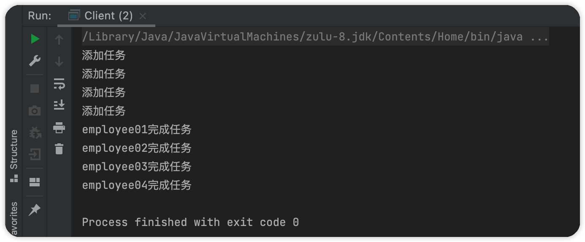

### 命令模式

命令模式（Command Pattern）属于行为模式，将一个请求封装为一个对象，使发出请求的责任与执行请求的责任分开。将命令发出者与命令接收者进行解耦，两者通过命令对象进行沟通。


包含角色

- 抽象命令类（Command），定义命令抽象接口
- 具体命令类（Concrete Command），抽象命令类的实现，将命令接受者组合进来，调用命令接受者的具体功能来完成命令的执行。
- 命令接受者（Receiver），命令的具体执行者
- 命令发出者或调用者（Invoker），命令发出者，将命令组合进来，通过调用命令来完成相关业务


### 实现

> 以公司领导安排任务为例。领导负责一个项目的进度，一般会有很多的员工，领导为多个员工下达不同的指令，员工负责具体执行对应任务。
>
> 在此模型中领导是命令发出者，员工是命令接受者，任务就是命令。领导无需关系任务具体完成细节，他只需要知道任务完成结果，每个任务分配给对应员工，员工具体执行业务。

抽像命令接口：

```java
public interface Command {
    /**
     * 命令方法
     */
    void execute();
}
```

具体命令：将具体负责人组合进来

```java
@Data
@AllArgsConstructor
public class ConcreteCommand implements Command {
    /**
     * 每个任务都有负责人
     */
    private Receiver receiver;
    @Override
    public void execute() {
        //具体负责人去完成任务
        receiver.doWork();
    }
}
```

命令接收者：

```java
@Data
@Accessors(chain = true)
public class Receiver {
    String name;
    public void doWork() {
        System.out.println(this.name + "完成任务");
    }
}
```

命令发出者：

组合多个命令：

```java
public class Invoker {
    /**
     * 老板将一个项目拆分为许多模块，每个模块就是一个命令
     */
    private List<Command> commandList = new ArrayList<>();
    public void addCommand(Command command){
        System.out.println("添加任务");
        commandList.add(command);
    }
    public void delCommand(Command command){
        System.out.println("移除任务");
        commandList.remove(command);
    }
    public void doCommand(){
        //完成任务
        commandList.forEach(Command::execute);
    }
}
```


测试：

```java
public class Client {
    public static void main(String[] args) {

        Invoker invoker = new Invoker();

        Receiver receiver1 = new Receiver().setName("employee01");
        Receiver receiver2 = new Receiver().setName("employee02");
        Receiver receiver3 = new Receiver().setName("employee03");
        Receiver receiver4 = new Receiver().setName("employee04");

        Command command1 = new ConcreteCommand(receiver1);
        Command command2 = new ConcreteCommand(receiver2);
        Command command3 = new ConcreteCommand(receiver3);
        Command command4 = new ConcreteCommand(receiver4);

        invoker.addCommand(command1);
        invoker.addCommand(command2);
        invoker.addCommand(command3);
        invoker.addCommand(command4);

        invoker.doCommand();
    }
}
```

