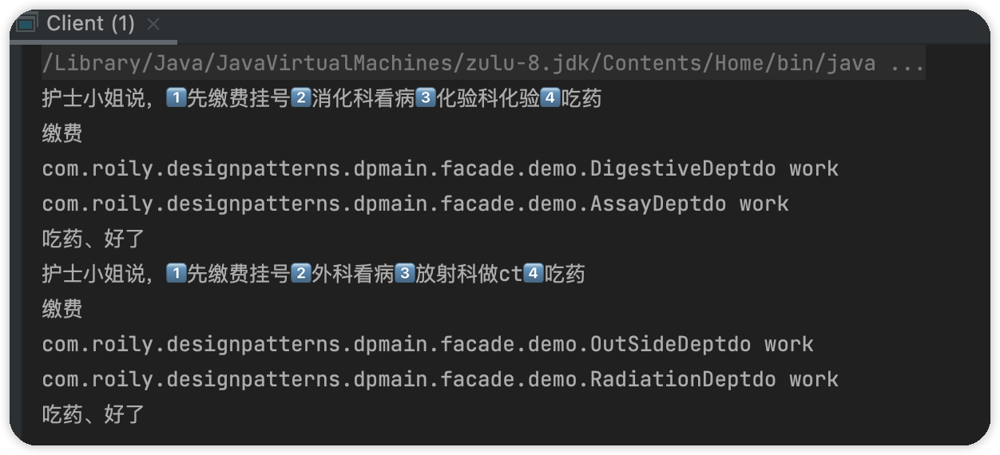

### 外观模式

外观模式（Facade Pattern）又叫门面模式，用来封装系统内部调用，并向客户端提供了一个可以访问系统的总接口。这种类型的设计模式属于结构型模式，它向现有的系统添加一个接口，来隐藏系统的复杂性。

这种模式涉及到一个单一的类，该类提供了客户端请求的简化方法和对现有系统类方法的委托调用，但并不对系统功能做增强，只是做封装。

#### 简单实现

> 造车流程：设计、生产配件、组装

```java
public class DesignCar {
    public static void design(){
        System.out.println("设计");
    }
}
public class Produce {
    public static void produce() {
        System.out.println("生产零件");
    }
}
public class Assemble {
    public static void assemble(){
        System.out.println("组装");
    }
}
//客户端调用
public void makeCar(){
    DesignCar.design();
    Produce.produce();
    Assemble.assemble();
}
```

> 对于程序本身不希望调用者知道具体流程，对于调用者也不希望调用繁琐，并且后期如果流程有改动的话需要修改客户端，不合理。所以可以加一个CarMaker类将流程封装，并提供makeCar接口供客户端调用。

> 创建一个CaMaker对造车流程封装，呃......外观模式。存在一个好处就是当流程或逻辑需要修改的时候我们只需要修改Facade即可，不用去修改客户端的调用。

```java
public class CarMaker {
    /**
     * 如果不是静态方法可以将需要的类组合进来
     */
    public static void makeCar() {
        DesignCar.design();
        Produce.produce();
        Assemble.assemble();
    }
}
public static void main(String[] args) {
        CarMaker.makeCar();
}
```


#### 例子

> 上面的的例子只是体现外观模式的封装思想，使得系统之间耦合度降低。外观模式是对迪米特法则的最好体现，也就是外观模式可以赢藏内部实现，避免客户端看见不需要的方法，从而造成误解。

我们以去医院看病为例：

医院中每一个科室都是一个子系统：放射科、化验科、消化科、内科、外科、儿科、体检科～～

一般来说我们去医院看病除非很熟悉，不然肯定会去咨询护士小姐姐的，那么护士小姐就是整个系统的“门面”，她简化了我们看病的流程。


医院每个科室抽象接口：

```java
public interface IDepartment {
    /**
     * 每个科室所做的工作
     */
    void doWork();
}
```

定义几个科室实现这个接口：

```java
public class AssayDept implements IDepartment {
    @Override
    public void doWork() {
        System.out.println(this.getClass().getName() + "do work");
    }
    /**
     * 定义提供给内部系统调用的方法，对外隐藏
     */
    public void doOther() {
        System.out.println(this.getClass().getName() + "do other");
    }
}
public class DigestiveDept implements IDepartment {
    @Override
    public void doWork() {
        System.out.println(this.getClass().getName() + "do work");
    }
    /**
     * 定义提供给内部系统调用的方法，对外隐藏
     */
    public void doOther() {
        System.out.println(this.getClass().getName() + "do other");
    }
}
public class OutSideDept implements IDepartment{
    @Override
    public void doWork() {
        System.out.println(this.getClass().getName() + "do work");
    }
    /**
     * 定义提供给内部系统调用的方法，对外隐藏
     */
    public void doOther() {
        System.out.println(this.getClass().getName() + "do other");
    }
}
public class RadiationDept implements IDepartment {
    @Override
    public void doWork() {
        System.out.println(this.getClass().getName() + "do work");
    }
    /**
     * 定义提供给内部系统调用的方法，对外隐藏
     */
    public void doOther() {
        System.out.println(this.getClass().getName() + "do other");
    }
}
```

定义护士小姐姐，“外观门面”


```Java
public class Facade {
    private IDepartment digestive;
    private IDepartment assay;
    private IDepartment outSide;
    private IDepartment radiation;
    {
        //初始化

        //消化科
        digestive = new DigestiveDept();
        //化验科
        assay = new AssayDept();
        //外科
        outSide = new OutSideDept();
        //放射科
        radiation = new RadiationDept();
    }

    /**
     * 我想看那个胃病
     */
    public void fixStomachError(){
        System.out.println("护士小姐说，1⃣️先缴费挂号2⃣️消化科看病3⃣️化验科化验4⃣️吃药");
        System.out.println("缴费");
        digestive.doWork();
        assay.doWork();
        System.out.println("吃药、好了");
    }
    /**
     * 摔了一跤，查查问题
     */
    public void fixError(){
        System.out.println("护士小姐说，1⃣️先缴费挂号2⃣️外科看病3⃣️放射科做ct4⃣️吃药");
        System.out.println("缴费");
        outSide.doWork();
        radiation.doWork();
        System.out.println("吃药、好了");
    }
}
```

测试：

```java
public class Client {
    public static void main(String[] args) {
        final Facade facade = new Facade();
        //看胃病
        facade.fixStomachError();
        //摔了一跤，找找毛病
        facade.fixError();
    }
}
```



>护士小姐知道看病大体流程，但是科室与科室之间的沟通或依赖只有医生知道，那么小姐姐告诉我们去哪里找医生，医生再指导具体流程，那么病人就可以顺利治病。

这里：科室就是子系统、护士小姐就是外观门面、病人就是调用客户端

护士小姐只负责指导病人去找医生，而不需要知道如何治病。

病人通过护士小姐姐，可以准确找到对应科室，而避免咨询不相关的科室浪费时间。

以上就是迪米特法则的体现：只和朋友说话、朋友的事也少打听。

