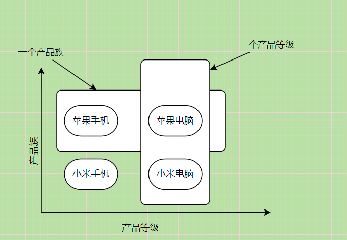

### 工厂模式


#### 概念

​	工厂模式(Factory Pattern)属于创建型模式，提供了一种创建对象的方式。在工厂模式中我们不会对客户端暴露实例的创建逻辑，而客户端只需简单参数就可以创建不同的对象。


#### 分类

- 简单工厂模式
- 工厂方法模式
- 抽象工厂模式


#### 简单工厂模式

##### 1、简单

> 场景：一个工厂会造手机和电脑。这两个产品都属于电子产品，我们可以抽象出来。

```java
public interface ElectronicProduct {
    //抽象生产方法
    void Production();
}
public class Phone implements ElectronicProduct{
    @Override
    public void Production() {
        //生产手机
    }
}
public class Computer implements ElectronicProduct {
    @Override
    public void Production() {
        //生产电脑
    }
}
```

> 一般来说我们需要什么产品直接new出来就行。也就是对象的创建在客户端进行。

> 简单工厂模式是如何实现的呢

可以定义一个工厂类，对象的创建由工厂负责，不再由客户端负责。

**简单工厂模式包含三个角色**

- Factory：工厂，创建产品的细节在这里实现。
- Product：抽象产品类。是工厂类所创建的对象的父类。
- ConcreateProduct：具体产品，及Product的子类。

结合上面所述，我们定义一个工厂类。

```java
public class ElectronicFactory {
    //工厂造产品
    public static ElectronicProduct createProduct(String type) {
        ElectronicProduct temp = null;
        switch (type) {
            case "phone":
                temp = new Phone();
                break;
            case "computer":
                temp = new Computer();
                break;
            default:
                ;
        }
        return temp;
    }
    @Test
    public void Client() {
        ElectronicProduct phone = ElectronicFactory.createProduct("phone");
        ElectronicProduct computer = ElectronicFactory.createProduct("computer");
    }
}
```

如此创建对象的具体职责由工厂负责，而不是客户端负责，客户端只要知道传一个什么给工厂可以得到对象即可。(这样的例子很简单，体现不出好处，假设我们创建一个对象需要很多初始化操作，工厂模式的好处就会体现出来)

**缺点**

简单工厂模式，客户端传递的参数，工厂根据参数创建对应产品。此刻若新增一个产品，会修改已有代码的逻辑。也就直接违反了开闭原则。


##### 2、方法

> 不通过判断创建不同的对象，为不同的的实现类创建不同的方法

```java
public ElectronicProduct createPhone(){
    return new Phone();
}
public ElectronicProduct createComputer(){
    return new Computer();
}
```


##### 3、静态方法

> 将第二点方法变为静态的就行。


##### 小结

总体来说，工厂模式适合：凡是出现了大量的产品需要创建，并且具有共同的接口时，可以通过工厂方法模式进行创建。在以上的三种模式中，第一种如果传入的字符串有误，不能正确创建对象，第三种相对于第二种，不需要实例化工厂类，所以，大多数情况下，我们会选用第三种——静态工厂方法模式。


缺点：

> 产品的创建依赖工厂，如果需要扩展产品，就必须要修改工厂类，不符合开闭原则。

<hr>


#### 工厂方法模式

> 工厂方法模式就是将简单工厂模式中的工厂再抽象出一个父类或接口，对应工厂创建对应产品，将类的创建延迟到工厂子类进行。

**包含四个角色**

- Product: 抽象产品
- ConcreateProduct：具体产品

- Factory：抽象工厂
- ConcreateFactory: 具体工厂

##### 缺点

每一个产品对应一个工厂类，类文件过多

##### 优点

- 符合开闭原则

  当我们想扩展产品时，实现对应扩展的产品和工厂即可

- 客户端创建实例变得简单

  客户端无序知道具体产品细节，只需要应用对应工厂类创建对象即可。

  

**简单实现**

定义抽象工厂和两个工厂实现类

```java
public interface ElectronicFactory {
    //抽象生产产品方法
    ElectronicProduct createProduct();

}
public class ComputerFactory implements ElectronicFactory {
    @Override
    public ElectronicProduct createProduct() {
        return new Computer();
    }
}
public class PhoneFactory implements ElectronicFactory {
    @Override
    public ElectronicProduct createProduct() {
        return new Phone();
    }
}
```

> 客户端想要产品，只要将对应工厂类new出来就可以。

```java
@Test
public void test(){
    ElectronicFactory computerFactory = new ComputerFactory();
    ElectronicProduct computer = computerFactory.createProduct();
    
    ElectronicFactory phoneFactory = new PhoneFactory();
    ElectronicProduct phone = phoneFactory.createProduct();
}
```


#### 抽象工厂模式

> 对于工厂方法模式来说类太多了，大可比不化的如此细。
>
> 一个生产电子产品的工厂，不至于只能生产手机或电脑吧，为了解决工厂方法模式类过多问题，做如下改变。


##### 产品等级&产品族



> 也就是说产品等级产品等级以产品类别分，产品族以工厂分。

我们来简单实现一下。

产品的：分两个产品等级，手机和电脑

```java
//手机抽象接口
public interface IPhone {
    void ProductionPhone();
}
//小米手机
public class MiIPhone implements IPhone {
    @Override
    public void ProductionPhone() {
        System.out.println("生产小米手机");
    }
}
//苹果手机
public class AppleIPhone implements IPhone {
    @Override
    public void ProductionPhone() {
        System.out.println("生产苹果手机");
    }
}
//电脑抽象接口
public interface IComputer {
    //电脑生产过程
    void ProductionComputer();
}
//小米电脑
public class MiPC implements IComputer {
    @Override
    public void ProductionComputer() {
        System.out.println("生产小米电脑");
    }
}
//苹果电脑
public class ApplePC implements IComputer {
    @Override
    public void ProductionComputer() {
        System.out.println("生产苹果电脑");
    }
}
```

工厂的：

```java
//抽象工厂接口
public interface ElectronicFactory {
    IPhone createPhone();
    IComputer createComputer();
}
//小米工厂
public class MiFactory implements ElectronicFactory {
    @Override
    public IPhone createPhone() {
        return new MiIPhone();
    }
    @Override
    public IComputer createComputer() {
        return new MiPC();
    }
}
//苹果工厂
public class AppleFactory implements ElectronicFactory {
    @Override
    public IPhone createPhone() {
        return new AppleIPhone();
    }
    @Override
    public IComputer createComputer() {
        return new ApplePC();
    }
}
```

测试：

```java
@Test
public void test(){

    ElectronicFactory miFactory = new MiFactory();
    IPhone miPhone =  miFactory.createPhone();
    miPhone.ProductionPhone();
    IComputer miComputer = miFactory.createComputer();
    miComputer.ProductionComputer();

    ElectronicFactory appleFactory = new AppleFactory();
    IPhone applePhone =  appleFactory.createPhone();
    applePhone.ProductionPhone();
    IComputer appleComputer = appleFactory.createComputer();
    appleComputer.ProductionComputer();

}
```


##### 优点

- 思路清晰，易于维护
- 当新增产品族的时候，比如这时候接入进来华为公司，我们只需要实现华为对应产品和工厂就行，无需改动现存代码。

##### 缺点

- 当需要新增一个产品的时候，改动的代码就有点多了，对于修改接口的情况是严重违反开闭原则的。接口是一个约定，只要上生产就不得再改动。