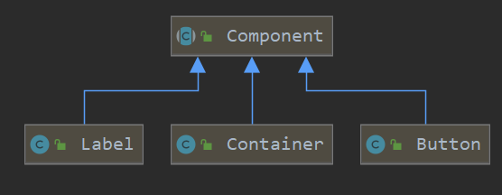
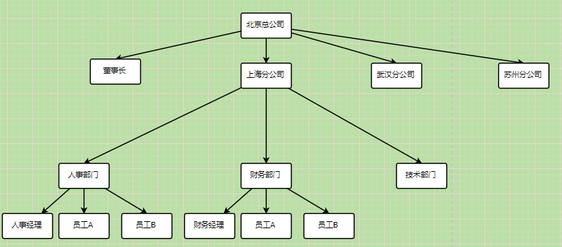
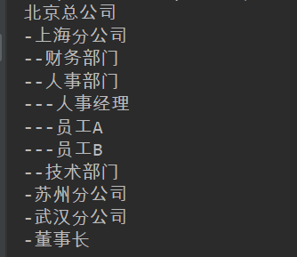

### 组合模式


#### 简介

组合模式（Composite Pattern），又叫部分-整体模式，是用于把一组相似的对象当作一个单一的对象。组合模式依据树形结构来组合对象，用来表示部分以及整体层次。这种类型的设计模式属于结构型模式，它创建了对象组的树形结构。

#### 角色

- 抽象接口
- 叶子    单一对象
- 树枝     存在叶子或树枝组成的集合

#### 例子

swing中的·组件·就是使用的组合模式，容器中可以有按钮、文字，并且都是组件实现了同一个接口。

Container里存在着多个Component可以是Label也可以是Button，那么Component就是一个树枝。

Label是一个文本组件，其内只存在文本属性，不会组合其他组件，那么他就是一个叶子。



#### 公司组织结构的例子

> 组合模式适用于可以将关系抽象为一个树形结构的对象，从而实现良好的扩展性。
>
> 我们以公司结构说明



> 定义抽象接口：

```java
public interface CompanyComponent {
    //添加组件
    Boolean addComponent(CompanyComponent companyComponent);

    //移除组件
    Boolean removeComponent(CompanyComponent companyComponent);

    //遍历展示
    void show(int depth);
}
```

> 组织（可能是分公司或是部门）

```java
@Data
@AllArgsConstructor
public class DepartmentComponent implements CompanyComponent {

    //组件名称
    private String name;
    //树枝节点下的叶子
    public List<CompanyComponent> components;


    @Override
    public Boolean addComponent(CompanyComponent companyComponent) {
        return components.add(companyComponent);
    }

    @Override
    public Boolean removeComponent(CompanyComponent companyComponent) {
        return components.remove(companyComponent);
    }

    @Override
    public void show(int depth) {
        //节点越深，等级越低
        for (int i = 0; i < depth; i++) {
            System.out.printf("-");
        }
        System.out.println(this.getName());
        //递归遍历
        components.forEach(companyComponent -> {
            companyComponent.show(depth + 1);
        });

    }
}
```


> 员工

```java
@Data
@AllArgsConstructor
public class EmployeeComponent implements CompanyComponent {

    //组件名称
    private String name;

    @Override
    public Boolean addComponent(CompanyComponent companyComponent) {
        return false;
    }

    @Override
    public Boolean removeComponent(CompanyComponent companyComponent) {
        return true;
    }

    @Override
    public void show(int depth) {
        //节点越深，等级越低
        for (int i = 0; i < depth; i++) {
            System.out.printf("-");
        }
        System.out.println(this.getName());
    }
}
```

> 测试

```java
public class Client {

    private static DepartmentComponent beijing;

    static {
        beijing = new DepartmentComponent("北京总公司", new ArrayList<>());

        DepartmentComponent shanghai = new DepartmentComponent("上海分公司", new ArrayList<>());
        DepartmentComponent wuhan = new DepartmentComponent("武汉分公司", new ArrayList<>());
        DepartmentComponent suzhou = new DepartmentComponent("苏州分公司", new ArrayList<>());
        DepartmentComponent hr = new DepartmentComponent("人事部门", new ArrayList<>());
        DepartmentComponent fd = new DepartmentComponent("财务部门", new ArrayList<>());
        DepartmentComponent td = new DepartmentComponent("技术部门", new ArrayList<>());
        EmployeeComponent hrManager = new EmployeeComponent("人事经理");
        EmployeeComponent employeeA = new EmployeeComponent("员工A");
        EmployeeComponent employeeB = new EmployeeComponent("员工B");
        EmployeeComponent manager = new EmployeeComponent("董事长");

        hr.addComponent(hrManager);
        hr.addComponent(employeeA);
        hr.addComponent(employeeB);
        //上海分公司下有
        shanghai.addComponent(fd);
        shanghai.addComponent(hr);
        shanghai.addComponent(td);

        beijing.addComponent(shanghai);
        beijing.addComponent(suzhou);
        beijing.addComponent(wuhan);
        beijing.addComponent(manager);
    }

    public static void main(String[] args) {

        System.out.println(beijing);
        beijing.show(0);
    }

}
```



是符合预期的。


#### 透明&安全

> 组合模式分透明模式和安全模式，以上的例子是透明模式的，对于Employee来说无需实现add 和 remove方法，我们实现了，是没有意义的。安全模式就是将add  remove提到`组织`中拓展，员工不用拓展。


#### 应用

> 组合模式一般用于处理树形或存在层次结构的数据
