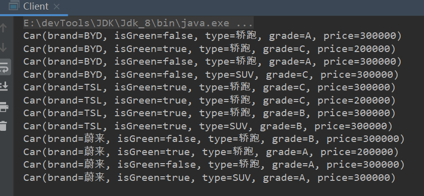

### 过滤器模式

​	过滤器模式（Filter Pattern）是一种设计模式，这种模式允许开发人员使用不同的标准来过滤一组对象。这种类型的设计模式属于结构型模式，它结合多个标准来获得单一标准。

​	在web应用中过滤器是不可避免地，也是重要的一环，比如说  对铭感信息用星号代替，比如说对字符集进行统一编码。


#### 使用

> 我们以买车为例，添加多个过滤条件，定位到符合条件的车型。


定义一辆车：

```java
@Data
@AllArgsConstructor
public class Car {
    //品牌
    String brand;
    //是否新能源
    Boolean isGreen;
    //类型SUV、轿跑
    String type;
    //等级 A、b、c级
    String grade;
    //等级 A、b、c级
    Integer price;
}
```

抽象过滤器及实现类：

```java
public interface IFilter {
    //抽象过滤方法
    List<Car> carFilter(List<Car> carList);
}
public class PriceFilter implements IFilter {
    @Override
    public List<Car> carFilter(List<Car> carList) {
        List<Car> properCars = new ArrayList<>();
        //价格在15-35万之间
        carList.forEach(car -> {
            if (car.getPrice().compareTo(150000) >= 0 && car.getPrice().compareTo(350000) <= 0)
                properCars.add(car);
        });
        return properCars;
    }
}
public class OtherFilter implements IFilter {
    @Override
    public List<Car> carFilter(List<Car> carList) {
        List<Car> properCars = new ArrayList<>();
        //新能源  B级车
        carList.forEach(car -> {
            if (car.getGrade().equals("B") && car.getIsGreen())
                properCars.add(car);
        });
        return properCars;
    }
}
```

测试：

```java
public class Client {
    private static List<Car> cars = new ArrayList<>();
    private static PriceFilter priceFilter = new PriceFilter();
    private static OtherFilter otherFilter = new OtherFilter();
    static {
        cars.add(new Car("BYD", false, "轿跑", "A", 300000));
        cars.add(new Car("BYD", false, "SUV", "B", 100000));
        cars.add(new Car("BYD", true, "轿跑", "C", 200000));
        cars.add(new Car("BYD", false, "轿跑", "A", 300000));
        cars.add(new Car("BYD", true, "SUV", "A", 100000));
        cars.add(new Car("BYD", false, "SUV", "C", 300000));
        cars.add(new Car("BYD", true, "轿跑", "A", 400000));
        cars.add(new Car("TSL", true, "轿跑", "C", 300000));
        cars.add(new Car("TSL", true, "SUV", "A", 100000));
        cars.add(new Car("TSL", true, "轿跑", "C", 200000));
        cars.add(new Car("TSL", true, "轿跑", "B", 300000));
        cars.add(new Car("TSL", true, "SUV", "B", 100000));
        cars.add(new Car("TSL", true, "SUV", "B", 300000));
        cars.add(new Car("TSL", true, "轿跑", "B", 400000));
        cars.add(new Car("蔚来", false, "轿跑", "B", 300000));
        cars.add(new Car("蔚来", false, "SUV", "A", 100000));
        cars.add(new Car("蔚来", true, "轿跑", "A", 200000));
        cars.add(new Car("蔚来", false, "轿跑", "A", 300000));
        cars.add(new Car("蔚来", true, "SUV", "B", 100000));
        cars.add(new Car("蔚来", true, "SUV", "A", 300000));
        cars.add(new Car("蔚来", true, "轿跑", "A", 400000));
    }
    public static List<Car> doFilter() {
        List<Car> cars = priceFilter.carFilter(Client.cars);
        List<Car> cars1 = otherFilter.carFilter(cars);
        return cars;
    }
    public static void main(String[] args) {
        List<Car> cars = doFilter();

        cars.forEach(System.out::println);
    }
}
```



通过过滤器可以准确定位到我们需要的车型。