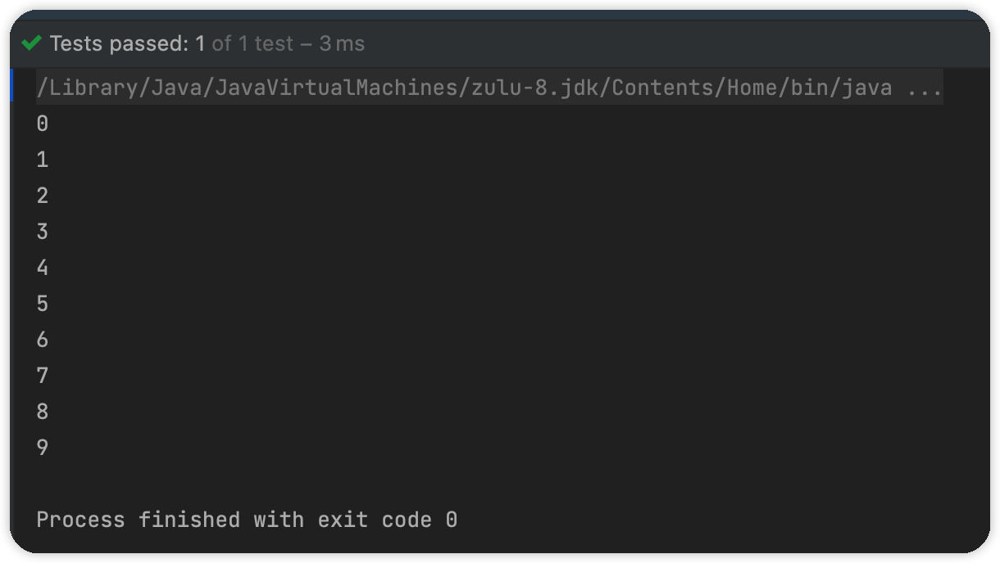

### 迭代器模式

迭代器模式（Iterator Pattern）属于行为型模式。适用于顺序访问容器对象的元素，无需了解其底层实现。

java集合框架对于有序的集合基本上都实现类自己的迭代器。

对于Collection这一簇，会有Iterable接口定义实现规范。对于Map和Set也会有对应的实现。

### ArrayList的Iterater

迭代器接口：

对于遍历集合来说重要的就是下面两个方法：

- hashNext用于判断迭代是否完成
- next用于获取后继元素

```java
public interface Iterator<E> {
    boolean hasNext();
    E next();
}
```

作为内部类组合进ArrayList

```java
private class Itr implements Iterator<E> {
    int cursor;       // index of next element to return
    int lastRet = -1; // index of last element returned; -1 if no such
    int expectedModCount = modCount;
    Itr() {}
    //判断是否存在后继元素
    public boolean hasNext() {
        return cursor != size;
    }
		//获取下一个元素
    @SuppressWarnings("unchecked")
    public E next() {
        checkForComodification();
        int i = cursor;
        if (i >= size)
            throw new NoSuchElementException();
        Object[] elementData = ArrayList.this.elementData;
        if (i >= elementData.length)
            throw new ConcurrentModificationException();
        cursor = i + 1;
        return (E) elementData[lastRet = i];
    }

		//检查并发安全（这里不用考虑）
    final void checkForComodification() {
        if (modCount != expectedModCount)
            throw new ConcurrentModificationException();
    }
}
```


### 仿造实现

> 定义抽象迭代器接口

简单实现之需要关心next()和hashNext()方法：

```java
public interface Iiterator<E> {
    /**
     * 判断集合是否还存在元素
     * @return Boolean.class
     */
    Boolean hashNext();

    /**
     * 获取下一个元素
     * @return E
     */
    E next();
}
```

> 定义自定义抽象集合接口

```java
public interface ICollection<E> {
    /**
     * 提供获取迭代器的方法
     *
     * @return E
     */
    Iiterator<E> iterator();
    /**
     * 获取集合首个元素
     *
     * @return
     */
    E getFirstElement();
    /**
     * 获取元素
     * @param index
     * @return
     */
    E get(int index);
}
```

> 自定义集合实现类

将迭代器作为内部类组合进来，由于我们简单实现，迭代器之需要一个当前下标数据即可实现迭代器迭代。

为了操作简单，内部借助ArrayList实现。

并在代码块初始化内部值，这样就不用添加元素方法。

```java
public class MyCollection<E> implements ICollection<E> {

    private class MyCollectionIterator<E> implements Iiterator<E> {
        int currentIndex;
        public MyCollectionIterator() {
        }
        @Override
        public Boolean hashNext() {
            return arrayList.size() != currentIndex;
        }
        @Override
        public E next() {
            return (E) arrayList.get(currentIndex++);
        }
    }

    /**
     * 内部借助ArrayList实现
     */
    private ArrayList<E> arrayList = new ArrayList<>();
    {
        //初始化一些值
        for (int i = 0; i < 10; i++) {
            arrayList.add((E) Integer.valueOf(i));
        }
    }

    @Override
    public Iiterator<E> iterator() {
        return new MyCollectionIterator<>();
    }

    @Override
    public E getFirstElement() {
        return arrayList.get(0);
    }

    @Override
    public E get(int index) {
        return arrayList.get(index);
    }
}
```

测试：

```java
@Test
public void testMyCollection() {
    MyCollection<Integer> objectMyCollection = new MyCollection<>();
    Iiterator<Integer> iterator = objectMyCollection.iterator();
    while (iterator.hashNext()){
        System.out.println(iterator.next());
    }
}
```




我们好像实现了一个简单的集合类～～～