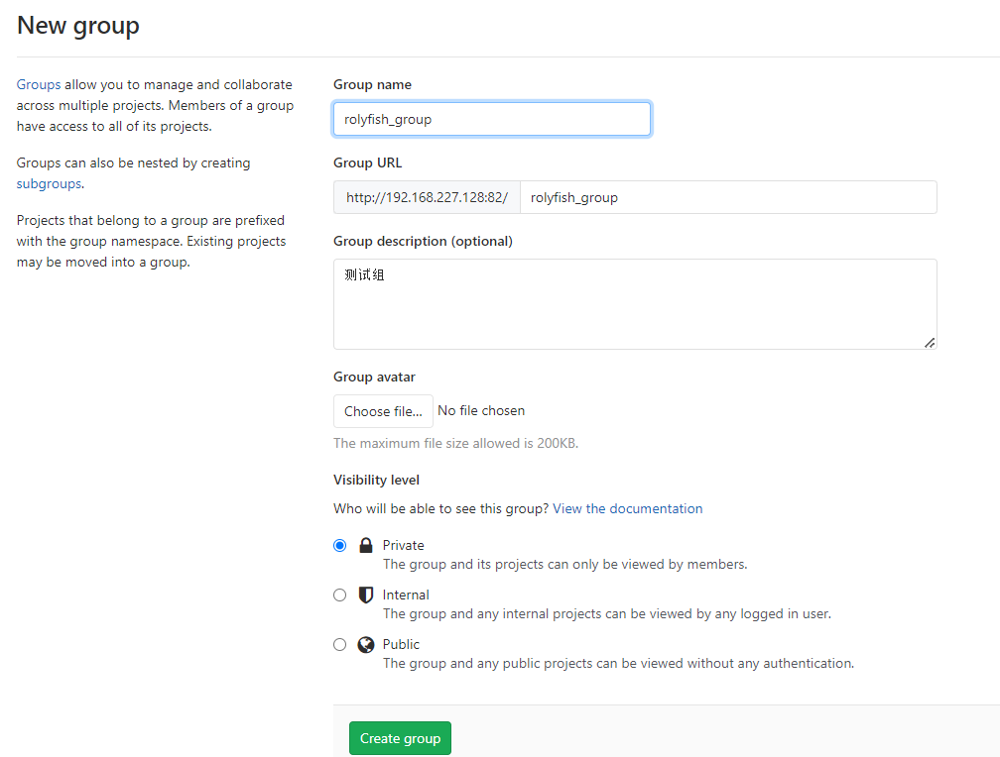
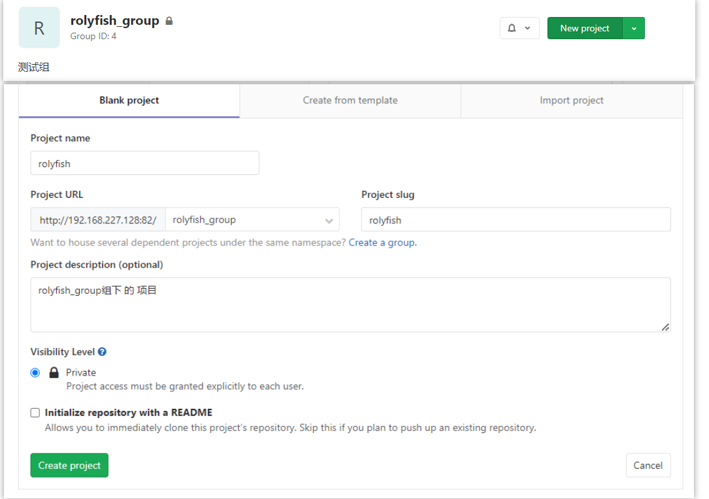
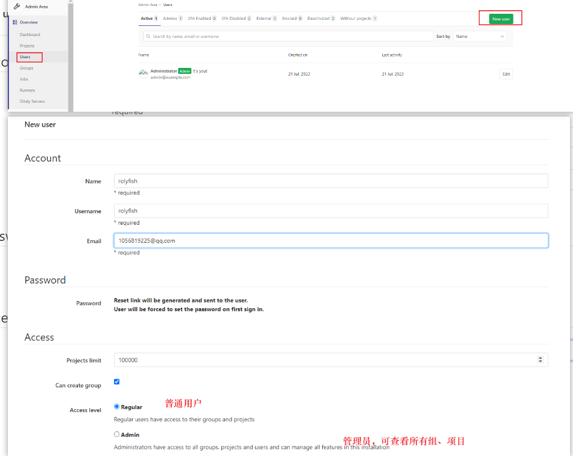
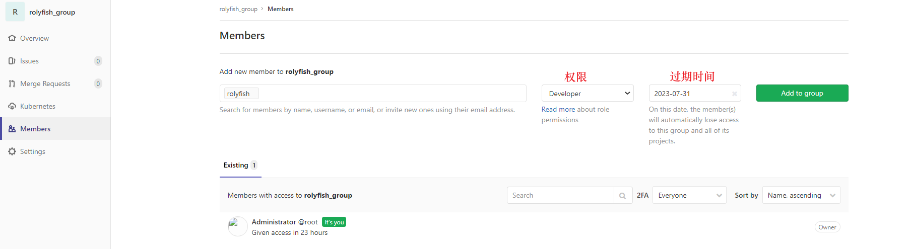

## Jenkins

- 持续集成及Jenkins介绍
- Jenkins安装和持续集成环境配置
- Jenkins构建Maven项目
- Jenkins+Docker+SpringCloud微服务持续集成
- 基于Kubernetes/K8S构建Jenkins微服务持续集成平台

### 持续集成及Jenkins介绍

#### 软件生命周期

> 软件开发生命周期又叫做**SDLC**（Software Development Life Cycle），它是集合了计划、开发、测试和部署过程的集合

- 续期分析
- 设计
- 实现
- 测试
- 部署
- 维护

#### 瀑布模型

> 适用于小项目, 各个流程不可逆


#### 敏捷式开发

> 敏捷开发（Agile Development） 的核心是迭代开发（Iterative Development） 与 增量开发（Incremental Development） 。

##### 迭代开发

> 将一个大项目拆分为多个小项目, 每个小项目按标准的软件生命周期管理

##### 增量开发

> 按照功能划分迭代, 每一个迭代都会有可感知的新增功能

#### 持续集成

##### 什么是持续集成

> 持续集成（ Continuous integration ， 简称 CI ）指的是，频繁地（一天多次）将代码集成到主干或者说中央库, 之后工具会自动自动构建、测试和发布。
>
> **持续集成的目的，就是让产品可以快速迭代，同时还能保持高质量。**它的核心措施是，代码集成到主干之前，必须通过自动化测试。只要有一个测试用例失败，就不能集成。

- 提交

  > 流程的第一步，是开发者向代码仓库提交代码。所有后面的步骤都始于本地代码的一次提交（commit）。

- 测试（第一轮）

  > 代码仓库对commit操作配置了钩子（hook），只要提交代码或者合并进主干，就会跑自动化测试。

- 构建

  > 通过第一轮测试，代码就可以合并进主干，就算可以交付了。交付后，就先进行构建（build），再进入第二轮测试。所谓构建，指的是将源码转换为可以运行的实际代码，比如安装依赖，配置各种资源（样式表、JS脚本、图片）等等。

- 测试（第二轮）

- 部署

  > 过了第二轮测试，当前代码就是一个可以直接部署的版本（artifact）。将这个版本的所有文件打包（tar filename.tar * ）存档，发到生产服务器。

- 回滚

  > 一旦当前版本发生问题，就要回滚到上一个版本的构建结果。最简单的做法就是修改一下符号链接，指向上一个版本的目录。

##### 持续集成元素

- 自动化构建、编译、测试、部署工具
- 代码仓库
- 持续集成服务器


### 持续集成


#### GitLab搭建

- [gitLab官网](https://about.gitlab.com/)
- [私有gitLab安装](https://gitlab.cn/install/)
- [安装步骤](https://gitlab.cn/install/#centos-7)


##### 安装步骤

- 安装相关依赖

  ```shell
  yum -y install policycoreutils openssh-server openssh-clients postfix
  ```

- 启动ssh服务&设置为开机启动

  ```shell
  systemctl enable sshd && sudo systemctl start sshd
  ```

- 设置postfix开机自启，并启动，postfix支持gitlab发信功能

  ```shell
  systemctl enable postfix && systemctl start postfix
  ```

- 开放ssh以及http服务，然后重新加载防火墙列表

  ```shell
  firewall-cmd --add-service=ssh --permanent
  firewall-cmd --add-service=http --permanent
  firewall-cmd --reload
  ```

- 安装gitlab

  ```shell
  rpm -i gitlab-ce-12.4.2-ce.0.el6.x86_64.rpm 
  ```

- 配置

  ```shell
  /etc/gitlab/gitlab.rb file
  
  external_url 'http://192.168.227.128:82'
  sten_port'] = 82
  ```

- 重载配置

  ```shell
  gitlab-ctl reconfigure
  gitlab-ctl restart
  ```

- 防火墙添加端口

  ```shell
  firewall-cmd --zone=public --add-port=82/tcp --permanent
  firewall-cmd --reload
  ```

- 登录

  > 首次登录需要套修改密码, 使用顶层用户root登录即可。

##### 添加组、用户、项目

###### 创建用户组

> 使用管理员 root 创建组，一个组里面可以有多个项目分支，可以将开发添加到组里面进行设置权限，不同的组就是公司不同的开发项目或者服务模块，不同的组添加不同的开发即可实现对开发设置权限的管理



###### 创建项目



###### 创建用户



###### group添加成员



> 权限

- Guest： 游客， 可以发布issue、发布评论、不可以拉代码
- Reporter：可以克隆代码，不能提交，QA\PM 可以赋予这个权限
- Developer：克隆代码、开发、提交。 普通开发赋予这个权限
- Maintainer：核心开发，创建项目、添加tag、保护分支、添加成员、编辑项目
- Owner：项目拥有者

##### 上传项目

- 开启版本控制

  ```shell
  git init
  ```

  

- 创建gitignore文件

  ```shell
  touch .gitignoer
  ```

- 提交本地暂存区

  ```shell
  git add .
  ```

- 提交到本地仓库

  ```shell
  git commit -m "首次提交"
  ```

- 关联远程仓库

  ```shell
  git remote add 仓库名称 仓库地址
  
   git remote add web_demo3 http://192.168.227.128:82/rolyfish_group/web_demo3.git
   
   -- 查看远程仓库信息
   git remote 
   git remote -v
  ```

- 提交远程仓库


#### Jenkins安装


##### jdk安装

> Jenkins需要依赖JDK，所以先安装JDK1.8。
>
> 除了手动安装外  也可以 yum install 一键安装

- 下载jdku压缩包

- 解压 

  ```shell
  tar -zxvf jdk-8u171-linux-x64.tar.gz -C /home/rolyfish
  ```

- 配置环境

  ```shell
  sudo vim /etc/profile
  ```

  ```shell
  
  export JAVA_HOME = /home/rolyfish/jdk1.8.0_171
  export PATH=$JAVA_HOME/bin:$PATH
  export CLASSPATH=.:$JAVA_HOME/lib/dt.jar:$JAVA_HOME/lib/tools.jar
  ```

- 测试jdk环境

  ```shell
  java -version
  ```

  

##### Jenkins安装


