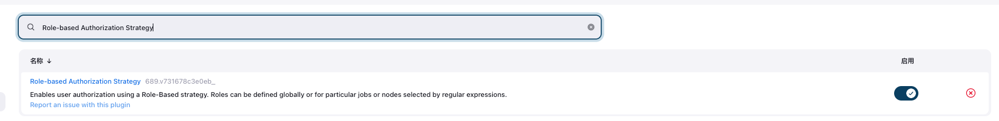

## Jenkins

- 持续集成及Jenkins介绍
- Jenkins安装和持续集成环境配置
- Jenkins构建Maven项目
- Jenkins+Docker+SpringCloud微服务持续集成
- 基于Kubernetes/K8S构建Jenkins微服务持续集成平台

### 持续集成及Jenkins介绍

#### 软件生命周期

> 软件开发生命周期又叫做**SDLC**（Software Development Life Cycle），它是集合了计划、开发、测试和部署过程的集合

- 续期分析
- 设计
- 实现
- 测试
- 部署
- 维护

#### 瀑布模型

> 适用于小项目, 各个流程不可逆


#### 敏捷式开发

> 敏捷开发（Agile Development） 的核心是迭代开发（Iterative Development） 与 增量开发（Incremental Development） 。

##### 迭代开发

> 将一个大项目拆分为多个小项目, 每个小项目按标准的软件生命周期管理

##### 增量开发

> 按照功能划分迭代, 每一个迭代都会有可感知的新增功能

#### 持续集成

##### 什么是持续集成

> 持续集成（ Continuous integration ， 简称 CI ）指的是，频繁地（一天多次）将代码集成到主干或者说中央库, 之后工具会自动自动构建、测试和发布。
>
> **持续集成的目的，就是让产品可以快速迭代，同时还能保持高质量。**它的核心措施是，代码集成到主干之前，必须通过自动化测试。只要有一个测试用例失败，就不能集成。

- 提交

  > 流程的第一步，是开发者向代码仓库提交代码。所有后面的步骤都始于本地代码的一次提交（commit）。

- 测试（第一轮）

  > 代码仓库对commit操作配置了钩子（hook），只要提交代码或者合并进主干，就会跑自动化测试。

- 构建

  > 通过第一轮测试，代码就可以合并进主干，就算可以交付了。交付后，就先进行构建（build），再进入第二轮测试。所谓构建，指的是将源码转换为可以运行的实际代码，比如安装依赖，配置各种资源（样式表、JS脚本、图片）等等。

- 测试（第二轮）

- 部署

  > 过了第二轮测试，当前代码就是一个可以直接部署的版本（artifact）。将这个版本的所有文件打包（tar filename.tar * ）存档，发到生产服务器。

- 回滚

  > 一旦当前版本发生问题，就要回滚到上一个版本的构建结果。最简单的做法就是修改一下符号链接，指向上一个版本的目录。

##### 持续集成元素

- 自动化构建、编译、测试、部署工具
- 代码仓库
- 持续集成服务器


### 持续集成


#### GitLab搭建

- [gitLab官网](https://about.gitlab.com/)
- [私有gitLab安装](https://gitlab.cn/install/)
- [安装步骤](https://gitlab.cn/install/#centos-7)

##### 安装步骤-centos

- 安装相关依赖

  ```shell
  yum -y install policycoreutils openssh-server openssh-clients postfix
  ```

- 启动ssh服务&设置为开机启动

  ```shell
  systemctl enable sshd && sudo systemctl start sshd
  ```

- 设置postfix开机自启，并启动，postfix支持gitlab发信功能

  ```shell
  systemctl enable postfix && systemctl start postfix
  ```

- 开放ssh以及http服务，然后重新加载防火墙列表

  ```shell
  firewall-cmd --add-service=ssh --permanent
  firewall-cmd --add-service=http --permanent
  firewall-cmd --reload
  ```

- 安装gitlab

  ```shell
  rpm -i gitlab-ce-12.4.2-ce.0.el6.x86_64.rpm 
  ```

- 配置

  ```shell
  /etc/gitlab/gitlab.rb 
  
  external_url 'http://192.168.227.128:82'
  nginx['listen_port'] = 82
  ```

- 重载配置

  ```shell
  gitlab-ctl reconfigure
  gitlab-ctl restart
  ```

- 防火墙添加端口

  ```shell
  firewall-cmd --zone=public --add-port=82/tcp --permanent
  firewall-cmd --reload
  ```

- 登录

  > 首次登录需要套修改密码, 使用顶层用户root登录即可。


##### 安装-docker

- 拉镜像

  ```shell
  docker pull bitnami/gitlab-runner:16.2.1
  ```

- 启动容器

  ```shell
  docker run -d \
  -p 10008:80 \
  -p 10009:443 \
  -p 10010:22 \
  --name gitlab \
  -v /home/rolyfish/home/gitlab/etc/gitlab:/etc/gitlab \
  -v /home/rolyfish/home/gitlab/var/log/gitlab:/var/log/gitlab \
  -v /home/rolyfish/home/gitlab/var/opt/gitlab:/var/opt/gitlab \
  --privileged=true bitnami/gitlab-runner:16.2.1
  ```

- 

##### 安装-ubuntn

[教程地址](https://about.gitlab.com/install/#ubuntu)

- 安装必要依赖

  ```shell
  sudo apt-get update
  sudo apt-get install -y curl openssh-server ca-certificates tzdata perl
  
  # 电子邮件支持
  sudo apt-get install -y postfix
  ```

- 下载gitlab包并安装

  ```shell
  curl https://packages.gitlab.com/install/repositories/gitlab/gitlab-ee/script.deb.sh | sudo bash
  
  apt-get install gitlab-ee
  ```

- 编辑配置

  ```shell
  /etc/gitlab/gitlab.rb 
  
  external_url 'http://10.211.55.4:82'
  nginx['listen_port'] = 82
  ```

- 重载配置

  ```shell
  gitlab-ctl reconfigure
  
  gitlab-ctl start
  ```

- 查看初始密码并登录修改密码

  ```shell
  cat /etc/gitlab/initial_root_password
  ```

  

- 基本命令

  ```shell
  # Start all GitLab components
  sudo gitlab-ctl start
  # Stop all GitLab components
  sudo gitlab-ctl stop
  # Restart all GitLab components
  sudo gitlab-ctl restart
  ```

  

##### 设置

###### 关闭用户注册

> setting>general 下的Sign-up restrictions


>  管理员同意


##### 添加组、用户、项目

###### 创建用户组

> 使用管理员 root 创建组,一个组里面可以有多个项目分支，可以将开发添加到组里面进行设置权限，不同的组就是公司不同的开发项目或者服务模块，不同的组添加不同的开发即可实现对开发设置权限的管理


###### 创建项目


###### 创建用户

> 登录邮箱设置密码


###### group添加成员

> 邀请成员


> 权限

- Guest： 游客， 可以发布issue、发布评论、不可以拉代码
- Reporter：可以克隆代码，不能提交，QA\PM 可以赋予这个权限
- Developer：克隆代码、开发、提交。 普通开发赋予这个权限
- Maintainer：核心开发，创建项目、添加tag、保护分支、添加成员、编辑项目
- Owner：项目拥有者

##### 上传项目

- 开启版本控制

  ```shell
  git init
  ```

  

- 创建gitignore文件

  > [java.gitignore](https://github.com/github/gitignore/blob/main/Java.gitignore)

  ```shell
  touch .gitignore
  ```

- 提交本地暂存区

  ```shell
  git add .
  ```

- 提交到本地仓库

  ```shell
  git commit -m "首次提交"
  ```

- 关联远程仓库

  ```shell
  git remote add 仓库名称 仓库地址
  
  git remote add test http://10.211.55.4:82/root_roup/test.git
   
  -- 查看远程仓库信息
  git remote 
  git remote -v
  ```

- 提交远程仓库

#### Jenkins安装-ubuntn

##### jdk安装

- 安装jdk

  ```shell
  sudo apt install openjdk-17-jdk
  
  java -version
  ```

- jdk版本管理

  ```shell
  sudo update-alternatives --config java
  ```

- 配置环境变量

  ```shell
  # 查看jdk安装路径
  sudo update-alternatives --config java
  vim /etc/environment
  
  ===
  export JAVA_HOME=/usr/lib/jvm/java-17-openjdk-arm64
  export JRE_HOME=${JAVA_HOME}/jre  
  export CLASSPATH=.:${JAVA_HOME}/lib:${JRE_HOME}/lib  
  export PATH=${JAVA_HOME}/bin:$PATH
  ===
  
  source /etc/environment
  ```

##### jenkins安装


#### Jenkins安装


##### jdk安装

> Jenkins需要依赖JDK，所以先安装JDK1.8。
>
> 除了手动安装外  也可以 yum install 一键安装

- 下载jdku压缩包

- 解压 

  ```shell
  tar -zxvf jdk-11.0.19_linux-x64_bin.tar.gz -C /usr/bin
  ```

- 配置环境

  ```shell
  sudo vim /etc/profile
  ```

  ```shell
  export JAVA_HOME=/usr/bin/jdk-11.0.19
  export PATH=$JAVA_HOME/bin:$PATH
  export CLASSPATH=.:$JAVA_HOME/lib/dt.jar:$JAVA_HOME/lib/tools.jar
  ```
  
- 测试jdk环境

  ```shell
  source /etc/profile
  java -version
  ```


##### Jenkins安装

- 下载rpm或使用yum工具
-  [jenkins下载清华镜像](https://mirrors.tuna.tsinghua.edu.cn/jenkins/redhat-stable/)
- 安装
  - `  rpm -ivh jenkins-2.401.3-1.1.noarch.rpm`

- 配置

  ```shell
  vim /etc/sysconfig/jenkins
  ```

  ```shell
  JENKINS_PORT="8888"
  JENKINS_USER="root"
  ```

- 启动

  ```shell
  systemctl start jenkins
  ```

- 如果存在jdk版本问题

  ```shell
   vim /etc/init.d/jenkins
  
  systemctl daemon-reload
  ```

- 按提示完成安装

- 获取初始化密码

  ```shell
  cat /var/lib/jenkins/secrets/initialAdminPassword
  ```

- 跳过插件安装

- 创建管理员账户

  

##### Jenkins插件按安装

> Jenkins本身不提供很多功能，我们可以通过使用插件来满足我们的使用。例如从Gitlab拉取代码，使用Maven构建项目等功能需要依靠插件完成。接下来演示如何下载插件。

管理插件.


###### 修改配置

```shell
cd  /var/lib/jenkins/updates

-- 替换jenkins默认配置
sed -i 's/http:\/\/updates.jenkins-ci.org\/download/https:\/\/mirrors.tuna.tsinghua.edu.cn\/jenkins/g' default.json && sed -i  's/http:\/\/www.google.com/https:\/\/www.baidu.com/g' default.json


sed -i 's//-/g' default.json
```


##### docker安装-ubuntn

[文档](https://github.com/jenkinsci/docker/blob/master/README.md)

```shell
docker pull jenkins/jenkins:jdk17
docker run -p 8080:8080 -p 50000:50000 --restart=on-failure -v jenkins_home:/var/jenkins_home jenkins/jenkins:lts-jdk11


mkdir -p /home/rolyfish/home/jenkins/jenkins_home
docker run \
  --name jenkins-jdk17 \
  -p 8898:8080 \
  -p 50000:50000 \
  -v /home/rolyfish/home/jenkins/jenkins_home:/var/jenkins_home \
  -d jenkins/jenkins:jdk17

# 查看初始密码
cat /home/rolyfish/home/jenkins/jenkins_home/secrets/initialAdminPassword
```

- 插件安装  选择 无

- 创建第一个用户

  

- 修改配置

  ```shell
  Managejenkins> Plugins 点击Advanced setting  修改 update site
  
  https://mirrors.tuna.tsinghua.edu.cn/jenkins/updates/update-center.json
  ```

 - 安装汉化插件

   Manage Jenkins-> Plugins，点击Available plugins ，搜索"Chinese"

   

   重启jenkins

##### 用户权限管理

###### 用户管理

> 利用`Role-based Authorization Strategy`插件帮忙管理用户



###### 开启安全策略

> 开启全局安全策略


###### 创建角色

> 创建角色


###### 创建用户

> 创建用户绑定角色


###### 创建项目

> 创建项目绑定角色

> 使用管理员账户创建项目`item1`和`item2`。 
>
> lizicheng role1能看见 item1  。yuyanchuang  role2能看见item2


##### 凭证管理

> 凭据用于管理需要密文存储的第三方账户密码, 方便Jenkins与第三方应用交互, 比如GitLab、数据库、Docker等。

###### 安装**Credentials Binding**插件

> 插件安装成功后多出`凭据配置`


- Username with password：用户名和密码
- SSH Username with private key： 使用SSH用户和密钥
- Secret file：需要保密的文本文件，使用时Jenkins会将文件复制到一个临时目录中，再将文件路径设置到一个变量中，等构建结束后，所复制的Secret file就会被删除。
- Secret text：需要保存的一个加密的文本串，如钉钉机器人或Github的api token
- Certificate：通过上传证书文件的方式


###### 安装git插件&git工具

> 安装git插件


> 安装git工具。容器内如果自带就不用安装

```shell
apt-get install git

# 查看结果
git --version
```


###### 用户密码凭证

> 创建凭证


> 测试凭证。创建项目，使用凭证登录gitlab，测试凭证。


> 点击立即构建，查看控制台输出。
>
> 查看挂载目录即可发现代码已拉到本地


###### SSH凭证

> gitlab存公钥, jenkin存私钥。
>
> 注意：公钥私钥在docker容器内生成

- 生成密钥

  ```shell
  docker exec -it jenkins-docker /bin/bash
  
  ssh-keygen -t rsa
  ```

  

- 公钥放入gitlab

  > gitlab ---> 头像 ----> SSHKEY

- 私钥配置在jenkins凭证中

  

  出错添加配置

  

- 测试


#### maven安装

- [下载压缩包](https://maven.apache.org/download.cgi)

- 解压

  ```shell
  mkdir /opt/maven
  tar -zxvf apache-maven-3.6.2-bin.tar.gz -C  /home/rolyfish/home/jenkins/data
  ```

- 配置环境变量

  ```shell
  export MAVEN_HOME=/opt/maven
  export PATH=$PATH:$MAVEN_HOME/bin
  ```

  docker内没装vi，使用`cat 1.txt >> /etc/profile`

- 检查

  ```shell
  mvn -v
  ```

- Jenkins配置maven

  

- 添加全局变量

  

- 新建仓库

  ```shell
  mkdir maven_repo
  ```

- 修改配置i

  ```shell
  vim ./maven/conf/settings.xml
  
  # 本地仓库
  <localRepository>/var/jenkins_home/maven_repo</localRepository>
  
  # maven镜像
  <mirror>
      <id>nexus-aliyun</id>
      <mirrorOf>*,!jeecg,!jeecg-snapshots</mirrorOf>
      <name>Nexus aliyun</name>
      <url>http://maven.aliyun.com/nexus/content/groups/public/</url>	
  </mirror>
  ```


##### 测试maven

> 增加构建步骤


> 控制台输出


> 本地maven仓库检查


### 持续集成


#### GitLab搭建


