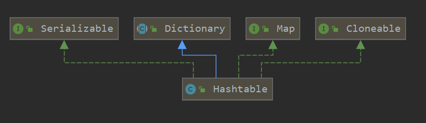
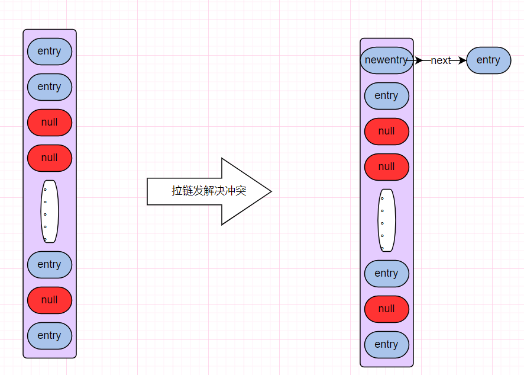

本文学习HashTable，这是一个古老类，基本上被废除，但是学习它有助于理解HashMap。


### 简介

HashTable是一个key-value键值对的数据类型，较为古老，使用synchronized保证同步，效率较低，现在基本已被淘汰，单线程转为使用HashMap，多线程使用ConcurrentHashMap。


### 继承关系

继承Dictionary类，实现Map接口。




### 原理

> hashTable的原理和hashMap大致相同。在一些算法和设计方面，hashTable比hashMap低下。

#### 属性

```java
//节点数组
private transient Entry<?,?>[] table;
//节点个数
private transient int count;
//临界值
private int threshold;
//加载因子  0.75
private float loadFactor;
//模数，hashTable被修改的次数
private transient int modCount = 0;
```


#### 插入元素

- 当key值重复，就覆盖并返回旧的value
- 当key值不重复，直接插入。如果出现冲突，拉链发解决

一、(hash & 0x7FFFFFFF) % tab.length;

取余操作，获取散列下标，相比于hashMap的一次位运算，这里效率很低。

这里巧妙在于，与0x7FFFFFFF进行与运算，避免负数的出现

```java
public synchronized V put(K key, V value) {
    // Make sure the value is not null
    //不允许插入null值
    if (value == null) {
        throw new NullPointerException();
    }
    // Makes sure the key is not already in the hashtable.
    Entry<?,?> tab[] = table;
    //这里并没有对key进行为空检测，是不合理的
    int hash = key.hashCode();
    //hash值与0x7FFFFFFF按位与，防止出现负数。
    //与tab.length做取余操作，得到散列下标
    int index = (hash & 0x7FFFFFFF) % tab.length;
    @SuppressWarnings("unchecked")
    Entry<K,V> entry = (Entry<K,V>)tab[index];
    //不为空
    for(; entry != null ; entry = entry.next) {
        //出现重复则覆盖
        if ((entry.hash == hash) && entry.key.equals(key)) {
            V old = entry.value;
            entry.value = value;
            return old;
        }
    }
	//出现冲突、或对应下标节点为空，插入元素
    addEntry(hash, key, value, index);
    return null;
}
```

> addEntry方法

如果节点个数超过临界值，就扩容。

否则直接插入元素，或拉链法解决冲突

```java
private void addEntry(int hash, K key, V value, int index) {
    modCount++;

    Entry<?,?> tab[] = table;
    if (count >= threshold) {
        // Rehash the table if the threshold is exceeded
        rehash();

        tab = table;
        hash = key.hashCode();
        index = (hash & 0x7FFFFFFF) % tab.length;
    }

    // Creates the new entry.
    @SuppressWarnings("unchecked")
    Entry<K,V> e = (Entry<K,V>) tab[index];
    tab[index] = new Entry<>(hash, key, value, e);
    count++;
}
```

> rehash()方法

这里的扩容方法，只是简单的将节点散列到新的数组上，并没有做将链表变短的操作。

```java
protected void rehash() {
    int oldCapacity = table.length;
    Entry<?,?>[] oldMap = table;

    // overflow-conscious code
    int newCapacity = (oldCapacity << 1) + 1;
    if (newCapacity - MAX_ARRAY_SIZE > 0) {
        if (oldCapacity == MAX_ARRAY_SIZE)
            // Keep running with MAX_ARRAY_SIZE buckets
            return;
        newCapacity = MAX_ARRAY_SIZE;
    }
    Entry<?,?>[] newMap = new Entry<?,?>[newCapacity];

    modCount++;
    threshold = (int)Math.min(newCapacity * loadFactor, MAX_ARRAY_SIZE + 1);
    table = newMap;

    for (int i = oldCapacity ; i-- > 0 ;) {
        //i下标对单向链表
        for (Entry<K,V> old = (Entry<K,V>)oldMap[i] ; old != null ; ) {
            Entry<K,V> e = old;
            old = old.next;
			//获取节点新下标
            int index = (e.hash & 0x7FFFFFFF) % newCapacity;
            //链接起来
            e.next = (Entry<K,V>)newMap[index];
            newMap[index] = e;
        }
    }
}
```


>  拉链发解决冲突图示：




### hashTable & hashMap

- 线程安全：HashMap是非线程安全的类，多线程环境下存在并发问题，单线程下效率较高；HashTable是线程安全的类，使用synchronized保证同步，但同时因为加锁导致并发效率低下，单线程环境效率也十分低；

- 插入null：HashMap允许有一个key为null，允许多个value为null；但HashTable不允许key或value为null；

- 容量：HashMap容量（数组长度）必须为2的幂，默认为16；而HashTable底层数组长度可以为任意值，默认为11；

- 哈希算法：HashMap通过扰动函数，重新计算哈希值，降低哈希冲突。HashTable则使用的原始哈希值，在遇到较为糟糕的哈希算法时，容易出现冲突。