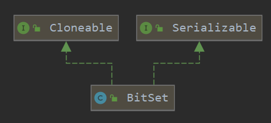
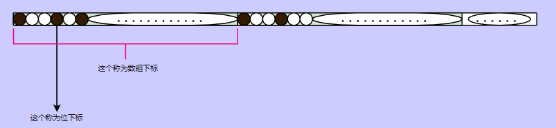
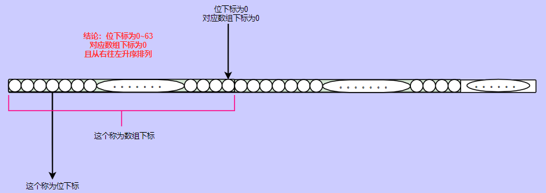
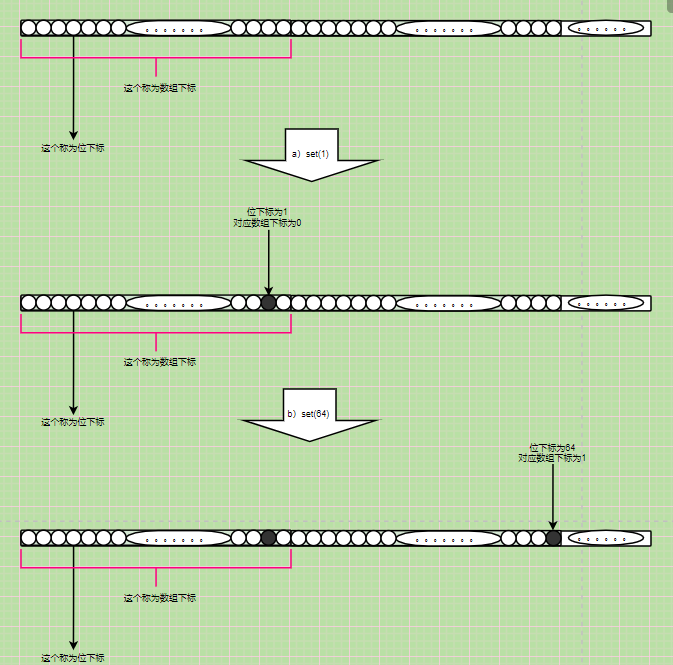
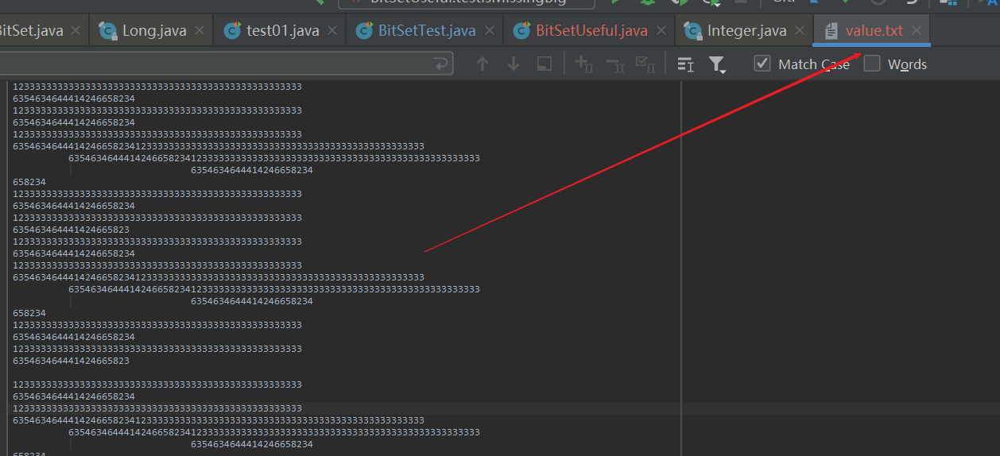
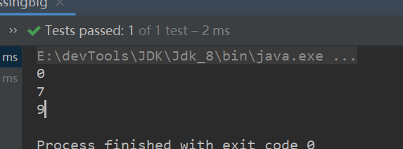

BitSet


### 简介

​	BitSet（位集）用来存储位信息，每一位只有两种状态0或1，即true或false。位信息存储于字节里，所以相较于使用数组或List来true或false来的高效。

​	由于java中没有提供位相关的数据类型，所以得借助int或long结合合适算法来表示。BitSet底层维护了一个long类型数组，每一个long可以表示64个位信息，所以BitSet得最小size为64。BitSet可以动态扩容，每次扩充2倍，最终由N个long来组成BitSet。

​	查看BitSet类图，其并不属于集合框架，没有实现List或Map或者Set接口。



<hr>

### 属性

```java
//底层是long类型数组，右移6位定位到数组下标
private final static int ADDRESS_BITS_PER_WORD = 6;
//一个long可以表示64位
private final static int BITS_PER_WORD = 1 << ADDRESS_BITS_PER_WORD;
//位信息，再long中的下标
private final static int BIT_INDEX_MASK = BITS_PER_WORD - 1;
//掩码，数组下标定位位下标
private static final long WORD_MASK = 0xffffffffffffffffL;
//数组
private long[] words;
//数组长度。（最大位信息存储于long数组的下标）
private transient int wordsInUse = 0;
//是否自定义位集size
private transient boolean sizeIsSticky = false;
```


<hr>

### 构造器

```java
//无参构造，默认位集size为64、数组长度为1.
public BitSet() {
    initWords(BITS_PER_WORD);
    sizeIsSticky = false;
}
//自定义位集长度
public BitSet(int nbits) {
    if (nbits < 0)
        throw new NegativeArraySizeException("nbits < 0: " + nbits);
    initWords(nbits);
    sizeIsSticky = true;
}
//
private BitSet(long[] words) {
    this.words = words;
    this.wordsInUse = words.length;
    checkInvariants();
}
```


<hr>


接下来我们约定一下：



### set方法

#### set(index)

> 将对应位下标的位信息设置为true，1。

```java
//参数：位下标
public void set(int bitIndex) {
    //计算位下标对应数组下标
    int wordIndex = wordIndex(bitIndex);
    //更新wordInUse、必要时扩容
    expandTo(wordIndex);
    //修改对应位下标值为1
    words[wordIndex] |= (1L << bitIndex);
    checkInvariants();
}
```

wordIndex方法

> 计算位下标对应数组下标
>
> 只有一个移位操作，右移6位


```java
private static int wordIndex(int bitIndex) {
    return bitIndex >> ADDRESS_BITS_PER_WORD;
}
```

expandTo

> 更新wordInUse、扩容

```java
private void expandTo(int wordIndex) {
    int wordsRequired = wordIndex+1;
    if (wordsInUse < wordsRequired) {
        ensureCapacity(wordsRequired);
        wordsInUse = wordsRequired;
    }
}
```


***<u>主要的看一下这个位运算：words[wordIndex] |= (1L << bitIndex);</u>***

> wordIndex怎么算的

位下标右移动6位，也就是除64取余。

|       位下标       | 数组下标 |
| :----------------: | :------: |
|     【0，63】      |    0     |
|    【64，127】     |    1     |
| 【64n，64(n+1)-1】 |    n     |



> 1L << bitIndex

- 1L 是long类型，long占8个字节，64位
- 1L << bitIndex其实可以写成：1L << (bitIndex%64) 或 1L << (bitIndex&(64-1))

因为：

```java
@Test
public void test(){
    int intX = 32;
    int longX = 64;
    System.out.println((1L >> 64)+"等价于"+ (1L >> (64 & longX-1)));
    System.out.println((1L >> 65)+"等价于"+ (1L >> (65 & longX-1)));
    System.out.println((1L >> 66)+"等价于"+ (1L >> (66 & longX-1)));

}
```

> 举一些例子。bitSet假设为初始状态。

a）执行set(1)

​	位下标为：1

​	数组下标，计算得来的wordIndex为：0

​	计算words[wordIndex] |= (1L << bitIndex)：结果为  0000 | 0010   = 0010

​	也就是words[0] = 2

b）执行set(64)

​	位下标为：64

​	数组下标，计算得来的wordIndex为：1

​	计算words[wordIndex] |= (1L << bitIndex)：结果为  0000 | 0001   = 0001

​	也就是words[1] = 1




<hr>


#### set(index,boolean)

> 修改指定位下标的状态（true--> 1，false---> 0）

由于set（bitIndex）是或运算，所以对于原先处于1的状态不会被改变。

```java
public void set(int bitIndex, boolean value) {
    if (value)
        set(bitIndex);
    else
        clear(bitIndex);
}
```


#### set(fromIndex, toIndex)

> 将位下标在【fromIndex，toIndex）之间的所有位信息变为1，也就是true。

```java
public void set(int fromIndex, int toIndex) {
    checkRange(fromIndex, toIndex);
    if (fromIndex == toIndex)
        return;
    // Increase capacity if necessary
    //获取对应数组下标
    int startWordIndex = wordIndex(fromIndex);
    int endWordIndex   = wordIndex(toIndex - 1);
    expandTo(endWordIndex);
	//掩码。fromIndex之前的为0，之后的为1
    long firstWordMask = WORD_MASK << fromIndex;
    //掩码。toIndex之后的不管，之前的为1
    long lastWordMask  = WORD_MASK >>> -toIndex;
    //数组下标相等，修改同一个long
    if (startWordIndex == endWordIndex) {
        words[startWordIndex] |= (firstWordMask & lastWordMask);
    } else {
        //startWordIndex下标对应long处，将fromIndex及其之后的位修改为true
        words[startWordIndex] |= firstWordMask;
        // Handle intermediate words, if any
        for (int i = startWordIndex+1; i < endWordIndex; i++)
            words[i] = WORD_MASK;
        // Handle last word (restores invariants)
        words[endWordIndex] |= lastWordMask;
    }
    checkInvariants();
}
```

举个例子：

a）set(5,10)

​	计算数组下标：startWordIndex = endWordIndex = 0

​	计算对应掩码：firstWordMask = 59个1+5个0。lastWordMask = 54个0+10个1

​	修改位信息：数组下标相等，54个0+5个1+5个0

​	这样就将位下标为：5，10的状态修改为true

b）set(5,80)

​	计算数组下标：startWordIndex = 0  。endWordIndex = 1

​	计算对应掩码：firstWordMask = 59个1+5个0。lastWordMask = 48个0+16个1

​	修改位信息：数组下标不相等

		-  fromIndex对应下标long之后的都修改为1，之前的保持原样
		-  toIndex对应下标long之前的都修改为1，之后的保持原样


> 这里有一个无符号右移负数位

16进制的右移-2 等价于 右移 62

右移-n   等价于  右移动 （-n % 64） 等价于  64+（-n % 64）

下面两个结果是等价的。

```java
System.out.println(0xffffffffffffffffL >>> -2);
System.out.println(0xffffffffffffffffL >>> 62);
```

<hr>


### clear方法

> 修改符合的位为0

#### clear（index）

> 修改bitIndex位下标对应位信息为0.

`~`这个符号为按位取反。

即将位下标为bitIndex的设置为false，其余的不动。

```java
public void clear(int bitIndex) {
    if (bitIndex < 0)
        throw new IndexOutOfBoundsException("bitIndex < 0: " + bitIndex);
    int wordIndex = wordIndex(bitIndex);
    if (wordIndex >= wordsInUse)
        return;
    words[wordIndex] &= ~(1L << bitIndex);
    recalculateWordsInUse();
    checkInvariants();
}
```


#### clear(fromIndex, toIndex)

> 与set(fromIndex, toIndex)同理


#### clear() 

> 整个位集设置为0

```java
public void clear() {
    while (wordsInUse > 0)
        words[--wordsInUse] = 0;
}
```


<hr>


### get()反法


#### get(bitIndex)

> 获取对应位下标位信息。0---false、1----true

```java
public boolean get(int bitIndex) {
    if (bitIndex < 0)
        throw new IndexOutOfBoundsException("bitIndex < 0: " + bitIndex);
    checkInvariants();
    int wordIndex = wordIndex(bitIndex);
    return (wordIndex < wordsInUse)
        && ((words[wordIndex] & (1L << bitIndex)) != 0);
}
```


#### get(fromIndex, toIndex)

> 将位下标在【fromIndex, toIndex】之间的所有位信息封装成一个BitSet返回。


### 其他方法


#### NextSetBit（index）

>  返回fromIndex的下一个为1的位下标。包括fromIndex

```java
public int nextSetBit(int fromIndex)
```

```java
public void testNextSetBit(){
    BitSet bitSet = new BitSet();
    bitSet.set(10);
    bitSet.set(5);
    System.out.println("//0 -4  下一个为5");
    System.out.println(bitSet.nextSetBit(0));
    System.out.println(bitSet.nextSetBit(1));
    System.out.println(bitSet.nextSetBit(2));
    System.out.println(bitSet.nextSetBit(3));
    System.out.println(bitSet.nextSetBit(4));
    System.out.println(bitSet.nextSetBit(5));
    System.out.println("//6 -9  下一个为10");
    System.out.println(bitSet.nextSetBit(6));
    System.out.println(bitSet.nextSetBit(7));
    System.out.println(bitSet.nextSetBit(8));
    System.out.println(bitSet.nextSetBit(9));
}
```


#### nextClearBit(fromIndex)

> 返回fromIndex的下一个为0的位下标。包括fromIndex

```
public int nextClearBit(int fromIndex)
```

```java
/**
 * 测试nextClearBit
 */
@Test
public void testNextClearBit(){
    BitSet bitSet = new BitSet();
    bitSet.set(10);
    bitSet.set(5);
    bitSet.set(6);
    bitSet.set(7);
    bitSet.set(8);
    System.out.println("5下一个为0   的是9");
    System.out.println(bitSet.nextClearBit(0));
    System.out.println(bitSet.nextClearBit(5));
}
```


#### previousSetBit（index）

> 返回fromIndex的上一个为1的位下标。包括fromIndex

```java
public int previousSetBit(int fromIndex)
```


#### previousClearBit（index）

> 返回fromIndex的上一个为0的位下标。包括fromIndex

```java
public int previousClearBit(int fromIndex)
```


#### length()

> 返回位集长度

不是数组长度，是有效位数

```java
public int length() {
    if (wordsInUse == 0)
        return 0;
    return BITS_PER_WORD * (wordsInUse - 1) +
        (BITS_PER_WORD - Long.numberOfLeadingZeros(words[wordsInUse - 1]));
}
```


#### isEmpty()

> 位集是否为空

```java
public boolean isEmpty() {
    return wordsInUse == 0;
}
```


#### intersects（BitSet）

> 位集是否相交

```java
public boolean intersects(BitSet set) {
    for (int i = Math.min(wordsInUse, set.wordsInUse) - 1; i >= 0; i--)
        if ((words[i] & set.words[i]) != 0)
            return true;
    return false;
}
```


#### cardinality

> 返回位集中状态为1的总个数。

```java
public int cardinality() {
    int sum = 0;
    for (int i = 0; i < wordsInUse; i++)
        sum += Long.bitCount(words[i]);
    return sum;
}
```


#### and(BitSet)

> 两个位集做与操作。

```java
public void and(BitSet set) {
    if (this == set)
        return;
    //wordsInUse之后的设为0
    while (wordsInUse > set.wordsInUse)
        words[--wordsInUse] = 0;
    //0 - wordsInUse-1  做与操作
    for (int i = 0; i < wordsInUse; i++)
        words[i] &= set.words[i];
    recalculateWordsInUse();
    checkInvariants();
}
```


#### or(BitSet) 

> 两个位集做或操作。

```java
public void or(BitSet set) {
    if (this == set)
        return;
    int wordsInCommon = Math.min(wordsInUse, set.wordsInUse);
    if (wordsInUse < set.wordsInUse) {
        ensureCapacity(set.wordsInUse);
        wordsInUse = set.wordsInUse;
    }
    //做或操作
    for (int i = 0; i < wordsInCommon; i++)
        words[i] |= set.words[i];
    //多的拷贝过来
    if (wordsInCommon < set.wordsInUse)
        System.arraycopy(set.words, wordsInCommon,
                         words, wordsInCommon,
                         wordsInUse - wordsInCommon);
    checkInvariants();
}
```


#### xor(BitSet)

> 两个位集做异或操作。

```java
public void xor(BitSet set) {
    int wordsInCommon = Math.min(wordsInUse, set.wordsInUse);
    if (wordsInUse < set.wordsInUse) {
        ensureCapacity(set.wordsInUse);
        wordsInUse = set.wordsInUse;
    }
    for (int i = 0; i < wordsInCommon; i++)
        words[i] ^= set.words[i];
    if (wordsInCommon < set.wordsInUse)
        System.arraycopy(set.words, wordsInCommon,
                         words, wordsInCommon,
                         set.wordsInUse - wordsInCommon);
    recalculateWordsInUse();
    checkInvariants();
}
```


#### andNot(BitSet）

> 清除此 `BitSet` 中所有的位其相应的位在指定的 `BitSet` 中已设置。
>
> bitSet先取反，再做与操作。  即我有你没有（1）、我有你也有（0）、我没有你有没有都没用

```java
public void andNot(BitSet set) {
    // Perform logical (a & !b) on words in common
    for (int i = Math.min(wordsInUse, set.wordsInUse) - 1; i >= 0; i--)
        words[i] &= ~set.words[i];
    recalculateWordsInUse();
    checkInvariants();
}
```


#### size()

> 不是数组大小，是位集大小

```java
public int size() {
    return words.length * BITS_PER_WORD;
}
```


### 用处


#### 统计一组数据中未出现的数据

> 其实可以使用双重循环来解决，从空间利用率和时间效率来看都不如BitSet优秀。

```java
@Test
public void testIsMissing() {

    int[] values = new int[]{1, 1, 2, 3, 3, 4, 4, 6, 9, 4, 4, 4, 5};
    BitSet bitSet = new BitSet();

    for (int value : values) {
        bitSet.set(value);
    }

    for (int i = 0; i < 10; i++)
        if (!bitSet.get(i))
            System.out.println(i);
}
```

> 对于大数据优势就更大

```java
/**
 * 计算一组数据中未出现的数,数据量大一点
 */
@Test
public void testIsMissingBig() throws IOException {

    String root = System.getProperty("user.dir");
    String fPath = root + "/file";
    String fName = "value.txt";
    BitSet bitSet = new BitSet();

    FileReader fileReader = new FileReader(new File(fPath, fName));

    File file = new File(fPath, fName);

    char[] buffer = new char[1024];
    int length = 0;
    while ((length = fileReader.read(buffer)) != -1) {

        for (int i = 0; i < length; i++) {
            if (buffer[i]>= '0' && buffer[i]<='9')
                bitSet.set(Integer.parseInt(buffer[i]+""));
        }
    }
    for (int i = 0; i < 10; i++)
        if (!bitSet.get(i))
            System.out.println(i);
}
```

这个文件包含的数字还是很多的，结果可以通过ctrl+F检查。







#### 对大数据进行排序

> BitSet  set的时候就是有序的，体现于数组下标递增。

现有一个需求，对下面的文件内容以四位四位进行排序：

```txt
15423127887657314125111245645678970301007085423100103203020310123123141
251124287739412410213012030100023100103203020345687783100103203020310123123141
2511247542642341241021301203010002310010320302031012312314564564564564654564
42341241000415423127887657314125111245645678970301007085423100103203020310123123141
2511242877394124102130120301000231001032030203456877831001032030203101231231412511247542642341241021301203010002310010320302031012312314564564564564654564
42341241000456320302045454310123123144000213012456903010002314500115423127887657314125111245645678970301007085423100103203020310123123141
251124287739412410213012030100023100103203020345687783100103203020310123123141
25112415423127887657314125111245645678972511241542312788765731412511124564567897
030100708542310010320302031012312314125112428773941241021301203010002310010
32030203456877831001032030203101231231412511247542642341241021301203010002310010
3203020310123123145645645645646545644234124100045632030204545431012312314400021301245690301000231450010320302031124556524545464030100023100103203020310123123141
2511242341241021301203010002310010320302044310123123140123123141
25112423412410213012030100402310010320302031014423123141251124234124102112
03010002310010320302031012312314125112445452341241021301203010002310010
320302045454310123123147542642341241021301203010002310010320302031012312314564564564564654564030100023100103203020310123123141
42341241000456320302045454310123123144000213012456903010002314500103203020311245565245
45464030100023100103203020310123123141
2511242341241021301203010002310010320302044310123123140123123141
25112423412410213012030100402310010320302031014423123141251124234124102112
251124454523412410213012030100023100103203020454543101231231403203020311245565245
454640301000231001032030203101231231412511242341241021301203010002310010
```

我们只需要读出来，放入bitSet，直接输出即可。

```java
@Test
public void sort() throws IOException {
    String root = System.getProperty("user.dir");
    String fPath = root + "/file";
    String fName = "value2.txt";
    BitSet bitSet = new BitSet();
    File file = new File(fPath, fName);

    BufferedReader br = new BufferedReader(new FileReader(file));
    String buffer = "";
    while (!ObjectUtils.isEmpty(buffer = br.readLine())) {
        System.out.println(buffer);
        for (int i = 0; i < buffer.length() / 4; i++) {
            bitSet.set(Integer.parseInt(buffer.substring(4 * i, 4 * i + 4)));
        }
        bitSet.set(Integer.parseInt((buffer.substring((buffer.length() / 4) * 4) + "00000").substring(0, 4)));
    }
    System.out.println(bitSet);
}
```


#### 对大数据压缩存储

> 假设有一个ArrayList 里面存储着200万个不重复int类型数据，就算每一个元素战16bytes，那么就是 200WX16X8，数据量还是很大的。
>
> 而使用BitSet，每一位表示一个int，即便存在空间浪费，对比起来空间和时间效率都是极高的。


#### 大数据去重复

> 直接放入BitSet，再遍历它得到的就是去重后的结果。