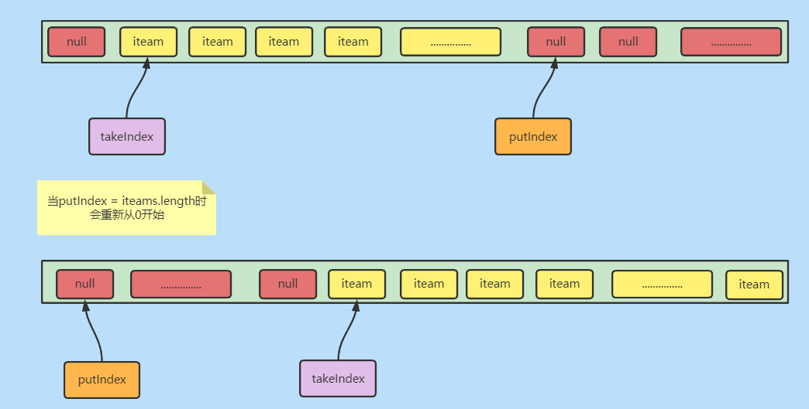
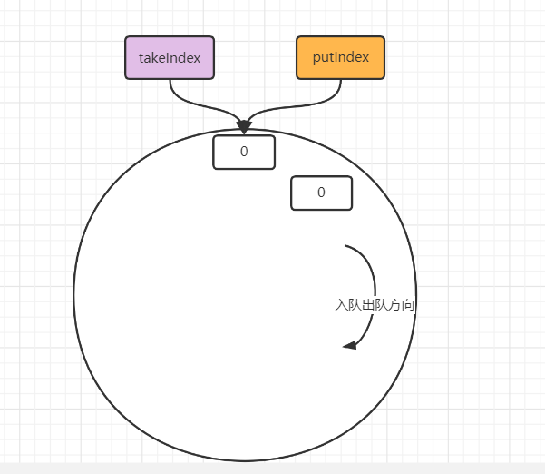

本文学习一个同步、阻塞、有界、循环队列------ArrayBlockingQueue。


> [xxx]()


### 简介

​	ArrayBlockingQueue虽不是一个常用的同步队列，但对于后面对于其他同步容器的理解是有益处的。-

- 其内部维护了一个对象数组用于存储数据

- 通过两个int值：takeIndex、putIndex来记录获取和存放元素的下标

- 使用ReenTrantLock来实现同步。默认非公平锁，可自定义公平锁。

- 使用两个Condition：notEmpty、notFull。分别来处理

  ①当数组长度为空时，进行获取元素操作的线程加入等待队列 

  ②当数组满了，进行添加元素操作加入等待队列


<hr>


### 属性

```java
//使用对象数组保存元素
final Object[] items;
//items index for next take, poll, peek or remove
//下一个执行 take, poll, peek or remove操作元素的下标
int takeIndex;
// items index for next put, offer, or add 
//下一个执行put, offer, or add 操作的元素下标
int putIndex;
//队列元素个数
int count;
//重入锁，默认非公平
final ReentrantLock lock;
//当数组为空时，执行获取元素操作的线程进入等待队列
private final Condition notEmpty;
//当数组满了时，执行添加元素操作的线程进入等待队列
private final Condition notFull;
```


<hr>


### 构造器

> ArrayBlockingQueue的三个构造器都是有初始容量的，并且没有扩容操作，所以说是`有界`的。

```java
//自定义队列容量(对象数组长度)
public ArrayBlockingQueue(int capacity) {
    this(capacity, false);
}
//自定义队列容量(对象数组长度)，自定义是否为公平锁
public ArrayBlockingQueue(int capacity, boolean fair) {
    if (capacity <= 0)
        throw new IllegalArgumentException();
    this.items = new Object[capacity];
    lock = new ReentrantLock(fair);
    notEmpty = lock.newCondition();
    notFull =  lock.newCondition();
}
//自定义队列容量(对象数组长度)，自定义是否为公平锁，并初始化对象数组
//会报出数组下标溢出异常
public ArrayBlockingQueue(int capacity, boolean fair,
                          Collection<? extends E> c) {
    this(capacity, fair);
    final ReentrantLock lock = this.lock;
    lock.lock(); 
    try {
        int i = 0;
        try {
            for (E e : c) {
                checkNotNull(e);
                items[i++] = e;
            }
        } catch (ArrayIndexOutOfBoundsException ex) {
            throw new IllegalArgumentException();
        }
        count = i;
        putIndex = (i == capacity) ? 0 : i;
    } finally {
        lock.unlock();
    }
}
```


<hr>


### 基本状态的方法

```java
//获取队列元素个数
public int size();
//获取队列剩余容量
public int remainingCapacity();
//队列是否包含某个元素
public boolean contains(Object o);
//清除队列。
public void clear();
================以下方法不提供外部使用===============
//获取对应下标 元素
E itemAt(int i);
//移除对应下标 元素
void removeAt(final int removeIndex);
```

clear方法会将队列内元素置为null，takeIndex指向putindex（相当于初始化时两个都是0），当队列size没有达到数组长度时，putindex已经移动到items.length-1处，此刻putIndex会置为0，也就是循环队列。


<hr>


### 添加元素


- add()方法

  > 会调用offer方法，添加失败会抛出异常。

- offer

  > 添加失败返回false。添加成功返回true，移动putIndex

- put方法

  - 获取的是可响应中断锁。
  - 如果队列满了，当前线程就会加入等待队列。
  - 存在一个超时时间重载

```java
//调用 offer(E e)方法
//这个add方法是AbstractQueue定义的，如果offer失败（返回false），抛出异常
public boolean add(E e) 
public boolean offer(E e) 
//①put失败会加入等待队列。②可响应中断
public void put(E e) throws InterruptedException
//添加超时时间，达到时间返回false
public boolean offer(E e, long timeout, TimeUnit unit)
    throws InterruptedException;
```


### 获取元素

- peek()      

  > 获取takeIndex下标对应元素。队列为空返回null。不会修改takeIndex。

  AbstractQueue定义的element()方法会调用peek()

- poll()        

  > 获取takeIndex下标对应元素。队列为空返回null。
  >
  > 会修改takeIndex。
  >
  > 并会唤醒notFull等待队列下的一个线程。
  >
  > 存在一个超时重载。重载方法，队列为空会加入notEmpty等待队列。

- take()

  > 获取takeIndex下标对应元素。
  >
  > 会修改takeIndex。
  >
  > 并会唤醒notFull等待队列下的一个线程。
  >
  > 队列为空会加入notEmpty等待队列。

```java
public E take() throws InterruptedException 

public E poll() 
    
public E poll(long timeout, TimeUnit unit) throws InterruptedException 

public E peek() 
```

严格意义上来讲上面三个方法只有peek()方法才是存粹获取队列元素，其余两个类似出队操作。


> 移除元素

会首先找到首个匹配元素的下标，调用removeAt(index)方法。

- 如果被移除元素下标为takeIndex的话，直接将iteams[++takeIndex] = null   

- 否则会以覆盖的形式移除元素（类似于ArrayCopy）

```java
public boolean remove(Object o)
```


### 简单结构

> 其实可以把它想象成一个环。






### 遍历方法

> 有10个勒，其实分类一下还是好理解的。
>
> collection接口下的集合遍历方法就有：
>
> - 增强for循环
> - 转数组普通for循环
> - Collection接口的stream的foreach
> - Iterable接口的foreach
> - 迭代器   hasNext  和  next
> - take(会等待)  & poll(不等待，为空返回nunll)   &poll的超时重载(也会等待)
> - 分离器

```java
public class ArrayBlockForeach {
    @Test
    public void testForeach() throws InterruptedException {
        /**
         * queue 是 collection的子接口
         */
        final StringBuffer sb = new StringBuffer();

        ArrayBlockingQueue<Object> queue = new ArrayBlockingQueue<Object>(20);

        for (int i = 0; i < 20; i++) {
            queue.add(i);
        }

        System.out.println("=======增强for循环========");
        for (Object obj : queue) {
            sb.append(obj + ", ");
        }
        mySout(sb);

        System.out.println("=======Collectio stream api========");
        queue.stream().forEach((obj) -> {
            sb.append(obj + ", ");
        });
        mySout(sb);

        System.out.println("=======Iterable foreach========");
        queue.forEach((obj) -> {
            sb.append(obj + ", ");
        });
        mySout(sb);

        System.out.println("=======迭代器========");
        Iterator<Object> iterator = queue.iterator();
        while (iterator.hasNext()) {
            sb.append(iterator.next() + ", ");
        }
        mySout(sb);

        System.out.println("=======toArray 转数组foreach========");
        Object[] objects = queue.toArray();
        for (int i = 0; i < objects.length; i++) {
            sb.append(objects[i] + ", ");
        }
        mySout(sb);

        //System.out.println("=======take========");
        //int size = queue.size();
        //while (size-- > 0) {
        //    sb.append(queue.take() + ", ");
        //}
        //mySout(sb);

        //System.out.println("=======poll  不会await========");
        //Object poll = null;
        //while ((poll = queue.poll()) != null) {
        //    sb.append(poll+", ");
        //}
        //mySout(sb);

        //System.out.println("=======分离器1========");
        //Spliterator<Object> spliterator = queue.spliterator();
        //while (spliterator.tryAdvance((obj) ->
        //        sb.append(obj + ", ")
        //)) ;
        //mySout(sb);

        System.out.println("=======分离器2========");
        Spliterator<Object> spliterator2 = queue.spliterator();
        spliterator2.forEachRemaining((obj) -> sb.append(obj + ", "));
        mySout(sb);
    }

    public void mySout(StringBuffer sb) {
        StringBuffer sbTemp = new StringBuffer("{");
        sb.deleteCharAt(sb.lastIndexOf(","));
        sb.append("}");
        sbTemp.append(sb);
        System.out.println(sbTemp.toString());
        sb.delete(0, sb.length());
    }

}
```