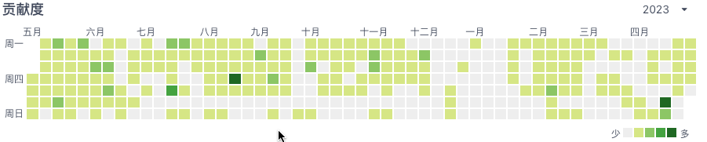

##### 求职简历 - java后端开发工程师

**联系方式**:  17501568531        	**邮箱**:  rolyfish888@gmail.com

<hr>

##### 个人信息


```json
基本信息：于延闯/男/24岁/江苏-盐城 
教育信息：湖北文理学院/统招二本/计科/21界  
```

<hr>

##### 工作经历


```json
2021.5 -- 2022.2   南京瑞悦科技有限公司    java开发工程
```

```json
2022.3 -- 2023.5   中科软科技股份有限公司  java开发工程
```

<hr/>

##### 专业技能

```json
1. Java基础扎实 
 ① 熟练反射、范型、枚举、注解、序列化、基本数据类型和String的缓存技术的原理和应用
 ② 熟悉Java集合类使用及底层原理(HashMap、List等)
 ③ 熟悉JVM相关知识(字节码文件结构、JVM内存结构、垃圾回收机制、JMM)
 ④ 熟练使用Stream流、Optional、Lambda表达式
2. 熟悉常用数据结构及其应用: 队列、链表、栈、堆、树(平衡树、红黑树、B-树、B+树)
3. 熟悉常见算法的使用场景和实现原理（排序算法、布隆过滤器、KMP算法等）
4. 熟悉常见设计模式原理、实现和应用（单例、代理、原型、装饰器、工厂等）
5. 熟练主流框架以及中间件的使用:Nacos、RabbitMQ、ES、Sentinel、Seata、Spring、Mybatis、Mybatis-plus、SpringBoot、SpringCloud
6. 数据库相关：
 ①掌握Mysql、Postgresql 使用和优化  
 ②了解Mongodb可通过java客户端简单操作 
 ③熟练掌握Redis,深入了解Redis底层数据结构、持久化机制、网络模型、集群(主从、哨兵、分片)
7. 熟练使用开发工具
 ①Idea、Git、Svn、Maven进行代码编写和项目管理
 ②熟练使用Swagger、Postman、Jmeter进行接口测试
 ③基于docker快速搭建服务
```

<hr>

##### 项目

***项目一: 汽车服务相关***

**项目简介**:提供给汽车相关行业商家以及车主服务的平台。

**主要模块**:商户管理模块、后台管理模块、核心业务模块

**主要职责**:

- 主要负责核心业务模块开发,兼任商户模块
- 维护代码分支、配合测试同事、排查和解决开发及生产环境问题

**项目架构**: Spring全家桶、Eureka、自动映射框架Mybatis-plus、关系型数据库Mysql、Redis、Caffeine、OpenRestry

**技术要点**:

- 使用三层缓存架构, 缓存一致性要求不高的数据, 提升系统的响应速度
- 使用Redis+Lua脚本实现秒杀业务
- 使用Redis的Stream数据结构实现异步业务处理

<hr>
***项目二：芯银保通***

**项目简介:**该项目主要做保险规则校验,对接银行保单落地。

**主要模块:** 基础公共模块、后台管理模块、商户管理模块、前置模块、核心业务模块

**项目架构: **Spring全家桶、Mybatis-plus、Postgresql 、Redis、Nacos、RabbitMQ、Getway、Sentinel、OpenFeign

**项目职责:**

- 主要负责核心业务模块开发,兼任其他模块开发
- 项目管理方案落地, 包括分支管理、发布流程、质量管理

**技术要点：**

- 使用策略模式,提供请求统一入口,分别将请求参数转化成统一格式,供于核心模块使用
- 使用Nacos做注册中心和配置中心,实现配置热更新
- 分布式事务解决方案,使用Seata提供的AT模型基于CP架构,解决分布式事务不可保证ACID问题
- 分布式日志解决方案,发送日志到MQ,日志模块监听MQ实现分布式环境下日志统一管理
- 微服务保护方案,基于Sentinel保护微服务,包括超时处理、线程隔离、熔断降级、限流

<hr>

##### 自我评价

具有良好的坚持、总结、理解能力,同时也是这么做的。

我的Gitee保持着频繁更新,Gitee地址:https://gitee.com/RoilyFish/foot

主页截图：




